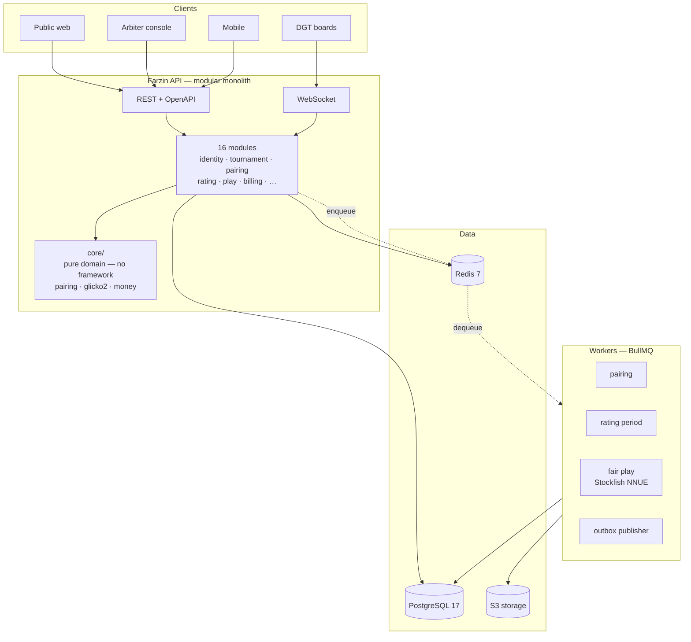

<div align="center">

# Farzin

**The chess infrastructure of Uzbekistan**

Tournament management · National rating · Online play · School chess — on one platform.

[](./docs/14-roadmap.md)
[](./docs/)
[](https://nestjs.com/)
[](https://www.typescriptlang.org/)
[](https://www.postgresql.org/)
[](./LICENSE)

[Technical spec](./docs/) · [Architecture](./docs/02-architecture.md) · [Decisions](./docs/adr/) · [Roadmap](./docs/14-roadmap.md)

</div>

---

> ### ⚠️ Project status: specification and scaffold
>
> **This is not a working product yet.** The repository currently contains a complete technical
> specification (~22,000 lines), the data model, architecture decision records, and a NestJS
> scaffold with domain skeletons. The pairing engine and rating system are **specified in full
> but not implemented** — they are the next milestone.
>
> Read [`docs/14-roadmap.md`](./docs/14-roadmap.md) for what exists and what does not.
> I would rather say this plainly than have you discover it on line three of `swiss-dutch.engine.ts`.

---

## Why this exists

Uzbekistan won gold at the 2022 Chess Olympiad. Nodirbek Abdusattorov is a world top-10 player.
Chess is taught in schools under a state program. The interest is real.

The infrastructure is not.

Tournaments are paired using **Swiss-Manager** — Windows-only desktop software written in Austria,
no cloud, no mobile, no Uzbek language. Registration happens in Telegram groups. Results are
screenshotted into channels. There is no online national rating database — a player who wants to
know their rating has to ask someone.

It works. It does not scale, it is not transparent, and when a result is disputed there is no audit
trail to check.

Farzin connects that chain into one system: a player registers and pays → an arbiter pairs the round
→ results are entered → ratings update automatically → everything is public and auditable.

## What makes it technically interesting

This is not a CRUD app. The hard parts are genuinely hard:

| Problem | Why it's difficult |
|---|---|
| **[FIDE Dutch Swiss pairing](./docs/05-pairing-engine.md)** | Dozens of FIDE criteria applied in strict lexicographic order. Modelled as maximum weight matching on a general graph (Edmonds' blossom, O(V³)). Weights must be `BigInt` — 16 criteria overflow a 53-bit mantissa and fail **silently**. |
| **[Glicko-2 rating](./docs/06-rating-system.md)** | Iterative volatility solver (Illinois method). A wrong implementation produces *plausible* numbers, drifts the whole system, and raises no error. |
| **[Server-authoritative clock](./docs/07-realtime-and-clock.md)** | Monotonic time (`hrtime.bigint()`, never `Date.now()` — NTP jumps break it), bounded lag compensation, flag-fall vs insufficient material. |
| **[Fair play detection](./docs/08-fair-play.md)** | Engine correlation and timing analysis. Probabilistic, never proof — a false positive damages a real person's career. |
| **[Double-entry ledger](./docs/09-payments-and-billing.md)** | Money as `BigInt` in tiyin. Idempotent webhooks. `SUM(debit) === SUM(credit)` as an enforced invariant. |

## Architecture

Modular monolith — the boundaries are enforced by CI, not by intention ([ADR-0001](./docs/adr/0001-modular-monolith.md)).



**The central rule:** `core/` — the pairing engine, Glicko-2, money — imports neither NestJS nor
Prisma. It is plain TypeScript. That code is the most valuable and longest-lived part of the system;
rewriting it because an ORM changed would be foolish. `pnpm arch:check` fails the build if anything
violates this.

## Documentation

The spec is the deliverable. It is written to be implementable, not to be impressive.

| | |
|---|---|
| **[Start here](./docs/)** | Index and reading order |
| [Vision & market](./docs/00-vision-and-market.md) | Honest market sizing, competitors, untested assumptions |
| [Architecture](./docs/02-architecture.md) | Modules, layers, event flow, scaling path |
| [Data model](./docs/03-data-model.md) | ER diagram, critical design decisions |
| [ADRs](./docs/adr/) | 8 decisions — what, why, and **at what cost** |
| [Roadmap](./docs/14-roadmap.md) | 11 phases, risk register, honest estimates |

Docs are in **Uzbek** — they are working documents for the team that will build this.
Code and comments are in English.

### On honesty

Every doc carries an *open questions* section. Unverified numbers are marked as such. Every ADR has a
mandatory *negative consequences* section — a decision without a stated cost is a decision that
wasn't thought through. Legal questions are flagged as **blocking questions for a lawyer**, never
answered as advice.

Three things the spec says out loud:

1. **"Millions of users" is not realistic here.** Realistic ceiling: 100–300k registered, 10–30k
   monthly active. Revenue comes from B2B/B2G, not consumers — Lichess is free and Chess.com has a
   20-year head start. Farzin does not compete there.
2. **The biggest risk is not technical.** If arbiters won't leave Swiss-Manager, the B2B model
   collapses. That needs five phone calls before it needs any more code.
3. **For one person this is 1.5–2.5 years.** Top risks: burnout, bus factor = 1.

## Tech stack

**Backend** — NestJS 11 · TypeScript 5.7 (strict) · PostgreSQL 17 · Prisma 6 · Redis 7 · BullMQ · Socket.IO · Argon2id · Pino · OpenTelemetry

**Testing** — Jest · Testcontainers (real Postgres, not mocks) · fast-check (property-based) · Supertest · k6

**Chess** — Stockfish 17 (NNUE) · chess.js · PGN/FEN · DGT integration

**Frontend** — specified in [`docs/12-frontend-spec.md`](./docs/12-frontend-spec.md), not yet built.
Next.js 15 · React 19 · TanStack Query · Tailwind 4 · chessground.
**Design is deliberately undecided** — the spec lists the open questions rather than answering them.

## Getting started

### Everything in Docker (no manual steps)

```bash
# Requirements: Docker

git clone https://github.com/Sarvarbek0704/farzin.git
cd farzin
docker compose up -d        # postgres, redis, minio, mailpit, migrate, app, worker
```

That is the whole thing. `migrate` applies the schema and exits, then `app`
and `worker` start:

| URL | What |
|---|---|
| <http://localhost:3000/api/docs> | OpenAPI / Swagger UI |
| <http://localhost:3000/health/ready> | readiness (database + redis) |
| <http://localhost:3000/metrics> | Prometheus scrape endpoint |
| <http://localhost:8025> | Mailpit — every dev email lands here |

The compose file ships dev-only JWT secrets; production takes them from a
secret store (the config layer rejects template/weak keys when
`NODE_ENV=production`).

Optional monitoring stack — Prometheus (with the alert rules from
[`infra/prometheus/`](./infra/prometheus/)), Grafana and Jaeger:

```bash
docker compose --profile observability up -d   # http://localhost:9090
```

### Running the app from source

Useful when you want hot reload:

```bash
# Requirements: Node 22+, pnpm 9+, Docker

pnpm install
cp .env.example .env        # then fill it in — see the comments

docker compose up -d postgres redis mailpit
pnpm db:migrate
pnpm db:seed
pnpm start:dev              # http://localhost:3000/api/docs
pnpm worker:dev             # separate terminal — BullMQ worker
```

```bash
pnpm test:unit          # fast — pure logic
pnpm test:integration   # real Postgres via Testcontainers
pnpm arch:check         # module boundaries (ADR-0001)
pnpm lint && pnpm typecheck
```

## Project history

This repository previously held a student CRUD exercise: 1,824 lines of Express, seven near-identical
controllers, auth middleware commented out, and database credentials committed to source control.

It was deleted, not refactored. The idea was worth keeping; that code was not. The old version
remains in git history at `cc5a29e` for anyone curious about the starting point.

The design here is a direct response to those mistakes — which is why you'll find ADRs arguing
against bcrypt cost 7, against auto-increment IDs, against `sync({ alter: true })`, and against
floats for money.

## License

MIT — see [LICENSE](./LICENSE).

## Author

**Sarvarbek Sodiqov** — [sarvarbek-sodiqov.uz](https://sarvarbek-sodiqov.uz) · [GitHub](https://github.com/Sarvarbek0704)
