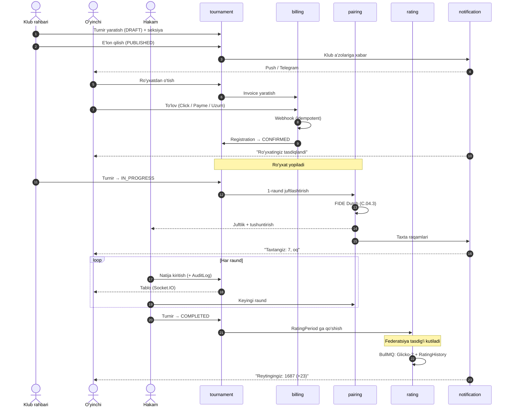
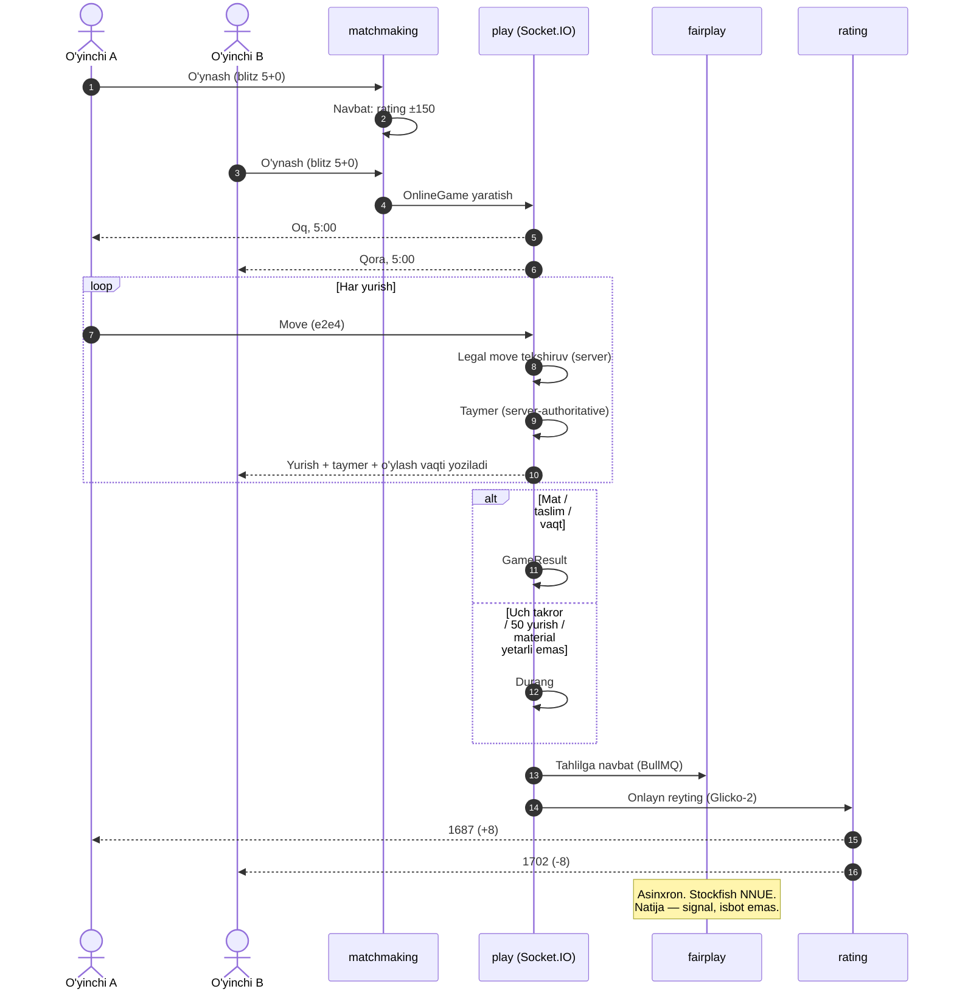
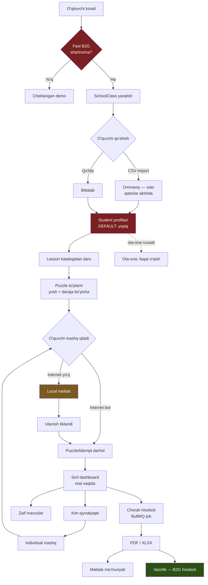

# Farzin — Mahsulot spetsifikatsiyasi

> **Loyiha:** Farzin — O'zbekiston shaxmatining raqamli infratuzilmasi
> **Hujjat:** 01 — Product Specification · **Holat:** Draft v1
> **Muallif:** Sarvarbek Sodiqov · **Kanon:** `CANON.md` (ziddiyat bo'lsa — kanon g'olib)

## 0. Hujjat haqida

Bu yerda arxitektura yo'q (u `02-architecture.md` da). Bu yerda: kim foydalanadi, nima
qilmoqchi, qanday oqim bilan, kim nimaga ruxsatli, qaysi tilda, nimani **qilmaymiz**,
muvaffaqiyatni qanday o'lchaymiz. Raqam to'qib chiqarilmaydi — aniq bo'lmagani yonida
"taxminiy" yoki "tekshirilishi kerak" yoziladi.

| Termin | Ma'nosi |
|---|---|
| OTB | Over-the-board — jonli, taxta ortidagi o'yin |
| Swiss | FIDE Dutch pairing tizimi (C.04.3) |
| Section | Turnir ichidagi reyting/yosh guruhi (`TournamentSection`) |
| Rating period | Glicko-2 hisoblanadigan vaqt oynasi (`RatingPeriod`) |
| Bye / forfeit | Raqibsiz qolgan / kelmagan o'yinchi natijasi |
| B2G | Business-to-Government (maktab / vazirlik shartnomasi) |

---

## 1. Personalar

Har biri uchun: **kim** · **og'rig'i** · **Farzin nima beradi** · **muvaffaqiyat mezoni**.
Tartib tasodifiy emas — birinchi to'rttasi pul zanjirini tashkil qiladi.

### 1.1. Havaskor o'yinchi (18–35, Toshkent)

**Kim.** Talaba yoki IT/xizmat sohasi xodimi. Haftada 2–5 marta telefonda o'ynaydi, yiliga 1–4 klub turniri. Reytingi bor-yo'qligini bilmaydi — milliy baza onlayn emas.

**Og'rig'i.** Turnirni Telegram kanalidan biladi, e'lon kech chiqadi. Ro'yxat — tashkilotchiga yozish, kartaga pul o'tkazish, chek rasmini yuborish; tasdiq noaniq. Jadval — devordagi A4. Turnirdan keyin natija hech qayerda qolmaydi. Chess.com'dagi 1650 ning OTB kuchiga aloqasi tushunarsiz.

**Farzin.** Bitta `Player` profili: Glicko-2 milliy reyting, FIDE ID, turnir tarixi, PGN partiyalar. Kalendar filtr bilan (shahar, sana, vaqt nazorati, start puli). Ro'yxat + Click/Payme/Uzum — 2 daqiqada, chek rasmisiz. Turnir davomida telefonda: keyingi raqib, taxta, ochko. Keyin — avtomatik reyting va Stockfish (WASM) tahlili.

**Mezon.** Ro'yxat + to'lov < 3 daqiqa. Reyting turnir tugagach < 24 soat. Telegram kanaliga qarash shart emas. "Chek rasmini yubor" — hech qachon.

### 1.2. Yosh sportchi va uning ota-onasi

Bu **ikki kishilik bitta persona** — qaror qabul qiluvchi (ota-ona) va foydalanuvchi (bola) bir emas.

**Kim.** *Bola:* 8–16 yosh, haftada 2–4 mashg'ulot, yiliga 5–15 turnir. *Ota-ona:* 30–45 yosh, shaxmatni bilmaydi; pul to'laydi, turnirga olib boradi, natija kutadi.

**Og'rig'i.** Ota-ona: "bolam yaxshi o'ynayaptimi?" — javob faqat murabbiyning og'zaki fikri; progress ko'rsatkichi yo'q. Zalga kirish taqiqlangan (to'g'ri qoida, lekin ma'lumot ochligi qoladi). Jadval o'zgarsa xabar kechikib keladi. Sarflangan pul va natija orasida bog'liqlik ko'rinmaydi. Bola: eski partiyalari saqlanmaydi; mashq — qog'oz varaq yoki telefon rasmi.

**Farzin.** `PARENT` roli bolaning profiliga bog'lanadi — **faqat o'qish**: reyting grafigi, turnir tarixi, keyingi sana. Turnir davomida joriy natija va keyingi raund — push (FCM) yoki SMS (Eskiz). Murabbiy bergan `Lesson`/`Puzzle` ilovada, bajarilgani `PuzzleAttempt` da. Reyting grafigi tushunarli tilda ("so'nggi 3 oyda +47"). Ota-ona partiyalarni ko'radi, lekin **hech kimga yozisha olmaydi** (§4.3).

**Mezon.** Ota-ona murabbiyga so'ramasdan javobni ilovadan oladi. Xabar raund boshlanishidan **oldin** keladi. Bola istalgan eski partiyasini 3 tap ichida ochadi.

### 1.3. Murabbiy / trener

**Kim.** 25–55 yosh, FM/CM yoki tajribali o'yinchi. 10–40 shogird. Daromadi — soatbay.

**Og'rig'i.** Shogirdlar, to'lovlar, davomat — daftarda yoki Excel'da. 30 kishining zaif tomonini eslab qolish imkonsiz. Mashq berish — pozitsiyani rasmga olib Telegram'ga tashlash, bajarilgani noaniq. Turnirda shogirdlarini qog'ozdan qidirish. Yangi shogird — faqat og'zaki tavsiya.

**Farzin.** `Coach` profili (unvon, narx, sharhlar) → marketplace orqali shogird oqimi. Shogird ro'yxati: reyting trendi, oxirgi 10 partiya, zaif mavzu ("endgame — 42%"). `Lesson` va puzzle to'plami tayinlash → bajarilgani avtomatik ko'rinadi. Turnirda "mening shogirdlarim" filtri. To'lov — `Payment` orqali, naqd kuzatuvi shart emas.

**Mezon.** Progress ko'rish uchun Excel ochilmaydi. Mashq tayinlash < 1 daqiqa. Marketplace orqali oyiga 1 yangi shogird — **tasdiqlanmagan gipoteza**, likvidlik paydo bo'lgach o'lchanadi.

### 1.4. Klub rahbari

**Kim.** 30–60 yosh, klub direktori. 50–500 a'zo, 2–8 murabbiy, yiliga 4–20 turnir. **Farzinning asosiy to'lovchi mijozi** (Club SaaS obunasi).

**Og'rig'i.** A'zolar — Excel; kim to'lagan — boshqa Excel. Turnir: e'lon (Telegram) → ro'yxat (Forms) → to'lov (karta) → juftlashtirish (Swiss-Manager, Windows, bitta noutbukda) → natija (Chess-Results'ga qo'lda). Har qadam alohida vosita. Swiss-Manager Windows-only, pullik, cloud emas — turnir kuni o'sha noutbuk buzilsa turnir to'xtaydi, backup — flash disk. Klub daromadi va o'sishi bo'yicha hisobot yo'q. Homiy so'raydi: "turniringizni necha kishi ko'rdi?" — javob yo'q.

**Farzin.** `Club` + `ClubMembership` — a'zolik, muddat, obuna bir joyda. Turnir yaratish → ro'yxat → to'lov → juftlashtirish → natija → reyting **bitta oqimda**, brauzerda; noutbuk buzilsa telefondan davom etadi. FIDE Dutch pairing server tomonda — litsenziya yo'q, Windows yo'q. Start puli avtomatik yig'iladi (`Invoice`, `Payment`). Dashboard: faol a'zo, oylik daromad, o'sish. Broadcast → homiyga ko'rsatiladigan raqam.

**Mezon.** Turnirni noldan e'longa 10 daqiqada. Juftlashtirish uchun maxsus kompyuter kerak emas. Oylik daromad hisoboti — 1 klik. Swiss-Manager litsenziyasi to'lanmaydi (to'g'ridan-to'g'ri tejash).

### 1.5. Turnir hakami (arbiter)

**Kim.** 25–65 yosh, FIDE yoki milliy toifa. Turnirning **qonuniyligi** javobgari; kichik turnirlarda juftlashtiruvchi ham. Juftlashtirish xatosi butun turnirni bekor qilishi mumkin.

**Og'rig'i.** Swiss-Manager juftlik beradi, lekin **nima uchun** shunday chiqqanini tushuntirmaydi — o'yinchi "nega yana oq bilan?" desa javob berish qiyin. Natijani qog'ozdan kompyuterga ko'chirish — qo'lda, xato manbai. Apellyatsiya og'zaki, protokol qog'ozda, keyin yo'qoladi. Bye/forfeit hisobi qo'lda → ochko jadvalida xato.

**Farzin.** Hakam paneli (`arbiter`). Juftlashtirish **tushuntirish bilan**: qaysi kriteriy ishlagani (C.1 takror uchrashuv yo'q, C.2 rang balansi), transposition/exchange qadamlari. Bu Swiss-Manager'da yo'q va hakam uchun eng qimmatli narsa. Natija: taxta raqami → natija; yoki o'yinchi kiritadi, hakam tasdiqlaydi. `Appeal` rasmiy yoziladi — qaror va sabab saqlanadi. Bye/forfeit — bir klik, ta'siri avtomatik. Har amal `AuditLog` da.

**Mezon.** Juftlashtirishni o'yinchiga ekrandan o'qib tushuntira oladi. Raund natijasi to'lgach keyingi juftlashtirish < 5 s. Qog'oz protokol saqlanmaydi. Har bir qaror keyinchalik tekshirilishi mumkin.

### 1.6. Federatsiya xodimi

**Kim.** Milliy yoki viloyat federatsiyasi xodimi: reyting ro'yxati, unvonlar, rasmiy kalendar, terma jamoa. Davlat organiga hisobot beradi. **B2G shartnomani shu persona imzolaydi.**

**Og'rig'i.** Milliy reyting bazasi **onlayn emas** — hisoblash davriy, qo'lda, Excel'da. Natijalar klublardan har xil formatda keladi (Excel, PDF, rasm, qog'oz). "O'zbekistonda nechta faol o'yinchi bor?" — aniq javob yo'q. FIDE'ga yuborish uchun ma'lumot har safar qo'lda. Viloyat kesimidagi hisobotga hafta ketadi.

**Farzin.** `Federation → Region → Club` — butun mamlakat bitta strukturada. Milliy Glicko-2 **avtomatik**: turnir tasdiqlanadi → `RatingPeriod` yopiladi → BullMQ job → `RatingHistory`. Excel yo'q. Rasmiy kalendar. `Title` boshqaruvi (GM/IM/FM/CM va milliy unvonlar) — kim berdi, qachon, qaysi normadan. Hisobot va eksport (`analytics`): viloyat/yosh/gender kesimi, faol o'yinchi dinamikasi → CSV/XLSX/PDF. FIDE formatida eksport (**tekshirilishi kerak:** hozirgi rating report va `TRF16`/`TRF(x)` spetsifikatsiyasi aniqlanishi kerak).

**Mezon.** "Nechta faol o'yinchi bor?" — 1 klik, real vaqtda. Reyting Excel'da hisoblanmaydi, umuman. Yuqori tashkilotga hisobot — daqiqalar, soatlar emas.

### 1.7. Maktab shaxmat o'qituvchisi

**Kim.** Umumta'lim maktabi o'qituvchisi, davlat dasturi bo'yicha shaxmat darsi beradi. Ko'pincha **shaxmatchi emas** — jismoniy tarbiya yoki boshlang'ich sinf o'qituvchisi, qisqa kurs o'tgan. 3–8 sinf × 25–35 o'quvchi = 100–250 bola. Eng ko'p ishlatadigan, eng kam texnik tayyorgarlikka ega persona.

**Og'rig'i.** 200 bolaning progressini kuzatish imkonsiz; jurnal — qog'oz. O'zi shaxmatni chuqur bilmaydi → nima o'rgatishni bilmaydi (metodika bor, qog'ozda). 30 daftarni tekshirish. Ma'muriyatga hisobot qo'lda, hech kim o'qimaydi. Kompyuter sinfi bor, lekin internet sekin yoki yo'q; bolalarning ko'pida telefon yo'q.

**Farzin.** `School → SchoolClass → Student` — sinf yaratish, CSV import. Tayyor `Lesson` va yosh bo'yicha puzzle to'plami — o'qituvchi kontent yaratmaydi, **tanlaydi**. Dashboard: kim qancha bajardi, kim qiynalyapti, o'rtacha progress. Avtomatik hisobot (B2G shartnomasining moddasi). **Offline-tolerant rejim — shart, xohish emas:** internet uzilsa mashq local'da bajariladi, tiklanganda sinxronlanadi (texnik yechim `02-architecture.md` da). Telefonsiz sinf: o'qituvchi bitta kompyuterdan boshqaradi.

**Mezon.** Shaxmatni bilmasa ham darsni o'tkaza oladi. 200 o'quvchi bitta ekranda. Hisobot avtomatik — hech narsa yozmaydi. 3G da ishlaydi.

### 1.8. Tomoshabin / muxlis

**Kim.** Shaxmatga qiziqadi, o'zi o'ynamaydi. Nodirbek Abdusattorov o'ynasa ko'radi, 2022 Olimpiada oltinini eslaydi. **Pul to'lamaydi**, lekin homiy uchun auditoriya — bilvosita daromad.

**Og'rig'i.** Mahalliy turnirni jonli ko'rish imkoni yo'q; natija ertasiga Telegram'da. Chess24/Lichess mahalliy turnirlarni ko'rsatmaydi. "Bugun qanday turnir bor?" — javob yo'q.

**Farzin.** Jonli tablo (`broadcast`): DGT taxtadan real vaqtda barcha taxtalar. Ochiq kalendar — ro'yxatsiz. Ochiq o'yinchi profili (maxfiylik sozlamalari doirasida). `SPECTATOR` roli — ro'yxatdan o'tmagan ham asosiy narsani ko'radi.

**Mezon.** Ro'yxatsiz jonli turnirni ko'radi. Yurish tabloda **ataylab kechiktirilgan** holda ko'rinadi (`08-fair-play.md` §7). SEO: "toshkent shaxmat turniri" qidiruvida Farzin chiqadi (Next.js SSR).

### 1.9. Kim to'laydi

Sakkiz personadan **pul faqat to'rttasidan keladi**: klub rahbari (SaaS obuna), federatsiya xodimi va maktab o'qituvchisi orqali vazirlik (B2G), murabbiy (marketplace komissiyasi). Havaskor va yosh sportchi start puli beradi — bu tashkilotchi yig'imidan olinadigan komissiya, asosiy daromad emas. Ota-ona to'laydi, lekin bola nomidan. Tomoshabin umuman to'lamaydi — u homiy uchun auditoriya, ya'ni bilvosita qiymat.

Bu — `CANON.md` §2 dagi "daromad B2C'dan emas, B2B/B2G'dan" tezisining personalar tilidagi ifodasi va §7.2 dagi shimoliy yulduz tanlovining sababi.

---

## 2. User story'lar

Format: **Men `<persona>` sifatida, `<maqsad>` uchun, `<harakat>` qilmoqchiman.** Bu to'liq backlog emas — **skelet**; har modul implementatsiya paytida kengaytiradi.

### 2.1. `identity` — auth, RBAC, sessiya

> Men **havaskor o'yinchi** sifatida, **turnirga tez ro'yxatdan o'tish** uchun, **telefon raqamim orqali hisob yaratmoqchiman.**

- **Given** ro'yxatdan o'tmaganman, raqamim `+998901234567` · **When** raqamni kiritib SMS kod (Eskiz) bilan tasdiqlayman · **Then** `User` yaratiladi, `PLAYER` roli beriladi, `Session` ochiladi, access (~15 min) + refresh (~30 kun) token beriladi
- **And** refresh ishlatilganda **yangi refresh** beriladi (rotatsiya), eskisi bekor bo'ladi
- **And** allaqachon ishlatilgan refresh qayta kelsa — o'g'irlik belgisi: o'sha foydalanuvchining **barcha** sessiyalari bekor qilinadi
- **And** parol o'rnatilsa **Argon2id** bilan hash qilinadi (bcrypt emas); hash hech qachon Pino log'iga yoki API javobiga tushmaydi

### 2.2. `player` — o'yinchi profili

> Men **havaskor o'yinchi** sifatida, **reytinglarimni bir joyda ko'rish** uchun, **FIDE ID'mni bog'lamoqchiman.**

- **Given** menda FIDE ID bor · **When** uni kiritaman · **Then** format validatsiya qilinib `Player.fideId` ga yoziladi
- **And** milliy Glicko-2 va FIDE Elo **alohida** ko'rsatiladi — bu ikki xil tizim, chalkashtirilmaydi
- **And** ID boshqa `Player` da bo'lsa: `FIDE_ID_ALREADY_LINKED` + qo'llab-quvvatlashga murojaat (avtomatik ko'chirish yo'q — qo'lda tekshiriladi)
- **And** ota-ona bog'lanish so'rovi klub (`CLUB_ADMIN`) yoki murabbiy tomonidan tasdiqlanishi shart; tasdiqlangach **faqat o'qish** huquqi beriladi

### 2.3. `org` — federatsiya / viloyat / klub

> Men **federatsiya xodimi** sifatida, **yagona struktura** uchun, **ierarxiyani boshqarmoqchiman.**

- **Given** men `FEDERATION_ADMIN` roliman · **When** `Region` yaratib unga `Club` biriktiraman · **Then** `Federation → Region → Club` saqlanadi, o'zgarish `AuditLog` da
- **And** klubni arxivlaganimda `deletedAt` qo'yiladi, lekin uning turnirlari va reyting tarixi **saqlanadi** — tarixni o'chirish mumkin emas

### 2.4. `tournament` — turnir, seksiya, ro'yxat

> Men **klub rahbari** sifatida, **tez e'lon qilish** uchun, **turnir yaratmoqchiman.**

- **Given** men `CLUB_ADMIN` roliman va klubimda faol `Subscription` bor · **When** turnir yarataman (nom, sana, vaqt nazorati, raund soni, start puli) · **Then** `Tournament` `DRAFT` da yaratiladi; kamida bitta `TournamentSection` majburiy
- **And** "E'lon qilish" → `PUBLISHED`: kalendarda ko'rinadi, ro'yxat ochiladi, klub a'zolariga notification
- **And** faol `Subscription` bo'lmasa: `SUBSCRIPTION_REQUIRED`, turnir `DRAFT` da qoladi

> Men **havaskor o'yinchi** sifatida, **qatnashish** uchun, **ro'yxatdan o'tmoqchiman.**

- **Given** turnir `PUBLISHED`, ro'yxat ochiq, joy bor · **When** ro'yxatdan o'taman · **Then** `Registration` `PENDING_PAYMENT` da yaratiladi
- **And** 60 daqiqada to'lanmasa avtomatik bekor bo'ladi (BullMQ delayed job), joy bo'shaydi
- **And** seksiya chegarasi `< 1600`, reytingim `1750` bo'lsa: `RATING_LIMIT_EXCEEDED` + mos seksiya taklifi

### 2.5. `pairing` — Swiss, round-robin, knockout

> Men **hakam** sifatida, **adolatli juftlashtirish** uchun, **raundni FIDE Dutch bo'yicha juftlashtirmoqchiman.**

- **Given** oldingi raund natijalari to'liq kiritilgan · **When** juftlashtirishni ishga tushiraman · **Then** C.04.3 bo'yicha juftlik chiqadi va **hech bir** absolyut kriteriy buzilmaydi (C.1 takror uchrashuv yo'q, C.2 rang balansi)
- **And** 100 o'yinchi uchun < 5 s (maqsad; blossom matching'dan keyin benchmark bilan tekshiriladi)

> Men **hakam** sifatida, **o'yinchiga tushuntirish** uchun, **juftlik sababini ko'rmoqchiman.**

- **Given** juftlashtirish yakunlangan · **When** juftlik yonidagi "?" ni bosaman · **Then** ko'raman: score group, S1/S2 bo'linishi, transposition/exchange qadamlari, rang tanlash sababi, downfloat bo'lgan-bo'lmagani
- **And** bu `Pairing` yozuvida saqlanadi — keyinchalik ham tushuntirilishi mumkin
- **And** raundda toq son (15 o'yinchi) bo'lsa: FIDE qoidasi bo'yicha eng past score group'dagi, hali bye olmagan o'yinchiga bye beriladi; `GameResult` `BYE` turi bilan yoziladi, ochko beriladi, reytingga **ta'sir qilmaydi**

### 2.6. `rating` — Glicko-2 + FIDE oynasi

> Men **federatsiya xodimi** sifatida, **ishonchli milliy reyting** uchun, **hisob avtomatik bo'lishini istayman.**

- **Given** turnir `COMPLETED` va federatsiya tomonidan tasdiqlangan · **When** `RatingPeriod` yopiladi · **Then** BullMQ job Glicko-2 hisoblaydi: rating, RD (deviation), volatility (sigma); har o'yinchi uchun `RatingHistory` yoziladi
- **And** hisob **idempotent** — job qayta ishga tushsa natija o'zgarmaydi
- **And** o'yinchi 1 yil o'ynamagan bo'lsa RD **oshadi** (Glicko-2: noaniqlik vaqt bilan ortadi), reyting o'zgarmaydi
- **And** qayta hisob so'ralsa eski `RatingHistory` **o'chirilmaydi** — `supersededAt` bilan belgilanadi, yangi yozuv qo'shiladi

### 2.7. `arbiter` — hakam paneli, natija, apellyatsiya

> Men **hakam** sifatida, **turnirni tez yuritish** uchun, **natijani kiritmoqchiman.**

- **Given** raund davom etmoqda · **When** taxta raqami + natija (1-0 / 0-1 / ½-½) kiritaman · **Then** `GameResult` yoziladi, tablo Socket.IO orqali darhol yangilanadi; `AuditLog`: kim, qachon, qaysi taxta, qanday natija
- **And** tuzatsam eski qiymat log'da qoladi; keyingi raund juftlashtirilgan bo'lsa ogohlantirish: "juftlashtirish qayta hisoblanishi kerak"

> Men **o'yinchi** sifatida, **adolat** uchun, **apellyatsiya bermoqchiman.**

- **Given** hakam qarori menga nisbatan chiqdi · **When** apellyatsiya beraman (matn + dalil) · **Then** `Appeal` `SUBMITTED` da yaratiladi, `CHIEF_ARBITER` ga notification
- **And** muddat — natija e'lonidan 30 daqiqa (reglamentda sozlanadi; **FIDE qoidalari bilan solishtirilishi kerak**)

### 2.8. `play` — onlayn o'yin

> Men **havaskor o'yinchi** sifatida, **tez o'ynash** uchun, **o'z darajamdagi raqib topmoqchiman.**

- **Given** blitz 5+0 tanladim · **When** "O'ynash" bosaman · **Then** matchmaking reytingim ±150 oralig'ida qidiradi; 30 s da topilmasa ±300 gacha kengayadi; topilgach `OnlineGame` yaratiladi

> Men **o'yinchi** sifatida, **adolatli o'yin** uchun, **taymer to'g'ri ishlashini istayman.**

- **Given** o'yin davom etmoqda · **When** yurish qilaman · **Then** vaqt **server tomonda** hisoblanadi (client ko'rsatkichi — faqat ko'rinish), Fischer increment qo'shiladi, lag kompensatsiyasi qo'llanadi (algoritm `02-architecture.md` da)
- **And** internetim uzilib 60 s da qaytmasam vaqt o'tadi va mag'lub bo'laman; 60 s ichida qaytsam holat tiklanadi
- **And** uch marta takrorlanish da'vo qilsam server `Move` tarixidan tekshiradi va durang e'lon qiladi

### 2.9. `broadcast` — jonli tablo, DGT

> Men **tomoshabin** sifatida, **turnirni kuzatish** uchun, **jonli tabloni ko'rmoqchiman.**

- **Given** turnir DGT bilan jihozlangan, broadcast yoqilgan · **When** turnir sahifasini ochaman · **Then** barcha taxtalarni jonli ko'raman; ro'yxatdan o'tish **shart emas**
- **And** reglamentda fair-play kechikishi yoqilgan bo'lsa yurish **15 daqiqa kechikib** ko'rinadi, sababi sahifada ochiq yozilgan
- **And** DGT aloqasi 10 s uzilsa taxta "aloqa yo'q" deb belgilanadi, oxirgi pozitsiya qoladi, hakamga signal boradi

### 2.10. `fairplay` — anti-chit

> Men **hakam** sifatida, **turnir halolligi** uchun, **shubhali o'yinchi haqida shikoyat bermoqchiman.**

- **Given** xatti-harakat shubhali · **When** `FairPlayReport` yarataman · **Then** report fair-play komissiyasi navbatiga tushadi
- **And** o'yinchiga **hech qanday** avtomatik cheklov qo'llanmaydi
- **And** onlayn o'yin tugagach avtomatik tahlil skor hisoblab `FairPlaySignal` yozadi; skor yuqori bo'lsa ham **avtomatik ban yo'q** — faqat qo'lda ko'rib chiqishga yuboriladi (`08-fair-play.md`)

### 2.11. `training` — puzzle, dars, murabbiy

> Men **havaskor o'yinchi** sifatida, **kuchimni oshirish** uchun, **puzzle yechmoqchiman.**

- **Given** tizimdaman · **When** "Puzzle" ni ochaman · **Then** reytingimga mos `Puzzle` beriladi; har urinish `PuzzleAttempt` da yoziladi (to'g'ri/xato, vaqt)
- **And** puzzle reytingim Glicko-2 bilan yangilanadi — o'yin reytingidan **alohida**
- **And** murabbiyim puzzle to'plami yoki `Lesson` tayinlasa menga notification keladi, bajarilishi uning panelida real vaqtda ko'rinadi

### 2.12. `school` — sinf, o'quvchi progressi

> Men **maktab o'qituvchisi** sifatida, **sinfni boshqarish** uchun, **o'quvchilarni qo'shmoqchiman.**

- **Given** men `SCHOOL_TEACHER` roliman, maktabimda faol B2G shartnoma bor · **When** `SchoolClass` yaratib CSV import qilaman · **Then** har qator uchun `Student` yaratiladi; noto'g'ri qatorlar alohida ko'rsatiladi, import to'liq to'xtamaydi
- **And** o'quvchi 18 yoshdan kichik bo'lgani uchun profil **default yopiq** — faqat o'qituvchi, ota-ona va maktab ma'muri ko'radi; ochiq reyting ro'yxatida ko'rinmaydi
- **And** hisobot ochsam ko'raman: bajarilgan mashqlar, o'rtacha to'g'rilik, zaif mavzular, faol/nofaol o'quvchilar → PDF/XLSX eksport (vazirlik hisoboti uchun)

### 2.13. `billing` — Click/Payme/Uzum, obuna

> Men **havaskor o'yinchi** sifatida, **ro'yxatimni tasdiqlash** uchun, **start pulini to'lamoqchiman.**

- **Given** `Registration` `PENDING_PAYMENT`, summa 50 000 so'm · **When** Click orqali to'layman · **Then** `Payment` yaratiladi, provayder webhook kutiladi; `SUCCESS` bo'lsa `Registration` → `CONFIRMED`
- **And** webhook **idempotent** — bir xil `transactionId` ikki marta kelsa bir marta ishlanadi
- **And** turnir bekor qilinsa `Payment` → `REFUNDED`, summa provayder orqali qaytariladi
- **And** summalar `NUMERIC(14,2)` + `currency`, ichki hisob tiyinda (BIGINT) — FLOAT hech qachon

### 2.14. `notification` — SMS, push, Telegram, email

> Men **ota-ona** sifatida, **raundni o'tkazib yubormaslik** uchun, **xabar olmoqchiman.**

- **Given** bolam turnirda, keyingi raund 30 daqiqadan keyin · **When** raund vaqti yaqinlashadi · **Then** push (FCM) yuboriladi; yetkazilmasa SMS (Eskiz) fallback
- **And** kanal tanlovim sozlamalarda saqlanadi
- **And** bir voqea uchun bir kanaldan **faqat bir marta** xabar (deduplikatsiya)

### 2.15. `analytics` — hisobot, eksport

> Men **federatsiya xodimi** sifatida, **hisobot** uchun, **viloyat kesimidagi statistikani ko'rmoqchiman.**

- **Given** men `FEDERATION_ADMIN` roliman · **When** hisobot so'rayman (davr, viloyat, yosh, gender) · **Then** BullMQ job hisoblaydi — og'ir so'rov, sinxron emas
- **And** tayyor bo'lgach notification + S3 havolasi (24 soat amal qiladi)

### 2.16. `admin` — back-office, audit, feature flag

> Men **SUPER_ADMIN** sifatida, **xavfsiz reliz** uchun, **funksiyani bosqichma-bosqich yoqmoqchiman.**

- **Given** yangi funksiya feature flag ortida · **When** flagni faqat bitta klub uchun yoqaman · **Then** funksiya faqat o'sha klub foydalanuvchilariga ko'rinadi; flag o'zgarishi `AuditLog` da
- **And** `AuditLog` da ko'raman: aktor, amal, resurs, eski qiymat, yangi qiymat, IP, vaqt
- **And** `AuditLog` **append-only** — o'chirib yoki o'zgartirib bo'lmaydi

---

## 3. Asosiy foydalanuvchi oqimlari

### 3.1. Turnir hayot sikli

Markaziy oqim. Bugun klub rahbari uchun 4 xil vosita kerak bo'lgan jarayon (Telegram + Forms + karta o'tkazma + Swiss-Manager + Chess-Results) — Farzin buni bittaga siqadi.



1. **To'lov ro'yxatni bloklaydi, turnirni emas.** `PENDING_PAYMENT` 60 daqiqada bekor — joyni band qilib to'lamaydigan foydalanuvchidan himoya.
2. **Juftlashtirish tushuntirish bilan chiqadi** — Swiss-Manager'da yo'q, hakam uchun eng katta qiymat.
3. **Reyting federatsiya tasdig'idan keyin** — ataylab qo'yilgan qo'l tormozi: noto'g'ri o'tkazilgan turnir milliy reytingni buzmasin.
4. **Har bir natija o'zgarishi `AuditLog` da** — turnir natijasi sport hujjati.

### 3.2. Onlayn o'yin oqimi



1. **Server-authoritative.** Client taymeri va `chess.js` validatsiyasi — faqat UX uchun; haqiqat serverda, server qayta tekshiradi.
2. **Onlayn reyting OTB reytingidan alohida** — hech qachon aralashtirilmaydi.
3. **Fair-play tahlili o'yindan keyin, asinxron** — Stockfish og'ir; real vaqtda qilish ham qimmat, ham keraksiz.

### 3.3. Maktab oqimi



1. **Offline-tolerant — shart.** Maktabda internet ishonchsiz; mashq internetsiz ishlamasa modul ishlamaydi. Bu — B2G shartnomasining texnik sharti.
2. **Bola profili default yopiq** — huquqiy talab emas, axloqiy qaror.
3. **Hisobot — B2G mahsulotning o'zi.** Vazirlik aynan shuni so'raydi: "dastur ishlayaptimi, isbot qani?"

---

## 4. Rollar va ruxsatlar (RBAC)

| Rol | Kim | Qamrov |
|---|---|---|
| `SUPER_ADMIN` | Platforma operatori | Global |
| `FEDERATION_ADMIN` | Milliy federatsiya xodimi | Bitta `Federation` |
| `REGION_ADMIN` | Viloyat federatsiyasi | Bitta `Region` |
| `CLUB_ADMIN` | Klub rahbari | Bitta `Club` |
| `ARBITER` | Turnir hakami | Biriktirilgan `Tournament` |
| `COACH` | Murabbiy | O'z shogirdlari |
| `SCHOOL_TEACHER` | Maktab o'qituvchisi | O'z `SchoolClass` lari |
| `PLAYER` | O'yinchi | O'z ma'lumoti |
| `PARENT` | Ota-ona | Bog'langan bola (read-only) |
| `SPECTATOR` | Tomoshabin / mehmon | Faqat ochiq ma'lumot |

### 4.1. Ruxsat matritsasi

**C** create · **R** read · **U** update · **D** delete · **—** yo'q · **R\*/U\*** faqat o'z qamrovida / cheklangan maydonlar

| Resurs | SUPER | FED | REGION | CLUB | ARBITER | COACH | TEACHER | PLAYER | PARENT | SPECT |
|---|---|---|---|---|---|---|---|---|---|---|
| `User` | CRUD | R | R\* | R\* | — | — | — | R\*U\* | R\* | — |
| `Session` | RD | — | — | — | — | — | — | R\*D\* | R\*D\* | — |
| `Player` | CRUD | CRU | R\*U\* | R\*U\* | R\* | R\* | R\* | R\*U\* | R\* | R\* |
| `Federation` | CRUD | RU | R | R | R | R | R | R | R | R |
| `Region` | CRUD | CRUD | RU\* | R | R | R | R | R | R | R |
| `Club` | CRUD | CRUD | CRUD\* | RU\* | R | R | R | R | R | R |
| `ClubMembership` | CRUD | R | R\* | CRUD\* | — | R\* | — | R\* | R\* | — |
| `Tournament` | CRUD | CRUD | CRUD\* | CRUD\* | R\*U\* | R | R | R | R | R |
| `TournamentSection` | CRUD | CRUD | CRUD\* | CRUD\* | R\*U\* | R | R | R | R | R |
| `Registration` | CRUD | R | R\* | CRUD\* | R\*U\* | R\* | — | CR\*D\* | R\* | — |
| `Round` | CRUD | R | R\* | CRU\* | CRU\* | R | R | R | R | R |
| `Pairing` | CRUD | R | R\* | R\* | CRU\* | R | R | R | R | R |
| `GameResult` | CRUD | RU | R\* | R\* | CRU\* | R | R | CR\* | R\* | R |
| `RatingPeriod` | CRUD | CRU | R | R | R | R | R | R | R | R |
| `RatingHistory` | R | R | R | R | R | R | R | R\* | R\* | R |
| `Title` | CRUD | CRUD | R | R | R | R | R | R | R | R |
| `Arbiter` | CRUD | CRUD | CRU\* | R | R\* | — | — | R | — | R |
| `Appeal` | CRUD | R | R\* | R\* | R\*U\* | R\* | — | CR\* | R\* | — |
| `OnlineGame` | R | — | — | — | — | R\* | — | CR\* | R\* | R |
| `Move` | R | — | — | — | R\* | R\* | — | CR\* | R\* | R |
| `Puzzle` | CRUD | R | R | R | R | CR | R | R | R | R |
| `PuzzleAttempt` | R | — | — | — | — | R\* | R\* | CR\* | R\* | — |
| `Coach` | CRUD | R | R | RU\* | — | R\*U\* | — | R | R | R |
| `Lesson` | CRUD | R | R | R\* | — | CRUD\* | CR\*U\* | R\* | R\* | — |
| `School` | CRUD | CRUD | CRU\* | — | — | — | R\* | — | — | — |
| `SchoolClass` | CRUD | R | R\* | — | — | — | CRUD\* | R\* | R\* | — |
| `Student` | CRUD | R | R\* | — | — | R\* | CRUD\* | R\* | R\* | — |
| `Subscription` | CRUD | R\* | R\* | R\*U\* | — | — | — | — | — | — |
| `Invoice` | CRUD | R\* | R\* | R\* | — | R\* | — | R\* | R\* | — |
| `Payment` | CRUD | R\* | R\* | R\* | — | R\* | — | CR\* | CR\* | — |
| `AuditLog` | R | R\* | R\* | R\* | — | — | — | — | — | — |
| `FairPlayCase` | CRUD | R | — | — | R\* | — | — | R\* | — | — |

Matritsani o'qish: `AuditLog` da hech kimda `C`/`U`/`D` yo'q — hatto `SUPER_ADMIN` da ham; log tizim tomonidan yoziladi, bu — audit logning butun ma'nosi. `RatingHistory` da hech kimda `U` yo'q — tarix tuzatilmaydi, ustiga yangi yozuv qo'yiladi (`supersededAt`). `ARBITER` ning `Tournament` ustidagi `U*` — faqat holat va raund boshqaruvi; sana yoki start pulini o'zgartira olmaydi. `PARENT` da faqat `Payment` da yozish bor — ota-ona bola nomidan natijaga aralasha olmaydi. `FairPlayCase` ni `CLUB_ADMIN` **ko'rmaydi** — bu bosim manbai bo'lishi mumkin.

### 4.2. Implementatsiya

RBAC ikki qatlamli: **rol** (nima qila oladi) + **scope** (qayerda). Faqat rol yetarli emas — `CLUB_ADMIN` boshqa klubning turnirini o'zgartira olmasligi kerak.

```typescript
// src/modules/identity/rbac/permission.types.ts

export type Role =
  | 'SUPER_ADMIN' | 'FEDERATION_ADMIN' | 'REGION_ADMIN' | 'CLUB_ADMIN'
  | 'ARBITER' | 'COACH' | 'SCHOOL_TEACHER' | 'PLAYER' | 'PARENT' | 'SPECTATOR';

export type Action = 'create' | 'read' | 'update' | 'delete';

/** One member per row of the matrix in §4.1 — kept in lockstep by the contract test. */
export type ResourceType =
  | 'User' | 'Session' | 'Player' | 'Federation' | 'Region' | 'Club'
  | 'ClubMembership' | 'Tournament' | 'TournamentSection' | 'Registration'
  | 'Round' | 'Pairing' | 'GameResult' | 'RatingPeriod' | 'RatingHistory'
  | 'Title' | 'Arbiter' | 'Appeal' | 'OnlineGame' | 'Move' | 'Puzzle'
  | 'PuzzleAttempt' | 'Coach' | 'Lesson' | 'School' | 'SchoolClass' | 'Student'
  | 'Subscription' | 'Invoice' | 'Payment' | 'AuditLog' | 'FairPlayCase';

/** Narrows a role to a concrete subtree. `own` = actor must own the resource. */
export type Scope =
  | { kind: 'global' }
  | { kind: 'federation'; federationId: string }
  | { kind: 'region'; regionId: string }
  | { kind: 'club'; clubId: string }
  | { kind: 'tournament'; tournamentId: string }
  | { kind: 'school'; schoolId: string }
  | { kind: 'own' };

export interface Grant {
  resource: ResourceType;
  actions: readonly Action[];
  /** Restricts writes to a subset of columns. Omitted = all columns. */
  fields?: readonly string[];
}

export interface Actor {
  userId: string;
  assignments: readonly { role: Role; scope: Scope; validUntil?: Date }[];
}
```

§4.1 jadvali kod ichida `POLICY` reestri sifatida yashaydi va `rbac.contract.spec.ts` ikkalasi mos kelishini tekshiradi — jadval eskirsa test qulaydi. Reestrning muhim qatorlari:

```typescript
// src/modules/identity/rbac/policy.registry.ts — excerpt
export const POLICY: Readonly<Record<Role, readonly Grant[]>> = {
  SUPER_ADMIN: [
    { resource: 'User', actions: CRUD },
    { resource: 'Tournament', actions: CRUD },
    // Read-only for EVERYONE, including SUPER_ADMIN:
    { resource: 'AuditLog', actions: R },
    { resource: 'RatingHistory', actions: R },
  ],
  ARBITER: [
    // Can run the tournament, not redefine it.
    { resource: 'Tournament', actions: ['read', 'update'], fields: ['status'] },
    { resource: 'Pairing', actions: CRU },
    { resource: 'GameResult', actions: CRU },
    { resource: 'Appeal', actions: ['read', 'update'], fields: ['status', 'decision'] },
  ],
  PARENT: [
    // Read-only everywhere except paying for the child.
    { resource: 'Player', actions: R },
    { resource: 'RatingHistory', actions: R },
    { resource: 'Payment', actions: CR },
  ],
  // ... remaining roles in the module source
};
```

```typescript
// src/modules/identity/rbac/rbac.service.ts
import { Injectable } from '@nestjs/common';
import { POLICY } from './policy.registry';
import { Action, Actor, ResourceType, Scope } from './permission.types';

/** Hierarchy context for the target row, resolved by the calling module. */
export interface ResourceRef {
  type: ResourceType;
  ownerUserId?: string;
  clubId?: string;
  regionId?: string;
  federationId?: string;
  tournamentId?: string;
  schoolId?: string;
}

@Injectable()
export class RbacService {
  can(actor: Actor, action: Action, resource: ResourceRef, now = new Date()): boolean {
    return actor.assignments.some((a) => {
      if (a.validUntil && a.validUntil < now) return false; // ARBITER expires with the event
      const grant = POLICY[a.role].find((g) => g.resource === resource.type);
      if (!grant?.actions.includes(action)) return false;
      return this.scopeCovers(a.scope, actor.userId, resource);
    });
  }

  /** Columns this actor may write. 'all' = unrestricted; [] = no update right. */
  writableFields(actor: Actor, resource: ResourceRef): readonly string[] | 'all' {
    for (const a of actor.assignments) {
      const grant = POLICY[a.role].find((g) => g.resource === resource.type);
      if (!grant?.actions.includes('update')) continue;
      if (!this.scopeCovers(a.scope, actor.userId, resource)) continue;
      return grant.fields?.length ? grant.fields : 'all';
    }
    return [];
  }

  private scopeCovers(scope: Scope, actorUserId: string, r: ResourceRef): boolean {
    switch (scope.kind) {
      case 'global': return true;
      case 'own': return r.ownerUserId === actorUserId;
      case 'federation': return r.federationId === scope.federationId;
      case 'region': return r.regionId === scope.regionId;
      case 'club': return r.clubId === scope.clubId;
      case 'tournament': return r.tournamentId === scope.tournamentId;
      case 'school': return r.schoolId === scope.schoolId;
    }
  }
}
```

### 4.3. Matritsadan tashqari invariantlar

Jadval hamma narsani ifodalay olmaydi. Quyidagilar kod darajasida majburlanadi:

1. **Voyaga yetmaganlar (< 18).** `Student` va yosh `Player` profillari default yopiq; ochiq ro'yxatda faqat vasiy roziligi bilan. Voyaga yetmaganga to'g'ridan-to'g'ri xabar (DM) yo'q.
2. **Ota-ona hech qachon yozmaydi** — faqat ko'radi va to'laydi.
3. **Manfaatlar to'qnashuvi.** `ARBITER` o'zi qatnashayotgan turnirda hakam bo'la olmaydi — tizim `Registration` va `Arbiter` biriktirmasini tekshirib bloklaydi.
4. **`CLUB_ADMIN` reytingga tegmaydi.** Reyting faqat `rating` moduli tomonidan, `RatingPeriod` yopilishi orqali yoziladi. Qo'lda o'zgartirish hech bir rolda yo'q.
5. **Rol vaqtinchalik bo'lishi mumkin** — `ARBITER` biriktirmasi turnir tugagach tugaydi (`validUntil`).

---

## 5. Ko'p tillilik

| Kod | Til | Alifbo | Ustuvorlik | Kim uchun |
|---|---|---|---|---|
| `uz-Latn` | O'zbek | Lotin | 1 (default) | Asosiy auditoriya, yoshlar, rasmiy alifbo |
| `ru` | Rus | Kirill | 2 | Katta avlod, Toshkent, MDH turnirlari |
| `uz-Cyrl` | O'zbek | Kirill | 3 | 45+ yosh, viloyat, rasmiy hujjatlar |
| `en` | Ingliz | Lotin | 4 | FIDE, xalqaro hakamlar, mehmon o'yinchilar |

### 5.1. Nega o'zbek kirill ham kerak

Rasmiy alifbo lotin — shunda nega kirill?

1. **Avlodlar farqi.** Lotinga o'tish 1993-dan boshlangan, hali tugamagan. 1980-yillargacha maktabni tugatgan avlod kirillda ravon, lotinda sekin o'qiydi. Federatsiya va klublardagi **qaror qabul qiluvchilar** aynan shu avloddan (45–65 yosh) — ya'ni pul to'laydigan persona kirillni afzal ko'rishi ehtimoli yuqori.
2. **Bu rus tili emas.** O'zbek kirill ≠ rus tili. Kirillda o'zbekcha o'qiydigan odam ruscha bilmasligi mumkin — `ru` ni `uz-Cyrl` o'rniga taklif qilish noto'g'ri.
3. **Rasmiy hujjat.** Ba'zi davlat hujjatlari hali kirillda. B2G hisobotlari uchun kirill kerak bo'lishi mumkin (**taxmin** — birinchi shartnomada aniqlanadi).
4. **Narxi past.** `uz-Latn` ↔ `uz-Cyrl` — tarjima emas, **transliteratsiya**. To'rtinchi tilning narxi to'liq tarjima narxi emas.

### 5.2. i18n strategiyasi

**`uz-Latn` — manba til.** Barcha kalitlar unda yoziladi. `uz-Cyrl` — avtomatik transliteratsiya + qo'lda tekshirish. `ru` va `en` — qo'lda tarjima.

Lotin↔kirill orasida deyarli 1:1 moslik bor. *Deyarli* — istisnolar mavjud (`s`+`h` ketma-ketligi `sh` digrafi bilan chalkashadi: "as'hob" ≠ "ashob"). Shuning uchun avtomat **draft** beradi, odam tasdiqlaydi. To'liq avtomatik ishonchli emas — buni yashirmaymiz.

```typescript
// src/common/i18n/locale.types.ts
export const SUPPORTED_LOCALES = ['uz-Latn', 'uz-Cyrl', 'ru', 'en'] as const;
export type Locale = (typeof SUPPORTED_LOCALES)[number];

export const DEFAULT_LOCALE: Locale = 'uz-Latn';
/** The locale all translation keys are authored in. */
export const SOURCE_LOCALE: Locale = 'uz-Latn';
/** Derived from SOURCE_LOCALE by transliteration, not translation. */
export const TRANSLITERATED_LOCALES: readonly Locale[] = ['uz-Cyrl'];

export function isLocale(value: string): value is Locale {
  return (SUPPORTED_LOCALES as readonly string[]).includes(value);
}
```

```typescript
// src/common/i18n/locale.resolver.ts
import { Injectable } from '@nestjs/common';
import { DEFAULT_LOCALE, isLocale, Locale, SUPPORTED_LOCALES } from './locale.types';

@Injectable()
export class LocaleResolver {
  /**
   * Precedence: stored user preference > ?lang= > Accept-Language > default.
   * A stored preference always wins: a Russian-speaking user in Tashkent whose
   * browser reports en-US must not be flipped to English on every request.
   */
  resolve(input: {
    userPreference?: string | null;
    queryParam?: string | null;
    acceptLanguage?: string | null;
  }): Locale {
    if (input.userPreference && isLocale(input.userPreference)) return input.userPreference;
    if (input.queryParam && isLocale(input.queryParam)) return input.queryParam;
    return this.fromAcceptLanguage(input.acceptLanguage) ?? DEFAULT_LOCALE;
  }

  private fromAcceptLanguage(header?: string | null): Locale | null {
    if (!header) return null;
    const ranked = header
      .split(',')
      .map((part) => {
        const [tag, ...params] = part.trim().split(';');
        const q = params.map((p) => p.trim()).find((p) => p.startsWith('q='));
        return { tag: tag.trim(), q: q ? Number.parseFloat(q.slice(2)) : 1 };
      })
      .filter((e) => e.tag.length > 0 && !Number.isNaN(e.q))
      .sort((a, b) => b.q - a.q);

    for (const { tag } of ranked) {
      const exact = SUPPORTED_LOCALES.find((l) => l.toLowerCase() === tag.toLowerCase());
      if (exact) return exact;
      // Bare "uz" with no script subtag → Latin, the official alphabet.
      const base = tag.split('-')[0]?.toLowerCase();
      if (base === 'uz') return 'uz-Latn';
      if (base === 'ru' || base === 'en') return base;
    }
    return null;
  }
}
```

**Kalitlar.** Modul bo'yicha namespace (`tournament.registration.confirmed`), maksimum 3 daraja. Kalit **hech qachon** ingliz matni bo'lmaydi — matn o'zgarsa kalit sinadi. Backend xato **kodi** qaytaradi (`RATING_LIMIT_EXCEEDED`) + i18n kalit; odam o'qiydigan matnni client tanlaydi.

**Plural.** O'zbekchada bitta forma, ruschada uchta (one/few/many). ICU MessageFormat — u har bir til qoidasini o'zi biladi:

```
ru:      "{count, plural, one {# турнир} few {# турнира} many {# турниров}}"
uz-Latn: "{count, plural, other {# turnir}}"
```

### 5.3. Sana, vaqt, raqam

| Nima | `uz-Latn` | `uz-Cyrl` | `ru` | `en` |
|---|---|---|---|---|
| Sana | `15.07.2026` | `15.07.2026` | `15.07.2026` | `Jul 15, 2026` |
| Vaqt | `14:30` | `14:30` | `14:30` | `2:30 PM` |
| Hafta boshi | Dushanba | Душанба | Понедельник | Monday |
| O'nlik / minglik | `,` / bo'shliq | `,` / bo'shliq | `,` / bo'shliq | `.` / `,` |
| Pul | `50 000 so'm` | `50 000 сўм` | `50 000 сум` | `50,000 UZS` |

- DB da **hamma narsa UTC**. `Asia/Tashkent` (UTC+5) — faqat ko'rsatishda. O'zbekistonda yozgi vaqt yo'q, lekin bu kodda qat'iy yozilmaydi (mamlakatlar qoidani o'zgartiradi; xalqaro turnir boshqa zonada bo'lishi mumkin).
- Turnir sanasi **turnir joyi** zonasida ko'rsatiladi, foydalanuvchiniki emas: "10:00 (Toshkent)" — Berlindagi tomoshabin uchun ham.
- Formatlash — `Intl.DateTimeFormat` / `Intl.NumberFormat`. Qo'lda formatlash yo'q. Pul hech qachon `toFixed()` bilan formatlanmaydi.
- `uz-Cyrl` uchun `Intl` qamrovi to'liq bo'lmasligi mumkin — u holda `uz-Latn` formatiga fallback, faqat matn kirillga o'giriladi. (**Node ICU da `uz-Cyrl` qamrovi tekshirilishi kerak.**)

### 5.4. Kontent va ismlar

Interfeys tarjima qilinadi; **foydalanuvchi kiritgan matn — yo'q**. Turnir nomi qaysi tilda kiritilgan bo'lsa shunday qoladi. Istisno: rasmiy federatsiya turnirlari ko'p tilli nomga ega bo'lishi mumkin (`name_uz_latn`, `name_ru`, `name_en`) — faqat `FEDERATION_ADMIN` yaratganlari. Klub turnirlari uchun bitta nom: aks holda har bir klub rahbari 4 marta yozishi kerak bo'ladi, va yozmaydi.

**Ismlar** kirill va lotinda har xil yoziladi ("Абдусатторов" / "Abdusattorov"). `Player` da `fullName` (asosiy, lotin) + `fullNameCyrl` (ixtiyoriy). Qidiruv **ikkalasi bo'yicha** ishlaydi — aks holda kirillda qidirgan hakam o'yinchini topa olmaydi. Bu — real ish holati.

---

## 6. Non-goals — Farzin nima QILMAYDI

Nima qilmasligini bilmagan loyiha hamma narsani qilmoqchi bo'ladi va hech narsani tugatmaydi.

**6.1. Chess.com / Lichess bilan onlayn o'yin bozorida raqobat.** Onlayn o'yin bor, lekin bu **jalb qilish vositasi**, mahsulot emas. Lichess — ochiq kodli, bepul, 15 yillik kod bazasi, dunyo bo'ylab serverlar, ulkan puzzle bazasi. Chess.com — yuzlab xodim va katta kontent mashinasi. O'yin sifati bo'yicha raqobat — resurs isrofi. O'zbek o'yinchisi Lichess'ni tashlab Farzinga o'tmaydi va **o'tishi shart emas** — Farzin unga Lichess bera olmaydigan narsani beradi: milliy reyting, mahalliy turnir, klub a'zoligi, FIDE ID, murabbiy. Onlayn o'yin modulini **yaxshi** qilamiz, **eng yaxshi** emas.

**6.2. Shaxmat dvigateli yozish.** Stockfish ishlatiladi (WASM client'da, NNUE serverda). O'z engine'i — akademik mashq, mahsulot emas. Stockfish GPL-3.0 — litsenziya shartlari `02-architecture.md` da hisobga olinishi kerak.

**6.3. Ijtimoiy tarmoq bo'lish.** Feed yo'q, like yo'q, stories yo'q, erkin DM yo'q. Sabab ikkita: (a) erkin muloqot = moderatsiya jamoasi, bizda yo'q; (b) auditoriyaning katta qismi voyaga yetmaganlar — notanish kattalar bolalarga yozadigan kanal ochish biz ko'tara olmaydigan javobgarlik. Muloqot **strukturali**: murabbiy ↔ shogird (rol orqali tasdiqlangan), hakam ↔ o'yinchi (turnir kontekstida), klub e'lonlari. Boshqa hech narsa.

**6.4. Xalqaro ekspansiya — birinchi bosqichda emas.** Qo'shni bozorlarda o'xshash muammo bor, lekin: to'lov mamlakatga bog'liq (Click/Payme/Uzum — faqat O'zbekiston), reyting/federatsiya qoidalari har xil, til qo'shilishi kerak, sotuv mahalliy aloqa talab qiladi. Arxitektura `Federation` ni ildiz qiladi — bu **imkoniyat qoldirish**, reja emas. Birinchi bosqichda bitta `Federation`.

**6.5. Swiss-Manager formatini to'liq qo'llab-quvvatlash.** Import kerak (eski tarixni ko'chirish), to'liq ikki tomonlama moslik — yo'q: ichki format hujjatlashtirilmagan, versiyadan versiyaga o'zgaradi, teskari muhandislik cheksiz ish. Qo'llab-quvvatlanadi: **PGN**, **TRF** (aniq versiyasi tekshirilishi kerak), **CSV**.

**6.6. Mobil ilova — birinchi relizda emas.** Birinchi reliz — responsive web (Next.js). React Native (Expo) keyingi bosqich. Turnir kuni telefondan foydalaniladi, lekin mobil brauzer buni qoplaydi. Native qiymat beradigan joy — push va offline; push web push bilan qisman mumkin (iOS Safari cheklovlari **tekshirilishi kerak**), offline — maktab moduli uchun, u ham keyingi bosqich. Native = ikki platforma, ikki store reviewi, ikki release sikli — mahsulot tasdiqlanmasdan bu xarajat noto'g'ri.

**6.7. Real vaqtda anti-chit va avtomatik ban.** Tahlil o'yindan **keyin**, asinxron. Avtomatik doimiy ban hech qanday holatda yo'q. Sabab — `08-fair-play.md` §4.

**6.8. Video-translyatsiya va sharh studiyasi.** Broadcast — **taxta va natija** (DGT relay + PGN). Video oqim, kommentator, prodakshn — boshqa biznes. YouTube/Twitch havolasini sahifaga qo'yish mumkin; oqimni o'zimiz uzatish — yo'q.

**6.9. Boshqa o'yinlar (shashka, go, backgammon).** "Farzin" — shaxmat donasi. Domen modeli shaxmatga qat'iy bog'langan (FEN, PGN, Swiss, Elo/Glicko). Boshqa o'yin qo'shish modelni umumlashtirishni talab qiladi — bu shaxmatni yomonlashtiradi. Yo'q.

---

## 7. Muvaffaqiyat metrikalari

### 7.1. Halol chegara

`CANON.md` §2: **"millionlab foydalanuvchi" bu bozorda realistik EMAS.**

Arifmetika: aholi ~37 mln; shaxmat bilan muntazam shug'ullanadigan qism — bir necha foizdan ko'p emas; turnirlarda qatnashadigan faol o'yinchilar — o'n minglar tartibida. Aniq raqam **federatsiya bilan tekshirilishi kerak** — hozircha ochiq baza yo'qligi uchun hech kim bilmaydi. Bu — Farzin hal qiladigan muammolardan biri.

Realistik shift: **100–300k** ro'yxatdan o'tgan, shundan **10–30k** oylik faol (MAU). Quyidagi maqsadlar shu chegara ichida. Biror raqam bundan oshsa — bu maqsad emas, xato.

### 7.2. Shimoliy yulduz: Farzin orqali to'liq o'tkazilgan rasmiy turnirlar (oylik)

"To'liq" = yaratildi → ro'yxat → to'lov → juftlashtirish → natija → reyting. Faqat e'lon qilingan turnir hisoblanmaydi.

Nega bu: (a) **pul keladigan** harakat; (b) qiymatni isbotlaydi — klub Swiss-Manager'ni tashladi; (c) **hiyla bilan oshirib bo'lmaydi** — soxta turnir ma'nosiz, reyting federatsiya tasdig'idan o'tadi; (d) barcha modullarni bir vaqtda tekshiradi.

MAU — shimoliy yulduz **emas**: 10k bepul onlayn o'yinchi 1 ta klub obunasidan kam qiymat beradi. B2C metrikasini ta'qib qilish B2B mahsulotni buzadi.

### 7.3. Bosqichlar

Barcha raqamlar — **maqsad**, prognoz emas. Bozorda ochiq ma'lumot yo'q; birinchi haqiqiy foydalanuvchilardan keyin qayta ko'riladi.

**Bosqich 1 — Pilot (0–6 oy).** Savol: mahsulot ishlaydimi?

| Metrika | Maqsad | Nega shu raqam |
|---|---|---|
| Pilot klublar | 3–5 | Bittasi tasodif, o'ntasi — sotuv (hali sotmayapmiz) |
| To'liq turnirlar | 10–20 | Har klub 3–4 = takrorlanuvchi ishlatish |
| Ro'yxatdan o'tganlar | 500–2 000 | Qatnashchilardan tabiiy o'sish |
| Juftlashtirish xatosi | **0** | Bitta xato = klub qaytmaydi |
| Reyting shikoyati | **0** | Reyting noto'g'ri = butun loyiha ishonchsiz |

**Bosqich 2 — Federatsiya (6–18 oy).** Savol: rasmiy tan olinamizmi?
**Bosqich 3 — Maktab (18–36 oy).** Savol: B2G miqyoslashadimi?

| Metrika | Bosqich 2 | Bosqich 3 |
|---|---|---|
| Shartnoma | 1 milliy yoki 3+ viloyat federatsiyasi — eng qiyin qadam | 50–200 maktab (vazirlik orqali) |
| Faol to'lovchi klublar | 20–40 (asosiy daromad) | — |
| Faol o'quvchilar | — | 10 000–40 000 |
| To'liq turnirlar (oylik) | 30–60 (North Star) | — |
| Ro'yxatdan o'tganlar | 15 000–40 000 | 100 000–300 000 (kanon shifti) |
| MAU | 3 000–8 000 | 10 000–30 000 (kanon shifti) |
| Reyting kechikishi | < 24 soat | < 24 soat |
| Daromad taqsimoti | — | B2B/B2G ≥ 80% — B2C hech qachon asosiy emas |

### 7.4. Sifat metrikalari (o'sishdan muhimroq)

Farzin — infratuzilma. Infratuzilmada ishonch o'sishdan muhim: natija yo'qolsa yoki reyting noto'g'ri hisoblansa, klub qaytmaydi va sabab aytmaydi.

| Metrika | Chegara | Nega |
|---|---|---|
| Turnir kuni uptime | ≥ 99.9% | Turnir kuni tushish = turnir buziladi |
| Juftlashtirish to'g'riligi | 100% | C.04.3 — qonun, "deyarli to'g'ri" yo'q |
| Reyting determinizmi | 100% | Bir xil input → bir xil output, har doim |
| Ma'lumot yo'qolishi | 0 | Turnir natijasi — sport hujjati |
| Juftlashtirish (100 o'yinchi) | < 5 s | Hakam kutmasligi kerak |
| Tablo kechikishi | < 1 s | Natija kiritilgandan tabloga |
| Fair-play false positive | `08-fair-play.md` §9 | Ayblov — obro'ga zarar |

**Uptime haqida.** 99.9% — yiliga ~8.8 soat. Muhimi **qachon**: chorshanba kechasi 2 soat — hech kim sezmaydi; shanba turnir vaqtida 5 daqiqa — falokat. SLO **turnir oynalariga** bog'lanadi, kalendar yiliga emas (aniq ta'rif `02-architecture.md` da).

### 7.5. Anti-metrikalar — ataylab kuzatilmaydi

Bularni yaxshilash mahsulotni buzadi:

- **Ilovada o'tkazilgan vaqt.** Farzin — asbob, o'yin-kulgi emas. Hakam natijani 30 soniyada kiritsa — bu yaxshi. Vaqtni oshirishga urinish = qorong'u pattern.
- **Kunlik seriya (streak).** Bolalarga psixologik bosim; ular allaqachon maktab + to'garak + turnir bilan band.
- **Push ochilishi.** Bu metrikani oshirish = ko'proq push = spam. Push soni **cheklanadi**, oshirilmaydi.
- **Onlayn o'yinlar soni.** Bu Lichess metrikasi, Farzinniki emas (§6.1).
- **Viral koeffitsient.** B2B/B2G da ma'nosiz — klub rahbari klub rahbarini taklif qilmaydi, u raqib.

### 7.6. Muvaffaqiyatsizlik shartlari

Qachon to'xtash yoki burilish kerakligini **oldindan** yozamiz, chunki keyin yozilmaydi:

1. **12 oyda birorta klub ikkinchi turnirni Farzinda o'tkazmasa** — mahsulot ishlamayapti. Bitta turnir — qiziqish, ikkinchisi — qiymat.
2. **18 oyda `pairing` FIDE Dutch'ni to'g'ri qila olmasa** — asosiy wedge yo'q, Farzin "yana bir shaxmat sayti" ga aylanadi.
3. **24 oyda birorta B2B/B2G shartnoma bo'lmasa** — daromad modeli xato (`CANON.md` §2).
4. **Fair-play noto'g'ri ayblov chiqarib, bu ommaga chiqsa** — ishonch yo'qoladi, tiklash yillar oladi. `08-fair-play.md` dagi ehtiyotkorlik shuning uchun qattiq.

---

## 8. Ochiq savollar

Javob yo'q — yashirilmaydi, implementatsiya paytida topilishi kerak.

1. **Milliy reyting va FIDE Elo o'zaro qanday bog'lanadi?** Alohida ko'rsatish qaror qilindi, lekin federatsiya "FIDE'ga yaqin bo'lsin" desa Glicko-2 kalibrlanadi — boshlang'ich reyting va volatility federatsiya bilan kelishilishi kerak.
2. **Turnir qaysi shartda "rasmiy"?** Reytingga ta'sir qilish mezoni (hakam toifasi, minimal qatnashchi, vaqt nazorati) — federatsiya qoidasi, biz o'ylab topa olmaymiz.
3. **B2G da ma'lumot kimga tegishli?** O'quvchi ma'lumoti — Farzinniki, maktabniki yoki vazirlikniki? Shartnomadan **oldin** hal qilinishi kerak; voyaga yetmaganlar ma'lumoti huquqiy maslahat talab qiladi.
4. **Shaxsiy ma'lumot qonuni qanday ta'sir qiladi?** `AuditLog` saqlash muddati, fair-play ma'lumoti, bolalar ma'lumoti — yurist bilan tekshirilishi kerak.
5. **Stockfish GPL-3.0 SaaS uchun nima talab qiladi?** Server tomonda ishlatish odatda tarqatish emas, lekin WASM'ni client'ga yuborish — hisoblanadi. Litsenziya matni bilan tekshirilishi kerak.
6. **DGT protokoli qanday hujjatlashtirilgan?** Qurilma qo'lga olinmasdan aniq yozib bo'lmaydi.
7. **Nechta faol o'yinchi bor?** Hech kim bilmaydi — bu muammoning bir qismi. Farzin ishga tushgach birinchi marta javob bo'ladi.

**Bog'liq hujjatlar:** `CANON.md` (kanon) · `00-vision-and-market.md` (bozor) · `02-architecture.md` (modular monolith, deployment) · `03-data-model.md` (Prisma sxema) · `05-pairing-engine.md` (FIDE Dutch C.04.3) · `06-rating-system.md` (Glicko-2) · `07-realtime-and-clock.md` (taymer, move validatsiya, broadcast) · `08-fair-play.md` (anti-chit) · `adr/0001-modular-monolith.md` (nega mikroservis emas).
