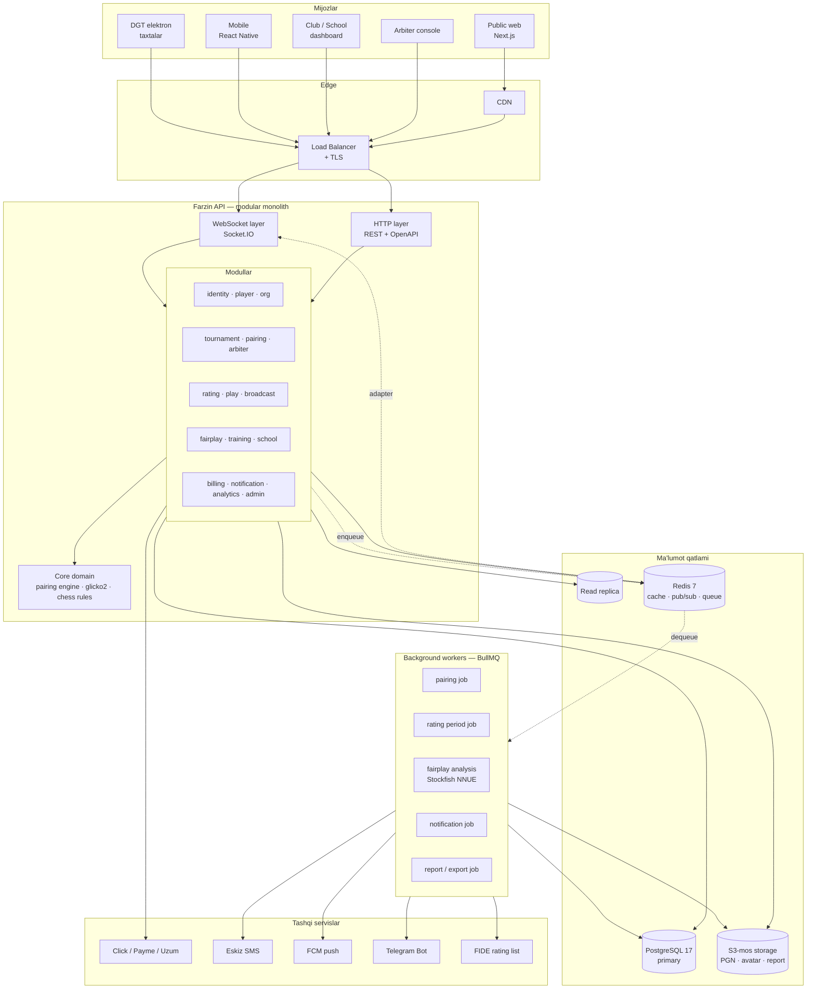
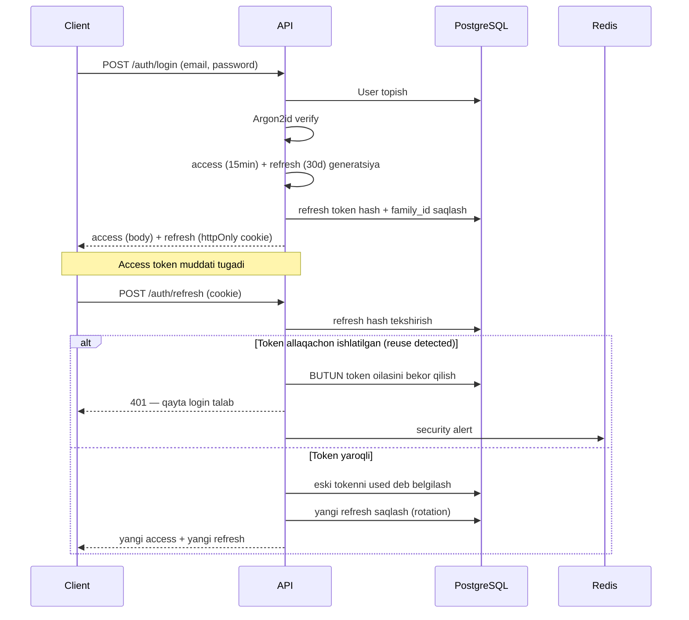
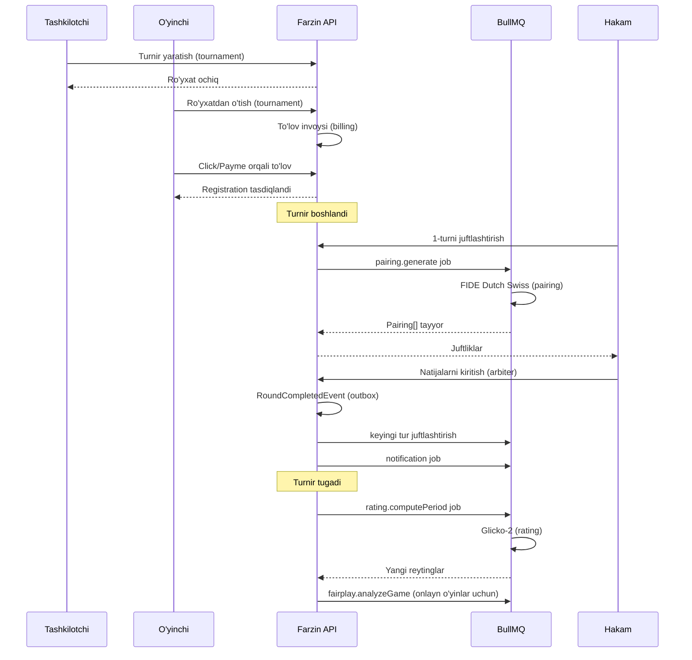

# 02 — Tizim arxitekturasi

> **Hujjat maqomi:** Tasdiqlangan · **Oxirgi yangilanish:** 2026-07-15
> Qarorlar asoslari: [docs/adr/](./adr/)

---

## 1. Arxitektura tamoyillari

Har bir qaror shu beshta tamoyildan kelib chiqadi:

1. **Domen mantiqi infratuzilmadan mustaqil.** Glicko-2 hisobi Prisma haqida bilmasligi kerak. Juftlashtirish algoritmi HTTP haqida bilmasligi kerak. Sabab: bu qismlar eng qimmatli va eng uzoq yashaydi — ularni ORM almashgani uchun qayta yozish ahmoqlik.
2. **Modul chegarasi — kelajakdagi servis chegarasi.** Bugun monolit, ertaga kerak bo'lsa ajratamiz. Chegara bugundan aniq bo'lsin.
3. **Hech qachon mijozga ishonma.** Taymer, yurish, natija, to'lov — hammasi server tomonda tasdiqlanadi.
4. **Hamma o'zgarish audit qilinadi.** Reyting o'zgardi — kim, qachon, nima uchun. Sabab: bu sport, nizolar bo'ladi.
5. **Determinizm — majburiy.** Bir xil input → bir xil output. Juftlashtirish va reyting uchun bu muzokara qilinmaydigan talab.

---

## 2. Umumiy ko'rinish



---

## 3. Nega modular monolith

To'liq asos: [ADR-0001](./adr/0001-modular-monolith.md).

Qisqacha: loyihani bir kishi boshlaydi. Mikroservis bu bosqichda faqat zarar keltiradi — distributed tranzaksiya, servis orasidagi tarmoq xatosi, deploy murakkabligi, kuzatuv qiyinligi. Bularning hech biri hozir hal qilinishi kerak bo'lgan muammo emas.

Lekin monolit "hamma narsa aralashgan" degani emas. Modul chegarasi qat'iy:

- Har bir modul o'z papkasida, o'z `*.module.ts` faylida.
- Modul boshqa modulning **service'iga to'g'ridan-to'g'ri murojaat qilmaydi** — faqat e'lon qilingan public interfeys orqali.
- Modul boshqa modulning **jadvaliga to'g'ridan-to'g'ri SO'ROV YUBORMAYDI**. `tournament` moduli `users` jadvalini o'qimaydi — `identity` modulidan so'raydi.
- Bu qoida ESLint qoidasi bilan majburlanadi (`import/no-restricted-paths`), niyat bilan emas.

Qachon ajratamiz: modul mustaqil masshtablash talab qilsa yoki jamoa 8+ kishiga yetsa. Eng ehtimolli birinchi nomzod — `play` (WebSocket, boshqacha yuklama profili) va `fairplay` (Stockfish, CPU-og'ir).

---

## 4. Qatlamlar

Har bir modul ichida uch qatlam. Bog'liqlik faqat ichkariga qaragan (dependency rule):

```
┌─────────────────────────────────────────────┐
│  Interface layer                            │
│  Controller · Gateway · Job consumer        │  ← HTTP/WS/Queue biladi
├─────────────────────────────────────────────┤
│  Application layer                          │
│  Service · Use case · DTO                   │  ← orkestratsiya, tranzaksiya
├─────────────────────────────────────────────┤
│  Domain layer                               │
│  Entity · Value object · Domain service     │  ← sof mantiq, framework yo'q
└─────────────────────────────────────────────┘
              ↑ port (interface)
┌─────────────────────────────────────────────┐
│  Infrastructure                             │
│  Prisma repo · Redis · Payment adapter      │  ← port implementatsiyasi
└─────────────────────────────────────────────┘
```

**Muhim:** `core/` papkasidagi kod (pairing engine, Glicko-2, chess rules) **NestJS'ni ham, Prisma'ni ham import qilmaydi.** U sof TypeScript. Sabab: bu kodni test qilish uchun DB kerak emas, va uni bir kun kelib alohida npm paketiga ajratish mumkin.

Buni tekshirish uchun CI da arxitektura testi bor (`dependency-cruiser`).

---

## 5. Modul xaritasi

| # | Modul | Mas'uliyat | Bog'liqligi | Ajratish nomzodi |
|---|---|---|---|---|
| 1 | `identity` | auth, RBAC, sessiya, token rotatsiya | — | Yo'q |
| 2 | `player` | o'yinchi profili, FIDE ID | identity | Yo'q |
| 3 | `org` | federatsiya, viloyat, klub | identity | Yo'q |
| 4 | `tournament` | turnir, seksiya, jadval, ro'yxat | org, player | Yo'q |
| 5 | `pairing` | Swiss, round-robin, knockout | tournament | Ehtimol |
| 6 | `rating` | Glicko-2, FIDE oynasi | player, tournament | Ehtimol |
| 7 | `arbiter` | natija kiritish, apellyatsiya | tournament, pairing | Yo'q |
| 8 | `play` | onlayn o'yin, taymer, matchmaking | player | **Ha — birinchi** |
| 9 | `broadcast` | jonli tablo, DGT relay | tournament, play | Ehtimol |
| 10 | `fairplay` | anti-chit tahlili | play, rating | **Ha — CPU og'ir** |
| 11 | `training` | puzzle, dars, murabbiy | player | Yo'q |
| 12 | `school` | sinf, o'quvchi progressi | org, player, training | Yo'q |
| 13 | `billing` | to'lov, obuna, ledger | org, tournament | Yo'q |
| 14 | `notification` | SMS, push, Telegram, email | — | Ehtimol |
| 15 | `analytics` | hisobot, eksport | (read-only) | Yo'q |
| 16 | `admin` | back-office, audit, feature flag | hammasi | Yo'q |

---

## 6. Modullar orasidagi aloqa

Ikki xil aloqa bor va ularni aralashtirmaslik kerak:

### 6.1. Sinxron — to'g'ridan-to'g'ri chaqiruv

Javob darhol kerak bo'lganda. Modul o'zining public interfeysini e'lon qiladi:

```ts
// modules/player/player.port.ts
export interface PlayerPort {
  findById(id: PlayerId): Promise<PlayerSummary | null>;
  findManyByIds(ids: PlayerId[]): Promise<PlayerSummary[]>;
}

export const PLAYER_PORT = Symbol('PLAYER_PORT');
```

`tournament` moduli `PlayerPort` ni inject qiladi, `PlayerService` ni emas. Bu bog'liqlikni interfeysga bog'laydi — implementatsiya bir kun HTTP client'ga aylansa, chaqiruvchi kod o'zgarmaydi.

### 6.2. Asinxron — domain event

Boshqa modul reaksiya qilishi kerak bo'lganda, lekin javob kutilmaydi.

```ts
// core/events/tournament.events.ts
export class RoundCompletedEvent {
  constructor(
    readonly tournamentId: TournamentId,
    readonly roundId: RoundId,
    readonly occurredAt: Date,
  ) {}
}
```

`arbiter` moduli oxirgi natijani qabul qilgach `RoundCompletedEvent` chiqaradi. Kim tinglaydi:
- `pairing` → keyingi turni juftlashtirish job'ini navbatga qo'yadi
- `notification` → o'yinchilarga xabar yuboradi
- `broadcast` → tabloni yangilaydi
- `analytics` → statistikani yangilaydi

`arbiter` bularning hech birini bilmaydi. Yangi tinglovchi qo'shilsa, `arbiter` kodi o'zgarmaydi.

**Muhim ogohlantirish:** NestJS `EventEmitter2` in-process. Ya'ni event **tranzaksiya bilan atomik emas** — DB commit bo'ldi, lekin event handler yiqildi degan holat mumkin. Kritik oqimlar uchun (to'lov, reyting) **transactional outbox pattern** ishlatiladi: event DB ga tranzaksiya ichida yoziladi, alohida worker uni o'qib chiqaradi. Bu murakkablik, lekin pul va reyting uchun majburiy.

Qaysi oqim outbox talab qiladi:
- `PaymentCompletedEvent` → **outbox** (pul)
- `RatingRecomputedEvent` → **outbox** (sport natijasi)
- `RoundCompletedEvent` → **outbox** (juftlashtirishni ishga tushiradi)
- `PlayerProfileUpdatedEvent` → oddiy event yetarli (yo'qolsa dunyo qulamaydi)

---

## 7. Background job'lar

Nima uchun kerak: bir necha operatsiya HTTP so'rovi ichida bajarilishi mumkin emas.

| Job | Nega background | Byudjet | Idempotent? |
|---|---|---|---|
| `pairing.generate` | 500 o'yinchi uchun matching sekundlar oladi | < 2s maqsad | Ha |
| `rating.computePeriod` | Butun davr bo'yicha barcha o'yinchi | Daqiqalar | **Ha — majburiy** |
| `fairplay.analyzeGame` | Stockfish NNUE, CPU og'ir | O'yin uzunligiga bog'liq | Ha |
| `notification.send` | Tashqi API, sekin va ishonchsiz | Retry bilan | Ha |
| `report.export` | Katta ma'lumot, PDF/Excel | Daqiqalar | Ha |
| `fide.sync` | FIDE ro'yxati oyda bir marta | Soatlar | Ha |

**Hamma job idempotent bo'lishi shart.** BullMQ retry qiladi, tarmoq uziladi, worker yiqiladi. Ikki marta bajarilgan job natijani buzmasligi kerak. Bu talab, tavsiya emas.

---

## 8. Ma'lumot qatlami qarorlari

### 8.1. PostgreSQL — yagona asosiy manba

Nega MongoDB emas: ma'lumot qat'iy relyatsion (turnir → tur → juftlik → natija → reyting), tranzaksiya kerak (pul), va murakkab so'rovlar bor (tie-break hisobi). Hujjat bazasi bu yerda faqat muammo qo'shadi.

Batafsil: [ADR-0002](./adr/0002-postgres-primary-store.md).

### 8.2. Redis — nima uchun va nima uchun EMAS

| Ishlatiladi | Ishlatilmaydi |
|---|---|
| Cache (reyting jadvali, turnir ro'yxati) | **Asosiy ma'lumot saqlash** |
| BullMQ navbat backend'i | Pul bilan bog'liq holat |
| Socket.IO adapter (pub/sub) | Audit log |
| Rate limiting hisoblagichi | |
| Matchmaking navbati (sorted set) | |
| Faol o'yin taymeri (`play` moduli) | |

**Faol o'yin taymeri Redis'da** — bu ataylab qilingan qaror. Har bir clock update'ni PostgreSQL'ga yozish bema'nilik (sekundiga minglab yozuv). Taymer Redis'da, o'yin tugagach yakuniy holat PostgreSQL'ga. Xavf: Redis yo'qolsa faol o'yinlar zarar ko'radi. Yumshatish: Redis AOF persistence + har yurishda PostgreSQL'ga yurish yoziladi (taymer emas, yurish). Redis yo'qolsa o'yinni yurishlar tarixidan tiklash mumkin, faqat qolgan vaqt taxminiy bo'ladi.

Bu trade-off ochiq: mукammal emas, lekin real. Batafsil: [07-realtime-and-clock.md](./07-realtime-and-clock.md).

### 8.3. Read replica

Boshida kerak emas. Qachon qo'shiladi: `analytics` va public reyting jadvali asosiy bazani sekinlashtira boshlaganda. O'lchov bilan qaror qilinadi, oldindan emas.

---

## 9. Autentifikatsiya oqimi



Refresh token reuse detection — o'g'irlangan tokenni aniqlashning eng samarali usuli. Batafsil: [10-security.md](./10-security.md).

---

## 10. Turnir oqimi — uchdan-uchgacha

Bu Farzin'ning asosiy oqimi. Barcha modullar shu yerda uchrashadi:



---

## 11. Xatoliklar bilan ishlash

Bitta qoida: **domen xatosi va texnik xato aralashmaydi.**

```ts
// core/errors/domain.error.ts
export abstract class DomainError extends Error {
  abstract readonly code: string;
  abstract readonly httpStatus: number;
}

// modules/pairing/errors/pairing-impossible.error.ts
export class PairingImpossibleError extends DomainError {
  readonly code = 'PAIRING_IMPOSSIBLE';
  readonly httpStatus = 422;

  constructor(readonly roundId: RoundId, readonly reason: string) {
    super(`Round ${roundId} uchun juftlashtirish imkonsiz: ${reason}`);
  }
}
```

Global exception filter `DomainError` ni RFC 9457 (Problem Details) formatiga aylantiradi:

```json
{
  "type": "https://farzin.uz/errors/pairing-impossible",
  "title": "Juftlashtirish imkonsiz",
  "status": 422,
  "code": "PAIRING_IMPOSSIBLE",
  "detail": "Barcha imkoniyatlar tekshirildi, C.1 kriteriysi buzilmasdan juftlik topilmadi",
  "instance": "/api/v1/rounds/019...  /pairings",
  "traceId": "0af7651916cd43dd8448eb211c80319c"
}
```

Kutilmagan xato (`TypeError` va h.k.) — 500 va **hech qachon** ichki detal chiqarilmaydi. Foydalanuvchi `traceId` ko'radi, log'da to'liq stack bor.

---

## 12. API dizayn tamoyillari

- **REST + OpenAPI 3.1.** GraphQL emas — sabab: mijozlar soni oz, so'rovlar oldindan ma'lum, cache oddiy, va OpenAPI'dan frontend tiplari avtomatik generatsiya qilinadi.
- **Versiyalash:** URL prefiksi — `/api/v1/`. Buzuvchi o'zgarish → `/api/v2/`.
- **Pagination:** cursor-based (offset EMAS — katta turnir ro'yxatida offset sekin va noaniq).
- **Idempotentlik:** `POST` uchun `Idempotency-Key` header'i (to'lov va natija kiritishda majburiy).
- **Rate limit:** har bir javob `RateLimit-*` header'lari bilan.

Batafsil: [04-api-spec.md](./04-api-spec.md).

---

## 13. Masshtablash yo'li

Oldindan optimizatsiya qilinmaydi. Har bir qadam o'lchovga asoslanadi.

| Bosqich | Signal | Chora |
|---|---|---|
| 1 | — | Bitta instance, bitta DB |
| 2 | CPU > 70% | API gorizontal scaling (stateless) |
| 3 | WebSocket ko'p | `play` modulini alohida deploy, Redis adapter |
| 4 | Read so'rovlar sekin | Read replica + cache |
| 5 | Stockfish CPU yeyapti | `fairplay` worker'larini alohida node'ga |
| 6 | DB yozuv sekin | Partitioning (`moves`, `audit_logs` — vaqt bo'yicha) |
| 7 | Bitta DB yetmayapti | Modul bo'yicha DB ajratish → mikroservis |

**7-bosqichga hech qachon yetmasligi ehtimoli yuqori.** Bozor hajmi ([00-vision-and-market.md](./00-vision-and-market.md#32-realistik-shift)) buni talab qilmaydi. Bu ro'yxat "kerak bo'lsa yo'l bor" degani, "shu yo'ldan yuramiz" degani emas.

---

## 14. Texnologiya tanlovi — qisqacha asos

| Texnologiya | Nega | Alternativa nega emas |
|---|---|---|
| NestJS | Modul arxitektura, DI, dekorator, o'rnatilgan WS/Swagger/validatsiya | Express — arxitekturani qo'lda qurish kerak; Fastify — ekotizim kichikroq |
| TypeScript strict | Domen murakkab, tip xatosi qimmat | JS — bu hajmda o'zini oqlamaydi |
| Prisma | Type-safe, migration, yaxshi DX | TypeORM — nostabil; Drizzle — yosh, lekin kuzatilsin |
| PostgreSQL | Relyatsion, tranzaksiya, JSONB moslashuvchanlik | MongoDB — tranzaksiya zaif |
| Redis | Cache + queue + pub/sub bitta joyda | Memcached — pub/sub yo'q |
| BullMQ | Redis ustida, TypeScript, retry/backoff | RabbitMQ — ortiqcha infra |
| Socket.IO | Fallback, room, Redis adapter | Raw WS — hammasi qo'lda |
| Argon2id | Memory-hard, GPU'ga chidamli | bcrypt — eskirgan (eski kodda shu edi) |
| Jest + Testcontainers | Real DB bilan test | Mock DB — yolg'on ishonch beradi |

---

## 15. Ochiq savollar

Bular hal qilinmagan va hal qilinishi kerak:

1. **Hosting qayerda?** O'zbekiston ma'lumot lokalizatsiya talabi bor. Yurist tasdig'i kerak. → [11-infrastructure.md](./11-infrastructure.md)
2. **Arbiter console offline ishlashi kerakmi?** Turnir zalida internet zaif bo'ladi. Agar ha — bu arxitekturaga jiddiy ta'sir qiladi (local-first, sync, conflict resolution). → [12-frontend-spec.md](./12-frontend-spec.md)
3. **Rating period uzunligi?** → [06-rating-system.md](./06-rating-system.md)
4. **Bitta o'yin bitta node'ga bog'lanadimi (affinity)?** → [07-realtime-and-clock.md](./07-realtime-and-clock.md)
