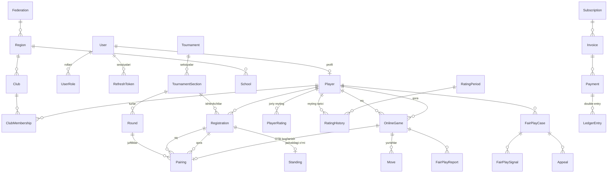

# 03 — Ma'lumotlar modeli

> **Hujjat maqomi:** Tasdiqlangan · **Oxirgi yangilanish:** 2026-07-15
> **Manba fayl:** [`prisma/schema.prisma`](../prisma/schema.prisma) — bu hujjat uni tushuntiradi, almashtirmaydi.
> Ziddiyat bo'lsa **schema.prisma g'olib**.

---

## 1. Konvensiyalar

Bular muzokara qilinmaydi. Har biri sabab bilan.

| Qoida | Sabab |
|---|---|
| Prisma model: `PascalCase`, **birlik** (`TournamentSection`) | TypeScript klass konvensiyasi |
| DB jadval: `snake_case`, **ko'plik** (`tournament_sections`) | PostgreSQL konvensiyasi, SQL yozishda qulay |
| PK: **UUID v7** | Vaqt bo'yicha tartiblanadi → B-tree index fragmentatsiyasi yo'q. Auto-increment INTEGER **emas** — u ma'lumot sizdiradi (raqib nechta turniringiz borligini biladi) va distributed muhitda muammo |
| Har jadvalda `created_at`, `updated_at` | Debug va audit |
| Soft delete: `deleted_at` | Faqat muhim entity'larda. Hamma joyda emas — `moves` uchun bema'nilik |
| Pul: **`BigInt`, tiyinda** | Float pul uchun **jinoyat**. `0.1 + 0.2 !== 0.3` |
| Vaqt: `@db.Timestamptz(3)` | Har doim timezone bilan. O'zbekiston `Asia/Tashkent`, lekin DB da UTC |
| Reyting: `Decimal`, Float emas | Glicko-2 determinizmi. Float platformaga qarab farq qilishi mumkin |

### 1.1. Nega UUID v7, UUID v4 emas

UUID v4 tasodifiy → yangi qator index'ning tasodifiy joyiga tushadi → sahifa bo'linishi (page split) → yozuv sekinlashadi va index shishadi.

UUID v7 ning birinchi 48 biti — Unix timestamp (ms). Ya'ni yangi qatorlar index oxiriga ketma-ket tushadi, xuddi auto-increment kabi, lekin ma'lumot sizdirmaydi.

Prisma'da: `@default(uuid(7))` — **Prisma ≥ 5.14** talab qiladi.

### 1.2. Nega pul BigInt va tiyinda

```ts
// ❌ HECH QACHON
const total = 0.1 + 0.2;  // 0.30000000000000004
price: Float

// ✅ Har doim
const totalTiyin: bigint = 10n + 20n;  // 30n
priceAmount: BigInt  // tiyinda: 50000 UZS → 5_000_000n
```

`Decimal` ham ishlaydi, lekin `BigInt` + tiyin oddiyroq: yaxlitlash muammosi umuman yo'q, chunki tiyindan mayda birlik yo'q.

Ko'rsatishda bo'linadi: `5_000_000n / 100n = 50_000 UZS`. Bu **faqat presentation qatlamida**.

---

## 2. Umumiy ER ko'rinishi



---

## 3. Kritik dizayn qarorlari

Bu bo'lim eng muhim. Har biri kelajakdagi xatoni oldini oladi.

### 3.1. `Registration.ratingAtEntry` — reyting muzlatiladi

```prisma
model Registration {
  pairingNumber Int?
  ratingAtEntry Int?   // ← turnir boshlanganda muzlatiladi
}
```

**Muammo:** o'yinchi turnir davomida boshqa turnirda o'ynab reytingi o'zgarishi mumkin. Agar juftlashtirish `PlayerRating` dan joriy qiymatni o'qisa — 3-turdagi juftlashtirishni qayta hisoblaganda **boshqacha natija** chiqadi.

**Yechim:** ro'yxatga olishda reyting snapshot qilinadi. Juftlashtirish **faqat** `ratingAtEntry` dan foydalanadi.

Bu [02-architecture.md](./02-architecture.md#1-arxitektura-tamoyillari) dagi 5-tamoyil (determinizm) ning to'g'ridan-to'g'ri natijasi. Hakam apellyatsiyasida "juftlashtirishni qayta hisoblang" desa, natija bir xil chiqishi **shart**.

`pairingNumber` ham xuddi shunday — turnir boshida beriladi va **o'zgarmaydi**.

### 3.2. `Standing` — denormalizatsiya, lekin haqiqat emas

`Standing` jadvalidagi `points`, `rank`, `tieBreakValues` — bular hisoblangan qiymatlar.

**Haqiqat manbai — `Pairing.result`.** `Standing` faqat tez o'qish uchun cache.

Nomuvofiqlik bo'lsa: `Pairing` g'olib, `Standing` qayta hisoblanadi. CI da shu invariantni tekshiradigan test bor.

Nega umuman denormalizatsiya: turnir jadvalini har so'rovda 500 o'yinchi × 11 tur = 5500 natijadan hisoblash mumkin emas. Tie-break (Buchholz) esa raqiblarning ochkolarini ham talab qiladi → N² murakkablik.

### 3.3. `Standing.colorHistory` va `floatHistory` — massiv

```prisma
colorHistory String[]  // ["WHITE", "BLACK", "WHITE", ...]
floatHistory String[]  // ["NONE", "DOWN", "UP", ...]
```

Bu `Pairing` dan hisoblanishi mumkin edi. Lekin juftlashtirish algoritmi bu ma'lumotni **har bir o'yinchi uchun, har bir taqqoslashda** o'qiydi — 500 o'yinchi uchun bu millionlab so'rov.

Shuning uchun massiv sifatida `Standing` da saqlanadi. Manba baribir `Pairing`.

### 3.4. Reyting: `PlayerRating` (joriy) vs `RatingHistory` (o'zgarishlar)

Ikkita alohida jadval, ataylab:

- `PlayerRating` — **mutable**, joriy holat. Tez o'qiladi (reyting jadvali, juftlashtirish).
- `RatingHistory` — **immutable**, har bir o'zgarish. Hech qachon UPDATE qilinmaydi.

`RatingHistory.inputGames` (JSON) — hisobga kirgan har bir o'yin:

```json
[
  { "opponentId": "019...", "opponentRating": 1720.5, "opponentRd": 62.3, "score": 1.0 },
  { "opponentId": "019...", "opponentRating": 1655.0, "opponentRd": 110.8, "score": 0.5 }
]
```

Nega bu kerak: o'yinchi "reytingim nega 12 ball tushdi?" deb so'raydi. Bu JSON bilan **aniq javob** beriladi. Busiz — javob yo'q.

Va qayta hisoblash uchun ham kerak: natija xato kiritilgan bo'lsa, o'sha davrni aynan bir xil input bilan qayta hisoblab, farqni ko'rsatish mumkin.

### 3.5. Har (environment, timeCategory) uchun alohida reyting

```prisma
@@unique([playerId, environment, timeCategory])
```

`PlayEnvironment`: `OTB` | `ONLINE`
`TimeCategory`: `CLASSICAL` | `RAPID` | `BLITZ` | `BULLET`

Ya'ni bitta o'yinchida **8 tagacha** reyting bo'lishi mumkin.

**Nega OTB va ONLINE ajratilgan:** onlayn o'yinda chit qilish oson. Ularni qo'shsak, onlayn chit qilgan odam OTB milliy reytingini buzadi. Bu reytingning butun ishonchliligini yo'q qiladi.

Bu Chess.com va Lichess ham qiladigan ajratish, va FIDE ham onlayn reytingni alohida yuritadi.

### 3.6. Transactional outbox — nega kerak

```prisma
model OutboxEvent { ... }
```

**Muammo:**

```ts
// ❌ Bu buzuq
await prisma.$transaction(async (tx) => {
  await tx.payment.update({ data: { status: 'PAID' } });
});
eventEmitter.emit('PaymentCompleted', ...);  // ← bu yerda process yiqilsa?
// To'lov PAID, lekin obuna faollashmadi. Mijoz pul to'ladi, xizmat yo'q.
```

**Yechim:**

```ts
// ✅ Atomik
await prisma.$transaction(async (tx) => {
  await tx.payment.update({ data: { status: 'PAID' } });
  await tx.outboxEvent.create({
    data: { eventType: 'PaymentCompleted', aggregateId: paymentId, payload: {...} }
  });
});
// Alohida worker outbox'ni poll qiladi va publish qiladi.
// Process yiqilsa — event outbox'da qoladi, keyin publish bo'ladi.
```

Kafolat: **at-least-once**. Ya'ni event ikki marta kelishi mumkin → **hamma handler idempotent bo'lishi shart**.

Qaysi event'lar outbox talab qiladi — [02-architecture.md §6.2](./02-architecture.md#62-asinxron--domain-event).

### 3.7. `UserRole.scopeType` / `scopeId` — faqat rol yetarli emas

```prisma
model UserRole {
  role      Role
  scopeType String?  // CLUB | REGION | FEDERATION | SCHOOL | TOURNAMENT
  scopeId   String?  // NULL = global
}
```

**Muammo:** `CLUB_ADMIN` roli bor odam **hamma** klubni boshqara olsa — bu jiddiy xavfsizlik teshigi (IDOR).

**Yechim:** rol resursga bog'lanadi. Guard ikki narsani tekshiradi: (1) rol bormi, (2) `scopeId` so'ralayotgan resursga mos keladimi.

Eski `chess` loyihasida bu muammo bor edi — `roleGuard(["Admin"])` faqat rolni tekshirardi.

Batafsil: [10-security.md](./10-security.md).

### 3.8. `Pairing.blackRegistrationId` nullable — bu bye

```prisma
blackRegistrationId String?  // NULL = bye
```

Toq sonli o'yinchi bo'lsa, bittasi juftliksiz qoladi (bye) va avtomatik ochko oladi.

`PairingResult` enum'ida: `BYE_FULL` (1 ochko), `BYE_HALF` (0.5 — so'ralgan bye), `BYE_ZERO` (0).

Kimga bye beriladi — FIDE qoidasi bilan belgilanadi: [05-pairing-engine.md](./05-pairing-engine.md).

### 3.9. `Pairing.pgn` — eski xatoni tuzatish

Eski `chess` loyihasida bu maydon **`png`** deb yozilgan edi (rasm formati!). To'g'risi: **PGN** — Portable Game Notation, shaxmat partiyasi yozuvining standarti.

Kichik detal, lekin domenni bilmaslikni ko'rsatadi. Yangi schema'da to'g'ri.

### 3.10. `Move.positionHash` — uch marta takrorlanish

Shaxmatda bir xil pozitsiya uch marta takrorlansa → durang talab qilish huquqi.

Buni aniqlash uchun har bir pozitsiyaning **Zobrist hash**'i saqlanadi. Yangi yurishdan keyin: `SELECT COUNT(*) FROM moves WHERE game_id = ? AND position_hash = ?` → 3 bo'lsa, durang.

FEN'ni to'g'ridan-to'g'ri solishtirish **noto'g'ri** — FEN da yarim-yurish hisoblagichi bor va u har doim o'zgaradi. Zobrist hash faqat pozitsiyani (dona joylashuvi, rokirovka huquqi, en passant) hisobga oladi.

Batafsil: [07-realtime-and-clock.md](./07-realtime-and-clock.md).

### 3.11. Double-entry ledger — nega `balance` ustuni yetarli emas

```prisma
model LedgerEntry {
  transactionId String
  account       String
  direction     LedgerDirection  // DEBIT | CREDIT
  amount        BigInt
}
```

**Oddiy yondashuv:** `Club.balance` ustuni, to'lov kelganda `balance += amount`.

**Nega buzuq:**
- Balans qayerdan kelgani ma'lum emas
- Xato bo'lsa tuzatib bo'lmaydi (qaysi qiymat to'g'ri?)
- Buxgalteriya bilan solishtirib bo'lmaydi
- Concurrent update → lost update

**Double-entry:** har bir tranzaksiya kamida ikkita yozuv, va `SUM(debit) === SUM(credit)`.

Misol — klub 500 000 UZS obuna to'ladi:

| transactionId | account | direction | amount (tiyin) |
|---|---|---|---|
| `019a...` | `cash.click` | DEBIT | 50 000 000 |
| `019a...` | `revenue.subscription` | CREDIT | 50 000 000 |

Balans hisoblanadi: `SUM(debit) - SUM(credit)` hisob bo'yicha. Saqlanmaydi.

Ledger **immutable** — xato bo'lsa teskari yozuv (reversing entry) qo'shiladi, o'chirilmaydi. Bu buxgalteriyaning 500 yillik qoidasi va sababi bor.

Batafsil: [09-payments-and-billing.md](./09-payments-and-billing.md).

---

## 4. Index strategiyasi

Har bir index — yozuvni sekinlashtiradi. Shuning uchun har biri asoslangan.

| Index | Nega |
|---|---|
| `player_ratings(environment, timeCategory, rating DESC)` | Reyting jadvali — eng ko'p so'raladigan sahifa |
| `pairings(roundId)` | Tur juftliklarini olish — har turda |
| `standings(sectionId, rank)` | Turnir jadvali |
| `moves(gameId, ply)` unique | Yurish tartibi + takror himoyasi |
| `moves(positionHash)` | Uch marta takrorlanish tekshiruvi |
| `outbox_events(status, availableAt)` | Worker poll so'rovi — har sekundda |
| `audit_logs(resourceType, resourceId)` | "Bu turnirda nima o'zgardi?" |
| `puzzles(themes)` GIN | Massiv ichidan qidirish |

**GIN index** `puzzles.themes` uchun: `WHERE themes @> ARRAY['fork']` — massiv ichidan qidirish B-tree bilan ishlamaydi.

---

## 5. Partitioning nomzodlari

Bu jadvallar tez o'sadi va vaqt bo'yicha bo'linishi kerak (hozir emas — o'lchov bilan):

| Jadval | O'sish sababi | Partition kaliti |
|---|---|---|
| `moves` | Har o'yinda ~80 yurish | `created_at` (oylik) |
| `audit_logs` | Har harakat | `created_at` (oylik) |
| `notifications` | Har xabar | `created_at` (oylik) |
| `puzzle_attempts` | Har urinish | `created_at` (choraklik) |

Qachon: jadval 50M+ qatorga yetganda yoki so'rov sekinlashganda. **Oldindan emas** — [02-architecture.md §13](./02-architecture.md#13-masshtablash-yoli).

---

## 6. Migration siyosati

- **`prisma migrate dev`** faqat lokal. Prod'da hech qachon.
- **`prisma db push`** — hech qachon, hech qayerda. Migration fayl bo'lishi shart.
- **`sequelize.sync({ alter: true })`** — eski loyihada shu bor edi. Bu prod'da ma'lumot yo'qotadi. Farzin'da bunday narsa yo'q.
- Prod deploy: `prisma migrate deploy`, CI dan.
- **Zero-downtime:** expand-contract pattern. Ustun o'chirish uchun uch deploy kerak:
  1. Kodni ustunsiz ishlaydigan qilish (deploy)
  2. Ustunni nullable qilish (migration)
  3. Ustunni o'chirish (migration)

Batafsil: [11-infrastructure.md](./11-infrastructure.md).

---

## 7. Ma'lumot saqlash muddati

Bu yuridik masala. **Yurist bilan tasdiqlanishi kerak** — quyidagilar taklif, tavsiya emas.

| Ma'lumot | Taklif muddat | Sabab |
|---|---|---|
| Turnir natijalari | **Cheksiz** | Sport tarixi. Reyting shundan hisoblanadi |
| `RatingHistory` | **Cheksiz** | Audit, karyera tarixi |
| `AuditLog` | 3+ yil | Nizolar |
| `LedgerEntry` | Soliq qonuni bo'yicha | **Yurist aniqlaydi** |
| `FairPlayReport` | Ish yopilgandan 2 yil | Ayblov obro'ga ta'sir qiladi |
| `RefreshToken` (expired) | 30 kun | Xavfsizlik tergovlari |
| Voyaga yetmagan profili | Ota-ona so'rasa — darhol o'chirish | **Yurist aniqlaydi** |
| `Move` | Cheksiz | Partiya arxivi qiymatli |

**Bolalar ma'lumoti eng nozik nuqta.** Farzin maktab moduli orqali 7-17 yoshli bolalar bilan ishlaydi. O'zbekiston "Shaxsga doir ma'lumotlar to'g'risida"gi qonuni talablarini yurist bilan aniqlash **majburiy**, kod yozishdan oldin.

---

## 8. Seed ma'lumotlari

Dev muhit uchun ([`prisma/seed.ts`](../prisma/seed.ts)):

1. `Federation` — O'zbekiston (UZB)
2. `Region` — 14 ta ma'muriy birlik (12 viloyat + Toshkent shahri + Qoraqalpog'iston)
3. `User` — har rol uchun bitta test hisobi
4. `Player` — ~50 test o'yinchisi, turli reyting
5. `Club` — 3 ta test klubi
6. `Tournament` — 1 ta tugagan (natijalar bilan), 1 ta ochiq

Seed **idempotent** — `upsert` bilan. Ikki marta ishlatilsa dublikat yaratmaydi.

---

## 9. Ochiq savollar

1. **Jamoaviy turnirlar** — hozirgi schema individual turnirga qurilgan. Jamoa turniri (`TEAM_SWISS`) uchun `Team` va `TeamMember` entity'lari kerak. Faza qaysi? → [14-roadmap.md](./14-roadmap.md)
2. **`multiStageConfig` JSON formati** — ko'p bosqichli vaqt nazorati sxemasi aniqlanmagan → [07-realtime-and-clock.md](./07-realtime-and-clock.md)
3. **FIDE ID sinxronizatsiyasi** — FIDE rasmiy API bermaydi. Ratings ro'yxati XML/ZIP sifatida yuklanadi. Parser kerak → [06-rating-system.md](./06-rating-system.md)
4. **PostGIS kerakmi** — klub/turnir xaritada. Hozircha `Decimal` lat/lng yetarli. "Yaqinimdagi turnirlar" funksiyasi kerak bo'lsa — PostGIS.
