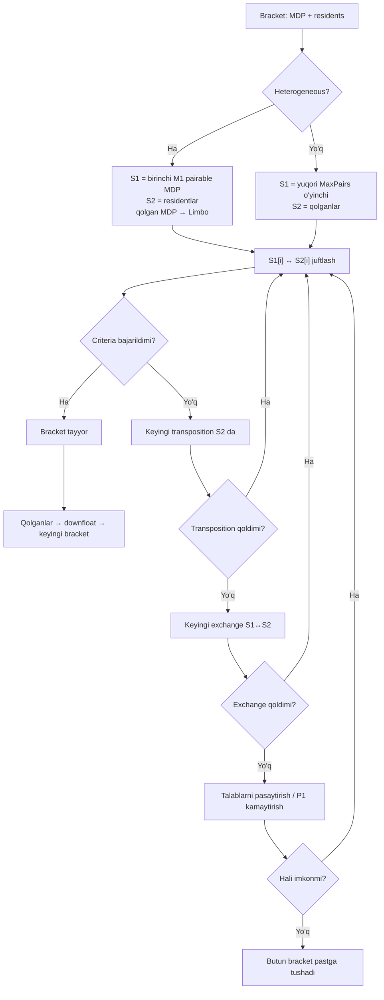
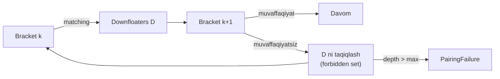
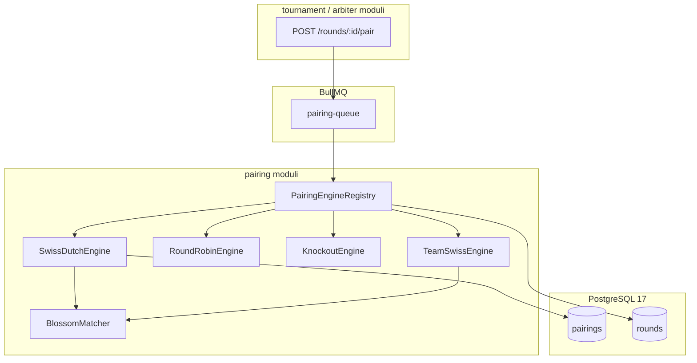
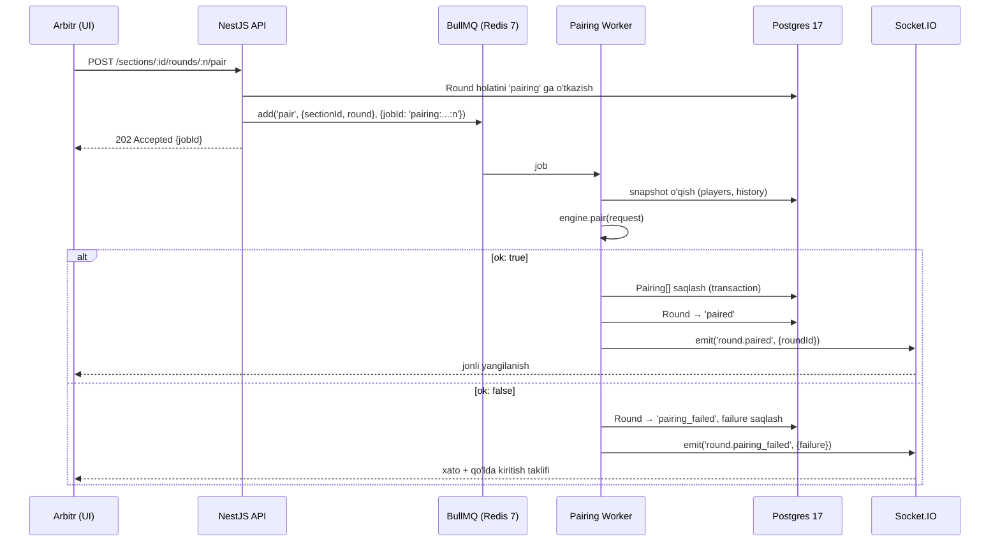

# 05 — Pairing Engine (`pairing` moduli)

> **Status:** Draft v1 · **Modul:** `pairing` (CANON §5, #5) · **Muallif:** Sarvarbek Sodiqov
> **Bog'liq modullar:** `tournament` (turnir/seksiya/round), `arbiter` (natija, bye/forfeit), `rating` (Glicko-2), `player`

Bu hujjat Farzin platformasining juftlashtirish (pairing) dvigatelini tavsiflaydi. Bu
loyihaning eng qiyin texnik qismi (CANON §7.1) — chunki FIDE Dutch tizimi *deklarativ*
qoidalar to'plami bo'lib, ular orasida qat'iy ustuvorlik tartibi bor, va bu qoidalarni
"to'g'ridan-to'g'ri" kod qilib yozish kombinatorik portlashga olib keladi.

---

## 0. Manba va versiya masalasi (BUNI BIRINCHI O'QING)

Bu bo'lim hujjatning qolgan qismini to'g'ri o'qish uchun majburiy.

### 0.1 Tekshirilgan manbalar

Bu hujjat yozilishda quyidagi manbalar bevosita o'qildi:

| Manba | Holat | URL |
|---|---|---|
| C.04.3 FIDE (Dutch) System, **effective 1 February 2026** | **Amaldagi** | `handbook.fide.com/chapter/C0403202602` |
| C.04.3.1 Dutch System, Istanbul 2012 (83rd FIDE Congress) | **Bekor qilingan** | arxiv PDF |
| C.04.1 Basic Rules for Swiss Systems | Amaldagi | `handbook.fide.com` |

### 0.2 MUHIM: numbering o'zgargan — eski manbalarga ishonmang

Internetdagi ko'p tushuntirishlar (va Farzin uchun berilgan dastlabki topshiriq matni ham)
**eskirgan numbering**dan foydalanadi. Amaldagi (1-fevral 2026) hujjat tekshirildi va
haqiqiy struktura quyidagicha:

| Kategoriya | Amaldagi (2026-02) | Topshiriqda taxmin qilingan | Holat |
|---|---|---|---|
| Absolute criteria | `C1`–`C3` | `C.1`–`C.2` | **Farqli** |
| Completion criterion | `C4` | `C.4`–`C.8` | **Farqli** |
| PAB criterion | `C5` | (yo'q) | **Yangi** |
| Quality criteria | `C6`–`C21` | `C.9`–`C.19` | **Farqli** |

Bundan tashqari:

- **Amaldagi hujjat `A`/`B`/`C`/`D`/`E` harf-bo'limlaridan voz kechgan.** U raqamli
  artikullardan foydalanadi: Article 1 (terms/definitions), Article 2 (pairing criteria),
  Article 3 (pairing process, S1/S2), Article 5 (colour allocation). Ya'ni 2012-yilgi
  "E.1–E.5 colour allocation rules" endi **5.2.1–5.2.5**.
- **`PSD` (pairing score difference) atamasi amaldagi hujjatda UCHRAMAYDI.** Bu 2017-yilgi
  redaksiya terminologiyasi edi. Amaldagi matn bir xil g'oyani `C7` orqali ifodalaydi
  (downfloater'lar to'plamining skorlarini kamayish tartibida minimallashtirish).
  **Farzin kodida `PSD` nomini ishlatmaymiz** — chalkashlik manbai bo'ladi.
- 2012-yilgi versiyadagi `B.1`/`B.2` absolute criteria endi `C1`/`C2`/`C3`.

> **Qoida (majburiy):** implementatsiya boshlanishidan oldin bitta muhandis
> `handbook.fide.com/chapter/C0403202602` matnini to'liq o'qib chiqib, quyidagi §2.5
> jadvalini **verbatim quote bilan** to'ldirishi shart. Bu hujjatdagi C6–C21 paraphrase'lari
> ishonchli manbadan olingan, lekin **verbatim emas** — ular spetsifikatsiya emas, yo'l xaritasi.

### 0.3 Referens implementatsiyalar

- **JaVaFo** (Roberto Ricca) — FIDE tomonidan Dutch tizimi uchun referens dastur sifatida
  tan olingan. Farzin uchun **oracle** (golden test manbai) sifatida ishlatiladi.
- **bbpPairings** (Bierema) — ochiq kodli (Apache-2.0), FIDE endorsement'i bor.
  Weighted matching yondashuvidan foydalanadi — bizning arxitekturamizga eng yaqini.

> **Tekshirilishi kerak:** ikkala dasturning endorsement statusi va litsenziyasi
> implementatsiya boshlanishidan oldin FIDE Systems of Pairings and Programs Commission
> (SPP) sahifasidan tasdiqlanishi shart. Litsenziya golden test'da ishlatish uchun muhim.

---

## 1. Juftlashtirish tizimlari umumiy ko'rinishi

Farzin `pairing` moduli bitta tizim emas, **strategiya oilasi**ni qo'llab-quvvatlaydi.
Har bir tizim bir xil port interfeysini (`PairingEngine`, §5.1) implementatsiya qiladi.

### 1.1 Swiss (FIDE Dutch) — asosiy

Ko'p o'yinchi, kam tur. `N` o'yinchi, `R` tur, `R << N`. Hech kim chiqib ketmaydi.
Har turda o'xshash ochkoga ega o'yinchilar uchrashadi.

- **Qachon:** ochiq turnirlar, milliy chempionatlar, maktab turnirlari — Farzin'ning
  asosiy use-case'i. O'zbekistondagi turnirlarning katta qismi shu.
- **Tur soni:** amalda `R ≈ ceil(log2(N))` minimal g'olib aniqlash uchun, lekin real
  turnirlarda 7–11 tur (`N` 50–300 uchun).
- **Murakkablik:** eng yuqori. Butun §2 shu haqda.

### 1.2 Round-robin (Berger jadvali)

Har bir o'yinchi har bir raqib bilan bir marta o'ynaydi. `N` o'yinchi → `N-1` tur
(`N` juft bo'lsa) yoki `N` tur (`N` toq bo'lsa, har turda bittasi bo'sh).

- **Qachon:** kichik, yuqori darajali turnirlar (`N ≤ 14`), final bosqichlari, klub
  chempionatlari.
- **Algoritm:** juftlashtirish **hisoblanmaydi**, u FIDE Handbook **C.04.1**dagi
  **Berger jadvallari**dan (Berger tables) o'qiladi. Bu qat'iy jadval — o'zimizdan
  generatsiya qilish xato bo'ladi, chunki Berger jadvallari rang balansini ham
  ta'minlaydi.
- **Implementatsiya:** jadvallarni statik data sifatida (`berger-tables.ts`) saqlaymiz,
  `N = 3..24` uchun. Test: har bir jadval uchun har bir juftlik aynan bir marta uchraydi
  va rang taqsimoti FIDE jadvaliga bit-for-bit mos.
- **Rang:** `N` toq bo'lganda bo'sh o'yinchi (bye) Berger jadvalining "dummy" pozitsiyasi
  orqali aniqlanadi.

> **Diqqat:** Berger jadvalidagi *tur tartibi* ham ahamiyatli — uni aralashtirib
> bo'lmaydi (rang ketma-ketligi buziladi). Faqat **initial drawing of lots** (o'yinchi →
> jadval raqami) tasodifiy.

### 1.3 Double round-robin

Round-robin ikki marta, ranglar teskari. `2(N-1)` tur.

- **Qachon:** juda kichik turnirlar (`N ≤ 8`), yuqori adolat talab qilinganda
  (masalan, milliy terma tanlov).
- **Implementatsiya:** Berger jadvali ustiga trivial wrapper — ikkinchi aylanada
  ranglarni almashtirish. Alohida engine emas, `RoundRobinEngine` konfiguratsiyasi
  (`legs: 2`).

### 1.4 Knockout (single elimination)

Yutqazgan chiqadi. `ceil(log2(N))` bosqich.

- **Qachon:** kubok formati, blitz/rapid tie-break bosqichlari.
- **Muammolar:** `N` ikkining darajasi bo'lmasa — **bye** birinchi bosqichda yuqori
  seed'larga beriladi (`2^ceil(log2(N)) - N` ta bye).
- **Bracket:** standart seeding (1 vs N, 2 vs N-1, ...) rekursiv.
- **Farzin doirasi:** MVP'da knockout **oddiy** implementatsiya (armageddon/tie-break
  qoidalari `arbiter` moduliga havola qilinadi). Murakkab qism emas.

### 1.5 Scheveningen

Ikki jamoa; A jamoasining har bir a'zosi B jamoasining har bir a'zosi bilan o'ynaydi.
`n` vs `n` → `n` tur, har turda `n` partiya.

- **Qachon:** trening matchlari, yoshlar vs veteranlar, viloyatlararo match.
- **Algoritm:** deterministik jadval (Berger-ga o'xshash konstruksiya), rang balansi
  bilan. Hisoblash emas — jadval.
- **Farzin doirasi:** past prioritet (MVP'dan keyin).

### 1.6 Team Swiss

Swiss, lekin tugun — **jamoa**. Jamoalar Swiss bo'yicha juftlashadi, keyin har juftlikda
board order bo'yicha individual partiyalar tuziladi.

- **Qachon:** klub chempionatlari, viloyat terma jamoalari, maktablar ligasi (B2G
  use-case, CANON §3.2 — muhim).
- **Nozik joylar:**
  - **Match points vs game points** — jamoa skori qaysi biri bo'yicha? Turnir
    reglamentida belgilanadi, ikkalasi ham qo'llab-quvvatlanishi kerak.
  - **Board order** — jamoa ro'yxati turnir boshida qat'iylanadi va o'zgartirib
    bo'lmaydi (reyting bo'yicha kamayish tartibida, tolerance bilan).
  - **Rang** — jamoa darajasida rang beriladi; toq board'lar jamoa rangini, juft
    board'lar teskarisini oladi.
- **Qayta ishlatish:** Swiss yadrosi (score group, float, colour) jamoa darajasida
  ayni o'sha. Shuning uchun `SwissCore` generik qilinadi (`§5.5`).

### 1.7 Tanlov jadvali (qisqa)

| Tizim | O'yinchi soni | Tur soni | Hisoblanadimi? |
|---|---|---|---|
| Swiss (Dutch) | 20–500+ | 5–13 | Ha (murakkab) |
| Round-robin | 3–14 | N−1 / N | Yo'q (Berger jadvali) |
| Double RR | 3–8 | 2(N−1) | Yo'q (Berger ×2) |
| Knockout | 4–128 | ceil(log2 N) | Ha (oddiy) |
| Scheveningen | 2×(3–10) | n | Yo'q (jadval) |
| Team Swiss | 4–100 jamoa | 5–9 | Ha (Swiss yadro) |

---

## 2. FIDE Dutch System — batafsil

Bu bo'lim hujjatning yadrosi. Amaldagi manba: **C.04.3, effective 1 February 2026**.

### 2.1 Terminologiya

Barcha atamalar ingliz tilida qoladi (CANON §1) — kod bilan bir xil bo'lishi uchun.

- **TPN (Tournament Pairing Number)** — o'yinchining turnirdagi juftlashtirish raqami
  (Article 1.1). Boshlang'ich tartiblashdan olinadi (§2.2). Butun turnir davomida
  o'zgarmaydi (kech qo'shilganlar bundan mustasno — §8.3).
- **Score group / scoregroup** — bir xil ochkoga ega o'yinchilar to'plami.
- **Bracket** — aslida juftlashtirilayotgan to'plam: score group + yuqoridan tushgan
  MDP'lar.
- **Homogeneous bracket** — barcha o'yinchilar bir xil ochkoli.
- **Heterogeneous bracket** — tarkibida MDP bor.
- **MDP (moved-down player)** — yuqori bracket'da juftlashmay qolib, pastga tushirilgan
  o'yinchi.
- **S1 / S2** — bracket ikkiga bo'linadi (Article 3.2). Homogeneous bracket'da S1 =
  birinchi `MaxPairs` o'yinchi TPN o'sish tartibida; heterogeneous'da S1 = birinchi `M1`
  ta **pairable MDP**. S2 = qolgan **resident** o'yinchilar.
- **Limbo** — `M1 < M0` bo'lganda S1'ga kirmagan MDP'lar. Ular na S1'da, na S2'da
  (Article 3.2.4). Ular joriy bracket'da juftlashmaydi va pastga tushadi.
- **Resident** — bracket'ning "o'z" o'yinchisi (MDP emas).
- **Floater** — o'z score group'idan tashqarida juftlashgan o'yinchi.
  - **Downfloater** — pastroq ochkoli raqib bilan o'ynagan (yuqori tomondan).
  - **Upfloater** — yuqoriroq ochkoli raqib bilan o'ynagan.
- **Float history** — har o'yinchi uchun oxirgi turlardagi float yo'nalishi. Kamida
  oxirgi 2 tur saqlanadi (C14–C17 shuni talab qiladi).
- **PAB (pairing-allocated bye)** — toq sonli o'yinchi bo'lganda juftlashmay qolgan
  o'yinchiga beriladigan bye. Alohida criterion (`C5`) bilan boshqariladi.
- **Topscorer** — oxirgi tur juftlashtirilayotganda mumkin bo'lgan maksimal ochkoning
  50%dan ko'prog'iga ega o'yinchi.
- **MaxPairs** — bracket'da hosil qilish mumkin bo'lgan maksimal juftlik soni.
- **CD (colour difference)** — oq bilan o'ynagan partiyalar soni minus qora bilan
  o'ynaganlar soni.

> **Farzin qarori:** `PSD` atamasi ishlatilmaydi (§0.2). Kodda `downfloaterScoreProfile`
> deb nomlanadi — `C7` semantikasini aks ettiradi.

### 2.2 Pairing numbers va boshlang'ich tartiblash

TPN turnir boshlanishidan oldin bir marta beriladi (Article 1.1 → C.04.2 General
Handling Rules, Article 2 ga havola).

Tartiblash kaliti (kamayish tartibida ustuvorlik):

1. **Rating** (kamayish tartibida) — qaysi reyting ishlatilishi turnir reglamentida:
   FIDE standard / rapid / blitz, yoki Farzin milliy reytingi (Glicko-2, `rating` moduli).
2. **Title** (kamayish tartibida): GM > IM > WGM > FM > WIM > CM > WFM > WCM > (title yo'q).
3. **Ism** (alifbo tartibida, lotin transliteratsiyasi).

```ts
// src/modules/pairing/domain/initial-order.ts

/** FIDE title ustunlik tartibi. Kattaroq qiymat = yuqoriroq. */
const TITLE_RANK: Readonly<Record<FideTitle, number>> = {
  GM: 8, IM: 7, WGM: 6, FM: 5, WIM: 4, CM: 3, WFM: 2, WCM: 1,
};

export interface InitialOrderEntry {
  readonly playerId: PlayerId;
  readonly rating: number;          // 0 = reytingsiz
  readonly title: FideTitle | null;
  readonly sortName: string;        // lotin transliteratsiyasi, normalize qilingan
}

/**
 * TPN beradi. Natija DETERMINISTIK: bir xil input → bir xil output.
 * Tie bo'lganda `playerId` (UUID v7) oxirgi, total tie-break sifatida ishlatiladi —
 * shunda tenglik hech qachon tasodifiy hal bo'lmaydi.
 */
export function assignPairingNumbers(
  entries: readonly InitialOrderEntry[],
): ReadonlyMap<PlayerId, number> {
  const sorted = [...entries].sort((a, b) => {
    if (a.rating !== b.rating) return b.rating - a.rating;

    const ta = a.title ? TITLE_RANK[a.title] : 0;
    const tb = b.title ? TITLE_RANK[b.title] : 0;
    if (ta !== tb) return tb - ta;

    const byName = a.sortName.localeCompare(b.sortName, 'en');
    if (byName !== 0) return byName;

    // Total order kafolati (§6). Hech qachon tasodif emas.
    return a.playerId.localeCompare(b.playerId);
  });

  return new Map(sorted.map((e, i) => [e.playerId, i + 1]));
}
```

> **Diqqat:** reytingsiz (`rating = 0`) o'yinchilar ro'yxat oxirida. Ba'zi turnirlarda
> reglament bo'yicha ular orasida yosh yoki mahalliy reyting bo'yicha tartiblash bo'lishi
> mumkin — bu **turnir sozlamasi**, engine'ga `sortName` orqali kiritiladi.
>
> **Tekshirilishi kerak:** `localeCompare` ICU versiyasiga bog'liq bo'lishi mumkin →
> determinizm buzilishi xavfi (§6.3). MVP'da `Intl.Collator` bilan qat'iy locale
> (`'en'`, `sensitivity: 'variant'`) va Node ICU versiyasi CI'da pin qilinadi.

### 2.3 Rang boshqaruvi (colour)

Article 1.7 (amaldagi versiyada tekshirildi; semantikasi 2012-yilgi A.7 bilan bir xil).

**Colour difference (CD)** = (oq bilan o'ynalgan partiyalar) − (qora bilan o'ynalgan).
Faqat **haqiqatan o'ynalgan** partiyalar hisoblanadi — bye va forfeit CD'ga ta'sir
qilmaydi (ularda rang yo'q).

| Preference | Shart | Qaysi rang |
|---|---|---|
| **Absolute** | `CD > +1` | black |
| **Absolute** | `CD < -1` | white |
| **Absolute** | oxirgi 2 o'ynalgan tur bir xil rang | teskarisi |
| **Strong** | `CD = +1` | black |
| **Strong** | `CD = -1` | white |
| **Mild** | `CD = 0` | oxirgi o'ynalgan turning teskarisi |
| **None** | hech qanday partiya o'ynalmagan | — |

Absolute preference ikki mustaqil sababdan kelib chiqadi (`CD` chegarasi **yoki**
ketma-ket ikki bir xil rang) — bu ikkalasi ham tekshirilishi shart.

```ts
// src/modules/pairing/domain/colour.ts

export type Colour = 'white' | 'black';
export type ColourPreferenceKind = 'absolute' | 'strong' | 'mild' | 'none';

export interface ColourPreference {
  readonly kind: ColourPreferenceKind;
  /** `kind === 'none'` bo'lganda va faqat shundagina `null`. */
  readonly colour: Colour | null;
}

const opposite = (c: Colour): Colour => (c === 'white' ? 'black' : 'white');

/**
 * @param playedColours FAQAT haqiqatan o'ynalgan partiyalar ranglari, tur tartibida.
 *                      Bye/forfeit bu yerga KIRMAYDI.
 */
export function colourPreference(
  playedColours: readonly Colour[],
): ColourPreference {
  if (playedColours.length === 0) return { kind: 'none', colour: null };

  let cd = 0;
  for (const c of playedColours) cd += c === 'white' ? 1 : -1;

  // Absolute, sabab 1: CD chegaradan chiqqan.
  if (cd > 1) return { kind: 'absolute', colour: 'black' };
  if (cd < -1) return { kind: 'absolute', colour: 'white' };

  // Absolute, sabab 2: oxirgi ikki o'ynalgan tur bir xil rang.
  const n = playedColours.length;
  if (n >= 2 && playedColours[n - 1] === playedColours[n - 2]) {
    return { kind: 'absolute', colour: opposite(playedColours[n - 1]!) };
  }

  if (cd === 1) return { kind: 'strong', colour: 'black' };
  if (cd === -1) return { kind: 'strong', colour: 'white' };

  return { kind: 'mild', colour: opposite(playedColours[n - 1]!) };
}
```

**Colour allocation** — juftlik tuzilgandan keyin kim oq o'ynashini aniqlash.
Amaldagi hujjatda **Article 5.2.1–5.2.5**, kamayuvchi ustuvorlikda:

1. Ikkala o'yinchining preference'ini qondirish (agar ular mos bo'lsa).
2. Kuchliroq preference'ni qondirish (absolute > strong > mild).
3. Ranglarni almashtirish — ular turli rang bilan o'ynagan eng oxirgi turga nisbatan.
4. Yuqori rankdagi (kichikroq TPN) o'yinchining preference'ini qondirish.
5. Birinchi turda / qolgan hollarda: TPN va initial colour qoidasi bo'yicha.

> **Tekshirilishi kerak:** 5.2.5 ning aniq matni. 2012-yilgi E.5 shunday edi:
> "In the first round all even numbered players in S1 will receive a colour different
> from all odd numbered players in S1". Amaldagi 2026 matni "TPN/initial-colour rules"
> deb umumlashtirilgan — **verbatim quote kerak**. Bu birinchi tur uchun kritik.

### 2.4 Absolute criteria — C1, C2, C3

Bu uchtasi **hech qachon** buzilmaydi. Agar buzilmasdan juftlashtirish imkonsiz bo'lsa,
o'yinchi pastga tushiriladi yoki bracket'lar birlashtiriladi — lekin bu criteria
buzilmaydi.

- **C1** — *"Two participants shall not play against each other more than once."*
  Eng oddiy, eng qattiq. Implementatsiya: har o'yinchi uchun `Set<PlayerId>`.
  Forfeit orqali "o'ynalgan" partiya ham uchrashuv hisoblanadi (raqib tayinlangan edi).

- **C2** — bir o'yinchi PAB'ni ikki marta ololmaydi; shuningdek raqib kelmagani uchun
  forfeit g'alaba olgan o'yinchi ham PAB ololmaydi.
  Ya'ni: **o'ynamasdan ochko olgan o'yinchi yana o'ynamasdan ochko olmaydi.**

- **C3** — *non-topscorer*'lar bir xil **absolute** colour preference bilan
  juftlashmaydi.
  **Nega "non-topscorer"?** Chunki oxirgi turda topscorer'lar orasida C3 e'tiborsiz
  qoldirilishi mumkin — turnir g'olibini aniqlash rang balansidan muhimroq.
  Bu C3'ning nozik joyi: u **shartli absolute**.

```ts
/** C1 + C2 + C3 — har bir nomzod juftlik uchun qattiq filtr. */
export function violatesAbsoluteCriteria(
  a: PlayerPairingState,
  b: PlayerPairingState,
  ctx: BracketContext,
): boolean {
  // C1
  if (a.opponentIds.includes(b.playerId)) return true;

  // C3 — faqat ikkalasi ham non-topscorer bo'lganda.
  const bothNonTopscorers = !ctx.isTopscorer(a) && !ctx.isTopscorer(b);
  if (bothNonTopscorers) {
    const pa = colourPreference(a.playedColours);
    const pb = colourPreference(b.playedColours);
    if (pa.kind === 'absolute' && pb.kind === 'absolute' && pa.colour === pb.colour) {
      return true;
    }
  }
  return false;
}

/** C2 — PAB olish huquqi. */
export function canReceivePab(p: PlayerPairingState): boolean {
  return !p.hasScoredWithoutPlaying;
}
```

### 2.5 Completion, PAB va quality criteria — C4–C21

> **OGOHLANTIRISH.** Quyidagi jadval ishonchli manbadan olingan **paraphrase**,
> **verbatim emas**. Implementatsiyadan oldin har bir qatori
> `handbook.fide.com/chapter/C0403202602` bilan solishtirilib, "Verbatim" ustuni
> to'ldirilishi shart. Bu jadval **spetsifikatsiya emas** — u yo'l xaritasi.

| ID | Kategoriya | Paraphrase | Verbatim |
|---|---|---|---|
| C4 | Completion | Qolgan juftlashmagan o'yinchilar uchun C1–C3ni buzmaydigan to'liq juftlashtirish mavjud bo'lishi shart | ☐ |
| C5 | PAB | PAB eng past ochkoli (uni olishga haqli) o'yinchiga beriladi | ☐ |
| C6 | Quality | Juftliklar sonini maksimallashtirish (= downfloater sonini minimallashtirish) | ☐ |
| C7 | Quality | Downfloater to'plamlari orasidan skorlari kamayish tartibida minimal bo'lganini tanlash | ☐ |
| C8 | Quality | Downfloater'larni shunday tanlash-ki, keyingi bracket'da C1–C7 bajarilsin | ☐ |
| C9 | Quality | PAB oluvchining o'ynamagan partiyalari sonini minimallashtirish | ☐ |
| C10 | Quality | `\|CD\| > 2` bo'lgan topscorer/raqiblar sonini kamaytirish | ☐ |
| C11 | Quality | Ketma-ket uch turda bir xil rang holatlarini minimallashtirish | ☐ |
| C12 | Quality | Colour preference'i qondirilgan o'yinchilar sonini maksimallashtirish | ☐ |
| C13 | Quality | **Strong** colour preference'i qondirilganlar sonini maksimallashtirish | ☐ |
| C14 | Quality | O'tgan turda downfloat qilgan resident downfloater'lar sonini minimallashtirish | ☐ |
| C15 | Quality | O'tgan turda upfloat qilgan MDP raqiblari sonini minimallashtirish | ☐ |
| C16 | Quality | Ikki tur oldin downfloat qilganlar sonini minimallashtirish | ☐ |
| C17 | Quality | Ikki tur oldin upfloat qilganlar sonini minimallashtirish | ☐ |
| C18–C21 | Quality | Oxirgi turlardagi turli float kombinatsiyalari uchun skor farqlarini minimallashtirish | ☐ |

Diqqat qilinadigan tuzilma:

- **C6 va C7 birgalikda** — avval juftlik sonini maksimallashtirish, keyin *kim*
  tushishini optimallashtirish. Tartib muhim: kamroq juftlik hech qachon "yaxshiroq
  downfloater" evaziga qabul qilinmaydi.
- **C8 — lookahead.** Bu eng qiyin criterion: joriy bracket qarori keyingi bracket'ni
  buzmasligi kerak. Bu sof lokal optimizatsiyani buzadi (§3.4).
- **C12 vs C13** — avval *umuman* preference, keyin *strong* preference. Ya'ni ikki mild
  preference'ni qurbon qilib bitta strong'ni qondirish **noto'g'ri**.
- **C14–C17 — float history.** Shuning uchun `floatHistory` kamida 2 tur saqlanadi.

### 2.6 S1/S2 bo'linishi, transposition va exchange

Klassik (2012) algoritm bracket'ni S1/S2 ga bo'lib, S1[i] ni S2[i] bilan juftlaydi,
keyin **transposition** va **exchange** orqali variantlarni sinab ko'radi.

**Transposition** — S2 ichidagi tartibni o'zgartirish. S1 tegilmaydi.
2012-yilgi D.1 bo'yicha tartib: eng pastki o'yinchidan boshlab, kamayuvchi ustuvorlikda.
`|S2| = 6` uchun bu **720 ta** permutatsiya (6!).

**Exchange** — S1 va S2 orasida o'yinchi(lar) almashtirish (faqat homogeneous yoki
remainder bracket'da). 2012-yilgi D.2 bo'yicha: almashtirilayotgan raqamlar **farqi**
iloji boricha kichik bo'lishi kerak; teng bo'lsa — S1'ning eng pastki o'yinchisi, keyin
S2'ning eng yuqorisi.



**Nega bu yondashuv Farzin'da to'g'ridan-to'g'ri implementatsiya QILINMAYDI:**

`|S2| = 10` bo'lsa `10! = 3 628 800` transposition. Har biri uchun exchange'lar ustiga
ko'paytiriladi. Katta bracket (masalan, 1-turda hamma 0 ochkoda — `N = 500` bitta
bracket, `|S2| = 250`) — `250!` hisoblab bo'lmaydi.

Klassik algoritm **arbitr uchun qo'lda** yozilgan protsedura. U kompyuter uchun
optimallashtirilmagan. Shuning uchun §3 ga o'tamiz.

> **Muhim nozik jihat:** transposition/exchange tartibi shunchaki "qidiruv tartibi" emas —
> u **natijani aniqlaydi**. Bir nechta juftlashtirish bir xil criteria darajasida teng
> bo'lsa, klassik algoritm *birinchi topilganini* tanlaydi. Weighted matching'ga
> o'tganda bu tie-break'ni **aniq weight** sifatida modellashtirish shart (§3.3),
> aks holda natija JaVaFo'dan farq qiladi va golden test yiqiladi.

### 2.7 Downfloat / upfloat qoidalari

- Bracket'da juftlashmay qolgan o'yinchi(lar) keyingi (pastroq) bracket'ga **downfloat**
  qiladi va u yerda MDP bo'ladi.
- MDP pastroq ochkoli raqib bilan o'ynasa — MDP **downfloater**, raqibi **upfloater**.
- Float tarixi `Round` yozuvida saqlanadi va C14–C17 uchun ishlatiladi.
- **Limbo** — `M1 < M0` bo'lganda ba'zi MDP'lar joriy bracket'da umuman
  juftlashtirilmaydi va yana pastga tushadi.

Amaliy qoida (C14–C17dan kelib chiqadi): **bir o'yinchi ketma-ket ikki turda bir xil
float olishi kerak emas** — lekin bu *quality* criterion, absolute emas. Zarurat
bo'lsa buziladi.

### 2.8 Bye (PAB)

Toq sonli o'yinchi bo'lsa, bitta o'yinchi juftlashmaydi va **PAB** oladi.

- **Kim oladi:** `C5` — eng past ochkoli, uni olishga **haqli** o'yinchi. "Haqli" =
  `C2`ni buzmaydi (avval PAB yoki forfeit-win olmagan).
- **Necha ochko:** turnir reglamentida belgilanadi. FIDE standart amaliyoti — **1 ochko**,
  lekin ko'p turnirlarda **0.5**. Farzin buni `TournamentSection` sozlamasi qiladi:
  `pabPoints: 1 | 0.5`.
- **Rang:** yo'q. PAB CD'ga ta'sir qilmaydi va `playedColours`ga qo'shilmaydi.
- **C9** — PAB oluvchining o'ynamagan partiyalari soni minimallashtiriladi, ya'ni
  imkon qadar hech narsa o'tkazib yubormagan o'yinchiga beriladi.

**PAB ≠ half-point bye.** Ularni chalkashtirmang:

| Tur | Kim beradi | Qachon | Rang | Juftlashtirishga ta'siri |
|---|---|---|---|---|
| **PAB** | Engine | Toq son | Yo'q | Engine hal qiladi |
| **Half-point bye** | Arbitr | O'yinchi oldindan so'raydi | Yo'q | O'yinchi bracket'dan chiqariladi |
| **Zero-point bye** | Arbitr | O'yinchi kelmadi | Yo'q | O'yinchi bracket'dan chiqariladi |

Half/zero-point bye **`arbiter` moduli** mas'uliyati. Engine ularni faqat
**input** sifatida ko'radi (`active: false` yoki `requestedBye`).

---

## 3. Algoritm tanlash

### 3.1 Variant A — naive backtracking (klassik protsedura)

FIDE matnidagi C-protsedurani to'g'ridan-to'g'ri kodlash.

**Plus:** matnga 1:1 mos, o'qish oson, "nega bunday?" savoliga javob berish oson.
**Minus:** worst case `O(|S2|!)`. Katta homogeneous bracket'da (1-tur, yoki ko'p
o'yinchi bir xil ochkoda) amalda ishlamaydi. Timeout — real xavf.

**Xulosa:** rad etiladi. Lekin **test oracle** sifatida saqlanadi (§7.6): kichik
bracket'lar (`|bracket| ≤ 8`) uchun brute-force barcha permutatsiyalarni sanab,
weighted matching natijasi bilan solishtiriladi.

### 3.2 Variant B — weighted bipartite matching (Hungarian)

S1 ↔ S2 ni bipartite graf sifatida ko'rish, Hungarian algoritmi (`O(n³)`).

**Minus — bu YONDASHUV NOTO'G'RI.** Sabab: FIDE Dutch juftlashtirishi
**bipartite emas**. Exchange mexanizmi S1 va S2 orasidagi chegarani buzadi — S1'ning
o'yinchisi S1'ning boshqa o'yinchisi bilan juftlasha oladi (exchange'dan keyin). Ya'ni
bracket ichidagi **har qanday** ikki o'yinchi juftlasha oladi. Bu **general graph
matching**, bipartite emas.

S1/S2 bo'linishi — bu qidiruv *evristikasi*, tuzilma *cheklovi* emas.

### 3.3 Variant C — blossom algoritmi (maximum weight matching) — TANLANDI

**General graph maximum weight matching**, Edmonds' blossom algoritmi.

Model:
- **Tugun (vertex)** = bracket'dagi har bir o'yinchi.
- **Qirra (edge)** = C1–C3ni buzmaydigan har bir mumkin bo'lgan juftlik.
- **Og'irlik (weight)** = bu juftlikning "yaxshiligi", C6–C21 bo'yicha.
- **Natija** = maksimal og'irlikdagi matching.

**Nega blossom:**
1. General graf ustida ishlaydi → exchange muammosi yo'q (§3.2).
2. **Optimallikni kafolatlaydi** — birinchi topilgan yaxshi natijani emas, eng
   yaxshisini beradi. Backtracking'da bu kafolat yo'q.
3. `O(V³)` — `V = 500` uchun ~1.25×10⁸ elementar amal. Real: 2 soniyadan past (§9).
4. bbpPairings ham shu yondashuvni ishlatadi → golden test'da mos kelish ehtimoli
   yuqori.

**Nega C6 (juftlik sonini maksimallashtirish) avtomatik bajariladi:**
Maximum weight matching ≠ maximum cardinality matching. Ammo agar har bir qirraning
og'irligi juda katta bazaviy konstanta (`W_PAIR`) ni o'z ichiga olsa va `W_PAIR`
qolgan barcha criteria yig'indisidan katta bo'lsa, u holda ko'proq qirra tanlash
har doim foydali → **maximum cardinality** avtomatik kafolatlanadi.

### 3.4 Weight funksiyasi — leksikografik tartib

FIDE criteria **leksikografik** ustuvorlikka ega: C6 buzilishi C7–C21ning **barcha**
mumkin bo'lgan yaxshilanishidan yomonroq. Bitta skalyar og'irlikda buni ifodalash uchun
**pozitsion (bazali) kodlash** ishlatiladi:

```
weight(edge) = Σ  B_i × (criterion_i uchun maksimal jarima − haqiqiy jarima)
               i
```

bu yerda `B_i` shunday tanlanadi-ki, `B_i > Σ_{j>i} B_j × max_penalty_j`.

**KRITIK MUAMMO — precision.** JavaScript `number` = IEEE 754 double = **53 bit**
mantissa. 16 ta criterion (C6–C21), har biri kamida 8–10 bit diapazon talab qilsa →
**~130–160 bit** kerak. Double'ga **sig'maydi**. Naive `weight = c6 * 1e12 + c7 * 1e10 + ...`
**jimgina noto'g'ri natija beradi** — bu eng xavfli bug turi, chunki u xato bermaydi.

**Farzin yechimi:** `BigInt` og'irliklar + `BigInt`ni qo'llab-quvvatlaydigan blossom
implementatsiyasi.

```ts
// src/modules/pairing/domain/weight.ts

/**
 * Har bir criterion uchun jarima diapazoni. `maxPenalty` — bracket hajmiga qarab
 * hisoblanadigan yuqori chegara (qat'iy, isbotlanadigan).
 */
export interface CriterionSpec {
  readonly id: string;              // 'C6' | 'C7' | ...
  readonly maxPenalty: bigint;
  readonly penalty: (a: PlayerPairingState, b: PlayerPairingState, ctx: BracketContext) => bigint;
}

/**
 * Leksikografik bazalarni hisoblaydi. `specs` ustuvorlik bo'yicha KAMAYUVCHI tartibda.
 * Kafolat: yuqoriroq criterion'ning 1 birlik jarimasi pastroqlarning
 * BARCHA mumkin bo'lgan jarimalari yig'indisidan qat'iy katta.
 */
export function computeBases(specs: readonly CriterionSpec[]): readonly bigint[] {
  const bases: bigint[] = new Array(specs.length);
  let acc = 1n; // eng past criterion'dan pastdagi "birlik"

  for (let i = specs.length - 1; i >= 0; i--) {
    bases[i] = acc;
    // Keyingi (yuqoriroq) baza = joriy baza × (diapazon + 1) — overflow yo'q, BigInt.
    acc = acc * (specs[i]!.maxPenalty + 1n);
  }
  return bases;
}

export function edgeWeight(
  a: PlayerPairingState,
  b: PlayerPairingState,
  ctx: BracketContext,
  specs: readonly CriterionSpec[],
  bases: readonly bigint[],
): bigint {
  // C6: har qanday juftlik mavjudligining o'zi eng katta qiymat.
  // `bases[0] * (maxPenalty_0 + 1)` — barcha criteria yig'indisidan katta.
  let w = bases[0]! * (specs[0]!.maxPenalty + 1n);

  for (let i = 0; i < specs.length; i++) {
    const spec = specs[i]!;
    const p = spec.penalty(a, b, ctx);
    // Jarima → og'irlik: kam jarima = katta og'irlik.
    w += bases[i]! * (spec.maxPenalty - p);
  }
  return w;
}
```

> **Tekshirilishi kerak:** `maxPenalty` qiymatlari har bir criterion uchun **isbotlanishi**
> shart (bracket hajmi `n` orqali yuqori chegara). Agar `maxPenalty` haqiqiy jarimadan
> kichik bo'lsa, leksikografik tartib **jimgina buziladi**. Har bir `penalty()`
> funksiyasi uchun property test: `∀ a,b,ctx: penalty(a,b,ctx) <= maxPenalty` (§7.2).

**C8 muammosi (lookahead).** C8 — "downfloater'larni shunday tanla-ki, keyingi
bracket'da C1–C7 bajarilsin" — bu **lokal edge weight bilan ifodalanmaydi**, chunki u
keyingi bracket'ning natijasiga bog'liq. Yechim:

1. Bracket'ni yechish → downfloater to'plamini olish.
2. Keyingi bracket'ni yechishga urinish.
3. Muvaffaqiyatsiz bo'lsa → oldingi bracket'ga qaytib, **downfloater to'plamini
   taqiqlash** (constraint qo'shish) va qayta yechish.

Ya'ni bracket ichida — matching; bracket'lar **orasida** — cheklangan backtracking.
Backtracking chuqurligi bounded (`maxBacktrackDepth`, default 8) — cheksiz sikldan
himoya. Chegara oshsa → `PairingFailure` (§8.5).



### 3.5 Murakkablik

| Bosqich | Murakkablik | `N = 500` |
|---|---|---|
| Boshlang'ich tartiblash | `O(N log N)` | ~4500 |
| Bracket'larga bo'lish | `O(N)` | 500 |
| Graf qurish (bir bracket, `n` tugun) | `O(n²)` | ≤ 250 000 |
| Blossom matching (bir bracket) | `O(n³)` | ≤ 1.25×10⁸ |
| Barcha bracket'lar | `Σ O(n_k³) ≤ O(N³)` | worst case |

**Worst case qachon:** 1-tur — hamma 0 ochkoda, bitta bracket `n = N = 500` → `O(N³)`.
Keyingi turlarda bracket'lar mayda bo'lib ketadi va `Σ n_k³ << N³` (kublik funksiya
konveks — bo'lingani yaxshi).

**Optimizatsiya:** 1-tur juftlashtirishida colour/float tarixi yo'q, opponent tarixi
bo'sh → C1, C11, C14–C17 trivial. 1-tur uchun **maxsus tez yo'l** (fast path): S1[i]
vs S2[i] to'g'ridan-to'g'ri, matching'siz. Bu eng og'ir holatni butunlay chetlab
o'tadi.

---

## 4. Arxitektura



`pairing` moduli **sof** (pure): DB'ga bevosita murojaat qilmaydi. Kirish —
`PairingRequest` (to'liq snapshot), chiqish — `PairingResult`. Bu:

- **Test qilishni osonlashtiradi** — DB kerak emas, oddiy unit test.
- **Determinizmni ta'minlaydi** — yashirin holat yo'q (§6).
- **Golden test'ni mumkin qiladi** — TRF fayldan `PairingRequest` qurib, natijani
  solishtirish.

---

## 5. TypeScript interfeyslari

Barchasi `strict` mode'da kompilyatsiya bo'ladi (CANON §4).

### 5.1 Asosiy tiplar

```ts
// src/modules/pairing/domain/types.ts

/** UUID v7 (CANON §6). */
export type PlayerId = string & { readonly __brand: 'PlayerId' };
export type TeamId = string & { readonly __brand: 'TeamId' };

export type PairingSystem =
  | 'swiss_dutch'
  | 'round_robin'
  | 'double_round_robin'
  | 'knockout'
  | 'scheveningen'
  | 'team_swiss';

export type Colour = 'white' | 'black';
export type FloatDirection = 'none' | 'down' | 'up';

/**
 * O'yinchining bir turdagi natijasi — engine uchun.
 * MUHIM: `score` ISHLATILMAYDI. Ochko har doim BUTUN son sifatida, YARIM OCHKO
 * birligida saqlanadi (`scoreX2`). Sabab: 0.5 + 0.5 + 0.5 IEEE 754 da aniq emas,
 * va ochko taqqoslash engine'ning yadrosida. CANON §6 (pul FLOAT emas) bilan bir xil
 * mulohaza.
 */
export type RoundOutcomeKind =
  | 'played'                  // haqiqiy partiya o'ynaldi
  | 'pairing_allocated_bye'   // engine bergan bye
  | 'half_point_bye'          // arbitr bergan, oldindan so'ralgan
  | 'zero_point_bye'          // kelmadi
  | 'forfeit_win'             // raqib kelmadi
  | 'forfeit_loss';           // o'zi kelmadi

export interface RoundOutcome {
  readonly round: number;
  /** `null` — bye yoki forfeit (raqib tayinlanmagan). */
  readonly opponentId: PlayerId | null;
  /** `null` — partiya o'ynalmagan → CD ga ta'sir qilmaydi. */
  readonly colour: Colour | null;
  /** Yarim ochko birligida: 2 = 1.0, 1 = 0.5, 0 = 0. */
  readonly pointsX2: number;
  readonly kind: RoundOutcomeKind;
  readonly float: FloatDirection;
}

/** Engine ko'radigan o'yinchi holati — TO'LIQ snapshot, yashirin holat yo'q. */
export interface PlayerPairingState {
  readonly playerId: PlayerId;
  /** Tournament Pairing Number (Article 1.1). 1 dan boshlanadi. */
  readonly tpn: number;
  /** Joriy ochko, yarim ochko birligida. */
  readonly scoreX2: number;
  readonly rating: number;
  readonly title: FideTitle | null;

  /** Tur bo'yicha to'liq tarix. Tartib = tur tartibi. */
  readonly history: readonly RoundOutcome[];

  /** Derived — cache uchun. `history` dan hisoblanadi, mos kelishi invariant (§7.2). */
  readonly playedColours: readonly Colour[];
  readonly opponentIds: readonly PlayerId[];
  readonly floatHistory: readonly FloatDirection[];

  /** C2: o'ynamasdan ochko olganmi (PAB yoki forfeit-win)? */
  readonly hasScoredWithoutPlaying: boolean;

  /** `false` — turnirdan chiqqan / bu turda bye so'ragan → juftlashtirilmaydi. */
  readonly active: boolean;
}

export interface ColourPreference {
  readonly kind: 'absolute' | 'strong' | 'mild' | 'none';
  readonly colour: Colour | null;
}
```

### 5.2 Request / Result

```ts
// src/modules/pairing/domain/request.ts

export interface PairingRequest {
  readonly sectionId: string;
  readonly system: PairingSystem;
  /** Juftlashtirilayotgan tur raqami (1 dan). */
  readonly round: number;
  /** Turnirdagi umumiy tur soni — topscorer aniqlash uchun kerak. */
  readonly totalRounds: number;
  readonly players: readonly PlayerPairingState[];
  readonly options: PairingOptions;
}

export interface PairingOptions {
  /** PAB uchun beriladigan ochko, yarim ochko birligida. 2 = 1.0, 1 = 0.5. */
  readonly pabPointsX2: 2 | 1;
  /** Bracket'lararo backtracking chuqurligi (C8 uchun). */
  readonly maxBacktrackDepth: number;
  /** Job uchun qattiq vaqt chegarasi (ms). Oshsa → PairingFailure. */
  readonly timeBudgetMs: number;
  /**
   * 1-turda birinchi o'yinchining rangi. Reglament yoki qur'a bilan.
   * Determinizm uchun engine'ga OSHKORA kiritiladi — engine ichida Math.random() YO'Q (§6).
   */
  readonly firstRoundTopColour: Colour;
}

export interface Pairing {
  readonly boardNumber: number;
  readonly whiteId: PlayerId;
  readonly blackId: PlayerId;
  /** Diagnostika/apellyatsiya uchun (§6.4). */
  readonly explanation: PairingExplanation;
}

export interface ByeAssignment {
  readonly playerId: PlayerId;
  readonly kind: 'pairing_allocated_bye';
  readonly pointsX2: number;
}

export type PairingResult =
  | {
      readonly ok: true;
      readonly pairings: readonly Pairing[];
      readonly bye: ByeAssignment | null;
      readonly diagnostics: PairingDiagnostics;
    }
  | {
      readonly ok: false;
      readonly failure: PairingFailure;
      readonly diagnostics: PairingDiagnostics;
    };

export interface PairingFailure {
  readonly code:
    | 'no_valid_pairing'      // C1-C3 ni buzmasdan juftlashtirish yo'q
    | 'time_budget_exceeded'
    | 'backtrack_limit'
    | 'invalid_input';
  readonly message: string;
  /** Qaysi o'yinchilar muammoli — arbitr uchun. */
  readonly involvedPlayerIds: readonly PlayerId[];
}

export interface PairingExplanation {
  /** Qaysi score bracket'dan. */
  readonly bracketScoreX2: number;
  readonly wasFloat: FloatDirection;
  /** Qaysi criteria buzildi (bo'sh = hammasi bajarildi). */
  readonly violatedCriteria: readonly string[];
  /** Rang nima uchun shunday berildi: '5.2.1' | '5.2.2' | ... */
  readonly colourRule: string;
}

export interface PairingDiagnostics {
  readonly durationMs: number;
  readonly bracketCount: number;
  readonly backtrackCount: number;
  /** Reproducibility uchun (§6.2). */
  readonly engineVersion: string;
  readonly inputHash: string;
}
```

### 5.3 Port interfeysi (strategiya pattern)

```ts
// src/modules/pairing/domain/pairing-engine.port.ts

export const PAIRING_ENGINE = Symbol('PAIRING_ENGINE');

export interface PairingEngine {
  readonly system: PairingSystem;
  /** Semantik versiya. Natija bilan birga saqlanadi — audit uchun (§6.2). */
  readonly version: string;

  /** Input validatsiyasi. `pair()` dan oldin chaqiriladi. */
  validate(request: PairingRequest): readonly string[];

  pair(request: PairingRequest): Promise<PairingResult>;
}
```

```ts
// src/modules/pairing/infrastructure/pairing-engine.registry.ts
import { Inject, Injectable } from '@nestjs/common';

@Injectable()
export class PairingEngineRegistry {
  private readonly engines: ReadonlyMap<PairingSystem, PairingEngine>;

  constructor(@Inject(PAIRING_ENGINE) engines: readonly PairingEngine[]) {
    this.engines = new Map(engines.map((e) => [e.system, e]));
  }

  get(system: PairingSystem): PairingEngine {
    const engine = this.engines.get(system);
    if (!engine) throw new Error(`No pairing engine for system: ${system}`);
    return engine;
  }
}
```

### 5.4 Matcher porti

```ts
// src/modules/pairing/domain/matcher.port.ts

export interface WeightedEdge {
  readonly u: number;      // tugun indeksi
  readonly v: number;
  readonly weight: bigint; // §3.4 — BigInt, double EMAS
}

export interface MaxWeightMatcher {
  /**
   * General graph maximum weight matching (Edmonds' blossom).
   * @returns `match[i] = j` (j bilan juftlashgan) yoki `-1` (juftlashmagan).
   *
   * Determinizm sharti: bir xil `vertexCount` va bir xil TARTIBDAGI `edges` →
   * bir xil natija. Teng og'irlikdagi variantlar orasida kichikroq indeksli
   * tanlanadi (§6.1).
   */
  match(vertexCount: number, edges: readonly WeightedEdge[]): readonly number[];
}
```

> **Qaror kerak:** tayyor `blossom` npm paketlari `number` og'irlik bilan ishlaydi va
> `BigInt`ni qo'llab-quvvatlamaydi. Variantlar:
> **(a)** Blossom V ni TypeScript'da `BigInt` bilan o'zimiz implementatsiya qilamiz
> (~600 qator, murakkab, lekin bir marta);
> **(b)** bbpPairings'ni WASM sifatida kompilyatsiya qilib chaqiramiz (litsenziya
> Apache-2.0 → mumkin, lekin native binary bog'liqlik).
> **MVP tavsiyasi: (a)** — sof TS, bog'liqliksiz, testlash oson, deploy oddiy.
> (b) golden test'da **oracle** sifatida ishlatiladi.

### 5.5 Swiss yadrosi (Team Swiss bilan baham ko'riladi)

```ts
// src/modules/pairing/domain/swiss-core.ts

/**
 * Swiss yadrosi tugun tipiga generik — shunda `team_swiss` bir xil kodni
 * qayta ishlatadi (§1.6). `T` = individual o'yinchi yoki jamoa.
 */
export interface SwissUnit {
  readonly id: string;
  readonly tpn: number;
  readonly scoreX2: number;
  readonly opponentIds: readonly string[];
  readonly playedColours: readonly Colour[];
  readonly floatHistory: readonly FloatDirection[];
  readonly hasScoredWithoutPlaying: boolean;
}

export interface SwissCoreResult {
  readonly pairs: readonly (readonly [string, string])[];
  readonly byeId: string | null;
}

export function pairSwissBrackets<T extends SwissUnit>(
  units: readonly T[],
  ctx: SwissContext,
): SwissCoreResult {
  // 1. Score group'larga bo'lish (kamayuvchi scoreX2).
  // 2. Yuqoridan pastga: bracket = MDP + residents.
  // 3. Har bir bracket: graf qurish → blossom matching.
  // 4. Juftlashmaganlar → downfloat → keyingi bracket.
  // 5. Oxirgi bracket toq bo'lsa → PAB (C5, C9).
  // TODO: implementatsiya (CANON §8 — skelet + interfeys).
  throw new Error('Not implemented');
}
```

---

## 6. Determinizm va reproducibility

### 6.1 Nega bu kritik

Hakam apellyatsiyasi (`Appeal` entity, CANON §6) real ssenariy: o'yinchi
"juftlashtirish noto'g'ri" deb shikoyat qiladi. Farzin **aynan o'sha juftlashtirishni
qayta hosil qila olishi** va har bir juftlik uchun sababni ko'rsata olishi shart.

Agar engine nondeterministik bo'lsa:
- Apellyatsiyani tekshirib bo'lmaydi.
- Golden test flaky bo'ladi → ishonch yo'qoladi.
- Bug'ni reproduce qilib bo'lmaydi.

**Qat'iy talab:** bir xil `PairingRequest` → **bit-for-bit** bir xil `PairingResult`.
Har doim. Har qanday mashinada. Har qanday Node versiyasida.

### 6.2 Qanday ta'minlanadi

1. **`Math.random()` TAQIQLANADI** `pairing` modulida. ESLint qoidasi bilan majburlanadi:
   ```js
   // .eslintrc — pairing moduli uchun
   'no-restricted-properties': ['error', {
     object: 'Math', property: 'random',
     message: 'pairing moduli deterministik bo\'lishi SHART. Tasodif kerak bo\'lsa — PairingOptions orqali kirit.',
   }],
   ```
   Tasodif kerak bo'lgan yagona joy — 1-turdagi rang qur'asi va initial drawing of lots.
   Ular engine'dan **tashqarida** hal qilinadi va `PairingOptions.firstRoundTopColour`
   orqali **input** sifatida kiritiladi.

2. **`Date.now()` TAQIQLANADI** domain kodda. Faqat diagnostikada (`durationMs`), va u
   natijaga ta'sir qilmaydi.

3. **Stable sort.** `Array.prototype.sort` ECMAScript 2019 dan beri stable — bunga
   tayanish mumkin. Lekin **stable sort yetarli emas**: agar comparator 0 qaytarsa,
   natija *kirish tartibiga* bog'liq bo'ladi. Shuning uchun har bir comparator
   **total order** bo'lishi shart — ya'ni hech qachon 0 qaytarmasligi kerak (teng
   elementlardan tashqari). Oxirgi tie-break har doim `tpn` yoki `playerId`.

   ```ts
   /** TOTAL order. Hech qachon 0 qaytarmaydi (bir xil playerId'dan tashqari). */
   export function compareForPairing(a: PlayerPairingState, b: PlayerPairingState): number {
     if (a.scoreX2 !== b.scoreX2) return b.scoreX2 - a.scoreX2;
     if (a.tpn !== b.tpn) return a.tpn - b.tpn;      // TPN unikal → shu yerda tugaydi
     return a.playerId.localeCompare(b.playerId);    // himoya (unreachable)
   }
   ```

4. **`Set` / `Map` iteratsiya tartibi.** JS'da insertion order — deterministik, lekin
   *insertion* tartibi deterministik bo'lishi shart. Graf qurishda qirralar har doim
   `(i, j), i < j` tartibida, tashqi sikl `i` o'sish bo'yicha → deterministik.

5. **Matcher tie-break.** Teng og'irlikdagi bir necha matching bo'lsa, blossom
   implementatsiyasi **kichikroq indeksni** tanlashi shart. Bu implementatsiyaning
   qat'iy talabi va alohida test qilinadi.

6. **`engineVersion` + `inputHash`** har bir natija bilan saqlanadi. Engine yangilansa,
   eski turnirlarning juftlashtirishi **qayta hisoblanmaydi** — saqlangan natija
   haqiqat. Bu **audit** talabi.

   ```ts
   /** Input'ning kanonik hash'i. Kanonik = kalitlar saralangan, tartib qat'iy. */
   export function hashRequest(req: PairingRequest): string {
     const canonical = JSON.stringify({
       round: req.round,
       totalRounds: req.totalRounds,
       options: req.options,
       players: [...req.players]
         .sort((a, b) => a.tpn - b.tpn)
         .map((p) => ({
           tpn: p.tpn,
           scoreX2: p.scoreX2,
           opponentIds: [...p.opponentIds].sort(),
           playedColours: p.playedColours,
           floatHistory: p.floatHistory,
           hasScoredWithoutPlaying: p.hasScoredWithoutPlaying,
           active: p.active,
         })),
     });
     return createHash('sha256').update(canonical).digest('hex');
   }
   ```

### 6.3 Xavf: platformaga bog'liqlik

- **`localeCompare`** — ICU versiyasiga bog'liq. Node 20 va Node 22 turli natija
  berishi **mumkin**. Mitigatsiya: CI'da Node versiyasi pin qilinadi; `sortName`
  oldindan normalize qilinadi (NFC, lowercase, faqat ASCII); TPN turnir boshida bir
  marta hisoblanib **DB'da saqlanadi** — keyin qayta hisoblanmaydi. Bu eng ishonchli
  himoya.
- **`BigInt`** — platformadan mustaqil, aniq. Shuning uchun tanlandi.

### 6.4 Explainability

Har bir `Pairing` o'zining `explanation`ini olib yuradi: qaysi bracket, float bormi,
qaysi criteria buzildi, rang qaysi qoida (5.2.x) bilan berildi.

Bu arbitr paneli (`arbiter` moduli) uchun: "Nega Aliyev Karimov bilan o'ynaydi?" →
"Ikkalasi 3.0 bracket'da, C1–C3 bajarildi, C12 buzildi (Karimovning strong black
preference'i qondirilmadi) — chunki aks holda C6 buzilardi (bitta juftlik kam bo'lardi)."

Bu **funksional talab**, "nice to have" emas — apellyatsiya jarayonining asosi.

---

## 7. Tie-break tizimlari

Tie-break juftlashtirishga ta'sir **qilmaydi** — u faqat yakuniy jadval tartibini
aniqlaydi. Ammo `pairing` modulida joylashadi, chunki u bir xil `history` ma'lumotidan
foydalanadi.

Barcha formulalarda: `S(p)` — `p` ning yakuniy ochkosi, `Opp(p)` — `p` ning raqiblari
ro'yxati (turlar bo'yicha).

### 7.1 Buchholz (BH)

```
BH(p) = Σ  S(o)
       o ∈ Opp(p)
```

Barcha raqiblarning ochkolari yig'indisi. "Qiyin raqiblar bilan o'ynagan yuqoriroq".

**Nozik joy — unplayed games.** O'ynalmagan partiyalar (bye, forfeit) uchun raqib yo'q.
FIDE qoidasi: **virtual opponent** ishlatiladi — o'yinchining o'sha turdagi natijasiga
teskari natijaga ega, o'sha turdagi ochkosiga ega faraziy raqib.

> **Tekshirilishi kerak:** virtual opponent hisobining aniq formulasi FIDE Handbook
> **C.02** (Tie-Break Regulations) da. Bu Buchholz'ning eng ko'p xato qilinadigan joyi —
> verbatim o'qilishi shart.

### 7.2 Buchholz Cut-1

```
BH_Cut1(p) = BH(p) − min{ S(o) : o ∈ Opp(p) }
```

Eng past ochkoli raqib chiqarib tashlanadi. Sabab: bitta "kuchsiz" raqib tasodifiy
juftlashtirish natijasi bo'lishi mumkin — uni jazolamaslik.

Cut-2 ham bor: eng past ikkitasi chiqariladi.

### 7.3 Median Buchholz

```
MBH(p) = BH(p) − min{S(o)} − max{S(o)}
```

Eng past **va** eng yuqori chiqariladi.

### 7.4 Sonneborn-Berger (SB)

```
SB(p) = Σ  S(o) × R(p, o)
       o ∈ Opp(p)
```

bu yerda `R(p, o)` — `p` ning `o` ga qarshi natijasi: g'alaba 1, durang 0.5, yutqazish 0.

Ya'ni: yutgan raqiblarning **to'liq** ochkosi + durang qilganlarning **yarmi**.
Round-robin turnirlarda asosiy tie-break.

### 7.5 Direct encounter (DE)

Agar tenglikdagi barcha o'yinchilar bir-biri bilan o'ynagan bo'lsa — ular orasidagi
mini-turnir natijasi. Aks holda qo'llanilmaydi (`null` qaytadi).

```ts
/** @returns `null` — agar mini-turnir to'liq bo'lmasa (DE qo'llanilmaydi). */
export function directEncounter(
  tied: readonly PlayerId[],
  results: ResultLookup,
): ReadonlyMap<PlayerId, number> | null {
  const scores = new Map<PlayerId, number>();
  for (const a of tied) {
    let sum = 0;
    for (const b of tied) {
      if (a === b) continue;
      const r = results.between(a, b);
      if (r === null) return null; // to'liq emas → DE qo'llanilmaydi
      sum += r;
    }
    scores.set(a, sum);
  }
  return scores;
}
```

### 7.6 Cumulative (Progressive)

```
Cum(p) = Σ  running_score(p, r)
        r=1..R
```

Har turdan keyingi joriy ochkolarning yig'indisi. Erta g'alaba qilganni mukofotlaydi
(chunki uning ochkosi ko'proq turda hisoblanadi).

Misol: 1,1,0,1 → running = 1,2,2,3 → Cum = 8. Aksincha 0,1,1,1 → running = 0,1,2,3 →
Cum = 6. Ikkalasi ham 3 ochko, lekin birinchisi yuqoriroq.

**Cumulative Cut-1** — birinchi turning hissasi chiqariladi.

### 7.7 ARO (Average Rating of Opponents)

```
ARO(p) = ( Σ  Rating(o) ) / |Opp(p)|
         o ∈ Opp(p)
```

Raqiblarning o'rtacha reytingi. Reytingsiz raqiblar uchun turnir reglamentida
belgilangan qiymat (odatda minimal reyting yoki o'rtacha).

**AROC-1** — eng past reytingli raqib chiqarilgan variant.

### 7.8 Koya

Koya System: **50% yoki undan ko'p ochko to'plagan raqiblarga** qarshi olingan ochkolar
yig'indisi.

```
Koya(p) = Σ  R(p, o),   bu yerda  S(o) ≥ 0.5 × R_max
         o ∈ Opp(p)
```

`R_max` — turnirdagi maksimal mumkin ochko. Round-robin uchun mo'ljallangan.

**Koya extension:** agar Koya tenglikni yechmasa, chegara 50%dan pastga (yoki yuqoriga)
qadamma-qadam surildi.

### 7.9 Implementatsiya

```ts
// src/modules/pairing/domain/tiebreak.ts

export type TiebreakId =
  | 'buchholz' | 'buchholz_cut1' | 'buchholz_cut2' | 'median_buchholz'
  | 'sonneborn_berger' | 'direct_encounter' | 'cumulative' | 'cumulative_cut1'
  | 'aro' | 'aroc1' | 'koya';

export interface Tiebreak {
  readonly id: TiebreakId;
  /** Yuqori qiymat = yuqori o'rin? (deyarli har doim `true`) */
  readonly higherIsBetter: boolean;
  compute(player: PlayerId, ctx: StandingsContext): number | null;
}

/**
 * Yakuniy tartib. `order` — turnir reglamentidagi tie-break ketma-ketligi.
 * `null` qiymat (masalan DE qo'llanilmadi) → bu tie-break o'tkazib yuboriladi.
 * Oxirgi, kafolatlangan tie-break — TPN (deterministik, §6.1).
 */
export function rankPlayers(
  players: readonly PlayerId[],
  order: readonly TiebreakId[],
  ctx: StandingsContext,
): readonly PlayerId[] {
  return [...players].sort((a, b) => {
    const sa = ctx.scoreX2(a);
    const sb = ctx.scoreX2(b);
    if (sa !== sb) return sb - sa;

    for (const id of order) {
      const tb = ctx.tiebreak(id);
      const va = tb.compute(a, ctx);
      const vb = tb.compute(b, ctx);
      if (va === null || vb === null) continue;
      if (va !== vb) return tb.higherIsBetter ? vb - va : va - vb;
    }
    return ctx.tpn(a) - ctx.tpn(b); // total order kafolati
  });
}
```

> **Diqqat:** tie-break qiymatlari ham yarim ochko birligida (butun son) hisoblanadi,
> keyin ko'rsatishda 2 ga bo'linadi. `0.5` bilan arifmetika taqiqlanadi.

---

## 8. Test strategiyasi

Bu bo'lim **eng muhimi**. Pairing engine'ning to'g'riligini "ko'z bilan" tekshirib
bo'lmaydi — 200 o'yinchili turnirning juftlashtirishi to'g'rimi yoki yo'qmi, qo'lda
aniqlash amalda imkonsiz. Shuning uchun test **yagona** ishonch manbai.

### 8.1 Test piramidasi

| Daraja | Nima | Qancha | Tezlik |
|---|---|---|---|
| Unit | `colourPreference`, `edgeWeight`, `computeBases`, tie-break formulalari | ~200 test | ms |
| Property | Invariantlar (fast-check) | ~20 property × 1000 run | soniya |
| Brute-force oracle | Kichik bracket (`n ≤ 8`) — barcha permutatsiya | ~50 case | soniya |
| Golden | Real turnirlar (JaVaFo / Swiss-Manager / chess-results) | 30–50 turnir | soniya |
| Fuzz | 3–500 o'yinchi, tasodifiy tarix | uzluksiz (nightly) | daqiqa |
| Integration | BullMQ + Postgres (Testcontainers) | ~10 test | daqiqa |

### 8.2 Property-based testing (fast-check)

Invariantlar — juftlashtirish **qanday** bo'lishidan qat'i nazar **har doim** to'g'ri
bo'lishi kerak bo'lgan xossalar.

```ts
// test/pairing/swiss.properties.spec.ts
import fc from 'fast-check';

/** Ixtiyoriy, lekin ICHKI ZIDDIYATSIZ turnir holati generatori. */
const tournamentState = (): fc.Arbitrary<PairingRequest> =>
  fc.integer({ min: 3, max: 120 }).chain((n) =>
    fc.integer({ min: 1, max: 11 }).chain((round) =>
      arbitraryConsistentHistory(n, round), // o'zaro mos tarix quradi
    ),
  );

describe('SwissDutchEngine — invariantlar', () => {
  it('P1: hech qachon takroriy juftlik (C1)', () =>
    fc.assert(
      fc.asyncProperty(tournamentState(), async (req) => {
        const res = await engine.pair(req);
        fc.pre(res.ok);
        for (const p of res.pairings) {
          const w = byId(req, p.whiteId);
          expect(w.opponentIds).not.toContain(p.blackId);
        }
      }),
      { numRuns: 1000 },
    ));

  it('P2: har bir aktiv o\'yinchi aynan bir marta (juftlik yoki bye)', () =>
    fc.assert(
      fc.asyncProperty(tournamentState(), async (req) => {
        const res = await engine.pair(req);
        fc.pre(res.ok);
        const seen = new Map<PlayerId, number>();
        for (const p of res.pairings) {
          seen.set(p.whiteId, (seen.get(p.whiteId) ?? 0) + 1);
          seen.set(p.blackId, (seen.get(p.blackId) ?? 0) + 1);
        }
        if (res.bye) seen.set(res.bye.playerId, (seen.get(res.bye.playerId) ?? 0) + 1);

        const active = req.players.filter((p) => p.active);
        expect(seen.size).toBe(active.length);
        for (const c of seen.values()) expect(c).toBe(1);
      }),
      { numRuns: 1000 },
    ));

  it('P3: rang balansi chegarasi — |CD| hech qachon 2 dan oshmaydi (non-topscorer)', () =>
    fc.assert(
      fc.asyncProperty(tournamentState(), async (req) => {
        const res = await engine.pair(req);
        fc.pre(res.ok);
        for (const p of res.pairings) {
          for (const [id, c] of [[p.whiteId, 'white'], [p.blackId, 'black']] as const) {
            const st = byId(req, id);
            if (isTopscorer(st, req)) continue; // topscorer'da C3 e'tiborsiz bo'lishi mumkin
            const cd = colourDiff([...st.playedColours, c]);
            expect(Math.abs(cd)).toBeLessThanOrEqual(2);
          }
        }
      }),
      { numRuns: 1000 },
    ));

  it('P4: bir xil rang ketma-ket uch turda emas (non-topscorer)', () =>
    fc.assert(
      fc.asyncProperty(tournamentState(), async (req) => {
        const res = await engine.pair(req);
        fc.pre(res.ok);
        for (const p of res.pairings) {
          for (const [id, c] of [[p.whiteId, 'white'], [p.blackId, 'black']] as const) {
            const st = byId(req, id);
            if (isTopscorer(st, req)) continue;
            const cols = [...st.playedColours, c];
            const n = cols.length;
            if (n >= 3) {
              expect(cols[n - 1] === cols[n - 2] && cols[n - 2] === cols[n - 3]).toBe(false);
            }
          }
        }
      }),
      { numRuns: 1000 },
    ));

  it('P5: PAB C2 ni buzmaydi', () =>
    fc.assert(
      fc.asyncProperty(tournamentState(), async (req) => {
        const res = await engine.pair(req);
        fc.pre(res.ok && res.bye !== null);
        expect(byId(req, res.bye!.playerId).hasScoredWithoutPlaying).toBe(false);
      }),
      { numRuns: 1000 },
    ));

  it('P6: DETERMINIZM — bir xil input 10 marta → bir xil output', () =>
    fc.assert(
      fc.asyncProperty(tournamentState(), async (req) => {
        const first = JSON.stringify(await engine.pair(req));
        for (let i = 0; i < 9; i++) {
          expect(JSON.stringify(await engine.pair(req))).toBe(first);
        }
      }),
      { numRuns: 200 },
    ));

  it('P7: o\'yinchi tartibi natijaga ta\'sir qilmaydi (permutation invariance)', () =>
    fc.assert(
      fc.asyncProperty(tournamentState(), fc.integer(), async (req, seed) => {
        const a = await engine.pair(req);
        const b = await engine.pair({ ...req, players: shuffle(req.players, seed) });
        expect(normalize(a)).toEqual(normalize(b)); // TPN bo'yicha normalize
      }),
      { numRuns: 500 },
    ));
});
```

**P7 alohida qimmatli** — u yashirin tartibga bog'liqlikni ochadi. `PairingRequest`dagi
massiv tartibi *ma'lumot emas*; TPN — ma'lumot. Agar natija massiv tartibiga bog'liq
bo'lsa, bu bug (`§6.2` §3).

**`maxPenalty` invarianti** (§3.4 dan):

```ts
it('P8: har bir criterion penalty <= maxPenalty', () =>
  fc.assert(
    fc.property(arbitraryPair(), ([a, b, ctx]) => {
      for (const spec of CRITERIA_SPECS) {
        expect(spec.penalty(a, b, ctx)).toBeLessThanOrEqual(spec.maxPenalty);
      }
    }),
    { numRuns: 5000 },
  ));
```

### 8.3 Golden test — eng muhim ishonch manbai

Property test'lar juftlashtirishning **noto'g'ri emasligini** isbotlaydi. Ular
juftlashtirishning **to'g'ri** ekanini isbotlamaydi — chunki C6–C21 optimalligini
mustaqil tekshirish uchun ikkinchi implementatsiya kerak.

Shuning uchun **golden test**: real turnirlarning haqiqiy juftlashtirishi bilan
solishtirish.

**Manbalar:**

1. **JaVaFo** — FIDE referens dasturi. Bizning `PairingRequest`ni **TRF(x)** formatiga
   o'girib, JaVaFo'ga beramiz, uning chiqishini bizning natijamiz bilan solishtiramiz.
   Bu eng qimmatli oracle — u **ta'rifan to'g'ri**.
2. **Chess-Results.com** — real o'tkazilgan turnirlar. Har bir turnir uchun har turdagi
   juftlashtirish e'lon qilingan. TRF eksport mavjud.
3. **Swiss-Manager** — de-fakto standart (CANON §2). Uning TRF chiqishi.
4. **FIDE rasmiy test-suite** — SPP komissiyasi test to'plami.
   > **Tekshirilishi kerak:** bunday rasmiy, ochiq test-suite mavjudmi va uning URL'i
   > nima. `spp.fide.com` da tekshirilishi kerak. Agar mavjud bo'lmasa, JaVaFo asosiy
   > oracle bo'lib qoladi.

**Format:** TRF(x) — FIDE Tournament Report Format. `pairing` moduli uchun
`trf-parser.ts` va `trf-writer.ts` yoziladi. Bu **ikki tomonlama foyda**: golden
test uchun ham, `analytics` moduli eksporti uchun ham (CANON §5, #15).

```ts
// test/pairing/golden/golden.spec.ts

interface GoldenCase {
  readonly name: string;
  readonly source: 'javafo' | 'chess_results' | 'swiss_manager' | 'fide_suite';
  readonly trfPath: string;
  /** Kutilayotgan juftlashtirish, tur bo'yicha. */
  readonly expectedPairings: readonly (readonly ExpectedPairing[])[];
}

describe.each(loadGoldenCases())('Golden: $name ($source)', (gc: GoldenCase) => {
  const trf = parseTrf(readFileSync(gc.trfPath, 'utf8'));

  it.each(trf.rounds.map((_, i) => i + 1))('tur %i mos kelishi', async (round) => {
    // Turnir holatini `round - 1` turgacha qayta quramiz (haqiqiy natijalar bilan).
    const req = buildRequestFromTrf(trf, round);
    const res = await engine.pair(req);

    expect(res.ok).toBe(true);
    if (!res.ok) return;

    // Juftlik TO'PLAMI mos kelishi shart (board tartibi emas — u alohida masala).
    expect(normalizePairs(res.pairings)).toEqual(normalizePairs(gc.expectedPairings[round - 1]!));
    expect(res.bye?.playerId ?? null).toBe(gc.expectedPairings[round - 1]!.byeId ?? null);
  });
});
```

**HALOL OGOHLANTIRISH.** Golden test 100% mos kelmasligi **kutiladi**, va bu har doim
ham bizning bug'imiz degani emas:

- Swiss-Manager va JaVaFo ham **ba'zan bir-biridan farq qiladi** — bu ma'lum fakt.
- Chess-Results'dagi turnirlarda arbitr **qo'lda tuzatish** kiritgan bo'lishi mumkin
  (bu qonuniy — arbitr yakuniy hakam).
- Eski turnirlar **eski qoidalar** bilan juftlashgan (2017 yoki 2012 redaksiya).
  Bu ayniqsa muhim: 2026-02 redaksiyasi bilan 2015-yilgi turnirni solishtirish
  **ma'nosiz**.

**Shuning uchun har bir golden case metadata bilan yorliqlanadi:**
`rulesVersion: '2026-02' | '2017-07' | '2012-08'`. Faqat `2026-02` case'lar CI'da
qattiq (blocking) test. Qolganlari — informatsion (`test.todo` / warn).

**Maqsad (halol):** `2026-02` redaksiyasidagi JaVaFo-generated case'larda **100% mos**.
Real (chess-results) turnirlarda **≥ 95% tur mos**, farqlar qo'lda tahlil qilinib
hujjatlashtiriladi. 100% da'vo qilmaymiz — bu realistik emas.

### 8.4 Fuzz testing

Nightly CI job. Maqsad — crash, timeout, invariant buzilishini topish.

```ts
// test/pairing/fuzz/fuzz.spec.ts (nightly, CI'da alohida job)

const FUZZ_SIZES = [3, 4, 5, 7, 11, 20, 50, 100, 200, 350, 500];

describe.each(FUZZ_SIZES)('Fuzz: %i o\'yinchi', (n) => {
  it('11 turgacha to\'liq simulyatsiya — crash yo\'q, invariant buzilmaydi', async () => {
    for (let seed = 0; seed < 200; seed++) {
      const rng = mulberry32(seed);              // deterministik PRNG (test tarafida!)
      let state = initialState(n, rng);

      for (let round = 1; round <= 11; round++) {
        const res = await engine.pair(buildRequest(state, round));
        if (!res.ok) {
          // Failure bo'lishi MUMKIN — lekin sababi tushuntirilgan bo'lishi SHART.
          expect(res.failure.code).not.toBe('invalid_input');
          expect(res.failure.involvedPlayerIds.length).toBeGreaterThan(0);
          break;
        }
        assertAllInvariants(res, state);         // P1-P5 (§8.2)
        state = applyRandomResults(state, res, rng);
      }
    }
  });
});
```

**Maxsus g'alati (pathological) holatlar — alohida generatorlar:**

| Ssenariy | Nega qiyin |
|---|---|
| Toq son (3, 5, 7, 99, 499) | Har turda PAB |
| Hamma durang o'ynaydi | Hamma bir xil ochkoda → bitta ulkan bracket har turda |
| Hamma bir xil natija | Bracket'lar keskin ikkiga bo'linadi |
| 50% o'yinchi turnirdan chiqadi | Katta forfeit oqimi, C2 bosimi |
| `N = 3`, `R = 5` | Barcha juftliklar tugaydi → C1 buzilmasdan juftlashtirish YO'Q |
| `N = 4`, `R = 5` | Yuqoridagi bilan bir xil |
| Ko'p kech qo'shilish | TPN oqimi (§9.3) |
| Hamma PAB olgan | C2 to'liq to'yingan |

`N = 3, R = 5` — muhim test: **`ok: false` KUTILADI**. To'g'ri xatti-harakat —
`no_valid_pairing` failure, `involvedPlayerIds` bilan. Bu bug emas, bu to'g'ri javob.

### 8.5 Brute-force oracle (kichik bracket)

Kichik bracket'lar (`n ≤ 8`) uchun **barcha** mumkin juftlashtirishlarni sanaymiz
(`n = 8` → 105 ta perfect matching), har birining criteria vektorini hisoblaymiz,
leksikografik eng yaxshisini topamiz, va blossom natijasi bilan solishtiramiz.

Bu **weight funksiyasining o'zini** tekshiradi — golden test qila olmaydigan narsa.
Agar `computeBases` yoki `maxPenalty` xato bo'lsa, bu test uni ushlaydi.

```ts
it.each([4, 6, 8])('brute-force oracle: n=%i', (n) => {
  fc.assert(fc.property(arbitraryBracket(n), (bracket) => {
    const viaBlossom = solveBracketWithMatching(bracket);
    const viaBrute = solveBracketByEnumeration(bracket); // leksikografik optimal
    expect(criteriaVector(viaBlossom)).toEqual(criteriaVector(viaBrute));
  }), { numRuns: 2000 });
});
```

> **Diqqat:** juftlashtirishlar **o'zi** farq qilishi mumkin (teng optimal variantlar
> bo'lsa) — shuning uchun `criteriaVector` solishtiriladi, `pairs` emas. Tie-break
> mosligi alohida test (§6.2 §5).

### 8.6 Integration test

Testcontainers (CANON §4) bilan real Postgres 17 + Redis 7:

- BullMQ job to'g'ri navbatga tushishi va bajarilishi.
- `Pairing` yozuvlari to'g'ri saqlanishi (`Round` bilan bog'lanishi).
- Idempotentlik: bir xil turni ikki marta juftlashtirish → bir xil natija, dublikat
  yozuv yo'q.
- Job crash → retry → dublikat juftlik yaratmaslik.

---

## 9. Edge case'lar

### 9.1 Toq sonli o'yinchi

Har turda bitta o'yinchi PAB oladi (§2.8). `C5` + `C9` + `C2` birgalikda kimga
berilishini aniqlaydi. Test: §8.4 toq son ssenariylari.

### 9.2 O'yinchi turnirdan chiqishi (withdrawal)

- `active: false` → keyingi turlarda juftlashtirilmaydi.
- **Oldingi natijalari saqlanadi** — o'chirilmaydi. Ular raqiblarning Buchholz'iga
  ta'sir qiladi.
- Agar chiqish tur juftlashtirilgandan **keyin** bo'lsa → raqibi forfeit-win oladi
  (`arbiter` moduli), va bu raqib `hasScoredWithoutPlaying = true` bo'ladi → keyin
  PAB ololmaydi (C2).
- Toq/juft holat o'zgaradi → PAB paydo bo'lishi/yo'qolishi mumkin.

> **Reglament savoli:** chiqib ketgan o'yinchining qolgan turlaridagi natijasi
> Buchholz'da qanday hisoblanadi (virtual opponent)? — FIDE Handbook **C.02** da.
> **Tekshirilishi kerak.**

### 9.3 Kech qo'shilish (late entry)

O'yinchi 1-turdan keyin qo'shiladi.

- **TPN masalasi.** Ideal — TPN'larni qayta hisoblash (reyting tartibi saqlanadi).
  Amalda — bu **barcha** oldingi juftlashtirishlarning izohini buzadi va apellyatsiyani
  murakkablashtiradi.
- **Farzin qarori:** TPN **qayta hisoblanmaydi**. Kech qo'shilgan o'yinchi eng katta
  TPN + 1 oladi. Bu determinizm va audit foydasiga qilingan qaror (§6).
  > **Tekshirilishi kerak:** C.04.2 (General Handling Rules, Article 2) kech
  > qo'shilishda TPN qanday berilishini belgilaydi. 2012-yilgi A.2 "subsequent
  > modifications dependent on possible late entries" deydi — ya'ni **qayta hisoblash
  > nazarda tutilgan bo'lishi mumkin.** Bu qaror manba bilan tasdiqlanishi SHART.
  > Agar FIDE qayta hisoblashni talab qilsa — bizning qarorimiz o'zgaradi.
- Kech qo'shilgan o'yinchining o'tkazib yuborilgan turlari: zero-point bye yoki
  half-point bye (reglamentga qarab). Ular `history`da `kind` bilan yoziladi va
  CD ga ta'sir qilmaydi.

### 9.4 Forfeit

- **Forfeit win** — raqib kelmadi. Ochko: 1. Rang: **yo'q** (partiya o'ynalmagan) →
  CD o'zgarmaydi. `hasScoredWithoutPlaying = true` → C2.
- **Forfeit loss** — o'zi kelmadi. Ochko: 0. Rang yo'q.
- **C1 uchun:** forfeit'da raqib **tayinlangan** edi → bu uchrashuv **hisoblanadi**,
  ular yana juftlasholmaydi.

Bu ikki qoida (rang hisoblanmaydi, lekin uchrashuv hisoblanadi) **birga** eng ko'p
xato qilinadigan joy. Alohida unit test:

```ts
it('forfeit: C1 uchun uchrashuv hisoblanadi, CD uchun rang hisoblanmaydi', () => {
  const p = playerWith([
    { round: 1, opponentId: 'X', colour: null, pointsX2: 2, kind: 'forfeit_win', float: 'none' },
  ]);
  expect(p.opponentIds).toContain('X');        // C1 — hisoblanadi
  expect(p.playedColours).toHaveLength(0);     // CD — hisoblanmaydi
  expect(p.hasScoredWithoutPlaying).toBe(true); // C2
});
```

### 9.5 Pairing failure va fallback

Juftlashtirish **haqiqatan imkonsiz** bo'lishi mumkin. Eng oddiy misol: 3 o'yinchi,
5 tur — 3-turdan keyin barcha juftliklar tugaydi, C1 buzilmasdan juftlashtirish yo'q.

**Bu bug emas.** Bu turnir reglamentining xatosi (tur soni juda ko'p).

**Fallback zinapoyasi:**

1. **Quality criteria'ni bosqichma-bosqich yumshatish** — C21 dan C6 gacha, teskari
   tartibda. Bu engine ichida avtomatik (weight funksiyasi buni tabiiy qiladi:
   matching eng yaxshi *mumkin bo'lgan* variantni topadi).
2. **Bracket'larni birlashtirish** — eng past ikki bracket qo'shiladi (2012-yilgi
   C.13 ruhida). Bu C7ni buzadi, lekin C1–C3 saqlanadi.
3. **Bracket'lararo backtracking** — `maxBacktrackDepth` gacha (§3.4).
4. **C1–C3 buzilmaydi. Hech qachon.** Agar shundan keyin ham juftlashtirish yo'q bo'lsa
   → `PairingResult { ok: false }`.

**`ok: false` bo'lganda nima bo'ladi:**

- Juftlashtirish **saqlanmaydi**. Tur `pending` holatda qoladi.
- Arbitr paneliga aniq xabar: qaysi o'yinchilarni juftlashtirib bo'lmaydi va nega.
- Arbitr **qo'lda** juftlashtirish kiritishi mumkin (`arbiter` moduli) — bu qonuniy
  yo'l, arbitr yakuniy hakam. Qo'lda kiritilgan juftlashtirish `AuditLog`da
  `manual_override` sifatida yoziladi (CANON §6).
- **Engine hech qachon jimgina noto'g'ri juftlashtirish qaytarmaydi.** Bu eng muhim
  xatti-harakat qoidasi: yiqilish — noto'g'ri javobdan yaxshiroq.

### 9.6 Hamma bir xil ochkoda

1-turda barcha 0 ochkoda — normal holat, fast-path bilan hal qilinadi (§3.5).

Keyingi turlarda hamma durang o'ynasa — har turda bitta ulkan bracket. Bu **eng og'ir
performance holati** va u fuzz testda maxsus qamrab olinadi (§8.4).

### 9.7 Half-point bye so'rovi

O'yinchi oldindan "men 5-turda o'ynay olmayman" deydi. Arbitr `half_point_bye` beradi.
Engine uchun: `active: false` o'sha turda. `hasScoredWithoutPlaying = true` →
keyingi turlarda PAB ololmaydi (C2).

> **Tekshirilishi kerak:** half-point bye `C2` ni ishga tushiradimi? C2 matni
> "received a point or half point without playing, either through a bye or due to an
> opponent not appearing in time" (2012-yilgi B.1.b) — ya'ni **ha**. Lekin amaldagi
> 2026 matni verbatim tekshirilishi shart.

---

## 10. Performance byudjeti

### 10.1 Maqsad

| O'yinchi soni | Byudjet (p95) | Izoh |
|---|---|---|
| ≤ 50 | < 50 ms | Interaktiv |
| 100 | < 150 ms | Interaktiv |
| 200 | < 500 ms | Interaktiv chegara |
| **500** | **< 2 000 ms** | **Qattiq talab** |
| 1000 | < 10 000 ms | Stretch goal, kafolatlanmaydi |

> **Halol izoh:** bu raqamlar **maqsad**, o'lchov emas. Hali benchmark qilinmagan
> (implementatsiya yo'q). Ular `O(V³)` va zamonaviy CPU (~10⁸–10⁹ oddiy amal/sek)
> asosidagi **taxmin**. Birinchi ishlaydigan versiyadan keyin real o'lchov bilan
> almashtiriladi. CANON §1 — to'qib chiqarilgan benchmark yozilmaydi.

**Nega 500:** O'zbekistondagi eng katta ochiq turnirlar taxminan shu miqyosda.
1000+ o'yinchi — realistik emas (CANON §2, halol chegara).

### 10.2 Nega BullMQ job

Juftlashtirish HTTP request ichida **bajarilmaydi**. Sabab:

1. **2 soniya HTTP uchun juda uzun.** Load balancer / reverse proxy timeout'lari
   (odatda 30–60s) yetadi, lekin UX yomon va connection band bo'ladi.
2. **Retry.** Job yiqilsa (OOM, deploy), BullMQ avtomatik qayta uradi. HTTP'da
   klient qayta urishi kerak.
3. **Idempotentlik.** BullMQ job ID = `pairing:${sectionId}:${round}`. Bir xil tur
   ikki marta navbatga tushsa — bitta job. Bu **ikki marta juftlashtirish** bug'ini
   arxitektura darajasida yo'q qiladi. Bu eng muhim sabab.
4. **Izolyatsiya.** CPU-og'ir ish API event loop'ini bloklaydi. Alohida worker
   process'da bajarish Socket.IO (jonli tablo, taymer — CANON §4) ni himoya qiladi.
   Node.js single-threaded → 2 soniya CPU = 2 soniya **butun API muzlaydi**. Bu
   qabul qilib bo'lmaydi.

**Oqim:**



### 10.3 Optimizatsiya rejasi (kerak bo'lsa)

Byudjetdan chiqilsa, shu tartibda:

1. **1-tur fast path** (§3.5) — eng katta yutuq, eng oson.
2. **Edge pruning** — C1–C3 buzadigan qirralar grafga umuman qo'shilmaydi. Katta
   bracket'da bu qirralar sonini sezilarli kamaytiradi.
3. **Bracket parallelizatsiyasi** — bracket'lar ketma-ket bog'liq (downfloat), shuning
   uchun **to'liq parallel emas**. Lekin backtracking'dagi mustaqil tarmoqlarni
   parallel sinash mumkin.
4. **WASM matcher** — blossom yadrosini Rust/C++ da yozib WASM qilish. Oxirgi chora
   (murakkablik qo'shadi).

**Erta optimizatsiya qilinmaydi.** Avval to'g'ri, keyin tez. Golden test yashil
bo'lmaguncha performance ustida ishlanmaydi.

---

## 11. Ma'lumotlar modeli (qisqa)

To'liq schema — `docs/04-data-model.md`. Bu yerda faqat `pairing` bilan bog'liq qism.

```prisma
model Pairing {
  id          String   @id @default(dbgenerated("uuid_generate_v7()")) @db.Uuid
  roundId     String   @map("round_id") @db.Uuid
  boardNumber Int      @map("board_number")

  whiteId     String?  @map("white_id") @db.Uuid   // null — bye
  blackId     String?  @map("black_id") @db.Uuid   // null — bye

  isBye       Boolean  @default(false) @map("is_bye")
  byeKind     ByeKind? @map("bye_kind")

  /// Engine izohi (§6.4) — apellyatsiya uchun. Sxemasiz JSON.
  explanation Json?

  /// Determinizm auditi (§6.2).
  engineVersion String @map("engine_version")
  inputHash     String @map("input_hash")

  /// Arbitr qo'lda o'zgartirganmi (§9.5)?
  manualOverride Boolean @default(false) @map("manual_override")

  round       Round      @relation(fields: [roundId], references: [id])
  white       Player?    @relation("WhitePairings", fields: [whiteId], references: [id])
  black       Player?    @relation("BlackPairings", fields: [blackId], references: [id])
  result      GameResult?

  createdAt   DateTime @default(now()) @map("created_at")
  updatedAt   DateTime @updatedAt @map("updated_at")

  @@unique([roundId, boardNumber])
  @@index([roundId])
  @@map("pairings")
}

enum ByeKind {
  PAIRING_ALLOCATED
  HALF_POINT
  ZERO_POINT

  @@map("bye_kind")
}
```

Konvensiyalar CANON §6 ga mos: `snake_case` ko'plik jadval, `PascalCase` birlik model,
UUID v7 PK, `created_at`/`updated_at`.

> **Diqqat:** `Pairing` da `deleted_at` **yo'q**. Juftlashtirish o'chirilmaydi — tur
> qayta juftlashtirilsa, eski `Pairing` yozuvlari **o'chiriladi** (hard delete) va
> bu `AuditLog`da qayd etiladi. Sabab: `@@unique([roundId, boardNumber])` soft delete
> bilan ziddiyatga kiradi va board raqamlari qayta ishlatiladi.

---

## 12. Implementatsiya bosqichlari

| Bosqich | Ish | Natija |
|---|---|---|
| **0** | FIDE C.04.3 (2026-02) ni **to'liq** o'qish, §2.5 jadvalini verbatim to'ldirish | Aniq spetsifikatsiya |
| **1** | Domain tiplar, `colourPreference`, TPN, unit testlar | Yashil unit testlar |
| **2** | TRF(x) parser/writer | Golden test infratuzilmasi |
| **3** | Blossom matcher (BigInt), izolyatsiyada test | Ishonchli matcher |
| **4** | Weight funksiyasi + `maxPenalty` isbotlari + brute-force oracle | Weight to'g'ri |
| **5** | `SwissDutchEngine` — bracket, float, PAB, backtracking | Ishlaydigan engine |
| **6** | Property + fuzz testlar | Invariantlar kafolati |
| **7** | Golden test (JaVaFo) | Tashqi tasdiq |
| **8** | BullMQ integratsiyasi, Socket.IO | Uchdan-uchga oqim |
| **9** | `RoundRobinEngine` (Berger jadvallari) | Ikkinchi tizim |
| **10** | Tie-break tizimlari | Yakuniy jadval |
| **11** | `TeamSwissEngine` (yadro qayta ishlatiladi) | B2G use-case |
| **12** | `KnockoutEngine` | To'liq qamrov |

Bosqich 0 **o'tkazib yuborilmaydi**. Bu hujjatning §0.2 si aynan shu sababdan yozilgan.

---

## 13. Acceptance criteria

Modul "tayyor" hisoblanishi uchun **hammasi** bajarilishi shart.

### 13.1 To'g'rilik

- [ ] **AC-1.** §2.5 jadvali FIDE C.04.3 (2026-02) verbatim matni bilan to'ldirilgan;
      har bir criterion uchun manba iqtibosi bor.
- [ ] **AC-2.** C1 (takroriy juftlik yo'q) — property test 10 000 run'da 0 buzilish.
- [ ] **AC-3.** C2 (PAB/forfeit takrorlanmaydi) — property test 10 000 run'da 0 buzilish.
- [ ] **AC-4.** C3 (absolute colour conflict) — property test 10 000 run'da 0 buzilish
      (non-topscorer'lar uchun).
- [ ] **AC-5.** Har bir aktiv o'yinchi har turda aynan bir marta juftlashadi yoki bye
      oladi — 10 000 run'da 0 buzilish.
- [ ] **AC-6.** `|CD| ≤ 2` va ketma-ket 3 bir xil rang yo'q (non-topscorer) — 10 000
      run'da 0 buzilish.
- [ ] **AC-7.** Brute-force oracle: `n ∈ {4, 6, 8}` uchun 2000 run'da criteria vektori
      100% mos.

### 13.2 Golden

- [ ] **AC-8.** TRF(x) parser FIDE spetsifikatsiyasiga mos; round-trip test
      (parse → write → parse) 100% mos.
- [ ] **AC-9.** JaVaFo-generated case'lar (2026-02 qoidalari), kamida **30 turnir ×
      barcha turlar** — **100% mos**.
- [ ] **AC-10.** Chess-Results real turnirlari (2026-02 qoidalari bilan o'tkazilgan),
      kamida **20 turnir** — **≥ 95% tur mos**; mos kelmagan har bir tur qo'lda
      tahlil qilinib `docs/pairing-deviations.md` da hujjatlashtirilgan.
- [ ] **AC-11.** FIDE rasmiy test-suite (agar mavjud bo'lsa — §8.3) — 100% o'tgan.
      Mavjud bo'lmasa, bu AC `n/a` deb yopiladi, sabab bilan.

### 13.3 Determinizm

- [ ] **AC-12.** Bir xil `PairingRequest` 100 marta → 100% bit-for-bit bir xil natija.
- [ ] **AC-13.** `players` massivi tartibini o'zgartirish natijaga **ta'sir qilmaydi**
      (permutation invariance, 500 run).
- [ ] **AC-14.** `pairing` modulida `Math.random()` va `Date.now()` domain kodda yo'q —
      ESLint qoidasi CI'da majburiy.
- [ ] **AC-15.** Har bir `Pairing` yozuvida `engineVersion` va `inputHash` saqlanadi.
- [ ] **AC-16.** Har bir `Pairing` yozuvida `explanation` bor va u arbitr panelida
      o'qiladigan matnga aylanadi.

### 13.4 Edge case

- [ ] **AC-17.** Toq sonli o'yinchi (3, 5, 99, 499) — barcha turlar muvaffaqiyatli,
      PAB C2/C5/C9 ga mos.
- [ ] **AC-18.** `N = 3, R = 5` → 4-turda `ok: false`, `code: 'no_valid_pairing'`,
      `involvedPlayerIds` bo'sh emas. **Crash yo'q, noto'g'ri juftlashtirish yo'q.**
- [ ] **AC-19.** Withdrawal, late entry, forfeit, half-point bye — har biri uchun
      kamida 3 unit test, §9 dagi semantikaga mos.
- [ ] **AC-20.** Fuzz: 3–500 o'yinchi × 11 tur × 200 seed — 0 crash, 0 invariant
      buzilishi, har bir `ok: false` tushuntirilgan.

### 13.5 Performance

- [ ] **AC-21.** 500 o'yinchi, eng og'ir tur (hamma bir xil ochkoda) — p95 < 2 000 ms.
      **Real o'lchov** CI benchmark job'ida, taxmin emas.
- [ ] **AC-22.** Benchmark natijasi CI'da tracked; 20%dan ortiq regressiya → build fail.
- [ ] **AC-23.** Juftlashtirish BullMQ job'da bajariladi; `jobId` idempotent
      (`pairing:${sectionId}:${round}`).
- [ ] **AC-24.** Job ikki marta navbatga tushsa → bitta juftlashtirish, dublikat
      `Pairing` yozuvi yo'q (integration test, Testcontainers).

### 13.6 Boshqa tizimlar

- [ ] **AC-25.** Round-robin: `N = 3..24` uchun Berger jadvallari FIDE C.04.1 bilan
      bit-for-bit mos; har juftlik aynan bir marta; rang taqsimoti to'g'ri.
- [ ] **AC-26.** Double round-robin: ikkinchi aylanada ranglar teskari.
- [ ] **AC-27.** Knockout: `N` ikkining darajasi bo'lmaganda bye'lar yuqori seed'larga.
- [ ] **AC-28.** Team Swiss: Swiss yadrosi qayta ishlatilgan (kod dublikati yo'q);
      board order va rang qoidalari test bilan qoplangan.

### 13.7 Tie-break

- [ ] **AC-29.** Buchholz, BH Cut-1, Median BH, SB, DE, Cumulative, ARO, Koya —
      har biri uchun qo'lda hisoblangan referens misol bilan test.
- [ ] **AC-30.** Virtual opponent qoidasi FIDE C.02 verbatim matni bilan tasdiqlangan
      va test qilingan.
- [ ] **AC-31.** Tie-break arifmetikasi butun sonda (yarim ochko birligi); `0.5`
      float arifmetikasi yo'q.

---

## 14. Ochiq savollar

Bular implementatsiya boshlanishidan oldin hal qilinishi shart:

1. **§0.2** — C6–C21 verbatim matni. **Bloklovchi.**
2. **§2.3** — Article 5.2.5 (birinchi turdagi rang) verbatim matni. **Bloklovchi.**
3. **§9.3** — kech qo'shilishda TPN qayta hisoblanadimi? C.04.2 Article 2.
   **Bloklovchi** (arxitektura qaroriga ta'sir qiladi).
4. **§9.7** — half-point bye C2 ni ishga tushiradimi?
5. **§7.1** — Buchholz virtual opponent formulasi (C.02).
6. **§8.3** — FIDE rasmiy test-suite mavjudmi, URL'i nima, litsenziyasi qanday?
7. **§0.3** — JaVaFo litsenziyasi golden test'da (CI'da) ishlatishga ruxsat beradimi?
8. **§5.4** — blossom: o'zimiz yozamizmi (a) yoki bbpPairings WASM (b)?
   Tavsiya (a), lekin (3-bosqich) prototipdan keyin qayta ko'riladi.

---

## 15. Havolalar

- FIDE Handbook C.04.3 FIDE (Dutch) System (effective 1 Feb 2026) —
  `handbook.fide.com/chapter/C0403202602`
- FIDE Handbook C.04.1 Basic Rules for Swiss Systems (Berger jadvallari)
- FIDE Handbook C.02 Tie-Break Regulations
- FIDE Systems of Pairings and Programs Commission — `spp.fide.com`
- JaVaFo (Roberto Ricca) — Dutch referens dasturi
- bbpPairings (Bierema) — ochiq kodli, Apache-2.0
- CANON §7.1 — bu modulning loyihadagi o'rni
- `docs/04-data-model.md` — to'liq schema
- ADR-0001 — modular monolith qarori
