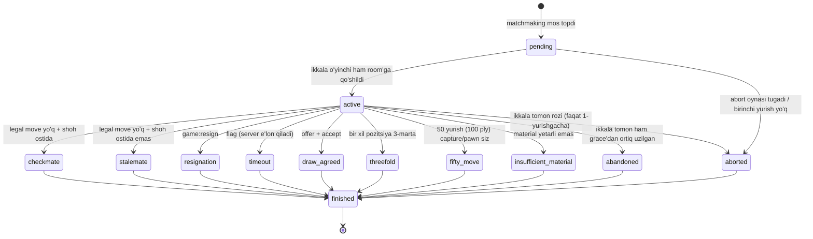
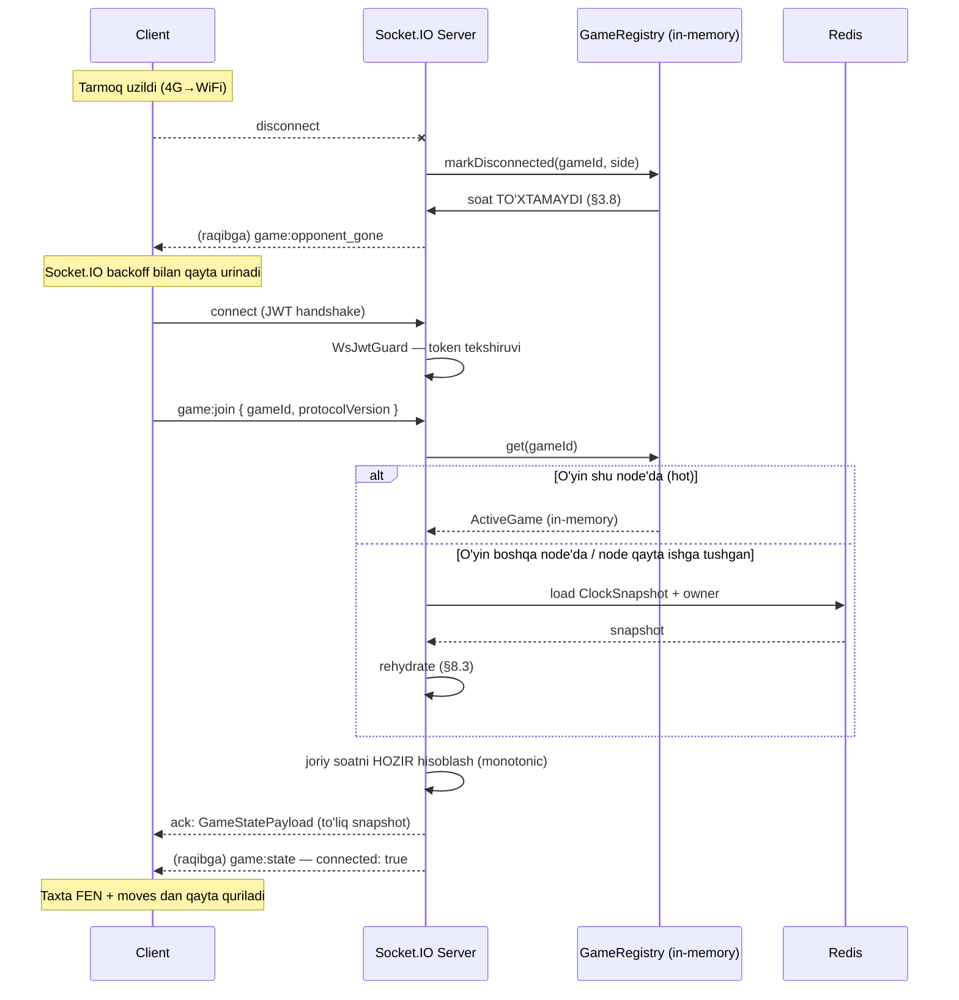

# 07 — Real-time o'yin, server-authoritative taymer va jonli translatsiya

> **Modul:** `play` (#8) va `broadcast` (#9)
> **Status:** Draft v1
> **Muallif:** Sarvarbek Sodiqov
> **Bog'liq hujjatlar:** `02-architecture.md` (modular monolith), `04-data-model.md` (`OnlineGame`, `Move`), `10-fairplay.md`

Bu hujjat Farzin platformasining eng nozik texnik qismini — real-time onlayn o'yin transportini,
server tomonda boshqariladigan taymerni va jonli translatsiya (broadcast) oqimini spetsifikatsiya qiladi.

Bu yerda yozilgan qarorlarning ko'pchiligi **xavfsizlik qarori**, performance qarori emas.
Sabab oddiy: reyting o'yinida taymer va yurish validatsiyasi — bu pul va obro' bilan bog'liq
resurs. Mijozga berilgan har bir vakolat — bu abuse vektori.

---

## Mundarija

1. [Transport tanlovi: nega Socket.IO](#1-transport-tanlovi-nega-socketio)
2. [Server-authoritative model](#2-server-authoritative-model)
3. [Taymer — eng nozik qism](#3-taymer--eng-nozik-qism)
4. [O'yin holati mashinasi](#4-oyin-holati-mashinasi)
5. [Move validatsiya](#5-move-validatsiya)
6. [Durang qoidalari](#6-durang-qoidalari)
7. [Socket.IO event kontrakti](#7-socketio-event-kontrakti)
8. [Reconnect va state recovery](#8-reconnect-va-state-recovery)
9. [Matchmaking](#9-matchmaking)
10. [Masshtab](#10-masshtab)
11. [Broadcast / translatsiya](#11-broadcast--translatsiya)
12. [Performance byudjeti](#12-performance-byudjeti)
13. [Test strategiyasi](#13-test-strategiyasi)
14. [Acceptance criteria](#14-acceptance-criteria)

---

## 1. Transport tanlovi: nega Socket.IO

CANON bo'yicha real-time transport — **Socket.IO**. Bu qaror allaqachon qabul qilingan,
lekin hujjat muhandis uchun yozilgani sababli sabablar va **narxi** ham ochiq yozilishi kerak.

### 1.1 Talablar

Onlayn o'yin transportidan nima talab qilinadi:

- **Bidirectional** — server o'zi tashabbus bilan xabar yuboradi (raqib yurdi, soat yangilandi,
  o'yin tugadi). Client faqat so'rov yuborib javob kutmaydi.
- **Past latency** — yurish p95 < 100ms (§12).
- **Room abstraksiyasi** — bitta o'yinda 2 o'yinchi + N tomoshabin. Xabar aynan shu guruhga.
- **Reconnect** — mobil tarmoq (4G→WiFi o'tish) uzilishlari O'zbekistonda kundalik holat.
- **Gorizontal scaling** — bir nechta Node.js instance orasida broadcast.

### 1.2 Taqqoslash

| Kriteriy | Raw WebSocket (`ws`) | SSE | Socket.IO |
|---|---|---|---|
| Bidirectional | Ha | Yo'q (server→client only) | Ha |
| Fallback (HTTP long-polling) | Yo'q | — | Ha |
| Room / namespace | Qo'lda yozasan | Yo'q | Built-in |
| Avtomatik reconnect | Qo'lda yozasan | Brauzer qiladi (oddiy) | Built-in + backoff |
| Multi-node broadcast | Qo'lda (Redis pub/sub) | Qo'lda | Redis adapter |
| Wire overhead | Minimal | Minimal (text) | Engine.IO framing qo'shiladi |
| NestJS integratsiya | `@WebSocketGateway` (ws adapter) | Yo'q (custom) | `@WebSocketGateway` native |
| ACK / request-response | Yo'q | Yo'q | Built-in (`ack` callback) |
| Binary | Ha | Yo'q (base64) | Ha |

**SSE nega yaramaydi:** bir tomonlama. Yurishni yuborish uchun alohida HTTP POST kerak bo'ladi,
ya'ni ikkita alohida kanal — biri o'qish, biri yozish. Ular orasida tartib (ordering)
kafolati yo'q: POST `move` SSE `move_made` dan keyin kelishi mumkin. Taymer uchun bu
qabul qilib bo'lmaydigan murakkablik. SSE faqat **read-only broadcast** uchun mos
(§11 da tomoshabin oqimi uchun muqobil sifatida ko'rib chiqiladi).

**Raw WebSocket nega yaramaydi (bu loyihada):** yaraydi, lekin biz Socket.IO ning
deyarli barcha xususiyatlarini qo'lda qayta yozishimiz kerak bo'ladi — room registry,
reconnect backoff, heartbeat, multi-node pub/sub fanout, ACK. Bu ~1500 qator infratuzilma
kodi, uni test qilish va saqlash kerak. Loyihaning qiymati Swiss pairing va Glicko-2 da,
WebSocket framework yozishda emas.

### 1.3 Socket.IO ning halol kamchiliklari

Bu bo'lim majburiy — Socket.IO bepul emas:

1. **Wire overhead.** Engine.IO o'z protokol qatlamini qo'shadi. Har bir event
   `42["game:move",{...}]` ko'rinishida uzatiladi — raw WebSocket text frame ustiga
   qo'shimcha prefiks va JSON envelope. Kichik payload'larda (clock update) nisbiy
   overhead sezilarli. Aniq foiz — §12 da bandwidth hisobida taxminiy baholangan,
   real qiymat load test bilan o'lchanadi.

2. **Client kutubxona hajmi.** `socket.io-client` ~ 40 KB (gzip, taxminiy — build
   konfiguratsiyasiga qarab o'zgaradi). Raw WebSocket — 0 KB (brauzer API).
   Next.js bundle byudjetiga ta'sir qiladi.

3. **Standart emas.** Socket.IO protokoli — Socket.IO ning o'zi. Uchinchi tomon
   client (masalan, DGT relay yozuvchi kimdir) uchun bu to'siq. Shuning uchun
   §11 da DGT relay **HTTP/REST** orqali qabul qilinadi, WebSocket orqali emas.

4. **Polling fallback tuzoq.** Fallback foydali, lekin agar sticky session
   noto'g'ri sozlansa, long-polling handshake har safar boshqa node'ga tushib,
   ulanish umuman o'rnatilmaydi (§10.2). Bu klassik production incident.

5. **Version lock-in.** Socket.IO v2/v3/v4 protokollari o'zaro mos emas.
   Mobil ilova (React Native) yangilanmagan bo'lsa, server upgrade uni sindiradi.
   Mitigatsiya: `allowEIO3` emas — protokol versiyasini `game:state` payload'ida
   `protocolVersion` maydoni bilan expliсit tekshirish va eskirgan clientni
   "ilovani yangilang" ekraniga yuborish.

**Xulosa:** overhead qabul qilinadi, chunki u bizga room + reconnect + Redis adapter
beradi. Agar §12 dagi bandwidth byudjeti buzilsa — birinchi optimizatsiya
`clock_update` chastotasini kamaytirish (§3.7), Socket.IO dan voz kechish emas.

---

## 2. Server-authoritative model

### 2.1 Asosiy printsip

> **Mijozga hech qachon ishonilmaydi.** Mijoz faqat *niyat* (intent) yuboradi.
> Haqiqatni faqat server biladi.

Bu shunchaki shior emas, quyidagi aniq qoidalarga aylanadi:

| Mijoz yubormaydigan narsa | Nega |
|---|---|
| Qolgan vaqt | Taymer manipulyatsiyasi — cheksiz vaqt |
| Yurish qonuniyligi ("bu legal") | Noqonuniy yurish, shoh ostida qolish |
| O'yin natijasi ("men yutdim") | Natija soxtalashtirish → reyting inflyatsiyasi |
| Yangi FEN / position | Butun holatni almashtirish |
| Timestamp ("men bu yurishni 12:00:01 da yubordim") | Vaqtni orqaga surish |
| Move number / turn | Navbatni chetlab o'tish |

Mijoz **faqat** shuni yuboradi: `{ gameId, from, to, promotion?, clientMoveSeq }`.

Boshqa hamma narsa — server tomonda hisoblanadi va server tomondan e'lon qilinadi.

### 2.2 Tahdid modeli

Real hujum vektorlari (barchasi shaxmat platformalarida kuzatilgan):

1. **Taymer manipulyatsiyasi.** Agar client "menda 5:00 qoldi" desa, hujumchi
   `socket.emit('clock', { white: 999999 })` yuboradi. Yechim: clock faqat server→client.

2. **Noqonuniy yurish.** Client chess.js ni chetlab o'tib `{from:'a1', to:'h8'}`
   yuboradi. Yechim: server tomonda to'liq legal move generation (§5).

3. **Natija soxtalashtirish.** Client `game:ended {winner: me}` yuboradi.
   Yechim: `game:ended` — faqat server→client event. Server hech qachon
   client'dan natija qabul qilmaydi.

4. **Flag soxtalashtirish.** Client "raqibning vaqti tugadi" deb da'vo qiladi.
   Yechim: `game:claim_timeout` — bu *so'rov*, e'lon emas. Server o'z soatini
   tekshiradi va **rad etishi mumkin** (§3.5).

5. **Replay / duplicate move.** Bir xil yurishni ikki marta yuborish (tarmoq
   retry sababli ham bo'lishi mumkin). Yechim: `clientMoveSeq` idempotency kaliti +
   server tomonda kutilayotgan `ply` raqami bilan solishtirish.

6. **Spectator injection.** Tomoshabin `game:move` yuboradi. Yechim: room'ga
   qo'shilishda rol aniqlanadi; `game:move` handler'i birinchi qatorda
   `assertIsPlayerToMove()` chaqiradi.

### 2.3 Client-side chess.js roli

CANON'da frontend'da ham `chess.js` bor. Bu **ziddiyat emas**:

- Client-side chess.js — **UX**: legal move highlight, drag'ni bloklash, optimistik render.
- Server-side chess.js — **haqiqat**: yurishni qabul qilish yoki rad etish.

Client-side validatsiya — xushmuomalalik (foydalanuvchi noto'g'ri yurishni
tortmasin), xavfsizlik emas. Server hech qachon "client allaqachon tekshirgan"
degan taxminga tayanmaydi.

### 2.4 Optimistik render va rollback

Client yurishni darhol taxtada ko'rsatadi (optimistik), lekin `pending` holatda:

```typescript
// Frontend spetsifikatsiyasi (kod frontend TZ'da emas — bu shartnoma tavsifi)
// 1. Client chess.js bilan tekshiradi → legal bo'lsa taxtada ko'rsatadi (kulrang/pending)
// 2. socket.emit('game:move', payload, ack)
// 3. ack kelsa → yurish tasdiqlanadi (normal rang)
// 4. ack 'rejected' bo'lsa yoki 5s timeout → taxta oxirgi server snapshot'iga qaytariladi
```

Rollback — muzokara predmeti emas. Agar server rad etsa, client so'zsiz qaytadi.

---

## 3. Taymer — eng nozik qism

Taymer — bu loyihaning eng ko'p incident keltirib chiqaradigan komponenti.
Sabab: u vaqtga bog'liq, distributed, va foydalanuvchi uni millisekundgacha sezadi.

### 3.1 Vaqt nazorati turlari

Farzin quyidagi vaqt nazoratlarini qo'llab-quvvatlaydi:

| Tur | Ta'rifi | Misol |
|---|---|---|
| **Sudden death** | Increment yo'q. Boshlang'ich vaqt tugasa — flag. | `5+0` (blitz) |
| **Fischer increment** | Har bir yurishdan **keyin** vaqtga `inc` qo'shiladi. | `3+2`, `15+10` |
| **Bronstein delay** | Yurishga sarflangan vaqt qaytariladi, lekin `delay` dan ko'p emas. | `5+3 (Bronstein)` |
| **Simple delay (US delay)** | Har yurishda `delay` soniya soat umuman yurmaydi, keyin yura boshlaydi. | `5 d3` |
| **Multi-stage** | Bosqichlar. Har bosqich N yurishdan keyin yangi vaqt qo'shadi. | `90/40 + 30 + 30s inc` |

**Fischer vs Bronstein farqi (muhim):**
Fischer'da 2 soniyalik increment 0.5s da yurgan o'yinchiga **1.5s foyda** beradi —
vaqt to'planadi. Bronstein'da esa faqat sarflangan vaqt qaytariladi — 0.5s yurgan
o'yinchi 0.5s oladi, ko'pi bilan `delay` gacha. Ya'ni Bronstein'da vaqt hech qachon
boshlang'ich qiymatdan oshmaydi. Simple delay Bronstein bilan matematik ekvivalent
natija beradi, lekin displayed clock boshqacha ko'rinadi (o'yinchi uchun psixologik farq).

**Multi-stage (klassik turnir formati):**
`90 min / 40 moves, keyin +30 min, butun o'yin davomida +30s increment` —
bu FIDE standart klassik nazorati. 40-yurish tugagach (ya'ni har bir tomon 40 ta
yurish qilgach), qolgan vaqt ustiga 30 daqiqa qo'shiladi. Diqqat: qo'shiladi,
almashtirilmaydi — tejalgan vaqt saqlanadi.

### 3.2 Data model

```typescript
export type TimeControlKind = 'sudden_death' | 'fischer' | 'bronstein' | 'simple_delay';

export interface TimeControlStage {
  /** Shu bosqichda qo'shiladigan vaqt (ms). */
  readonly baseMs: number;
  /** Increment yoki delay (ms). 0 = yo'q. */
  readonly incrementMs: number;
  /**
   * Shu bosqich necha yurishdan keyin tugaydi (har bir tomon uchun).
   * null = oxirgi bosqich, o'yin oxirigacha.
   */
  readonly movesToNextStage: number | null;
}

export interface TimeControl {
  readonly kind: TimeControlKind;
  readonly stages: readonly TimeControlStage[];
}

/** Misol: 90/40 + 30 + 30s Fischer increment */
export const CLASSICAL_90_40_30: TimeControl = {
  kind: 'fischer',
  stages: [
    { baseMs: 90 * 60_000, incrementMs: 30_000, movesToNextStage: 40 },
    { baseMs: 30 * 60_000, incrementMs: 30_000, movesToNextStage: null },
  ],
};

/** Misol: 3+2 blitz */
export const BLITZ_3_2: TimeControl = {
  kind: 'fischer',
  stages: [{ baseMs: 3 * 60_000, incrementMs: 2_000, movesToNextStage: null }],
};
```

Taymer holati:

```typescript
export type Side = 'w' | 'b';

export interface ClockState {
  /** Har bir tomonning qolgan vaqti (ms). Manfiy bo'lmaydi — 0 da to'xtaydi. */
  readonly remainingMs: Readonly<Record<Side, number>>;
  /** Kimning soati yuryapti. null = soat to'xtagan (o'yin boshlanmagan/tugagan). */
  readonly running: Side | null;
  /**
   * Joriy tomonning soati qachon ishga tushgani — monotonic nanosekund.
   * Date.now() EMAS. Qarang: §3.3.
   */
  readonly startedAtNs: bigint | null;
  /** Har bir tomon qilgan yurishlar soni — multi-stage uchun. */
  readonly moveCount: Readonly<Record<Side, number>>;
  /** Har bir tomon qaysi bosqichda. */
  readonly stageIndex: Readonly<Record<Side, number>>;
  /** Simple delay uchun: joriy yurishda delay hali sarflanmagan qismi (ms). */
  readonly delayRemainingMs: number;
}
```

### 3.3 Monotonic clock — nega `Date.now()` emas

Bu eng muhim texnik detal.

`Date.now()` — **wall clock**. U NTP daemon tomonidan tuzatiladi. Server soati
100 ms oldinda bo'lsa, `ntpd` uni orqaga suradi (yoki `slew` bilan sekinlashtiradi).
Natijada:

```typescript
const t0 = Date.now();       // 1_700_000_000_000
// ... 50ms o'tdi, shu payt NTP soatni 100ms orqaga surdi
const t1 = Date.now();       // 1_700_000_000_050 - 100 = 1_699_999_999_950
const elapsed = t1 - t0;     // -50 ms  ← MANFIY VAQT
```

Manfiy elapsed → o'yinchining vaqti **ko'payadi**. Yoki `slew` sababli soat
sekinlashadi — o'yinchi flag ostida yiqilmaydi. Klassik turnirda 6 soatlik
o'yin davomida NTP bir necha marta tuzatish kiritadi. Bu — reyting o'yinida
qabul qilib bo'lmaydigan xato.

**Yechim:** `process.hrtime.bigint()` — monotonic, hech qachon orqaga ketmaydi,
NTP unga ta'sir qilmaydi. Nanosekundda bigint qaytaradi.

```typescript
/**
 * Monotonic vaqt manbai. Test'da soxta implementatsiya bilan almashtiriladi (§13).
 * Wall clock (Date.now) HECH QACHON taymer hisobida ishlatilmaydi —
 * u faqat audit/log/created_at uchun.
 */
export abstract class MonotonicClock {
  abstract nowNs(): bigint;

  /** Qulaylik uchun: ikki nuqta orasidagi ms (butun songa yaxlitlanadi, pastga). */
  elapsedMs(fromNs: bigint): number {
    return Number((this.nowNs() - fromNs) / 1_000_000n);
  }
}

@Injectable()
export class SystemMonotonicClock extends MonotonicClock {
  nowNs(): bigint {
    return process.hrtime.bigint();
  }
}
```

**Muhim cheklov:** `process.hrtime.bigint()` — **process-local**. Uning nol nuqtasi
har bir process'da boshqacha va u process qayta ishga tushganda yo'qoladi.
Ya'ni `startedAtNs` ni Redis'ga yozib, boshqa node'da o'qish **noto'g'ri**.

Bu §3.6 (qayerda saqlanadi) va §10.3 (game affinity) qarorlariga bevosita ta'sir qiladi:
**bitta faol o'yin — bitta node'ga bog'lanadi**, chunki uning monotonic bazasi shu node'da.

Persist qilishda ikkita qiymat birga yoziladi:
- `remainingMs` — monotonic bilan hisoblangan (haqiqat)
- `wallClockAtNs` — `Date.now()` (faqat crash recovery da taxminiy tiklash uchun)

Crash recovery'da monotonic baza yo'qoladi. Shunda wall clock ishlatiladi va
o'yinchilarga **foyda beriladi** (o'tgan vaqt hisobga olinmaydi yoki
qisman hisobga olinadi) — server nosozligi uchun o'yinchi jazolanmaydi. Bu
qasddan qilingan qaror.

### 3.4 Lag kompensatsiya

Muammo: o'yinchi yurishni `T` payti bosdi. Server uni `T + rtt/2 + jitter` da oldi.
Server naiv hisoblasa, o'yinchidan tarmoq kechikishi uchun vaqt oladi. 3+2 blitzda
har yurishda 80 ms yo'qotish — 40 yurishda 3.2 soniya. Bu o'yin natijasini o'zgartiradi.

**Naiv yechim va nega u xato:** "client yurish vaqtini o'zi yuborsin" — yo'q,
bu §2.1 buzilishi. Client `sentAt: 0` yuborsa, u hech qachon vaqt sarflamaydi.

**Lichess yondashuvi (biz ham shuni olamiz):** server o'zi lag'ni **o'lchaydi** va
uni **cheklangan miqdorda** qaytaradi:

1. Server har bir client uchun ping RTT ni kuzatadi (Socket.IO heartbeat + alohida
   `ping` sample). Undan **moving average** (yoki median — outlier'ga chidamli) hisoblanadi.
2. Yurish kelganda: `compensationMs = min(measuredLagMs / 2, MAX_LAG_COMP_MS)`.
3. Bu qiymat o'yinchining sarflangan vaqtidan ayiriladi.
4. `MAX_LAG_COMP_MS` — qattiq shift (masalan 100 ms). Sabab: aks holda hujumchi
   qasddan lag yaratib (paket kechiktirish), cheksiz vaqt oladi.

```typescript
export const MAX_LAG_COMP_MS = 100;

/** Har bir socket uchun lag kuzatuvchi. Median — outlier'ga chidamli. */
export class LagTracker {
  private readonly samples: number[] = [];
  private static readonly WINDOW = 20;

  record(rttMs: number): void {
    // Absurd qiymatlarni tashlab yuboramiz (soxta ping javobi / GC pauza).
    if (rttMs < 0 || rttMs > 2_000) return;
    this.samples.push(rttMs);
    if (this.samples.length > LagTracker.WINDOW) this.samples.shift();
  }

  /** Bir tomonlama kechikish ≈ RTT / 2. */
  private oneWayMs(): number {
    if (this.samples.length === 0) return 0;
    const sorted = [...this.samples].sort((a, b) => a - b);
    const median = sorted[Math.floor(sorted.length / 2)];
    return median / 2;
  }

  /** Yurish uchun qaytariladigan kompensatsiya (ms). Har doim cheklangan. */
  compensationMs(): number {
    return Math.min(Math.round(this.oneWayMs()), MAX_LAG_COMP_MS);
  }
}
```

**Halol eslatma:** bu kompensatsiya **mukammal emas**. U o'rtacha lag'ni qaytaradi,
lekin aynan shu yurishdagi jitter'ni emas. Yaxshi tarmoqli o'yinchi baribir
biroz ustunlikka ega. Bu barcha onlayn shaxmat platformalarida shunday — mutlaq
adolat fizik jihatdan imkonsiz. `MAX_LAG_COMP_MS` ning aniq qiymati (100 ms taxminiy)
O'zbekiston tarmoq sharoitida real telemetriya bilan sozlanishi kerak — biz hozircha
uni `play.clock.maxLagCompMs` feature flag qilib qo'yamiz.

### 3.5 Flag (vaqt tugashi) — kim e'lon qiladi

**Faqat server.** Ikki yo'l bilan aniqlanadi:

1. **Reaktiv:** raqib `game:claim_timeout` yuboradi → server o'z soatini tekshiradi.
2. **Proaktiv:** server ichida timer (`setTimeout`) qolgan vaqtga qo'yiladi.
   U ishga tushsa — server o'zi flag e'lon qiladi.

Ikkalasi ham kerak. Faqat proaktiv bo'lsa — event loop band bo'lganda kechikadi.
Faqat reaktiv bo'lsa — ikkala o'yinchi ham disconnect bo'lgan o'yin abadiy `active` qoladi.

```typescript
export type ClaimTimeoutResult =
  | { readonly outcome: 'flagged'; readonly loser: Side; readonly result: GameResultCode }
  | { readonly outcome: 'rejected'; readonly reason: 'time_remains'; readonly remainingMs: number };

@Injectable()
export class FlagService {
  constructor(
    private readonly clock: MonotonicClock,
    private readonly material: MaterialService,
  ) {}

  /**
   * Client "raqibning vaqti tugadi" deb DA'VO qiladi. Bu e'lon emas — so'rov.
   * Server o'z soatini tekshiradi va rad etishi mumkin.
   */
  claim(game: ActiveGame, claimant: Side): ClaimTimeoutResult {
    const victim: Side = claimant === 'w' ? 'b' : 'w';
    const remaining = this.remainingFor(game.clock, victim);

    if (remaining > 0) {
      return { outcome: 'rejected', reason: 'time_remains', remainingMs: remaining };
    }
    return { outcome: 'flagged', loser: victim, result: this.resolveFlagResult(game, victim) };
  }

  /** Yuruvchi tomonning REAL qolgan vaqti — oxirgi yurishdan beri o'tgan vaqt ayiriladi. */
  private remainingFor(clock: ClockState, side: Side): number {
    if (clock.running !== side || clock.startedAtNs === null) {
      return clock.remainingMs[side];
    }
    const elapsed = this.clock.elapsedMs(clock.startedAtNs);
    // Simple delay: avval delay sarflanadi, keyin asosiy vaqt.
    const chargeable = Math.max(0, elapsed - clock.delayRemainingMs);
    return Math.max(0, clock.remainingMs[side] - chargeable);
  }

  /**
   * FIDE 6.9: agar vaqt tugagan bo'lsa-yu, RAQIBDA mot qilish uchun material
   * yetarli bo'lmasa — o'yin DURANG, mag'lubiyat emas.
   */
  private resolveFlagResult(game: ActiveGame, loser: Side): GameResultCode {
    const winner: Side = loser === 'w' ? 'b' : 'w';
    const canWinnerMate = this.material.hasMatingMaterial(game.position, winner);
    if (!canWinnerMate) return 'draw_timeout_vs_insufficient';
    return winner === 'w' ? 'white_wins_timeout' : 'black_wins_timeout';
  }
}
```

**Flag fall × insufficient material kesishuvi (FIDE 6.9):**

Bu tez-tez unutiladigan qoida. Agar oq vaqti tugasa, lekin qorada faqat
shoh qolgan bo'lsa — qora yutmaydi, **durang**. Chunki qora hech qanday
qonuniy yurishlar ketma-ketligi bilan mot qila olmaydi.

Diqqat: bu yerda tekshiruv **`hasMatingMaterial`** (yutuvchi mot qila oladimi),
oddiy `insufficientMaterial()` (ikkala tomon ham qila olmaydimi) emas. Bu ikki
xil savol. FIDE 6.9 da "any series of legal moves" formulasi ishlatiladi —
ya'ni K+N vs K+R holatida oq flag tushsa, qora **yutadi** (K+R mot qila oladi),
garchi umumiy `insufficient material` durangi bu pozitsiyada qo'llanmasa ham.

Bu qoidani buzish klassik bug: lichess va chess.com da ham turli implementatsiya
mavjud (chess.com ba'zi holatlarda "timeout vs insufficient material" ni
boshqacha hisoblaydi). Biz **FIDE qoidasiga** amal qilamiz, chunki Farzin —
federatsiya infratuzilmasi.

### 3.6 Taymer qayerda saqlanadi

Uch variant. Har birining narxi bor:

| Variant | O'qish latency | Crash'da nima bo'ladi | Multi-node | Yozuv yuki |
|---|---|---|---|---|
| **In-memory (Map)** | ~0 (ns) | Faol o'yinlar yo'qoladi | Ishlamaydi (affinity kerak) | 0 |
| **Redis** | ~0.5–2 ms (taxminiy, RTT) | Saqlanadi | Ishlaydi | Har yurishda 1 write |
| **PostgreSQL** | ~2–10 ms (taxminiy) | Saqlanadi | Ishlaydi | Har yurishda 1 write + WAL |

**Tavsiya: hibrid — in-memory hot state + Redis snapshot + PostgreSQL durable log.**

Sabab batafsil:

1. **In-memory — haqiqat manbai (hot path).** Taymer hisobiga har bir yurishda
   nanosekund aniqligidagi `startedAtNs` kerak. Bu qiymat process-local (§3.3) —
   uni tarmoq orqali o'qishning ma'nosi yo'q. Yurish handler'i I/O kutmasligi kerak:
   Redis'ga borish p95 latency byudjetining (§12) katta qismini yeydi.

2. **Redis — reconnect va failover snapshot.** Har yurishdan keyin
   **asinxron** (fire-and-forget, `await` qilinmaydi) `ClockSnapshot` yoziladi:
   `remainingMs`, `moveCount`, `wallClockAtNs`, `ownerNodeId`. Bu snapshot
   nanosekund aniqligiga da'vo qilmaydi — u ~50 ms aniqlikda. Uning vazifasi:
   node o'lsa, o'yinni boshqa node'da **taxminan to'g'ri** tiklash.

3. **PostgreSQL — audit va durable log.** `Move` jadvaliga har bir yurish
   (SAN, UCI, `msSpent`, `remainingMsAfter`) yoziladi. Bu reyting hisobi,
   PGN eksporti, fair-play tahlili (§CANON #10 — yurish vaqti fingerprint)
   uchun kerak. Bu ham hot path'dan tashqarida — **BullMQ job** orqali
   batch yoziladi.

```typescript
/** Redis'ga yoziladigan snapshot. Nanosekund aniqligiga DA'VO QILMAYDI. */
export interface ClockSnapshot {
  readonly gameId: string;
  readonly remainingMs: Record<Side, number>;
  readonly running: Side | null;
  readonly moveCount: Record<Side, number>;
  readonly stageIndex: Record<Side, number>;
  /** Wall clock — faqat failover'da qancha vaqt o'tganini TAXMINIY bilish uchun. */
  readonly snapshotAtWallMs: number;
  /** Qaysi node bu o'yinni boshqaryapti (affinity — §10.3). */
  readonly ownerNodeId: string;
  readonly ply: number;
}

@Injectable()
export class ClockSnapshotStore {
  private static readonly TTL_SECONDS = 60 * 60 * 12; // 12 soat — eng uzun klassik o'yin + zaxira

  constructor(@InjectRedis() private readonly redis: Redis) {}

  /** Hot path'da AWAIT QILINMAYDI — .catch() bilan yuboriladi. */
  save(snapshot: ClockSnapshot): Promise<void> {
    return this.redis
      .set(this.key(snapshot.gameId), JSON.stringify(snapshot), 'EX', ClockSnapshotStore.TTL_SECONDS)
      .then(() => undefined);
  }

  async load(gameId: string): Promise<ClockSnapshot | null> {
    const raw = await this.redis.get(this.key(gameId));
    return raw === null ? null : (JSON.parse(raw) as ClockSnapshot);
  }

  private key(gameId: string): string {
    return `farzin:play:clock:${gameId}`;
  }
}
```

**Nega faqat Redis emas?** Chunki monotonic baza process-local. Redis'dan
`startedAtNs` o'qib boshqa node'da ishlatish — mantiqan noto'g'ri (turli nol nuqta).
Redis'da faqat `remainingMs` saqlanadi, ya'ni "yurish paytidagi kesim".

**Nega faqat in-memory emas?** Node crash bo'lsa, barcha faol o'yinlar yo'qoladi.
Klassik turnirda 6 soatlik o'yin yo'qolishi — qabul qilib bo'lmaydigan.

### 3.7 Clock update chastotasi

Server har bir tickda clock yubormaydi. Bu bandwidth isrofi (§12).

Qaror:
- **Har yurishdan keyin** — `game:clock_update` (aniq qiymat, avtoritet).
- **Oraliqda** — client o'zi lokal `requestAnimationFrame` bilan sanaydi
  (server qiymatidan boshlab pastga). Bu faqat **displey**, haqiqat emas.
- **Sinxronizatsiya tick** — har `N` soniyada bir marta (`N = 10` boshlang'ich
  taklif, sozlanadi) server aniq qiymatni yuboradi va client drift'ni tuzatadi.
- **Past vaqt rejimi** — agar biror tomonda < 30 s qolsa, tick chastotasi
  1 s ga oshiriladi. Sabab: aynan shu paytda aniqlik muhim va o'yinchi soatga qaraydi.

Client drift server qiymatidan farq qilsa — **server g'olib**, client sakraydi.
Sakrash yoqimsiz, lekin noto'g'ri soat yomonroq.

### 3.8 Diskonnekt siyosati

Diskonnekt — abuse vektori: yutqazayotgan o'yinchi kabelni sug'urib, o'yinni
"muzlatib" qo'yishi mumkin.

**Qoida: diskonnekt soatni TO'XTATMAYDI.** Agar sizning navbatingiz bo'lsa va
siz uzilib qolsangiz, soatingiz yurishda davom etadi va siz flag ostida yiqilishingiz mumkin.
Bu qattiq, lekin yagona abuse'ga chidamli siyosat.

Qo'shimcha mexanizmlar:

| Holat | Siyosat |
|---|---|
| **Abort oynasi** | Birinchi yurishgacha: agar oq 30 s ichida yurmasa, ikkala tomon ham `game:abort` qila oladi. Reytingga ta'sir qilmaydi. |
| **Diskonnekt taymeri** | Uzilgan o'yinchi uchun alohida hisoblagich ishga tushadi. Uning davomiyligi = `min(qolgan vaqt, DISCONNECT_GRACE)`. |
| **Claim victory** | Raqib uzilgan va grace tugagan bo'lsa, ulangan o'yinchida `game:claim_timeout` tugmasi faollashadi. Bu — o'sha `claim` mexanizmi (§3.5), server tekshiradi. |
| **Reconnect** | Grace ichida qaytsa — o'yin davom etadi, soat baribir yurgan (§8). |

`DISCONNECT_GRACE` qiymati vaqt nazoratiga bog'liq bo'lishi kerak:
blitzda 15 s, klassikda bir necha daqiqa. Aniq qiymatlar — product qarori,
hozircha konfiguratsiya:

```typescript
export interface DisconnectPolicy {
  /** Uzilgandan keyin raqib "claim victory" qila olishigacha kutish (ms). */
  readonly graceMs: number;
  /** Birinchi yurishgacha abort oynasi (ms). */
  readonly abortWindowMs: number;
}

/**
 * Boshlang'ich qiymatlar — TAXMINIY. Real qiymatlar foydalanuvchi shikoyatlari
 * va telemetriya (o'rtacha reconnect vaqti) asosida sozlanadi.
 * O'zbekistonda mobil tarmoq uzilishi tez-tez uchraydi → grace saxiyroq bo'lishi mumkin.
 */
export const DISCONNECT_POLICIES: Record<GameSpeed, DisconnectPolicy> = {
  bullet: { graceMs: 10_000, abortWindowMs: 15_000 },
  blitz: { graceMs: 15_000, abortWindowMs: 20_000 },
  rapid: { graceMs: 30_000, abortWindowMs: 30_000 },
  classical: { graceMs: 120_000, abortWindowMs: 60_000 },
};
```

**Halol eslatma:** bu qiymatlar hech qanday o'lchovga asoslanmagan — bu boshlang'ich
taxmin. Ular birinchi 1000 o'yindan keyin real diskonnekt statistikasi asosida
qayta ko'rib chiqilishi kerak.

---

## 4. O'yin holati mashinasi

`OnlineGame` entity'si (CANON #6) quyidagi holat mashinasiga bo'ysunadi.



**Muhim qoidalar:**

- **Terminal holatlar oraliq.** `checkmate`, `timeout` va h.k. — bu *sabab*,
  yakuniy holat emas. Ular `finished` ga o'tadi. Sabab `OnlineGame.endReason`
  ustunida saqlanadi. Bu shuning uchun kerakki, `finished` ga o'tishda
  qo'shimcha ishlar bajariladi: reyting hisobi (BullMQ job), PGN yozish,
  fair-play tahlil navbatiga qo'yish.

- **`aborted` reytingga ta'sir qilmaydi.** `abandoned` — ta'sir qiladi
  (ikkalasi ham yo'qolgan bo'lsa, natija `draw` yoki soat bo'yicha hal qilinadi).

- **O'tishlar faqat server tomonda.** Client hech qachon holatni o'zgartirmaydi.

- **Idempotentlik.** `finished` ga o'tish bir marta bajariladi. Agar bir vaqtning
  o'zida flag ham, resign ham kelsa — DB'da `UPDATE ... WHERE status = 'active'`
  optimistic lock bilan faqat bittasi yutadi.

```typescript
export type GameStatus = 'pending' | 'active' | 'finished';

export type GameEndReason =
  | 'checkmate'
  | 'stalemate'
  | 'resignation'
  | 'timeout'
  | 'draw_agreed'
  | 'threefold'
  | 'fifty_move'
  | 'insufficient_material'
  | 'abandoned'
  | 'aborted';

export type GameResultCode =
  | 'white_wins'
  | 'black_wins'
  | 'draw'
  | 'white_wins_timeout'
  | 'black_wins_timeout'
  | 'draw_timeout_vs_insufficient'
  | 'aborted';

export interface GameOutcome {
  readonly status: 'finished';
  readonly reason: GameEndReason;
  readonly result: GameResultCode;
  /** PGN natija belgisi: '1-0' | '0-1' | '1/2-1/2' | '*' */
  readonly pgnResult: '1-0' | '0-1' | '1/2-1/2' | '*';
  /** Reytingga hisoblanadimi. aborted → false. */
  readonly rated: boolean;
}
```

---

## 5. Move validatsiya

### 5.1 Nega server tomonda ham chess.js

CANON'da `chess.js` frontend texnologiyalari ro'yxatida. Lekin u **server tomonda ham**
ishlatiladi. Sabablari:

1. **Bir xil kutubxona = bir xil qaror.** Agar server boshqa engine ishlatsa,
   client va server bir xil pozitsiyani turlicha baholashi mumkin (masalan,
   en passant huquqi FEN'da qanday yozilishi bo'yicha nozik farqlar). Bu
   "client legal deydi, server rad etadi" desync'iga olib keladi — eng yomon UX bug.

2. **Battle-tested.** chess.js — Lichess ekotizimida keng ishlatiladigan,
   perft bilan tekshirilgan kutubxona. O'zimizning legal move generator'imizni
   yozish — bu 2–3 hafta ish + o'nlab edge case bug. Loyihaning qiymati bunda emas.

3. **Performance yetarli.** chess.js `move()` chaqiruvi — mikrosekundlar tartibida
   (aniq raqam benchmark bilan o'lchanishi kerak). §12 dagi 100 ms byudjetda
   bu sezilmaydi. Biz engine emas, validator yozyapmiz — Stockfish tezligi kerak emas.

**Halol trade-off:** chess.js — uchinchi tomon bog'liqlik. Uning bug'i bizning
bug'imizga aylanadi. Mitigatsiya: §5.4 dagi perft testlari CI'da har build'da
ishlaydi. Agar chess.js versiyasi yangilanib perft buzilsa — CI qizil bo'ladi.

### 5.2 Validatsiya pipeline

```typescript
export interface MoveIntent {
  readonly gameId: string;
  readonly from: string;        // 'e2'
  readonly to: string;          // 'e4'
  readonly promotion?: 'q' | 'r' | 'b' | 'n';
  /** Client idempotency kaliti — retry'da dublikat bo'lmasligi uchun. */
  readonly clientMoveSeq: number;
}

export type MoveRejectReason =
  | 'not_your_turn'
  | 'illegal_move'
  | 'game_not_active'
  | 'not_a_player'
  | 'stale_seq'
  | 'clock_expired';

export type MoveOutcome =
  | { readonly ok: true; readonly move: AppliedMove; readonly outcome: GameOutcome | null }
  | { readonly ok: false; readonly reason: MoveRejectReason };

@Injectable()
export class MoveValidator {
  constructor(
    private readonly clock: MonotonicClock,
    private readonly clockService: ClockService,
    private readonly drawDetector: DrawDetector,
  ) {}

  apply(game: ActiveGame, userId: string, intent: MoveIntent): MoveOutcome {
    // 1. Vaqtni ENG BIRINCHI o'lchaymiz — keyingi hisoblar uni buzmasin.
    const receivedAtNs = this.clock.nowNs();

    // 2. Rol tekshiruvi — tomoshabin yurolmaydi.
    const side = game.sideOf(userId);
    if (side === null) return { ok: false, reason: 'not_a_player' };

    // 3. Holat tekshiruvi.
    if (game.status !== 'active') return { ok: false, reason: 'game_not_active' };

    // 4. Navbat tekshiruvi.
    if (game.position.turn() !== side) return { ok: false, reason: 'not_your_turn' };

    // 5. Idempotency — retry yoki eskirgan paket.
    if (intent.clientMoveSeq <= game.lastSeqOf(side)) {
      return { ok: false, reason: 'stale_seq' };
    }

    // 6. Flag tekshiruvi — yurish kech kelgan bo'lishi mumkin.
    if (this.clockService.isExpired(game.clock, side, receivedAtNs)) {
      return { ok: false, reason: 'clock_expired' };
    }

    // 7. Legal move — chess.js. Rokirovka, en passant, promotion, pin,
    //    shoh ostida qolish — hammasi shu yerda tekshiriladi.
    //    chess.js noqonuniy yurishda null qaytaradi (v1+ da throw qiladi — o'rab olamiz).
    const applied = game.position.move({
      from: intent.from,
      to: intent.to,
      promotion: intent.promotion,
    });
    if (applied === null) return { ok: false, reason: 'illegal_move' };

    // 8. Soatni yangilash — lag kompensatsiya bilan.
    game.clock = this.clockService.onMove(game.clock, side, receivedAtNs, game.lagOf(side));

    // 9. Terminal holat tekshiruvi.
    const outcome = this.detectOutcome(game);

    return { ok: true, move: applied, outcome };
  }

  private detectOutcome(game: ActiveGame): GameOutcome | null {
    const pos = game.position;
    if (pos.isCheckmate()) {
      const winner: Side = pos.turn() === 'w' ? 'b' : 'w';
      return buildOutcome('checkmate', winner === 'w' ? 'white_wins' : 'black_wins');
    }
    if (pos.isStalemate()) return buildOutcome('stalemate', 'draw');
    if (this.drawDetector.isInsufficientMaterial(pos)) {
      return buildOutcome('insufficient_material', 'draw');
    }
    // Threefold va 50-move: avtomatik emas — talab qilinadi (§6.4).
    return null;
  }
}
```

### 5.3 Nozik qoidalar — nima aynan tekshiriladi

chess.js bu qoidalarni o'zi bajaradi, lekin spetsifikatsiyada ular aniq
yozilishi kerak (test'lar shu ro'yxat bo'yicha yoziladi — §13):

**Rokirovka (castling):**
- Shoh oldin yurmagan bo'lishi kerak.
- Tegishli ruk oldin yurmagan bo'lishi kerak.
- Shoh va ruk orasidagi barcha kataklar bo'sh.
- Shoh **hozir** shoh ostida (check) emas.
- Shoh **o'tadigan** katak raqib tomonidan hujum ostida emas (`f1`/`d1`).
- Shoh **tushadigan** katak hujum ostida emas (`g1`/`c1`).
- Muhim: uzun rokirovkada `b1` katagi hujum ostida bo'lishi **mumkin** —
  shoh u yerdan o'tmaydi, faqat ruk o'tadi. Bu klassik bug manbai.
- Rokirovka huquqi FEN'ning 3-maydonida (`KQkq`) saqlanadi va har yurishda yangilanadi.

**En passant:**
- Faqat piyoda ikki katak yurgandan **keyingi yurishda** mumkin. Bir yurish
  kechiksa — huquq yo'qoladi.
- FEN'ning 4-maydonida target square saqlanadi.
- Nozik holat: en passant tutish natijasida o'z shohi ochilib qolishi mumkin
  (ikkala piyoda ham bir gorizontalda, orqada raqib ruki). Bu yurish **noqonuniy**.
  Bu perft testlarida (pozitsiya 3) tekshiriladi.

**Promotion:**
- Piyoda 8-gorizontalga (yoki 1-ga) yetganda majburiy.
- `promotion` maydoni bo'sh bo'lsa — yurish rad etiladi (chess.js default `q`
  qo'yishi mumkin, biz bunga tayanmaymiz: server `promotion` yo'qligini
  `illegal_move` deb hisoblaydi, chunki o'yinchi tanlovi noaniq).
- Underpromotion (`r`, `b`, `n`) qo'llab-quvvatlanadi — u ba'zan yagona yutuq.

**Shoh ostida qolish:**
- Har qanday yurishdan **keyin** o'z shohi hujum ostida bo'lsa — noqonuniy.
- Pin bo'lgan dona pin chizig'idan chiqa olmaydi.
- Shoh check'dan qochganda, u check beruvchi dona chizig'ida **orqaga**
  yura olmaydi (shoh o'zi to'sib turgan katak). Bu ham klassik bug.

### 5.4 Perft testi

Perft (performance test) — berilgan chuqurlikdagi barcha legal yurishlar sonini
sanash. Bu **yagona ishonchli usul** move generator to'g'riligini tekshirish uchun:
raqamlar dunyo bo'ylab ma'lum va referens qiymatlar bilan solishtiriladi.

```typescript
import { Chess } from 'chess.js';

/** Berilgan chuqurlikdagi barcha legal yurishlar (leaf node) sonini sanaydi. */
export function perft(fen: string, depth: number): number {
  const chess = new Chess(fen);
  return perftRec(chess, depth);
}

function perftRec(chess: Chess, depth: number): number {
  if (depth === 0) return 1;
  const moves = chess.moves({ verbose: true });
  if (depth === 1) return moves.length;

  let nodes = 0;
  for (const move of moves) {
    chess.move(move);
    nodes += perftRec(chess, depth - 1);
    chess.undo();
  }
  return nodes;
}
```

Referens qiymatlar (Chess Programming Wiki — sanoat standarti):

```typescript
/**
 * CI'da har build'da ishlaydi. chess.js yangilanishi bu testni buzsa —
 * merge bloklanadi. Bu bizning uchinchi tomon bog'liqligimizga qarshi himoya.
 */
describe('perft — move generation correctness', () => {
  const START = 'rnbqkbnr/pppppppp/8/8/8/8/PPPPPPPP/RNBQKBNR w KQkq - 0 1';
  // Kiwipete — rokirovka va pin'larga boy klassik test pozitsiyasi
  const KIWIPETE = 'r3k2r/p1ppqpb1/bn2pnp1/3PN3/1p2P3/2N2Q1p/PPPBBPPP/R3K2R w KQkq - 0 1';
  // En passant + discovered check edge case'lari
  const POSITION_3 = '8/2p5/3p4/KP5r/1R3p1k/8/4P1P1/8 w - - 0 1';
  // Promotion va underpromotion
  const POSITION_4 = 'r3k2r/Pppp1ppp/1b3nbN/nP6/BBP1P3/q4N2/Pp1P2PP/R2Q1RK1 w kq - 0 1';

  it.each([
    [START, 1, 20],
    [START, 2, 400],
    [START, 3, 8_902],
    [START, 4, 197_281],
    [START, 5, 4_865_609],
    [KIWIPETE, 1, 48],
    [KIWIPETE, 2, 2_039],
    [KIWIPETE, 3, 97_862],
    [KIWIPETE, 4, 4_085_603],
    [POSITION_3, 1, 14],
    [POSITION_3, 2, 191],
    [POSITION_3, 3, 2_812],
    [POSITION_3, 4, 43_238],
    [POSITION_3, 5, 674_624],
    [POSITION_4, 1, 6],
    [POSITION_4, 2, 264],
    [POSITION_4, 3, 9_467],
    [POSITION_4, 4, 422_333],
  ])('perft(%s, %i) === %i', (fen, depth, expected) => {
    expect(perft(fen, depth)).toBe(expected);
  });
});
```

Chuqur perft (depth 5–6) sekin ishlaydi. Qaror: depth ≤ 4 — har PR'da,
depth 5–6 — nightly CI job'da. Aniq ishlash vaqti benchmark bilan o'lchanadi.

---

## 6. Durang qoidalari

### 6.1 Uch marta takrorlanish (threefold repetition)

Bir xil pozitsiya uchinchi marta yuzaga kelsa — durang talab qilish mumkin.

"Bir xil pozitsiya" — bu **faqat dona joylashuvi emas**. FIDE 9.2 bo'yicha
pozitsiyalar bir xil, agar:
1. Bir xil tomon yuradigan bo'lsa,
2. Barcha donalar bir xil kataklarda,
3. **Rokirovka huquqlari** bir xil,
4. **En passant imkoniyati** bir xil.

Ya'ni `Ke1-e2 ... Ke2-e1` dan keyin pozitsiya "bir xil ko'rinadi", lekin
rokirovka huquqi yo'qolgani uchun u **boshqa pozitsiya**.

**Implementatsiya: Zobrist hashing.**

Naiv yondashuv — har bir pozitsiyaning FEN string'ini saqlash va solishtirish.
Bu ishlaydi, lekin sekin: string taqqoslash + xotira. Zobrist — O(1) incremental hash.

Zobrist g'oyasi: har bir (dona, katak) juftligi uchun oldindan tasodifiy 64-bit
son generatsiya qilinadi. Pozitsiya hash'i — barcha mavjud juftliklarning XOR'i.
Yurish qilganda butun hashni qayta hisoblash shart emas: donani eski katakdan
XOR bilan "chiqarib", yangi katakka XOR bilan "qo'yish" kifoya.

```typescript
/**
 * Zobrist hashing — pozitsiya identifikatori.
 *
 * MUHIM: hash tarkibiga faqat dona joylashuvi emas, balki
 * side-to-move, castling rights va en passant file ham kiradi (FIDE 9.2).
 *
 * Kollizion ehtimoli: 64-bit hash, bitta o'yinda ~200 pozitsiya.
 * Tug'ilgan kun paradoksi bo'yicha ehtimol ~10^-15 tartibida — e'tiborsiz.
 * Baribir: hash mos kelganda FEN bilan QAYTA TEKSHIRAMIZ (§6.2) —
 * durang e'lon qilish juda muhim qaror, ehtimollikka tayanmaymiz.
 */
export class ZobristHasher {
  private readonly pieceKeys: bigint[][]; // [12 dona turi][64 katak]
  private readonly sideKey: bigint;
  private readonly castlingKeys: bigint[]; // [16] — KQkq bitmask
  private readonly epFileKeys: bigint[];   // [8] — a..h fayl

  constructor(seed: number) {
    const rng = new Xorshift64(seed); // Deterministik — testlar takrorlanadigan bo'lsin
    this.pieceKeys = Array.from({ length: 12 }, () =>
      Array.from({ length: 64 }, () => rng.next()),
    );
    this.sideKey = rng.next();
    this.castlingKeys = Array.from({ length: 16 }, () => rng.next());
    this.epFileKeys = Array.from({ length: 8 }, () => rng.next());
  }

  /** To'liq hash — pozitsiyadan noldan hisoblanadi. */
  hash(chess: Chess): bigint {
    let h = 0n;

    chess.board().forEach((row, rankIdx) => {
      row.forEach((square, fileIdx) => {
        if (square === null) return;
        const pieceIdx = this.pieceIndex(square.type, square.color);
        const squareIdx = rankIdx * 8 + fileIdx;
        h ^= this.pieceKeys[pieceIdx][squareIdx];
      });
    });

    if (chess.turn() === 'w') h ^= this.sideKey;
    h ^= this.castlingKeys[this.castlingMask(chess)];

    const ep = this.enPassantFile(chess);
    if (ep !== null) h ^= this.epFileKeys[ep];

    return h;
  }

  private pieceIndex(type: string, color: string): number {
    const order = ['p', 'n', 'b', 'r', 'q', 'k'];
    return order.indexOf(type) + (color === 'w' ? 0 : 6);
  }

  private castlingMask(chess: Chess): number {
    const field = chess.fen().split(' ')[2]; // 'KQkq' | '-'
    let mask = 0;
    if (field.includes('K')) mask |= 1;
    if (field.includes('Q')) mask |= 2;
    if (field.includes('k')) mask |= 4;
    if (field.includes('q')) mask |= 8;
    return mask;
  }

  private enPassantFile(chess: Chess): number | null {
    const field = chess.fen().split(' ')[3]; // 'e3' | '-'
    if (field === '-') return null;
    return field.charCodeAt(0) - 'a'.charCodeAt(0);
  }
}
```

### 6.2 Takrorlanish hisobi

```typescript
export class RepetitionTracker {
  /** hash → shu hash necha marta uchragani */
  private readonly counts = new Map<bigint, number>();
  /** hash → FEN (position qismi) — kollizion tekshiruvi uchun */
  private readonly fens = new Map<bigint, string>();

  /**
   * Yurishdan keyin chaqiriladi. Shu pozitsiya necha marta uchraganini qaytaradi.
   * Capture yoki piyoda yurishidan keyin tarix TOZALANADI — o'sha pozitsiyalar
   * boshqa hech qachon takrorlana olmaydi (qaytarib bo'lmaydigan yurish).
   */
  push(chess: Chess, hash: bigint, irreversible: boolean): number {
    if (irreversible) {
      this.counts.clear();
      this.fens.clear();
    }

    const fen = this.positionKey(chess);
    const stored = this.fens.get(hash);

    // Zobrist kollizion himoyasi — hash mos, lekin FEN boshqa bo'lsa, sanamaymiz.
    if (stored !== undefined && stored !== fen) {
      return 1;
    }

    const next = (this.counts.get(hash) ?? 0) + 1;
    this.counts.set(hash, next);
    this.fens.set(hash, fen);
    return next;
  }

  /** FEN'ning halfmove/fullmove counter'siz qismi — FIDE 9.2 bo'yicha. */
  private positionKey(chess: Chess): string {
    return chess.fen().split(' ').slice(0, 4).join(' ');
  }
}
```

**Nega tarix `irreversible` yurishda tozalanadi:** capture yoki piyoda yurishidan
keyin oldingi pozitsiyalar fizik jihatdan qayta yuzaga kela olmaydi. Bu xotirani
ham tejaydi, mantiqni ham soddalashtiradi.

### 6.3 50-yurish qoidasi

50 ta ketma-ket yurish (ya'ni **100 ply** — har tomondan 50 tadan) davomida
hech qanday capture va piyoda yurishi bo'lmasa — durang talab qilinadi.

Bu FEN'ning 5-maydoni (`halfmove clock`) orqali kuzatiladi. chess.js buni
o'zi yuritadi.

```typescript
const HALFMOVE_CLAIM_THRESHOLD = 100;   // 50 move = 100 ply — talab qilish mumkin
const HALFMOVE_AUTO_THRESHOLD = 150;    // 75 move — FIDE 9.6.2: AVTOMATIK durang

export function halfmoveClock(chess: Chess): number {
  return Number(chess.fen().split(' ')[4]);
}
```

**Muhim nuqta:** FIDE 9.6.2 bo'yicha **75-yurish** qoidasi — bu talab emas,
**avtomatik durang**. Hakam (bizning holatda — server) o'yinni to'xtatadi.
Xuddi shunday, **5 marta takrorlanish** (FIDE 9.6.1) ham avtomatik durang.
Bu ikkalasi cheksiz o'yinning oldini oladi.

### 6.4 Talab (claim) vs avtomatik

Bu farq muhim va tez-tez noto'g'ri implementatsiya qilinadi:

| Qoida | Mexanizm | Sabab |
|---|---|---|
| Threefold (3x) | **Talab** — o'yinchi so'raydi | O'yinchi davom etishni xohlashi mumkin |
| Fivefold (5x) | **Avtomatik** — server to'xtatadi | FIDE 9.6.1 |
| 50-move | **Talab** | O'yinchi davom etishni xohlashi mumkin |
| 75-move | **Avtomatik** | FIDE 9.6.2 |
| Stalemate | **Avtomatik** | Legal move yo'q |
| Checkmate | **Avtomatik** | O'yin tugadi |
| Insufficient material | **Avtomatik** | Yutish fizik imkonsiz |

Nega threefold avtomatik emas: o'yinchi vaqt yutish uchun pozitsiyani
takrorlashi mumkin (klassik texnika — "to'lqin" bilan vaqt yutish), keyin
yutuq rejasini davom ettiradi. Avtomatik durang bu texnikani buzadi.

**Onlayn amaliyot (halol eslatma):** Lichess threefold'da o'yinchiga tugma
ko'rsatadi. Chess.com esa ba'zi rejimlarda avtomatik durang qiladi. Biz
FIDE modelini tanlaymiz (talab), chunki Farzin — federatsiya uchun.
UI'da tugma faollashadi va u `game:draw_offer` emas, alohida
`game:claim_draw` bilan yuboriladi (§7 dagi kontraktga qo'shiladi, `reason` maydoni bilan).

### 6.5 Insufficient material

Mot qilish uchun material yetarli emas — **avtomatik durang** (FIDE 5.2.2).

FIDE bo'yicha "yetarli emas" holatlar:

| Material | Durangmi | Izoh |
|---|---|---|
| K vs K | Ha | Mot imkonsiz |
| K+B vs K | Ha | Yolg'iz fil mot qila olmaydi |
| K+N vs K | Ha | Yolg'iz ot mot qila olmaydi |
| K+B vs K+B (**bir xil rangdagi kataklar**) | Ha | Fillar hech qachon uchrashmaydi, mot imkonsiz |
| K+B vs K+B (turli rang) | **Yo'q** | Mot nazariy jihatdan mumkin |
| K+N+N vs K | **Yo'q** (FIDE) | Majburiy mot yo'q, lekin *help-mate* bor → o'yin davom etadi |
| K+N vs K+N | **Yo'q** | Help-mate mumkin |

```typescript
@Injectable()
export class MaterialService {
  /**
   * FIDE 5.2.2 — "dead position": HECH QANDAY legal yurishlar ketma-ketligi
   * bilan mot qilish mumkin emas.
   *
   * DIQQAT: K+N+N vs K bu ro'yxatda YO'Q. Sabab: majburiy mot yo'q,
   * lekin agar raqib "yordam bersa" (help-mate) mot mumkin.
   * Shuning uchun FIDE uni dead position deb hisoblamaydi.
   * Bu qoida ko'p implementatsiyada noto'g'ri.
   */
  isDeadPosition(chess: Chess): boolean {
    const pieces = this.countPieces(chess);

    // Har qanday piyoda, ruk yoki farzin (qirolicha) bo'lsa — mot mumkin.
    if (pieces.p > 0 || pieces.r > 0 || pieces.q > 0) return false;

    const minorsW = pieces.byColor.w.n + pieces.byColor.w.b;
    const minorsB = pieces.byColor.b.n + pieces.byColor.b.b;

    // K vs K
    if (minorsW === 0 && minorsB === 0) return true;

    // K+minor vs K
    if ((minorsW === 1 && minorsB === 0) || (minorsW === 0 && minorsB === 1)) return true;

    // K+B vs K+B — faqat fillar BIR XIL rangdagi kataklarda bo'lsa
    if (pieces.byColor.w.b === 1 && pieces.byColor.b.b === 1 && minorsW === 1 && minorsB === 1) {
      return this.bishopSquareColor(chess, 'w') === this.bishopSquareColor(chess, 'b');
    }

    return false;
  }

  /**
   * FIDE 6.9 (flag fall) uchun BOSHQA savol: "bu tomon mot qila oladimi?"
   * Bu isDeadPosition'dan farq qiladi — bu yerda faqat BITTA tomon baholanadi.
   * Masalan K+N vs K+R: oq flag tushsa, qora (K+R) YUTADI.
   */
  hasMatingMaterial(chess: Chess, side: Side): boolean {
    const c = this.countPieces(chess).byColor[side];
    if (c.p > 0 || c.r > 0 || c.q > 0) return true;
    // K+B+B, K+B+N, K+N+N — bularning barchasi bilan help-mate mumkin.
    return c.n + c.b >= 2;
  }

  private bishopSquareColor(chess: Chess, side: Side): 'light' | 'dark' {
    const board = chess.board();
    for (let rank = 0; rank < 8; rank++) {
      for (let file = 0; file < 8; file++) {
        const sq = board[rank][file];
        if (sq !== null && sq.type === 'b' && sq.color === side) {
          return (rank + file) % 2 === 0 ? 'light' : 'dark';
        }
      }
    }
    throw new Error('bishopSquareColor: bishop not found');
  }

  private countPieces(chess: Chess): PieceCount {
    // TODO: implementatsiya — board() bo'yicha yurib sanash.
    throw new Error('not implemented');
  }
}
```

**Timeout × insufficient material (§3.5 bilan bog'liq):**
`hasMatingMaterial` — bu `isDeadPosition` emas. Ikki xil savol, ikki xil funksiya.
Ularni chalkashtirish — eng ko'p uchraydigan bug. Test'da ikkalasi alohida qamrab olinadi.

---

## 7. Socket.IO event kontrakti

### 7.1 Namespace va room

- **Namespace:** `/play` — onlayn o'yin. `/broadcast` — translatsiya (§11).
- **Room nomlash:** `game:{gameId}` — o'yinchilar + tomoshabinlar.
  `game:{gameId}:players` — faqat o'yinchilar (draw offer kabi private eventlar uchun).
- **Auth:** handshake'da JWT (`auth.token`). Token yaroqsiz → `connect_error`.
  CANON: access token ~15 min. Uzun klassik o'yinda token muddati tugaydi →
  client `game:state` ni ushlab turishi va refresh token bilan **jimgina**
  qayta ulanishi kerak. Socket.IO middleware'da token muddati tugagan bo'lsa
  `game:error {code:'token_expired'}` yuboriladi va client refresh qiladi.

### 7.2 Client → Server

| Event | Payload | ACK bormi | Izoh |
|---|---|---|---|
| `game:join` | `JoinPayload` | Ha | Room'ga qo'shilish, rol aniqlash |
| `game:move` | `MovePayload` | Ha | Yurish *niyati* |
| `game:resign` | `GameRefPayload` | Ha | Taslim |
| `game:draw_offer` | `GameRefPayload` | Ha | Durang taklifi |
| `game:draw_accept` | `GameRefPayload` | Ha | Taklifni qabul qilish |
| `game:abort` | `GameRefPayload` | Ha | Bekor qilish (faqat 1-yurishgacha) |
| `game:claim_timeout` | `GameRefPayload` | Ha | "Raqib vaqti tugadi" — *so'rov* |

```typescript
/** Barcha client→server event'larining umumiy asosi. */
export interface GameRefPayload {
  readonly gameId: string;
}

export interface JoinPayload extends GameRefPayload {
  /** Client protokol versiyasi — mos kelmasa server rad etadi (§1.3). */
  readonly protocolVersion: number;
  /** Tomoshabin sifatida kirish. O'yinchi bo'lsa ham true yuborishi mumkin — server rolni JWT'dan biladi. */
  readonly asSpectator?: boolean;
}

export interface MovePayload extends GameRefPayload {
  readonly from: string;
  readonly to: string;
  readonly promotion?: 'q' | 'r' | 'b' | 'n';
  /** Monoton o'suvchi — idempotentlik. Client har yurishda +1 qiladi. */
  readonly clientMoveSeq: number;
}

export interface ClaimDrawPayload extends GameRefPayload {
  readonly reason: 'threefold' | 'fifty_move';
}

/** ACK javob tipi — barcha client→server event'lar uchun bir xil shakl. */
export type Ack<T> =
  | { readonly ok: true; readonly data: T }
  | { readonly ok: false; readonly error: GameErrorPayload };

export interface ClientToServerEvents {
  'game:join': (p: JoinPayload, ack: (r: Ack<GameStatePayload>) => void) => void;
  'game:move': (p: MovePayload, ack: (r: Ack<MoveAckData>) => void) => void;
  'game:resign': (p: GameRefPayload, ack: (r: Ack<null>) => void) => void;
  'game:draw_offer': (p: GameRefPayload, ack: (r: Ack<null>) => void) => void;
  'game:draw_accept': (p: GameRefPayload, ack: (r: Ack<null>) => void) => void;
  'game:abort': (p: GameRefPayload, ack: (r: Ack<null>) => void) => void;
  'game:claim_timeout': (p: GameRefPayload, ack: (r: Ack<ClaimTimeoutAckData>) => void) => void;
  'game:claim_draw': (p: ClaimDrawPayload, ack: (r: Ack<null>) => void) => void;
}

export interface MoveAckData {
  /** Server tomonda tasdiqlangan ply raqami. */
  readonly ply: number;
  /** Yurishdan KEYINGI aniq soat. */
  readonly clock: ClockPayload;
}

export interface ClaimTimeoutAckData {
  readonly accepted: boolean;
  /** Rad etilsa — raqibda hali qancha vaqt bor. */
  readonly remainingMs?: number;
}
```

### 7.3 Server → Client

| Event | Payload | Kimga | Izoh |
|---|---|---|---|
| `game:state` | `GameStatePayload` | Room yoki bitta socket | To'liq snapshot |
| `game:move_made` | `MoveMadePayload` | Room | Yurish bajarildi |
| `game:clock_update` | `ClockUpdatePayload` | Room | Soat sinxronizatsiyasi |
| `game:ended` | `GameEndedPayload` | Room | O'yin tugadi |
| `game:error` | `GameErrorPayload` | Bitta socket | Xato |
| `game:draw_offered` | `DrawOfferedPayload` | `:players` room | Durang taklif qilindi |
| `game:opponent_gone` | `OpponentGonePayload` | `:players` room | Raqib uzildi, claim taymeri |

```typescript
export interface ClockPayload {
  readonly whiteMs: number;
  readonly blackMs: number;
  /** Kimning soati yuryapti. null = to'xtagan. */
  readonly running: Side | null;
  /**
   * Server bu payload'ni yuborgan wall-clock vaqti (ms).
   * Client undan o'z lokal displey drift'ini tuzatadi. Taymer hisobi uchun EMAS.
   */
  readonly serverSentAtMs: number;
}

export interface PlayerPayload {
  readonly userId: string;
  readonly username: string;
  readonly rating: number;
  /** Glicko-2 RD — noaniqlik ko'rsatkichi (CANON: rating moduli). */
  readonly ratingDeviation: number;
  readonly title: string | null; // 'GM' | 'IM' | ...
  readonly connected: boolean;
}

/** To'liq snapshot. Reconnect'da AYNAN shu yuboriladi (§8). */
export interface GameStatePayload {
  readonly protocolVersion: number;
  readonly gameId: string;
  readonly status: GameStatus;
  readonly fen: string;
  /** Boshidan barcha yurishlar — SAN. Taxtani qayta qurish uchun. */
  readonly moves: readonly string[];
  readonly ply: number;
  readonly clock: ClockPayload;
  readonly timeControl: TimeControl;
  readonly white: PlayerPayload;
  readonly black: PlayerPayload;
  /** Bu socket qaysi rolda: o'ynayapti yoki tomosha qilyapti. */
  readonly viewerRole: 'white' | 'black' | 'spectator';
  /** Faol durang taklifi bormi va kimdan. */
  readonly drawOfferFrom: Side | null;
  /** Talab qilish mumkin bo'lgan durang (client tugmani yoqadi). */
  readonly claimableDraw: 'threefold' | 'fifty_move' | null;
  readonly outcome: GameOutcome | null;
}

export interface MoveMadePayload {
  readonly gameId: string;
  readonly ply: number;
  readonly san: string;     // 'Nf3'
  readonly uci: string;     // 'g1f3'
  readonly fen: string;
  readonly clock: ClockPayload;
  /** Shu yurishga sarflangan vaqt (lag kompensatsiyadan KEYIN). */
  readonly msSpent: number;
  readonly claimableDraw: 'threefold' | 'fifty_move' | null;
}

export interface ClockUpdatePayload {
  readonly gameId: string;
  readonly clock: ClockPayload;
}

export interface GameEndedPayload {
  readonly gameId: string;
  readonly outcome: GameOutcome;
  readonly finalFen: string;
  /** Yakuniy soat — arxiv uchun. */
  readonly clock: ClockPayload;
  /**
   * Reyting o'zgarishi. null = hali hisoblanmagan (BullMQ job navbatda)
   * yoki o'yin rated emas. Client keyin REST orqali oladi.
   */
  readonly ratingChange: { readonly white: number; readonly black: number } | null;
}

export type GameErrorCode =
  | 'not_your_turn'
  | 'illegal_move'
  | 'game_not_active'
  | 'not_a_player'
  | 'stale_seq'
  | 'clock_expired'
  | 'time_remains'
  | 'no_draw_offer'
  | 'abort_window_closed'
  | 'draw_not_claimable'
  | 'token_expired'
  | 'protocol_mismatch'
  | 'rate_limited'
  | 'internal';

export interface GameErrorPayload {
  readonly code: GameErrorCode;
  /** Foydalanuvchiga ko'rsatiladigan xabar EMAS — bu debug uchun. i18n client tomonda. */
  readonly message: string;
  /** Client taxtani shu holatga qaytarishi kerak (rollback). */
  readonly resyncFen?: string;
}

export interface DrawOfferedPayload {
  readonly gameId: string;
  readonly from: Side;
}

export interface OpponentGonePayload {
  readonly gameId: string;
  readonly side: Side;
  /** Necha ms dan keyin "claim victory" tugmasi faollashadi. */
  readonly claimAvailableInMs: number;
}

export interface ServerToClientEvents {
  'game:state': (p: GameStatePayload) => void;
  'game:move_made': (p: MoveMadePayload) => void;
  'game:clock_update': (p: ClockUpdatePayload) => void;
  'game:ended': (p: GameEndedPayload) => void;
  'game:error': (p: GameErrorPayload) => void;
  'game:draw_offered': (p: DrawOfferedPayload) => void;
  'game:opponent_gone': (p: OpponentGonePayload) => void;
}
```

### 7.4 Gateway skeleti

```typescript
@WebSocketGateway({ namespace: '/play', cors: { origin: CORS_ORIGINS } })
export class PlayGateway implements OnGatewayConnection, OnGatewayDisconnect {
  @WebSocketServer()
  private readonly server!: Server<ClientToServerEvents, ServerToClientEvents>;

  constructor(
    private readonly games: GameRegistry,
    private readonly validator: MoveValidator,
    private readonly flags: FlagService,
    private readonly logger: PinoLogger,
  ) {}

  @UseGuards(WsJwtGuard)
  @UseInterceptors(WsRateLimitInterceptor) // Bir socket: taxminan 20 event/s — sozlanadi
  @SubscribeMessage('game:move')
  async onMove(
    @ConnectedSocket() socket: AuthedSocket,
    @MessageBody() payload: MovePayload,
  ): Promise<Ack<MoveAckData>> {
    const game = this.games.get(payload.gameId);
    if (game === null) {
      return { ok: false, error: { code: 'game_not_active', message: 'game not found' } };
    }

    const result = this.validator.apply(game, socket.data.userId, payload);
    if (!result.ok) {
      // Rad etilgan yurish — client taxtani qaytarishi uchun FEN yuboramiz.
      return {
        ok: false,
        error: { code: result.reason, message: result.reason, resyncFen: game.position.fen() },
      };
    }

    // Room'ga broadcast — yurish qiluvchining o'ziga ham (ACK bilan ikki manba, lekin
    // client ply bo'yicha dedupe qiladi).
    this.server.to(roomOf(payload.gameId)).emit('game:move_made', toMoveMadePayload(game, result.move));

    if (result.outcome !== null) {
      await this.games.finish(game, result.outcome);
      this.server.to(roomOf(payload.gameId)).emit('game:ended', toEndedPayload(game, result.outcome));
    }

    return { ok: true, data: { ply: game.ply, clock: toClockPayload(game.clock) } };
  }

  // TODO: onJoin, onResign, onDrawOffer, onDrawAccept, onAbort, onClaimTimeout, onClaimDraw
}
```

**Rate limiting:** har bir socket uchun event chastotasi cheklanadi. Sabab:
`game:move` spam bilan server CPU'sini yeyish mumkin (har biri chess.js
validatsiyasini ishga tushiradi). Boshlang'ich taklif: 20 event/s per socket —
aniq qiymat load test bilan sozlanadi.

---

## 8. Reconnect va state recovery

### 8.1 Printsip: snapshot, event resend emas

Client uzilib qayta ulanganda **eventlarni qayta yuborish** vasvasasi bor
(missed events queue). Bu **noto'g'ri yondashuv**:

- Navbat qanchalik uzun bo'lishi kerak? Xotira o'sadi.
- Client 20 daqiqa uzilgan bo'lsa — 40 ta event yuborilsinmi?
- Event tartibini kafolatlash yana bir muammo.
- Client oraliqda o'z holatini yo'qotgan bo'lishi mumkin (sahifa yangilangan).

**Qaror: har doim to'liq snapshot.** `game:join` javobida `GameStatePayload`
yuboriladi — u FEN, butun yurishlar ro'yxati va aniq soatni o'z ichiga oladi.
Client taxtani noldan quradi.

Bu **idempotent** va **stateless recovery** — server client nima bilganini
eslab qolishi shart emas. Payload hajmi §12 da hisoblangan (klassik o'yinda
~100 yurish × ~5 bayt SAN ≈ 500 bayt + metadata — arzon).

### 8.2 Reconnect oqimi



### 8.3 Rehydration (node crash'dan keyin)

Agar o'yinni boshqargan node o'lsa:

```typescript
@Injectable()
export class GameRehydrator {
  constructor(
    private readonly snapshots: ClockSnapshotStore,
    private readonly prisma: PrismaService,
    private readonly clock: MonotonicClock,
    private readonly logger: PinoLogger,
  ) {}

  /**
   * O'yinni Redis snapshot + DB move log'dan tiklaydi.
   *
   * MUHIM: monotonic baza yo'qolgan (§3.3). Snapshot'dan keyin o'tgan vaqtni
   * ANIQ bilishning imkoni yo'q — faqat wall clock bilan taxmin qilamiz.
   * Qaror: bu vaqt o'yinchidan OLINMAYDI. Server nosozligi uchun
   * o'yinchi jazolanmaydi. Bu qasddan qilingan, o'yinchi foydasiga qaror.
   */
  async rehydrate(gameId: string): Promise<ActiveGame | null> {
    const snapshot = await this.snapshots.load(gameId);
    if (snapshot === null) return null;

    const moves = await this.prisma.move.findMany({
      where: { onlineGameId: gameId },
      orderBy: { ply: 'asc' },
      select: { san: true, ply: true },
    });

    const position = new Chess();
    for (const m of moves) position.move(m.san);

    const gapMs = Date.now() - snapshot.snapshotAtWallMs;
    this.logger.warn(
      { gameId, gapMs, previousOwner: snapshot.ownerNodeId },
      'rehydrating game after node loss — clock gap forgiven',
    );

    return ActiveGame.fromSnapshot({
      gameId,
      position,
      // Snapshot'dagi remainingMs O'ZGARTIRILMAYDI — gapMs ayirilmaydi.
      remainingMs: snapshot.remainingMs,
      moveCount: snapshot.moveCount,
      stageIndex: snapshot.stageIndex,
      running: snapshot.running,
      // Monotonic baza YANGI process'da qaytadan boshlanadi.
      startedAtNs: snapshot.running === null ? null : this.clock.nowNs(),
    });
  }
}
```

**Bu yerda halol bo'lish kerak:** bu mexanizm o'yinchiga vaqt "sovg'a qiladi".
Agar hujumchi node'ni qulatishga muvaffaq bo'lsa, u vaqt yutadi. Lekin:
(a) node'ni qulatish o'zi ancha jiddiy hujum, (b) muqobil — o'yinchidan
server nosozligi uchun vaqt olish — bundan yomonroq. Trade-off ongli.

### 8.4 Client tomonda dedupe

Client ikki manbadan yurish oladi: `game:move_made` broadcast va o'z `ack`'i.
Dedupe kaliti — `ply`. Agar `ply <= lastAppliedPly` bo'lsa — e'tiborsiz qoldiriladi.

Agar `ply > lastAppliedPly + 1` (bo'shliq — event yo'qolgan) → client
`game:join` yuborib to'liq snapshot so'raydi. Bu **self-healing**: client
o'zi desync'ni aniqlaydi va tuzatadi.

---

## 9. Matchmaking

### 9.1 Talablar

- O'yinchi vaqt nazoratini tanlaydi (`3+2`, `10+0`, ...) va navbatga turadi.
- Reyting bo'yicha yaqin raqib topiladi.
- Kutish uzaygan sari oraliq kengayadi (aks holda kuchli/kuchsiz o'yinchilar
  hech qachon o'yin topolmaydi — O'zbekiston bozorida faol o'yinchi soni
  cheklangan, CANON: 10–30k oylik faol).
- Raqibni **tanlab olish** imkonsiz bo'lishi kerak.

### 9.2 Reyting oralig'i kengayishi

```typescript
export interface MatchmakingConfig {
  /** Boshlang'ich oraliq (Glicko-2 reyting punkti). */
  readonly initialDelta: number;
  /** Har kengayishda qo'shiladigan. */
  readonly deltaStep: number;
  /** Kengayish oralig'i (ms). */
  readonly stepIntervalMs: number;
  /** Maksimal oraliq — bundan keyin kengaymaydi. */
  readonly maxDelta: number;
}

export const DEFAULT_MATCHMAKING: MatchmakingConfig = {
  initialDelta: 100,
  deltaStep: 50,
  stepIntervalMs: 10_000,
  maxDelta: 500,
};

/** t ms kutgandan keyingi qidiruv oralig'i. */
export function currentDelta(cfg: MatchmakingConfig, waitedMs: number): number {
  const steps = Math.floor(waitedMs / cfg.stepIntervalMs);
  return Math.min(cfg.initialDelta + steps * cfg.deltaStep, cfg.maxDelta);
}
```

Ya'ni: 0–10 s → ±100, 10–20 s → ±150, ... 80 s dan keyin ±500 da to'xtaydi.

**Nega `maxDelta` bor:** 2200 vs 1200 o'yini ikkalasi uchun ham foydasiz —
biri zerikadi, ikkinchisi ruhan tushadi. Kutish uzun bo'lsa, o'yin topilmagani
haqida halol xabar berish yaxshiroq.

**Glicko-2 nozikligi:** CANON'da reyting — Glicko-2, ya'ni har o'yinchida RD
(rating deviation) bor. Yangi o'yinchining RD'si yuqori — uning reytingi
ishonchsiz. Matchmaking'da bu hisobga olinishi kerak: yuqori RD'li o'yinchi
uchun oraliq kengroq boshlanishi mantiqan to'g'ri (baribir aniq bilmaymiz).
Formula taklifi: `effectiveDelta = initialDelta + k * RD`. `k` qiymati
real matchmaking telemetriyasi bilan sozlanadi — hozircha `k` ni to'qib chiqarmaymiz.

### 9.3 Redis sorted set implementatsiyasi

G'oya: har bir (vaqt nazorati, rated/casual) juftligi uchun alohida
Redis sorted set. **Score = reyting.** Shunda `ZRANGEBYSCORE` bilan
oraliqdagi nomzodlarni O(log N + M) da topamiz.

```typescript
@Injectable()
export class MatchmakingQueue {
  constructor(
    @InjectRedis() private readonly redis: Redis,
    private readonly cfg: MatchmakingConfig,
  ) {}

  /** Pool kaliti: vaqt nazorati + rated bayrog'i. */
  private poolKey(pool: PoolId): string {
    return `farzin:play:mm:${pool.speed}:${pool.baseMs}:${pool.incMs}:${pool.rated ? 'r' : 'c'}`;
  }

  /** Kutish boshlangan vaqt — delta hisobi uchun. Alohida hash. */
  private metaKey(pool: PoolId): string {
    return `${this.poolKey(pool)}:meta`;
  }

  async enqueue(pool: PoolId, userId: string, rating: number): Promise<void> {
    await this.redis
      .multi()
      .zadd(this.poolKey(pool), rating, userId)
      .hset(this.metaKey(pool), userId, Date.now())
      .exec();
  }

  async dequeue(pool: PoolId, userId: string): Promise<void> {
    await this.redis
      .multi()
      .zrem(this.poolKey(pool), userId)
      .hdel(this.metaKey(pool), userId)
      .exec();
  }

  /**
   * Nomzod topish. FAQAT nomzod qaytaradi — juftlashtirish atomik emas.
   * Atomiklik uchun §9.4 dagi Lua script ishlatiladi.
   */
  async findCandidates(pool: PoolId, rating: number, waitedMs: number): Promise<string[]> {
    const delta = currentDelta(this.cfg, waitedMs);
    return this.redis.zrangebyscore(
      this.poolKey(pool),
      rating - delta,
      rating + delta,
      'LIMIT',
      0,
      10,
    );
  }
}
```

### 9.4 Atomiklik — race condition

Muammo: ikki node bir vaqtda bir xil o'yinchini juftlashtirishga urinadi →
bitta o'yinchi ikkita o'yinda paydo bo'ladi.

Yechim: juftlashtirish **Lua script** ichida atomik bajariladi — ikkala
o'yinchi ham `ZREM` bilan olib tashlanadi, faqat ikkalasi ham hali navbatda
bo'lsa. Redis Lua script'ni bitta atomik operatsiya sifatida bajaradi.

```typescript
/**
 * Atomik juftlashtirish: ikkala o'yinchini ham navbatdan olib tashlaydi,
 * FAQAT ikkalasi ham hali navbatda bo'lsa. Aks holda 0 qaytaradi.
 */
const PAIR_SCRIPT = `
  local pool = KEYS[1]
  local meta = KEYS[2]
  local a = ARGV[1]
  local b = ARGV[2]

  if redis.call('ZSCORE', pool, a) == false then return 0 end
  if redis.call('ZSCORE', pool, b) == false then return 0 end

  redis.call('ZREM', pool, a, b)
  redis.call('HDEL', meta, a, b)
  return 1
`;

@Injectable()
export class Matchmaker {
  async tryPair(pool: PoolId, a: string, b: string): Promise<boolean> {
    const res = await this.redis.eval(
      PAIR_SCRIPT, 2, this.poolKey(pool), this.metaKey(pool), a, b,
    );
    return res === 1;
  }
}
```

Juftlashtirish tsikli — **BullMQ repeatable job** (CANON: BullMQ background job).
Har ~1 s da ishlaydi, har bir pool uchun navbatni skanerlaydi. Bitta joyda
bajarilgani uchun (BullMQ lock) race kamayadi, lekin Lua script baribir kerak —
belt and braces.

### 9.5 Abuse: raqibni tanlab olish

**Tahdid:** hujumchi navbatga turadi, kim borligini ko'radi, faqat "qulay"
raqib bilan o'ynaydi (masalan, reytingi past yoki tanish do'sti bilan
reyting oshirish uchun — *rating farming*).

Choralar:

1. **Navbat ko'rinmaydi.** Client hech qachon navbatdagilar ro'yxatini olmaydi.
   `findCandidates` — faqat server ichida. Bu API'da endpoint yo'q.

2. **Juftlashtirish majburiy.** Juftlik topilgach, o'yin **darhol** yaratiladi
   (`pending`) va ikkala tomonga `game:state` yuboriladi. "Qabul qilasizmi?"
   dialogi **yo'q** — chunki u aynan tanlab olish imkonini beradi.

3. **Abort jazosi.** O'yinchi juftlashgach abort qilaversa — bu tanlab olishning
   yashirin shakli. Chora: qisqa vaqt ichida ko'p abort → navbatga kirish
   vaqtincha bloklanadi (cooldown). Aniq chegara (masalan "10 daqiqada 3 abort")
   — real abuse statistikasi asosida sozlanadi, hozir to'qib chiqarmaymiz.

4. **Takroriy raqib cheklovi (soft).** Agar A va B oxirgi N daqiqada K marta
   uchrashgan bo'lsa, ular juftlashtirish uchun **past prioritet** oladi
   (butunlay taqiqlanmaydi — kichik poolda bu o'yin topilmasligiga olib keladi).
   Bu rating farming'ga qarshi birinchi qatlam. Ikkinchi qatlam — `fairplay`
   moduli (CANON #10): g'ayritabiiy reyting o'sishi va takroriy juftlik
   patternini offline tahlil qiladi.

5. **Bitta hisob — bitta navbat.** Redis'da `farzin:play:mm:user:{userId}`
   kaliti bilan o'yinchi bir vaqtda faqat bitta poolda tura oladi.
   Ko'p poolda turib "birinchisini tanlash" — bu ham tanlab olish.

---

## 10. Masshtab

### 10.1 Socket.IO Redis adapter

Bir nechta Node.js instance bo'lganda, `server.to(room).emit()` faqat
o'sha instance'ga ulangan socketlarga yetadi. Redis adapter buni hal qiladi:
u har bir emit'ni Redis pub/sub orqali barcha instance'larga tarqatadi.

```typescript
// main.ts — NestJS custom adapter
export class RedisIoAdapter extends IoAdapter {
  private adapterConstructor!: ReturnType<typeof createAdapter>;

  async connectToRedis(url: string): Promise<void> {
    const pubClient = createClient({ url });
    const subClient = pubClient.duplicate();
    await Promise.all([pubClient.connect(), subClient.connect()]);
    this.adapterConstructor = createAdapter(pubClient, subClient);
  }

  createIOServer(port: number, options?: ServerOptions): unknown {
    const server = super.createIOServer(port, options);
    server.adapter(this.adapterConstructor);
    return server;
  }
}
```

**Narxi:** har bir broadcast Redis orqali o'tadi. Agar o'yinning ikkala
o'yinchisi ham bitta node'da bo'lsa, Redis hop keraksiz, lekin baribir bo'ladi
(adapter buni bilmaydi). Bu qo'shimcha ~0.5–2 ms (taxminiy) va Redis'ga yuk.
§10.3 dagi affinity aynan shu narxni kamaytiradi.

### 10.2 Sticky session

**Majburiy.** Socket.IO handshake HTTP long-polling bilan boshlanadi
(agar `transports: ['websocket']` majburlanmagan bo'lsa). Handshake bir
necha HTTP so'rovdan iborat. Agar ular turli node'ga tushsa — "Session ID
unknown" xatosi va ulanish umuman o'rnatilmaydi.

Yechimlar:
- **Nginx/Ingress:** `ip_hash` yoki cookie-based affinity (`io` cookie).
- **Kubernetes:** `sessionAffinity: ClientIP` (Service) yoki
  Ingress annotation `nginx.ingress.kubernetes.io/affinity: cookie`.
- **Muqobil:** `transports: ['websocket']` — polling'ni butunlay o'chirish.
  Shunda sticky shart emas (WebSocket upgrade bitta ulanish). Lekin fallback
  yo'qoladi — ba'zi korporativ proxy WebSocket'ni bloklaydi.

**Qaror:** ikkalasi ham. `transports: ['websocket', 'polling']` (fallback
saqlanadi) **va** sticky session sozlanadi. Bu eng xavfsiz kombinatsiya.

### 10.3 Game affinity — bitta o'yin bitta node'gami?

**Ha.** Sabab §3.3 da: `process.hrtime.bigint()` process-local. Taymer holati
bitta node xotirasida. Agar o'yinchining yurishi boshqa node'ga tushsa,
u node taymer haqiqatini bilmaydi.

Implementatsiya g'oyasi:

- O'yin yaratilganda `ownerNodeId` Redis'ga yoziladi (`ClockSnapshot` ichida).
- Agar `game:move` **noto'g'ri node'ga** tushsa (o'yinchi boshqa node'ga ulangan),
  u node yurishni **owner node'ga forward qiladi** (Redis pub/sub orqali,
  Socket.IO adapter'ning `serverSideEmit` mexanizmi bilan).
- Owner node qayta ishlaydi va natijani room'ga broadcast qiladi
  (Redis adapter orqali barcha node'larga yetadi).

**Trade-off jadvali:**

| Yondashuv | Latency | Murakkablik | Failover |
|---|---|---|---|
| **Affinity + forward** | +1 Redis hop (noto'g'ri node'da) | O'rta | Owner o'lsa — rehydrate (§8.3) |
| **Sticky per game** (LB darajasida) | 0 hop | Yuqori (LB gameId'ni bilishi kerak) | Yomon — LB qayta yo'naltirishi kerak |
| **Redis'da to'liq state** | Har yurishda 2+ Redis RTT | Past | Yaxshi |
| **Affinity yo'q** | — | — | **Ishlamaydi** (§3.3) |

**Tanlov: Affinity + forward.** Sabab: ko'p hollarda o'yinchi allaqachon
to'g'ri node'da bo'ladi (sticky session ularni bir joyda ushlab turadi), ya'ni
forward kam uchraydi. Failover — rehydrate bilan hal qilingan.

**"Redis'da to'liq state" nega rad etildi:** har yurishda 2+ Redis RTT
p95 latency byudjetini (§12) yeydi va monotonic clock muammosini baribir
hal qilmaydi (Redis'da nanosekund baza saqlashning ma'nosi yo'q).

### 10.4 Bitta Node.js instance nechta socket ko'taradi

**Halol javob: bilmaymiz. Load test bilan aniqlanishi kerak.**

Internetda "Node.js 1M concurrent WebSocket" kabi raqamlar bor, lekin ular
**bo'sh ulanishlar** uchun (ping-pong, biznes-mantiq yo'q). Bizning holatda
har bir socket:
- chess.js pozitsiya obyektini (o'yin holatida) ushlab turadi,
- har yurishda legal move generation ishga tushiradi,
- taymer `setTimeout` ushlaydi,
- Redis snapshot yozadi.

Ya'ni bizning cheklovimiz — **ulanishlar soni emas, CPU va xotira**.

Chegara qo'yadigan faktorlar:
1. **Xotira/socket** — Socket.IO socket obyekti + bizning `ActiveGame` state.
   Aniq hajm heap snapshot bilan o'lchanadi.
2. **Event loop lag** — chess.js sinxron ishlaydi. Agar sekundiga N yurish
   kelsa va har biri X ms olsa, `N × X < 1000 ms` bo'lishi kerak, aks holda
   navbat o'sadi va latency portlaydi. Bu **eng ehtimolli** cheklov.
3. **`ulimit -n`** — file descriptor limiti. Bu sozlanadi (odatda 65535 gacha).
4. **Redis adapter throughput** — broadcast fanout.

**Nima qilamiz:** §13.4 dagi load test rejasi aynan shu raqamni topish uchun.
Metodologiya: k6 bilan real o'yin senariysini (join → 40 yurish → end)
ko'paytirib borish, event loop lag p99 > 50 ms bo'lgan nuqtani topish.
Shu nuqta — bitta instance sig'imi.

Sig'im ma'lum bo'lgach: `instances = ceil(peak_concurrent_games / capacity) × 1.5`
(zaxira bilan). Peak concurrent — CANON bo'yicha 10–30k oylik faol
foydalanuvchidan kelib chiqib modellashtiriladi, lekin bu ham taxmin —
real trafik boshlangach o'lchanadi.

**Yozma qoida:** bu hujjatda hech qanday "N ming socket" raqami yozilmaydi,
toki load test natijasi bo'lmaguncha. Soxta raqam — soxta capacity planning.

---

## 11. Broadcast / translatsiya

`broadcast` moduli (CANON #9) — turnir o'yinlarini jonli ko'rsatish.
Bu onlayn o'yindan **farq qiladi**: bu yerda o'yin **jismoniy taxtada** o'ynaladi,
biz faqat kuzatuvchimiz.

### 11.1 DGT elektron taxta relay

DGT taxta har bir yurishni USB/Bluetooth orqali lokal kompyuterga uzatadi.
Turnir zalida odatda bitta "relay station" bo'ladi — u N ta taxtadan
ma'lumot yig'ib serverga yuboradi.

**Qaror: DGT relay Socket.IO orqali EMAS, HTTP/REST orqali qabul qilinadi.**

Sabablari:
1. Relay software'ni uchinchi tomon yozishi mumkin (turnir tashkilotchisi).
   HTTP — universal. Socket.IO client'i har tilda yo'q (§1.3).
2. Relay chastotasi past — yurishlar daqiqalar oralig'ida keladi. Doimiy
   WebSocket ulanishining foydasi yo'q.
3. Turnir zalining interneti ishonchsiz. HTTP retry + idempotency oddiyroq.

```typescript
/** DGT relay station'dan keladigan payload. */
export interface RelayMovePayload {
  /** Turnir seksiyasi ichidagi taxta raqami. */
  readonly boardNumber: number;
  /** Taxta holati — DGT o'zi FEN beradi. */
  readonly fen: string;
  /** Yurish UCI'da, agar relay uni hisoblay olsa. Null bo'lsa server FEN diff'dan chiqaradi. */
  readonly uci: string | null;
  /** DGT taxta o'z soatini ham beradi (agar DGT 3000 clock ulangan bo'lsa). */
  readonly clock: { readonly whiteMs: number; readonly blackMs: number } | null;
  /** Relay station'ning lokal vaqti — tartib va dedupe uchun. */
  readonly capturedAtMs: number;
  /** Idempotency — takroriy yuborishda dublikat bo'lmasligi uchun. */
  readonly sequence: number;
}

@Controller('broadcast/relay')
export class RelayController {
  /**
   * Relay station'lar API key bilan autentifikatsiya qilinadi (JWT emas —
   * bu machine-to-machine, uzoq muddatli token kerak).
   */
  @UseGuards(RelayApiKeyGuard)
  @Post(':roundId/boards')
  async ingest(
    @Param('roundId') roundId: string,
    @Body() batch: RelayMovePayload[],
  ): Promise<{ accepted: number; rejected: RelayRejection[] }> {
    // TODO:
    // 1. sequence bo'yicha dedupe (Redis'da oxirgi sequence)
    // 2. FEN validatsiya — DGT dona ko'tarilganda oraliq (noto'g'ri) FEN yuborishi mumkin!
    // 3. Oldingi FEN'dan yangi FEN'ga legal o'tish bormi (chess.js)
    // 4. Legal bo'lsa — Move yozish + /broadcast namespace'ga emit
    // 5. Noqonuniy bo'lsa — hakam paneliga (arbiter moduli) flag
    throw new Error('not implemented');
  }
}
```

**DGT ning haqiqiy muammosi (halol yozamiz):** DGT taxta *dona ko'tarilganda*
ham FEN yuboradi. O'yinchi donani ko'tarib o'ylayotganda taxta "dona yo'qoldi"
deb hisoblaydi. Shuning uchun relay pipeline'ida **oraliq holat filtri** kerak:
faqat oldingi pozitsiyadan **legal yurish** bilan erishilgan FEN qabul qilinadi,
qolgani tashlab yuboriladi (yoki qisqa debounce bilan kutiladi). Bu real
implementatsiyada eng ko'p vaqt oladigan qism.

Yana: o'yinchi donani noto'g'ri qo'yib, keyin tuzatishi mumkin — bu ham
oraliq noqonuniy pozitsiyalar oqimini beradi. Bu holatlar hakam paneliga
(`arbiter` moduli) yuboriladi, avtomatik "tuzatilmaydi".

### 11.2 PGN oqimi

Turnir translatsiyasi standart formati — PGN. Ikki yo'nalish:

- **Chiqish:** Farzin har bir round uchun `GET /broadcast/:roundId/games.pgn`
  beradi — barcha taxtalar bitta PGN faylda, real vaqtda yangilanadi.
  Bu Lichess Broadcast, ChessBase kabi tashqi tizimlar Farzin turnirini
  ko'rsata olishini ta'minlaydi. Bu **integratsiya nuqtasi** — muhim.
- **Kirish:** boshqa manbadan (masalan Chess-Results yoki Swiss-Manager
  eksporti) PGN import — `broadcast` emas, `tournament` moduli vazifasi.

PGN oqimi HTTP `Transfer-Encoding: chunked` bilan uzatilishi mumkin
(Lichess shu usulni ishlatadi) — client ulanib turadi va yangi yurishlar
oqimga qo'shiladi. Bu SSE'ga o'xshaydi, lekin format toza PGN.

### 11.3 Tomoshabin rejimi

- Tomoshabin `/broadcast` namespace'iga ulanadi va `board:{roundId}:{boardNumber}`
  room'iga qo'shiladi.
- Bu room **read-only**: gateway'da `game:move` handler'i umuman yo'q.
  Bu arxitektura darajasidagi himoya — kod yozilmagan bo'lsa, bug ham bo'lmaydi.
- Tomoshabin soni cheklanmaydi (broadcast — fanout, arzon).
- Popular o'yinlarda (Nodirbek o'ynayotgan taxta) tomoshabin soni ko'p bo'lishi
  mumkin. Socket.IO room broadcast bunga mos, lekin Redis adapter orqali
  fanout yuki oshadi. Agar bu muammoga aylansa — CDN orqali SSE/HTTP polling
  muqobili ko'rib chiqiladi (tomoshabinga real-time bidirectional kerak emas).

### 11.4 Kechikish (delay) — nega 15 daqiqa

Turnir translatsiyasida **qasddan kechikish** kiritiladi. Sabab — **chit
oldini olish**.

Muammo: agar translatsiya real vaqtda bo'lsa, zalda o'tirgan sherik
(yoki o'yinchining o'zi tualetda telefon bilan) translatsiyani ochib,
Stockfish'ga pozitsiyani kiritib, eng yaxshi yurishni oladi va o'yinchiga
signal beradi. Bu — jismoniy turnirda eng keng tarqalgan chit sxemasi.

15 daqiqalik kechikish bilan translatsiya **foydasiz** bo'ladi: yordamchi
ko'radigan pozitsiya allaqachon o'tib ketgan.

```typescript
export interface BroadcastDelayPolicy {
  /** Kechikish (ms). 0 = real vaqt. */
  readonly delayMs: number;
  /** Kim kechikishsiz ko'ra oladi. */
  readonly bypassRoles: readonly ('arbiter' | 'organizer' | 'admin')[];
}

/**
 * Kechikish qiymati — TURNIR TASHKILOTCHISI qarori, texnik qaror emas.
 * 15 daqiqa — sanoatda keng tarqalgan qiymat (FIDE turnirlarida ishlatiladi),
 * lekin bu majburiy standart emas. Farzin buni sozlanadigan qiladi.
 */
export const DELAY_PRESETS = {
  live: { delayMs: 0, bypassRoles: [] },
  standard: { delayMs: 15 * 60_000, bypassRoles: ['arbiter', 'organizer', 'admin'] },
  short: { delayMs: 5 * 60_000, bypassRoles: ['arbiter', 'organizer', 'admin'] },
} as const satisfies Record<string, BroadcastDelayPolicy>;
```

**Implementatsiya:** kechiktirilgan yurish darhol DB'ga yoziladi (hakam
uni real vaqtda ko'radi), lekin publik room'ga emit **BullMQ delayed job**
orqali `delayMs` dan keyin yuboriladi. BullMQ delayed job aynan shu uchun mos
(CANON: BullMQ mavjud).

**Muhim xavfsizlik detali:** kechiktirilgan o'yinning PGN endpoint'i ham
kechiktirilgan bo'lishi kerak. Aks holda hujumchi WebSocket'ni chetlab
o'tib PGN'dan real vaqtda o'qiydi. Bu — klassik teshik. Filtr **data
qatlamida** bo'lishi kerak (query'da `publishedAt <= now()`), transport
qatlamida emas.

---

## 12. Performance byudjeti

Byudjet — bu maqsad, o'lchov emas. Har bir raqam CI'da yoki production
monitoring'da tekshiriladi (CANON: OpenTelemetry + Prometheus + Grafana).

### 12.1 Latency

| Metrika | Byudjet | O'lchash usuli |
|---|---|---|
| Move handling (server ichki) | p95 < 15 ms | Gateway handler span (OTel) |
| Move end-to-end (client→client) | p95 < 100 ms | Client RUM + server span |
| `game:join` (snapshot) | p95 < 150 ms | Gateway handler span |
| Matchmaking (juftlik topilgach → `game:state`) | p95 < 500 ms | BullMQ job + emit span |
| Event loop lag | p99 < 50 ms | `perf_hooks.monitorEventLoopDelay` → Prometheus |

**"Server ichki" vs "end-to-end" farqi muhim:** biz tarmoqni nazorat qilmaymiz.
O'zbekistondagi mobil tarmoqda RTT 50–150 ms bo'lishi mumkin (taxminiy —
real o'lchov kerak). 100 ms end-to-end byudjeti faqat yaxshi tarmoqda
erishiladi. Bizning **javobgarligimiz** — server ichki 15 ms.

Nega 15 ms: chess.js `move()` mikrosekundlar, JSON serialize mikrosekundlar,
Redis snapshot **await qilinmaydi** (§3.6). Ya'ni 15 ms — saxiy byudjet.
Agar buzilsa — event loop band, demak sig'im chegarasiga yetilgan (§10.4).

### 12.2 Clock update chastotasi va bandwidth

Hisob (taxminiy — real payload hajmi implementatsiyadan keyin o'lchanadi):

`ClockUpdatePayload` JSON hajmi ≈ 120 bayt + Socket.IO framing ≈ 20 bayt ≈ **140 bayt**.

| Rejim | Chastota | Bir o'yinchiga | Bir o'yinga (2 o'yinchi) |
|---|---|---|---|
| Normal (sync tick) | 0.1 Hz (10 s da 1) | 14 B/s | 28 B/s |
| Past vaqt (< 30 s) | 1 Hz | 140 B/s | 280 B/s |
| Har yurishda | ~0.5 Hz (blitz) | 70 B/s | 140 B/s |

1000 ta bir vaqtdagi o'yin, normal rejim:
`1000 × 28 B/s ≈ 28 KB/s ≈ 0.22 Mbit/s` — e'tiborsiz.

1000 ta o'yin, hammasi past vaqt rejimida (eng yomon holat):
`1000 × 280 B/s ≈ 280 KB/s ≈ 2.2 Mbit/s` — bu ham muammo emas.

**Xulosa:** clock bandwidth muammo emas. Agar 1 Hz doimiy tick qilsak ham
(0.1 Hz o'rniga) — 2.2 Mbit/s. Ya'ni §3.7 dagi optimizatsiya bandwidth
uchun emas, **CPU va event loop** uchun: 1000 o'yin × 1 Hz = 2000 emit/s,
har biri Redis adapter orqali. **Redis pub/sub throughput** — asosiy cheklov,
tarmoq emas.

**Broadcast fanout — boshqa hikoya.** Bitta o'yinda 10 000 tomoshabin bo'lsa,
har `move_made` (≈ 250 bayt) → 2.5 MB bitta emit'da. Bu jiddiy. Shuning uchun
§11.3 da CDN/SSE muqobili eslatilgan.

### 12.3 Xotira

Bir `ActiveGame` obyekti tarkibi: chess.js instance + move history + clock state
+ lag tracker + repetition map. **Aniq hajm heap snapshot bilan o'lchanadi** —
bu yerda raqam yozmaymiz.

O'lchash rejasi: 1000 ta sun'iy o'yin yaratib, `process.memoryUsage().heapUsed`
farqini o'yinlar soniga bo'lish. Bu §13.4 load testining bir qismi.

---

## 13. Test strategiyasi

CANON: Jest + Supertest + Testcontainers.

### 13.1 Fake timers — taymer testi

Taymer testi **real vaqt kutmasligi** kerak. 90 daqiqalik klassik o'yin
testini real vaqtda o'tkazib bo'lmaydi.

Yechim: `MonotonicClock` — abstract class (§3.3). Test'da soxta implementatsiya:

```typescript
/** Test uchun boshqariladigan monotonic clock. */
export class FakeMonotonicClock extends MonotonicClock {
  private ns = 0n;

  nowNs(): bigint {
    return this.ns;
  }

  /** Vaqtni oldinga suradi. Manfiy qiymat QABUL QILINMAYDI — monotonic. */
  advanceMs(ms: number): void {
    if (ms < 0) throw new Error('FakeMonotonicClock: monotonic clock cannot go backwards');
    this.ns += BigInt(Math.round(ms * 1_000_000));
  }
}

describe('ClockService — Fischer increment', () => {
  let clock: FakeMonotonicClock;
  let service: ClockService;

  beforeEach(() => {
    clock = new FakeMonotonicClock();
    service = new ClockService(clock);
  });

  it('yurishdan keyin increment qo\'shadi', () => {
    let state = service.start(BLITZ_3_2, 'w'); // 180_000 ms, +2000 inc
    clock.advanceMs(5_000);
    state = service.onMove(state, 'w', clock.nowNs(), /* lagMs */ 0);

    // 180_000 - 5_000 + 2_000 = 177_000
    expect(state.remainingMs.w).toBe(177_000);
    expect(state.running).toBe('b');
  });

  it('Bronstein delay: sarflangandan ORTIQ qaytarmaydi', () => {
    const bronstein: TimeControl = {
      kind: 'bronstein',
      stages: [{ baseMs: 300_000, incrementMs: 3_000, movesToNextStage: null }],
    };
    let state = service.start(bronstein, 'w');
    clock.advanceMs(1_000); // 1s sarfladi, delay 3s
    state = service.onMove(state, 'w', clock.nowNs(), 0);

    // Faqat 1s qaytariladi (3s emas) → vaqt o'zgarmaydi
    expect(state.remainingMs.w).toBe(300_000);
  });

  it('multi-stage: 40-yurishdan keyin 30 daqiqa QO\'SHADI (almashtirmaydi)', () => {
    let state = service.start(CLASSICAL_90_40_30, 'w');
    // 40 ta yurish, har biri 60 soniya → 40 daqiqa sarflandi
    for (let i = 0; i < 40; i++) {
      clock.advanceMs(60_000);
      state = service.onMove(state, 'w', clock.nowNs(), 0);
      clock.advanceMs(60_000);
      state = service.onMove(state, 'b', clock.nowNs(), 0);
    }
    // 90min - 40min + 40×30s inc = 50min + 20min = 70min, +30min stage = 100min
    expect(state.remainingMs.w).toBe(100 * 60_000);
    expect(state.stageIndex.w).toBe(1);
  });

  it('lag kompensatsiya MAX_LAG_COMP_MS dan oshmaydi', () => {
    let state = service.start(BLITZ_3_2, 'w');
    clock.advanceMs(5_000);
    // Client 5 soniyalik lag da'vo qiladi — server 100ms dan ortiq qaytarmaydi
    state = service.onMove(state, 'w', clock.nowNs(), /* lagMs */ 5_000);

    // 180_000 - (5_000 - 100) + 2_000 = 177_100
    expect(state.remainingMs.w).toBe(177_100);
  });
});
```

**Muhim:** `jest.useFakeTimers()` `setTimeout` uchun kerak (proaktiv flag —
§3.5), lekin u `process.hrtime.bigint()` ni **almashtirmaydi**. Shuning uchun
`MonotonicClock` abstraksiyasi majburiy — DI orqali soxta versiya beriladi.
Bu aynan shu sabab bilan abstract class qilib yozilgan.

### 13.2 Deterministik o'yin senariylari

Ma'lum o'yinlarni PGN'dan o'ynatib, har bir qadamda holatni tekshirish:

```typescript
interface GameScenario {
  readonly name: string;
  readonly timeControl: TimeControl;
  /** [san, o'ylash vaqti ms] */
  readonly moves: readonly (readonly [string, number])[];
  readonly expectedReason: GameEndReason;
  readonly expectedResult: GameResultCode;
}

const SCENARIOS: GameScenario[] = [
  {
    name: 'Scholar\'s mate — checkmate',
    timeControl: BLITZ_3_2,
    moves: [['e4', 1000], ['e5', 1000], ['Bc4', 1000], ['Nc6', 1000],
            ['Qh5', 1000], ['Nf6', 1000], ['Qxf7#', 1000]],
    expectedReason: 'checkmate',
    expectedResult: 'white_wins',
  },
  {
    name: 'Fool\'s mate — checkmate (qora)',
    timeControl: BLITZ_3_2,
    moves: [['f3', 500], ['e5', 500], ['g4', 500], ['Qh4#', 500]],
    expectedReason: 'checkmate',
    expectedResult: 'black_wins',
  },
  {
    name: 'Oq flag tushdi, qorada faqat shoh → DURANG (FIDE 6.9)',
    timeControl: { kind: 'sudden_death', stages: [{ baseMs: 2_000, incrementMs: 0, movesToNextStage: null }] },
    moves: [/* K vs K+Q pozitsiyasiga olib boruvchi ketma-ketlik */],
    expectedReason: 'timeout',
    expectedResult: 'draw_timeout_vs_insufficient',
  },
];

describe.each(SCENARIOS)('scenario: $name', (scenario) => {
  it('kutilgan natija bilan tugaydi', async () => {
    const harness = await GameTestHarness.create(scenario.timeControl);
    for (const [san, thinkMs] of scenario.moves) {
      harness.clock.advanceMs(thinkMs);
      await harness.playSan(san);
    }
    expect(harness.game.outcome?.reason).toBe(scenario.expectedReason);
    expect(harness.game.outcome?.result).toBe(scenario.expectedResult);
  });
});
```

### 13.3 Chaos test — tasodifiy diskonnekt

```typescript
/**
 * Tasodifiy uzilishlar ostida o'yin invariantlari buzilmasligini tekshiradi.
 * Seed bilan — nosozlik topilsa AYNAN qayta ishlab chiqarish uchun.
 */
describe('chaos: tasodifiy diskonnekt', () => {
  it.each([1, 2, 3, 42, 1337])('seed %i — invariantlar saqlanadi', async (seed) => {
    const rng = new Xorshift64(seed);
    const harness = await GameTestHarness.createWithSockets(BLITZ_3_2);

    for (let ply = 0; ply < 60 && !harness.game.isFinished(); ply++) {
      // 15% ehtimol bilan tasodifiy o'yinchi uziladi
      if (Number(rng.next() % 100n) < 15) {
        const side: Side = rng.next() % 2n === 0n ? 'w' : 'b';
        await harness.disconnect(side);
        harness.clock.advanceMs(Number(rng.next() % 3_000n));
        await harness.reconnect(side);
      }
      harness.clock.advanceMs(Number(rng.next() % 2_000n) + 100);
      await harness.playRandomLegalMove();
    }

    // INVARIANTLAR — hech qanday uzilish bularni buzmasligi kerak:
    expect(harness.game.clock.remainingMs.w).toBeGreaterThanOrEqual(0);
    expect(harness.game.clock.remainingMs.b).toBeGreaterThanOrEqual(0);
    // Reconnect'dan keyingi snapshot serverning haqiqati bilan mos:
    expect(harness.lastSnapshotFor('w').fen).toBe(harness.game.position.fen());
    expect(harness.lastSnapshotFor('b').fen).toBe(harness.game.position.fen());
    // O'yin ikki marta tugamagan:
    expect(harness.endedEventCount).toBeLessThanOrEqual(1);
  });
});
```

Qo'shimcha chaos senariylari (ro'yxat, implementatsiya TODO):
- Node o'ldirish o'rtasida → rehydrate (§8.3) to'g'ri ishlaydimi.
- Redis vaqtincha yo'qolishi → snapshot yozish xato beradi, lekin **o'yin
  davom etadi** (snapshot await qilinmaydi — §3.6). Bu test bilan tasdiqlanadi.
- Bir vaqtda flag + resign → faqat bittasi qabul qilinadi (idempotentlik).
- Bir xil `clientMoveSeq` bilan ikki marta yurish → ikkinchisi `stale_seq`.

### 13.4 Yuklama testi

Vosita: **k6** (CANON'da yo'q, lekin bu dev tool — arxitektura qarori emas).
Muqobil: artillery (Socket.IO plugin'i bor, sozlash osonroq).

Maqsad — §10.4 dagi savolga javob: **bitta instance nechta o'yin ko'taradi?**

Metodologiya:
1. **Senariy:** virtual foydalanuvchi ulanadi → `game:join` → 40 yurish
   (har biri o'rtacha 2 s o'ylash) → o'yin tugaydi → uziladi.
2. **Ramp:** 100 → 500 → 1000 → 2000 ... bir vaqtdagi o'yin.
3. **O'lchanadigan metrikalar:**
   - Event loop lag p50/p95/p99 (`monitorEventLoopDelay`)
   - Move handling latency p95 (OTel span)
   - Heap used / o'yin soni → o'yinga xotira
   - Redis adapter pub/sub throughput
   - CPU utilization
4. **To'xtash sharti:** event loop lag p99 > 50 ms **yoki** move p95 > 15 ms.
   Shu nuqtadagi o'yin soni = **bitta instance sig'imi**.
5. **Natija hujjatga yoziladi** — shundagina §10.4 da real raqam paydo bo'ladi.

Alohida test: **broadcast fanout**. Bitta o'yin, tomoshabin soni oshirib boriladi
(100 → 1000 → 10 000). Maqsad: §11.3 dagi CDN muqobili qachon kerak bo'lishini aniqlash.

### 13.5 Test piramidasi

| Qatlam | Vosita | Nima tekshiriladi |
|---|---|---|
| Unit | Jest + FakeMonotonicClock | Taymer arifmetikasi, durang detektorlari, Zobrist |
| Property | Jest + fast-check | Invariantlar: `remainingMs >= 0`, Zobrist hash simmetriyasi |
| Perft | Jest | Move generation to'g'riligi (§5.4) |
| Integration | Jest + Testcontainers (Redis + PG) | Snapshot save/load, rehydrate, matchmaking Lua |
| E2E | Supertest + socket.io-client | To'liq o'yin sokketlar orqali |
| Chaos | Jest + seed'li RNG | Uzilishlar ostidagi invariantlar |
| Load | k6 / artillery | Sig'im (§10.4) |

---

## 14. Acceptance criteria

Har bir band **tekshiriladigan** bo'lishi shart. "Yaxshi ishlaydi" — mezon emas.

### 14.1 Server-authoritative

- [ ] `ClientToServerEvents` da qolgan vaqtni, natijani yoki FEN'ni o'z ichiga
      olgan **birorta ham** maydon yo'q. Bu CI'da tip darajasida tekshiriladi.
- [ ] Tomoshabin socket'idan `game:move` yuborilsa → `not_a_player`, taxta o'zgarmaydi.
- [ ] `game:ended` — faqat server→client. Client uni yubora olmaydi (event handler yo'q).
- [ ] Noqonuniy yurish (`a1`→`h8`) → `illegal_move` + `resyncFen` qaytadi.
- [ ] Bir xil `clientMoveSeq` bilan ikkinchi yurish → `stale_seq`, taxta o'zgarmaydi.

### 14.2 Taymer

- [ ] Kod bazasida `Date.now()` taymer hisobida ishlatilmaydi. ESLint qoidasi
      (`no-restricted-syntax`) `play/clock` papkasida buni bloklaydi.
- [ ] Sudden death, Fischer, Bronstein, Simple delay va multi-stage —
      har biri uchun kamida 3 ta unit test (normal, chegara, flag).
- [ ] `90/40 + 30 + 30s` senariysi: 40-yurishdan keyin vaqt **qo'shiladi**
      (almashtirilmaydi) — test bilan tasdiqlangan.
- [ ] Lag kompensatsiya `MAX_LAG_COMP_MS` dan oshmaydi — client 5 s lag
      da'vo qilsa ham, ko'pi bilan 100 ms qaytariladi.
- [ ] `remainingMs` hech qachon manfiy bo'lmaydi (property test).
- [ ] Flag: proaktiv (server timer) va reaktiv (claim) — ikkalasi ham ishlaydi.
- [ ] `claim_timeout` raqibda vaqt qolgan bo'lsa → **rad etiladi** (`time_remains`).
- [ ] **FIDE 6.9:** oq flag + qorada faqat shoh → `draw_timeout_vs_insufficient`.
- [ ] **FIDE 6.9:** oq flag + qorada K+R → `black_wins_timeout` (yutadi).
- [ ] Diskonnekt soatni **to'xtatmaydi** — test bilan tasdiqlangan.

### 14.3 Move validatsiya

- [ ] Perft testlari (4 pozitsiya, depth ≤ 4) CI'da har PR'da o'tadi.
- [ ] Perft depth 5–6 nightly job'da o'tadi.
- [ ] Rokirovka: shoh o'tadigan katak hujum ostida → rad etiladi.
- [ ] Rokirovka: uzun rokirovkada `b1` hujum ostida → **ruxsat etiladi**.
- [ ] En passant: bir yurish kechiksa → huquq yo'q.
- [ ] En passant: o'z shohini ochib qo'yadigan tutish → noqonuniy.
- [ ] Promotion: `promotion` maydonisiz 8-gorizontalga piyoda → `illegal_move`.
- [ ] Underpromotion (`n`) qabul qilinadi.

### 14.4 Durang

- [ ] Threefold: pozitsiya bir xil, lekin rokirovka huquqi boshqa → **sanalmaydi**.
- [ ] Threefold: pozitsiya bir xil, lekin en passant imkoniyati boshqa → **sanalmaydi**.
- [ ] Threefold → `claimableDraw: 'threefold'` payloadda, **avtomatik durang emas**.
- [ ] Fivefold → **avtomatik** durang.
- [ ] 50-move (100 ply) → claimable. 75-move (150 ply) → **avtomatik**.
- [ ] Capture yoki piyoda yurishi → repetition tarixi tozalanadi.
- [ ] Insufficient material: K vs K, K+B vs K, K+N vs K → avtomatik durang.
- [ ] K+B vs K+B bir xil rangdagi kataklarda → durang.
- [ ] K+B vs K+B **turli** rangdagi kataklarda → o'yin davom etadi.
- [ ] K+N+N vs K → o'yin **davom etadi** (FIDE: dead position emas).

### 14.5 Reconnect

- [ ] Uzilib qayta ulanish → to'liq `GameStatePayload` keladi, event resend yo'q.
- [ ] Snapshot'dagi `fen` server holatiga aynan mos.
- [ ] Snapshot'dagi soat uzilish davomida yurgan vaqtni aks ettiradi.
- [ ] Node crash → rehydrate ishlaydi, o'yin davom etadi, vaqt o'yinchidan **olinmaydi**.
- [ ] Ply bo'shlig'i aniqlansa → client o'zi `game:join` bilan resync qiladi.

### 14.6 Matchmaking

- [ ] Client hech qanday API orqali navbatdagilar ro'yxatini ololmaydi.
- [ ] Juftlik topilgach o'yin **darhol** yaratiladi — "qabul qilasizmi" dialogi yo'q.
- [ ] Delta 10 s da bir kengayadi, `maxDelta` da to'xtaydi (unit test).
- [ ] Ikki node bir vaqtda bir o'yinchini juftlashtirsa → faqat bittasi
      muvaffaqiyatli (Lua script — integration test, Testcontainers Redis).
- [ ] Bitta o'yinchi bir vaqtda ikkita poolda tura olmaydi.

### 14.7 Masshtab

- [ ] Redis adapter sozlangan, ikki instance orasida broadcast ishlaydi (e2e test).
- [ ] Sticky session sozlangan — polling handshake ikki instance'da ham o'tadi.
- [ ] Game affinity: o'yin `ownerNodeId` ga bog'langan, noto'g'ri node'dagi
      yurish forward qilinadi.
- [ ] **Sig'im raqami load test bilan aniqlangan va shu hujjatga yozilgan.**
      Bu band load test o'tkazilmaguncha **bajarilmagan** hisoblanadi.

### 14.8 Broadcast

- [ ] DGT relay HTTP orqali qabul qilinadi, API key bilan himoyalangan.
- [ ] Oraliq (dona ko'tarilgan) FEN'lar filtrlanadi — faqat legal o'tish qabul qilinadi.
- [ ] Noqonuniy pozitsiya → hakam paneliga flag, avtomatik "tuzatilmaydi".
- [ ] Tomoshabin room'i read-only — `/broadcast` namespace'da `game:move` handler'i yo'q.
- [ ] Kechikish `delayMs` bo'yicha ishlaydi (BullMQ delayed job).
- [ ] **PGN endpoint ham kechiktirilgan** — WebSocket'ni chetlab o'tib bo'lmaydi.
- [ ] `bypassRoles` (hakam) kechikishsiz ko'radi.

### 14.9 Performance

- [ ] Move handling p95 < 15 ms (server ichki) — Grafana dashboard'da.
- [ ] Event loop lag p99 < 50 ms normal yuk ostida.
- [ ] Event loop lag > 100 ms → Prometheus alert.
- [ ] Clock update: normal 0.1 Hz, < 30 s qolganda 1 Hz.

### 14.10 Test qamrovi

- [ ] `play` moduli line coverage > 85%. Taymer va durang detektorlari > 95%.
      (Sabab: bu yerdagi bug reyting va natijaga bevosita ta'sir qiladi.)
- [ ] Chaos test kamida 5 ta seed bilan CI'da o'tadi.
- [ ] Load test natijasi hujjatlashtirilgan.

---

## Ochiq savollar

Bu savollar hujjat yozilgan paytda **hal qilinmagan**. Ularni to'qib chiqarilgan
javob bilan yopish — noto'g'ri.

1. **`MAX_LAG_COMP_MS = 100`** — bu Lichess yondashuvidan olingan taxminiy
   qiymat. O'zbekiston tarmoq sharoitida (mobil 4G ustunlik qiladi) u
   yetarlimi? Real RTT telemetriyasi kerak.
2. **`DISCONNECT_POLICIES`** qiymatlari — sof taxmin. Real diskonnekt
   statistikasi (o'rtacha reconnect vaqti) kerak.
3. **Bitta instance sig'imi** — §10.4, load test kerak.
4. **Broadcast fanout chegarasi** — nechta tomoshabindan keyin Socket.IO
   room broadcast yetarli bo'lmaydi? Test kerak.
5. **Glicko-2 RD ni matchmaking'da qanday ishlatish** — `k` koeffitsienti
   (§9.2). Real matchmaking telemetriyasi kerak.
6. **Rating farming chegarasi** — "10 daqiqada 3 abort" kabi qoidalar
   real abuse pattern ko'rilgandan keyin belgilanadi.
7. **Klassik o'yinda JWT muddati** (15 min) 6 soatlik o'yinda bir necha marta
   tugaydi. Silent refresh oqimi `identity` moduli bilan birga
   spetsifikatsiya qilinishi kerak.

---

*Farzin — O'zbekiston shaxmatining raqamli infratuzilmasi*
