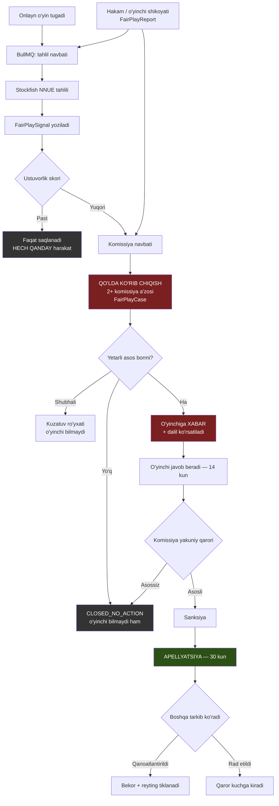
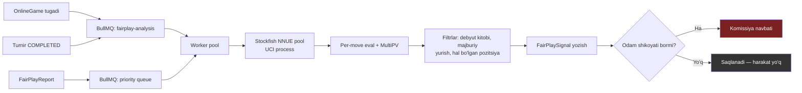

# Farzin — Fair-play va anti-chit tizimi

> **Loyiha:** Farzin — O'zbekiston shaxmatining raqamli infratuzilmasi
> **Hujjat:** 08 — Fair Play · **Modul:** `fairplay` · **Holat:** Draft v1
> **Muallif:** Sarvarbek Sodiqov · **Kanon:** `CANON.md` (ziddiyat bo'lsa — kanon g'olib)

## 0. Bu hujjatning asosiy tezisi

**Anti-chit tizimi hech qachon 100% aniq emas.** Bu — cheklov emas, masalaning tabiati.

Biz o'lchaydigan narsa — o'yinchining yurishlari engine yurishlariga qanchalik o'xshashligi. Biz **bilishimiz kerak** bo'lgan narsa — o'yinchi engine ishlatganmi. Bu ikkisi bir xil emas va hech qachon bo'lmaydi: kuchli grossmeyster toza o'ynab ham engine bilan yuqori mos kelishi mumkin; ayyor chit qiluvchi ataylab yomon yurib skorni pasaytirishi mumkin.

Shuning uchun bu hujjatdagi har bir raqam, chegara va signal — **ehtimollik, isbot emas**. Tizim **hech qachon** o'zi qaror qabul qilmaydi. U faqat odamga: "bu o'yinga qarab chiqing" deydi. `CANON.md` §7.5 buni talab qiladi: *"Anti-cheat — HALOL yoz: bu ehtimollik, isbot emas."* Butun hujjat shu jumla atrofida qurilgan.

| Termin | Ma'nosi |
|---|---|
| OTB | Over-the-board — jonli, taxta ortidagi o'yin |
| Engine | Shaxmat dvigateli (bizda: Stockfish 17 NNUE) |
| CPL | Centipawn loss — yurishning eng yaxshisidan farqi (1 piyoda = 100 cp) |
| T1 match | Yurish engine'ning 1-tavsiyasiga mos kelishi |
| IPR | Intrinsic Performance Rating (Regan) — yurish sifatidan chiqarilgan reyting |
| FP / FN | False positive (tozani aybladik) / false negative (chitni o'tkazdik) |
| Komissiya | Fair-play komissiyasi — qaror qabul qiladigan **odamlar** |

---

## 1. Muammo miqyosi

### 1.1. Onlayn: chit qilish arzimas darajada oson

Onlayn chit qilish uchun texnik bilim kerak emas. Yetarli: ikkinchi qurilma (telefon), bepul engine ilovasi va pozitsiyani qo'lda ko'chirish. Stockfish bepul, ochiq kodli va o'rtacha telefonda ham istalgan insondan kuchli o'ynaydi — eng kuchli inson ~2830 Elo, telefondagi Stockfish undan sezilarli darajada yuqori (aniq farq apparat va vaqt nazoratiga bog'liq — **benchmark bilan tekshirilishi kerak**).

Ya'ni **to'siq nolga teng**; motivatsiya kifoya. Motivatsiya esa bor: onlayn reyting, pul mukofoti, turnir saralashi, oddiy g'urur.

Bundan yomoni: chit qiluvchi **qanchalik ishlatishni tanlaydi**. Har yurishda engine — oson aniqlanadi. Partiyada 2–3 marta, faqat kritik pozitsiyada — deyarli aniqlab bo'lmaydi; bu holat statistik jihatdan shovqindan farq qilmaydi va biz buni ochiq tan olamiz.

### 1.2. OTB: qiyinroq, lekin imkonsiz emas

OTB da chit qiluvchi jismonan zalda, kuzatuv ostida, telefonsiz. Signal olish kerak — bu fizik iz qoldiradi: yashirin quloqchin, tebranish qurilmasi, hamkor, hojatxonada telefon.

OTB da **ma'lumot kanali** — asosiy zaiflik. Pozitsiya real vaqtda tashqariga chiqsa (jonli translyatsiya orqali), tashqaridagi hamkor engine'ga kiritib javobni qaytarishi mumkin. Shuning uchun OTB da eng samarali chora — **statistik tahlil emas, kanalni yopish** (§7).

### 1.3. Ikkalasining farqi — qaror uchun muhim

| | Onlayn | OTB |
|---|---|---|
| Chit to'sig'i | Deyarli nol | Yuqori — fizik risk bor |
| Asosiy dalil | Statistik (yurish, vaqt) | Fizik (qurilma, guvoh, video) |
| Xulq-atvor signali | Bor (tab switch, device, IP) | Yo'q |
| Nazorat imkoni | Cheklangan | Yuqori (detektor, telefon siyosati) |
| Xato narxi | Onlayn hisob | **Sport karyerasi** |
| Eng samarali chora | Statistik screening + qo'lda ko'rib chiqish | Kechiktirilgan translyatsiya + fizik nazorat |

Xulosa: **onlayn uchun statistika asosiy vosita, OTB uchun — yordamchi.** OTB da statistika hech qachon yagona asos bo'lmaydi. Bu qaror butun hujjat davomida saqlanadi.

---

## 2. Aniqlash signallari

Har biri uchun: **nima o'lchanadi** · **qanday hisoblanadi** · **false positive xavfi**. Hech bir signal yolg'iz yetarli emas; birgalikda ham **isbot bermaydi** — faqat "bu o'yinga odam qarasin" degan ustuvorlik beradi.

### 2.1. Engine korrelyatsiya

**Nima o'lchanadi.** O'yinchining yurishlari Stockfish tavsiyasiga qanchalik mos kelishi va xatolari qanday taqsimlanishi.

**Qanday hisoblanadi.** Har pozitsiya Stockfish NNUE tomonidan belgilangan byudjetda (§8.2) `MultiPV` bilan baholanadi. Undan uch o'lchov chiqadi:

1. **T1 match rate** — yurish engine'ning 1-tavsiyasiga mos kelgan pozitsiyalar ulushi. Faqat **"real tanlov bor"** pozitsiyalar hisoblanadi: 1- va 2-yurish farqi < 30 cp bo'lsa (deyarli teng), yagona legal yurish bo'lsa, yoki pozitsiya hal bo'lgan bo'lsa (|eval| > 500 cp) — **chiqarib tashlanadi**. Sabab: majburiy yurishni topish mahorat emas va u har kimda 100% mos keladi; bu filtrsiz T1 rate ma'nosiz raqam.
2. **CPL taqsimoti** — o'rtacha emas, **butun taqsimot**. Inson o'yinida CPL og'ir dumli (heavy-tailed): ko'p yurish 0–20 cp, lekin vaqti-vaqti bilan 200+ cp jiddiy xato. Engine yordamchisida bu dum **yo'qoladi** — o'rtacha CPL past emas, balki **dispersiya g'ayritabiiy past**. Amalda dispersiyaning yo'qolishi o'rtachaning pastligidan kuchliroq signal.
3. **Murakkablik bilan bog'liqlik** — pozitsiya murakkablashgani sari inson aniqligi **tushadi**. Bu eng ishonchli struktura. Chit qiluvchida aniqlik murakkablikdan **mustaqil** bo'lib qoladi: u oson pozitsiyada ham, murakkabida ham bir xil mukammal. Murakkablik proksisi: legal yurishlar soni, top-N eval tarqoqligi, taktik o'tkirlik (**aniq formula kalibrlashda belgilanadi**).

**FP xavfi — yuqori:**

- **Kuchli o'yinchi tabiiy ravishda yuqori mos keladi.** GM tinch pozitsiyalarda 60–70% T1 ga chiqishi normal — bu raqam **taxminiy**, o'yin turiga qattiq bog'liq, kalibrlashdan (§9) oldin unga tayanmaslik kerak.
- **Nazariya.** Yodlangan debyut 20 yurishgacha 100% mos keladi — bu chit emas, tayyorgarlik. Yechim: debyut kitobidagi yurishlar chiqariladi.
- **Oddiy endshpil.** Texnika bilan yutiladigan endshpilda mos kelish tabiiy yuqori. Yechim: tablebase va hal qilingan pozitsiyalar chiqariladi.
- **Qisqa o'yin — statistik ma'nosiz.** 20 baholanadigan yurishdan xulosa chiqmaydi (§9.3).

### 2.2. Vaqt fingerprint

**Nima o'lchanadi.** Har yurish uchun qancha o'ylagani va bu vaqt pozitsiya murakkabligiga qanday bog'langani.

**Nega ishlaydi.** Inson o'ylash vaqti pozitsiyaga **javob beradi**: oson yurish tez (2–5 s), murakkab yurish sekin (30–90 s), kritik qarorda juda sekin. Bu bog'liqlik — inson kognitsiyasining barmoq izi.

Engine ishlatuvchida bog'liqlik **buziladi**, chunki vaqt boshqa narsaga ketadi: pozitsiyani ko'chirish, javobni o'qish, taxtaga qaytarish. Bu jarayon murakkablikka **bog'liq emas** — har safar taxminan bir xil. Natijada: (1) murakkablik ↔ vaqt korrelyatsiyasi nolga yaqinlashadi (toza o'yinchida u musbat va sezilarli); (2) vaqt dispersiyasi pasayadi; (3) **anomaliya:** murakkab pozitsiyada **tez** mukammal yurish — eng kuchli yakka signal, chunki inson 3 soniyada 5 yurishlik taktikani ko'rmaydi.

**Qanday hisoblanadi.** Har yurish uchun sarflangan vaqt va murakkablik bahosi olinadi; korrelyatsiya va dispersiya hisoblanadi. Aniq statistik test (Spearman ρ yoki regressiya qoldig'i) **kalibrlashda tanlanadi** — hozir tanlash uchun ma'lumot yo'q.

> **Bog'liqlik — hal qilinishi kerak.** Bu signal `Move` yozuvida **har bir yurish uchun sarflangan vaqt** saqlanishini talab qiladi (taxminiy nom: `thinkTimeMs`). `07-realtime-and-clock.md` server-authoritative taymerni belgilaydi, lekin bu maydonni hozircha ta'riflamaydi — ya'ni bu **`fairplay` modulining `play` moduliga qo'ygan talabi**, mavjud fakt emas. Kelishilmasa bu signal umuman ishlamaydi.

**FP xavfi — o'rtacha, lekin nozik:**

- **Bullet va blitz** — vaqt bosimida hamma tez o'ynaydi, korrelyatsiya tabiiy zaif. Bu signal asosan klassik va rapid uchun ishonchli.
- **Premove** — 0 ms ko'rsatadi; bu chit emas, alohida belgilanib chiqariladi.
- **Real hayot.** Odam chalg'idi, telefon jiringladi — vaqt "g'alati" chiqadi.
- **Uslub.** Ba'zi o'yinchilar tabiatan tez o'ynaydi.

**Muhim:** vaqt signali engine korrelyatsiyasidan **mustaqil**. Ikkalasi bir vaqtda ishlashi — har biri alohida ishlashidan ancha kuchliroq. Aynan shuning uchun ular alohida saqlanadi, bitta raqamga qo'shib yuborilmaydi.

### 2.3. Reyting sakrashi

**Nima o'lchanadi.** Haqiqiy natija reytingdan kutilgan natijadan qanchalik farq qilishi (performance rating anomaliyasi).

**Qanday hisoblanadi.** Turnir yoki davr uchun performance rating hisoblanib, joriy Glicko-2 reytingi va uning RD si bilan solishtiriladi. RD hisobga olinishi **shart**: yangi o'yinchining RD yuqori, ya'ni undan katta og'ish kutiladi va bu anomaliya emas.

**FP xavfi — juda yuqori. Bu eng zaif signal:**

- **O'sayotgan yosh o'yinchi.** 12 yoshli bola 6 oyda +300 o'sishi butunlay normal. Yosh sportchi — bizning asosiy personamiz (`01-product-spec.md` §1.2), ya'ni bu FP aynan eng himoyasiz guruhga tegadi.
- **Yangi hisob.** Tajribali o'yinchi yangi ro'yxatdan o'tsa boshlang'ich reytingi past — u "sakraydi", chunki reytingi noto'g'ri edi.
- **Oddiy omad.** Qisqa turnirda +400 performance statistik jihatdan tez-tez uchraydi.

**Shuning uchun reyting sakrashi hech qachon `FairPlayCase` ochish uchun asos bo'lmaydi.** U faqat **navbat tartiblagichi**: qaysi o'yinni birinchi tahlil qilishni aytadi. Kod darajasida majburlanadi (§8.3).

### 2.4. Xulq-atvor signallari

Faqat **onlayn** uchun — OTB da bunday ma'lumot yo'q.

**Tab switching / focus.** Brauzer `visibilitychange` va `blur` hodisalari yoziladi: qachon, necha marta, qancha turdi.

- *Xavf — yuqori.* Odam xabar o'qidi, boshqa ilovaga o'tdi, qo'ng'iroq keldi. Mobil brauzerda focus yo'qolishi **doimiy** hodisa.
- Faqat **vaqt bilan birga** ma'noli: har murakkab yurishdan **oldin** focus yo'qolib, keyin darhol mukammal yurish kelishi — struktura. Shunchaki "50 marta tab almashtirgan" — hech nima.
- **Aylanib o'tish oson:** ikkinchi qurilmadagi engine hech qanday focus hodisasi qoldirmaydi. Ya'ni bu signal jiddiy chit qiluvchini tutmaydi.

**Qurilma fingerprint va IP.** Ko'p hisob aniqlash uchun: bir qurilma yoki IP dan bir nechta hisob.

- *Xavf — yuqori.* Umumiy IP: maktab, universitet, internet-kafe, oila, mobil operator NAT (O'zbekistonda keng tarqalgan). **Bitta oiladan ikki aka-uka o'ynashi normal.** `school` moduli butun sinfni bitta IP dan olib keladi — ya'ni bu signal bizning B2G auditoriyamizda muntazam yonadi.
- **Hech qachon** yolg'iz ishlatilmaydi — faqat boshqa signal bor o'yinchilar orasidagi bog'liqlikni ko'rsatish uchun.

**Ko'p hisob (multi-accounting).** Reyting to'ldirish (boosting), ataylab yutqazish (sandbagging), ban'dan qochish. Signal: bir xil qurilma/IP + bir-biriga qarshi tez-tez o'ynash + natijalar bir tomonga og'ishi + o'ynash vaqtlari bir-birini istisno qilishi. *Xavf — o'rtacha;* yuqoridagi oila/maktab holati bu yerda ham amal qiladi.

### 2.5. Signallar jamlanishi

| Signal | Kuchi | FP xavfi | Yolg'iz yetarlimi | Qayerda |
|---|---|---|---|---|
| Engine korrelyatsiya (T1 + CPL taqsimoti) | Yuqori | Yuqori | **Yo'q** | Onlayn + OTB |
| Murakkablik ↔ aniqlik bog'liqligi | Yuqori | O'rtacha | **Yo'q** | Onlayn + OTB |
| Vaqt fingerprint | O'rtacha–yuqori | O'rtacha | **Yo'q** | Onlayn (klassik/rapid) |
| Reyting sakrashi | Past | **Juda yuqori** | **Yo'q** | Ikkalasi |
| Tab switching | Past | Yuqori | **Yo'q** | Faqat onlayn |
| Qurilma / IP / multi-account | Past | Yuqori | **Yo'q** | Faqat onlayn |

Diqqat: "Yolg'iz yetarlimi" ustunida **bitta ham "Ha" yo'q**. Bu — jadvalning asosiy xabari.

---

## 3. Statistik model

### 3.1. Ken Regan yondashuvi

Bu sohadagi eng jiddiy akademik ish — **Ken Regan** (University at Buffalo) tomonidan qilingan; uning modeli FIDE va ACP tomonidan haqiqiy fair-play ishlarida ishlatilgan.

Asosiy g'oya, umumiy shaklda: yurishni "to'g'ri/xato" deb ikkiga bo'lish o'rniga **butun pozitsiyaning yurish spektri** hisobga olinadi. Har bir legal yurish uchun engine bahosi olinadi va o'yinchi shu spektrdan qaysi yurishni tanlagani modellashtiriladi. Model o'yinchi kuchini bir necha parametr bilan tavsiflaydi (taxminan: "sensitivity" — kichik farqlarni sezish, va "consistency" — xatoning kattaligi). Bu parametrlar reyting darajalariga moslanadi va shundan **IPR (Intrinsic Performance Rating)** — faqat yurish sifatidan chiqarilgan reyting — hisoblanadi. Keyin haqiqiy reyting va IPR farqi **z-score** sifatida beriladi.

> **MUHIM — to'qib chiqarmaymiz.** Yuqoridagi tavsif — umumiy shakl. Modelning aniq ko'rinishi, parametrlarni baholash usuli, chuqurlik sozlamalari, IPR ning formulasi va z-score chegaralari **Regan & Haworth (2011), "Intrinsic Chess Ratings" (AAAI) maqolasidan va keyingi ishlaridan tekshirilishi kerak.** Bu hujjatda aniq formula yozilmagan — chunki tekshirilmagan formulani yozish uni to'qib chiqarish bilan teng. Implementatsiyadan oldin birlamchi manba o'qilishi shart. Modelni **ko'chirmasdan** turib "biz Regan usulini ishlatamiz" deb yozish yolg'on bo'lardi.

### 3.2. Z-score nimani anglatadi va nimani anglatmaydi

Z-score — **"toza o'yinchi" gipotezasi (H₀) to'g'ri bo'lganda, bu natija kutilgandan necha standart og'ish uzoqda"** degan raqam. U **aytmaydi**: "bu odam chit qilgan ehtimoli 99.99%". Bu — klassik **prosecutor's fallacy**. Farq muhim:

- Z-score beradi: **P(bunday ma'lumot | toza)**.
- Bizga kerak: **P(chit qilgan | bunday ma'lumot)**.

Bular teng emas. Ikkinchisi uchun **prior** kerak — umuman qancha o'yinchi chit qiladi. Bu raqam bizda **yo'q** va hech kimda aniq yo'q.

Sonli misol. Chegara shunday tanlangan deylik: toza o'yinchilarning 0.01% i undan o'tadi (FP = 0.0001), chit qiluvchilarning 50% i tutiladi. 10 000 o'yinchidan 10 tasi chit qilsa (0.1% prior):

- Chit qiluvchilardan tutilgan: 10 × 0.5 = **5**
- Toza o'yinchilardan noto'g'ri belgilangan: 9 990 × 0.0001 ≈ **1**
- Ya'ni chegaradan o'tgan 6 kishidan **1 tasi begunoh (~17%)**.

Bu — juda **optimistik** stsenariy (0.01% FP real tizimlarda erishish qiyin). Prior pasaysa, begunohlar ulushi keskin oshadi. Xulosa: **statistika o'zi hech qachon ban uchun yetarli emas.** Raqamlar illyustratsiya — haqiqiy qiymatlar §9 kalibrlashidan chiqadi.

### 3.3. Bizning yondashuvimiz

Birinchi bosqichda **o'z modelimizni yozmaymiz**: kalibrlash uchun ma'lumot yo'q (§9.1), modelsiz statistika esa sonlar teatri. Shuning uchun:

1. **Bosqich 1 (hozir):** signallarni **yig'amiz va saqlaymiz**, xulosa chiqarmaymiz. `FairPlaySignal` yoziladi; `FairPlayCase` faqat **odam shikoyati** (`FairPlayReport`) orqali ochiladi. Avtomatik skoring yo'q.
2. **Bosqich 2:** yetarli ma'lumot to'plangach — sodda, tushuntiriladigan ustuvorlik skori. Maqsad: navbat tartiblash, ayblash emas.
3. **Bosqich 3:** kalibrlash muvaffaqiyatli bo'lsa — Regan yondashuviga o'tish (birlamchi manba o'qilgandan keyin).

**Nega shunday.** Ishlamaydigan model bilan odam ayblashdan ko'ra modelsiz qolgan yaxshiroq. Birinchi bosqichda tizim halol ravishda kam narsa qiladi va buni yashirmaydi.

---

## 4. Qaror qabul qilish

### 4.1. Hech qachon avtomatik doimiy ban

Bu — muzokara qilinmaydigan qoida.

**Nega.** Ayblangan o'yinchi uchun narx — bitta onlayn hisob emas: sport karyerasi, unvon, terma jamoa, homiylik, obro'. O'zbekiston shaxmat jamiyati kichik — Toshkentda birov chitda ayblansa ertasiga hamma biladi. Bu ayblov o'chirilmaydi: keyin oqlansa ham "o'sha ayblangan bola" bo'lib qoladi. **Bolalar uchun bu bir umrga.**

Endi §3.2 hisobiga qaytamiz: **eng yaxshi stsenariyda ham chegaradan o'tganlarning ~17% i begunoh.** Avtomatik ban degani — har oltinchi holatda begunoh bolaning karyerasini algoritm buzadi, hech kim ko'rmasdan. Evaziga nima olamiz? Bir necha kun tezlik. Bu almashuv aniq yomon.

Qo'shimcha sabab: **avtomatik tizim teskari muhandislik qilinadi.** Chegara qattiq bo'lsa, chit qiluvchi uning ostida qolishni o'rganadi (ataylab bitta yomon yurish). Avtomatik ban ayyorni tutmaydi — u faqat qo'polini tutadi va begunohni yiqitadi.

### 4.2. Bosqichlar



1. **Signal → skor.** To'liq avtomatik; bu yerda hech kim ayblanmaydi. Skorning yagona vazifasi — komissiyaning cheklangan vaqtini qayerga sarflashni aytish.
2. **Qo'lda ko'rib chiqish.** Kamida **ikki** komissiya a'zosi, **mustaqil** (bir-birining xulosasini ko'rmasdan). Ular o'yin, tahlil, signal tarixi va profilni ko'radi. Ular **odam** — "bu pozitsiyada bu yurishni topish qiyinmi?" degan savolga javob bera oladi, algoritm bera olmaydi.
3. **Xabar berish.** Bu bosqichgacha o'yinchi **hech narsa bilmaydi** — ataylab: asossiz shubha odamga yetkazilmasligi kerak.
4. **Javob berish huquqi — 14 kun.** O'yinchi tushuntiradi ("o'sha debyutni Caruana partiyasidan yodlaganman"). Ko'p holat aynan shu bosqichda hal bo'ladi.
5. **Apellyatsiya — 30 kun, boshqa tarkib.** Birinchi qarorda qatnashgan odam apellyatsiyani ko'rmaydi. Bu — asosiy protsessual kafolat.

### 4.3. Sanksiya darajalari

| Daraja | Chora | Kim qaror qiladi |
|---|---|---|
| 0 | Harakat yo'q, signal saqlanadi | Avtomatik |
| 1 | Kuzatuv ro'yxati (o'yinchi bilmaydi) | 1 komissiya a'zosi |
| 2 | Ogohlantirish + suhbat | 2 komissiya a'zosi |
| 3 | Turnir natijasi bekor | Komissiya + turnir hakami |
| 4 | Vaqtinchalik chetlashtirish (1–12 oy) | To'liq komissiya |
| 5 | Uzoq muddatli chetlashtirish | To'liq komissiya + federatsiya |

**Doimiy ban ro'yxatda yo'q.** Eng og'iri — uzoq muddatli, u ham federatsiya tasdig'i bilan. Sabab: doimiy qaror — qaytarib bo'lmaydigan qaror, biz esa xato qilishimiz mumkinligini bilamiz.

---

## 5. Ma'lumot modeli

`CANON.md` §6 entity ro'yxatiga **qo'shimcha** (mavjud nomlar o'zgartirilmaydi). Konvensiya kanondagidek: PK — UUID v7, jadval nomlari `snake_case` + ko'plik, Prisma modellari `PascalCase` + birlik, hamma joyda `created_at` / `updated_at`.

**Uch entity, uch vazifa:** `FairPlayReport` — **odam** shikoyati (kimdir shubhalanmoqda); `FairPlaySignal` — **mashina** o'lchovi (bitta o'yin, bitta o'lchov turi); `FairPlayCase` — **ish** (odamlar ko'rib chiqadigan, qaror chiqadigan yagona joy).

Ular ataylab ajratilgan: signal ko'p va arzon, ish kam va qimmat. Signal hech qachon o'zi ishga aylanmaydi — ish faqat odam qaroridan tug'iladi.

```prisma
// prisma/schema.prisma — fairplay module

enum FairPlayReportSource { ARBITER  PLAYER  COACH  AUTOMATED_SCREENING }

enum FairPlaySignalKind {
  ENGINE_CORRELATION    // T1 match rate + CPL distribution
  COMPLEXITY_DECOUPLING // accuracy no longer degrades with complexity
  TIME_FINGERPRINT      // think time vs. position complexity
  RATING_ANOMALY        // performance vs. Glicko-2 expectation (weak: ordering only)
  BEHAVIORAL_FOCUS      // tab/window focus loss around critical moves
  DEVICE_OVERLAP        // shared device/IP across accounts
}

enum FairPlayCaseStatus {
  OPEN  UNDER_REVIEW  AWAITING_PLAYER_RESPONSE  DECIDED
  APPEALED  CLOSED_NO_ACTION  OVERTURNED
}

model FairPlayReport {
  id           String               @id @default(uuid(7))
  source       FairPlayReportSource
  reporterId   String?              @map("reporter_id") // null for AUTOMATED_SCREENING
  subjectId    String               @map("subject_id")  // Player under suspicion
  onlineGameId String?              @map("online_game_id")
  tournamentId String?              @map("tournament_id")
  reason       String               @db.Text
  caseId       String?              @map("case_id")
  createdAt    DateTime             @default(now()) @map("created_at")
  updatedAt    DateTime             @updatedAt @map("updated_at")

  subject      Player               @relation("ReportsAgainst", fields: [subjectId], references: [id])
  case         FairPlayCase?        @relation(fields: [caseId], references: [id])

  @@index([subjectId, createdAt])
  @@map("fair_play_reports")
}

model FairPlaySignal {
  id           String             @id @default(uuid(7))
  kind         FairPlaySignalKind
  subjectId    String             @map("subject_id")
  onlineGameId String?            @map("online_game_id")
  gameResultId String?            @map("game_result_id") // OTB game

  /// Raw measured value. Meaning depends on `kind` — NOT comparable across kinds.
  value        Decimal            @db.Decimal(10, 6)
  /// Positions this value came from. Below the §9.3 minimum the signal is
  /// statistically meaningless and MUST be ignored by every consumer.
  sampleSize   Int                @map("sample_size")
  /// Engine build, depth, MultiPV, book/tablebase filters. Without this the value
  /// is not reproducible — and a non-reproducible number cannot support an accusation.
  analysisMeta Json               @map("analysis_meta")
  caseId       String?            @map("case_id")
  createdAt    DateTime           @default(now()) @map("created_at")
  updatedAt    DateTime           @updatedAt @map("updated_at")

  subject      Player             @relation(fields: [subjectId], references: [id])
  case         FairPlayCase?      @relation(fields: [caseId], references: [id])

  @@index([subjectId, kind, createdAt])
  @@map("fair_play_signals")
}

model FairPlayCase {
  id             String             @id @default(uuid(7))
  subjectId      String             @map("subject_id")
  status         FairPlayCaseStatus @default(OPEN)

  /// Opened ONLY by a human — there is no code path from a signal to a case (§4.1).
  openedByUserId String             @map("opened_by_user_id")
  openedAt       DateTime           @default(now()) @map("opened_at")

  /// Independent conclusions; a decision needs at least two (§4.2).
  reviewerNotes  Json?              @map("reviewer_notes")
  decision       String?            @db.Text
  decisionReason String?            @db.Text @map("decision_reason")
  sanctionLevel  Int?               @map("sanction_level") // §4.3, 0..5 — never permanent
  decidedAt      DateTime?          @map("decided_at")
  playerResponse String?            @db.Text @map("player_response")
  appealDeadline DateTime?          @map("appeal_deadline")
  /// Retention clock (§6.3). Set on close; a purge job honours it.
  purgeAfter     DateTime?          @map("purge_after")
  createdAt      DateTime           @default(now()) @map("created_at")
  updatedAt      DateTime           @updatedAt @map("updated_at")

  subject        Player             @relation(fields: [subjectId], references: [id])
  reports        FairPlayReport[]
  signals        FairPlaySignal[]

  @@index([status, openedAt])
  @@map("fair_play_cases")
}
```

**Model ichiga yozilgan qarorlar:**

1. `FairPlayCase.openedByUserId` — **nullable emas**. Ish har doim odam tomonidan ochiladi. Bu — §4.1 qoidasining sxema darajasidagi kafolati.
2. `FairPlaySignal.analysisMeta` — majburiy: engine versiyasi va sozlamasisiz raqam qayta ishlab chiqarilmaydi, qayta ishlab chiqarilmaydigan raqam bilan esa odam ayblab bo'lmaydi.
3. `sanctionLevel` — 0..5, doimiy ban yo'q (§4.3).
4. `purgeAfter` — saqlash muddati sxemada, siyosat hujjatida emas (§6.3).
5. `value` — `Decimal`, `Float` emas (kanon qoidasi).

---

## 6. Yuridik va axloqiy jihat

### 6.1. Ayblovning narxi

Chit qilishda ayblash — **obro'ga zarar** (defamation) hududiga kiradi. Bu bizning fikrimiz emas, huquqiy haqiqat. Xato ayblov narxi: **o'yinchi uchun** — karyera, unvon, terma jamoa, homiy, obro'; bola uchun bir umr. **Farzin uchun** — sud da'vosi, federatsiya shartnomasining bekor bo'lishi, ishonchning yo'qolishi (`01-product-spec.md` §7.6 buni to'g'ridan-to'g'ri **muvaffaqiyatsizlik sharti** deb belgilaydi).

Shuning uchun asosiy qoida: **ikkinchi tur xato (chitni o'tkazib yuborish) birinchi tur xatodan (begunohni ayblash) afzal.** Bu — ataylab tanlangan assimetriya: biz ko'proq chit qiluvchini o'tkazib yuboramiz, evaziga kamroq begunohni ayblaymiz.

### 6.2. Ayblanuvchining huquqlari

Kod darajasida majburlanadi, siyosat hujjatida qolmaydi:

1. **Bilish huquqi.** Ayblov rasmiylashsa (`AWAITING_PLAYER_RESPONSE`), o'yinchi xabardor qilinadi. Yashirin ayblov yo'q.
2. **Dalilni ko'rish huquqi.** Qaysi o'yin, qaysi yurish, qanday tahlil. "Tizim aytdi" — dalil emas va hech qachon o'yinchiga shunday deb aytilmaydi.
3. **Javob berish huquqi** — 14 kun.
4. **Apellyatsiya huquqi** — 30 kun, **boshqa tarkib** ko'radi.
5. **Oqlanish huquqi.** `CLOSED_NO_ACTION` yoki `OVERTURNED` bo'lsa: reyting tiklanadi, turnir natijasi qaytariladi, kuzatuv ro'yxatidan olinadi. Ayblov ommaga chiqqan bo'lsa — **rasmiy oqlash e'lon qilinadi**, xuddi ayblov kabi ochiq.
6. **Sukut saqlash zarar keltirmaydi.** Javob bermaslik ayb belgisi emas.
7. `01-product-spec.md` §4.1 buni RBAC da mustahkamlaydi: `FairPlayCase` ustidagi `PLAYER` ning `R*` — o'yinchi **o'ziga qarshi** ishni ko'ra oladi.

### 6.3. Maxfiylik va saqlash muddati

| Ma'lumot | Saqlash | Sabab |
|---|---|---|
| `FairPlaySignal` (ish ochilmagan) | **12 oy** | Kalibrlash uchun kerak, abadiy emas |
| `FairPlayCase` — `CLOSED_NO_ACTION` | **6 oy** | Odam oqlandi — dosye qolmasligi kerak |
| `FairPlayCase` — sanksiya bilan | Sanksiya muddati + **2 yil** | Takroriylikni ko'rish uchun |
| `FairPlayCase` — `OVERTURNED` | **3 oy** | Xato qildik — izini saqlamaymiz |
| Xulq-atvor (focus, IP, device) | **3 oy** | Eng maxfiy, eng zaif signal |
| `AuditLog` (kim qaror qildi) | Kanon bo'yicha | Komissiya javobgarligi |

**Kirish huquqi.** `FairPlayCase` ni faqat komissiya (`SUPER_ADMIN`, `FEDERATION_ADMIN`) va **ayblanuvchining o'zi** ko'radi. `CLUB_ADMIN` **ko'rmaydi** — u o'z a'zosiga bosim o'tkazishi mumkin (`01-product-spec.md` §4.1 matritsasida ham qat'iy).

**Voyaga yetmaganlar.** Ish 18 yoshdan kichik o'yinchiga tegishli bo'lsa: ota-ona/vasiy darhol xabardor qilinadi; o'yinchi bilan muloqot **faqat** vasiy ishtirokida; natija hech qachon ommaga chiqmaydi (sanksiya darajasidan qat'i nazar).

**Ochiq savol:** O'zbekiston shaxsiy ma'lumot qonuni bu muddatlarga qanday talab qo'yadi — **yurist bilan tekshirilishi kerak** (`01-product-spec.md` §8.4). Yuqoridagilar — bizning axloqiy pozitsiyamiz, huquqiy tahlil emas.

---

## 7. OTB turnirlar uchun

### 7.1. Nega statistika OTB uchun yetarli emas

OTB da xato narxi eng yuqori (rasmiy turnir, unvon, saralash), namuna esa eng kichik (turnirda 9 o'yin). Eng katta xavf, eng kam ma'lumot — statistikaning eng yomon holati. Shuning uchun OTB da asosiy strategiya — **aniqlash emas, oldini olish**: chit qilishni qiyinlashtirsang, keyin kimni ayblashni hal qilishing shart bo'lmaydi.

### 7.2. Kechiktirilgan translyatsiya — eng samarali chora

**Chora.** Jonli translyatsiya **15 daqiqa kechikish** bilan chiqariladi.

**Nega ishlaydi.** OTB chitning eng amaliy sxemasi — tashqi hamkor: translyatsiyani ko'radi, engine'ga kiritadi, javobni signal bilan yetkazadi. Bu zanjir **real vaqtdagi pozitsiyaga** bog'liq. Pozitsiya 15 daqiqa kechiksa, hamkor **allaqachon o'ynalgan** yurishni ko'radi — maslahati qiymatsiz.

**Nega eng yaxshi chora:**

- **Sababni yo'q qiladi, oqibatni emas.** Statistika chit bo'lgandan keyin ishlaydi; kechikish chitni **bo'lmaydigan** qiladi. Yechilmagan ish qolmaydi.
- **Hech kimni ayblamaydi.** Nol false positive — chunki ayblov umuman yo'q. Bu — hujjatdagi yagona chora, FP xavfi nolga teng.
- **Deyarli tekin.** Bir necha qator kod (buferlangan navbat), qurilma emas.
- **Isbotlangan.** Yirik turnirlarda standart amaliyot (aniq kechikish qiymati turnirdan turnirga farq qiladi — **hozirgi FIDE tavsiyasi tekshirilishi kerak**).

**Narxi.** Tomoshabin tajribasi biroz yomonlashadi — arzimas narx. Sahifada sabab ochiq yoziladi: "fair-play uchun kechiktirilgan translyatsiya". Tomoshabin tushunadi.

Texnik jihatdan bu `broadcast` moduli mas'uliyati (`07-realtime-and-clock.md` §11), lekin qaror shu yerda yoziladi — chunki bu **fair-play qarori**, translyatsiya qarori emas.

### 7.3. Fizik choralar

| Chora | Samaradorlik | Narxi | Izoh |
|---|---|---|---|
| Kechiktirilgan translyatsiya | **Yuqori** | ~0 | Eng yaxshi nisbat |
| Telefon siyosati (zalga kirmaydi) | Yuqori | Past | Shkaf kerak |
| Metall detektor (tanlab) | O'rtacha | O'rtacha | Hakam tayyorgarligi kerak |
| Metall detektor (hamma, har raund) | O'rtacha | Yuqori | Navbat, norozilik |
| Hojatxona nazorati | O'rtacha | Past | Eng ko'p ishlatiladigan joy |
| Video yozuv | Past (aniqlash) / Yuqori (dalil) | O'rtacha | Keyingi tekshiruv uchun |

**Metall detektor haqida halol gap.** U sport soatini va tebranish qurilmasini topadi; topmaydigan narsalar ham bor va buni ochiq tan olish kerak. Uning asosiy qiymati — **to'siq** (deterrent): tekshirilishini bilgan odam urinmaydi. Ya'ni psixologik vosita sifatida texnik vositadan kuchliroq. Muhim: detektor **hurmat bilan** qo'llanishi kerak — bolani hamma oldida tintuv qilish qabul qilib bo'lmas. Farzin bu choralarni **qayd qiladi** (`Tournament` reglamentida), o'tkazish tartibi esa tashkilotchi va hakam mas'uliyati.

### 7.4. OTB uchun Farzin nima qiladi

1. **Kechiktirilgan translyatsiya** — `Tournament` sozlamasi, rasmiy turnirlar uchun default **yoqilgan**. Tashkilotchi o'chirishi mumkin, lekin bu `AuditLog` da qoladi.
2. **Reglament qaydi** — turnirda qanday fair-play choralari qo'llangani yoziladi va ochiq ko'rinadi. O'yinchi yozilishdan oldin biladi.
3. **Hakam uchun `FairPlayReport`** — shubhani rasmiy qayd qilish (og'zaki emas).
4. **Post-turnir tahlil** — natija va reyting tasdiqlangandan keyin, asinxron. Turnir davomida tahlil natijasi hakamga **ko'rsatilmaydi**: bu uning qaroriga ta'sir qiladi va o'yinchiga nisbatan noxolislik yaratadi.

---

## 8. Texnik implementatsiya

### 8.1. Arxitektura

Stockfish 17 NNUE **server tomonda**. Client'dagi WASM Stockfish (`CANON.md` §4) — faqat o'yinchi tahlili uchun, fair-play uchun **ishlatilmaydi**: client'ga ishonib bo'lmaydi va natijasi qayta ishlab chiqarilmaydi. Tahlil — **BullMQ job**, chunki og'ir (bitta o'yin uchun bir necha soniya CPU); hech qachon HTTP so'rov ichida bajarilmaydi.



### 8.2. Tahlil byudjeti

Byudjet — halol muhandislik kelishuvi: **chuqurroq tahlil = aniqroq signal = qimmatroq**.

| Ustuvorlik | Sabab | Byudjet (har yurish) | Namuna |
|---|---|---|---|
| `LOW` | Muntazam onlayn skrining | ~50 ms | Barcha reytingli o'yinlar |
| `NORMAL` | Rasmiy turnir | ~200 ms | OTB, tasdiqlangandan keyin |
| `HIGH` | Odam shikoyati bor | ~1 000 ms | `FairPlayReport` |
| `CASE` | Ish ochildi (§4.2) | ~5 000 ms + MultiPV=5 | Faqat `FairPlayCase` |

**Nega bosqichma-bosqich.** 40 yurishli o'yin `LOW` da ~2 s CPU; kuniga 10 000 o'yin bo'lsa ~5.5 soat CPU/kun — 1 core yetadi. Xuddi shu hajm `CASE` byudjetida ~9 kun CPU talab qiladi. Ya'ni chuqur tahlilni hammaga qo'llash mumkin emas — u faqat **ish ochilganda**, ya'ni **odam so'ragandan keyin** qilinadi. Bu nafaqat tejash, balki to'g'ri tartib: qimmat va aniq tahlil qaror qabul qilinadigan joyda bo'lishi kerak, skriningda emas.

**Diqqat:** bu hisob — taxminiy. Real throughput apparat, NNUE tarmoq hajmi va pozitsiya murakkabligiga bog'liq — **birinchi worker ishga tushgach benchmark bilan o'lchanishi kerak**.

### 8.3. Interfeyslar

```typescript
// src/modules/fairplay/analysis/analysis.types.ts

export type AnalysisPriority = 'LOW' | 'NORMAL' | 'HIGH' | 'CASE';

export const ANALYSIS_BUDGETS: Readonly<
  Record<AnalysisPriority, { msPerMove: number; multiPv: number }>
> = {
  LOW: { msPerMove: 50, multiPv: 2 },
  NORMAL: { msPerMove: 200, multiPv: 3 },
  HIGH: { msPerMove: 1_000, multiPv: 3 },
  CASE: { msPerMove: 5_000, multiPv: 5 },
};

/** Everything needed to reproduce a number. Stored in FairPlaySignal.analysisMeta. */
export interface AnalysisMeta {
  engine: string;            // "Stockfish 17"
  engineHash: string;        // binary checksum — the build must be pinnable
  nnueNet: string;           // NNUE network file id
  msPerMove: number;
  multiPv: number;
  bookPlies: number;         // opening plies excluded
  filteredPositions: number; // forced / decided / book positions dropped
  analyzedAt: string;        // ISO 8601
}

export interface MoveAnalysis {
  ply: number;
  playedMove: string;        // UCI, e.g. "e2e4"
  bestMove: string;
  /** Centipawn loss of the played move vs. the engine's best. Never negative. */
  cpLoss: number;
  isTopOne: boolean;
  /** Eval spread across top-N moves — the core complexity proxy (§2.1). */
  evalSpread: number;
  legalMoveCount: number;
  /** From Move.thinkTimeMs (07-realtime-and-clock.md — kelishilishi kerak). Null for premoves. */
  thinkTimeMs: number | null;
  /** True when this position carries no information (§2.1). */
  excluded: boolean;
  excludeReason?: 'BOOK' | 'FORCED' | 'DECIDED' | 'NEAR_EQUAL_ALTERNATIVES' | 'PREMOVE';
}
```

```typescript
// src/modules/fairplay/analysis/signal.extractor.ts
import { Injectable } from '@nestjs/common';
import { FairPlaySignalKind } from '@prisma/client';
import { spearman, standardDeviation } from '../../../common/stats';
import { MoveAnalysis } from './analysis.types';

export interface ExtractedSignal {
  kind: FairPlaySignalKind;
  value: number;
  sampleSize: number;
}

@Injectable()
export class SignalExtractor {
  /**
   * Turns an analyzed game into raw signals.
   *
   * These are MEASUREMENTS, not verdicts. Nothing here decides anything, and no
   * caller may treat a returned value as evidence of cheating (§0, §4.1).
   */
  extract(moves: readonly MoveAnalysis[]): ExtractedSignal[] {
    const scored = moves.filter((m) => !m.excluded);
    const signals: ExtractedSignal[] = [];

    if (scored.length > 0) {
      const topOne = scored.filter((m) => m.isTopOne).length;
      signals.push({
        kind: 'ENGINE_CORRELATION',
        value: topOne / scored.length,
        sampleSize: scored.length,
      });
    }

    // The VARIANCE of centipawn loss, not its mean: engine assistance flattens the
    // heavy tail of human blunders, so an abnormally LOW spread is the signal (§2.1).
    if (scored.length > 1) {
      signals.push({
        kind: 'COMPLEXITY_DECOUPLING',
        value: standardDeviation(scored.map((m) => m.cpLoss)),
        sampleSize: scored.length,
      });
    }

    // Human think time tracks position complexity; engine users decouple from it (§2.2).
    // Spearman (rank-based) tolerates the outliers real think-time data is full of —
    // a player who walked away mid-game must not dominate the correlation.
    const timed = scored.filter(
      (m): m is MoveAnalysis & { thinkTimeMs: number } => m.thinkTimeMs !== null,
    );
    if (timed.length > 2) {
      signals.push({
        kind: 'TIME_FINGERPRINT',
        value: spearman(timed.map((m) => m.evalSpread), timed.map((m) => m.thinkTimeMs)),
        sampleSize: timed.length,
      });
    }

    return signals;
  }
}
```

```typescript
// src/modules/fairplay/case/case.service.ts
import { ForbiddenException, Injectable } from '@nestjs/common';
import { PrismaService } from '../../../common/prisma/prisma.service';

@Injectable()
export class FairPlayCaseService {
  constructor(private readonly prisma: PrismaService) {}

  /**
   * The ONLY way a FairPlayCase comes into existence.
   *
   * There is deliberately no automated counterpart: no signal, score or threshold
   * can open a case (§4.1). `openedByUserId` is NOT NULL in the schema, so the
   * invariant survives even if someone later adds a background job by mistake.
   */
  async openCase(input: {
    subjectId: string;
    openedByUserId: string;
    reportIds: readonly string[];
  }) {
    if (input.reportIds.length === 0) {
      // A case must trace back to a human report — §4.2 step 2.
      throw new ForbiddenException('FAIRPLAY_CASE_REQUIRES_REPORT');
    }
    return this.prisma.fairPlayCase.create({
      data: {
        subjectId: input.subjectId,
        openedByUserId: input.openedByUserId,
        status: 'OPEN',
        reports: { connect: input.reportIds.map((id) => ({ id })) },
      },
    });
  }
}
```

---

## 9. Test va kalibrlash

### 9.1. Asosiy muammo: bizda ground truth yo'q

Kalibrlash uchun **aniq chit qilgan** va **aniq toza** o'yinlar to'plami kerak. Ikkalasi ham bizda yo'q:

- **Aniq chit qilgan:** faqat tan olingan yoki fizik dalil bilan isbotlangan holatlar. Ular kam — va aynan kam bo'lgani uchun **vakil emas**: tutilganlar odatda qo'pol ishlatgan, ya'ni ular bo'yicha sozlangan model ayyorlarni ko'rmaydi. Bu — **survivorship bias**, u tuzatilmaydi.
- **Aniq toza:** buni **isbotlab bo'lmaydi**. Har qanday "toza" to'plamda aniqlanmagan chit bo'lishi mumkin.

**Halol xulosa: mukammal kalibrlash imkonsiz.** Biz FP darajasini **baholaymiz**, bilmaymiz. Bu — hujjatdagi eng noqulay jumla, lekin u to'g'ri.

### 9.2. Amaliy yondashuv

1. **Sintetik chit to'plami.** Toza o'yindagi N% yurishni Stockfish yurishiga almashtiramiz (N = 100, 50, 20, 10, 5%). Bu **haqiqiy chit emas** (haqiqiy chit qiluvchi tanlab ishlatadi va vaqti boshqacha), lekin FN ning **yuqori chegarasini** beradi: model 100% almashtirilgan o'yinni ham ko'rmasa — model ishlamaydi.
2. **Tarixiy toza to'plam.** Engine'gacha bo'lgan davr (1990-gacha) OTB partiyalari — deyarli aniq toza. *Cheklov:* boshqa davr, boshqa uslub, hozirgi o'yinchiga to'liq mos kelmaydi.
3. **Ma'lum holatlar.** Ochiq e'lon qilingan chit ishlari (FIDE, Chess.com, Lichess) — kam va bizning kontekstimizga to'liq mos emas.
4. **Titul o'yinchilar to'plami.** GM/IM partiyalari — "yuqori T1 rate toza bo'lishi mumkin" gipotezasini tekshirish uchun. Bu **eng muhim** to'plam: u FP ning eng xavfli manbaini — kuchli o'yinchini — o'lchaydi.

### 9.3. Chegaralar va minimal namuna

| Parametr | Qiymat | Asos |
|---|---|---|
| Minimal baholanadigan yurish (bitta o'yin) | **20** | Undan kam — statistik ma'nosiz |
| Minimal yurish (`FairPlayCase` uchun) | **100** | Bir necha o'yin bo'ylab |
| Maqsadli FP (skrining) | **< 0.1%** | Kalibrlashdan keyin tasdiqlanadi |
| Maqsadli FP (komissiyaga yuborish) | **< 0.01%** | Odam vaqti qimmat |
| Kutilayotgan FN | **Yuqori — qabul qilamiz** | §6.1 assimetriyasi |

`sampleSize` chegaradan past bo'lsa signal yoziladi (kalibrlash uchun kerak), lekin **hech qanday iste'molchi** uni ishlatmasligi kerak. Kod darajasida majburlanadi:

```typescript
// src/modules/fairplay/scoring/sample-size.guard.ts

export const MIN_SAMPLE_SIZE = { PER_GAME: 20, PER_CASE: 100 } as const;

/**
 * A signal below the minimum sample size is noise, not evidence. It is still stored
 * (calibration needs it) but must never reach a reviewer or a score. Enforced here
 * rather than at each call site so it cannot be forgotten (§9.3).
 */
export function isStatisticallyUsable(
  signal: { sampleSize: number },
  context: 'PER_GAME' | 'PER_CASE',
): boolean {
  return signal.sampleSize >= MIN_SAMPLE_SIZE[context];
}
```

### 9.4. Muntazam qayta baholash

Kalibrlash bir martalik ish emas — har **6 oyda** qayta ko'riladi: engine kuchayadi (NNUE tarmoq yangilanadi, CPL o'zgaradi), o'yinchilar tayyorgarligi o'zgaradi, chit usullari rivojlanadi.

Har qayta baholashda komissiya qarorlari **teskari yo'nalishda** tekshiriladi: qancha ish `CLOSED_NO_ACTION` bo'ldi (skoring shovqin chiqaryapti), qancha `OVERTURNED` bo'ldi (komissiya xato qildi). Ikkinchi raqam nolga yaqin bo'lishi shart emas — u **halol o'lchov**, uni yashirish tizimni buzadi.

---

## 10. Acceptance criteria

**Asosiy invariantlar.**

- **Given** istalgan signal skori, **When** u qanchalik yuqori bo'lishidan qat'i nazar, **Then** hech qanday avtomatik ban, chetlashtirish yoki cheklov qo'llanmaydi
- **And** `FairPlayCase` faqat `openedByUserId` bilan yaratiladi — sxemada NOT NULL, servisda `FAIRPLAY_CASE_REQUIRES_REPORT` tekshiruvi
- **And** kod bazasida signal → sanksiya yo'li **yo'q** (arxitektura testi bilan majburlanadi)

**Tahlil.**

- **Given** onlayn o'yin tugadi, **When** tahlil ishga tushadi, **Then** u **asinxron** (BullMQ) bajariladi va o'yin oqimini bloklamaydi
- **And** `analysisMeta` to'ldiriladi: engine versiyasi, binary checksum, NNUE tarmoq, byudjet, filtrlangan pozitsiyalar soni
- **And** bir xil o'yin + bir xil `analysisMeta` → **bir xil natija** (determinizm; aks holda raqam dalil bo'la olmaydi)
- **Given** pozitsiya debyut kitobida, majburiy, hal bo'lgan (|eval| > 500 cp) yoki muqobillari deyarli teng (< 30 cp), **Then** u `excluded` bo'ladi va T1 rate hisobiga kirmaydi
- **Given** yurish premove, **When** vaqt tahlili qilinadi, **Then** u chiqariladi (`excludeReason: 'PREMOVE'`)
- **Given** baholanadigan yurish 20 dan kam, **Then** `isStatisticallyUsable()` `false` qaytaradi va signal skoring yoki komissiyaga yetib bormaydi

**Jarayon va huquqlar.**

- **Given** `FairPlayCase` ochildi, **When** qaror qabul qilinadi, **Then** kamida **ikki** komissiya a'zosining mustaqil xulosasi shart
- **Given** status `AWAITING_PLAYER_RESPONSE`, **Then** o'yinchi dalilni ko'radi (qaysi o'yin, qaysi yurish, qanday tahlil) va javob berish uchun **14 kun** oladi
- **Given** qaror chiqdi, **When** o'yinchi rozi emas, **Then** **30 kun** apellyatsiya muddati bor va uni **boshqa tarkib** ko'radi
- **Given** o'yinchi 18 yoshdan kichik, **When** ish ochiladi, **Then** ota-ona/vasiy darhol xabardor qilinadi va muloqot faqat vasiy ishtirokida bo'ladi
- **Given** ish `OVERTURNED`, **Then** reyting tiklanadi, natija qaytariladi va ayblov ommaga chiqqan bo'lsa **rasmiy oqlash e'lon qilinadi**
- **Given** `CLUB_ADMIN` o'z a'zosiga qarshi ishni ochmoqchi, **Then** `403` — u `FairPlayCase` ni umuman ko'rmaydi

**Saqlash va OTB.**

- **Given** ish `CLOSED_NO_ACTION`, **Then** `purgeAfter` = +6 oy (`OVERTURNED` uchun +3 oy) va purge job muddat kelganda o'chiradi
- **And** ish ochilmagan `FairPlaySignal` 12 oydan, xulq-atvor ma'lumoti 3 oydan keyin o'chiriladi
- **Given** rasmiy OTB turnir, **When** broadcast yoqiladi, **Then** kechiktirilgan translyatsiya **default yoqilgan** (15 daqiqa); tashkilotchi o'chirsa `AuditLog` da qoladi; sabab turnir sahifasida ochiq ko'rsatiladi
- **Given** OTB turnir davom etmoqda, **When** hakam tahlil natijasini so'raydi, **Then** u **ko'rsatilmaydi** — tahlil faqat turnir tasdiqlangandan keyin ochiladi

**Hujjatning o'zi uchun.**

- Foydalanuvchiga ko'rinadigan **hech bir** matnda "tizim aniqladi" yoki shunga o'xshash aniqlik da'vosi bo'lmaydi. Formulirovka: "bu o'yin qo'lda ko'rib chiqilmoqda".
- Fair-play siyosati **ochiq** e'lon qilinadi: qanday signal yig'iladi, qancha saqlanadi, qanday qaror qabul qilinadi, qanday apellyatsiya beriladi.
- Yashirin qoida yo'q. Chit qiluvchi siyosatni o'qib undan qochishi mumkin — bu narxni qabul qilamiz, chunki muqobil variant (yashirin sud) qabul qilib bo'lmas.

---

**Bog'liq hujjatlar:** `CANON.md` (§7.5 — "bu ehtimollik, isbot emas") · `01-product-spec.md` (§4.1 RBAC, §6.7 non-goal, §7.6 muvaffaqiyatsizlik sharti) · `07-realtime-and-clock.md` (§3 taymer — yurish vaqti manbai; §11 broadcast — kechiktirilgan translyatsiya) · `03-data-model.md` (Prisma sxema) · `10-security.md` (ma'lumot himoyasi).

**Tekshirilishi kerak (ochiq):** Regan & Haworth (2011) "Intrinsic Chess Ratings" birlamchi manbasi · FIDE Anti-Cheating Commission hozirgi qoidalari va tavsiya etilgan translyatsiya kechikishi · O'zbekiston shaxsiy ma'lumot qonunining saqlash muddatlariga talabi · Stockfish 17 NNUE real throughput (§8.2 raqamlari benchmark bilan).
