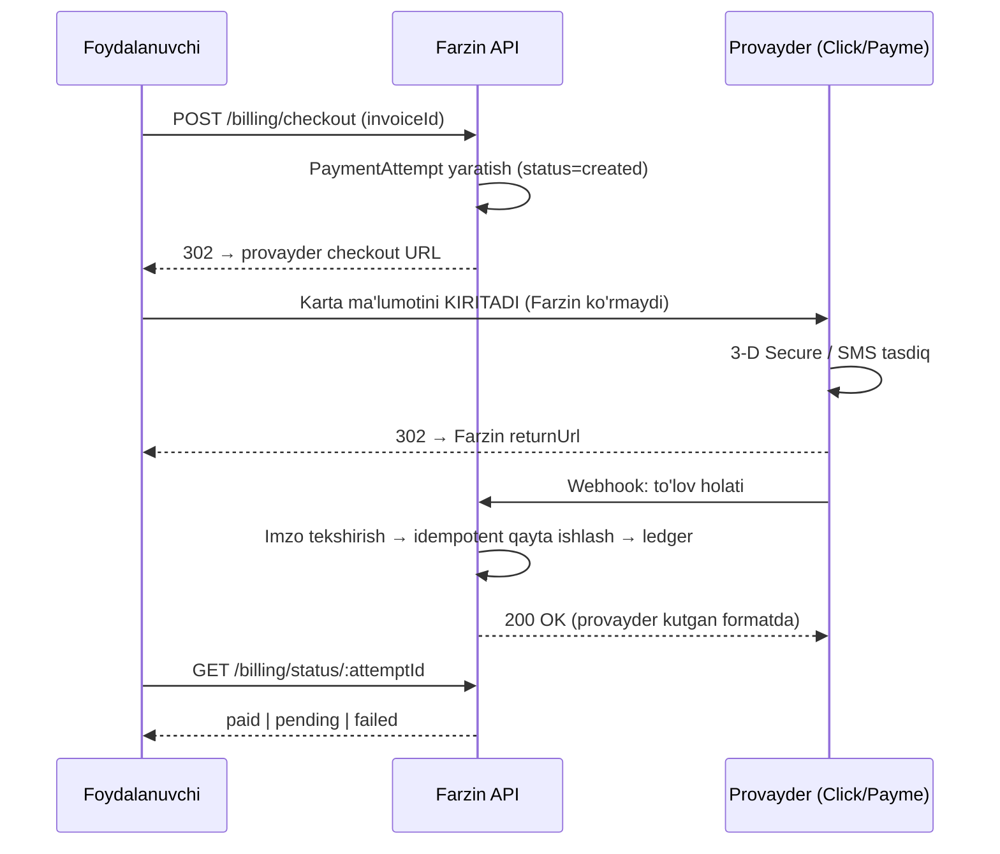
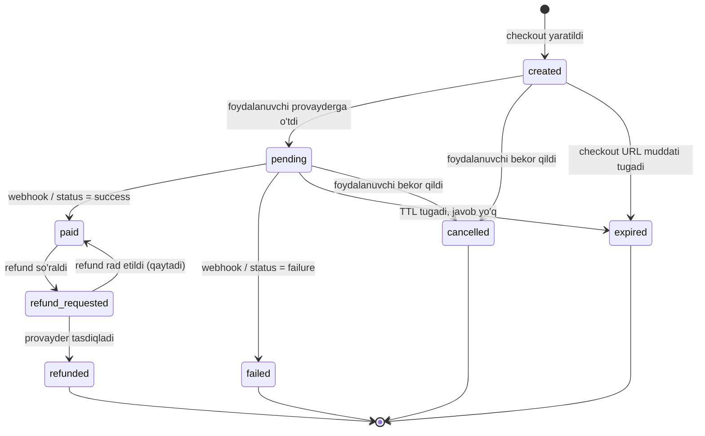
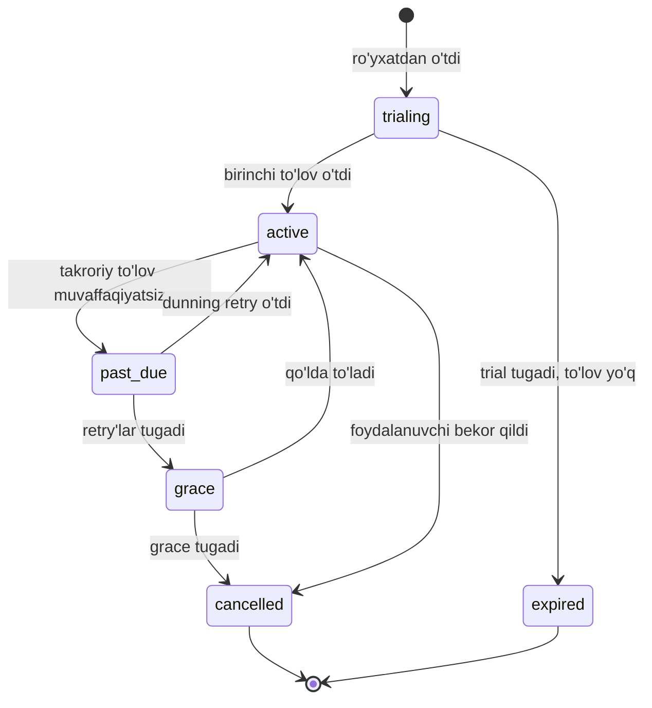
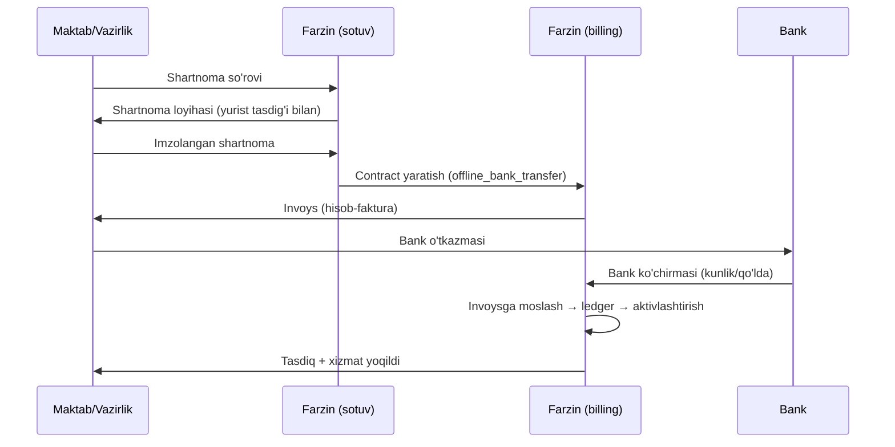
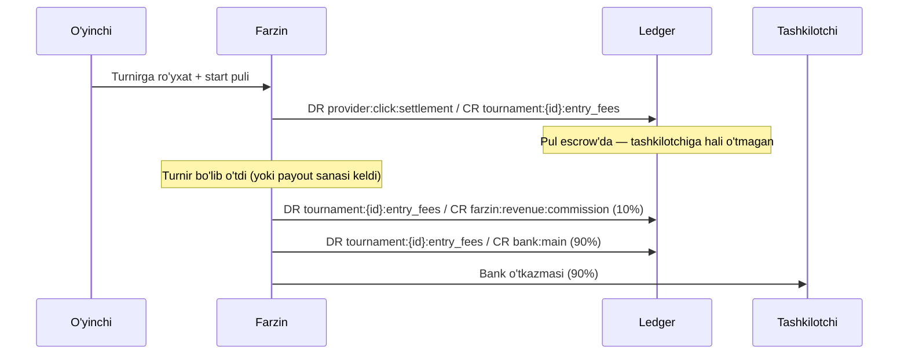

# 09 — To'lov va Billing

> Modul: `billing` (CANON §5, #13)
> Bog'liq modullar: `identity`, `org`, `tournament`, `school`, `training`, `broadcast`, `notification`, `admin`
> Status: spetsifikatsiya. Implementatsiya skeleti + interfeys, biznes-mantiq TODO qoladi.

---

## 0. Bu hujjat nima haqida

Farzin daromadining asosiy qismi B2B/B2G'dan keladi (CANON §2, §3). Ya'ni billing moduli
"mobil ilovada obuna sotib olish" emas — u klub obunasi, vazirlik shartnomasi, turnir start
puli va murabbiy komissiyasini bir vaqtda ko'taradigan tizim.

Bu hujjat quyidagilarni belgilaydi:

- O'zbekiston to'lov provayderlari bilan integratsiya arxitekturasi
- Provayderdan mustaqil abstraksiya (yangi provayder qo'shish uchun mavjud kodga tegilmasin)
- Idempotentlik — pul tizimida eng ko'p xato keltiradigan joy
- Double-entry ledger — nega `balance` ustuni yetarli emas
- Beshta daromad oqimining texnik implementatsiyasi
- Reconciliation, refund, xavfsizlik, test

**Hujjat chegarasi:** bu yerda yuridik maslahat YO'Q. Soliq, QQS, fiskal chek, shartnoma
shakli — barchasi "yurist bilan tasdiqlanishi kerak" deb belgilangan. §9 ga qara.

---

## 1. To'lov provayderlari — O'zbekiston realiyasi

### 1.1 Bozor manzarasi

O'zbekistonda karta to'lovi ikki qatlamda ishlaydi:

1. **Milliy karta tizimlari** — **UzCard** va **Humo**. Aholining asosiy qismi shu kartalarga
   ega. Ular O'zbekiston ichida ishlaydi.
2. **Xalqaro tizimlar** — Visa/Mastercard. Mavjud, lekin qamrovi chegaralangan va ko'pincha
   valyuta konvertatsiyasi bilan bog'liq. Farzin uchun bu **ikkilamchi** kanal.

Foydalanuvchi bu kartalarga to'g'ridan-to'g'ri emas, balki **to'lov agregatori** orqali
to'laydi. Farzin uchun asosiy uchtasi:

| Provayder | Bozor o'rni | Farzin uchun ustuvorlik |
|---|---|---|
| Click | Eng keng tarqalgan | P0 — birinchi integratsiya |
| Payme | Ikkinchi eng katta | P0 — birinchi integratsiya |
| Uzum Bank (sobiq Apelsin) | O'suvchi, super-app | P1 |
| Visa/Mastercard (xalqaro acquirer) | Chegaralangan | P2 — diaspora/xalqaro turnir uchun |
| Bank o'tkazmasi (invoys) | B2G majburiy kanal | P0 — School moduli uchun |

> **MUHIM — halol chegara.** Quyidagi bo'limlarda Click, Payme va Uzum'ning **aniq API
> endpoint nomlari, parametr nomlari, imzo formulasi va xato kodlari YOZILMAGAN.** Sabab:
> bu hujjat yozilayotgan paytda ularning rasmiy hujjatidan tasdiqlanmagan. To'qib chiqarilgan
> API detali — implementatsiya paytida to'g'ridan-to'g'ri bugga aylanadi.
>
> **Integratsiyadan oldin majburiy tekshiriladi:**
> - Click — `docs.click.uz`
> - Payme — `developer.help.paycom.uz`
> - Uzum Bank — rasmiy merchant hujjati (integratsiya menejeri orqali so'raladi)
> - Eskiz (SMS, `notification` moduli) — `eskiz.uz` hujjati
>
> Quyida yozilgani — **integratsiya arxitekturasi va umumiy model**, u provayderdan
> qat'i nazar o'zgarmaydi.

### 1.2 Ikki integratsiya modeli

Provayderlar odatda ikki xil model taklif qiladi. Farzin ikkalasini ham qo'llab-quvvatlaydi,
lekin **default — redirect**.

#### Model A: Redirect (hosted checkout) — DEFAULT



**Nega default:** karta ma'lumoti Farzin serveriga **hech qachon** tegmaydi. Bu PCI DSS
scope'ni deyarli nolga tushiradi (§10.1).

**Kritik qoida:** foydalanuvchi `returnUrl`'ga qaytishi to'lovning **isboti emas**.
Foydalanuvchi URL'ni qo'lda ochishi mumkin. **Yagona haqiqat manbai — webhook** (yoki
provayder API'siga server-to-server so'rov). Bu qoida buzilsa — bepul obuna beriladi.

#### Model B: Server API (token / merchant API)

Ba'zi provayderlar server-to-server API beradi: Farzin to'lovni o'zi tashabbus qiladi va
foydalanuvchi provayder ilovasida tasdiqlaydi, yoki saqlangan **token** bilan yechiladi.

Bu model **majburiy** bo'ladigan joy — **takroriy to'lov (recurring)**. Club/Federation
obunasi har oy avtomatik yechilishi kerak, foydalanuvchini har oy redirect qilib bo'lmaydi.

Talab: provayder **karta tokenizatsiyasi**ni qo'llab-quvvatlashi kerak — Farzin faqat
`cardToken` (opaque string) saqlaydi, karta raqamini emas.

> **Tekshirilishi kerak:** Click, Payme va Uzum'da tokenizatsiya va recurring rejimi qanday
> nomlanadi, qanday shartlar bilan yoqiladi (ko'pincha merchant shartnomasida alohida
> band bo'ladi). Rasmiy hujjatdan tasdiqlansin.

#### Model C: Invoys + bank o'tkazmasi (B2G)

School moduli (vazirlik/maktab shartnomasi) **kartadan to'lamaydi**. Yuridik shaxs
shartnoma + hisob-faktura + bank o'tkazmasi orqali to'laydi. Bu oqimda provayder umuman
yo'q — §7.2 ga qara.

### 1.3 Webhook — umumiy talablar (provayderdan qat'i nazar)

Har bir provayder webhook'i quyidagilarga bo'ysunadi:

1. **Imzo tekshiriladi** — imzo noto'g'ri bo'lsa, so'rov hatto log'ga ham to'liq
   yozilmaydi (faqat rad etish fakti). Imzosiz webhook — bepul pul yozish teshigi.
2. **Idempotent** — bir xil event ikki marta kelsa, natija bir xil (§3).
3. **Tez javob** — webhook handler og'ir ish qilmaydi. U faqat: imzo tekshir → event'ni
   `WebhookEvent` jadvaliga yoz → 200 qaytar. Qolgani BullMQ job'da (CANON §4).
4. **Provayder kutgan javob formati** — har bir provayder o'z formatini kutadi
   (ba'zilari JSON-RPC uslubida). **Tekshirilishi kerak — rasmiy hujjatdan.**
5. **Replay himoyasi** — timestamp + event ID (§10.3).
6. **IP allowlist** — agar provayder statik IP diapazonini e'lon qilsa, qo'shimcha qatlam.
   **Tekshirilishi kerak.**

### 1.4 Sinov muhiti (sandbox)

Har bir provayderning test muhiti bor, lekin ular bir xil emas.

| Talab | Holat |
|---|---|
| Sandbox merchant account | Har bir provayderdan alohida so'raladi |
| Test karta raqamlari | Provayder beradi — **hujjatdan olinadi, to'qilmaydi** |
| Webhook'ni local'ga yuborish | dev'da tunnel kerak (ngrok/cloudflared) |
| Sandbox'da refund testi | Qo'llab-quvvatlashi tekshiriladi |

**Sandbox ishonchsizligi muammosi.** Amaliyotda sandbox muhitlar prod'dan farq qiladi va
ba'zan ishlamaydi. Shu sababli Farzin'da **`FakeProvider`** bo'ladi (§12.1) — u sandbox'ga
umuman bog'liq emas, CI'da to'liq deterministik ishlaydi. Sandbox faqat **integratsiya
tasdiqi** uchun, CI uchun emas.

---

## 2. Provider abstraksiyasi

### 2.1 Nega abstraksiya kerak

Uchta konkret sabab:

1. **Yangi provayder qo'shish** mavjud kodni o'zgartirmasligi kerak (Open/Closed).
   Uzum qo'shilganda `tournament` moduli kodiga tegilmasin.
2. **Test** — provayder sandbox'iga bog'liq test — flaky test. `FakeProvider` kerak.
3. **Provayder almashtirish** — komissiya shartlari o'zgaradi, provayder ishdan chiqadi.
   Bu biznes riski, kod riski emas bo'lishi kerak.

Bu — **strategiya pattern** + **port/adapter**. `billing` moduli **port**ni (interfeys)
biladi, konkret **adapter**ni bilmaydi.

### 2.2 Port interfeysi

```ts
// src/modules/billing/ports/payment-provider.port.ts

/**
 * Amount is ALWAYS in minor units (tiyin for UZS). Never a float.
 * See docs/09 §4 for the money rules.
 */
export type MinorAmount = bigint;

export type Currency = 'UZS' | 'USD';

export interface Money {
  readonly amount: MinorAmount;
  readonly currency: Currency;
}

export type ProviderCode = 'click' | 'payme' | 'uzum' | 'bank_transfer' | 'fake';

export interface CheckoutRequest {
  /** Farzin-side idempotency anchor. Same key => same checkout, never a second charge. */
  readonly idempotencyKey: string;
  readonly attemptId: string; // UUID v7
  readonly money: Money;
  readonly description: string;
  readonly returnUrl: string;
  readonly cancelUrl: string;
  /** Opaque data echoed back by the provider webhook, if supported. */
  readonly metadata: Readonly<Record<string, string>>;
}

export type CheckoutResult =
  | { readonly kind: 'redirect'; readonly url: string; readonly expiresAt: Date }
  | { readonly kind: 'pending'; readonly providerRef: string }
  | { readonly kind: 'paid'; readonly providerRef: string }; // rare: instant settle

export type PaymentStatus =
  | 'created'
  | 'pending'
  | 'paid'
  | 'failed'
  | 'expired'
  | 'cancelled'
  | 'refund_requested'
  | 'refunded';

export interface ProviderStatus {
  readonly status: PaymentStatus;
  readonly providerRef: string | null;
  readonly paidAmount: Money | null;
  readonly paidAt: Date | null;
  readonly failureCode: string | null;
}

export interface WebhookRequest {
  readonly rawBody: Buffer; // raw, NOT the parsed body — signature is over raw bytes
  readonly headers: Readonly<Record<string, string | string[] | undefined>>;
  readonly sourceIp: string;
}

export interface WebhookEvent {
  /** Provider-side unique event id. Used for the idempotency unique constraint. */
  readonly providerEventId: string;
  readonly attemptId: string | null;
  readonly providerRef: string | null;
  readonly status: PaymentStatus;
  readonly money: Money | null;
  readonly occurredAt: Date;
}

export interface WebhookAck {
  readonly httpStatus: number;
  /** Provider-specific ack body. Some providers require a JSON-RPC shaped reply. */
  readonly body: unknown;
}

export interface RefundRequest {
  readonly idempotencyKey: string;
  readonly attemptId: string;
  readonly providerRef: string;
  readonly money: Money; // may be partial
  readonly reason: string;
}

export interface RefundResult {
  readonly accepted: boolean;
  readonly providerRefundRef: string | null;
  readonly failureCode: string | null;
}

export interface RecurringCharge {
  readonly idempotencyKey: string;
  readonly attemptId: string;
  readonly cardToken: string;
  readonly money: Money;
  readonly description: string;
}

/**
 * The port. Every provider adapter implements exactly this.
 * The billing module MUST NOT import any concrete adapter.
 */
export interface PaymentProvider {
  readonly code: ProviderCode;

  readonly capabilities: {
    readonly refund: boolean;
    readonly partialRefund: boolean;
    readonly recurring: boolean;
    readonly tokenization: boolean;
  };

  createCheckout(req: CheckoutRequest): Promise<CheckoutResult>;

  /** Server-to-server truth. Used by reconciliation and by the status endpoint. */
  getStatus(attemptId: string, providerRef: string | null): Promise<ProviderStatus>;

  /** Verify signature + parse. MUST throw on an invalid signature. */
  parseWebhook(req: WebhookRequest): Promise<WebhookEvent>;

  /** The exact body this provider expects as an acknowledgement. */
  ackWebhook(event: WebhookEvent, handled: boolean): WebhookAck;

  refund(req: RefundRequest): Promise<RefundResult>;

  /** Only when capabilities.recurring === true. */
  chargeToken?(req: RecurringCharge): Promise<ProviderStatus>;
}
```

### 2.3 Registry — provayderni tanlash

```ts
// src/modules/billing/providers/provider.registry.ts
import { Injectable, Inject } from '@nestjs/common';
import { PaymentProvider, ProviderCode } from '../ports/payment-provider.port';

export const PAYMENT_PROVIDERS = Symbol('PAYMENT_PROVIDERS');

@Injectable()
export class ProviderRegistry {
  private readonly byCode: ReadonlyMap<ProviderCode, PaymentProvider>;

  constructor(@Inject(PAYMENT_PROVIDERS) providers: readonly PaymentProvider[]) {
    const map = new Map<ProviderCode, PaymentProvider>();
    for (const p of providers) {
      if (map.has(p.code)) {
        throw new Error(`Duplicate payment provider: ${p.code}`);
      }
      map.set(p.code, p);
    }
    this.byCode = map;
  }

  get(code: ProviderCode): PaymentProvider {
    const p = this.byCode.get(code);
    if (!p) throw new Error(`Unknown payment provider: ${code}`);
    return p;
  }

  /** Providers that can serve this currency + feature set. Used by the checkout UI. */
  available(currency: string, needs: { recurring?: boolean }): readonly PaymentProvider[] {
    return [...this.byCode.values()].filter((p) => {
      if (needs.recurring && !p.capabilities.recurring) return false;
      if (currency !== 'UZS' && (p.code === 'click' || p.code === 'payme')) return false;
      return true;
    });
  }
}
```

Yangi provayder qo'shish — bitta fayl (`uzum.provider.ts`) + DI ro'yxatiga bitta qator.
Boshqa hech narsa o'zgarmaydi. Bu abstraksiyaning **yagona o'lchov mezoni**.

### 2.4 Adapter skeleti

```ts
// src/modules/billing/providers/click.provider.ts
import { Injectable, Logger } from '@nestjs/common';
import {
  PaymentProvider, CheckoutRequest, CheckoutResult, ProviderStatus,
  WebhookRequest, WebhookEvent, WebhookAck, RefundRequest, RefundResult,
} from '../ports/payment-provider.port';

@Injectable()
export class ClickProvider implements PaymentProvider {
  readonly code = 'click' as const;

  // TODO(billing): confirm against docs.click.uz before implementation.
  readonly capabilities = {
    refund: true,
    partialRefund: false, // TODO: verify
    recurring: false,     // TODO: verify (Click Pass / token flow)
    tokenization: false,  // TODO: verify
  };

  private readonly log = new Logger(ClickProvider.name);

  async createCheckout(req: CheckoutRequest): Promise<CheckoutResult> {
    // TODO(billing): build the hosted checkout URL per docs.click.uz.
    // Contract that must hold regardless of the wire format:
    //   - req.money.amount is in tiyin (bigint) and is converted at the edge only;
    //   - req.idempotencyKey is passed through so a retry never creates a 2nd charge;
    //   - the returned URL expires and expiresAt is honoured by PaymentAttempt.
    throw new Error('Not implemented: verify docs.click.uz first');
  }

  async getStatus(): Promise<ProviderStatus> {
    // TODO(billing): server-to-server status query. Used by reconciliation (§11).
    throw new Error('Not implemented: verify docs.click.uz first');
  }

  async parseWebhook(req: WebhookRequest): Promise<WebhookEvent> {
    // TODO(billing): signature verification per docs.click.uz.
    // HARD RULES (independent of the provider):
    //   1. verify over req.rawBody, never over a re-serialised object;
    //   2. use a timing-safe comparison;
    //   3. throw on mismatch — never fall through to "probably fine".
    throw new Error('Not implemented: verify docs.click.uz first');
  }

  ackWebhook(): WebhookAck {
    // TODO(billing): Click expects a specific ack shape. Verify docs.click.uz.
    throw new Error('Not implemented: verify docs.click.uz first');
  }

  async refund(_req: RefundRequest): Promise<RefundResult> {
    // TODO(billing): verify docs.click.uz.
    throw new Error('Not implemented: verify docs.click.uz first');
  }
}
```

`PaymeProvider` va `UzumProvider` — xuddi shu skelet, o'z hujjat havolasi bilan.
Payme uchun tekshirish manbai: `developer.help.paycom.uz`.

---

## 3. Idempotentlik

Bu hujjatning eng muhim bo'limi. Pul tizimidagi xatolarning aksariyati shu yerdan chiqadi.

### 3.1 Nima buziladi

Uchta real ssenariy:

1. **Webhook ikki marta keladi.** Provayder javobni olmasa (timeout, 502) — qayta yuboradi.
   Bu normal xulq, provayder aybdor emas. Agar handler idempotent bo'lmasa — foydalanuvchi
   hisobiga ikki marta pul yoziladi.
2. **Foydalanuvchi tugmani ikki marta bosadi.** Ikkita `PaymentAttempt`, ikkita checkout,
   ikkita yechish. Foydalanuvchi ikki marta to'laydi.
3. **Tarmoq uziladi.** Farzin provayderga so'rov yubordi, javob kelmadi. To'lov o'tdimi?
   Noma'lum. Retry qilinsa — ikkinchi yechish riski.

Umumiy qoida: **tarmoqda "aniq bir marta" (exactly-once) yo'q.** Bor narsa — "kamida bir
marta yetkazish" (at-least-once) + **idempotent qabul qiluvchi**. Ya'ni exactly-once
semantikasi qabul qiluvchi tomonda quriladi, tarmoqda emas.

### 3.2 Idempotency key

Ikki xil kalit bor, ularni aralashtirmaslik kerak:

| Kalit | Kim yaratadi | Nimani himoya qiladi |
|---|---|---|
| `idempotencyKey` (client) | Frontend/API iste'molchisi | Ikki marta bosish, client retry |
| `providerEventId` | Provayder | Webhook takrori |

**Client kaliti.** `POST /billing/checkout` majburiy `Idempotency-Key` header'ini talab
qiladi. Kalit — UUID v7, client generatsiya qiladi va **retry'da o'zgartirmaydi**.

```ts
// src/modules/billing/idempotency/idempotency.service.ts
import { Injectable, ConflictException } from '@nestjs/common';
import { PrismaService } from '../../../shared/prisma/prisma.service';
import { createHash } from 'node:crypto';

interface StoredResponse {
  readonly statusCode: number;
  readonly body: unknown;
}

@Injectable()
export class IdempotencyService {
  constructor(private readonly prisma: PrismaService) {}

  private fingerprint(body: unknown): string {
    return createHash('sha256').update(JSON.stringify(body)).digest('hex');
  }

  /**
   * Run `work` at most once per (userId, key).
   * - first call: executes and stores the response;
   * - replay with the SAME payload: returns the stored response, does not re-execute;
   * - replay with a DIFFERENT payload: 409 — the key was reused for another operation.
   */
  async execute<T>(
    userId: string,
    key: string,
    requestBody: unknown,
    work: () => Promise<StoredResponse & { result: T }>,
  ): Promise<StoredResponse> {
    const fp = this.fingerprint(requestBody);

    const existing = await this.prisma.idempotencyRecord.findUnique({
      where: { userId_key: { userId, key } },
    });

    if (existing) {
      if (existing.requestFingerprint !== fp) {
        throw new ConflictException('Idempotency-Key reused with a different payload');
      }
      if (existing.responseBody === null) {
        // Still in flight. Client must retry later — never execute in parallel.
        throw new ConflictException('Request in progress, retry later');
      }
      return { statusCode: existing.responseStatus!, body: existing.responseBody };
    }

    // Unique constraint on (user_id, key) makes this the concurrency gate:
    // two parallel requests race here, exactly one wins, the loser gets 409.
    await this.prisma.idempotencyRecord.create({
      data: { userId, key, requestFingerprint: fp, responseBody: null, responseStatus: null },
    });

    const done = await work();

    await this.prisma.idempotencyRecord.update({
      where: { userId_key: { userId, key } },
      data: { responseStatus: done.statusCode, responseBody: done.body as object },
    });

    return { statusCode: done.statusCode, body: done.body };
  }
}
```

Muhim detal: yozuv **ish boshlanishidan oldin** yaratiladi. Unique constraint —
concurrency darvozasi. Agar yozuv ishdan keyin yaratilsa, ikkita parallel so'rov ikkalasi
ham `findUnique`'da `null` ko'rib, ikkalasi ham ishlaydi.

### 3.3 Webhook idempotentligi

```prisma
model WebhookEvent {
  id              String   @id @default(dbgenerated("uuid_generate_v7()")) @db.Uuid
  provider        String
  providerEventId String   @map("provider_event_id")
  attemptId       String?  @map("attempt_id") @db.Uuid
  payload         Json
  receivedAt      DateTime @default(now()) @map("received_at")
  processedAt     DateTime? @map("processed_at")
  processingError String?  @map("processing_error")

  // The core guarantee: the same provider event can be stored only once.
  @@unique([provider, providerEventId])
  @@index([processedAt])
  @@map("webhook_events")
}
```

Handler oqimi:

```ts
// src/modules/billing/webhooks/webhook.controller.ts
@Post(':provider')
@HttpCode(200)
async handle(
  @Param('provider') code: ProviderCode,
  @Req() req: RawBodyRequest<Request>,
): Promise<unknown> {
  const provider = this.registry.get(code);

  // 1. Signature. Throws on mismatch — nothing else runs.
  const event = await provider.parseWebhook({
    rawBody: req.rawBody!,
    headers: req.headers,
    sourceIp: req.ip!,
  });

  // 2. Idempotent store. A duplicate hits the unique constraint and is ACKed as handled:
  //    the provider already delivered it once, re-processing would double-credit.
  try {
    await this.prisma.webhookEvent.create({
      data: {
        provider: code,
        providerEventId: event.providerEventId,
        attemptId: event.attemptId,
        payload: event as unknown as object,
      },
    });
  } catch (e) {
    if (isUniqueViolation(e)) {
      this.log.log({ msg: 'duplicate webhook ignored', providerEventId: event.providerEventId });
      return provider.ackWebhook(event, true).body;
    }
    throw e;
  }

  // 3. Heavy work goes to BullMQ. The handler stays fast (§1.3).
  await this.queue.add('process-webhook', { provider: code, providerEventId: event.providerEventId });

  return provider.ackWebhook(event, true).body;
}
```

Uch qadam: imzo → saqlash (unique) → job. Handler ledger'ga tegmaydi.

### 3.4 PaymentAttempt

```prisma
model PaymentAttempt {
  id             String    @id @default(dbgenerated("uuid_generate_v7()")) @db.Uuid
  invoiceId      String    @map("invoice_id") @db.Uuid
  provider       String
  status         String    // see the state machine in §5
  idempotencyKey String    @map("idempotency_key")

  amount         Decimal   @db.Decimal(14, 2)
  currency       String    @db.VarChar(3)
  amountMinor    BigInt    @map("amount_minor") // tiyin — the authoritative value

  providerRef    String?   @map("provider_ref")
  checkoutUrl    String?   @map("checkout_url")
  expiresAt      DateTime? @map("expires_at")
  paidAt         DateTime? @map("paid_at")
  failureCode    String?   @map("failure_code")

  createdAt      DateTime  @default(now()) @map("created_at")
  updatedAt      DateTime  @updatedAt @map("updated_at")

  invoice        Invoice   @relation(fields: [invoiceId], references: [id])

  @@unique([provider, providerRef])
  @@unique([invoiceId, idempotencyKey])
  @@index([status, createdAt])
  @@map("payment_attempts")
}
```

**Nega `Payment` emas, `PaymentAttempt`?** CANON §6 da `Payment` entity'si bor — u
**muvaffaqiyatli** to'lov. Urinishlar ko'p, to'lov bitta. Foydalanuvchi uch marta urinib,
uchinchisida to'lashi mumkin: 3 ta `PaymentAttempt`, 1 ta `Payment`. Ular bir jadvalga
qo'shilsa, "nechta to'lov bor?" degan savolga javob berish uchun har safar `WHERE status =
'paid'` yozish kerak bo'ladi — va bir kuni kimdir uni yozishni unutadi.

**Bir invoysga bir vaqtda bitta aktiv attempt.** Partial unique index bilan:

```sql
-- prisma/migrations/xxx_one_active_attempt/migration.sql
CREATE UNIQUE INDEX one_active_attempt_per_invoice
  ON payment_attempts (invoice_id)
  WHERE status IN ('created', 'pending');
```

Bu — §3.1 dagi 2-ssenariy (ikki marta bosish) uchun **DB darajasidagi** himoya. Application
darajasidagi tekshiruv (`SELECT` keyin `INSERT`) race condition'ga ochiq; unique index emas.

---

## 4. Pul bilan ishlash qoidalari

### 4.1 FLOAT hech qachon

```ts
// XATO — hech qachon
const total = 0.1 + 0.2; // 0.30000000000000004
```

IEEE 754 ikkilik kasr. `0.1` ikkilikda aniq ifodalanmaydi. Ming marta qo'shilsa, xato
to'planadi va oy oxirida ledger balansi 0 ga teng chiqmaydi. Bu nazariy muammo emas —
bu reconciliation job'ining har kuni alert berishi (§11).

**CANON §6 qoidasi (o'zgarmaydi):**

- Saqlash: `NUMERIC(14,2)` + alohida `currency` ustuni
- Ichki hisob-kitob: **tiyinda `BIGINT`**
- `FLOAT` / `DOUBLE PRECISION` / JS `number` — **hech qachon**

### 4.2 Nega ikkalasi ham — NUMERIC va BIGINT?

Savol o'rinli: agar tiyin `BIGINT` bo'lsa, `NUMERIC` nega kerak?

- `amount_minor BIGINT` — **hisob uchun**. Butun son arifmetikasi aniq. Ledger, jamlash,
  taqqoslash — hammasi shu ustunda.
- `amount NUMERIC(14,2)` + `currency` — **o'qish uchun**. Buxgalter SQL yozadi, hisobot
  generatsiya qilinadi, invoys PDF chiqadi. `NUMERIC(14,2)` inson o'qiydigan qiymat.

Ikkisi **doim mos** bo'lishi kerak. Buni DB constraint kafolatlaydi:

```sql
ALTER TABLE payment_attempts
  ADD CONSTRAINT amount_minor_matches
  CHECK (amount_minor = ROUND(amount * 100)::BIGINT);
```

> **Eslatma:** bu constraint UZS va USD uchun to'g'ri (ikkalasida ham 2 xona). Agar
> kelajakda 0 yoki 3 xonali valyuta qo'shilsa, constraint valyutaga bog'liq bo'lishi kerak.
> Hozircha CANON bo'yicha valyuta — UZS asosiy, USD ikkilamchi.

`NUMERIC(14,2)` sig'imi: ~999 999 999 999.99 UZS. Bu ~1 trillion so'm — Farzin miqyosida
yetarli. `BIGINT` tiyinda: ~9.2 × 10^18 tiyin. Cheklov emas.

### 4.3 Valyuta

**UZS — asosiy.** Barcha ichki hisob UZS'da. USD — faqat xalqaro turnir yoki diaspora
uchun, ikkilamchi.

**Qoida: turli valyutali summalar hech qachon qo'shilmaydi.** Bu type darajasida bloklanadi:

```ts
// src/shared/money/money.ts
export class Money {
  private constructor(
    readonly minor: bigint,
    readonly currency: Currency,
  ) {}

  static of(minor: bigint, currency: Currency): Money {
    return new Money(minor, currency);
  }

  /** From a human value: Money.fromMajor('150000.50', 'UZS') => 15_000_050 tiyin. */
  static fromMajor(major: string, currency: Currency): Money {
    if (!/^-?\d+(\.\d{1,2})?$/.test(major)) {
      throw new Error(`Invalid money literal: ${major}`);
    }
    const negative = major.startsWith('-');
    const [int, frac = ''] = (negative ? major.slice(1) : major).split('.');
    const minor = BigInt(int) * 100n + BigInt(frac.padEnd(2, '0'));
    return new Money(negative ? -minor : minor, currency);
  }

  private assertSame(other: Money): void {
    if (this.currency !== other.currency) {
      throw new Error(`Currency mismatch: ${this.currency} vs ${other.currency}`);
    }
  }

  plus(other: Money): Money {
    this.assertSame(other);
    return new Money(this.minor + other.minor, this.currency);
  }

  minus(other: Money): Money {
    this.assertSame(other);
    return new Money(this.minor - other.minor, this.currency);
  }

  isZero(): boolean { return this.minor === 0n; }
  isNegative(): boolean { return this.minor < 0n; }

  toMajorString(): string {
    const neg = this.minor < 0n;
    const abs = neg ? -this.minor : this.minor;
    const int = abs / 100n;
    const frac = (abs % 100n).toString().padStart(2, '0');
    return `${neg ? '-' : ''}${int}.${frac}`;
  }
}
```

`assertSame` — arzon, lekin u UZS'ni USD'ga qo'shib yuborish xatosini butunlay yopadi.

### 4.4 Yaxlitlash

Yaxlitlash faqat **bo'lish** bo'lganda kerak: komissiya foizi, split payment, QQS.

**Qoida: yaxlitlash faqat bitta joyda, aniq belgilangan rejim bilan.**

```ts
// src/shared/money/split.ts
import { Money } from './money';

export type RoundingMode = 'half_up' | 'floor' | 'ceil';

/**
 * Percentage of an amount, in minor units. Bankers' rounding is deliberately NOT used:
 * commission is a contractual number and 'half_up' is what a human accountant expects.
 */
export function percentOf(m: Money, bps: number, mode: RoundingMode = 'half_up'): Money {
  // bps = basis points. 250 bps = 2.5%. Integer input keeps floats out entirely.
  if (!Number.isInteger(bps) || bps < 0 || bps > 10_000) {
    throw new Error(`Invalid basis points: ${bps}`);
  }
  const numerator = m.minor * BigInt(bps);
  const denominator = 10_000n;

  let q = numerator / denominator;
  const r = numerator % denominator;

  if (mode === 'half_up' && r * 2n >= denominator) q += 1n;
  if (mode === 'ceil' && r > 0n) q += 1n;
  // 'floor' => truncation, which is what / already did for non-negative values.

  return Money.of(q, m.currency);
}

/**
 * Split an amount into parts by weight WITHOUT losing a single tiyin.
 * The remainder goes to the first parts (largest remainder method).
 * Invariant: sum(result) === total. This is asserted, not assumed.
 */
export function allocate(total: Money, weights: readonly number[]): readonly Money[] {
  if (weights.length === 0) throw new Error('allocate: no weights');
  if (weights.some((w) => !Number.isInteger(w) || w < 0)) {
    throw new Error('allocate: weights must be non-negative integers');
  }
  const sum = weights.reduce((a, b) => a + b, 0);
  if (sum === 0) throw new Error('allocate: weights sum to zero');

  const parts: bigint[] = [];
  let allocated = 0n;
  for (const w of weights) {
    const share = (total.minor * BigInt(w)) / BigInt(sum);
    parts.push(share);
    allocated += share;
  }

  // Distribute the remainder one tiyin at a time.
  let remainder = total.minor - allocated;
  let i = 0;
  while (remainder > 0n) {
    parts[i % parts.length] += 1n;
    remainder -= 1n;
    i += 1;
  }

  const result = parts.map((p) => Money.of(p, total.currency));
  const check = result.reduce((a, b) => a.plus(b), Money.of(0n, total.currency));
  if (check.minor !== total.minor) {
    throw new Error('allocate: invariant violated'); // must be unreachable
  }
  return result;
}
```

`allocate` — split payment (§7.4) uchun. Sodda `amount * 0.7` va `amount * 0.3` yozilsa,
yig'indi asl summadan 1 tiyin farq qilishi mumkin. Bir tiyin — ledger balansini buzadi.

---

## 5. Holat mashinasi



### 5.1 O'tishlar jadvali

| Dan | Ga | Kim tashabbus qiladi |
|---|---|---|
| `created` | `pending` | Foydalanuvchi redirect'ga o'tdi |
| `created` | `cancelled` | Foydalanuvchi / TTL job |
| `created` | `expired` | TTL job |
| `pending` | `paid` | Webhook yoki reconciliation |
| `pending` | `failed` | Webhook |
| `pending` | `expired` | TTL job (provayder javob bermadi) |
| `paid` | `refund_requested` | Admin / avtomatik siyosat (§8) |
| `refund_requested` | `refunded` | Provayder refund tasdig'i |
| `refund_requested` | `paid` | Provayder refund'ni rad etdi |

### 5.2 Terminal holatlar

`failed`, `expired`, `cancelled`, `refunded` — **terminal**. Ulardan chiqish yo'q.

`expired` yoki `failed`'dan keyin foydalanuvchi qayta to'lamoqchi bo'lsa — **yangi
`PaymentAttempt`** yaratiladi, eskisi tirilmaydi. Sabab: eski attempt provayder tomonda
hali "ochiq" bo'lishi mumkin, uni qayta ishlatish ikki marta yechish riski.

### 5.3 Kod bilan majburlash

```ts
// src/modules/billing/payment/payment-state.ts
import { PaymentStatus } from '../ports/payment-provider.port';

const TRANSITIONS: Readonly<Record<PaymentStatus, readonly PaymentStatus[]>> = {
  created:          ['pending', 'cancelled', 'expired'],
  pending:          ['paid', 'failed', 'expired', 'cancelled'],
  paid:             ['refund_requested'],
  refund_requested: ['refunded', 'paid'],
  failed:           [],
  expired:          [],
  cancelled:        [],
  refunded:         [],
};

export function canTransition(from: PaymentStatus, to: PaymentStatus): boolean {
  return TRANSITIONS[from].includes(to);
}

export class IllegalTransitionError extends Error {
  constructor(from: PaymentStatus, to: PaymentStatus) {
    super(`Illegal payment transition: ${from} -> ${to}`);
  }
}
```

Va **atomik** o'tish — status shartini `WHERE`ga qo'yish orqali:

```ts
// src/modules/billing/payment/payment.repository.ts
/**
 * Compare-and-set on status. If another worker already moved the row,
 * updateMany affects 0 rows and we know we lost the race — no exception,
 * no double-processing. A read-then-write would race here.
 */
async transition(
  tx: Prisma.TransactionClient,
  attemptId: string,
  from: PaymentStatus,
  to: PaymentStatus,
  patch: Prisma.PaymentAttemptUpdateInput = {},
): Promise<boolean> {
  if (!canTransition(from, to)) throw new IllegalTransitionError(from, to);

  const res = await tx.paymentAttempt.updateMany({
    where: { id: attemptId, status: from },
    data: { ...patch, status: to },
  });
  return res.count === 1;
}
```

`updateMany` + `where: { status: from }` — bu compare-and-set. Ikkita worker bir vaqtda
`pending → paid` qilsa, biri `true`, ikkinchisi `false` oladi. Faqat `true` olgani
ledger yozadi.

---

## 6. Double-entry ledger

### 6.1 Nega `balance` ustuni yetarli emas

Sodda yechim shunday ko'rinadi:

```sql
-- Bu yo'l bilan borilmaydi
UPDATE clubs SET balance = balance + 50000 WHERE id = ?;
```

Bu **to'rt** sababga ko'ra ishlamaydi:

1. **Tarix yo'q.** Balans 150 000 so'm. Nega? Qachondan beri? Qaysi to'lovlardan?
   Javob yo'q. Nizo chiqsa — isbot yo'q.
2. **Tuzatib bo'lmaydi.** Xato yozuv topildi. `UPDATE` bilan tuzatilsa — audit izi yo'qoladi.
   To'g'ri yo'l: teskari yozuv (reversal), asl yozuv joyida qoladi.
3. **Balanslanmaydi.** Pul bir joydan chiqib, ikkinchisiga kiradi. Bitta `UPDATE` bilan
   pul "paydo bo'ladi". Xato bo'lsa, tizim buni sezmaydi.
4. **Buxgalteriya mos kelmaydi.** Buxgalter debit/kredit tilida ishlaydi. Bitta `balance`
   ustuni undan hisobot chiqarishga yaramaydi.

### 6.2 Double-entry printsipi

Har bir moliyaviy hodisa — **kamida ikkita** yozuv: debit va kredit. Ularning yig'indisi
**doim nol**.

Foydalanuvchi 100 000 so'm turnir start puli to'lasa:

| Hisob | Debit | Kredit |
|---|---|---|
| `provider:click:settlement` | 100 000 | |
| `tournament:{id}:entry_fees` | | 100 000 |

Yig'indi: 100 000 − 100 000 = 0. Balanslangan.

Farzin 10% komissiya ushlasa:

| Hisob | Debit | Kredit |
|---|---|---|
| `tournament:{id}:entry_fees` | 10 000 | |
| `farzin:revenue:commission` | | 10 000 |

Har bir yozuv guruhi (`LedgerTransaction`) balanslanadi. Balanslanmasa — DB qabul qilmaydi.

### 6.3 Sxema

```prisma
model LedgerAccount {
  id        String   @id @default(dbgenerated("uuid_generate_v7()")) @db.Uuid
  /** Stable, human-readable key: "club:{uuid}:wallet", "farzin:revenue:commission". */
  code      String   @unique
  kind      String   // asset | liability | revenue | expense | equity
  currency  String   @db.VarChar(3)
  ownerType String?  @map("owner_type") // Club | Coach | Tournament | Farzin
  ownerId   String?  @map("owner_id") @db.Uuid
  createdAt DateTime @default(now()) @map("created_at")
  updatedAt DateTime @updatedAt @map("updated_at")

  entries   LedgerEntry[]

  @@index([ownerType, ownerId])
  @@map("ledger_accounts")
}

model LedgerTransaction {
  id            String   @id @default(dbgenerated("uuid_generate_v7()")) @db.Uuid
  /** Business event that caused this: "payment.paid", "payout.sent", "refund.done". */
  kind          String
  /** Idempotency anchor: one transaction per (kind, referenceId). */
  referenceId   String   @map("reference_id") @db.Uuid
  description   String
  occurredAt    DateTime @map("occurred_at")
  createdAt     DateTime @default(now()) @map("created_at")

  entries       LedgerEntry[]

  @@unique([kind, referenceId])
  @@index([occurredAt])
  @@map("ledger_transactions")
}

model LedgerEntry {
  id            String   @id @default(dbgenerated("uuid_generate_v7()")) @db.Uuid
  transactionId String   @map("transaction_id") @db.Uuid
  accountId     String   @map("account_id") @db.Uuid

  /** Signed minor units. Debit > 0, credit < 0. Sum per transaction MUST be 0. */
  amountMinor   BigInt   @map("amount_minor")
  amount        Decimal  @db.Decimal(14, 2)
  currency      String   @db.VarChar(3)

  createdAt     DateTime @default(now()) @map("created_at")

  transaction   LedgerTransaction @relation(fields: [transactionId], references: [id])
  account       LedgerAccount     @relation(fields: [accountId], references: [id])

  @@index([accountId, createdAt])
  @@index([transactionId])
  @@map("ledger_entries")
}
```

`LedgerEntry` — **immutable**. `UPDATE` yo'q, `DELETE` yo'q. Faqat `INSERT`. Bu DB
darajasida majburlanadi:

```sql
-- prisma/migrations/xxx_ledger_immutable/migration.sql
CREATE OR REPLACE FUNCTION reject_ledger_mutation() RETURNS trigger AS $$
BEGIN
  RAISE EXCEPTION 'ledger_entries is append-only (attempted %)', TG_OP;
END;
$$ LANGUAGE plpgsql;

CREATE TRIGGER ledger_entries_no_update
  BEFORE UPDATE OR DELETE ON ledger_entries
  FOR EACH ROW EXECUTE FUNCTION reject_ledger_mutation();
```

Nega trigger, application tekshiruvi emas: application kodi o'zgaradi, kimdir shoshib
`prisma.ledgerEntry.update()` yozadi va code review'da o'tib ketadi. Trigger o'tkazmaydi.

### 6.4 Balanslanish kafolati

```sql
-- Deferred constraint: checked at COMMIT, not at each INSERT —
-- otherwise the first entry of a pair would always fail.
CREATE OR REPLACE FUNCTION assert_transaction_balanced() RETURNS trigger AS $$
DECLARE
  total BIGINT;
BEGIN
  SELECT COALESCE(SUM(amount_minor), 0) INTO total
    FROM ledger_entries WHERE transaction_id = NEW.transaction_id;
  IF total <> 0 THEN
    RAISE EXCEPTION 'Unbalanced ledger transaction %: sum=%', NEW.transaction_id, total;
  END IF;
  RETURN NEW;
END;
$$ LANGUAGE plpgsql;

CREATE CONSTRAINT TRIGGER ledger_balanced
  AFTER INSERT ON ledger_entries
  DEFERRABLE INITIALLY DEFERRED
  FOR EACH ROW EXECUTE FUNCTION assert_transaction_balanced();
```

`DEFERRABLE INITIALLY DEFERRED` — kalit detal. Debit yozuvi qo'yilganda yig'indi hali
nol emas; tekshiruv `COMMIT` paytida bo'lishi kerak.

### 6.5 Yozish API'si

```ts
// src/modules/billing/ledger/ledger.service.ts
import { Injectable } from '@nestjs/common';
import { Prisma } from '@prisma/client';
import { Money } from '../../../shared/money/money';

export interface LedgerLine {
  readonly accountCode: string;
  /** Debit is positive, credit is negative. */
  readonly amount: Money;
}

@Injectable()
export class LedgerService {
  /**
   * Post a balanced transaction. Idempotent on (kind, referenceId):
   * calling twice with the same reference is a no-op, not a double posting.
   * MUST be called inside an existing transaction together with the state change
   * that caused it — a paid payment and its ledger entries commit or fail together.
   */
  async post(
    tx: Prisma.TransactionClient,
    params: {
      kind: string;
      referenceId: string;
      description: string;
      occurredAt: Date;
      lines: readonly LedgerLine[];
    },
  ): Promise<void> {
    if (params.lines.length < 2) {
      throw new Error('A ledger transaction needs at least two lines');
    }

    const currencies = new Set(params.lines.map((l) => l.amount.currency));
    if (currencies.size !== 1) {
      throw new Error('Cross-currency ledger transaction is not allowed');
    }

    const sum = params.lines.reduce((acc, l) => acc + l.amount.minor, 0n);
    if (sum !== 0n) {
      // Fail fast in the app too: the DB trigger is the backstop, not the first line.
      throw new Error(`Unbalanced transaction: sum=${sum}`);
    }

    const existing = await tx.ledgerTransaction.findUnique({
      where: { kind_referenceId: { kind: params.kind, referenceId: params.referenceId } },
    });
    if (existing) return; // already posted — idempotent

    const accounts = await tx.ledgerAccount.findMany({
      where: { code: { in: params.lines.map((l) => l.accountCode) } },
    });
    const byCode = new Map(accounts.map((a) => [a.code, a]));

    for (const line of params.lines) {
      if (!byCode.has(line.accountCode)) {
        throw new Error(`Unknown ledger account: ${line.accountCode}`);
      }
    }

    await tx.ledgerTransaction.create({
      data: {
        kind: params.kind,
        referenceId: params.referenceId,
        description: params.description,
        occurredAt: params.occurredAt,
        entries: {
          create: params.lines.map((l) => ({
            accountId: byCode.get(l.accountCode)!.id,
            amountMinor: l.amount.minor,
            amount: new Prisma.Decimal(l.amount.toMajorString()),
            currency: l.amount.currency,
          })),
        },
      },
    });
  }

  /** Balance = sum of entries. Never a stored column. */
  async balance(tx: Prisma.TransactionClient, accountCode: string): Promise<bigint> {
    const rows = await tx.$queryRaw<{ total: bigint | null }[]>`
      SELECT COALESCE(SUM(e.amount_minor), 0)::BIGINT AS total
      FROM ledger_entries e
      JOIN ledger_accounts a ON a.id = e.account_id
      WHERE a.code = ${accountCode}
    `;
    return rows[0]?.total ?? 0n;
  }
}
```

**Balans hech qachon saqlanmaydi** — u yozuvlar yig'indisi. Performance muammo bo'lsa,
yechim — materialized view yoki kunlik snapshot jadval (`ledger_balance_snapshots`), lekin
**haqiqat manbai doim yozuvlar qoladi**. Snapshot — cache, manba emas.

### 6.6 Hisoblar rejasi (chart of accounts)

| Kod shabloni | Turi | Ma'nosi |
|---|---|---|
| `provider:{code}:settlement` | asset | Provayderda turgan, hali kelmagan pul |
| `bank:main` | asset | Bank hisobidagi pul |
| `club:{uuid}:wallet` | liability | Klubga qarz (oldindan to'lov) |
| `tournament:{uuid}:entry_fees` | liability | Tashkilotchiga tegishli start puli |
| `coach:{uuid}:payable` | liability | Murabbiyga to'lanadigan |
| `farzin:revenue:subscription` | revenue | Obuna daromadi |
| `farzin:revenue:commission` | revenue | Komissiya daromadi |
| `farzin:expense:provider_fee` | expense | Provayder komissiyasi |
| `farzin:liability:tax_payable` | liability | Soliq — §9, yurist tasdig'i kerak |

> `farzin:liability:tax_payable` hisobining **to'ldirilish qoidasi bu hujjatda
> belgilanmaydi** — soliq stavkasi va bazasi yuridik masala. §9 ga qara.

---

## 7. Daromad oqimlari

CANON §3 dagi beshta model. Har biri uchun texnik oqim.

### 7.1 Club/Federation SaaS obunasi

Asosiy daromad. Klub yoki federatsiya turnir boshqaruvi uchun oylik/yillik to'laydi.

```prisma
model Subscription {
  id            String    @id @default(dbgenerated("uuid_generate_v7()")) @db.Uuid
  /** Club | Federation | School */
  ownerType     String    @map("owner_type")
  ownerId       String    @map("owner_id") @db.Uuid
  planCode      String    @map("plan_code")
  status        String    // trialing | active | past_due | grace | cancelled | expired

  currentPeriodStart DateTime @map("current_period_start")
  currentPeriodEnd   DateTime @map("current_period_end")
  cancelAtPeriodEnd  Boolean  @default(false) @map("cancel_at_period_end")

  /** Provider card token for recurring charges. NEVER a card number (§10.1). */
  cardToken     String?   @map("card_token")
  provider      String?

  gracePeriodEndsAt DateTime? @map("grace_period_ends_at")
  dunningAttempts   Int       @default(0) @map("dunning_attempts")

  createdAt     DateTime  @default(now()) @map("created_at")
  updatedAt     DateTime  @updatedAt @map("updated_at")
  deletedAt     DateTime? @map("deleted_at")

  invoices      Invoice[]

  @@index([ownerType, ownerId])
  @@index([status, currentPeriodEnd])
  @@map("subscriptions")
}
```

#### Obuna sikli



#### Takroriy to'lov job'i

```ts
// src/modules/billing/subscription/renewal.processor.ts
import { Processor, WorkerHost } from '@nestjs/bullmq';
import { Job } from 'bullmq';

@Processor('subscription-renewal')
export class RenewalProcessor extends WorkerHost {
  async process(job: Job<{ subscriptionId: string }>): Promise<void> {
    const sub = await this.repo.findActive(job.data.subscriptionId);
    if (!sub) return; // cancelled between scheduling and running — nothing to do

    // Idempotency: one invoice per (subscription, period). The unique constraint
    // means a re-run of this job cannot produce a second charge.
    const invoice = await this.invoices.createForPeriod(sub, sub.currentPeriodEnd);
    if (invoice.status === 'paid') return;

    const provider = this.registry.get(sub.provider as ProviderCode);
    if (!provider.capabilities.recurring || !provider.chargeToken || !sub.cardToken) {
      // Provider cannot auto-charge: fall back to an email/SMS payment link.
      await this.notifications.sendPaymentLink(sub, invoice);
      return;
    }

    const status = await provider.chargeToken({
      idempotencyKey: `renewal:${sub.id}:${invoice.periodKey}`,
      attemptId: invoice.attemptId,
      cardToken: sub.cardToken,
      money: invoice.money,
      description: `Farzin ${sub.planCode} — ${invoice.periodKey}`,
    });

    if (status.status === 'paid') {
      await this.subscriptions.markRenewed(sub.id);
    } else {
      await this.dunning.schedule(sub.id, invoice.id);
    }
  }
}
```

#### Grace period va dunning

To'lov o'tmasa, obuna **darhol o'chirilmaydi**. Sabab amaliy: klub turnir o'rtasida
bo'lishi mumkin, karta muddati tugagan bo'lishi mumkin. Xizmatni darhol uzish — klubni
yo'qotish, pul olish emas.

| Bosqich | Vaqt | Harakat |
|---|---|---|
| 1-urinish | D+0 | Avtomatik yechish |
| 2-urinish | D+3 | Avtomatik + email |
| 3-urinish | D+7 | Avtomatik + SMS (Eskiz, `notification` moduli) |
| Grace boshlanadi | D+10 | Xizmat ishlaydi, banner ko'rsatiladi |
| Grace tugaydi | D+17 | Read-only rejim: mavjud ma'lumot ko'rinadi, yangi turnir yo'q |
| Yakuniy | D+30 | `cancelled`. Ma'lumot o'chirilmaydi. |

> Bu jadvaldagi kunlar — **boshlang'ich taxmin**, real dunning ko'rsatkichlari asosida
> sozlanadi. Prod ma'lumoti bo'lmaguncha bu raqamlar isbotlanmagan.

**Ma'lumot hech qachon o'chirilmaydi.** Turnir natijalari va reyting tarixi — sport
yozuvi (`rating` moduli). To'lanmagani uchun o'chirish — o'yinchilarga zarar, klubga emas.

### 7.2 School module (B2G) — invoys va bank o'tkazmasi

Maktab yoki vazirlik **kartadan to'lamaydi**. Bu boshqacha oqim va bu oqimda provayder yo'q.



Texnik farqlar:

- To'lov `provider = 'bank_transfer'`. Bu ham `PaymentProvider`ni implement qiladi, lekin
  `createCheckout` faqat invoys PDF havolasini qaytaradi, redirect emas.
- Webhook yo'q. Holat **qo'lda** yoki bank ko'chirmasini import qilish orqali o'zgaradi.
- Moslashtirish (matching) qo'lda tasdiqni talab qiladi — bank ko'chirmasidagi
  "to'lov maqsadi" matni har xil yoziladi va avtomatik moslash ishonchsiz.
- Har bir qo'lda tasdiq — `AuditLog`ga yoziladi (`10-security.md` §10). Kim tasdiqladi,
  qachon, qaysi summaga.

```prisma
model Invoice {
  id             String    @id @default(dbgenerated("uuid_generate_v7()")) @db.Uuid
  number         String    @unique // human-readable, e.g. FRZ-2026-000431
  subscriptionId String?   @map("subscription_id") @db.Uuid
  payerType      String    @map("payer_type") // User | Club | School | Federation
  payerId        String    @map("payer_id") @db.Uuid

  status         String    // draft | issued | paid | void | overdue
  periodKey      String?   @map("period_key") // "2026-07" for recurring invoices

  amount         Decimal   @db.Decimal(14, 2)
  currency       String    @db.VarChar(3)
  amountMinor    BigInt    @map("amount_minor")

  issuedAt       DateTime? @map("issued_at")
  dueAt          DateTime? @map("due_at")
  paidAt         DateTime? @map("paid_at")

  createdAt      DateTime  @default(now()) @map("created_at")
  updatedAt      DateTime  @updatedAt @map("updated_at")

  subscription   Subscription?    @relation(fields: [subscriptionId], references: [id])
  attempts       PaymentAttempt[]

  @@unique([subscriptionId, periodKey])
  @@index([payerType, payerId])
  @@index([status, dueAt])
  @@map("invoices")
}
```

`@@unique([subscriptionId, periodKey])` — bu obuna uchun oyiga bitta invoys kafolati.
Renewal job ikki marta ishlasa ham, ikkinchi invoys yaratilmaydi.

### 7.3 Turnir start puli — payout va escrow

Eng murakkab oqim, chunki pul **Farzin'niki emas**. Farzin o'yinchidan pul yig'adi, undan
komissiya ushlaydi, qolganini tashkilotchiga o'tkazadi.



**Escrow nega kerak.** Turnir bekor bo'lsa, o'yinchilarga pul qaytarilishi kerak. Agar pul
allaqachon tashkilotchiga o'tkazilgan bo'lsa — Farzin uni qaytarib ololmaydi, lekin
o'yinchi oldida javobgar. Shu sababli **payout turnir tugagunicha ushlanadi**.

```ts
// src/modules/billing/tournament/entry-fee.service.ts
const COMMISSION_BPS = 1000; // 10% — TODO(business): confirm the final rate

/** Called from the payment webhook processor, inside its transaction. */
async onEntryFeePaid(
  tx: Prisma.TransactionClient,
  attempt: PaymentAttempt,
  tournamentId: string,
): Promise<void> {
  const gross = Money.of(attempt.amountMinor, attempt.currency as Currency);

  await this.ledger.post(tx, {
    kind: 'entry_fee.paid',
    referenceId: attempt.id, // idempotent: one posting per attempt
    description: `Entry fee for tournament ${tournamentId}`,
    occurredAt: attempt.paidAt!,
    lines: [
      { accountCode: `provider:${attempt.provider}:settlement`, amount: gross },
      { accountCode: `tournament:${tournamentId}:entry_fees`, amount: gross.negate() },
    ],
  });
  // Commission is NOT taken here. It is taken at payout time (see below),
  // because a cancelled tournament refunds the full amount, commission included.
}

/** Runs after the tournament reaches a terminal state and the refund window closed. */
async payout(tournamentId: string, organizerAccountCode: string): Promise<void> {
  await this.prisma.$transaction(async (tx) => {
    const held = await this.ledger.balance(tx, `tournament:${tournamentId}:entry_fees`);
    const gross = Money.of(-held, 'UZS'); // liability balance is negative by convention
    if (gross.isZero()) return;

    const commission = percentOf(gross, COMMISSION_BPS);
    const net = gross.minus(commission);

    await this.ledger.post(tx, {
      kind: 'tournament.payout',
      referenceId: tournamentId,
      description: `Payout for tournament ${tournamentId}`,
      occurredAt: new Date(),
      lines: [
        { accountCode: `tournament:${tournamentId}:entry_fees`, amount: gross },
        { accountCode: 'farzin:revenue:commission', amount: commission.negate() },
        { accountCode: organizerAccountCode, amount: net.negate() },
      ],
    });
  });
  // The actual bank transfer is a separate, manually approved step (see below).
}
```

**Payout — avtomatik emas.** Bank o'tkazmasi qo'lda tasdiqlanadi. Sabab: avtomatik payout
buzilsa, pul begona hisobga ketadi va uni qaytarish deyarli imkonsiz. Ikki bosqich:
ledger yozuvi avtomatik, pul jo'natish — qo'lda tasdiq + `AuditLog`.

> **Yuridik eslatma:** Farzin uchinchi shaxs pulini vaqtincha ushlab turadi. Bu
> O'zbekiston qonunchiligida litsenziya yoki maxsus shartnoma shaklini talab qilishi
> mumkin. **Bu yuridik masala — yurist bilan tasdiqlanishi kerak.** Texnik yechim
> tayyor bo'lsa ham, yuridik tasdiqsiz ishga tushirilmaydi.

### 7.4 Coach marketplace — split payment

O'quvchi murabbiy darsi uchun to'laydi. Farzin komissiya ushlaydi, qolgani murabbiyga.

```ts
// src/modules/billing/coach/lesson-payment.service.ts
const COACH_COMMISSION_BPS = 1500; // 15% — TODO(business): confirm

async onLessonPaid(
  tx: Prisma.TransactionClient,
  attempt: PaymentAttempt,
  lesson: { id: string; coachId: string },
): Promise<void> {
  const gross = Money.of(attempt.amountMinor, attempt.currency as Currency);
  const commission = percentOf(gross, COACH_COMMISSION_BPS);
  const coachShare = gross.minus(commission);

  // gross === commission + coachShare, exactly. percentOf + minus cannot lose a tiyin
  // because both operate on integer minor units (§4.4).
  await this.ledger.post(tx, {
    kind: 'lesson.paid',
    referenceId: attempt.id,
    description: `Lesson ${lesson.id}`,
    occurredAt: attempt.paidAt!,
    lines: [
      { accountCode: `provider:${attempt.provider}:settlement`, amount: gross },
      { accountCode: 'farzin:revenue:commission', amount: commission.negate() },
      { accountCode: `coach:${lesson.coachId}:payable`, amount: coachShare.negate() },
    ],
  });
}
```

Murabbiyga to'lash — **to'plangan holda**, har dars uchun emai. Sabab: har bir bank
o'tkazmasi qimmat va sekin. Model: haftalik/oylik payout, minimal summa chegarasi bilan.

> **Tekshirilishi kerak:** provayderlarda avtomatik split (marketplace payout) rejimi
> bormi. Agar bo'lsa, `coach:{id}:payable` hisobining bir qismi provayder tomonida
> hal bo'lishi mumkin. Rasmiy hujjatdan tasdiqlansin. Agar yo'q bo'lsa — payout bank
> o'tkazmasi orqali, §7.3 dagi kabi qo'lda tasdiq bilan.

### 7.5 Broadcast homiyligi

Eng sodda oqim. Homiy `broadcast` moduli translatsiyasiga homiylik qiladi.

- To'lov modeli: **bir martalik invoys** yoki turnir paketi
- Kanal: yuridik shaxs → bank o'tkazmasi (§7.2 kabi)
- Ledger: `DR bank:main / CR farzin:revenue:sponsorship`
- Texnik jihatdan bu obuna emas — takroriy to'lov yo'q, dunning yo'q

Premium translatsiya (jismoniy shaxs uchun) — karta orqali, bir martalik to'lov.
Bu `broadcast` modulining `BroadcastAccess` yozuvini yoqadi. Texnik oqim — §7.1 dagi
obuna oqimining takroriysiz varianti.

---

## 8. Refund va chargeback

### 8.1 Refund siyosati

| Holat | Siyosat | Avtomatik? |
|---|---|---|
| Turnir tashkilotchi tomonidan bekor qilindi | 100% qaytariladi, komissiya ham | Ha — turnir `cancelled` bo'lishi trigger |
| O'yinchi turnirdan chiqdi, deadline'dan oldin | Siyosatga qarab (turnir sozlamasi) | Ha |
| O'yinchi turnirdan chiqdi, deadline'dan keyin | Odatda qaytarilmaydi | Yo'q |
| Turnir sanasi ko'chirildi | O'yinchi tanlaydi: qoladi yoki 100% qaytaradi | Yo'q — o'yinchi qarori |
| Obuna bekor qilindi | Davr oxirigacha ishlaydi, pro-rata qaytarish yo'q | — |
| Texnik xato (ikki marta yechildi) | 100%, darhol | Ha — reconciliation topadi |

> Bu jadval — **taklif qilinayotgan siyosat**, yakuniy emas. Refund siyosati ommaviy
> oferta shartnomasida yoziladi va **yurist bilan tasdiqlanishi kerak** (§9).

### 8.2 Texnik implementatsiya

```ts
// src/modules/billing/refund/refund.service.ts
@Injectable()
export class RefundService {
  async request(params: {
    attemptId: string;
    money: Money;
    reason: string;
    requestedBy: string;
  }): Promise<string> {
    return this.prisma.$transaction(async (tx) => {
      const attempt = await tx.paymentAttempt.findUniqueOrThrow({
        where: { id: params.attemptId },
      });

      const already = await this.refundedSoFar(tx, attempt.id);
      const paid = Money.of(attempt.amountMinor, attempt.currency as Currency);
      if (already.plus(params.money).minor > paid.minor) {
        throw new BadRequestException('Refund exceeds the paid amount');
      }

      const moved = await this.payments.transition(tx, attempt.id, 'paid', 'refund_requested');
      if (!moved) throw new ConflictException('Payment is not in a refundable state');

      const refund = await tx.refund.create({
        data: {
          attemptId: attempt.id,
          amountMinor: params.money.minor,
          amount: new Prisma.Decimal(params.money.toMajorString()),
          currency: params.money.currency,
          reason: params.reason,
          requestedBy: params.requestedBy,
          status: 'requested',
        },
      });

      // Every refund is an audited action — see 10-security.md §10.
      await this.audit.write(tx, {
        action: 'refund.requested',
        actorId: params.requestedBy,
        subjectType: 'PaymentAttempt',
        subjectId: attempt.id,
        metadata: { amount: params.money.toMajorString(), reason: params.reason },
      });

      await this.queue.add('execute-refund', { refundId: refund.id });
      return refund.id;
    });
  }
}
```

Refund **ledger'da teskari yozuv** bilan aks etadi, asl yozuv o'chirilmaydi (§6.1, 2-sabab):

```ts
await this.ledger.post(tx, {
  kind: 'refund.done',
  referenceId: refund.id,
  description: `Refund for attempt ${attempt.id}`,
  occurredAt: new Date(),
  lines: [
    { accountCode: `tournament:${tournamentId}:entry_fees`, amount: refundAmount },
    { accountCode: `provider:${attempt.provider}:settlement`, amount: refundAmount.negate() },
  ],
});
```

### 8.3 Chargeback

Chargeback — foydalanuvchi bankka shikoyat qiladi, bank pulni majburan qaytaradi.
Refund'dan farqi: bu Farzin qarori emas, **majburiy** va odatda **jarima** bilan keladi.

O'zbekiston milliy kartalarida (UzCard/Humo) chargeback jarayoni Visa/Mastercard'dan
farq qiladi. **Bu qism tekshirilishi kerak** — har bir provayderning merchant
shartnomasida chargeback qoidalari yoziladi.

Texnik talab (jarayon qanday bo'lishidan qat'i nazar):

- `chargeback` — `PaymentAttempt` uchun alohida hodisa, `refunded` emas (sabab boshqa,
  hisobot boshqa)
- Chargeback kelganda: xizmat to'xtatiladi, `AuditLog` yoziladi, admin xabardor qilinadi
- Chargeback darajasi kuzatiladi — u ma'lum chegaradan oshsa, provayder merchant
  hisobini yopishi mumkin
- Ledger: `DR farzin:expense:chargeback / CR provider:{code}:settlement` + jarima alohida

---

## 9. Soliq va yuridik

> ### ⚠️ Bu bo'lim yuridik maslahat EMAS
>
> Quyida faqat **texnik tizim nimani qo'llab-quvvatlashi kerakligi** sanab o'tilgan.
> Har bir band **yurist bilan tasdiqlanishi kerak** — Farzin jamoasida soliq yoki
> yuridik ekspert yo'q, bu hujjat muallifi ham emas.
>
> **Yuridik tasdiqsiz billing moduli prod'ga chiqarilmaydi.**

### 9.1 Yurist tasdiqlashi kerak bo'lgan savollar

| # | Savol | Kimga | Status |
|---|---|---|---|
| 1 | Onlayn to'lov qabul qilish uchun qanday ro'yxat/litsenziya kerak? | Yurist | ❌ Ochiq |
| 2 | QQS: Farzin xizmatlariga qanday stavka qo'llanadi? Komissiya QQS bazasimi? | Soliq maslahatchisi | ❌ Ochiq |
| 3 | Fiskal chek: onlayn to'lovda chek shakllantirish va soliq organiga yuborish talabi qanday? Qaysi operator orqali? | Soliq maslahatchisi | ❌ Ochiq |
| 4 | Uchinchi shaxs puli (turnir start puli escrow) — bu maxsus rejim talab qiladimi? | Yurist | ❌ Ochiq |
| 5 | Coach marketplace: murabbiy — soliq to'lovchimi? Farzin soliq agentimi? | Soliq maslahatchisi | ❌ Ochiq |
| 6 | B2G shartnoma shakli: davlat xaridi qoidalari qo'llanadimi? | Yurist | ❌ Ochiq |
| 7 | Ommaviy oferta matni va refund siyosati (§8.1) qonuniymi? | Yurist | ❌ Ochiq |
| 8 | Chek/invoys saqlash muddati? | Yurist | ❌ Ochiq |
| 9 | Voyaga yetmagan (7-17 yosh) nomidan to'lov — ota-ona roziligi shakli? | Yurist | ❌ Ochiq |

### 9.2 Fiskal chek — texnik tayyorgarlik

O'zbekistonda onlayn to'lovlar bo'yicha **soliq organlariga ma'lumot yuborish talabi
mavjud** (fiskal chek / onlayn-kassa). Aniq shakli, operatori va istisnolari —
**yurist va soliq maslahatchisi tomonidan tasdiqlanishi kerak.**

Texnik tomondan tizim quyidagilarga tayyor bo'lishi kerak:

```ts
// src/modules/billing/fiscal/fiscal-receipt.port.ts

/**
 * Port for fiscal receipt registration.
 * IMPORTANT: the concrete adapter, its API and the exact obligation are NOT specified
 * in this document. They require legal confirmation first — see docs/09 §9.1 item 3.
 * This port exists so that the requirement can be plugged in without touching
 * the payment flow.
 */
export interface FiscalReceiptPort {
  register(params: {
    attemptId: string;
    money: Money;
    items: readonly { name: string; qty: number; price: Money; vatBps: number }[];
    payerPhone?: string;
    payerEmail?: string;
  }): Promise<{ receiptId: string; fiscalSign: string; url: string }>;
}
```

`vatBps` maydoni — QQS stavkasi uchun joy. **Uning qiymati bu hujjatda belgilanmaydi.**

Fiskal chek ro'yxatga olish **to'lovni bloklamaydi**: agar fiskal operator ishlamasa,
to'lov o'tadi, chek navbatga (BullMQ) tushadi va retry qilinadi. Sabab: fiskal
operatorning ishlamasligi tufayli foydalanuvchining to'lovini rad etish — foydalanuvchiga
zarar, muvofiqlikka foyda emas. Lekin ro'yxatga olinmagan cheklar **alert** beradi.

### 9.3 Saqlanishi kerak bo'lgan hujjatlar

Texnik tomondan tizim quyidagilarni **immutable** saqlaydi (saqlash **muddati** — yurist
tasdig'iga bog'liq, §9.1 #8):

- Har bir `Invoice` — PDF snapshot (chiqarilgan paytdagi holat)
- Har bir `LedgerEntry` — append-only (§6.3)
- Har bir `WebhookEvent` — xom payload
- Har bir refund/payout tasdig'i — `AuditLog`

---

## 10. Xavfsizlik

> Umumiy xavfsizlik spetsifikatsiyasi — `10-security.md`. Bu yerda faqat to'lovga xos qism.

### 10.1 PCI DSS scope'dan qochish

**Qat'iy qoida: karta ma'lumoti Farzin serveriga HECH QACHON tegmaydi.**

Bu quyidagilarni anglatadi:

- Karta raqami (PAN), CVV, amal qilish muddati — **DB'da yo'q, log'da yo'q, xotirada yo'q,
  RAM'da yo'q, Sentry'da yo'q**
- Karta kiritish formasi Farzin domenida **render qilinmaydi** — foydalanuvchi provayder
  sahifasiga redirect qilinadi (§1.2, Model A)
- Farzin faqat **token** saqlaydi — provayder bergan opaque string, undan karta raqamini
  tiklab bo'lmaydi

**Nega bu shunchalik muhim.** Agar karta ma'lumoti Farzin serveridan o'tsa, Farzin to'liq
PCI DSS auditi doirasiga tushadi. Bu — yillik audit, segmentatsiya talablari, qat'iy
infratuzilma qoidalari va katta xarajat. Farzin miqyosidagi loyiha uchun bu **texnik
jihatdan ham, moliyaviy jihatdan ham imkonsiz**. Redirect modeli bu scope'ni deyarli
nolga tushiradi.

Kod darajasida majburlash:

```ts
// src/shared/logging/redact.ts
/**
 * Pino redaction paths. Anything that could carry card data never reaches a log sink.
 * This is a safety net, not a licence to pass card data around: per §10.1 it should
 * never exist in our process in the first place.
 */
export const REDACT_PATHS = [
  '*.pan', '*.cardNumber', '*.card_number', '*.cvv', '*.cvc',
  '*.expiry', '*.exp_month', '*.exp_year',
  'req.headers.authorization', 'req.headers.cookie',
  '*.password', '*.refreshToken', '*.idempotencyKey',
];
```

Va CI'da statik tekshiruv: `pan`, `cvv`, `cardNumber` kabi nomlar Prisma sxemasida
paydo bo'lsa — build fail bo'ladi.

### 10.2 Webhook imzo tekshiruvi

```ts
// src/modules/billing/webhooks/verify-signature.ts
import { createHmac, timingSafeEqual } from 'node:crypto';

/**
 * Generic HMAC verification helper.
 * NOTE: the exact algorithm, header name and canonical string differ per provider
 * and MUST be taken from the official docs (docs.click.uz, developer.help.paycom.uz).
 * What must NOT differ:
 *   - verification runs over the RAW body bytes;
 *   - the comparison is timing-safe;
 *   - a mismatch throws — there is no "probably fine" branch.
 */
export function verifyHmac(
  rawBody: Buffer,
  providedSignature: string,
  secret: string,
  algorithm: 'sha256' | 'sha512' = 'sha256',
): void {
  const expected = createHmac(algorithm, secret).update(rawBody).digest('hex');
  const a = Buffer.from(expected, 'utf8');
  const b = Buffer.from(providedSignature, 'utf8');

  // timingSafeEqual throws on a length mismatch — check first, and still compare
  // so the failure path does not leak length information through timing.
  if (a.length !== b.length || !timingSafeEqual(a, b)) {
    throw new UnauthorizedException('Invalid webhook signature');
  }
}
```

**Raw body kerakligi** — NestJS'da alohida sozlama:

```ts
// src/main.ts
const app = await NestFactory.create(AppModule, { rawBody: true });
```

Sabab: `JSON.parse` keyin `JSON.stringify` qilinsa, kalitlar tartibi, probellar va
Unicode escaping o'zgarishi mumkin. Imzo baytlar ustidan hisoblangan — qayta
serializatsiya qilingan JSON boshqa baytlar beradi va imzo hech qachon mos kelmaydi.

### 10.3 Replay attack himoyasi

Hujumchi to'g'ri imzolangan webhook'ni ushlab olib, qayta yuborishi mumkin. Imzo to'g'ri —
tekshiruv o'tadi. Uch qatlam himoya:

1. **`providerEventId` unique** (§3.3) — asosiy himoya. Bir event bir marta ishlanadi.
2. **Timestamp oynasi** — event `occurredAt` joriy vaqtdan ±5 daqiqadan uzoq bo'lsa,
   rad etiladi.
3. **HTTPS majburiy** — TLS'siz webhook endpoint umuman ochilmaydi.

```ts
const MAX_SKEW_MS = 5 * 60 * 1000;

export function assertFresh(occurredAt: Date, now: Date = new Date()): void {
  const skew = Math.abs(now.getTime() - occurredAt.getTime());
  if (skew > MAX_SKEW_MS) {
    throw new UnauthorizedException(`Webhook timestamp out of window: ${skew}ms`);
  }
}
```

> Eslatma: 2-qatlam provayderning webhook'da ishonchli timestamp yuborishiga bog'liq.
> **Tekshirilishi kerak** — agar provayder timestamp yubormasa, faqat 1 va 3-qatlam
> qoladi (ular ham yetarli, lekin oyna himoyasisiz).

### 10.4 Sirlar

Provayder kalitlari (`CLICK_SECRET_KEY`, `PAYME_KEY`, ...) — `.env`da **emas**,
secret manager'da (`10-security.md` §8). Kalit rotatsiyasi paytida **eski va yangi kalit
bir vaqtda amal qilishi** kerak, aks holda rotatsiya paytidagi webhook'lar yo'qoladi:

```ts
// Accept a webhook signed with either the current or the previous key
// while a rotation is in flight. Without this, every rotation drops events.
const keys = [config.clickSecretKey, config.clickSecretKeyPrevious].filter(Boolean);
const ok = keys.some((k) => tryVerify(rawBody, sig, k!));
if (!ok) throw new UnauthorizedException('Invalid webhook signature');
```

---

## 11. Reconciliation

### 11.1 Nega kerak

Webhook — ishonchsiz kanal. U yo'qoladi, kechikadi, takrorlanadi. Faqat webhook'ga
tayanish — pul yo'qotish.

Reconciliation — **provayder hisoboti bilan ichki ledger'ni solishtirish**. Bu tizimning
"haqiqatni tekshirish" mexanizmi.

### 11.2 Kunlik job

```ts
// src/modules/billing/reconciliation/reconcile.processor.ts
import { Processor, WorkerHost } from '@nestjs/bullmq';
import { Job } from 'bullmq';

interface Discrepancy {
  readonly kind:
    | 'missing_locally'      // provider says paid, we do not
    | 'missing_at_provider'  // we say paid, provider does not
    | 'amount_mismatch'
    | 'status_mismatch';
  readonly attemptId: string | null;
  readonly providerRef: string | null;
  readonly details: string;
}

@Processor('reconciliation')
export class ReconcileProcessor extends WorkerHost {
  async process(job: Job<{ provider: ProviderCode; date: string }>): Promise<void> {
    const { provider: code, date } = job.data;

    // TODO(billing): the settlement report format is provider-specific
    // (file / API / merchant cabinet export). Verify docs.click.uz and
    // developer.help.paycom.uz before implementing the fetch.
    const report = await this.reports.fetch(code, date);
    const local = await this.repo.findAttemptsSettledOn(code, date);

    const byRef = new Map(local.map((a) => [a.providerRef, a]));
    const found: Discrepancy[] = [];

    for (const row of report.rows) {
      const attempt = byRef.get(row.providerRef);

      if (!attempt) {
        // Provider took the money and we never recorded it. The user paid and
        // most likely did not get the service. Highest severity.
        found.push({
          kind: 'missing_locally',
          attemptId: null,
          providerRef: row.providerRef,
          details: `Provider has ${row.amountMinor} ${row.currency}, no local attempt`,
        });
        continue;
      }

      if (attempt.amountMinor !== row.amountMinor) {
        found.push({
          kind: 'amount_mismatch',
          attemptId: attempt.id,
          providerRef: row.providerRef,
          details: `local=${attempt.amountMinor} provider=${row.amountMinor}`,
        });
      }

      if (attempt.status !== row.status) {
        found.push({
          kind: 'status_mismatch',
          attemptId: attempt.id,
          providerRef: row.providerRef,
          details: `local=${attempt.status} provider=${row.status}`,
        });
      }

      byRef.delete(row.providerRef);
    }

    // Anything left in byRef: we think it is paid, the provider report does not list it.
    for (const [ref, attempt] of byRef) {
      if (attempt.status === 'paid') {
        found.push({
          kind: 'missing_at_provider',
          attemptId: attempt.id,
          providerRef: ref,
          details: 'Marked paid locally but absent from the settlement report',
        });
      }
    }

    await this.repo.saveReconciliationRun({ provider: code, date, discrepancies: found });

    if (found.length > 0) {
      await this.alerts.raise({
        severity: found.some((d) => d.kind === 'missing_locally') ? 'critical' : 'high',
        title: `Reconciliation: ${found.length} discrepancies (${code}, ${date})`,
        payload: found,
      });
    }
  }
}
```

### 11.3 Nomuvofiqlik turlari va harakat

| Tur | Ma'nosi | Harakat |
|---|---|---|
| `missing_locally` | Provayder pul oldi, biz bilmaymiz | **Kritik.** Foydalanuvchi to'ladi, xizmat olmadi. Qo'lda tekshirish, xizmatni yoqish yoki refund |
| `missing_at_provider` | Biz `paid` deymiz, provayder yo'q deydi | **Kritik.** Bepul xizmat berilgan yoki bug bor |
| `amount_mismatch` | Summa mos emas | Yuqori. Yaxlitlash bugi yoki qisman refund hisobga olinmagan |
| `status_mismatch` | Holat mos emas | O'rta. Ko'pincha kechikkan webhook — avtomatik sinxronlash mumkin |

**Hech bir nomuvofiqlik avtomatik "tuzatilmaydi"** — `status_mismatch`'dan boshqa.
Sabab: avtomatik tuzatuvchi kod bug'i nomuvofiqlikni ko'paytirishi mumkin. Odam ko'radi,
odam qaror qiladi, qaror `AuditLog`ga tushadi.

### 11.4 Ledger yaxlitligi tekshiruvi

Alohida, provayderdan mustaqil kunlik tekshiruv:

```sql
-- Every ledger transaction must sum to zero. The trigger (§6.4) should make this
-- impossible, but a defence that is never tested is not a defence.
SELECT transaction_id, SUM(amount_minor) AS total
FROM ledger_entries
GROUP BY transaction_id
HAVING SUM(amount_minor) <> 0;
```

Bu so'rov **hech qachon** qator qaytarmasligi kerak. Qaytarsa — kritik alert, chunki
DB darajasidagi kafolat buzilgan (masalan, kimdir migratsiyada trigger'ni o'chirgan).

---

## 12. Test

### 12.1 FakeProvider

```ts
// src/modules/billing/providers/fake.provider.ts
import { Injectable } from '@nestjs/common';
import { PaymentProvider, /* ... */ } from '../ports/payment-provider.port';

type Scenario = 'success' | 'failure' | 'timeout' | 'duplicate_webhook' | 'amount_drift';

/**
 * Deterministic in-memory provider. This — not a vendor sandbox — is what CI runs against.
 * A sandbox is a network dependency: it is slow, it goes down, and it makes tests flaky.
 */
@Injectable()
export class FakeProvider implements PaymentProvider {
  readonly code = 'fake' as const;
  readonly capabilities = {
    refund: true, partialRefund: true, recurring: true, tokenization: true,
  };

  private scenario: Scenario = 'success';
  private readonly attempts = new Map<string, ProviderStatus>();

  /** Test-only hook. */
  setScenario(s: Scenario): void { this.scenario = s; }

  async createCheckout(req: CheckoutRequest): Promise<CheckoutResult> {
    if (this.scenario === 'timeout') throw new Error('Simulated provider timeout');
    this.attempts.set(req.attemptId, {
      status: 'pending', providerRef: `fake-${req.attemptId}`,
      paidAmount: null, paidAt: null, failureCode: null,
    });
    return {
      kind: 'redirect',
      url: `https://fake.local/checkout/${req.attemptId}`,
      expiresAt: new Date(Date.now() + 15 * 60_000),
    };
  }

  /** Test-only: emit the webhook the provider would have sent. */
  buildWebhook(attemptId: string, money: Money): WebhookEvent {
    const drift = this.scenario === 'amount_drift' ? 1n : 0n;
    return {
      providerEventId: `evt-${attemptId}-${this.scenario === 'duplicate_webhook' ? 'dup' : '1'}`,
      attemptId,
      providerRef: `fake-${attemptId}`,
      status: this.scenario === 'failure' ? 'failed' : 'paid',
      money: Money.of(money.minor + drift, money.currency),
      occurredAt: new Date(),
    };
  }

  // ...getStatus / parseWebhook / ackWebhook / refund / chargeToken
}
```

### 12.2 Idempotentlik — property test

```ts
// test/billing/idempotency.property.spec.ts
import fc from 'fast-check';

describe('webhook processing is idempotent', () => {
  it('any delivery order and any repetition yields the same ledger', async () => {
    await fc.assert(
      fc.asyncProperty(
        // 1..5 distinct events, each delivered 1..4 times, in any order
        fc.array(fc.integer({ min: 0, max: 4 }), { minLength: 1, maxLength: 20 }),
        async (deliveryIndices) => {
          const ctx = await setupBillingTest(); // Testcontainers: real PostgreSQL
          const events = await ctx.seedEvents(5);

          for (const i of deliveryIndices) {
            await ctx.deliverWebhook(events[i % events.length]);
          }

          const delivered = new Set(deliveryIndices.map((i) => i % events.length));

          // Exactly one ledger transaction per DISTINCT event, no matter how many
          // times it was delivered or in what order.
          const txCount = await ctx.countLedgerTransactions();
          expect(txCount).toBe(delivered.size);

          // And the books still balance.
          expect(await ctx.unbalancedTransactions()).toHaveLength(0);

          await ctx.teardown();
        },
      ),
      { numRuns: 50 },
    );
  });
});
```

Nega property test, oddiy unit test emas: idempotentlik bugi odatda **kutilmagan
ketma-ketlikda** chiqadi. Qo'lda yozilgan test faqat o'ylab topilgan ketma-ketlikni
tekshiradi. `fast-check` o'zi o'ylamagan ketma-ketliklarni topadi.

### 12.3 Pul arifmetikasi — property test

```ts
// test/shared/money.property.spec.ts
import fc from 'fast-check';
import { Money } from '../../src/shared/money/money';
import { allocate, percentOf } from '../../src/shared/money/split';

describe('money invariants', () => {
  const money = fc.bigInt({ min: 0n, max: 10n ** 14n }).map((m) => Money.of(m, 'UZS'));

  it('allocate never creates or destroys a tiyin', () => {
    fc.assert(
      fc.property(
        money,
        fc.array(fc.integer({ min: 1, max: 100 }), { minLength: 1, maxLength: 10 }),
        (total, weights) => {
          const parts = allocate(total, weights);
          const sum = parts.reduce((a, b) => a.plus(b), Money.of(0n, 'UZS'));
          expect(sum.minor).toBe(total.minor);
        },
      ),
    );
  });

  it('commission + remainder always equals gross', () => {
    fc.assert(
      fc.property(money, fc.integer({ min: 0, max: 10_000 }), (gross, bps) => {
        const commission = percentOf(gross, bps);
        const net = gross.minus(commission);
        expect(commission.plus(net).minor).toBe(gross.minor);
      }),
    );
  });

  it('fromMajor / toMajorString round-trips', () => {
    fc.assert(
      fc.property(money, (m) => {
        expect(Money.fromMajor(m.toMajorString(), 'UZS').minor).toBe(m.minor);
      }),
    );
  });

  it('cross-currency arithmetic throws', () => {
    expect(() => Money.of(100n, 'UZS').plus(Money.of(100n, 'USD'))).toThrow(/mismatch/i);
  });
});
```

### 12.4 Test matritsasi

| Test | Turi | Vosita |
|---|---|---|
| Money arifmetikasi | Property | fast-check |
| `allocate` yig'indi invarianti | Property | fast-check |
| Holat mashinasi — noqonuniy o'tishlar | Unit | Jest |
| Webhook imzo — noto'g'ri imzo rad etiladi | Unit | Jest |
| Webhook takrori — bitta ledger yozuvi | Integration | Testcontainers |
| Parallel checkout — bitta attempt | Integration | Testcontainers |
| Ledger balanslanish trigger'i | Integration | Testcontainers |
| Ledger immutability trigger'i | Integration | Testcontainers |
| To'liq to'lov oqimi | E2E | Supertest + FakeProvider |
| Obuna yangilanishi + dunning | Integration | Testcontainers |
| Reconciliation nomuvofiqlik topishi | Integration | Testcontainers |
| Click/Payme sandbox | Manual | Qo'lda, relizdan oldin |

**Parallel checkout testi** — bu partial unique index'ni (§3.4) tekshiradi:

```ts
// test/billing/concurrent-checkout.spec.ts
it('two simultaneous checkouts create exactly one attempt', async () => {
  const invoice = await ctx.seedInvoice();

  const results = await Promise.allSettled([
    ctx.api.post('/billing/checkout').send({ invoiceId: invoice.id }),
    ctx.api.post('/billing/checkout').send({ invoiceId: invoice.id }),
  ]);

  const created = await ctx.prisma.paymentAttempt.count({
    where: { invoiceId: invoice.id, status: { in: ['created', 'pending'] } },
  });
  expect(created).toBe(1);

  // One request wins, the other must fail cleanly (409), not 500.
  const rejected = results.filter(
    (r) => r.status === 'fulfilled' && r.value.status === 409,
  );
  expect(rejected).toHaveLength(1);
});
```

---

## 13. Acceptance criteria

`billing` moduli **bajarildi** deb hisoblanadi, agar quyidagilarning **barchasi** to'g'ri bo'lsa.

### Arxitektura

- [ ] `PaymentProvider` port interfeysi mavjud; `billing` moduli hech qanday konkret
      adapter'ni import qilmaydi (bu ESLint `no-restricted-imports` bilan majburlanadi)
- [ ] Yangi provayder qo'shish = 1 ta yangi fayl + DI ro'yxatiga 1 qator. Boshqa
      hech qanday fayl o'zgarmaydi (PR diff bilan isbotlanadi)
- [ ] `FakeProvider` mavjud va CI hech qanday tashqi sandbox'ga chiqmasdan ishlaydi

### Pul

- [ ] Kod bazasida pul uchun `number` / `float` / `double` **yo'q** (CI grep tekshiruvi)
- [ ] Har bir pul ustuni: `NUMERIC(14,2)` + `currency` + `amount_minor BIGINT`
- [ ] `amount_minor = ROUND(amount * 100)` CHECK constraint har bir pul jadvalida
- [ ] `Money` klassi turli valyutani qo'shishga urinishda exception tashlaydi
- [ ] `allocate` property testi 1000+ run'da bitta tiyin ham yo'qotmaydi

### Idempotentlik

- [ ] `POST /billing/checkout` `Idempotency-Key` header'isiz **400** qaytaradi
- [ ] Bir xil kalit + bir xil payload → saqlangan javob, yangi attempt yaratilmaydi
- [ ] Bir xil kalit + boshqa payload → **409**
- [ ] Bitta webhook 10 marta yuborilsa → **1 ta** `LedgerTransaction`
- [ ] Ikkita parallel checkout → 1 ta aktiv attempt, ikkinchisi 409 (500 emas)
- [ ] Idempotentlik property testi CI'da yashil

### Ledger

- [ ] Balanslanmagan tranzaksiya DB trigger'i tomonidan rad etiladi (test bilan isbot)
- [ ] `ledger_entries` ga `UPDATE`/`DELETE` trigger tomonidan rad etiladi (test bilan isbot)
- [ ] Hech bir joyda saqlangan `balance` ustuni yo'q — balans doim yig'indi
- [ ] Refund asl yozuvni o'zgartirmaydi, teskari yozuv qo'shadi
- [ ] Kunlik yaxlitlik so'rovi (§11.4) 0 qator qaytaradi

### Holat mashinasi

- [ ] Noqonuniy o'tish `IllegalTransitionError` beradi
- [ ] Barcha o'tishlar compare-and-set (`updateMany` + `where: status`) orqali
- [ ] Terminal holatdan chiqish imkonsiz (test bilan isbot)
- [ ] `returnUrl`ga qaytish holatni **o'zgartirmaydi** (test bilan isbot)

### Xavfsizlik

- [ ] Prisma sxemasida `pan`, `cvv`, `cardNumber` kabi maydon **yo'q** (CI tekshiruvi)
- [ ] Noto'g'ri imzoli webhook **401**, hech qanday yon ta'sirsiz
- [ ] Imzo tekshiruvi raw body ustidan va timing-safe
- [ ] 5 daqiqadan eski webhook rad etiladi (agar provayder timestamp bersa)
- [ ] Provayder kalitlari secret manager'da, `.env`da emas
- [ ] Kalit rotatsiyasi paytida webhook yo'qolmaydi (eski+yangi kalit qabul qilinadi)

### Reconciliation

- [ ] Kunlik job har bir provayder uchun ishlaydi
- [ ] `missing_locally` topilsa — **critical** alert
- [ ] Nomuvofiqliklar saqlanadi, avtomatik "tuzatilmaydi" (`status_mismatch`'dan boshqa)
- [ ] Reconciliation natijasi admin panelida ko'rinadi

### Yuridik — **BLOKERLAR**

- [ ] §9.1 jadvalidagi **9 ta savol** yurist tomonidan yozma javob olgan
- [ ] Fiskal chek talabi aniqlangan va (agar kerak bo'lsa) implement qilingan
- [ ] Ommaviy oferta va refund siyosati yurist tomonidan tasdiqlangan
- [ ] Escrow (§7.3) modeli yuridik jihatdan tasdiqlangan

> **Bu bo'lim yopilmaguncha `billing` moduli prod'ga chiqmaydi.** Texnik tayyorlik
> yuridik tayyorlikni almashtirmaydi.

---

## Bog'liq hujjatlar

- `10-security.md` — umumiy xavfsizlik, audit log, sirlar boshqaruvi
- CANON §3 — pul modeli
- CANON §4 — texnologiya stack
- CANON §6 — entity nomlari va pul saqlash qoidasi
- ADR-0001 — modular monolith qarori
