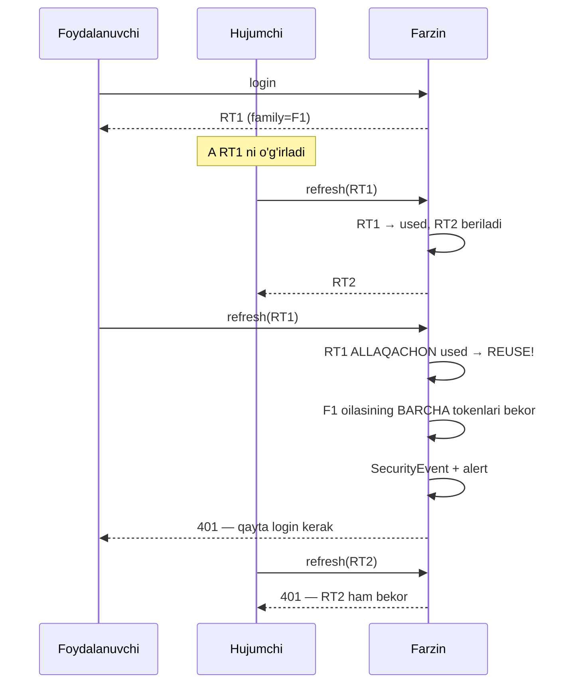
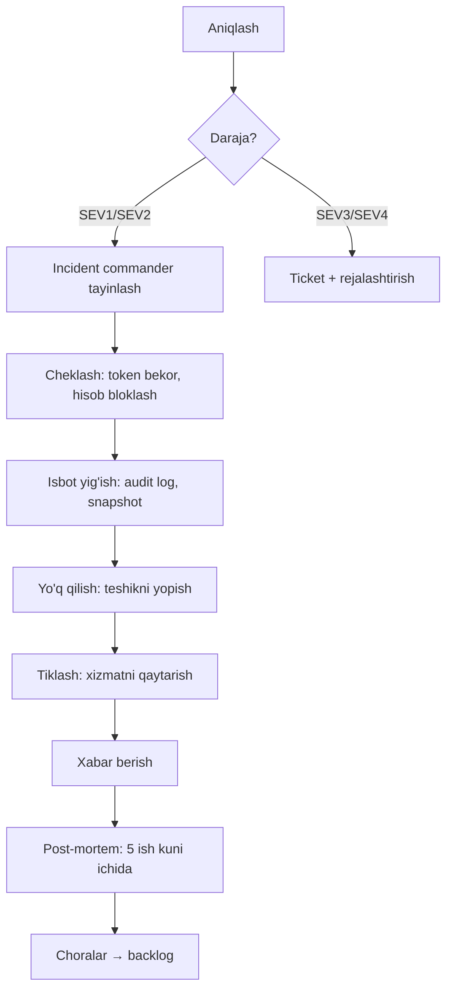

# 10 — Xavfsizlik

> Bog'liq modullar: `identity` (CANON §5, #1), `admin` (#16), va boshqa barcha modullar
> Bog'liq hujjat: `09-payments-and-billing.md` (to'lovga xos xavfsizlik)
> Status: spetsifikatsiya. Implementatsiya skeleti + interfeys, biznes-mantiq TODO qoladi.

---

## 0. Bu hujjat nima haqida

Farzin — sport infratuzilmasi. Bu shuni anglatadiki, buzilish oqibati "profil rasmi
o'zgardi" emas:

- **Reyting** — o'yinchining sport karyerasi. Soxta reyting = soxta razryad, soxta
  saralash, soxta terma jamoa tanlovi.
- **Turnir natijasi** — rasmiy sport hujjati. O'zgartirilgan natija = bekor qilingan turnir.
- **Bolalar ma'lumoti** — `school` moduli 7-17 yoshli o'quvchilar bilan ishlaydi.
- **To'lov** — klub va vazirlik pullari.

Shu sababli bu hujjat "best practice ro'yxati" emas — har bir qaror ortida **aniq tahdid**
va **aniq sabab** turadi.

**Hujjat chegarasi:** yuridik masalalarda (bolalar ma'lumoti, ma'lumot lokalizatsiyasi,
shaxsga doir ma'lumotlar qonuni) bu hujjat **maslahat bermaydi**. U faqat texnik tizim
nimani qo'llab-quvvatlashi kerakligini belgilaydi va "yurist bilan tasdiqlanishi kerak"
deb belgilaydi. §4, §5 ga qara.

---

## 1. Threat model (STRIDE)

### 1.1 Aktivlar

| # | Aktiv | Nega qimmatli | Buzilish oqibati |
|---|---|---|---|
| A1 | Foydalanuvchi hisobi | Barcha boshqa aktivlarga kirish nuqtasi | To'liq egallash |
| A2 | Reyting (`RatingHistory`) | Sport karyerasi, razryad, saralash | Soxta karyera, tizimga ishonch yo'qoladi |
| A3 | Turnir natijasi (`GameResult`) | Rasmiy sport hujjati | Turnir bekor qilinadi, nizo |
| A4 | To'lov ma'lumoti | Pul | Moliyaviy yo'qotish, yuridik javobgarlik |
| A5 | Shaxsiy ma'lumot (**bolalar**) | Qonun ostidagi ma'lumot, 7-17 yosh | Yuridik javobgarlik, bolaga real xavf |
| A6 | Hakam huquqi (`Arbiter`) | Natija va reytingga to'g'ridan-to'g'ri ta'sir | A2 va A3 ni buzish vositasi |
| A7 | Audit log | Nizo va apellyatsiyada yagona isbot | Isbot yo'qoladi, hujum yashiriladi |
| A8 | Onlayn o'yin yaxlitligi (`play`) | Fair-play, reyting manbai | Chit, soxta reyting |

### 1.2 Hujumchi profillari

Bu — real profillar, nazariy emas:

1. **Reyting ovchisi** — o'yinchi yoki uning murabbiyi. Maqsad: reytingni oshirish yoki
   raqibnikini tushirish. Motivatsiya kuchli (razryad, terma jamoa, stipendiya).
   Texnik darajasi past-o'rta, lekin **ichkaridan** ishlaydi (haqiqiy hisob bilan).
2. **Buzuq hakam** — `Arbiter` roli bor. Natijani "tuzatish" imkoni bor.
   Bu **insider threat** — eng qiyin sinf.
3. **Klub raqobatchisi** — boshqa klub ma'lumotini ko'rish yoki o'zgartirish
   (tenant izolyatsiyasini buzish).
4. **Oddiy skript kiddie** — avtomatik skaner, ochiq S3, `.env` topish.
5. **To'lov firibgari** — soxta webhook, refund abuse, chargeback abuse (`09` §8.3).
6. **Bolaga zarar yetkazmoqchi bo'lgan shaxs** — `school` modulidan bola ismi, maktabi,
   yoshi, jadvalini yig'ish. **Eng jiddiy tahdid** — oqibati qaytarilmas.

### 1.3 STRIDE tahlili

#### S — Spoofing (o'zini boshqa deb ko'rsatish)

| Tahdid | Aktiv | Chora |
|---|---|---|
| Parol o'g'irlash (credential stuffing) | A1 | Argon2id (§2.1), login rate limit (§7), buzilgan parol tekshiruvi |
| Sessiya o'g'irlash (XSS) | A1 | access token faqat xotirada, CSP (§11) |
| Refresh token o'g'irlash | A1 | Rotation + reuse detection (§2.2) |
| Soxta webhook | A4 | Imzo tekshiruvi (`09` §10.2) |
| Hakam nomidan natija kiritish | A3, A6 | 2FA majburiy (§2.5), audit log (§10) |

#### T — Tampering (ma'lumotni o'zgartirish)

| Tahdid | Aktiv | Chora |
|---|---|---|
| Natijani DB'da to'g'ridan-to'g'ri o'zgartirish | A3 | DB kirish cheklovi, audit log, reyting qayta hisobi tekshiruvi |
| Reyting hisobiga aralashish | A2 | `rating` — faqat BullMQ job yozadi, HTTP endpoint yo'q |
| Mass assignment (`role: 'admin'` yuborish) | A1, A6 | `forbidNonWhitelisted: true` (§6) |
| Audit log'ni o'chirish | A7 | Append-only, DB trigger (§10.3) |
| To'lov summasini o'zgartirish | A4 | Summa serverda hisoblanadi, client'dan olinmaydi |

#### R — Repudiation (rad etish)

| Tahdid | Aktiv | Chora |
|---|---|---|
| "Men natijani o'zgartirmadim" (hakam) | A3, A7 | `AuditLog`: kim, qachon, eski→yangi qiymat, IP |
| "Men bu to'lovni qilmadim" | A4 | Webhook payload saqlanadi, `09` §9.3 |
| "Reyting o'z-o'zidan o'zgardi" | A2 | Har bir `RatingHistory` yozuvi sabab bilan bog'lanadi |

#### I — Information Disclosure (ma'lumot oshkor bo'lishi)

| Tahdid | Aktiv | Chora |
|---|---|---|
| IDOR: `/players/{id}` boshqa o'yinchi | A5 | Resource-level check (§3.2) |
| Bola profili ochiq | A5 | Default **yopiq** (§4.2) |
| Klub ma'lumoti boshqa klubga ko'rinadi | A5 | Tenant izolyatsiya (§3.3) |
| Xato xabarida stack trace | — | Prod'da generic xato |
| `.env` GitHub'da | Hammasi | §8 — **eski loyihada aynan shu bo'lgan** |
| Log'da parol/token | A1 | Pino redaction (§8.4) |

#### D — Denial of Service

| Tahdid | Aktiv | Chora |
|---|---|---|
| Login brute-force | A1 | Rate limit (§7) |
| Turnir ro'yxatiga spam | A3 | Rate limit + hisob yoshi cheklovi |
| WebSocket event flood | A8 | Per-socket rate limit (§7.3) |
| Og'ir so'rov (butun reyting tarixi) | — | Pagination majburiy, max limit |
| Swiss pairing hisobi bilan CPU tugatish | — | Pairing — BullMQ job, HTTP emas; timeout |

#### E — Elevation of Privilege

| Tahdid | Aktiv | Chora |
|---|---|---|
| Oddiy user → klub admini | A6 | RBAC + resource check (§3) |
| Klub admini → boshqa klub admini | A5 | Tenant izolyatsiya (§3.3) |
| Hakam → super admin | A6 | Rol o'zgartirish faqat super admin + 2FA + audit |
| JWT `alg: none` | A1 | Algoritm allowlist (§2.2) |
| Rol JWT payload'dan olinadi va o'zgartiriladi | A6 | Rol DB'dan tekshiriladi (§3.4) |

---

## 2. Autentifikatsiya

### 2.1 Parol hash — Argon2id

**CANON §4 qarori: Argon2id. bcrypt EMAS.**

#### Nega bcrypt emas

bcrypt yomon emas — u 1999-yildan beri ishlaydi va hali ham buzilmagan. Lekin uning
konkret kamchiligi bor: **u faqat CPU-hard, memory-hard emas**. bcrypt ~4 KB xotira
ishlatadi. Bu shuni anglatadiki, hujumchi GPU yoki FPGA'da minglab bcrypt hisobini
parallel ishlatishi mumkin — xotira uni cheklamaydi.

Argon2id **memory-hard**: har bir hisob uchun sozlangan hajmda (masalan 64 MB) xotira
kerak. GPU'da 10 000 ta parallel ip ishlatmoqchi bo'lsangiz — 640 GB xotira kerak.
Bu parallellikni iqtisodiy jihatdan o'ldiradi.

"id" varianti — Argon2i (side-channel'ga chidamli) va Argon2d (GPU'ga chidamli)
gibridi. U ikkala hujumga qarshi ishlaydi va **umumiy tavsiya etilgan variant**.

#### Parametrlar

```ts
// src/modules/identity/password/password.service.ts
import { Injectable } from '@nestjs/common';
import * as argon2 from 'argon2';

/**
 * Argon2id parameters.
 *
 * memoryCost — the whole point of Argon2id. 64 MiB per hash makes massive GPU
 *   parallelism economically unattractive: an attacker needs memory, not just cores.
 * timeCost — iterations over that memory. Raising memoryCost buys more than raising
 *   timeCost, so we keep timeCost modest and spend the budget on memory.
 * parallelism — lanes per hash. Kept at 1: Node hashes in a worker thread and we would
 *   rather serve more concurrent logins than make one login faster.
 *
 * CALIBRATION IS MANDATORY: these are starting values, not final ones. They must be
 * tuned on the real production instance so that one hash takes ~250-500ms there.
 * A parameter set copied from a document and never measured is not a security decision.
 */
const ARGON2_OPTIONS: argon2.Options = {
  type: argon2.argon2id,
  memoryCost: 65536, // 64 MiB, in KiB
  timeCost: 3,
  parallelism: 1,
};

@Injectable()
export class PasswordService {
  async hash(plain: string): Promise<string> {
    // The salt is generated and embedded in the encoded hash by argon2 itself.
    return argon2.hash(plain, ARGON2_OPTIONS);
  }

  /**
   * Verify. Parameters come from the stored hash string, not from ARGON2_OPTIONS,
   * so raising the cost later does not lock out existing users.
   */
  async verify(hash: string, plain: string): Promise<boolean> {
    try {
      return await argon2.verify(hash, plain);
    } catch {
      // A malformed hash must read as "wrong password", never as a 500 that
      // tells the attacker this account is special.
      return false;
    }
  }

  /** True when the stored hash used weaker parameters than the current policy. */
  needsRehash(hash: string): boolean {
    return argon2.needsRehash(hash, ARGON2_OPTIONS);
  }
}
```

#### Parametr byudjeti

| Parametr | Qiymat | Sabab |
|---|---|---|
| `memoryCost` | 64 MiB | GPU parallelligini xotira bilan cheklash — Argon2id'ning asosiy foydasi |
| `timeCost` | 3 | Xotira oshirish vaqt oshirishdan samaraliroq; byudjet xotiraga sarflanadi |
| `parallelism` | 1 | Bir login tez bo'lgandan ko'ra, ko'p login bir vaqtda ishlagani muhim |

**Xotira byudjeti hisobi.** 64 MiB × bir vaqtdagi login soni. 20 ta parallel login =
1.28 GB. Bu instance xotirasiga sig'ishi kerak. Agar sig'masa — login o'zi DoS vektoriga
aylanadi. Shu sababli login endpoint'i rate-limited (§7) **va** hash worker thread'da
ishlaydi (event loop'ni bloklamaydi).

> **Kalibratsiya majburiy.** Yuqoridagi qiymatlar — boshlang'ich. Prod instance'da
> o'lchanadi va ~250-500ms ga sozlanadi. O'lchanmagan parametr — xavfsizlik qarori emas,
> taxmin.

#### Rehash

Parametrlar oshirilganda, mavjud foydalanuvchilar eski hash bilan qoladi. Yechim:
**login paytida shaffof rehash**.

```ts
// src/modules/identity/auth/auth.service.ts
async validateCredentials(email: string, password: string): Promise<User | null> {
  const user = await this.users.findByEmail(email);

  // Timing: always run a hash, even when the user does not exist. Otherwise the
  // response time tells the attacker which emails are registered.
  const hash = user?.passwordHash ?? DUMMY_HASH;
  const ok = await this.passwords.verify(hash, password);

  if (!user || !ok) return null;

  if (this.passwords.needsRehash(user.passwordHash)) {
    // We hold the plaintext exactly once, right here. Upgrade transparently.
    const fresh = await this.passwords.hash(password);
    await this.users.updatePasswordHash(user.id, fresh);
  }
  return user;
}
```

`DUMMY_HASH` — ishga tushishda joriy parametrlar bilan generatsiya qilingan haqiqiy
Argon2id hash. Sabab: mavjud bo'lmagan foydalanuvchi uchun ham xuddi shuncha vaqt sarflansin
(user enumeration himoyasi).

### 2.2 JWT va refresh token rotation

Bu bo'lim batafsil, chunki bu yerdagi xato — hisob egallash.

#### Token umri

**CANON §4: access ~15 min, refresh ~30 kun, rotatsiya bilan.**

| Token | Umri | Sabab |
|---|---|---|
| Access | 15 daqiqa | Qisqa: o'g'irlansa, oyna kichik. JWT bekor qilib bo'lmaydi — yagona himoya qisqa umr |
| Refresh | 30 kun | Uzoq: foydalanuvchi har hafta login qilmasin. Bekor qilinadi (DB'da) |

Asimmetriya sababi: access token **stateless** — u tekshirilganda DB'ga borilmaydi
(shuning uchun u tez), lekin bekor ham qilinmaydi. Refresh token **stateful** — u DB'da,
shuning uchun bekor qilinadi.

#### Rotation nima

Har safar refresh ishlatilganda:
1. Eski refresh **darhol** bekor qilinadi
2. **Yangi** refresh beriladi
3. Yangi access beriladi

Bitta refresh token **faqat bir marta** ishlatiladi. Bu — rotation.

#### Reuse detection — asosiy g'oya

Rotation'ning haqiqiy foydasi shu yerda.

Faraz: hujumchi refresh token'ni o'g'irladi (masalan, telefondagi zararli ilova orqali).
Endi ikki nusxa bor: foydalanuvchida va hujumchida.

- Hujumchi ishlatadi → eski token bekor bo'ladi, hujumchi yangi oladi
- Foydalanuvchi **eski** token bilan keladi → **u allaqachon ishlatilgan**

Bu holat normal ishlashda **hech qachon** bo'lmaydi. Ya'ni ishlatilgan token qayta
kelishi — **o'g'irlik signali**.

Reaksiya: **butun oilani bekor qilish**. Ya'ni shu login sessiyasidan tarqagan barcha
token'lar (zanjirning hamma bo'g'ini) o'chiriladi. Hujumchi ham, foydalanuvchi ham
chiqib ketadi. Foydalanuvchi qayta login qiladi — noqulay, lekin hisob saqlanadi.

Kim o'g'irlangan, kim asl — **bilib bo'lmaydi**, shuning uchun ikkalasi ham chiqariladi.
Bu ataylab: noaniqlikda ehtiyotkor tomonga og'ish.



#### Sxema

```prisma
model RefreshToken {
  id         String    @id @default(dbgenerated("uuid_generate_v7()")) @db.Uuid
  userId     String    @map("user_id") @db.Uuid
  sessionId  String    @map("session_id") @db.Uuid

  /** All tokens rotated from one login share a familyId. Reuse revokes the family. */
  familyId   String    @map("family_id") @db.Uuid

  /** SHA-256 of the token. The raw token is never stored — see §2.3. */
  tokenHash  String    @unique @map("token_hash")

  /** The token this one replaced. Lets us reconstruct the rotation chain forensically. */
  parentId   String?   @map("parent_id") @db.Uuid

  expiresAt  DateTime  @map("expires_at")
  usedAt     DateTime? @map("used_at")
  revokedAt  DateTime? @map("revoked_at")
  revokedReason String? @map("revoked_reason") // rotated | reuse_detected | logout | admin

  userAgent  String?   @map("user_agent")
  ip         String?

  createdAt  DateTime  @default(now()) @map("created_at")

  user       User      @relation(fields: [userId], references: [id])
  session    Session   @relation(fields: [sessionId], references: [id])

  @@index([familyId])
  @@index([userId, revokedAt])
  @@index([expiresAt])
  @@map("refresh_tokens")
}
```

#### Implementatsiya

```ts
// src/modules/identity/token/refresh-token.service.ts
import { Injectable, UnauthorizedException, Logger } from '@nestjs/common';
import { randomBytes, createHash } from 'node:crypto';

@Injectable()
export class RefreshTokenService {
  private readonly log = new Logger(RefreshTokenService.name);

  /** 32 bytes from the CSPRNG. Not a JWT: this token carries no claims, it is a lookup key. */
  private generate(): string {
    return randomBytes(32).toString('base64url');
  }

  private hash(token: string): string {
    // SHA-256, not Argon2: this value is already high-entropy random, so there is
    // nothing to brute-force and no reason to pay the memory-hard cost on every refresh.
    return createHash('sha256').update(token).digest('hex');
  }

  async issue(params: {
    userId: string;
    sessionId: string;
    familyId?: string;
    parentId?: string;
    ip: string;
    userAgent: string;
  }): Promise<{ token: string; expiresAt: Date }> {
    const token = this.generate();
    const expiresAt = new Date(Date.now() + 30 * 24 * 60 * 60 * 1000);

    await this.prisma.refreshToken.create({
      data: {
        userId: params.userId,
        sessionId: params.sessionId,
        familyId: params.familyId ?? crypto.randomUUID(),
        parentId: params.parentId,
        tokenHash: this.hash(token),
        expiresAt,
        ip: params.ip,
        userAgent: params.userAgent,
      },
    });

    return { token, expiresAt };
  }

  /**
   * Rotate. This is the security-critical path of the whole auth system.
   *
   * The whole check runs inside one SERIALIZABLE transaction: two parallel refreshes
   * with the same token must not both succeed. Under READ COMMITTED both could read
   * usedAt = null and both would rotate — which is exactly the hole this is closing.
   */
  async rotate(rawToken: string, ip: string, userAgent: string): Promise<{
    accessToken: string;
    refreshToken: string;
  }> {
    const tokenHash = this.hash(rawToken);

    return this.prisma.$transaction(
      async (tx) => {
        const stored = await tx.refreshToken.findUnique({ where: { tokenHash } });

        // Unknown token: either forged or already cleaned up. Nothing to revoke.
        if (!stored) throw new UnauthorizedException('Invalid refresh token');

        // ---- REUSE DETECTION ----
        // A token that was already used, or already revoked, is coming back.
        // In normal operation this cannot happen: the client always holds exactly
        // the newest token. So this is a stolen-token signal.
        if (stored.usedAt !== null || stored.revokedAt !== null) {
          await this.revokeFamily(tx, stored.familyId, 'reuse_detected');

          await this.audit.write(tx, {
            action: 'auth.refresh_reuse_detected',
            actorId: stored.userId,
            subjectType: 'RefreshToken',
            subjectId: stored.id,
            ip,
            metadata: {
              familyId: stored.familyId,
              originalIp: stored.ip,
              replayIp: ip,
              originalUserAgent: stored.userAgent,
              replayUserAgent: userAgent,
            },
          });

          this.log.warn({
            msg: 'refresh token reuse detected — family revoked',
            userId: stored.userId,
            familyId: stored.familyId,
          });

          // Tell the user out-of-band: someone may hold their credentials.
          await this.notifications.securityAlert(stored.userId, 'refresh_reuse');

          throw new UnauthorizedException('Token reuse detected. Please sign in again.');
        }

        if (stored.expiresAt < new Date()) {
          throw new UnauthorizedException('Refresh token expired');
        }

        // ---- NORMAL ROTATION ----
        // Compare-and-set: only the transaction that flips usedAt from null wins.
        const marked = await tx.refreshToken.updateMany({
          where: { id: stored.id, usedAt: null },
          data: { usedAt: new Date(), revokedAt: new Date(), revokedReason: 'rotated' },
        });
        if (marked.count !== 1) {
          // Lost the race against a parallel refresh. Treat as reuse: be conservative.
          await this.revokeFamily(tx, stored.familyId, 'reuse_detected');
          throw new UnauthorizedException('Token reuse detected. Please sign in again.');
        }

        const next = await this.issue({
          userId: stored.userId,
          sessionId: stored.sessionId,
          familyId: stored.familyId, // same family — the chain continues
          parentId: stored.id,
          ip,
          userAgent,
        });

        const accessToken = await this.access.sign(stored.userId, stored.sessionId);
        return { accessToken, refreshToken: next.token };
      },
      { isolationLevel: 'Serializable' },
    );
  }

  private async revokeFamily(tx: Prisma.TransactionClient, familyId: string, reason: string) {
    await tx.refreshToken.updateMany({
      where: { familyId, revokedAt: null },
      data: { revokedAt: new Date(), revokedReason: reason },
    });
  }
}
```

#### Nozik detallar

1. **SERIALIZABLE izolyatsiya.** Ikki parallel refresh bir xil token bilan kelsa,
   READ COMMITTED'da ikkalasi ham `usedAt = null` o'qiydi va ikkalasi ham rotatsiya
   qiladi. Bu — teshik.
2. **Poyga yutqazgani reuse deb hisoblanadi.** Bu **false positive** berishi mumkin —
   masalan, mobil ilova ikkita so'rovni bir vaqtda yuborsa. Bu ataylab: xavfsizlik
   tomonga og'ish. Agar amaliyotda ko'p bo'lsa, yechim — client'ni to'g'rilash
   (refresh'ni serialize qilish), tekshiruvni bo'shatish emas.
3. **Grace period YO'Q.** Ba'zi tizimlar eski token'ni bir necha soniya qabul qiladi
   (tarmoq retry uchun). Bu reuse detection'ni bo'shashtiradi. Farzin'da yo'q.
4. **Reuse'da foydalanuvchiga xabar beriladi** — u parolini o'zgartirishi kerakligini
   bilishi shart.

### 2.3 Refresh token DB'da hash bilan saqlanadi

`tokenHash` saqlanadi, xom token emas.

**Sabab:** agar DB o'qib olinsa (SQL injection, backup o'g'irlanishi, insider), xom
token'lar bo'lsa — hujumchi darhol barcha foydalanuvchi nomidan login qiladi. Hash bo'lsa —
hech narsa qila olmaydi.

**Nega SHA-256, Argon2 emas.** Parol — past entropiyali (odam o'ylab topgan), shuning
uchun brute-force'ga ochiq va memory-hard hash kerak. Refresh token — 32 bayt CSPRNG,
ya'ni 256 bit entropiya. Uni brute-force qilib bo'lmaydi. Argon2 bu yerda hech narsa
qo'shmaydi, faqat har bir refresh'ga 300ms qo'shadi.

### 2.4 Token qayerda saqlanadi

**Bu qism ko'p loyihada noto'g'ri qilinadi.**

| Token | Joy | Sabab |
|---|---|---|
| Access | **JS xotirasi** (React state / Zustand) | XSS o'qiy olmaydi (localStorage'ni o'qiydi). Sahifa yangilansa yo'qoladi — bu normal, refresh bor |
| Refresh | **httpOnly + Secure + SameSite=Strict cookie** | JS umuman ko'rmaydi → XSS o'g'irlay olmaydi |

**localStorage HECH QACHON.** localStorage'ga JS to'liq kira oladi. Bitta XSS —
har qanday npm paketidagi zararli kod, reklama skripti, buzilgan CDN — barcha
foydalanuvchi token'ini oladi. httpOnly cookie'ni JS umuman ko'rmaydi.

```ts
// src/modules/identity/auth/auth.controller.ts
import { Response } from 'express';

const REFRESH_COOKIE = 'farzin_rt';

function setRefreshCookie(res: Response, token: string, expiresAt: Date): void {
  res.cookie(REFRESH_COOKIE, token, {
    httpOnly: true,  // JS cannot read it — this is what defeats XSS token theft
    secure: true,    // HTTPS only; never set over plain HTTP, even in staging
    sameSite: 'strict', // the browser will not attach it to cross-site requests => CSRF
    path: '/api/v1/auth', // sent only to the auth endpoints, not to every request
    expires: expiresAt,
  });
}

@Post('login')
async login(@Body() dto: LoginDto, @Res({ passthrough: true }) res: Response, @Req() req) {
  const { accessToken, refreshToken, expiresAt } = await this.auth.login(dto, req);
  setRefreshCookie(res, refreshToken, expiresAt);
  // The access token goes in the body: the client keeps it in memory, never in storage.
  return { accessToken, expiresIn: 900 };
}
```

**`SameSite=Strict` va CSRF.** Refresh cookie faqat Farzin domenidan kelgan so'rovga
qo'shiladi. Ya'ni boshqa sayt refresh endpoint'ini chaqira olmaydi. Bu CSRF'ni shu
endpoint uchun yopadi.

**`path: '/api/v1/auth'`** — cookie har bir so'rovga qo'shilmaydi, faqat auth
endpoint'lariga. Bu tasodifiy oshkor bo'lish yuzasini kichraytiradi.

**Access token nega body'da.** U xotirada saqlanadi va `Authorization: Bearer` header'ida
yuboriladi. Header'ni brauzer avtomatik qo'shmaydi → CSRF yo'q.

### 2.5 2FA (TOTP)

TOTP (RFC 6238) — Google Authenticator, Authy va h.k.

#### Kimga majburiy

| Rol | 2FA | Sabab |
|---|---|---|
| `super_admin` | **Majburiy** | To'liq kirish |
| `federation_admin` | **Majburiy** | Milliy reyting va turnirlarga ta'sir |
| `arbiter` | **Majburiy** | Natija kiritadi → reytingga ta'sir (A3, A6) |
| `club_admin` | **Majburiy** | Ro'yxat va to'lovlarni boshqaradi |
| `coach` | Ixtiyoriy (tavsiya) | Bolalar ma'lumotiga kirish — kelajakda majburiy bo'lishi mumkin |
| `player` | Ixtiyoriy | — |

**Nega hakam uchun majburiy.** Hakam hisobi buzilsa — natija o'zgartiriladi, reyting
qayta hisoblanadi va bu butun turnir natijasini shubha ostiga qo'yadi. Hakam hisobi —
Farzin'dagi eng qimmatli rol, chunki u A2 va A3 ga to'g'ridan-to'g'ri ta'sir qiladi.

```ts
// src/modules/identity/mfa/totp.service.ts
import { Injectable } from '@nestjs/common';
import { authenticator } from 'otplib';
import { randomBytes, createHash } from 'node:crypto';

@Injectable()
export class TotpService {
  constructor() {
    authenticator.options = {
      // Accept the previous and next 30s step: phone clocks drift, and users
      // type the code as it is about to roll over.
      window: 1,
      step: 30,
      digits: 6,
    };
  }

  /** The secret is encrypted at rest — a leaked secrets table is a leaked 2FA. */
  async enroll(userId: string, email: string): Promise<{ otpauthUrl: string }> {
    const secret = authenticator.generateSecret();
    await this.repo.storePendingSecret(userId, this.crypto.encrypt(secret));
    return { otpauthUrl: authenticator.keyuri(email, 'Farzin', secret) };
  }

  /**
   * Verify and burn. Without the replay guard, a code stays valid for its whole
   * 30s window and a shoulder-surfed / phished code can be used twice.
   */
  async verify(userId: string, code: string): Promise<boolean> {
    const encrypted = await this.repo.getSecret(userId);
    if (!encrypted) return false;

    const secret = this.crypto.decrypt(encrypted);
    if (!authenticator.check(code, secret)) return false;

    const replayKey = `totp:used:${userId}:${code}`;
    const fresh = await this.redis.set(replayKey, '1', 'EX', 90, 'NX');
    return fresh === 'OK'; // already used within the window => reject
  }

  /** Recovery codes: single-use, hashed, shown exactly once. */
  async generateRecoveryCodes(userId: string): Promise<string[]> {
    const codes = Array.from({ length: 10 }, () => randomBytes(5).toString('hex'));
    await this.repo.storeRecoveryCodes(
      userId,
      codes.map((c) => createHash('sha256').update(c).digest('hex')),
    );
    return codes;
  }
}
```

**Recovery code'lar majburiy.** Telefon yo'qolsa, hakam turnir kunida tizimga kira
olmasa — bu real operatsion muammo. Support orqali 2FA'ni o'chirish — social engineering
vektori. Recovery code — o'z-o'ziga xizmat, xavfsizroq.

### 2.6 SMS OTP (Eskiz.uz)

Telefon tasdiqlash uchun. `notification` moduli orqali (CANON §5, #14).

> **Eskiz API detallari bu hujjatda YOZILMAGAN.** Endpoint, autentifikatsiya modeli,
> shablon ro'yxatga olish qoidalari va narx — **rasmiy hujjatdan tekshirilishi kerak
> (eskiz.uz).** To'qib chiqarilgan API — implementatsiya paytida bug.

Provayderdan qat'i nazar amal qiladigan xavfsizlik qoidalari:

| Qoida | Qiymat | Sabab |
|---|---|---|
| OTP uzunligi | 6 raqam | 4 raqam = 10 000 variant — brute-force'ga arzon |
| Manba | `crypto.randomInt` | `Math.random` — CSPRNG emas, bashorat qilinadi |
| Umri | 5 daqiqa | Uzoq umr = katta hujum oynasi |
| Urinish limiti | 5 ta, keyin OTP kuyadi | Aks holda 6 raqam brute-force qilinadi |
| Qayta yuborish | 60 soniyada 1 marta, soatiga 5 marta | SMS pul turadi → DoS = pul yo'qotish |
| Saqlash | Redis'da **hash** bilan, TTL bilan | DB/Redis o'qilsa OTP oshkor bo'lmasin |
| Taqqoslash | timing-safe | — |

```ts
// src/modules/identity/otp/sms-otp.service.ts
import { randomInt, createHash, timingSafeEqual } from 'node:crypto';

const OTP_TTL_SECONDS = 300;
const MAX_ATTEMPTS = 5;

@Injectable()
export class SmsOtpService {
  private key(phone: string): string { return `otp:sms:${phone}`; }

  async send(phone: string): Promise<void> {
    await this.rateLimiter.consume(`otp:send:${phone}`, { points: 5, duration: 3600 });

    // randomInt uses the CSPRNG. Math.random() is predictable and must never
    // generate anything that grants access.
    const code = randomInt(100_000, 1_000_000).toString();

    await this.redis.hset(this.key(phone), {
      hash: createHash('sha256').update(code).digest('hex'),
      attempts: '0',
    });
    await this.redis.expire(this.key(phone), OTP_TTL_SECONDS);

    // TODO(notification): send via Eskiz. The API contract must be confirmed
    // against the official eskiz.uz documentation before implementation.
    await this.smsPort.send(phone, this.templates.otp(code));
  }

  async verify(phone: string, code: string): Promise<boolean> {
    const stored = await this.redis.hgetall(this.key(phone));
    if (!stored.hash) return false;

    const attempts = Number(stored.attempts) + 1;
    if (attempts > MAX_ATTEMPTS) {
      // Burn the code. Otherwise 6 digits fall to brute force.
      await this.redis.del(this.key(phone));
      return false;
    }
    await this.redis.hset(this.key(phone), 'attempts', String(attempts));

    const a = Buffer.from(stored.hash, 'hex');
    const b = createHash('sha256').update(code).digest();
    if (a.length !== b.length || !timingSafeEqual(a, b)) return false;

    await this.redis.del(this.key(phone)); // single use
    return true;
  }
}
```

**SMS OTP — eng zaif 2-faktor.** SIM-swap, SS7 hujumi, operator ichidagi odam. Shuning
uchun SMS OTP — **telefon tasdiqlash** uchun ishlatiladi, **2FA sifatida emas**. Admin va
hakam uchun 2FA — faqat TOTP (§2.5).

### 2.7 OAuth

| Provayder | Maqsad | Holat |
|---|---|---|
| Google | Ro'yxatdan o'tishni soddalashtirish | P1 |
| Telegram Login | O'zbekistonda Telegram juda keng tarqalgan | P1 |

**Google OAuth** — standart OIDC Authorization Code + PKCE. `state` parametri CSRF uchun
majburiy, `nonce` — replay uchun.

**Telegram Login Widget** — u OAuth emas, o'zining sxemasi: Telegram bot token'i bilan
imzolangan ma'lumot yuboradi.

> **Telegram Login imzo tekshirish algoritmining aniq detallari bu hujjatda
> yozilmagan** — rasmiy hujjatdan (core.telegram.org) tasdiqlanishi kerak. Umumiy
> talab: imzo server tomonda tekshiriladi, `auth_date` eskiligi tekshiriladi
> (replay himoyasi), imzosiz ma'lumotga hech qachon ishonilmaydi.

**OAuth va hisob bog'lash — xavfli joy.** Agar Google'dan kelgan email mavjud hisob
email'i bilan mos kelsa, avtomatik bog'lash **qilinmaydi**. Sabab: agar hujumchi
qandaydir yo'l bilan o'sha email'ga ega Google hisobini yaratsa, u mavjud Farzin
hisobini egallaydi. Bog'lash faqat: (a) foydalanuvchi allaqachon login qilgan holda
ataylab bog'lasa, yoki (b) email egaligi mustaqil tasdiqlangan bo'lsa.

---

## 3. Avtorizatsiya

### 3.1 Nega faqat rol yetarli emas

Klassik xato:

```ts
// XATO — hech qachon
@Roles('club_admin')
@Patch('clubs/:clubId')
async updateClub(@Param('clubId') clubId: string, @Body() dto: UpdateClubDto) {
  return this.clubs.update(clubId, dto);
}
```

Bu kod aytadi: "klub admini klubni tahrirlashi mumkin". Lekin u **qaysi** klub ekanini
tekshirmaydi. Toshkentdagi klub admini Samarqanddagi klubni tahrirlaydi.

Bu — **IDOR** (Insecure Direct Object Reference) va **tenant izolyatsiyasi buzilishi**.
OWASP A01:2021 — Broken Access Control, eng ko'p uchraydigan zaiflik.

To'g'ri savol ikkita:
1. Bu foydalanuvchida `club_admin` roli bormi? (RBAC)
2. **Aynan shu klubda**mi? (resource-level check)

### 3.2 Ikki qatlamli model

```ts
// src/modules/identity/authz/permission.ts

export type Action = 'read' | 'create' | 'update' | 'delete' | 'manage';
export type Subject =
  | 'Tournament' | 'Club' | 'Player' | 'GameResult' | 'RatingHistory'
  | 'School' | 'Student' | 'Invoice' | 'Coach' | 'AuditLog' | 'all';

export interface AuthzContext {
  readonly userId: string;
  /** Roles resolved from the DB at request time, NOT read from the JWT payload (§3.4). */
  readonly roles: readonly RoleAssignment[];
}

export interface RoleAssignment {
  readonly role: string;
  /** The scope the role applies to. A global role has scopeType = null. */
  readonly scopeType: 'Club' | 'Federation' | 'Region' | 'School' | 'Tournament' | null;
  readonly scopeId: string | null;
}
```

`RoleAssignment` — bu **qamrovga bog'langan rol**. `club_admin` roli bo'sh emas —
u har doim aniq `Club`ka bog'langan.

```prisma
model RoleAssignment {
  id        String    @id @default(dbgenerated("uuid_generate_v7()")) @db.Uuid
  userId    String    @map("user_id") @db.Uuid
  role      String
  scopeType String?   @map("scope_type")
  scopeId   String?   @map("scope_id") @db.Uuid

  grantedBy String    @map("granted_by") @db.Uuid
  grantedAt DateTime  @default(now()) @map("granted_at")
  expiresAt DateTime? @map("expires_at")
  revokedAt DateTime? @map("revoked_at")

  user      User      @relation(fields: [userId], references: [id])

  @@unique([userId, role, scopeType, scopeId])
  @@index([userId, revokedAt])
  @@map("role_assignments")
}
```

`expiresAt` — hakam roli **turnir davomiyligiga** beriladi, abadiy emas. Turnir tugadi —
rol tugaydi. Bu eng kam imtiyoz (least privilege) printsipi.

### 3.3 CASL bilan

CANON'da avtorizatsiya kutubxonasi qat'iy belgilanmagan. Tanlov — **CASL**.

**Nega CASL:** u shart (condition) bilan qobiliyat (ability) belgilashga imkon beradi,
ya'ni rol **va** resurs shartini bir joyda ifodalaydi. Custom guard yozish mumkin, lekin
u vaqt o'tishi bilan har bir controller'da qo'lda `if` ga aylanadi — va bir kuni kimdir
`if` yozishni unutadi.

```ts
// src/modules/identity/authz/ability.factory.ts
import { AbilityBuilder, createMongoAbility, MongoAbility } from '@casl/ability';

export type AppAbility = MongoAbility<[Action, Subject]>;

@Injectable()
export class AbilityFactory {
  build(ctx: AuthzContext): AppAbility {
    const { can, cannot, build } = new AbilityBuilder<AppAbility>(createMongoAbility);

    // Everyone: public reads.
    can('read', 'Tournament', { visibility: 'public' });
    can('read', 'Player', { profileVisibility: 'public' });

    for (const r of ctx.roles) {
      switch (r.role) {
        case 'super_admin':
          can('manage', 'all');
          // Even a super admin cannot rewrite history. Audit log is append-only (§10.3).
          cannot('update', 'AuditLog');
          cannot('delete', 'AuditLog');
          break;

        case 'club_admin':
          // The condition is the whole point: scoped to THIS club, not to clubs.
          can('manage', 'Club', { id: r.scopeId });
          can('manage', 'Tournament', { clubId: r.scopeId });
          can('read', 'Player', { clubId: r.scopeId });
          can('read', 'Invoice', { payerId: r.scopeId });
          break;

        case 'arbiter':
          can('update', 'GameResult', { tournamentId: r.scopeId });
          can('read', 'Tournament', { id: r.scopeId });
          // An arbiter enters results; ratings are recomputed by a job, never by hand.
          cannot('update', 'RatingHistory');
          break;

        case 'coach':
          can('read', 'Student', { coachId: ctx.userId });
          break;

        case 'federation_admin':
          can('manage', 'Tournament', { federationId: r.scopeId });
          can('read', 'AuditLog', { scopeId: r.scopeId });
          cannot('update', 'RatingHistory');
          break;

        default:
          break;
      }
    }

    // Self-service, always last so it cannot be overridden above.
    can('read', 'Player', { userId: ctx.userId });
    can('update', 'Player', { userId: ctx.userId });

    return build();
  }
}
```

**Kalit detal: `cannot('update', 'RatingHistory')` hamma uchun.** Reyting — hech kim
qo'lda o'zgartira olmaydigan ma'lumot. U faqat `rating` modulining BullMQ job'i orqali
hisoblanadi. Bu A2 aktivini (§1.1) himoya qiladi: hatto super admin ham reytingni
"tuzatib" qo'ya olmaydi. Xato bo'lsa — natija tuzatiladi va reyting **qayta hisoblanadi**.

Guard:

```ts
// src/modules/identity/authz/policies.guard.ts
@Injectable()
export class PoliciesGuard implements CanActivate {
  async canActivate(context: ExecutionContext): Promise<boolean> {
    const handlers = this.reflector.get<PolicyHandler[]>(CHECK_POLICIES, context.getHandler()) ?? [];
    const req = context.switchToHttp().getRequest();

    // Roles come from the DB, not from the token (§3.4).
    const authzCtx = await this.authz.contextFor(req.user.sub);
    const ability = this.abilityFactory.build(authzCtx);
    req.ability = ability;

    for (const handler of handlers) {
      const ok = await handler(ability, req);
      if (!ok) {
        // 404, not 403: a 403 confirms the resource exists, which itself leaks data
        // (§1.3 Information Disclosure). The client cannot tell "no access" from "no such row".
        throw new NotFoundException();
      }
    }
    return true;
  }
}
```

Ishlatilishi:

```ts
@Patch('clubs/:clubId')
@CheckPolicies(async (ability, req) => {
  // The object must be LOADED and checked, not just its id. Checking against
  // { id: req.params.clubId } would pass any id the user typed.
  const club = await this.clubs.findById(req.params.clubId);
  return club !== null && ability.can('update', subject('Club', club));
})
async updateClub(@Param('clubId') clubId: string, @Body() dto: UpdateClubDto) {
  return this.clubs.update(clubId, dto);
}
```

**Eng muhim qoida:** tekshiruv **yuklangan obyekt** ustidan bo'ladi, ID ustidan emas.
`ability.can('update', 'Club')` (obyektsiz) — har qanday klub uchun `true` beradi.

### 3.4 Rol JWT'dan olinmaydi

**Qoida: JWT payload'da rol YO'Q.** JWT'da faqat `sub` (userId) va `sid` (sessionId).

Sabab: JWT 15 daqiqa yashaydi. Agar rol JWT'da bo'lsa va admin foydalanuvchidan
`arbiter` rolini olsa — u yana 15 daqiqa hakam bo'lib qoladi va shu vaqt ichida natija
o'zgartiradi. Bu real ssenariy: rol aynan suiiste'mol aniqlanganda olinadi.

Rol DB'dan har so'rovda olinadi. "Bu sekin" degan e'tiroz — Redis cache bilan yopiladi,
lekin **cache invalidatsiyasi rol o'zgarganda darhol** bo'ladi:

```ts
// src/modules/identity/authz/authz.service.ts
@Injectable()
export class AuthzService {
  private key(userId: string): string { return `authz:roles:${userId}`; }

  async contextFor(userId: string): Promise<AuthzContext> {
    const cached = await this.redis.get(this.key(userId));
    if (cached) return { userId, roles: JSON.parse(cached) };

    const roles = await this.prisma.roleAssignment.findMany({
      where: {
        userId,
        revokedAt: null,
        OR: [{ expiresAt: null }, { expiresAt: { gt: new Date() } }],
      },
      select: { role: true, scopeType: true, scopeId: true },
    });

    // Short TTL: the cache is a latency fix, not a source of truth. Even if an
    // invalidation is missed, a stale role cannot outlive 60 seconds.
    await this.redis.set(this.key(userId), JSON.stringify(roles), 'EX', 60);
    return { userId, roles };
  }

  /** MUST be called in the same transaction as any role change. */
  async invalidate(userId: string): Promise<void> {
    await this.redis.del(this.key(userId));
  }
}
```

60 soniya TTL + darhol invalidatsiya. Agar invalidatsiya o'tkazib yuborilsa ham,
eskirgan rol 60 soniyadan ortiq yashamaydi. 15 daqiqa emas.

### 3.5 Tenant izolyatsiyasi — chuqurlikda himoya

CASL — birinchi qatlam. Ikkinchi qatlam — **repository darajasi**.

```ts
// src/modules/org/club/club.repository.ts
/**
 * Every scoped query goes through here. A method that takes an id without a scope
 * does not exist in this class — that is the point: you cannot accidentally
 * write a cross-tenant query, because the API does not offer one.
 */
@Injectable()
export class ClubScopedRepository {
  async findTournament(clubId: string, tournamentId: string): Promise<Tournament | null> {
    return this.prisma.tournament.findFirst({
      where: { id: tournamentId, clubId }, // clubId is not optional
    });
  }

  async listRegistrations(clubId: string, tournamentId: string): Promise<Registration[]> {
    return this.prisma.registration.findMany({
      where: { tournament: { id: tournamentId, clubId } },
    });
  }
}
```

Ikki qatlam kerak, chunki bitta qatlam bir kuni unutiladi. CASL guard'i controller'da
qo'yilmasa — repository baribir boshqa klubning ma'lumotini bermaydi.

### 3.6 IDOR himoyasi — amaliy qoidalar

| Qoida | Sabab |
|---|---|
| Barcha PK — **UUID v7** (CANON §6) | Auto-increment ID bashorat qilinadi: `/players/1`, `/players/2`... |
| Ruxsat yo'q → **404**, 403 emas | 403 resurs mavjudligini tasdiqlaydi |
| Tekshiruv yuklangan obyekt ustidan | ID ustidan tekshiruv — tekshiruv emas |
| Repository doim scope talab qiladi | Guard unutilsa, ikkinchi qatlam ushlaydi |
| Ro'yxat endpoint'lari doim scope bilan filtrlanadi | `findMany` scope'siz — ommaviy oqish |

> **UUID v7 haqida halol eslatma:** u vaqt bo'yicha tartiblanadi, ya'ni timestamp
> qismi bashorat qilinadi. Lekin tasodifiy qismi (74 bit) bashorat qilinmaydi. Ya'ni
> UUID v7 — enumeratsiyadan himoya, lekin **u avtorizatsiya o'rnini bosmaydi**. ID'ni
> topib bo'lmasligiga tayanish — xavfsizlik emas. Tekshiruv baribir kerak.

---

## 4. Bolalar ma'lumoti

> ### ⚠️ Bu bo'lim yuridik maslahat EMAS
>
> `school` moduli (CANON §5, #12) 7-17 yoshli bolalar bilan ishlaydi. Bu — O'zbekiston
> **"Shaxsga doir ma'lumotlar to'g'risida"gi qonuni** ostidagi ma'lumot va voyaga
> yetmaganlar uchun qo'shimcha talablar bo'lishi mumkin.
>
> **Bu hujjat qonun talablarini talqin qilmaydi va maslahat bermaydi.** Quyida faqat
> texnik tizim nimani qo'llab-quvvatlashi kerakligi yozilgan.
>
> **Yurist bilan tasdiqlanishi kerak. Tasdiqsiz `school` moduli prod'ga chiqmaydi.**

### 4.1 Yurist tasdiqlashi kerak bo'lgan savollar

| # | Savol | Status |
|---|---|---|
| 1 | Voyaga yetmagan ma'lumotini qayta ishlash uchun rozilik shakli qanday? Yozma? Elektron? | ❌ Ochiq |
| 2 | Rozilik kimdan: ota-onadan, vasiydan, maktabdan? Maktab shartnomasi yetarlimi? | ❌ Ochiq |
| 3 | Qaysi yoshdan bola o'zi rozilik bera oladi? | ❌ Ochiq |
| 4 | Ma'lumot saqlash muddati? O'quvchi maktabni bitirgach nima bo'ladi? | ❌ Ochiq |
| 5 | Ota-ona ma'lumotni o'chirishni talab qilsa — sport natijasi ham o'chiriladimi? | ❌ Ochiq |
| 6 | Ma'lumotlar bazasini ro'yxatdan o'tkazish talabi bormi? | ❌ Ochiq |
| 7 | Buzilish holatida xabar berish muddati va tartibi? | ❌ Ochiq |
| 8 | Ma'lumot lokalizatsiyasi (§5) — aniq talab nima? | ❌ Ochiq |

### 4.2 Texnik printsiplar

Yuridik javoblardan **qat'i nazar**, quyidagilar texnik jihatdan to'g'ri va
implement qilinadi:

#### Minimal ma'lumot yig'ish

Shaxmat o'quvchisini kuzatish uchun **kerak bo'lmagan** ma'lumot yig'ilmaydi:

| Maydon | Yig'iladimi | Sabab |
|---|---|---|
| Ism, familiya | Ha | Turnir jadvali uchun zarur |
| Tug'ilgan sana | Ha | Yosh toifasi (U8, U10, ...) uchun zarur |
| Maktab, sinf | Ha | `school` modulining mohiyati |
| Jinsi | Ha | Ayrim turnirlar toifasi uchun |
| Uy manzili | **Yo'q** | Kerak emas. Yig'ilsa — bolaga real xavf (§1.2, 6-profil) |
| Bolaning telefoni | **Yo'q** | Aloqa ota-ona/maktab orqali |
| Bolaning fotosurati | Faqat aniq rozilik bilan, default yo'q | Yuqori xavf |
| Ota-ona telefoni | Ha | Aloqa uchun zarur |
| Passport/JSHSHIR | **Yo'q** | Kerak emas |

**Yig'ilmagan ma'lumot — oqmaydigan ma'lumot.** Bu eng ishonchli himoya: uni himoya
qilishning hojati yo'q.

#### Default yopiq profil

```prisma
model Student {
  id          String   @id @default(dbgenerated("uuid_generate_v7()")) @db.Uuid
  playerId    String   @map("player_id") @db.Uuid
  schoolId    String   @map("school_id") @db.Uuid
  classId     String   @map("class_id") @db.Uuid

  /**
   * A minor's profile is private by default and CANNOT be made public without
   * a recorded guardian consent. The default is not a UI preference — it is
   * enforced here and in the authz layer (§4.3).
   */
  profileVisibility String @default("private") @map("profile_visibility")
  // private | club_only | public

  guardianConsentId String? @map("guardian_consent_id") @db.Uuid

  createdAt   DateTime @default(now()) @map("created_at")
  updatedAt   DateTime @updatedAt @map("updated_at")
  deletedAt   DateTime? @map("deleted_at")

  @@index([schoolId, classId])
  @@map("students")
}

model GuardianConsent {
  id           String   @id @default(dbgenerated("uuid_generate_v7()")) @db.Uuid
  studentId    String   @map("student_id") @db.Uuid
  guardianName String   @map("guardian_name")
  guardianPhone String  @map("guardian_phone")

  /** What exactly was consented to. Not a single boolean — scopes differ. */
  scopes       String[] // profile_public | photo | broadcast | marketing

  /** How consent was captured. The exact legal form is UNDECIDED — see §4.1 item 1. */
  method       String   // paper_scan | sms_otp | school_contract
  evidenceUrl  String?  @map("evidence_url")

  grantedAt    DateTime @map("granted_at")
  revokedAt    DateTime? @map("revoked_at")

  createdAt    DateTime @default(now()) @map("created_at")

  @@index([studentId, revokedAt])
  @@map("guardian_consents")
}
```

`scopes` — bitta boolean emas, chunki roziliklar har xil: profilni ochish bir narsa,
translatsiyada ko'rsatish boshqa narsa.

#### Rozilik tekshiruvi

```ts
// src/modules/school/consent/consent.guard.ts
export type ConsentScope = 'profile_public' | 'photo' | 'broadcast' | 'marketing';

@Injectable()
export class ConsentService {
  /**
   * Deny by default. A missing consent record is NOT a "probably fine" —
   * it is a "no". This is the whole safety property of the school module.
   */
  async has(studentId: string, scope: ConsentScope): Promise<boolean> {
    const consent = await this.prisma.guardianConsent.findFirst({
      where: { studentId, revokedAt: null, scopes: { has: scope } },
    });
    return consent !== null;
  }

  async assert(studentId: string, scope: ConsentScope): Promise<void> {
    if (!(await this.has(studentId, scope))) {
      throw new ForbiddenException(`Guardian consent missing: ${scope}`);
    }
  }
}
```

#### Roziliksiz sukut

Ota-ona rozilik bermasa yoki qaytarib olsa — bola **tizimdan chiqarilmaydi**. U turnirda
qatnashadi, reytingi hisoblanadi. Faqat ommaviy ko'rinish o'chadi.

Sabab: rozilik ommaviy ko'rinish uchun kerak, sport faoliyati uchun emas. Roziliksiz
bolani turnirdan chiqarish — bolani jazolash, uni himoya qilish emas.

#### Bola nomidan to'lov

To'lovni doim kattalar qiladi (ota-ona hisobi yoki maktab shartnomasi). `Student`
entity'sining o'z to'lov usuli **yo'q**.

> Voyaga yetmagan nomidan to'lov va rozilik shakli — yuridik masala,
> `09-payments-and-billing.md` §9.1 #9. **Yurist tasdig'i kerak.**

### 4.3 Bola ma'lumotiga kirish matritsasi

| Kim | Nimani ko'radi |
|---|---|
| Ota-ona (bog'langan hisob) | O'z bolasining hammasini |
| Sinf murabbiysi | O'z sinfidagi o'quvchilarni |
| Maktab admini | O'z maktabidagi o'quvchilarni |
| Hakam (turnir davrida) | Faqat turnirdagi ism + reyting + yosh toifasi. **Maktab, sinf, ota-ona telefoni — YO'Q** |
| Boshqa o'yinchi | Faqat ism + reyting, agar `profile_public` rozilik bo'lsa |
| Anonim mehmon | `profile_public` rozilik bo'lsagina ism + reyting |

Hakam qatoriga e'tibor: hakamga turnir uchun **kerak bo'lgan minimum** beriladi. Uning
bolaning maktabini bilishga ehtiyoji yo'q.

Har bir bola ma'lumotiga kirish **`AuditLog`ga yoziladi** (§10) — bu boshqa entity'lardan
farqli, chunki bu yerda hatto **o'qish** ham nozik hodisa.

---

## 5. Ma'lumot lokalizatsiyasi

> ### ⚠️ Bu bo'lim yuridik maslahat EMAS
>
> O'zbekiston qonunchiligida fuqarolarning shaxsga doir ma'lumotlari **mamlakat
> hududidagi serverlarda** saqlanishi bo'yicha talab mavjud.
>
> **Bu hujjat bu talabning aniq doirasini, istisnolarini va texnik chegarasini
> talqin qilmaydi.** Aniq talab — qaysi ma'lumot, qaysi shartda, cross-border
> uzatish mumkinmi — **yurist bilan tasdiqlanishi kerak.**

### 5.1 Nega bu infra qaroriga ta'sir qiladi

Agar talab kuchli bo'lsa, quyidagi "standart" tanlovlar **mumkin bo'lmasligi mumkin**:

| Standart tanlov | Muammo (agar talab kuchli bo'lsa) |
|---|---|
| AWS/GCP EU yoki US region | Ma'lumot chet elda |
| Vercel / Netlify (frontend + SSR) | SSR cache'da shaxsiy ma'lumot |
| Sentry (SaaS) | Xato payload'ida shaxsiy ma'lumot |
| Datadog / cloud log | Log'da shaxsiy ma'lumot |
| SendGrid / Mailgun | Email + ism chet elda |
| Cloudflare (proxy) | Trafik chet eldan o'tadi |
| Managed PostgreSQL (chet el provayderi) | Asosiy baza chet elda |

Bu — **arxitektura darajasidagi savol**, keyin qo'shiladigan sozlama emas. Shu sababli
u yuridik tasdiqni **infra tanlanishidan oldin** talab qiladi.

### 5.2 Texnik tayyorgarlik

Yuridik javob kelguncha, tizim **ikkala stsenariyga tayyor** bo'lishi kerak:

1. **Ma'lumot tasnifi** — har bir jadval tasniflanadi:

| Tasnif | Misol | Lokalizatsiya |
|---|---|---|
| `personal_uz` | `User`, `Player`, `Student`, `GuardianConsent` | Mamlakat ichida (agar talab tasdiqlansa) |
| `sport_public` | `Tournament`, `GameResult`, `Pairing` | Ommaviy sport ma'lumoti — cheklov ehtimoli past |
| `financial` | `Invoice`, `Payment`, `LedgerEntry` | Alohida talab bo'lishi mumkin |
| `operational` | log, metrika | Shaxsiy ma'lumot **bo'lmasligi** ta'minlanadi |

2. **Infra abstraksiyasi** — Terraform (CANON §4) bilan region parametrlanadi.
   Provayder almashtirish — konfiguratsiya o'zgarishi, kod o'zgarishi emas.

3. **Tashqi SaaS minimallashtirish** — har bir tashqi xizmat uchun: qanday ma'lumot
   chiqadi? PII bormi? Agar bor bo'lsa — self-hosted alternativa tayyor bo'lsin.

4. **Log'da PII yo'q** — bu har qanday holatda to'g'ri (§8.4). Agar log'da PII bo'lmasa,
   log qayerda turishi kamroq muammo.

> **Qaror bloklangan.** Infra region tanlovi §4.1 #8 savoliga javob kelmaguncha
> yakunlanmaydi. Vaqtincha qaror: dev/staging — Docker Compose (lokal), prod —
> yuridik javobdan keyin.

---

## 6. Input validatsiya

### 6.1 class-validator konfiguratsiyasi

CANON §4: `class-validator` + `class-transformer` (NestJS native).

```ts
// src/main.ts
app.useGlobalPipes(
  new ValidationPipe({
    /**
     * whitelist: strip every property that has no decorator.
     * forbidNonWhitelisted: do more than strip — reject the request.
     *
     * Together these close mass assignment: a body carrying { role: 'super_admin' }
     * does not silently lose the field, it 400s. Loud beats silent — a silent strip
     * hides an attack that we would want to see in the logs.
     */
    whitelist: true,
    forbidNonWhitelisted: true,

    /** Run class-transformer so @Type() and implicit conversion actually apply. */
    transform: true,
    transformOptions: {
      // Explicit @Type() is required. Implicit conversion turns "1" into 1 in places
      // we did not intend and hides type bugs.
      enableImplicitConversion: false,
    },

    /** Production must not echo constraint internals back to the client. */
    disableErrorMessages: process.env.NODE_ENV === 'production',

    /** 422 for a well-formed request that fails validation. */
    errorHttpStatusCode: HttpStatus.UNPROCESSABLE_ENTITY,
  }),
);
```

### 6.2 Mass assignment

Klassik hujum:

```http
PATCH /api/v1/players/me
{ "displayName": "Sarvar", "rating": 2800, "titleCode": "GM" }
```

`whitelist: true` bo'lmasa va servis `prisma.player.update({ data: dto })` yozsa —
foydalanuvchi o'ziga GM unvonini va 2800 reyting beradi.

Uch qatlamli himoya:

1. **DTO'da faqat ruxsat etilgan maydon** dekorator bilan
2. `forbidNonWhitelisted: true` — ortiqcha maydon → 400
3. **Servisda hech qachon `data: dto`** — maydonlar aniq ko'chiriladi

```ts
// src/modules/player/dto/update-profile.dto.ts
import { IsString, Length, IsOptional, IsIn, Matches } from 'class-validator';

export class UpdateProfileDto {
  @IsOptional()
  @IsString()
  @Length(2, 64)
  // Latin + Cyrillic + Uzbek apostrophes. Uzbek names legitimately contain ' and `.
  @Matches(/^[\p{L}\p{M}\s'’`-]+$/u, { message: 'Invalid characters in name' })
  readonly displayName?: string;

  @IsOptional()
  @IsIn(['uz', 'ru', 'en'])
  readonly locale?: string;

  @IsOptional()
  @IsIn(['public', 'club_only', 'private'])
  readonly profileVisibility?: string;

  // rating, titleCode, fideId are NOT here — they are not user-editable, ever.
  // Adding them to this DTO would be a privilege escalation, not a feature.
}
```

```ts
// src/modules/player/player.service.ts
async updateProfile(playerId: string, dto: UpdateProfileDto): Promise<Player> {
  // Explicit field mapping. `data: dto` would be a standing invitation for the next
  // person who adds a field to the DTO without thinking about what it grants.
  return this.prisma.player.update({
    where: { id: playerId },
    data: {
      ...(dto.displayName !== undefined && { displayName: dto.displayName }),
      ...(dto.locale !== undefined && { locale: dto.locale }),
      ...(dto.profileVisibility !== undefined && { profileVisibility: dto.profileVisibility }),
    },
  });
}
```

### 6.3 Domenga xos validatsiya

Farzin'da o'ziga xos formatlar bor:

```ts
// src/shared/validators/chess.validators.ts
import { registerDecorator, ValidationOptions } from 'class-validator';
import { Chess } from 'chess.js';

/** FEN must be parseable, not merely regex-shaped. A malformed FEN reaching the
 *  engine or the board renderer is a crash, not a 400. */
export function IsFen(options?: ValidationOptions) {
  return (object: object, propertyName: string) => {
    registerDecorator({
      name: 'isFen',
      target: object.constructor,
      propertyName,
      options,
      validator: {
        validate(value: unknown): boolean {
          if (typeof value !== 'string' || value.length > 100) return false;
          try {
            new Chess(value);
            return true;
          } catch {
            return false;
          }
        },
        defaultMessage: () => 'Invalid FEN',
      },
    });
  };
}

/** PGN upload guard: size first, parse second. Parsing a 500 MB "PGN" is a DoS. */
export const MAX_PGN_BYTES = 5 * 1024 * 1024;
export const MAX_PGN_GAMES = 10_000;
```

Fayl yuklash (PGN import, avatar):

| Tekshiruv | Sabab |
|---|---|
| Hajm limiti **birinchi** | Parse'dan oldin. 500 MB fayl parse'i — DoS |
| MIME type — **kontentdan**, header'dan emas | `Content-Type` client aytadi, ya'ni yolg'on bo'lishi mumkin |
| Avatar — qayta kodlanadi (sharp) | EXIF (GPS!) olib tashlanadi, polyglot fayl buziladi |
| Fayl nomi — **hech qachon** client'dan | Path traversal (`../../etc/passwd`) |
| S3 kaliti — UUID v7 | Nom to'qnashuvi va enumeratsiya yo'q |

**Avatar EXIF muhim:** telefonda olingan rasmda GPS koordinatasi bo'ladi. Bola avatari
GPS bilan yuklansa — uning uy manzili oshkor bo'ladi. Qayta kodlash buni yo'q qiladi.

---

## 7. Rate limiting

### 7.1 Jadval

Sliding window, Redis backend (CANON §4).

| Endpoint | Limit | Kalit | Sabab |
|---|---|---|---|
| `POST /auth/login` | **5 / 15 min** | IP + email | Credential stuffing. Ikki kalit: bitta IP ko'p hisob, bitta hisob ko'p IP |
| `POST /auth/register` | 3 / soat | IP | Soxta hisob spami |
| `POST /auth/password/forgot` | 3 / soat | IP + email | Email bombardimon + enumeratsiya |
| `POST /auth/password/reset` | 5 / soat | IP | Token brute-force |
| `POST /auth/refresh` | 30 / soat | userId | Normal: 4/soat. 30 — buzilgan client uchun zapas |
| `POST /auth/2fa/verify` | 5 / 15 min | userId | 6 raqamli TOTP brute-force |
| `POST /otp/send` | 5 / soat, 1 / 60s | telefon | **SMS pul turadi** — DoS = to'g'ridan-to'g'ri pul yo'qotish |
| `POST /otp/verify` | 5 / OTP | telefon | §2.6 |
| API umumiy (autentifikatsiyalangan) | 300 / min | userId | Umumiy himoya |
| API umumiy (anonim) | 60 / min | IP | Skreyping |
| `POST /tournaments/*/register` | 10 / min | userId | Ro'yxat spami |
| `POST /billing/checkout` | 10 / soat | userId | To'lov spami |
| Webhook (`/billing/webhooks/*`) | **Limit yo'q** | — | Provayder retry'ini bloklash = to'lov yo'qotish |
| PGN import | 5 / soat | userId | Og'ir job |
| WebSocket: `move` | 10 / s | socket | Normal o'yinda ~1/s. 10 — premove burst uchun |
| WebSocket: `chat` | 5 / 10 s | socket | Spam |
| WebSocket: ulanish | 10 / min | IP | Ulanish flood |

> **Halol eslatma:** bu raqamlar — **boshlang'ich taxmin**. Ular real trafik ko'rsatkichlari
> asosida sozlanishi kerak. Prod ma'lumotisiz "5/15min optimal" deyish — asossiz da'vo.
> Har bir limit metrikaga chiqariladi (`rate_limit_exceeded_total{endpoint}`) va birinchi
> oyda ko'riladi.

### 7.2 Login limitining ikki kaliti

```ts
// src/modules/identity/auth/login-throttle.guard.ts
@Injectable()
export class LoginThrottleGuard implements CanActivate {
  async canActivate(context: ExecutionContext): Promise<boolean> {
    const req = context.switchToHttp().getRequest();
    const email = String(req.body?.email ?? '').toLowerCase();

    // Two independent limits.
    // byIp catches one attacker spraying many accounts.
    // byEmail catches a botnet hammering one account from many IPs — which byIp alone
    // would never see. Either limit alone leaves a hole.
    const byIp = await this.limiter.consume(`login:ip:${req.ip}`, {
      points: 5, duration: 900,
    });
    const byEmail = email
      ? await this.limiter.consume(`login:email:${email}`, { points: 5, duration: 900 })
      : { allowed: true, retryAfter: 0 };

    if (!byIp.allowed || !byEmail.allowed) {
      const retryAfter = Math.max(byIp.retryAfter, byEmail.retryAfter);
      throw new HttpException(
        { message: 'Too many login attempts', retryAfter },
        HttpStatus.TOO_MANY_REQUESTS,
      );
    }
    return true;
  }
}
```

Muvaffaqiyatli login'dan keyin `login:email:*` hisoblagichi **tozalanadi**, `login:ip:*`
esa **tozalanmaydi**. Sabab: bitta IP ortida NAT bo'lishi mumkin (maktab, internet-kafe),
lekin agar u IP haqiqatan hujum qilayotgan bo'lsa, bitta muvaffaqiyatli login uni
oqlamaydi.

### 7.3 Sliding window

```ts
// src/shared/rate-limit/sliding-window.limiter.ts
/**
 * Sliding window over a Redis sorted set.
 *
 * Fixed windows have a boundary problem: with a 5/15min fixed window an attacker
 * can send 5 at 14:59 and 5 at 15:01 — 10 in two minutes, all "within limits".
 * A sliding window has no boundary to exploit.
 */
@Injectable()
export class SlidingWindowLimiter {
  async consume(key: string, opts: { points: number; duration: number }) {
    const now = Date.now();
    const windowStart = now - opts.duration * 1000;
    const member = `${now}:${randomBytes(4).toString('hex')}`; // unique per attempt

    // One round trip, atomic.
    const [, , countRes] = await this.redis
      .multi()
      .zremrangebyscore(key, 0, windowStart) // drop what fell out of the window
      .zadd(key, now, member)
      .zcard(key)
      .expire(key, opts.duration)
      .exec() as [unknown, unknown, [Error | null, number]];

    const count = countRes[1];

    if (count > opts.points) {
      // Do not let a rejected attempt count against the window — otherwise an
      // attacker who keeps hammering extends their own ban forever, which sounds
      // fine until a legitimate user is stuck behind the same key.
      await this.redis.zrem(key, member);

      const oldest = await this.redis.zrange(key, 0, 0, 'WITHSCORES');
      const retryAfter = oldest.length
        ? Math.ceil((Number(oldest[1]) + opts.duration * 1000 - now) / 1000)
        : opts.duration;
      return { allowed: false, retryAfter, remaining: 0 };
    }

    return { allowed: true, retryAfter: 0, remaining: opts.points - count };
  }

  async reset(key: string): Promise<void> {
    await this.redis.del(key);
  }
}
```

### 7.4 Chegaralar

Rate limiting **hamma narsani hal qilmaydi**:

- **Distributed hujum** — 10 000 IP'dan bittadan so'rov. IP limiti ushlamaydi. Yechim:
  email kaliti (§7.2), CAPTCHA, WAF.
- **Proxy ortidagi IP** — `X-Forwarded-For` soxtalashtiriladi. NestJS'da `trust proxy`
  **aniq** sozlanishi kerak, aks holda hujumchi header yuborib limitdan qochadi.
- **WebSocket** — HTTP rate limit ishlamaydi. Alohida per-socket hisoblagich kerak.

```ts
// src/main.ts
// Trust exactly the number of proxies in front of us — not `true`.
// `trust proxy: true` makes Express believe the leftmost X-Forwarded-For value,
// which the client controls: every rate limit becomes bypassable.
app.set('trust proxy', Number(process.env.TRUSTED_PROXY_COUNT ?? 1));
```

---

## 8. Sirlar boshqaruvi

### 8.1 O'tmishdagi xato

> **Eski loyihada `.env` fayli GitHub'ga commit qilingan edi. DB parollari,
> API kalitlari — ochiq repozitoriyda.**

Bu shu yerda ataylab yozilgan. Bu xato takrorlanmasligi uchun quyidagilar **majburiy**,
"yaxshi bo'lardi" emas.

Muhim tushuncha: **commit qilingan sir — buzilgan sir.** Uni o'chirish yetarli emas.
Git tarixida qoladi, fork'larda qoladi, GitHub cache'ida qoladi, skanerlar allaqachon
olgan. **Yagona to'g'ri reaksiya — kalitni rotatsiya qilish.**

### 8.2 Qoidalar

| Qoida | Majburlash |
|---|---|
| `.env` **hech qachon** commit qilinmaydi | `.gitignore` + pre-commit hook + CI |
| `.env.example` — faqat bo'sh shablon | Code review + CI tekshiruvi |
| Prod sirlari — secret manager'da | Infra |
| Sir kodda hardcode qilinmaydi | gitleaks CI'da |
| Kalit rotatsiyasi — jadval bo'yicha | Runbook |
| Dev va prod sirlari — **hech qachon bir xil emas** | Alohida secret store |

```bash
# .gitignore
.env
.env.*
!.env.example
*.pem
*.key
secrets/
```

```bash
# .env.example — TEMPLATE ONLY. Every value is empty.
# Never put a real value here, not even a "temporary" or "dev-only" one:
# a dev secret in a public repo is still a secret in a public repo.

NODE_ENV=
PORT=

DATABASE_URL=
REDIS_URL=

JWT_ACCESS_SECRET=
JWT_REFRESH_SECRET=

CLICK_MERCHANT_ID=
CLICK_SECRET_KEY=
CLICK_SECRET_KEY_PREVIOUS=

PAYME_MERCHANT_ID=
PAYME_KEY=

ESKIZ_EMAIL=
ESKIZ_PASSWORD=

S3_ENDPOINT=
S3_ACCESS_KEY=
S3_SECRET_KEY=

TOTP_ENCRYPTION_KEY=
```

### 8.3 Secret manager

| Variant | Foyda | Kamchilik |
|---|---|---|
| **Doppler** | Sodda, arzon, DX yaxshi | Tashqi SaaS — §5 lokalizatsiya savoli qo'llanadi |
| **HashiCorp Vault** | Kuchli, self-hosted, dynamic secrets | Operatsion murakkablik yuqori |
| **AWS Secrets Manager** | AWS'da bo'lsak — integratsiya oson | AWS'ga bog'lanish + §5 savoli |
| **Kubernetes Secrets + SOPS** | Infra ichida | Boshlang'ich sozlash og'ir |

> **Qaror ochiq.** Tanlov §5 (ma'lumot lokalizatsiyasi) yuridik javobiga bog'liq —
> agar tashqi SaaS mumkin bo'lmasa, Vault yoki SOPS qoladi. Vaqtincha: dev — `.env`
> (lokal, commit qilinmaydi), staging/prod — qaror qabul qilingandan keyin.

Kod tomonda bu farq **ko'rinmasligi** kerak:

```ts
// src/shared/config/secrets.port.ts
/**
 * Config port. Nothing in the app reads process.env directly — that way switching
 * from .env to Vault to AWS is one adapter, not a grep across the codebase.
 */
export interface SecretsPort {
  get(key: string): Promise<string>;
  getOptional(key: string): Promise<string | undefined>;
}
```

Ishga tushishda **barcha majburiy sirlar tekshiriladi** — fail fast:

```ts
// src/shared/config/config.validation.ts
import { z } from 'zod';

const schema = z.object({
  DATABASE_URL: z.string().url(),
  REDIS_URL: z.string().url(),
  JWT_ACCESS_SECRET: z.string().min(32),
  JWT_REFRESH_SECRET: z.string().min(32),
  TOTP_ENCRYPTION_KEY: z.string().length(64), // 32 bytes hex
});

export function validateConfig(env: Record<string, unknown>) {
  const parsed = schema.safeParse(env);
  if (!parsed.success) {
    // Crash at boot. A service that starts with a missing JWT secret and generates
    // a random one at runtime is worse than a service that does not start:
    // it looks healthy while every token it issues is unverifiable after a restart.
    throw new Error(`Invalid configuration:\n${parsed.error.toString()}`);
  }
  return parsed.data;
}
```

### 8.4 Log'da sir yo'q

```ts
// src/shared/logging/logger.config.ts
import { Params } from 'nestjs-pino';

export const loggerConfig: Params = {
  pinoHttp: {
    redact: {
      paths: [
        'req.headers.authorization',
        'req.headers.cookie',
        'res.headers["set-cookie"]',
        '*.password',
        '*.passwordHash',
        '*.refreshToken',
        '*.accessToken',
        '*.token',
        '*.otp',
        '*.totpSecret',
        '*.secret',
        // Card data must never exist in our process at all (09 §10.1).
        // This is the second line, not the first.
        '*.pan', '*.cardNumber', '*.cvv',
        // PII — matters for §5 (data localisation): if logs carry no PII,
        // where the logs live is a much smaller question.
        '*.phone', '*.email', '*.guardianPhone',
      ],
      censor: '[REDACTED]',
    },
    // A correlation id ties a report to a log line without logging who the user is.
    genReqId: (req) => (req.headers['x-request-id'] as string) ?? randomUUID(),
  },
};
```

### 8.5 Kalit rotatsiyasi

| Sir | Muddat | Eslatma |
|---|---|---|
| JWT access secret | 90 kun | Rotatsiyada eski secret 15 min qabul qilinadi (access TTL) |
| JWT refresh secret | 90 kun | Rotatsiya = hamma qayta login |
| DB paroli | 180 kun | Downtime'siz: ikkita user |
| Provayder kalitlari | Provayder siyosati bo'yicha | Eski+yangi bir vaqtda (`09` §10.4) |
| S3 kalitlari | 180 kun | — |
| TOTP encryption key | 365 kun | Rotatsiya = barcha secret'ni qayta shifrlash |

**Darhol rotatsiya** (jadvaldan qat'i nazar): sir commit qilingan, xodim ketgan,
buzilish shubhasi.

### 8.6 CI'da sir skaneri

```yaml
# .github/workflows/security.yml
name: security
on: [push, pull_request]

jobs:
  secrets:
    runs-on: ubuntu-latest
    steps:
      - uses: actions/checkout@v4
        with:
          fetch-depth: 0 # gitleaks needs full history — a secret added in an
                         # earlier commit and "removed" later is still a leak
      - name: gitleaks
        uses: gitleaks/gitleaks-action@v2
        env:
          GITHUB_TOKEN: ${{ secrets.GITHUB_TOKEN }}

  env-template:
    runs-on: ubuntu-latest
    steps:
      - uses: actions/checkout@v4
      - name: .env.example must contain no values
        run: |
          if grep -qE '^[A-Z_]+=.+$' .env.example; then
            echo "::error::.env.example contains a value. It must be an empty template."
            grep -nE '^[A-Z_]+=.+$' .env.example
            exit 1
          fi
```

---

## 9. OWASP Top 10 (2021)

| # | Kategoriya | Farzin'dagi asosiy risk | Chora | Bo'lim |
|---|---|---|---|---|
| A01 | Broken Access Control | Klub admini boshqa klubni boshqaradi; hakam boshqa turnir natijasini o'zgartiradi | RBAC + resource check + scoped repository; ruxsat yo'q → 404 | §3 |
| A02 | Cryptographic Failures | Parol zaif hash bilan; token DB'da xom | Argon2id; refresh token SHA-256 hash; TLS 1.2+ majburiy; TOTP secret shifrlangan | §2.1, §2.3 |
| A03 | Injection | Prisma raw query'da user input; PGN parse | Prisma parametrlangan; `$queryRaw` faqat tagged template; PGN — sandbox parser + hajm limiti | §6 |
| A04 | Insecure Design | Reytingni qo'lda o'zgartirish imkoni; escrow'siz payout | Reyting faqat job orqali (`cannot('update','RatingHistory')`); payout escrow + qo'lda tasdiq | §3.3, `09` §7.3 |
| A05 | Security Misconfiguration | Prod'da stack trace; CORS `*`; default parol | Helmet; aniq CORS allowlist; boot'da config validatsiya (fail fast) | §8.3, §11 |
| A06 | Vulnerable Components | Eskirgan npm paket | `pnpm audit` CI'da; Dependabot; SBOM | §12 |
| A07 | Auth Failures | Brute-force; sessiya boshqaruvi zaif | Rate limit ikki kalit bilan; refresh rotation + reuse detection; 2FA | §2.2, §7 |
| A08 | Software/Data Integrity | CI'da buzilgan action; npm supply chain | Action'lar SHA bilan pin; `pnpm-lock.yaml` commit; provenance | §12 |
| A09 | Logging/Monitoring Failures | Buzilish sezilmaydi; hakam harakati izsiz | Audit log (append-only); security event alert; Pino + OpenTelemetry | §10 |
| A10 | SSRF | PGN URL'dan import; avatar URL'dan | Tashqi URL'ni server olib kelmaydi; kerak bo'lsa — allowlist + ichki IP bloklash | quyida |

### 9.1 A10 — SSRF

Real vektor: "PGN'ni URL'dan import qilish" funksiyasi. Foydalanuvchi
`http://169.254.169.254/latest/meta-data/` beradi — bu cloud metadata endpoint'i va u
yerda instance kredensiallari bor.

**Farzin qarori: server foydalanuvchi bergan URL'dan hech narsa olib kelmaydi.**
PGN — fayl sifatida yuklanadi. Bu funksiyani butunlay yo'q qiladi va bu qabul qilinadi.

Agar kelajakda kerak bo'lsa (masalan, `broadcast` moduli tashqi relay'dan o'qishi kerak
bo'lsa) — **allowlist** modeli: faqat oldindan ro'yxatga olingan xostlar, DNS
rebinding'ga qarshi IP tekshiruvi (rezolvdan **keyin**), ichki diapazonlar bloklangan.

---

## 10. Audit log

### 10.1 Nega kerak

Farzin'da audit log — "yaxshi amaliyot" emas, **funksional talab**:

1. **Hakam apellyatsiyasi.** O'yinchi natijaga e'tiroz bildiradi (`Appeal` entity,
   CANON §6). Apellyatsiya komissiyasi ko'rishi kerak: natijani kim kiritdi, qachon,
   keyin kim o'zgartirdi, nima sabab bilan. Audit log yo'q = apellyatsiyani ko'rib
   bo'lmaydi.
2. **Reyting nizosi.** "Mening reytingim noto'g'ri". Javob: mana qaysi natijalardan,
   qaysi `RatingPeriod`da, qaysi hisobdan.
3. **Insider threat.** §1.2, 2-profil (buzuq hakam). Yagona himoya — har bir harakat
   yozilishi va buzuq hakam **buni bilishi**.
4. **Incident forensics.** Buzilish bo'lganda: hujumchi nima qildi, qachon boshladi.

### 10.2 Nima yoziladi

| Hodisa | Nega |
|---|---|
| `auth.login` / `auth.login_failed` | Hujum aniqlash |
| `auth.refresh_reuse_detected` | **Kritik** — o'g'irlangan token (§2.2) |
| `auth.password_changed` / `auth.2fa_enabled` / `auth.2fa_disabled` | Hisob egallash belgisi |
| `authz.role_granted` / `authz.role_revoked` | Imtiyoz o'zgarishi |
| `result.created` / `result.updated` | **A3** — sport hujjati. Eski→yangi qiymat bilan |
| `rating.recalculated` | **A2** — nega o'zgardi |
| `tournament.published` / `tournament.cancelled` | Pulga ta'sir qiladi |
| `pairing.manual_override` | Hakam avtomatik jadvalni buzdi — sabab bilan |
| `payment.*` / `refund.*` / `payout.*` | **A4** (`09` §8.2) |
| `student.data_accessed` | **A5** — bola ma'lumotiga kirish, **o'qish ham** |
| `consent.granted` / `consent.revoked` | Yuridik isbot |
| `user.banned` / `user.unbanned` | Nizo |
| `fairplay.flagged` | Ehtimollik, ayblov emas — izlanishi kerak |
| `admin.impersonate` | Admin foydalanuvchi nomidan kirdi — **eng nozik** |

**`student.data_accessed` — o'qish ham yoziladi.** Boshqa entity'larda faqat yozish
loglanadi. Bolalar ma'lumotida o'qish ham nozik: kimdir sistematik ravishda bolalar
ma'lumotini yig'ayotgan bo'lishi mumkin (§1.2, 6-profil). Buni faqat o'qish log'i ko'radi.

### 10.3 Sxema va immutability

```prisma
model AuditLog {
  id          String   @id @default(dbgenerated("uuid_generate_v7()")) @db.Uuid

  action      String   // "result.updated"
  actorId     String?  @map("actor_id") @db.Uuid // null = system/job
  actorRole   String?  @map("actor_role")

  subjectType String   @map("subject_type") // "GameResult"
  subjectId   String   @map("subject_id") @db.Uuid

  /** Scope for filtering: which club / tournament / federation this happened in. */
  scopeType   String?  @map("scope_type")
  scopeId     String?  @map("scope_id") @db.Uuid

  /** Before/after. This is what makes an appeal reviewable. */
  before      Json?
  after       Json?

  ip          String?
  userAgent   String?  @map("user_agent")
  requestId   String?  @map("request_id")

  /** Why. Mandatory for arbiter overrides — see §10.4. */
  reason      String?

  createdAt   DateTime @default(now()) @map("created_at")

  @@index([subjectType, subjectId, createdAt])
  @@index([actorId, createdAt])
  @@index([action, createdAt])
  @@index([scopeType, scopeId, createdAt])
  @@map("audit_logs")
}
```

```sql
-- prisma/migrations/xxx_audit_append_only/migration.sql
-- Append-only, enforced by the database.
-- An application-level rule is a rule until someone writes prisma.auditLog.update()
-- and it passes review. A trigger is not negotiable.
CREATE OR REPLACE FUNCTION reject_audit_mutation() RETURNS trigger AS $$
BEGIN
  RAISE EXCEPTION 'audit_logs is append-only (attempted %)', TG_OP;
END;
$$ LANGUAGE plpgsql;

CREATE TRIGGER audit_logs_no_update
  BEFORE UPDATE OR DELETE ON audit_logs
  FOR EACH ROW EXECUTE FUNCTION reject_audit_mutation();

-- The application role cannot bypass it either.
REVOKE UPDATE, DELETE, TRUNCATE ON audit_logs FROM farzin_app;
```

**Trigger va REVOKE ikkalasi ham kerak.** Trigger — application xatosidan himoya.
REVOKE — SQL injection yoki buzilgan hisobdan himoya.

> **Halol chegara:** bu — DB ichidagi himoya. DB'ga superuser sifatida kirgan odam
> trigger'ni o'chirib, log'ni o'zgartirishi mumkin. To'liq yechim — log'ni tashqi,
> faqat-append store'ga (WORM) yuborish. Bu **keyingi bosqich** va bu yerda uni
> "bajarilgan" deb ko'rsatish noto'g'ri bo'lardi.

### 10.4 Yozish

```ts
// src/modules/admin/audit/audit.service.ts
@Injectable()
export class AuditService {
  /**
   * Write an audit record. MUST run in the same transaction as the change it describes:
   * a committed change with a lost audit record is exactly the case an insider needs.
   */
  async write(tx: Prisma.TransactionClient, entry: {
    action: string;
    actorId?: string;
    actorRole?: string;
    subjectType: string;
    subjectId: string;
    scopeType?: string;
    scopeId?: string;
    before?: unknown;
    after?: unknown;
    ip?: string;
    userAgent?: string;
    requestId?: string;
    reason?: string;
  }): Promise<void> {
    // Actions that change a sport record require a stated reason. Without this the
    // log records that a result changed but not why — which is useless in an appeal.
    if (REASON_REQUIRED.has(entry.action) && !entry.reason?.trim()) {
      throw new BadRequestException(`Action ${entry.action} requires a reason`);
    }

    await tx.auditLog.create({
      data: {
        ...entry,
        before: entry.before === undefined ? undefined : (entry.before as object),
        after: entry.after === undefined ? undefined : (entry.after as object),
      },
    });
  }
}

const REASON_REQUIRED = new Set([
  'result.updated',
  'pairing.manual_override',
  'rating.recalculated',
  'user.banned',
  'refund.requested',
  'admin.impersonate',
]);
```

Ishlatilishi:

```ts
// src/modules/arbiter/result/result.service.ts
async updateResult(params: {
  resultId: string; newResult: string; arbiterId: string; reason: string; ctx: RequestContext;
}): Promise<GameResult> {
  return this.prisma.$transaction(async (tx) => {
    const before = await tx.gameResult.findUniqueOrThrow({ where: { id: params.resultId } });

    const after = await tx.gameResult.update({
      where: { id: params.resultId },
      data: { result: params.newResult, updatedBy: params.arbiterId },
    });

    // Same transaction: the result change and its audit record commit together
    // or not at all. There is no window where one exists without the other.
    await this.audit.write(tx, {
      action: 'result.updated',
      actorId: params.arbiterId,
      actorRole: 'arbiter',
      subjectType: 'GameResult',
      subjectId: params.resultId,
      scopeType: 'Tournament',
      scopeId: before.tournamentId,
      before: { result: before.result },
      after: { result: after.result },
      reason: params.reason,
      ip: params.ctx.ip,
      userAgent: params.ctx.userAgent,
      requestId: params.ctx.requestId,
    });

    // Rating is never edited — it is recomputed from results (§3.3).
    await this.queue.add('recalculate-rating', { tournamentId: before.tournamentId });

    return after;
  });
}
```

### 10.5 Security event alert

Ba'zi hodisalar log'da qolib ketmasligi, **darhol** alert berishi kerak:

| Hodisa | Daraja | Kimga |
|---|---|---|
| `auth.refresh_reuse_detected` | High | Xavfsizlik + foydalanuvchi |
| Bir hakam 1 soatda 10+ natija o'zgartirdi | High | Federatsiya admini |
| `admin.impersonate` | High | Xavfsizlik (har safar) |
| Rol berish odatiy bo'lmagan vaqtda (kechasi) | Medium | Xavfsizlik |
| Bir userdan 100+ `student.data_accessed` / soat | **Critical** | Xavfsizlik + DPO |
| 50+ `auth.login_failed` bitta IP'dan | Medium | Avtomatik IP bloklash |
| `missing_locally` reconciliation (`09` §11.3) | Critical | Xavfsizlik + moliya |

`student.data_accessed` chegarasi **Critical** — bu §1.2 dagi 6-profil (bolaga zarar
yetkazmoqchi bo'lgan shaxs) uchun yagona aniqlash mexanizmi.

---

## 11. Xavfsizlik header'lari

### 11.1 Helmet + CSP

```ts
// src/main.ts
import helmet from 'helmet';

app.use(
  helmet({
    contentSecurityPolicy: {
      directives: {
        defaultSrc: ["'self'"],

        // No 'unsafe-inline', no 'unsafe-eval'. Next.js needs nonces for its inline
        // bootstrap — the nonce is generated per request in middleware.
        // 'unsafe-inline' would make the whole CSP decorative: that single value is
        // what an XSS payload needs to execute.
        scriptSrc: ["'self'", "'strict-dynamic'", (_req, res) => `'nonce-${res.locals.nonce}'`],

        // Tailwind emits styles at build time, but some libraries inject inline styles.
        // An inline STYLE is far less dangerous than an inline SCRIPT, so this is a
        // conscious trade-off, not an oversight.
        styleSrc: ["'self'", "'unsafe-inline'"],

        imgSrc: ["'self'", 'data:', 'blob:', process.env.S3_PUBLIC_URL!],
        fontSrc: ["'self'"],

        // WebSocket (Socket.IO) needs an explicit connect-src.
        connectSrc: ["'self'", process.env.WS_URL!],

        // Stockfish WASM runs in a worker.
        workerSrc: ["'self'", 'blob:'],

        // Clickjacking: frame-ancestors is the modern control. X-Frame-Options is
        // kept below only for old browsers that do not read CSP.
        frameAncestors: ["'none'"],

        objectSrc: ["'none'"],
        baseUri: ["'self'"],
        formAction: ["'self'"],
        upgradeInsecureRequests: [],
      },
    },

    hsts: {
      maxAge: 31_536_000, // 1 year
      includeSubDomains: true,
      // preload: submit to the browser preload list ONLY after the policy is proven
      // in production. Preload is effectively irreversible: getting it wrong locks
      // every subdomain to HTTPS for a year with no way to back out quickly.
      preload: false, // TODO(infra): enable after 6 months of stable HTTPS
    },

    referrerPolicy: { policy: 'strict-origin-when-cross-origin' },
    xFrameOptions: { action: 'deny' },
    noSniff: true,
    crossOriginOpenerPolicy: { policy: 'same-origin' },
    crossOriginResourcePolicy: { policy: 'same-site' },
  }),
);
```

**`'unsafe-inline'` scriptSrc'da — hech qachon.** Bu bitta qiymat butun CSP'ni bezakka
aylantiradi: XSS payload'i inline script sifatida ishlaydi va CSP uni to'xtatmaydi.
Nonce yondashuvi qiyinroq, lekin CSP'ning ma'nosi shunda.

**HSTS preload — ehtiyotkorlik bilan.** Preload ro'yxatiga tushish deyarli qaytarilmas.
Agar biror subdomain HTTPS'ni qo'llab-quvvatlamasa — u bir yil davomida ishlamaydi.
Avval 6 oy barqaror HTTPS, keyin preload.

### 11.2 CORS

```ts
// src/main.ts
const ALLOWED_ORIGINS = [
  'https://farzin.uz',
  'https://www.farzin.uz',
  'https://app.farzin.uz',
  ...(process.env.NODE_ENV !== 'production' ? ['http://localhost:3000'] : []),
];

app.enableCors({
  origin: (origin, callback) => {
    // No Origin header: same-origin, curl, or a mobile app. Not a browser CSRF vector.
    if (!origin) return callback(null, true);

    if (ALLOWED_ORIGINS.includes(origin)) return callback(null, true);
    callback(new Error(`CORS: origin not allowed: ${origin}`));
  },

  // Required for the refresh cookie (§2.4). And this is exactly why origin cannot
  // be '*': credentials + wildcard is rejected by browsers, and for good reason —
  // it would let any site make authenticated requests on the user's behalf.
  credentials: true,

  methods: ['GET', 'POST', 'PATCH', 'PUT', 'DELETE', 'OPTIONS'],
  allowedHeaders: ['Content-Type', 'Authorization', 'Idempotency-Key', 'X-Request-Id'],
  exposedHeaders: ['X-Request-Id', 'Retry-After'],
  maxAge: 86_400,
});
```

**Regex bilan origin tekshirish — xavfli.** `/farzin\.uz$/` degan regex
`https://evil-farzin.uz` ni ham o'tkazadi. Aniq ro'yxat (allowlist) — yagona to'g'ri yo'l.

### 11.3 Header tekshiruvi

Bu header'lar **testda tekshiriladi**, "qo'ydik" degan ishonch bilan qolmaydi:

```ts
// test/security/headers.e2e-spec.ts
it('sets the required security headers', async () => {
  const res = await request(app.getHttpServer()).get('/api/v1/health');

  expect(res.headers['strict-transport-security']).toContain('max-age=31536000');
  expect(res.headers['x-content-type-options']).toBe('nosniff');
  expect(res.headers['x-frame-options']).toBe('DENY');
  expect(res.headers['content-security-policy']).toContain("frame-ancestors 'none'");
  expect(res.headers['content-security-policy']).not.toContain("'unsafe-inline'");
  expect(res.headers['content-security-policy']).not.toContain("'unsafe-eval'");
  expect(res.headers['x-powered-by']).toBeUndefined(); // leaks the stack
});

it('rejects a disallowed origin', async () => {
  const res = await request(app.getHttpServer())
    .get('/api/v1/health')
    .set('Origin', 'https://evil-farzin.uz');
  expect(res.headers['access-control-allow-origin']).toBeUndefined();
});
```

---

## 12. Dependency xavfsizligi

### 12.1 Nega bu jiddiy

Farzin `node_modules`'da yuzlab paket bo'ladi. Ularning har biri — kod, siz yozmagan
va o'qimagan. `event-stream`, `ua-parser-js`, `node-ipc` — real supply chain hujumlari.

Bu **A06** va **A08** (§9).

### 12.2 CI pipeline

```yaml
# .github/workflows/security.yml (davomi)
jobs:
  audit:
    runs-on: ubuntu-latest
    steps:
      - uses: actions/checkout@v4
      - uses: pnpm/action-setup@v4
      - uses: actions/setup-node@v4
        with:
          node-version: 22
          cache: pnpm

      # --frozen-lockfile: CI installs exactly what the lockfile says. Without it a
      # transitive dependency can resolve to a different version than any developer saw.
      - run: pnpm install --frozen-lockfile

      # high and critical fail the build. moderate is reported but does not block —
      # otherwise the team learns to ignore a permanently red pipeline, which is worse
      # than not having one.
      - name: pnpm audit
        run: pnpm audit --audit-level=high

      - name: license check
        run: pnpm licenses list --prod

  sbom:
    runs-on: ubuntu-latest
    steps:
      - uses: actions/checkout@v4
      - name: Generate SBOM (CycloneDX)
        run: npx @cyclonedx/cyclonedx-npm --output-file sbom.json
      - uses: actions/upload-artifact@v4
        with:
          name: sbom
          path: sbom.json

  codeql:
    runs-on: ubuntu-latest
    permissions:
      security-events: write
    steps:
      - uses: actions/checkout@v4
      - uses: github/codeql-action/init@v3
        with:
          languages: typescript
      - uses: github/codeql-action/analyze@v3
```

### 12.3 Dependabot

```yaml
# .github/dependabot.yml
version: 2
updates:
  - package-ecosystem: npm
    directory: /
    schedule:
      interval: weekly
    open-pull-requests-limit: 10
    groups:
      # Group patch/minor bumps into one PR. Ten separate PRs a week get rubber-stamped;
      # one grouped PR actually gets read.
      minor-and-patch:
        update-types: ['minor', 'patch']
    ignore:
      # Majors are handled deliberately, not by a bot: NestJS/Prisma majors carry
      # breaking changes that need a migration plan.
      - dependency-name: '@nestjs/*'
        update-types: ['version-update:semver-major']
      - dependency-name: 'prisma'
        update-types: ['version-update:semver-major']

  - package-ecosystem: github-actions
    directory: /
    schedule:
      interval: monthly

  - package-ecosystem: docker
    directory: /
    schedule:
      interval: monthly
```

### 12.4 SBOM

SBOM (Software Bill of Materials) — barcha bog'liqliklar ro'yxati, versiya va litsenziya
bilan. CycloneDX formatida, har bir relizda generatsiya qilinadi.

Nega kerak: yangi CVE e'lon qilinganda, savol "bizda bu paket bormi?" — SBOM bilan javob
soniyalarda, SBOMsiz — soatlarda. Va B2G shartnomasida SBOM talab qilinishi mumkin.

### 12.5 GitHub Actions pinning

```yaml
# XATO — tag ko'chirilishi mumkin
- uses: some-action/checkout@v4

# TO'G'RI — SHA o'zgarmaydi
- uses: actions/checkout@b4ffde65f46336ab88eb53be808477a3936bae11 # v4.1.1
```

Tag — ko'chuvchi ko'rsatkich. Action muallifi (yoki uning buzilgan hisobi) `v4` tag'ini
zararli commit'ga ko'chirishi mumkin. SHA — o'zgarmas.

> Bu qoida uchinchi tomon action'lariga qat'iy qo'llanadi. `actions/*` (GitHub'ning
> o'zi) uchun ham tavsiya etiladi.

---

## 13. Incident response

### 13.1 Darajalar

| Daraja | Ta'rif | Reaksiya vaqti |
|---|---|---|
| **SEV1** | Ma'lumot oqishi (ayniqsa bolalar), to'lov buzilishi, tizim egallangan | Darhol, 24/7 |
| **SEV2** | Bitta hisob egallangan, natija manipulyatsiyasi | 4 soat |
| **SEV3** | Zaiflik topildi, hali ishlatilmagan | 24 soat |
| **SEV4** | Kichik muammo | Keyingi sprint |

### 13.2 Qadamlar



**Muhim tartib: cheklash → isbot → yo'q qilish.** Isbot yig'ishdan **oldin** serverni
o'chirib qo'yish — RAM'dagi isbotni yo'qotish. Lekin oqish davom etayotgan bo'lsa —
cheklash birinchi. Bu qaror incident commander'niki.

### 13.3 Cheklash — texnik vositalar

Bular **oldindan tayyor** bo'lishi kerak, incident paytida yozilmaydi:

```ts
// src/modules/admin/incident/kill-switch.service.ts
/**
 * Break-glass controls. Written and tested BEFORE an incident — writing a kill switch
 * at 3am during a breach is how you make the breach worse.
 */
@Injectable()
export class KillSwitchService {
  /** Revoke every refresh token for one user. */
  async revokeUserSessions(userId: string, reason: string): Promise<number> {
    const res = await this.prisma.refreshToken.updateMany({
      where: { userId, revokedAt: null },
      data: { revokedAt: new Date(), revokedReason: reason },
    });
    await this.authz.invalidate(userId);
    return res.count;
  }

  /** Revoke everything, everywhere. Every user must sign in again. */
  async revokeAllSessions(reason: string): Promise<number> {
    const res = await this.prisma.refreshToken.updateMany({
      where: { revokedAt: null },
      data: { revokedAt: new Date(), revokedReason: reason },
    });
    await this.redis.eval(DELETE_BY_PREFIX_LUA, 0, 'authz:roles:*');
    return res.count;
  }

  /** Disable a module without a deploy. */
  async disableModule(module: string, reason: string): Promise<void> {
    await this.featureFlags.set(`module.${module}.enabled`, false, reason);
  }

  /** Read-only mode: keep the site up while writes are unsafe. */
  async enableReadOnly(reason: string): Promise<void> {
    await this.featureFlags.set('system.readonly', true, reason);
  }
}
```

### 13.4 Xabar berish

| Kimga | Qachon | Nima |
|---|---|---|
| Ichki jamoa | Darhol | Slack/Telegram kanali |
| Incident commander | SEV1/2 — darhol | Telefon |
| Ta'sirlangan foydalanuvchi | Quyida — yuridik savol | Nima bo'ldi, nima qilish kerak |
| Vakolatli organ | Quyida — yuridik savol | Qonun talabiga ko'ra |
| Federatsiya / maktab (B2G) | Shartnomaga ko'ra | Shartnoma bandi |
| Ommaviy | Faqat SEV1 va zarur bo'lsa | Post-mortem |

> ### ⚠️ Xabar berish muddati — yuridik masala
>
> **Shaxsga doir ma'lumot oqishi haqida kimga, qancha vaqt ichida va qanday shaklda
> xabar berish kerakligi — O'zbekiston qonunchiligi bilan belgilanadi.**
>
> Bu hujjat bu muddatni **belgilamaydi va taxmin qilmaydi**. Boshqa yurisdiksiyalarning
> raqamlarini (masalan, GDPR'ning 72 soati) bu yerga ko'chirish — noto'g'ri bo'ladi,
> chunki O'zbekiston talabi boshqa bo'lishi mumkin.
>
> **Yurist bilan tasdiqlanishi kerak** (§4.1 #7). Javob kelgach, u incident runbook'ga
> aniq raqam sifatida yoziladi.

Foydalanuvchiga xabar — **halol** bo'ladi: nima bo'ldi, qaysi ma'lumot ta'sirlandi,
nima qilish kerak, biz nima qilyapmiz. Yumshatilgan formulirovka ("ba'zi ma'lumotlarga
ruxsatsiz kirish ehtimoli") — ishonchni yo'qotadi.

### 13.5 Post-mortem

**Blameless.** Maqsad — sabab, aybdor emas. Aybdor izlanadigan madaniyatda odamlar
incident'ni yashiradi va bu keyingisini kattaroq qiladi.

Har bir SEV1/SEV2 uchun 5 ish kuni ichida: vaqt chizig'i, asosiy sabab (5 whys),
nima yaxshi ishladi, nima yo'q, aniq choralar (mas'ul + muddat bilan) → backlog.

---

## 14. Penetration test

### 14.1 Qachon

| Vaqt | Ko'lam |
|---|---|
| **MVP prod'ga chiqishdan oldin** | To'liq — bu majburiy shart, tavsiya emas |
| Har yili | To'liq |
| `billing` moduli relizidan oldin | To'lov oqimi |
| `school` moduli relizidan oldin | Bolalar ma'lumoti, rozilik, tenant izolyatsiya |
| Katta arxitektura o'zgarishidan keyin | O'zgargan qism |

### 14.2 Nima tekshiriladi

Ustuvorlik §1 dagi aktivlar bo'yicha:

| # | Ko'lam | Nega ustuvor |
|---|---|---|
| 1 | **Tenant izolyatsiya** — klub A → klub B ma'lumoti | A5, eng ehtimolli xato (§3) |
| 2 | **Avtorizatsiya** — IDOR, rol eskalatsiyasi, `player` → `arbiter` | A6 → A2, A3 |
| 3 | **Auth** — refresh rotation, reuse detection, 2FA bypass | A1 (§2.2) |
| 4 | **Bolalar ma'lumoti** — roziliksiz kirish yo'li bormi | A5, oqibati eng og'ir |
| 5 | **To'lov** — webhook soxtalashtirish, refund abuse, idempotentlik | A4 (`09`) |
| 6 | **Reyting** — natijaga ta'sir orqali reyting manipulyatsiyasi | A2 |
| 7 | **WebSocket** — auth, boshqa o'yin xonasiga kirish | A8 |
| 8 | **Fayl yuklash** — PGN, avatar, path traversal, polyglot | §6.3 |
| 9 | **Rate limit** — bypass (proxy header, distributed) | §7.4 |
| 10 | Infra — ochiq port, S3 bucket, secret | §8 |

### 14.3 Format

- **Grey-box** — testerga oddiy foydalanuvchi hisobi, klub admini hisobi va API
  hujjati beriladi. Manba kodi berilmaydi (birinchi testda).
- **Staging'da**, prod ma'lumoti nusxasi bilan **emas** — anonimlashtirilgan ma'lumot.
  Bolalar ma'lumotining nusxasini tashqi testerga berish — o'zi buzilish.
- Natija: hisobot + har bir topilma uchun daraja + tuzatish muddati.
- **Retest majburiy** — tuzatilgani tasdiqlanmasa, topilma yopilmaydi.

### 14.4 Bug bounty

Rasmiy bug bounty — **keyingi bosqich**. Hozircha `security.txt` va aniq aloqa kanali:

```
# public/.well-known/security.txt
Contact: mailto:security@farzin.uz
Preferred-Languages: uz, ru, en
Canonical: https://farzin.uz/.well-known/security.txt
Policy: https://farzin.uz/security-policy
Expires: 2027-01-01T00:00:00.000Z
```

Kimdir zaiflik topsa, uni **ayta oladigan joy** bo'lishi kerak. Aks holda u yo indamaydi,
yo ommaga e'lon qiladi.

---

## 15. Acceptance criteria

Xavfsizlik **bajarildi** deb hisoblanadi, agar quyidagilarning **barchasi** to'g'ri bo'lsa.

### Autentifikatsiya

- [ ] Parol Argon2id bilan hash qilinadi; kod bazasida bcrypt **yo'q**
- [ ] Argon2id parametrlari **prod instance'da o'lchangan** va ~250-500ms beradi
      (o'lchov natijasi hujjatlashtirilgan)
- [ ] Mavjud bo'lmagan foydalanuvchi uchun login javob vaqti mavjud foydalanuvchinikiga
      teng (user enumeration yo'q — test bilan isbot)
- [ ] Access token TTL = 15 min, refresh = 30 kun
- [ ] Refresh rotation ishlaydi: bir token ikki marta ishlatilmaydi
- [ ] **Reuse detection ishlaydi:** ishlatilgan token qayta kelsa → butun oila bekor +
      `AuditLog` + foydalanuvchiga xabar (e2e test bilan isbot)
- [ ] Rotation SERIALIZABLE tranzaksiyada; parallel refresh testi o'tadi
- [ ] Refresh token DB'da faqat SHA-256 hash sifatida
- [ ] Refresh cookie: httpOnly + Secure + SameSite=Strict + path cheklovi
- [ ] Access token **hech qachon** localStorage'da emas (frontend review + CSP)
- [ ] JWT payload'da rol **yo'q** — faqat `sub` va `sid`
- [ ] JWT algoritmi allowlist bilan; `alg: none` rad etiladi (test bilan isbot)
- [ ] 2FA majburiy: `super_admin`, `federation_admin`, `arbiter`, `club_admin` —
      2FAsiz bu rollar ishlamaydi
- [ ] TOTP kod bir marta ishlatiladi (replay testi)
- [ ] TOTP secret DB'da shifrlangan
- [ ] Recovery code'lar: 10 ta, bir martalik, hash bilan saqlanadi
- [ ] SMS OTP: 6 raqam, `crypto.randomInt`, 5 min TTL, 5 urinish, hash bilan saqlanadi
- [ ] SMS OTP **2FA sifatida ishlatilmaydi** (faqat telefon tasdiqlash)

### Avtorizatsiya

- [ ] Har bir yozuv endpoint'ida `@CheckPolicies` bor (CI: dekoratorsiz endpoint → fail)
- [ ] Tekshiruv **yuklangan obyekt** ustidan, ID ustidan emas
- [ ] Ruxsat yo'q → **404**, 403 emas
- [ ] Rol DB'dan olinadi, cache TTL ≤ 60s, rol o'zgarganda darhol invalidatsiya
- [ ] `cannot('update', 'RatingHistory')` — **hech kim**, hatto super admin ham
- [ ] `cannot('update'|'delete', 'AuditLog')` — hech kim
- [ ] Scoped repository: klub A so'rovi klub B ma'lumotini **hech qachon** qaytarmaydi
      (integration test, har bir scoped entity uchun)
- [ ] Barcha PK — UUID v7, auto-increment **yo'q**

### Bolalar ma'lumoti — **BLOKERLAR**

- [ ] §4.1 dagi **8 ta savol** yurist tomonidan yozma javob olgan
- [ ] Uy manzili, bola telefoni, passport ma'lumoti **yig'ilmaydi** (sxema tekshiruvi)
- [ ] `Student.profileVisibility` default = `private`
- [ ] Roziliksiz ommaviy ko'rinish **imkonsiz** (test bilan isbot)
- [ ] Rozilik scope'lari alohida (`profile_public`, `photo`, `broadcast`, `marketing`)
- [ ] Rozilik qaytarib olinsa — ko'rinish o'chadi, **sport faoliyati davom etadi**
- [ ] Hakam bolaning maktabi/sinfi/ota-ona telefonini **ko'rmaydi**
- [ ] Bola ma'lumotiga **har bir kirish** (o'qish ham) `AuditLog`da
- [ ] Avatar qayta kodlanadi, EXIF (GPS) olib tashlanadi

### Ma'lumot lokalizatsiyasi — **BLOKER**

- [ ] §5 yuridik savoli (§4.1 #8) javob olgan
- [ ] Ma'lumot tasnifi jadvali to'ldirilgan (har bir jadval tasniflangan)
- [ ] Infra region qarori yuridik javobga mos
- [ ] Har bir tashqi SaaS uchun "qanday PII chiqadi?" javobi hujjatlashtirilgan

### Validatsiya

- [ ] `whitelist: true` + `forbidNonWhitelisted: true` global
- [ ] `enableImplicitConversion: false`
- [ ] Servislarda `data: dto` **yo'q** (CI grep tekshiruvi)
- [ ] `rating`, `titleCode`, `fideId`, `role` — hech bir user DTO'sida yo'q
- [ ] Fayl yuklash: hajm limiti parse'dan **oldin**, MIME kontentdan, nom serverdan
- [ ] Prod'da stack trace javobda yo'q

### Rate limiting

- [ ] §7.1 jadvalidagi har bir limit implement qilingan va test bilan qoplangan
- [ ] Login limiti **ikki kalit** bilan (IP va email)
- [ ] Sliding window (fixed window emas — chegara testi bilan isbot)
- [ ] Webhook endpoint'ida limit **yo'q**
- [ ] `trust proxy` aniq son bilan, `true` emas
- [ ] Har bir limit metrikaga chiqadi

### Sirlar

- [ ] `.env` `.gitignore`da; git tarixida hech qachon bo'lmagan (gitleaks --full-history)
- [ ] `.env.example` — **barcha qiymat bo'sh** (CI tekshiruvi)
- [ ] gitleaks CI'da, har bir PR'da
- [ ] Prod sirlari secret manager'da
- [ ] Boot'da config validatsiya — sir yo'q bo'lsa **crash**, default emas
- [ ] Log'da parol/token/karta/PII yo'q (redaction testi)
- [ ] Kalit rotatsiya runbook'i yozilgan va **bir marta mashq qilingan**

### Audit log

- [ ] §10.2 jadvalidagi barcha hodisalar yoziladi
- [ ] `UPDATE`/`DELETE` DB trigger'i tomonidan rad etiladi (test bilan isbot)
- [ ] `REVOKE UPDATE, DELETE ON audit_logs FROM farzin_app` qo'llangan
- [ ] Audit yozuvi o'zgarish bilan **bir tranzaksiyada**
- [ ] `result.updated`, `pairing.manual_override`, `rating.recalculated`,
      `user.banned` — `reason`siz **imkonsiz**
- [ ] `before`/`after` qiymatlari saqlanadi
- [ ] §10.5 jadvalidagi alert'lar ishlaydi

### Header va CORS

- [ ] Helmet yoqilgan; §11.3 testi yashil
- [ ] CSP'da `'unsafe-inline'` va `'unsafe-eval'` **yo'q** scriptSrc'da
- [ ] `frame-ancestors 'none'`
- [ ] HSTS max-age = 1 yil, includeSubDomains
- [ ] CORS — aniq allowlist, regex **yo'q**, `*` **yo'q**
- [ ] `x-powered-by` o'chirilgan

### Dependency

- [ ] `pnpm audit --audit-level=high` CI'da bloklaydi
- [ ] Dependabot yoqilgan, guruhlangan
- [ ] SBOM har bir relizda generatsiya qilinadi
- [ ] Uchinchi tomon GitHub Action'lari SHA bilan pin qilingan
- [ ] CodeQL CI'da
- [ ] `pnpm install --frozen-lockfile` CI'da

### Incident va pentest

- [ ] Kill-switch'lar yozilgan **va staging'da sinovdan o'tgan**
- [ ] Incident runbook mavjud; rollar tayinlangan
- [ ] Xabar berish muddati **yuristdan olingan** va runbook'da aniq raqam
- [ ] `security.txt` joylashtirilgan
- [ ] **MVP prod'ga chiqishdan oldin pentest o'tkazilgan**
- [ ] Barcha High/Critical topilma tuzatilgan **va retest bilan tasdiqlangan**

---

## Bog'liq hujjatlar

- `09-payments-and-billing.md` — to'lov xavfsizligi, PCI DSS scope, webhook imzo
- CANON §4 — texnologiya stack (Argon2id, JWT, class-validator qarorlari)
- CANON §5 — modullar (`identity`, `admin`)
- CANON §6 — entity nomlari, UUID v7 qoidasi
- ADR-0001 — modular monolith qarori
