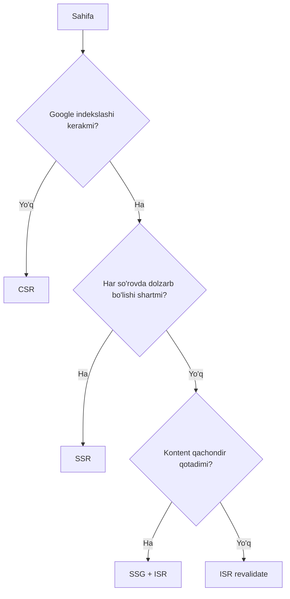
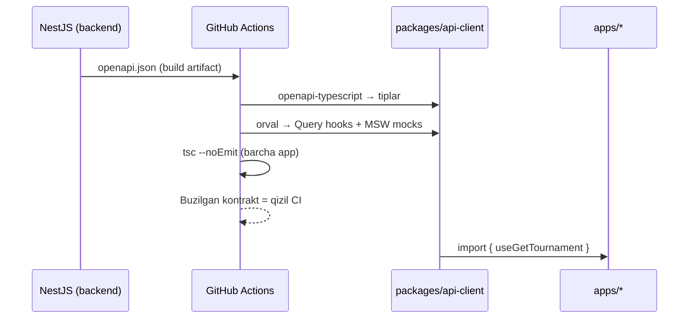
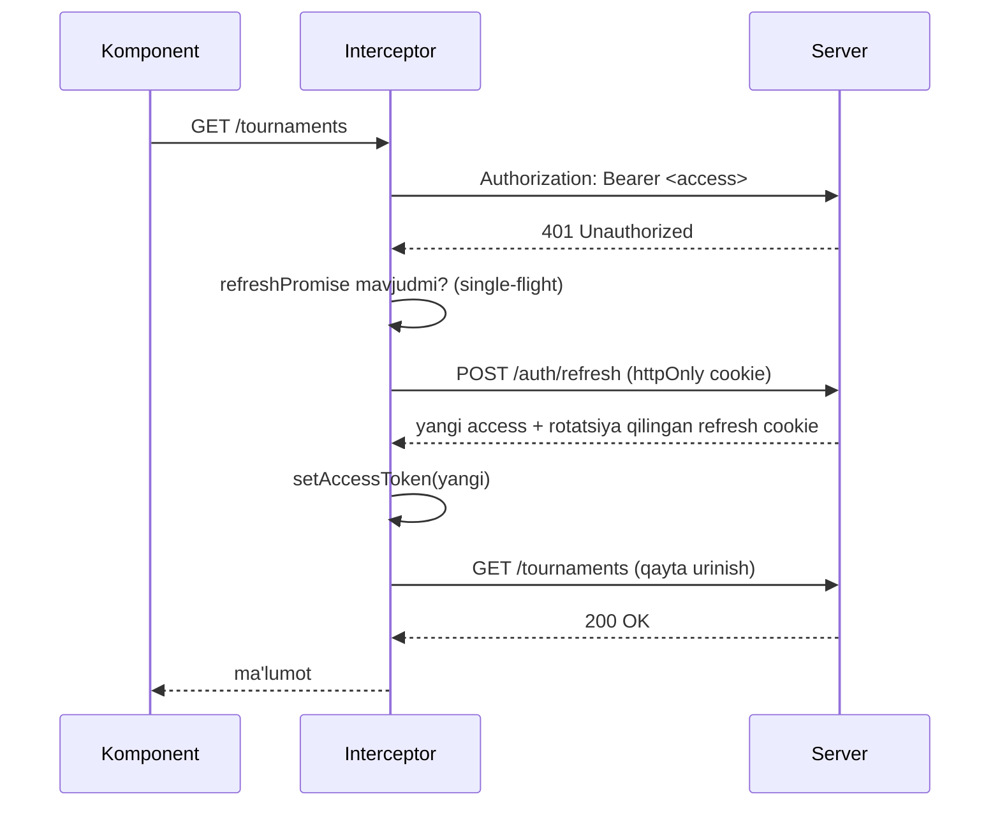
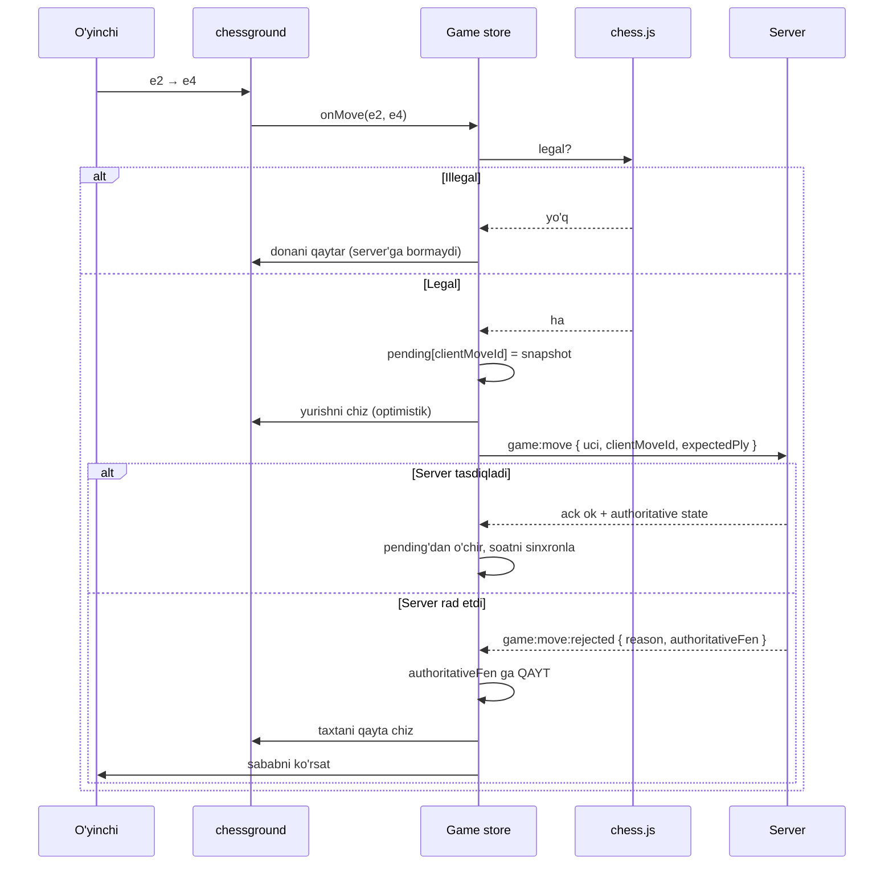

# 12 — Frontend spetsifikatsiyasi

> **Loyiha:** Farzin — O'zbekiston shaxmatining raqamli infratuzilmasi
> **Holat:** qoralama (backend spetsifikatsiyasiga bog'liq)
> **Bog'liq:** `04-api-contract.md` (OpenAPI), `07-realtime.md` (Socket.IO kontrakti), `10-security.md` (token, sessiya)

---

## 0. Hujjatning chegarasi — buni birinchi o'qing

> **Dizayn tizimi (rang, tipografika, vizual til) alohida hal qilinadi — bu hujjat
> faqat texnik poydevorni belgilaydi.**

Bu yerda **yo'q va bo'lmaydi**: rang palitrasi, brend rangi, tipografika, vizual uslub,
ikonka to'plami, taxta ko'rinishi (dona to'plami, kvadrat ranglari), dark mode qarori,
tone of voice. Sabab: bu qarorlarni backend yakunlangandan keyin loyiha egasi qabul
qiladi. Hujjat ular uchun **texnik ramka** tayyorlaydi; qaysi qarorlar kerakligi §13
"Ochiq savollar" da sanab o'tilgan.

Shuningdek **frontend kodi yozilmaydi** — kod bloklari faqat tip, interfeys va papka
strukturasini ko'rsatish uchun.

**Halollik eslatmasi.** Quyidagi raqamlarning bir qismi — maqsad, o'lchov emas; har
birining yonida holat ochiq belgilangan. Farzin hali production'da ishlamagan.

---

## 1. Ilova yuzalari (surfaces)

Farzin — bitta sayt emas. Bir nechta mustaqil frontend yuzasi bitta backend (modular
monolith) ga tayanadi. Ajratish sababi — foydalanuvchi, qurilma va kritik talab
har birida tubdan farq qiladi.

| Yuza | Kim ishlatadi | Qurilma | Kritik talab |
|------|---------------|---------|--------------|
| Public web | Mehmon, izlovchi | Mobil (asosiy) | SEO, birinchi yuklanish |
| Player app | Ro'yxatdan o'tgan o'yinchi | Mobil + desktop | Real-time, sessiya |
| Arbiter console | Hakam | Desktop/laptop | Tezlik, klaviatura, tarmoq chidamliligi |
| Club/Federation dashboard | Klub rahbari, federatsiya | Desktop | Ma'lumot zichligi, hisobot |
| School dashboard | O'qituvchi | Desktop + planshet | Soddalik, kam o'qitish |
| Broadcast view | Tomoshabin, zal ekrani | Katta ekran + mobil | Uzluksizlik, o'qilishlik |
| Admin back-office | Ichki jamoa | Desktop | To'liqlik, audit |
| Mobile app | O'yinchi | iOS/Android | Push, offline profil |

**Public web.** Google'dan kelgan mehmon ("Toshkent shaxmat turniri", "Nodirbek
Abdusattorov reyting"). Turnir kalendari va sahifasi, reyting jadvali, o'yinchi profili,
yangiliklar, klub katalogi. Mobil trafik ulushi **o'lchanishi kerak**, lekin mobil-birinchi
loyihalash xavfsiz taxmin. **SEO — kritik**: bu asosiy jalb qilish kanali (reklama
byudjeti yo'q), va Chess-Results.com bugun O'zbekiston turnirlari bo'yicha qidiruvda
birinchi. Amalda: barqaror o'qiladigan URL (`/uz/turnir/toshkent-open-2026`),
server-render qilingan HTML, dinamik `sitemap.xml`, 4 til uchun `hreflang`, dinamik OG
tasvir (`next/og`).

**Player app.** Ro'yxatdan o'tgan o'yinchi; bepul qatlam (CANON §3). Profil, turnirga
yozilish, reyting tarixi, onlayn o'yin (`play`), puzzle (`training`). Kritik talab —
real-time barqarorligi: ulanish uzilsa o'yin yo'qolmasligi kerak (§6). SEO talab
qilinmaydi — bu muhim natija: yuza SPA bo'lishi mumkin va Server Component'lar bu yerda
kam foyda beradi.

**Arbiter console.** Hakam — ko'pincha Swiss-Manager'ga o'rgangan mutaxassis, u Farzin'ni
o'shanga solishtiradi. Desktop-first (zalda laptop); mobil ikkilamchi. Uchta kritik talab:
1. **Tezlik.** 100 taxtali turnirda natija kiritish 100 marta takrorlanadi; har biriga
   2 soniya ortiqcha — raundiga 3+ daqiqa. Optimistik UI (§6.3) shart.
2. **Klaviatura.** Butun oqim sichqonchasiz: taxta raqami → natija (`1`/`0`/`=`) →
   `Enter` → keyingi taxta. Global klaviatura xaritasi, `?` — yordam.
3. **Tarmoq chidamliligi.** Turnir zali — sport zali, maktab yo'lagi; Wi-Fi zaif.
   Bu §10 ning butun sababi.

**Club/Federation dashboard.** Klub rahbari, viloyat federatsiyasi — **to'lovchi mijoz**
(CANON §3.1, asosiy daromad). A'zolar (`ClubMembership`), turnir yaratish, `org`
ierarxiyasi, obuna/invoys (`billing`), hisobot. Kritik talab — **ma'lumot zichligi**:
jadval, filtr, bulk action, CSV/PDF eksport. To'lovchi mijoz chiroyli emas, samarali
interfeys kutadi.

**School dashboard.** Maktab o'qituvchisi, B2G kanali (CANON §3.2). `SchoolClass`,
`Student` progressi, puzzle topshirig'i, davomat. Maktab kompyuteri eski bo'lishi
mumkin — brauzer versiyasi **tekshirilishi kerak**. Kritik talab — **soddalik**: bu
foydalanuvchida texnik tayyorgarlik eng kam. Har bir ekranda bitta asosiy harakat;
funksiyani kamaytirish bu yerda nuqson emas, talab.

**Broadcast view.** Ikki tubdan farqli rejim — proyektor (5+ metrdan o'qiladi) va telefon;
bu bitta sahifaning ikki varianti emas, ikki layout. Jonli tablo, DGT relay orqali jonli
pozitsiya, jadval. Kritik talab — **uzluksizlik**: ekran soatlab ishlaydi va unga hech kim
qaramaydi, shuning uchun memory leak, reconnect'dan keyin qotish, token muddati tugashi —
hammasi shu yerda ko'rinadi. **Anonim rejimda to'liq ishlashi shart** (token tugashi
ekranni o'ldirmasligi uchun).

**Admin back-office.** Ichki jamoa; `admin` moduli. Foydalanuvchi boshqaruvi, `AuditLog`,
feature flag, `fairplay` signallari. UX sayqali eng past ustuvorlik; har bir destruktiv
amal `AuditLog` ga yoziladi va tasdiq so'raydi.

**Mobile app — keyingi bosqich.** React Native (Expo), CANON §4. **Birinchi relizda yo'q.**
Web to'g'ri qurilsa (PWA — §10), mobil ilovaning yagona haqiqiy ustunligi push va app
store'da ko'rinish; ikkalasi ham mahsulot bozorga mos kelgandan keyin kerak. Hozirdan
qilinadigan yagona ish — biznes mantiqni web'ga bog'lab qo'ymaslik: `packages/api-client`,
`packages/realtime`, `packages/chess-core` DOM'ga tayanmasin (§3.2).

---

## 2. Texnologiya tanlovi va sabablari

CANON §4 stack'ni qat'iy belgilaydi. Bu bo'lim **nega** degan savolga javob beradi.

**Next.js 15 (App Router).** SEO talabi (public web) va SPA talabi (player app) bitta
ilovada yashashi kerak. Next.js — sahifa-sahifa render strategiyasini tanlashga imkon
beruvchi yagona yetuk variant: turnir sahifasi statik, reyting jadvali server'da, taxta
client'da — bitta routing daraxtida. Alternativalar: **Vite SPA** — SEO yo'q; **Astro** —
public uchun a'lo, lekin player app interaktivligi uchun noqulay (ikki alohida ilova kerak
bo'lardi); **Remix** — yaroqli, lekin ISR ekvivalenti o'rnatilgan emas. App Router
(Pages emas): Server Components, `generateStaticParams`, layout ierarxiyasi, streaming.

**React 19 va Server Components.** Server Component — ma'lumot ko'rsatadigan, interaktiv
holati yo'q joylarda: turnir jadvali, reyting ro'yxati, profil sarlavhasi, yangiliklar.
Foyda: bu kod JS bundle'ga umuman tushmaydi (turnir jadvali yuzlab qator — uni client'da
render qilishning ma'nosi yo'q). Client Component — har qanday state/event bo'lgan joy:
taxta, taymer, forma, filtr, socket; Arbiter console va player app'ning interaktiv qismi
amalda to'liq client. Chegara aniq: **chessground hech qachon Server Component bo'la
olmaydi** — u DOM'ga bevosita murojaat qiladi va `ssr: false` bilan dinamik import
qilinadi. React 19 `useOptimistic` §6.3 uchun foydali, lekin real-time rollback undan
murakkabroq — u yagona mexanizm bo'lmaydi.

**TanStack Query — server state.** Frontend holatining katta qismi — server ma'lumotining
nusxasi. Uni "state" deb atash xato; bu **cache**, va cache'ning o'z muammolari bor:
eskirish, deduplikatsiya, background refetch, retry, pagination. Buni `useEffect` + `fetch`
bilan yozish — o'sha mantiqni har komponentda qayta ixtiro qilish, faqat yomonroq.
Aniq foyda: **deduplikatsiya** (turnir sahifasida 3 komponent bir xil `Tournament`
so'rasa — 1 ta HTTP); **`staleTime`** (reyting jadvali va jonli tablo uchun turli siyosat);
**real-time integratsiya** (socket event kelganda `setQueryData` bilan cache'ni qayta
so'rovsiz yangilash — §6); **retry** (zaif tarmoq uchun eksponensial backoff bepul keladi).

**Zustand — client state (nega Redux emas).** Zustand faqat serverda mavjud bo'lmagan
holat uchun: taxta orientatsiyasi, ochilgan modal, Arbiter kiritish rejimi, socket ulanish
holati, offline outbox navbati (§10). Ro'yxat qasddan qisqa. Nega Redux emas:
(1) **server state allaqachon band** — Redux'ning tarixiy asosiy vazifasi server
ma'lumotini saqlash edi; qolgan client state juda kichik va boilerplate
(action/reducer/slice/selector) bu hajm uchun oqlanmaydi; (2) time-travel DevTools
Zustand'da ham `devtools` middleware orqali bor; (3) **bundle** — ~1 KB gzip, §9 byudjeti
uchun ahamiyatli; (4) global Provider talab qilmaydi — App Router'da qulayroq.
**Halol chegara:** client state kutilmaganda o'ssa (masalan Arbiter uchun murakkab
undo/redo), qaror qayta ko'riladi; o'tish qimmat emas, chunki holat kichik.

**Tailwind 4 + shadcn/ui — nega tayyor component library emas.** Bu §0 bilan bevosita
bog'liq: **dizayn hali hal qilinmagan.** MUI/Ant/Chakra o'z dizayn tilini olib keladi
(Material, Ant); "o'zimizniki" ko'rinishga erishish uchun theme override qatlamiga kirish
kerak — bu kutubxona bilan kurashish. Farzin'ga esa keyinroq qabul qilinadigan dizayn
kerak (§13); dizayn tilini oldindan import qilish — o'sha qarorni bilmasdan qabul qilish.
Ikkinchi sabab — bundle va noaniq tree-shaking.
**shadcn/ui boshqacha:** u kutubxona emas, komponent kodini loyihaga **nusxalab olish**
usuli — kod `packages/ui/` da bizniki bo'lib qoladi, `node_modules` da emas. Natijada:
dizayn qabul qilinganda komponentni bevosita o'zgartirish mumkin (override qatlami yo'q);
a11y poydevori (Radix primitivlari) tayyor keladi — §8 uchun jiddiy yutuq, chunki focus
trap va ARIA to'g'ri yozish qimmat va xatolarga moyil; versiya yangilanishi bizni buzmaydi.
**Trade-off (halol):** yangilanish avtomatik emas — komponent kodi bizning
mas'uliyatimizda; bu ataylab qabul qilingan narx.
**Tailwind 4:** design token'lar CSS o'zgaruvchilari sifatida (`@theme`) — dizayn qabul
qilinganda token qiymatlarini almashtirish butun ilovani o'zgartiradi, komponentlarga
tegmasdan. Bu §0 chegarasi uchun bevosita kerakli xususiyat.

**chessground — nega o'zimiz yozmaymiz.** Lichess'ning ochiq manbali taxta rendereri
(GPL — **huquqiy tekshiruv kerak**, §13.4). Taxta "shunchaki 64 kvadrat" ko'rinadi;
amalda quyidagilar allaqachon hal qilingan:
- **Touch** — barmoq bilan surish, scroll bilan konflikt, tasodifiy tegish.
- **Drag va animatsiya** — kvadratga snap, raqib yurishi animatsiyasi, ketma-ket tez
  yurishlarda animatsiya navbati.
- **Premove** — blitz uchun; kutilganidan ancha murakkab.
- **Rendering samaradorligi** — CSS transform, har yurishda 64 node qayta yaratilmaydi;
  past quvvatli telefonda seziladi.
- **A11y asoslari** — §8 uchun boshlang'ich nuqta (to'liq emas — §8.2).

Buni noldan yozish — bir necha oy va o'sha muammolarni qaytadan topish. Farzin'ning
qiymati taxta rendererida emas — **pairing, rating, turnir boshqaruvida** (CANON §7).
**Diqqat:** chessground faqat **ko'rsatadi**; u qoidalarni bilmaydi — qaysi yurish legal
ekanini unga aytish kerak. Bu chess.js ning sababi.

**chess.js — client-side legal move validatsiya.** Vazifa: dona ushlanganda qaysi
kvadratlar belgilanishini hisoblash (rokirovka, en passant, promotion, shohni ochib
qo'ymaslik).

> **Kritik chegara:** chess.js — **UX qulayligi**, xavfsizlik chegarasi EMAS. Yurishning
> haqiqiyligini **faqat server tasdiqlaydi.**

Client kodi to'liq foydalanuvchi nazoratida; DevTools'da chess.js'ni chetlab o'tib illegal
yurish yuborish — kutilgan hujum. To'liq kontrakt: **`07-realtime.md` § Move validation**.
Ya'ni chess.js va server validator **bir xil qoidalarni ikki marta** amalga oshiradi.
Takrorlanish ataylab: biri tezlik, ikkinchisi to'g'rilik uchun. Kelishmovchilikda — server
g'olib, client rollback qiladi (§6.3).

**Stockfish 17 WASM — client-side analiz.** Sabab — **server yuklamasi**: analiz hisoblash
jihatdan eng qimmat operatsiya va u bepul funksiya (CANON §3), ya'ni daromad keltirmaydigan
xizmat uchun eng qimmat infratuzilma. Brauzerga surish xarajatni nolga tushiradi, va
foydalanuvchi qurilmasi kuchayishi bilan sifat o'z-o'zidan oshadi. Server-side Stockfish
`fairplay` modulida qoladi (NNUE, engine korrelyatsiya) — u server'da bo'lishi shart,
chunki natijaga ishonish kerak va bu ko'rinmas fon jarayoni (BullMQ). Frontend talablari:
- **Lazy load — majburiy.** Bir necha megabayt (aniq o'lcham build variantiga bog'liq —
  **o'lchanishi kerak**); hech qachon boshlang'ich bundle'da bo'lmaydi (§9.3).
- **Web Worker — majburiy.** Asosiy oqimda UI muzlaydi.
- **Ikki build:** `wasm-threads` (SharedArrayBuffer, COOP/COEP header kerak) va bitta
  oqimli fallback. COOP/COEP uchinchi tomon embed'larini buzishi mumkin —
  **tekshirilishi kerak**; kerak bo'lsa analiz alohida route'ga ajratiladi.
- **Qurilma cheklovi** — past quvvatli telefonda depth/vaqtni cheklash yoki taklif
  qilmaslik; chegara **o'lchanishi kerak**.

---

## 3. Rendering strategiyasi va loyiha strukturasi

### 3.1 Rendering qaror jadvali

| Sahifa | Strategiya | Sabab |
|--------|-----------|-------|
| Bosh sahifa | ISR (~1 soat) | SEO, kamdan-kam o'zgaradi |
| Turnir kalendari | ISR (~5 daq) | SEO, yangi turnir qo'shiladi |
| Turnir sahifasi (tugagan) | SSG + ISR | Abadiy o'zgarmaydi, SEO uchun eng muhim |
| Turnir sahifasi (jonli) | SSR + WS | Natija oqimi real-time |
| Turnir jadvali (standings) | SSR | Har so'rovda dolzarb bo'lishi kerak |
| Reyting jadvali | SSR (+ cache header) | SEO, lekin dolzarblik muhim |
| O'yinchi profili | ISR (~15 daq) | SEO, sekin o'zgaradi |
| Yangiliklar | SSG + ISR | Sof kontent |
| Klub/maktab katalogi | ISR (~1 soat) | SEO, statik |
| Onlayn o'yin (taxta) | CSR | SEO yo'q, to'liq real-time |
| Puzzle | CSR | Interaktiv, sessiyaga bog'liq |
| Player profil (o'ziniki) | CSR | Autentifikatsiyalangan, shaxsiy |
| Arbiter console | CSR | Autentifikatsiyalangan, holat og'ir |
| Club/Federation dashboard | CSR | Autentifikatsiyalangan |
| School dashboard | CSR | Autentifikatsiyalangan |
| Broadcast view | CSR (+ SSR skelet) | Uzluksiz real-time |
| Admin back-office | CSR | Ichki, SEO ma'nosiz |



**Nega tugagan turnir SSG.** Bu SEO strategiyasining o'zagi: 2019-yilgi turnir natijasi
hech qachon o'zgarmaydi, lekin uni yillar davomida qidiradilar. Bunday sahifa CDN'dan
statik fayl sifatida beriladi — server'ga bormaydi; turnirlar soni o'sgani sari bu
qimmatga aylanadi (minglab sahifa, nol server xarajati). Amalda: `generateStaticParams`
build vaqtida faqat oxirgi N turnirni generatsiya qiladi (aks holda build vaqti
boshqarib bo'lmas darajaga o'sadi), qolgani birinchi so'rovda on-demand.

**Nega reyting jadvali SSR, ISR emas.** Reyting `RatingPeriod` oxirida ommaviy qayta
hisoblanadi (Glicko-2, BullMQ); hisob tugagan zahoti jadval o'zgaradi. ISR bilan
foydalanuvchi eski reytingni ko'radi — bu reyting bazasi uchun ishonchni yo'qotadi.
**Muqobil:** on-demand `revalidateTag` — backend hisob tugagach cache'ni bekor qiladi
(statik tezlik + dolzarblik), lekin qo'shimcha integratsiya talab qiladi.
**Ochiq qaror:** birinchi relizda SSR, keyin o'lchov asosida optimallashtirish.

### 3.2 Monorepo

Bir nechta yuza bitta generatsiya qilingan API client va domain kutubxonasiga tayanadi;
alohida repolar versiya sinxronizatsiyasi muammosini yaratadi.

> **Ochiq qaror:** monorepo vositasi CANON'da belgilanmagan va bu hujjat uni tanlamaydi.
> Boshlang'ich sifatida npm workspaces yetarli (yangi bog'liqlik yo'q); build cache
> muammoga aylansa — Turborepo. §13.4.

```
farzin/
├── apps/
│   ├── web/          # Next.js 15 — public web + player app
│   ├── console/      # Arbiter + Club/Federation + School + Admin
│   ├── broadcast/    # Jonli tablo (alohida — uzluksizlik talabi)
│   └── mobile/       # Expo — keyingi bosqich
├── packages/
│   ├── api-client/   # OpenAPI'dan GENERATSIYA — qo'lda tegilmaydi
│   ├── realtime/     # Socket.IO client + event tiplari
│   ├── chess-core/   # chess.js wrapper, PGN/FEN, SAN → matn (§8)
│   ├── ui/           # shadcn/ui komponentlari + design token
│   ├── i18n/         # next-intl + transliteratsiya (§7)
│   └── config/       # eslint, tsconfig, tailwind
└── docs/
```

**Nega `console` alohida.** Arbiter, Club, School, Admin — hammasi autentifikatsiyalangan,
SEO'siz, ma'lumot zich desktop interfeyslari; ular layout, jadval va klaviatura tizimini
bo'lishadi. `web` ichiga qo'yish public bundle'ni og'irlashtiradi va §9 byudjetini buzadi.
**Nega `broadcast` alohida.** Uzluksizlik talabi uni boshqacha qiladi: minimal bog'liqlik,
xatoga eng kam yuza; katta ilova ichida o'zga sahifadagi leak zal ekranini o'ldiradi.
**Nega `mobile` shu yerda.** Expo `api-client`, `realtime`, `chess-core` ni qayta
ishlatadi — shuning uchun bu paketlar platformadan mustaqil bo'lishi shart.

### 3.3 Feature-based struktura

`components/`, `hooks/`, `utils/` bo'linishi kichik loyihada ishlaydi; 16 modulli loyihada
har bir o'zgarish 5 papkaga tegishga majbur qiladi. Frontend backend modul chegaralariga
ergashadi (CANON §5).

```
apps/web/src/
├── app/                       # Next.js App Router — FAQAT routing
│   ├── [locale]/
│   │   ├── (public)/          # page, turnir/[slug]/{jadval,raund/[n]},
│   │   │                      # reyting, oyinchi/[id], yangiliklar/[slug]
│   │   └── (player)/          # layout.tsx = auth guard
│   │       └── profil/  oyin/[gameId]/  puzzle/
│   ├── api/                   # faqat BFF: OG image, webhook, health
│   └── sitemap.ts
├── features/                  # BUTUN biznes mantiq
│   ├── tournament/{api,components,model,lib}/
│   ├── rating/  player/  puzzle/  auth/
│   └── play/
│       ├── api/               # TanStack Query hook'lari
│       ├── components/        # Board, Clock, MoveList
│       ├── model/             # game store, optimistic queue (§6.3)
│       └── lib/
├── shared/{ui,lib,hooks}/     # feature'ga bog'liq BO'LMAGAN kod
└── widgets/{site-header,tournament-card}/   # feature'larni birlashtiruvchi bloklar
```

**Qat'iy qoida — bog'liqlik yo'nalishi:** `app/ → widgets/ → features/ → shared/ → packages/`

Strelka faqat o'ngga. `shared/` hech qachon `features/` dan import qilmaydi; ikki feature
bir-biriga bevosita murojaat qilmaydi — umumiy narsa `shared/` yoki `widgets/` ga
ko'tariladi. Bu ESLint (`import/no-restricted-paths`) bilan **avtomatik tekshiriladi** —
hujjatdagi kelishuv qoida emas, linter qoida.

---

## 4. Backend bilan aloqa

### 4.1 OpenAPI'dan avtomatik client generatsiyasi

Backend Swagger/OpenAPI 3.1 ni avtomatik chiqaradi (CANON §4); frontend undan TypeScript
client'ni **avtomatik generatsiya qiladi**. Nega qo'lda tip yozilmaydi:

1. **Qo'lda tip — hujjat, kontrakt emas.** Backend `startsAt` ni `startDate` ga
   o'zgartirsa, qo'lda yozilgan tip xato bermaydi — ilova ish paytida `undefined` oladi.
   Generatsiya qilingan tip esa CI'da darhol qulaydi.
2. **Miqyos.** 16 modul, ~28 entity, yuzlab endpoint — qo'lda sinxron saqlash to'liq
   stavkali ish va u albatta eskiradi.
3. **Drift ko'rinmas** — jim eskirgan tip eng yomon xato turi.

**Vositalar:** `openapi-typescript` (sof tiplar) + `orval` (TanStack Query hook'lari,
Zod sxemalari, MSW mock handler'lari — §11.3).



**Qat'iy qoidalar.** `packages/api-client/src/generated/` **qo'lda tahrirlanmaydi** — CI
tekshiradi: generatsiya natijasi commit'dan farq qilsa, build qulaydi. Backend PR'i
OpenAPI'ni o'zgartirsa, tiplar **o'sha PR'da** qayta generatsiya qilinadi — buzuvchi
o'zgarish backend PR'ida ko'rinadi, keyingi sprintda emas. Kerak bo'lsa qo'lda wrapper
`features/*/api/` da yoziladi; generatsiya qilingan qismga tegilmaydi.

**Halol chegara:** foyda backend sxemasi sifatiga bog'liq. NestJS Swagger dekoratorlari
to'liq yozilmasa (`@ApiProperty` yo'q), generatsiya `any` beradi va butun foyda yo'qoladi.
Bu backend tomonidagi intizom talabi — `04-api-contract.md` da qat'iylashtirilishi kerak.

### 4.2 Socket.IO client tiplari

REST uchun OpenAPI bor; WebSocket uchun standart sxema tili yo'q — shuning uchun event
kontrakti qo'lda yoziladi, lekin **bitta joyda**: `packages/realtime/`. Bu paket
**`07-realtime.md` dagi kontraktning bevosita aksi**; backend gateway va frontend client
bitta tip faylini import qiladi — nusxa emas.

```typescript
// packages/realtime/src/contracts.ts
// Manba: docs/07-realtime.md § Event contract

export interface ServerToClientEvents {
  'game:state': (p: GameStatePayload) => void;
  'game:move': (p: MoveAppliedPayload) => void;
  'game:move:rejected': (p: MoveRejectedPayload) => void;
  'game:clock': (p: ClockSyncPayload) => void;
  'game:end': (p: GameEndPayload) => void;
  'tournament:standings': (p: StandingsPayload) => void;
  'tournament:pairing': (p: PairingPublishedPayload) => void;
}

export interface ClientToServerEvents {
  'game:join': (p: { gameId: string }, ack: (r: Result<GameStatePayload>) => void) => void;
  'game:move': (p: MoveRequestPayload, ack: (r: Result<MoveAppliedPayload>) => void) => void;
  'clock:sync': (p: { clientSentAt: number }, ack: (r: ClockSyncPayload) => void) => void;
}

export interface MoveRequestPayload {
  gameId: string;
  uci: string;              // "e2e4", promotion bilan "e7e8q"
  clientMoveId: string;     // optimistik moslashtirish uchun — ack'da qaytadi (§6.3)
  expectedPly: number;      // server yurish qaysi pozitsiyaga qilinganini tekshiradi
}

export interface MoveRejectedPayload {
  clientMoveId: string;
  reason: 'illegal' | 'not_your_turn' | 'stale_ply' | 'game_over' | 'flagged';
  authoritativeFen: string; // server'dagi HAQIQIY pozitsiya — client shunga qaytadi
  authoritativePly: number;
}

export type Result<T> =
  | { ok: true; data: T }
  | { ok: false; error: { code: string; message: string } };
```

`expectedPly` race condition'ni oldini oladi: client raqib yurishini hali olmagan bo'lsa
va eskirgan pozitsiyaga yurish yuborsa, server `stale_ply` bilan rad etadi.

---

## 5. Autentifikatsiya oqimi (frontend tomoni)

> To'liq model, token muddatlari va rotatsiya siyosati: **`10-security.md`**.

| Token | Qayerda | Sabab |
|-------|---------|-------|
| Access (~15 daq) | **Faqat JS memory** | XSS'da o'g'irlash oynasi tor |
| Refresh (~30 kun) | **httpOnly + Secure + SameSite cookie** | JS umuman o'qiy olmaydi |

**`localStorage` ishlatilmaydi — hech qachon.** U yerdagi token har qanday XSS uchun
ochiq: bitta zararli bog'liqlik yoki `dangerouslySetInnerHTML` xatosi butun sessiyani
beradi. Memory'dagi token sahifa yangilanishida yo'qoladi — bu nuqson emas, xususiyat.
**Natija:** F5 dan keyin access token yo'q; ilova ishga tushganda `POST /auth/refresh`
chaqiriladi (cookie avtomatik ketadi). Shu paytgacha UI "yuklanmoqda" holatida — bu
holatni loyihalash **shart**, aks holda foydalanuvchi bir lahzaga tizimdan chiqqan
ko'rinadi (auth flicker).

### 5.1 Interceptor va race condition — bir vaqtda bir necha 401



**Muammo real, nazariy emas.** Turnir sahifasi ochilganda 5 so'rov parallel ketadi; token
muddati tugagan bo'lsa — **beshtasi ham 401 oladi**, va sodda interceptor beshta refresh
yuboradi. Nega bu jiddiy: `10-security.md` refresh **rotatsiyasini** talab qiladi — har
refresh eskisini bekor qiladi. Beshta parallel refresh'da birinchisi o'tadi, qolgan
to'rttasi **bekor qilingan token bilan** keladi; reuse detection yoqilgan bo'lsa (yoqilishi
kerak), server buni **token o'g'irlangan** deb hisoblaydi va butun sessiya oilasini
o'chiradi. Natija: foydalanuvchi sababsiz tizimdan chiqib ketadi.

**Yechim — single-flight refresh:**

```typescript
interface TokenManager {
  getAccessToken(): string | null;
  setAccessToken(token: string | null): void;
  /** Bir vaqtda FAQAT bitta refresh so'rovi bo'lishini kafolatlaydi */
  refresh(): Promise<string>;
  onSessionExpired(cb: () => void): void;
}
```

1. 401 kelganda interceptor `refreshPromise` mavjudligini tekshiradi.
2. Mavjud bo'lsa — **yangi refresh yubormaydi**, o'sha promise'ni kutadi.
3. Yo'q bo'lsa — yaratadi va global saqlaydi.
4. Tugagach, kutayotgan barcha so'rovlar yangi token bilan qayta uriniladi.
5. `refreshPromise` `finally` da tozalanadi.

Qo'shimcha qoidalar:
- **Cheksiz sikl himoyasi:** `/auth/refresh` ning o'zi 401 bersa — qayta urinish yo'q,
  sessiya tugadi.
- **So'rov bir marta qayta uriniladi.** Ikkinchi 401 — mantiqiy xato, tsiklga tushmaslik.
- **Socket.IO alohida.** WebSocket HTTP interceptor'dan o'tmaydi; token yangilanganda
  socket'ga yangi token `07-realtime.md` dagi qayta autentifikatsiya event'i orqali
  yetkaziladi — socket uzilmasligi kerak.
- **Proaktiv yangilash:** muddat tugashiga ~1 daqiqa qolganda fonda yangilash — 401
  to'lqinini umuman oldini oladi. Bu single-flight o'rniga emas, ustiga.

**Route himoyasi.** Server tomon: `(player)/layout.tsx` va `console` ildizida server-side
tekshirish (to'g'ridan-to'g'ri URL kirishi uchun). Client tomon: faqat UI holati.
**RBAC:** rol tekshiruvi client'da **faqat ko'rinish uchun** — hakam tugmasini yashirish
xavfsizlik emas; har bir amal server'da `identity` moduli tomonidan tekshiriladi.

---

## 6. Real-time integratsiya

> Event kontrakti, server taymer mantig'i, diskonnekt siyosati: **`07-realtime.md`**.

### 6.1 Ulanish va reconnect

Socket.IO client **bitta joyda** — `packages/realtime/`. Har bir komponent o'z socket'ini
yaratmaydi (klassik xato: 5 komponent = 5 WebSocket). Bitta ulanish room bilan
multiplekslanadi: `game:{gameId}`, `tournament:{tournamentId}`, `user:{userId}`; komponent
mount/unmount'da `join`/`leave`, lekin ulanishning o'zi saqlanadi.

Socket.IO'ning o'rnatilgan reconnect'i yetarli emas: u **ulanishni** tiklaydi, **holatni**
emas — uzilish paytida 3 ta yurish o'tgan bo'lishi mumkin.

> **Qoida:** reconnect'dan keyin **har doim to'liq holat qayta so'raladi** — inkremental
> event'larga ishonilmaydi. `game:join` to'liq `GameStatePayload` qaytaradi va client o'z
> holatini **almashtiradi**, birlashtirmaydi.

```typescript
type ConnectionState =
  | { status: 'connecting' }
  | { status: 'connected' }
  | { status: 'reconnecting'; attempt: number }
  | { status: 'resyncing' }              // ulandi, holat hali ishonchsiz
  | { status: 'disconnected'; reason: string };
```

`resyncing` alohida: socket ulangan, lekin ma'lumot ishonchsiz — UI bu paytda yurish
qabul qilmaydi. Ulanish holati foydalanuvchiga **ko'rinishi shart**: jim uzilish eng yomon
tajriba — o'yinchi yuradi, hech narsa bo'lmaydi, sababi noma'lum. (Indikatorning
**ko'rinishi** — §13 dagi dizayn savoli; **mavjudligi** — texnik talab.) Backoff:
eksponensial + jitter; jitter zarur — server qayta ishga tushganda barcha client bir
vaqtda urinmasligi uchun (thundering herd).

### 6.2 Taymer — server vaqti asosiy

> **Qat'iy qoida:** client **hech qachon mustaqil sanamaydi.** U faqat server bergan
> oxirgi snapshot asosida **interpolyatsiya qiladi.**

Sabab: `setInterval` bilan har soniyada 1 ni ayirsa, client server bilan muqarrar
ajraladi — `setInterval` background tab'da throttle qilinadi, qurilma uyquga ketadi, JS
oqimi bloklanadi. Bir necha daqiqadan keyin client "30 soniya bor" deydi, server "vaqting
tugagan" deydi. Blitz'da bu — nizo va ishonchning yo'qolishi.

```typescript
export interface ClockSyncPayload {
  gameId: string;
  white: number;            // qolgan vaqt (ms) — SNAPSHOT lahzasida
  black: number;
  turn: 'w' | 'b';          // kim yuradi — o'shaning soati kamayadi
  serverTimestamp: number;  // server monotonik vaqti — snapshot olingan lahza
  increment: number;
  incrementType: 'fischer' | 'bronstein' | 'none';
}
```

1. Server har `game:move` va davriy `game:clock` da snapshot yuboradi.
2. Client **soat siljishini (clock offset)** `clock:sync` orqali hisoblaydi — NTP'ga
   o'xshash sodda usul (`clientSentAt` → server → ack). Bir necha o'lchov **medianasi**
   olinadi; bitta o'lchov shovqinli.
3. Ko'rsatish: `ko'rinadigan = snapshot − (hozir − snapshot_lahzasi)`,
   `requestAnimationFrame` bilan (`setInterval` throttle qilinadi).
4. **`performance.now()` ishlatiladi, `Date.now()` emas.** `Date.now()` devor soati — NTP
   sinxronizatsiyasi yoki foydalanuvchi soatni o'zgartirishi bilan sakraydi;
   `performance.now()` monotonik.
5. Snapshot kelganda client **darhol o'sha qiymatga qo'yiladi**, tekislamaydi. Sakrash
   bo'lsa — bu haqiqat; uni yashirish yolg'on bo'lardi.
6. **Bayroq (flag) qarorini client qabul qilmaydi.** Nol ko'rinsa, u faqat "vaqt tugagan
   bo'lishi mumkin" ni ko'rsatadi; o'yin tugashi — **faqat server'dan `game:end`**.
7. Ko'rsatiladigan vaqt hech qachon manfiy bo'lmaydi — nolda qotadi.

### 6.3 Optimistik yangilash va rollback

**Nega kerak:** Toshkent ↔ server round-trip real (latency **o'lchanishi kerak**); har
yurishda kutish blitz'ni buzadi. **Nega xavfli:** darhol ko'rsatilgan yurish — hali
tasdiqlanmagan yurish; server uni rad etishi mumkin (§2).



1. **Har optimistik yurish `clientMoveId` (UUID) oladi** — server ack'da qaytaradi,
   moslashtirish shu orqali.
2. **Rollback — snapshot'ga qaytish emas, server FEN'iga o'tish.** Muhim farq: bu orada
   raqib yurgan bo'lishi mumkin; `authoritativeFen` — yagona haqiqat.
3. **Bir vaqtda faqat bitta pending yurish.** Ikkita tasdiqlanmagan yurish — mantiqiy
   xato. (Premove alohida: u pending emas, **navbatdagi niyat**, faqat raqib yurgandan
   keyin yuboriladi.)
4. **Rad etilganda sabab ko'rsatiladi.** Jim rollback eng yomoni — o'yinchi donasi nega
   orqaga sakraganini bilmaydi.
5. **`illegal` sababi — bug signali.** chess.js legal degan yurishni server rad etsa, ikki
   implementatsiya kelishmagan; bu telemetriyaga yozilishi shart — jim to'g'irlanadigan
   xato emas.
6. **Pending paytida uzilish:** client `resyncing` ga o'tadi va `game:join` bilan to'liq
   holat oladi — yurish qabul qilinganmi, **server holati javob beradi**.

Arbiter console'da natija kiritish ham shu naqsh: darhol ko'rsatiladi, `Idempotency-Key`
bilan yuboriladi (§10.3), rad etilsa qaytariladi.

---

## 7. Ko'p tillilik

| Locale (BCP-47) | Til | Rol |
|-----------------|-----|-----|
| `uz-Latn` | O'zbek (lotin) | **Asosiy — manba matn** |
| `uz-Cyrl` | O'zbek (kirill) | Generatsiya qilinadi (§7.2) |
| `ru` | Rus | Qo'lda tarjima |
| `en` | Ingliz | Qo'lda tarjima |

**Nega uz-Cyrl kerak.** Kirill hali keng qo'llanadi, ayniqsa katta yoshdagi auditoriya
orasida — hakamlar, klub rahbarlari, o'qituvchilar, ya'ni **to'lovchi mijozlar** shu
guruhga tez-tez tushadi; ularni chetda qoldirish biznes xatosi. **Nega `uz` emas** —
`uz` yolg'iz qaysi yozuv ekanini bildirmaydi; script subtag'siz `hreflang` va brauzer til
aniqlash noto'g'ri ishlaydi. **Nega next-intl** — App Router va Server Components bilan
to'g'ri ishlaydi, ICU MessageFormat qo'llab-quvvatlaydi, va tarjimalar server'da qolib
faqat kerakli qismi client'ga yuboriladi (§9 byudjeti uchun muhim).
**URL:** `/uz/...`, `/uz-cyrl/...`, `/ru/...`, `/en/...` — prefiks bilan; har sahifada
to'liq `hreflang` + `x-default`. **ICU ko'plik — jiddiy:** rus tilida uchta shakl
(`one`/`few`/`many`); string konkatenatsiya ruscha matnni buzadi — ICU `plural` majburiy.

### 7.1 Nima tarjima qilinmaydi

Shaxs ismlari (`Player.name`), shaxmat notatsiyasi (SAN/UCI/FEN — xalqaro standart, PGN'da
`Nf3` doim `Nf3`), turnir nomlari (tashkilotchi kiritgan qiymat). **Muhim ajratish:**
donalarning **ko'rsatiladigan** nomi tarjima qilinadi (`Knight`/`Ot`/`Конь`),
**saqlanadigan** notatsiya qilinmaydi. Bu §8.2 dagi screen reader e'lonlari uchun bevosita
kerak: `Nf3` → "Ot f3 ga". Mantiq `packages/chess-core/` da.

### 7.2 Lotin ↔ kirill transliteratsiya — texnik tahlil

**Savol: avtomatik qilish mumkinmi?** Javob: **qisman, va yo'nalish muhim.**

**Lotin → kirill: deterministik, lekin chetlari bor.** Aksariyat harflar aniq mos keladi;
muammolar sanoqli:

1. **Digraf noaniqligi.** `sh` → `ш`, lekin `s` + `h` alohida bo'lishi mumkin. Rasmiy imlo
   buni tutuq belgisi bilan ajratadi (`sʼh`), lekin foydalanuvchilar uni deyarli yozmaydi;
   xuddi shu `ch` uchun. Amalda kam uchraydi — istisno lug'ati bilan qoplanadi.
2. **`yo` va `yo'` farqi — eng nozik joy.** `yo` → `ё` (`yog'` → `ёғ`), lekin `yo'` → `йў`
   (`yo'l` → `йўл`). Ya'ni apostrof keyingi harfni emas, **oldingi juftlikni** o'zgartiradi.
   Sodda harf-harf almashtirish bu yerda **buziladi** — tokenizator digraflarni va
   `o'`/`g'` ni **bitta birlik** sifatida ajratishi shart.
3. **Apostrof xaosi.** Foydalanuvchilar `o'` ni beshta belgi bilan yozadi: `'` (U+0027),
   `'` (U+2019), `ʻ` (U+02BB — rasmiy), `` ` ``, `ʼ` (U+02BC). **Talab:** kiruvchi matn
   transliteratsiyadan **oldin normalizatsiya** qilinadi (NFC + apostrof birxillashtirish).
   Bu qidiruv uchun ham zarur: "o'zbekiston" va "oʻzbekiston" bitta natija berishi kerak.
4. **So'z boshidagi `e`.** `e` → `э` so'z boshida (`eshik` → `эшик`), aks holda `е` —
   pozitsion qoida, hal qilinadi.
5. **Ruscha o'zlashmalar.** `ts` → `ц`? Qoida bilan emas, lug'at bilan.

Xulosa: lotin → kirill ~**deterministik**, agar (a) matn normalizatsiya qilinsa,
(b) digraf-aware tokenizator ishlatilsa, (c) istisno lug'ati bo'lsa. Aniq qamrov foizi
**o'lchanishi kerak** — bu hujjatda raqam berilmaydi.

**Kirill → lotin: qaytarilmas (lossy).** Bu yo'nalishda haqiqiy ma'lumot yo'qolishi bor:
`е` → `e` yoki `ye`? (pozitsion qoida ismlarda ishlamaydi). `ц` → `s` yoki `ts`?
(kontekstga bog'liq, qoida yo'q). `ў` → `o'`, `ғ` → `g'` — bu tomon oson; muammo
yuqoridagi ikkitasida.

> **Muhandislik qarori: lotin — yagona manba (source of truth), kirill undan generatsiya
> qilinadi. Teskari yo'nalish hech qachon saqlanmaydi.** Bu bir yo'nalishli deterministik
> quvurni beradi va lossy konvertatsiyani butunlay chetlab o'tadi.

| Kontent turi | Siyosat | Sabab |
|--------------|---------|-------|
| **UI matnlari** (next-intl) | Build vaqtida generatsiya + qo'lda override fayli | Sonli va barqaror |
| **Foydalanuvchi kontenti** (turnir/klub nomi) | Runtime transliteratsiya + cache | Dinamik |
| **Ismlar** (`Player.name`) | **Alohida DB ustuni — avtomatik EMAS** | Ism — shaxsning huquqi |
| **Yangiliklar** | Qo'lda tahrir (generatsiya = qoralama) | Redaktsion sifat |

**Ismlar bo'yicha qaror alohida ta'kidlanadi.** Odamning ismini algoritm bilan o'zgartirish
— hurmatsizlik va xato manbai; rasmiy hujjatdagi yozilish (pasport, FIDE ro'yxati)
algoritm natijasidan farq qilishi mumkin. Shuning uchun `Player` da har ikki yozuv
**alohida maydon** bo'ladi va o'yinchi o'zi tahrirlaydi; avtomatik transliteratsiya faqat
**boshlang'ich taklif** sifatida ko'rsatiladi.

> **Backend ta'siri:** bu `player` moduliga (CANON §5.2) ta'sir qiladi — `Player` da ism
> uchun ikkita yozuv maydoni kerak. **`05-data-model.md` bilan kelishilishi kerak** —
> hozircha ochiq masala.

**Qidiruv.** Kirill alifbosida yozgan foydalanuvchi lotin alifbosidagi o'yinchini topishi
kerak; yechim — PostgreSQL tomonida normalizatsiya qilingan qidiruv ustuni. Bu frontend
masalasi emas (`04-api-contract.md` / `05-data-model.md`), bu yerda faqat talab sifatida
qayd etiladi.

**Kutubxona.** O'zbek transliteratsiyasi uchun ishonchli npm paketi bor-yo'qligi
**tekshirilishi kerak**; yo'q bo'lsa — `packages/i18n/` ichida o'z implementatsiyasi
(digraf-aware tokenizator + qoida jadvali + istisno lug'ati). Kichik va yaxshi test
qilinadigan modul (§11.1).

---

## 8. Accessibility (a11y)

**Maqsad: WCAG 2.2 AA.** Bu shunchaki "yaxshi amaliyot" emas. Farzin B2G kanaliga intiladi
(`school` moduli, vazirlik shartnomasi) — davlat tenderlarida a11y talabi bo'lishi mumkin,
bu **tekshirilishi kerak**. Bundan tashqari shaxmat ko'zi ojiz o'yinchilar uchun tarixan
ochiq sport (FIDE'ning IBCA assotsiatsiyasi mavjud); shaxmat platformasining a11y'ni
e'tiborsiz qoldirishi — o'z auditoriyasini rad etish.

### 8.1 Umumiy poydevor

- **Semantik HTML** birinchi navbatda; ARIA — tuzatish vositasi, birinchi tanlov emas.
- **Klaviatura:** har bir interaktiv element `Tab` bilan yetib boriladigan, ko'rinadigan
  focus indikatori bilan. Arbiter console'da (§1) sichqonchasiz ishlash a11y talabi ham,
  tezlik talabi ham — bitta ish ikkalasini qoplaydi.
- **Focus boshqaruvi:** modal ochilganda focus ichkariga, yopilganda chaqirgan elementga.
  Radix (shadcn/ui asosi) buni beradi — §2 dagi tanlovning yana bir sababi.
- **Route o'zgarishi e'lon qilinadi** — SPA'da sahifa o'zgarganini screen reader bilmaydi.
- **Rangdan tashqari signal** — hech qachon faqat rang bilan ma'no berilmaydi.
- **`prefers-reduced-motion`** hurmat qilinadi — dona animatsiyasi vestibulyar
  sezgirlikka ta'sir qilishi mumkin.

### 8.2 Shaxmat taxtasi — asosiy qiyinchilik

chessground poydevor beradi, lekin **yetarli emas**; quyidagilar Farzin tomonidan
qo'shiladi.

**Klaviatura bilan yurish — ikki rejim, ikkalasi ham kerak:**

1. **Notatsiya kiritish (ekspert rejimi).** Fokus taxtada bo'lganda foydalanuvchi `e4`,
   `Nf3`, `O-O` yozadi va `Enter` bosadi. Bu ko'zi ojiz o'yinchilar orasida keng tarqalgan
   va eng tez usul; kiritish maydoni ekranda ko'rinadi (yashirin emas), avtokomplet bilan.
2. **Kvadrat navigatsiyasi.** `Tab` bilan taxtaga kiriladi, `↑↓←→` bilan yuriladi, `Enter`
   bilan dona tanlanadi va qo'yiladi. Har kvadratda fokus bo'lganda e'lon: **"e4, bo'sh"** /
   **"f3, oq ot"** / **"d5, qora piyoda, hujum ostida"**.

WCAG 2.2 ning ikki yangi mezoni bevosita taxtaga tegadi:

> **2.5.7 Dragging Movements (AA).** Drag talab qiladigan har qanday funksiya uchun
> drag'siz alternativa shart. Ya'ni **click-click (tanlash → qo'yish) rejimi majburiy** —
> bu opsiya emas. Yaxshi tomoni: u motor qiyinchiliklari yo'q foydalanuvchilarga ham
> tezroq, ayniqsa telefonda.

> **2.5.8 Target Size (Minimum, AA).** Kamida 24×24 CSS px. Telefonda 8×8 taxtada har
> kvadrat bunga **javob berishi tekshirilishi kerak** — bu taxtaning minimal ko'rsatish
> o'lchamiga chegara qo'yadi.

**Screen reader uchun yurishlarni e'lon qilish.** `aria-live="polite"` region taxta yonida.
Har yurish **to'liq so'z bilan** e'lon qilinadi — screen reader `Nf3` ni "en ef uch" deb
o'qiydi, bu foydasiz.

| Notatsiya | E'lon (uz-Latn) |
|-----------|-----------------|
| `Nf3` | "Ot f3 ga" |
| `exd5` | "Piyoda e faylidan d5 dagi donani oldi" |
| `O-O` | "Qisqa rokirovka" |
| `Qh5+` | "Qirolicha h5 ga, shoh" |
| `e8=Q` | "Piyoda e8 ga, qirolichaga aylandi" |
| `Rae1` | "a faylidagi rux e1 ga" |

Bu to'rt tilda kerak (§7) va `packages/chess-core/` da yashaydi. **Diqqat:** `polite`
ishlatiladi, `assertive` emas — `assertive` foydalanuvchining o'z o'qishini bo'ladi va tez
o'yinda chidab bo'lmas holga keladi. Qo'shimcha: **soat e'loni** har soniyada emas
(shovqin), balki so'rov bo'yicha (masalan `C`) va muhim chegaralarda (1 daq, 30 s, 10 s);
**pozitsiyani so'rash** — butun pozitsiyani yoki bitta fayl/gorizontalni o'qitish;
**shoh/mot/durang** — darhol e'lon; **raqib yurishi** — kelganda e'lon (o'yinchi taxtani
"ko'rmaydi").

**Rang ko'rmaslik (colorblind).** Erkaklarning ~8% ida qandaydir rang ko'rmaslik bor
(deuteranopia eng keng tarqalgan) — shaxmat auditoriyasi erkaklarga og'ishganini hisobga
olsak, bu sezilarli ulush. Yaxshi xabar: oq/qora kvadrat farqi **yorqinlik (luminance)** ga
asoslanadi, rang tusiga emas — taxtaning o'zi odatda muammo emas. **Haqiqiy muammo —
ustiga qo'yiladigan belgilar:** yurish strelkalari (yashil↔qizil — deuteranopia uchun eng
yomon juftlik), analiz belgilari (yaxshi/xato), jonli tabloda natija, oxirgi yurish va shoh
belgilari. Talablar:
- Har belgi **rangdan tashqari** signalga ega: shakl, ikonka, naqsh yoki matn. Analizda
  `!!`/`?!`/`??` — rang bilan birga **matn** sifatida.
- **Kontrast:** matn 4.5:1, grafik/UI komponent 3:1 (WCAG 1.4.11).
- **Dona to'plami:** oq va qora donalar faqat to'ldirish rangi bilan emas, **kontur
  (outline)** bilan ham farqlanadi — past kontrastli ekranda ham yordam beradi.
- **Taxta ranglari CSS o'zgaruvchilari orqali beriladi** (`packages/ui` token), hardcode
  qilinmaydi. Bu high-contrast va colorblind-safe variantlarni keyin qo'shishni imkonli
  qiladi. (Ranglarning **o'zi** — §13 dagi dizayn savoli.)

### 8.3 Tekshirish

Avtomatik vositalar (axe-core, `eslint-plugin-jsx-a11y`) WCAG muammolarining **bir qismini**
topadi — aniq foiz bu yerda da'vo qilinmaydi, lekin ular yolg'iz yetarli emasligi yaxshi
ma'lum. Shuning uchun: **CI'da** axe-core Playwright e2e testlariga ulanadi (§11.2);
**qo'lda** klaviatura bilan to'liq o'tish — release checklist'ida; **screen reader bilan
qo'lda** — NVDA (Windows) va VoiceOver (macOS/iOS), kamida taxta uchun, **bu
avtomatlashtirilmaydi**; **ideal** — haqiqiy ko'zi ojiz o'yinchi bilan test (O'zbekistonda
IBCA bilan bog'liq shaxmatchilar bor-yo'qligi **tekshirilishi kerak**).

---

## 9. Performance byudjeti

### 9.1 Core Web Vitals — maqsadlar

Bular **maqsad**, o'lchov emas. Farzin hali production'da ishlamagan.

| Metrika | Maqsad (p75) | Nima uchun |
|---------|--------------|------------|
| **LCP** | < 2.5 s | Google reyting signali — SEO uchun bevosita |
| **INP** | < 200 ms | Interaktivlik — Arbiter console uchun kritik |
| **CLS** | < 0.1 | Layout sakrashi — taxta va jadvalda ayniqsa yomon |
| **TTFB** | < 800 ms | SSR sahifalar uchun (§3.1) |

p75 — 75-persentil, chunki o'rtacha qiymat yolg'on gapiradi: u eng sekin foydalanuvchini
yashiradi, va aynan o'sha foydalanuvchi ketib qoladi. **CLS uchun aniq xavf:** taxta
kvadrat (1:1) bo'lishi va o'lchami oldindan zahiralanishi shart (`aspect-ratio`) —
chessground yuklanguncha bo'sh joy bo'lsa, sahifa sakraydi; xuddi shu jadval skeletlari
uchun (real qatorlar bilan bir xil balandlikda).

### 9.2 Bundle byudjeti

| Yuza | Boshlang'ich JS (gzip) | Holat |
|------|------------------------|-------|
| Public web (turnir sahifasi) | ~150 KB | **Taklif — o'lchanishi va sozlanishi kerak** |
| Player app (o'yin) | ~250 KB | **Taklif** — chessground + chess.js bilan |
| Arbiter console | Yumshoqroq | Desktop, ichki foydalanuvchi |
| Broadcast | Eng qattiq | Minimal bog'liqlik |

Bu raqamlar — **o'ylab topilgan boshlang'ich chegara**, o'lchovga asoslangan emas. Halol
yo'l: birinchi ishlaydigan versiya qurilgach real o'lchash, keyin byudjetni mustahkamlash.
**Muhimi — byudjetning mavjudligi va CI'da tekshirilishi**, aniq raqam emas. `size-limit`
yoki shunga o'xshash vosita CI'da: byudjet oshsa PR qulaydi; og'ir bog'liqlik qo'shish —
ongli qaror, PR'da asoslanadi.

### 9.3 Lazy load — majburiy chegaralar

Bular qat'iy, muhokamasiz:
- **Stockfish WASM** — faqat "Tahlil" bosilganda (§2); eng katta bitta yuk.
- **chessground + chess.js** — faqat taxta bor sahifada (`dynamic(..., { ssr: false })`);
  turnir kalendarida taxta yo'q — u yerda bu kod bo'lmasligi kerak.
- **PGN viewer, reyting grafiklari, PDF generatsiya** — talab bo'yicha.
- **Locale fayllari** — faqat joriy til (next-intl beradi).
- **Console'ning har bo'limi** (Arbiter/Club/School/Admin) — alohida chunk.

### 9.4 Tarmoq haqiqati — halol qism

> **O'zbekistondagi mobil internet tezligi va latency bo'yicha aniq raqam bu hujjatda
> berilmaydi — bu o'lchanishi kerak** (RUM yig'ilgandan keyin). Ochiq manbalardagi raqamlar
> mavjud, lekin ular Farzin auditoriyasini aks ettirmasligi mumkin va bu yerda fakt
> sifatida keltirilmaydi.

Aniq bilinadigan narsa: **Toshkentdagi ofis Wi-Fi'si — noto'g'ri test muhiti.**
Foydalanuvchining muhim qismi viloyatda, mobil tarmoqda, o'rta darajadagi Android
telefonda; turnir zali esa alohida yomon holat (§1). Majburiy amaliyotlar:
- **CI'da throttled test** — sekin 3G/4G profilida Lighthouse; bu development mashinasidagi
  natijaga ishonishni oldini oladi.
- **Past darajadagi Android'da qo'lda test** — release checklist'ida; aniq qurilma modeli
  **tanlanishi kerak**.
- **Server tomon ishi client'dan afzal** — §3.1 dagi SSG/ISR ustunligi shundan.
- **Tasvirlar:** `next/image`, AVIF/WebP, aniq o'lchamlar.
- **Shrift:** `next/font`, `font-display: swap`, subset. (Shrift **tanlovi** — §13 dagi
  dizayn savoli; **yuklash strategiyasi** — texnik talab.)
- **Retry va timeout** hamma joyda (TanStack Query — §2).

---

## 10. Offline / PWA

### 10.1 Muammo

Turnir zalida internet ishonchsiz. Bu **haqiqiy og'riq** (CANON §2) — Swiss-Manager desktop
dasturi va u internetsiz ishlaydi. Farzin cloud-native (bu uning wedge'i), ya'ni bu bo'yicha
**tabiiy zaifligi bor**; buni tan olish kerak. Hakam raundni yopa olmasa, turnir to'xtaydi
va Farzin'ning butun qiymat taklifi o'sha zalda qulaydi — bu mahsulot uchun eng katta
texnik xavflardan biri.

### 10.2 Nima offline ishlashi mumkin — trade-off

| Funksiya | Offline mumkinmi | Sabab |
|----------|------------------|-------|
| Jadval/pairing ko'rish | **Ha** | Faqat o'qish — cache yetarli |
| Natija kiritish | **Ha, lekin qiyin** | Yozish — sinxronizatsiya va konflikt |
| Pairing generatsiya | **Amalda yo'q** | Quyida |
| Reyting hisobi | **Yo'q** | Butun bazani talab qiladi |
| Ro'yxatga olish | **Yo'q** | To'lov, dublikat tekshiruvi |
| Onlayn o'yin | **Yo'q** | Ta'rifan server-authoritative |

**Nega pairing offline emas.** FIDE Dutch Swiss (C.04.3 — CANON §7.1) loyihaning eng
murakkab qismi. Uni client'ga ko'chirish uchun: (1) butun pairing engine'ni port qilish —
**ikki implementatsiya**, ikkalasi bir xil natija berishi shart, chunki pairing'da
nomuvofiqlik = turnir nizosi; (2) butun turnir tarixini client'da saqlash; (3) ikki hakam
offline holda **turli pairing** yaratsa — birlashtirib bo'lmaydi, pairing atomik. Foyda
kichik, xarajat va xavf katta. **Qaror: pairing — faqat server.**

### 10.3 Bosqichli yondashuv

Barcha-yoki-hech-nima yondashuvi bu yerda xato.

**1-bosqich — Resilient online (birinchi reliz, MAJBURIY).** Bu offline emas, bu **beqaror
tarmoqda ishlaydigan** ilova:
- **Yozish navbati (outbox).** Natija avval lokal navbatga tushadi, keyin yuboriladi;
  tarmoq yo'q bo'lsa navbatda qoladi va tiklanganda avtomatik ketadi — foydalanuvchi
  kutmaydi.
- **`Idempotency-Key`** har bir yozuv so'rovida — **majburiy**: qayta urinish ikkilangan
  natija yaratmasligi kerak. Bu backend qo'llab-quvvatlashini talab qiladi —
  `04-api-contract.md` bilan kelishiladi.
- **Optimistik UI** (§6.3) va **ko'rinadigan holat** — "3 ta natija yuborilmoqda",
  "hammasi saqlandi". Hakam nima saqlanganini **aniq bilishi shart**.
- **Ma'lumot yo'qolmasligi** — navbat IndexedDB'da, sahifa yopilsa ham qoladi. (Bu yerda
  navbat saqlanadi, token emas — §5.)
- **Ogohlantirish** — navbat bo'sh emasligida `beforeunload`.

Bu bosqich amaliy og'riqning katta qismini hal qiladi, murakkabligi boshqariladigan.

**2-bosqich — PWA + o'qish uchun offline.** Service Worker (`next-pwa` yoki Serwist —
**tanlanishi kerak**), app shell cache'da, faol turnir ma'lumoti IndexedDB'da (hakam raund
boshida "turnirni yuklab olish" ni bosadi). Internet yo'q bo'lganda jadval/pairing ko'rish
va natija kiritish (outbox orqali) ishlaydi. **Installable** — ish stoliga o'rnatish; bu
psixologik jihatdan ham muhim: Swiss-Manager'dan kelgan hakam uchun "dastur" ishonchliroq
tuyuladi.

**3-bosqich — To'liq offline turnir. Hozircha rejalashtirilmaydi.** Local-first arxitektura
(CRDT yoki event sourcing + sinxronizatsiya) — alohida loyiha hajmidagi ish. U faqat 1 va
2-bosqich yetarli emasligi **haqiqiy foydalanuvchi ma'lumoti bilan** isbotlansa ko'riladi.

### 10.4 Konflikt — eng nozik qism

Ikki hakam offline holda bir xil taxta uchun turli natija kiritsa? Kamdan-kam, lekin sodir
bo'ladi, va natija — jadvalning buzilishi. **Taklif (yakuniy emas — `arbiter` moduli va
`07-realtime.md` bilan kelishiladi):**
1. **Last-write-wins ishlatilmaydi.** Turnir natijasi — rasmiy ma'lumot, uni jim ustiga
   yozish qabul qilinmaydi.
2. Server **birinchi kelganini** qabul qiladi, ikkinchisini **konflikt** deb belgilaydi.
3. Konflikt bosh hakamga ko'rinadigan qilib ko'rsatiladi — u qo'lda hal qiladi.
4. Har ikki urinish `AuditLog` ga yoziladi: kim, qachon, nima kiritdi.
5. Hal qilinmaguncha o'sha taxta natijasi jadvalda "nizoli" turadi.

**Halol baho:** bu yechim avtomatik emas va odam aralashuvini talab qiladi. Bu — to'g'ri
tanlov: rasmiy sport natijasida "aqlli" avtomatik hal qilish noto'g'ri natijani jim
ravishda rasmiylashtiradi.

---

## 11. Test strategiyasi

Har bir vosita uchun halol baho: **kerakmi yoki ortiqchami.**

### 11.1 Vitest (unit) — KERAK

Farzin'da sof mantiq bor va u xato bo'lsa jim buziladi: transliteratsiya (§7.2 — **test
korpusi bilan**, klassik unit test holati); SAN → matn e'lonlari (§8.2 — 4 til × o'nlab
holat); taymer interpolyatsiyasi (§6.2); optimistik navbat va rollback (§6.3 — holat
mashinasi); outbox navbati (§10.3 — ma'lumot yo'qolmasligi kafolati).
**Nega Jest emas:** backend Jest ishlatadi (CANON §4) — farq ataylab; Vite ekotizimida
Vitest tezroq va konfiguratsiyasi sodda, ikki runner ikki kontekstda muammo emas.
**Nima test qilinmaydi:** generatsiya qilingan kod (§4.1), sof ko'rinish komponentlari —
tugma render bo'lishini test qilish vaqt isrofi.

### 11.2 Playwright (e2e) — KERAK, lekin cheklangan

E2e sekin va mo'rt, shuning uchun **faqat pul yoki ishonch bog'liq oqimlar**: ro'yxatdan
o'tish → login → profil; turnirga yozilish → to'lov (mock); **hakam: natija kiritish →
jadval yangilanishi** (eng muhim oqim); onlayn o'yin: yurish → raqib ko'radi (ikki brauzer
konteksti); til almashtirish (4 til) + hreflang. axe-core tekshiruvi (§8.3) shu testlarga
ulanadi. Har bir tugma va forma e'tibordan chetda — ular unit yoki qo'lda.
**Halol ogohlantirish:** e2e to'plami boshqarilmasa, u CI'ni sekinlashtiradigan va tasodifiy
qulaydigan yukka aylanadi; uni kichik saqlash — intizom talabi.

### 11.3 MSW — KERAK

**orval** OpenAPI'dan MSW handler'larini **avtomatik generatsiya qiladi** (§4.1) — ya'ni
mock'lar qo'lda yozilmaydi va ular **kontraktdan chetga chiqa olmaydi**, bu mock'larning
eng katta muammosini (eskirish) hal qiladi. Foyda: frontend backend'ni kutmaydi; xato
holatlarini (500, timeout, 409) test qilish oson; §10 dagi offline oqimlarni simulyatsiya
qilish mumkin. Deyarli bepul yutuq, chunki generatsiya quvuri baribir quriladi.

### 11.4 Storybook — HOZIRCHA ORTIQCHA

**Halol baho: hozir emas.** (1) **Dizayn hal qilinmagan (§0)** — Storybook'ning asosiy
qiymati dizayn tizimining vizual katalogi; dizayn tizimi yo'q ekan, katalog nimani
ko'rsatadi? (2) **Xarajat real** — alohida build, konfiguratsiya, CI qadami; va u eskiradi:
komponent o'zgaradi, story qolib ketadi. (3) **shadcn/ui hujjatlangan** — komponentlarning
katta qismi shadcn'dan keladi.
**Qachon qayta ko'riladi:** dizayn qabul qilingandan va `packages/ui` da o'ziga xos
komponentlar (taxta variantlari, natija ko'rsatkichi, jadval) paydo bo'lgandan keyin.
**Oraliq yechim:** `apps/web/src/app/(dev)/kitchen-sink` — ichki sahifa, barcha komponentlar
bir joyda; nol infratuzilma, foydaning katta qismi.

### 11.5 Testdan tashqari

**TypeScript strict** majburiy; `any` code review'da rad etiladi — generatsiya qilingan
tiplar (§4.1) bu qoidani ma'noli qiladi. **ESLint** — jsx-a11y, import chegaralari (§3.3).
**CI'da:** `tsc --noEmit`, lint, unit, bundle size (§9.2), Lighthouse (throttled).

---

## 12. Ochiq savollar

Bu hujjat **dizaynni hal qilmaydi**. Quyida loyiha egasidan so'raladigan savollar; ular
backend yakunlangandan keyin ko'rib chiqiladi.

### 12.1 Brend va vizual identifikatsiya

1. **Brend rangi.** Asosiy rang qanday? Milliy assotsiatsiya (ko'k — bayroq) kerakmi yoki
   ataylab neytral?
2. **Logotip.** "Farzin" — shatranjdagi vazir donasi (CANON §0). Logotipda dona shakli
   ishlatiladimi? Kim chizadi?
3. **Tipografika.** Shrift lotin, kirill **va** rus alifbosini qoplashi shart (§7) — bu
   tanlovni jiddiy cheklaydi. Tijorat shrifti uchun byudjet bormi?
4. **Milliy estetika.** Naqsh, geometrik motiv, mahalliy vizual elementlar kerakmi? Jiddiy
   savol: haddan tashqari — turistik ko'rinadi; umuman yo'q — "yana bir G'arb SaaS'i".
5. **Xalqaro ko'rinish.** Farzin faqat O'zbekiston uchunmi yoki ko'rinishi mintaqaga
   (Markaziy Osiyo) kengayishga tayyor bo'lishi kerakmi?

### 12.2 Taxta va shaxmat vizuali

6. **Dona to'plami.** Standart (Cburnett/Merida — Lichess bilan bir xil) yoki o'ziga xos?
   O'ziga xos — dizayner ishi va 12 figura × sifat tekshiruvi.
7. **Taxta ranglari.** Nechta mavzu? Foydalanuvchi tanlay oladimi? (High-contrast va
   colorblind-safe variantlar — **texnik talab**, §8.2; ranglar — dizayn qarori.)
8. **Koordinatalar** har doim ko'rinadimi yoki opsiyami?
9. **Animatsiya uslubi** — tez va funksional (Lichess) yoki sekin va "premium"?
10. **Broadcast ko'rinishi** — bu eng ko'rinadigan yuza (proyektor, TV, YouTube); uning
    alohida vizual tili bo'lishi kerakmi?

### 12.3 Interfeys va tajriba

11. **Dark mode** — birinchi relizdami yoki keyin? (Texnik ta'sir: token tizimi baribir ikki
    mavzuni ko'zda tutib quriladi — kech qo'shish qimmat emas, lekin dizayn ishi ikkilanadi.)
12. **Zichlik (density).** Console uchun zich jadval va public web uchun havodor layout — bir
    xil komponentlarni bo'lisha oladimi yoki ikki rejim kerakmi?
13. **Tone of voice.** Rasmiy ("Siz", sport tashkiloti tili) yoki do'stona ("sen")? **To'rt
    tilda ham izchil bo'lishi kerak** — rus va o'zbek tillarida murojaat shakli farq qiladi
    va uni keyin o'zgartirish barcha matnni qayta yozishni bildiradi.
14. **Empty va error holatlari** — illyustratsiyalimi yoki matn?
15. **Onboarding.** Hakam Swiss-Manager'dan keladi. Unga tanish interfeys kerakmi (o'rganish
    oson) yoki ataylab zamonaviy (yaxshiroq, lekin o'rganish kerak)? **Bu dizayn savoli
    emas, mahsulot strategiyasi savoli.**

### 12.4 Texnik-tashkiliy

16. **Monorepo vositasi** — npm workspaces yetarlimi? (§3.2)
17. **chessground litsenziyasi (GPL)** — tijorat qismlariga huquqiy ta'siri. **Yurist
    tekshiruvi kerak.** Muammo bo'lsa — muqobil renderer yoki litsenziya masalasini Lichess
    bilan hal qilish.
18. **Brauzer qo'llab-quvvatlash matritsasi** — maktab kompyuterlari (§1) qanday brauzer
    ishlatadi? **O'lchanishi kerak.**
19. **Dizayner** — ichkimi, tashqimi, yoki loyiha egasi o'zimi?
20. **Analytics/RUM** — qaysi vosita? Bu §9.4 dagi "o'lchanishi kerak" larning hammasi uchun
    old shart; RUM'siz bu hujjatdagi maqsadlar taxmin bo'lib qoladi.

---

**Hujjat oxiri.** Savollar (§12) javob olgach, dizayn tizimi **alohida hujjat sifatida**
(`13-design-system.md`) yoziladi — chunki bu yerdagi texnik poydevor dizayndan mustaqil
ravishda barqaror qolishi kerak.
