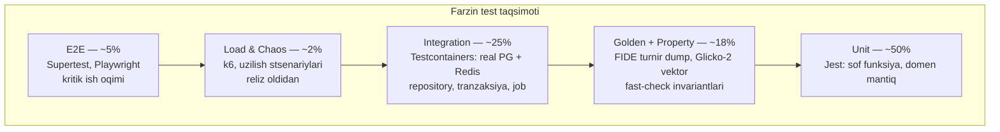

# 13 — Test strategiyasi (Testing Strategy)

> **Loyiha:** Farzin — O'zbekiston shaxmatining raqamli infratuzilmasi
> **Hujjat holati:** loyihalash bosqichi. Test turlari va vositalar qat'iy;
> **coverage foizlari va test bajarilish vaqti — maqsad, o'lchov bilan tuzatiladi.**

**Bog'liq hujjatlar:**
- [05-pairing-engine.md](./05-pairing-engine.md) — Swiss/FIDE Dutch algoritmi, golden test manbai
- [06-rating-system.md](./06-rating-system.md) — Glicko-2, rasmiy test vektori
- [11-infrastructure.md](./11-infrastructure.md) — CI pipeline, Testcontainers
- [15-observability.md](./15-observability.md) — yuklama testi metrikalari, SLO baseline
- [10-security.md](./10-security.md) — test ma'lumotini anonimlashtirish
- [14-roadmap.md](./14-roadmap.md) — qaysi test qaysi fazada

---

## 0. Test nima uchun yoziladi

Farzin'da test yozishning sababi odatdagidan boshqacha. Ko'p loyihada
test "regressiya bo'lmasin" uchun yoziladi. Farzin'da test — **to'g'rilik
isboti**, chunki:

1. **Pairing va rating xatosi jimgina.** Server 200 qaytaradi, sahifa
   ochiladi, hamma xursand — lekin turnir natijasi FIDE qoidalariga
   mos emas. Hech qanday runtime signal yo'q
   ([15-observability.md](./15-observability.md) 0-bo'lim).
2. **Xatoni orqaga qaytarib bo'lmaydi.** Turnir tugadi, mukofot berildi,
   reyting hisoblandi va boshqa turnirlarga tarqaldi. "Bug topdik,
   tuzatdik" bu yerda yetarli emas.
3. **Tashqi haqiqat bor.** FIDE C.04.3 va Glicko-2 — bizning
   fikrimiz emas, tashqi spetsifikatsiya. Demak **tekshirish mumkin**
   va shuning uchun tekshirish **shart**.

Shu sababdan Farzin'da test piramidasi standart shakldan farq qiladi
(1-bo'lim), va golden test (6-bo'lim) hamda property-based test
(5-bo'lim) — hashamat emas, majburiy element.

---

## 1. Test piramidasi — Farzin varianti

Klassik piramida: ko'p unit, ozroq integration, juda kam e2e.
Farzin'da nisbat boshqacha, chunki eng katta xavf sof funksiyalarda
ham, integratsiyada ham emas — **algoritm to'g'riligida**.



| Qatlam | Ulush | Nishon vaqt | Qachon ishlaydi |
|--------|-------|-------------|-----------------|
| Unit | ~50% | < 30 s | Har save (watch), har push |
| Golden + Property | ~18% | < 2 daqiqa | Har push |
| Integration | ~25% | < 5 daqiqa | Har push |
| E2E | ~5% | < 8 daqiqa | Har PR |
| Load / Chaos | ~2% | Daqiqalar-soatlar | Reliz oldidan, tunda |

**Vaqt raqamlari — maqsad, o'lchov emas.** Ular CI'da real o'lchanadi
va agar unit testlar 30 soniyadan oshsa, bu signal: test juda ko'p
narsani qamrab olyapti yoki mock'lar noto'g'ri.

**Nega integration ulushi standartdan (odatda 15%) yuqori:** Farzin'ning
ko'p mantiq'i ma'lumot izchilligiga tayanadi — tranzaksiya, advisory lock
([11-infrastructure.md](./11-infrastructure.md) 6.1), unique constraint,
`NUMERIC(14,2)` yaxlitlash. Bularni unit test **printsipial ravishda**
tekshira olmaydi (3-bo'lim).

**Nega golden/property alohida qatlam:** ular unit ham, integration ham
emas. Ular tashqi spetsifikatsiyaga muvofiqlikni tekshiradi. Ularni
"unit" deb atash ularning maqsadini yashiradi.

---

## 2. Unit test — Jest

### 2.1 Nima unit test qilinadi

Faqat **sof funksiya va domen mantiq'i** — I/O'siz.

| Modul | Nima | Nega unit |
|-------|------|-----------|
| `rating` | Glicko-2 formulalari (g, E, v, delta, sigma) | Sof matematika, DB kerak emas |
| `pairing` | Score group qurish, S1/S2 bo'linishi, rang balansi | Sof — kirish massiv, chiqish massiv |
| `pairing` | Juftlik og'irligi (weight) hisobi | Sof funksiya |
| `pairing` | Tie-break: Buchholz, Sonneborn-Berger | Sof |
| `play` | Legal move generation, FEN parse/serialize | Sof |
| `play` | Taymer hisobi: Fischer/Bronstein increment | Sof (vaqt in'ektsiya qilinadi) |
| `billing` | Tiyin ↔ so'm konversiyasi, komissiya hisobi | Sof |
| `fairplay` | Centipawn loss taqsimoti statistikasi | Sof |

### 2.2 Misol — Glicko-2 sof funksiyalari

```typescript
// src/rating/glicko2/glicko2.math.ts
/**
 * Glicko-2 asosiy funksiyalari. Barchasi SOF — hech qanday I/O yo'q.
 * Ichki shkala (mu, phi) bilan ishlaydi; konversiya alohida.
 */

export const GLICKO2_SCALE = 173.7178;
export const DEFAULT_RATING = 1500;
export const DEFAULT_RD = 350;
export const DEFAULT_VOLATILITY = 0.06;

export function toGlicko2Scale(rating: number, rd: number): { mu: number; phi: number } {
  return {
    mu: (rating - DEFAULT_RATING) / GLICKO2_SCALE,
    phi: rd / GLICKO2_SCALE,
  };
}

/** g(phi) — raqibning RD'siga qarab ta'sir koeffitsienti */
export function g(phi: number): number {
  return 1 / Math.sqrt(1 + (3 * phi ** 2) / Math.PI ** 2);
}

/** E(mu, mu_j, phi_j) — kutilgan natija */
export function expectedScore(mu: number, muJ: number, phiJ: number): number {
  return 1 / (1 + Math.exp(-g(phiJ) * (mu - muJ)));
}
```

```typescript
// src/rating/glicko2/glicko2.math.spec.ts
describe('Glicko-2 sof funksiyalari', () => {
  describe('g(phi)', () => {
    it('phi = 0 da 1 qaytaradi (RD nol — to\'liq ishonch)', () => {
      expect(g(0)).toBeCloseTo(1, 10);
    });

    it('phi o\'sganda monoton kamayadi', () => {
      // Bu invariant — RD katta bo'lsa, natija kamroq ta'sir qiladi
      const values = [0, 0.5, 1, 2, 3].map(g);
      for (let i = 1; i < values.length; i++) {
        expect(values[i]).toBeLessThan(values[i - 1]);
      }
    });

    it('har doim (0, 1] oralig\'ida', () => {
      for (const phi of [0, 0.1, 1, 2, 5, 10]) {
        expect(g(phi)).toBeGreaterThan(0);
        expect(g(phi)).toBeLessThanOrEqual(1);
      }
    });
  });

  describe('expectedScore', () => {
    it('teng reyting va nol RD da 0.5', () => {
      expect(expectedScore(0, 0, 0)).toBeCloseTo(0.5, 10);
    });

    it('kuchliroq o\'yinchi uchun > 0.5', () => {
      expect(expectedScore(1, 0, 0.5)).toBeGreaterThan(0.5);
    });

    it('E(a,b) + E(b,a) = 1 bir xil phi da (simmetriya)', () => {
      const phi = 0.5;
      expect(expectedScore(1, 0, phi) + expectedScore(0, 1, phi)).toBeCloseTo(1, 10);
    });
  });
});
```

Bu yerdagi testlar **xatti-harakat** testi, "kod nima qilsa shuni
yozdim" testi emas. Har biri Glicko-2 ta'rifidan kelib chiqadigan
matematik haqiqatni tekshiradi.

### 2.3 Vaqtga bog'liq mantiq — taymer

Taymer testi eng ko'p noto'g'ri yoziladigan joy. `Date.now()` ni
to'g'ridan-to'g'ri chaqirish testni **flaky** qiladi (11.2-bo'lim).

```typescript
// src/play/clock/clock.calculator.ts
export interface Clock {
  readonly whiteMs: number;
  readonly blackMs: number;
  readonly incrementMs: number;
  readonly mode: 'fischer' | 'bronstein';
  readonly turn: 'w' | 'b';
  readonly lastMoveAtMs: number;
}

/**
 * Yurish qabul qilinganda soatni hisoblaydi. SOF funksiya —
 * joriy vaqt PARAMETR sifatida keladi, Date.now() chaqirilmaydi.
 * Sabab: test deterministik bo'lsin, va server-authoritative
 * taymerda vaqt manbai bitta joyda nazorat qilinsin (CANON 7.3).
 */
export function applyMove(clock: Clock, nowMs: number): Clock {
  const elapsed = nowMs - clock.lastMoveAtMs;
  const isWhite = clock.turn === 'w';
  const remaining = isWhite ? clock.whiteMs : clock.blackMs;

  const afterSpend = remaining - elapsed;
  if (afterSpend <= 0) {
    return { ...clock, [isWhite ? 'whiteMs' : 'blackMs']: 0, lastMoveAtMs: nowMs };
  }

  // Fischer: increment to'liq qo'shiladi.
  // Bronstein: faqat sarflangan vaqtgacha qaytariladi.
  const bonus =
    clock.mode === 'fischer'
      ? clock.incrementMs
      : Math.min(elapsed, clock.incrementMs);

  return {
    ...clock,
    [isWhite ? 'whiteMs' : 'blackMs']: afterSpend + bonus,
    turn: isWhite ? 'b' : 'w',
    lastMoveAtMs: nowMs,
  };
}
```

```typescript
// src/play/clock/clock.calculator.spec.ts
describe('applyMove', () => {
  const base: Clock = {
    whiteMs: 180_000, blackMs: 180_000, incrementMs: 2_000,
    mode: 'fischer', turn: 'w', lastMoveAtMs: 1_000_000,
  };

  it('Fischer: tez yurishda increment to\'liq qo\'shiladi', () => {
    // 500 ms sarfladi, 2000 ms increment oldi → +1500 ms
    const r = applyMove(base, 1_000_500);
    expect(r.whiteMs).toBe(181_500);
    expect(r.turn).toBe('b');
  });

  it('Bronstein: sarflangandan ortiq qaytarilmaydi', () => {
    const bronstein = { ...base, mode: 'bronstein' as const };
    // 500 ms sarfladi → faqat 500 ms qaytadi, vaqt o'zgarmaydi
    const r = applyMove(bronstein, 1_000_500);
    expect(r.whiteMs).toBe(180_000);
  });

  it('Bronstein: increment'dan ko'p sarflansa, farq yo\'qoladi', () => {
    const bronstein = { ...base, mode: 'bronstein' as const };
    // 5000 ms sarfladi, max 2000 qaytadi → -3000
    const r = applyMove(bronstein, 1_005_000);
    expect(r.whiteMs).toBe(177_000);
  });

  it('vaqt tugasa 0 da to\'xtaydi, manfiy bo\'lmaydi', () => {
    const r = applyMove(base, 1_000_000 + 200_000);
    expect(r.whiteMs).toBe(0);
  });
});
```

### 2.4 Mock siyosati

**Mock qilinadi:** tashqi tarmoq chegarasi (Click, Payme, Eskiz, FCM).

**Mock QILINMAYDI:** PostgreSQL, Redis, o'z modullaringiz.

Ikkinchi qism muhim. Agar `PairingService`ni test qilish uchun
`TournamentService`ni mock qilish kerak bo'lsa — bu dizayn muammosi
signali, test muammosi emas. Sof mantiq I/O'dan ajratilgan bo'lsa,
mock kerak bo'lmaydi:

```typescript
// YOMON — service'ni mock qilib, mock'ni test qilyapmiz
const mockTournamentService = { getStandings: jest.fn().mockReturnValue([...]) };
const service = new PairingService(mockTournamentService);
// Bu test PairingService'ni emas, jest.fn() ni tekshiradi.

// YAXSHI — sof funksiya, mock kerak emas
const pairings = pairSwissRound(standings, history, { round: 3 });
// Kirish — oddiy ma'lumot. Chiqish — oddiy ma'lumot. Test haqiqiy.
```

---

## 3. Integration test — Testcontainers

### 3.1 Nega mock DB yomon

Bu bo'lim ataylab batafsil, chunki "DB'ni mock qilamiz, tez bo'ladi"
— eng qimmat qisqa yo'llardan biri.

`jest-mock-extended` bilan `PrismaClient`ni mock qilish, yoki
`prisma-mock` ishlatish quyidagilarni **tekshira olmaydi**:

**1. SQL to'g'riligi.** Mock `findMany`ni chaqirganingizni tasdiqlaydi.
Prisma o'sha chaqiruvni to'g'ri SQL'ga aylantiradimi — bilmaydi.
Noto'g'ri `where` yoki noto'g'ri `include` mock'da o'tadi, production'da
buziladi.

**2. Constraint'lar.** Farzin'ning ma'lumot butunligining katta qismi
DB darajasida:

```prisma
model Pairing {
  id           String   @id @default(dbgenerated("uuidv7()")) @db.Uuid
  roundId      String   @map("round_id") @db.Uuid
  whitePlayerId String  @map("white_player_id") @db.Uuid
  blackPlayerId String? @map("black_player_id") @db.Uuid   // null = bye
  boardNumber  Int      @map("board_number")

  // Bir raundda bitta taxta ikki marta ishlatilmasin.
  // Bu — DB kafolati. Mock buni BILMAYDI va sinamaydi.
  @@unique([roundId, boardNumber])
  @@map("pairings")
}
```

Mock ikkita bir xil `boardNumber` qo'shishga ruxsat beradi. PostgreSQL
bermaydi. Test yashil, production qizil.

**3. Tranzaksiya semantikasi.** Farzin'da tranzaksiya kritik:
natija + audit log bitta tranzaksiyada
([15-observability.md](./15-observability.md) 8-bo'lim), pairing
advisory lock ostida ([11-infrastructure.md](./11-infrastructure.md) 6.1).
Mock'da rollback yo'q, isolation level yo'q, deadlock yo'q.

**4. Tip xatoliklari.** `NUMERIC(14,2)` PostgreSQL'dan Prisma orqali
`Decimal` bo'lib keladi, `number` emas. Mock `number` qaytaradi va
test o'tadi. Production'da `.toFixed()` chaqiruvi crash bo'ladi
yoki jimgina yaxlitlash xatosi beradi — pulda.

**5. Bir vaqtdalik (concurrency).** Ikki hakam bir vaqtda bir natijani
kiritsa nima bo'ladi? Mock'da hech narsa — u ketma-ket ishlaydi.
Real DB'da bu serialization xatosi yoki lost update.

Xulosa: **DB mock'i DB haqidagi taxminlaringizni tekshiradi, DB'ni emas.**
Va aynan o'sha taxminlar noto'g'ri bo'ladi.

### 3.2 Testcontainers setup

```typescript
// test/setup/containers.ts
import { PostgreSqlContainer, StartedPostgreSqlContainer } from '@testcontainers/postgresql';
import { RedisContainer, StartedRedisContainer } from '@testcontainers/redis';
import { execSync } from 'node:child_process';

export interface TestInfra {
  postgres: StartedPostgreSqlContainer;
  redis: StartedRedisContainer;
  databaseUrl: string;
  redisUrl: string;
}

/**
 * Konteynerlar butun test to'plami uchun BIR MARTA ko'tariladi
 * (globalSetup). Har test faylida ko'tarish sekin — 2-3 s × 40 fayl.
 * Izolyatsiya konteyner bilan emas, tranzaksiya bilan (3.3-bo'lim).
 */
export async function startInfra(): Promise<TestInfra> {
  const [postgres, redis] = await Promise.all([
    // Versiya PRODUCTION bilan bir xil — CANON 4: PostgreSQL 17.
    // Boshqa versiyada test qilish = boshqa DB'ni test qilish.
    new PostgreSqlContainer('postgres:17-alpine')
      .withDatabase('farzin_test')
      .withUsername('farzin')
      .withPassword('test')
      // Testda dur ablik kerak emas — tezlik kerak
      .withCommand(['postgres', '-c', 'fsync=off', '-c', 'full_page_writes=off'])
      .start(),
    new RedisContainer('redis:7-alpine').start(),
  ]);

  const databaseUrl = postgres.getConnectionUri();

  // Migratsiyalarni REAL holda qo'llaymiz — `db push` emas.
  // Sabab: migration fayllarining o'zi ham test qilinishi kerak
  // (11-infrastructure.md 6.4). `db push` migratsiyani chetlab o'tadi
  // va buzuq migration jimgina o'tib ketadi.
  execSync('npx prisma migrate deploy', {
    env: { ...process.env, DATABASE_URL: databaseUrl },
    stdio: 'inherit',
  });

  return {
    postgres,
    redis,
    databaseUrl,
    redisUrl: `redis://${redis.getHost()}:${redis.getMappedPort(6379)}`,
  };
}
```

```typescript
// test/setup/global-setup.ts
import { startInfra } from './containers';

module.exports = async function globalSetup(): Promise<void> {
  const infra = await startInfra();
  process.env.DATABASE_URL = infra.databaseUrl;
  process.env.REDIS_URL = infra.redisUrl;
  // Teardown uchun saqlab qo'yamiz
  (globalThis as any).__INFRA__ = infra;
};
```

### 3.3 Test izolyatsiyasi — tranzaksiya rollback

Har test toza DB kutadi. Uch variant bor va tanlov muhim:

| Usul | Tezlik | Ishonchlilik | Qaror |
|------|--------|--------------|-------|
| Har test uchun yangi konteyner | Juda sekin | Mukammal | Yo'q |
| `TRUNCATE` har testdan keyin | O'rta | Yaxshi | Zaxira variant |
| Tranzaksiya + rollback | Tez | Yaxshi, bir shart bilan | **Tanlandi** |

```typescript
// test/setup/db.ts
import { PrismaClient } from '@prisma/client';

/**
 * Har test o'z tranzaksiyasida ishlaydi va oxirida rollback bo'ladi.
 * Bu tez va toza.
 *
 * MUHIM CHEKLOV: agar test qilinayotgan kod O'ZI $transaction ishlatsa
 * (masalan arbiter.overrideResult), u ichma-ich tranzaksiya bo'ladi.
 * Prisma buni savepoint bilan eplaydi, lekin isolation level va
 * advisory lock xatti-harakati boshqacha bo'ladi. Shuning uchun
 * TRANZAKSIYA SEMANTIKASINI test qiladigan testlar rollback usulini
 * ISHLATMAYDI — ular alohida schema'da ishlaydi (3.4-bo'lim).
 */
export function withRollback(
  fn: (tx: PrismaClient) => Promise<void>,
): () => Promise<void> {
  return async () => {
    const prisma = new PrismaClient();
    const rollbackSignal = Symbol('rollback');
    try {
      await prisma.$transaction(async (tx) => {
        await fn(tx as unknown as PrismaClient);
        throw rollbackSignal;   // ataylab — tranzaksiya bekor bo'lsin
      });
    } catch (err) {
      if (err !== rollbackSignal) throw err;
    } finally {
      await prisma.$disconnect();
    }
  };
}
```

### 3.4 Nima integration test qilinadi

```typescript
// src/pairing/pairing.repository.int-spec.ts
describe('Pairing repository (real PostgreSQL)', () => {
  let prisma: PrismaClient;

  beforeAll(() => {
    prisma = new PrismaClient();
  });
  afterAll(async () => {
    await prisma.$disconnect();
  });

  it('bir raundda takroriy board_number rad etiladi', async () => {
    const { round, p1, p2, p3, p4 } = await seedRound(prisma);

    await prisma.pairing.create({
      data: { roundId: round.id, whitePlayerId: p1.id, blackPlayerId: p2.id, boardNumber: 1 },
    });

    // DB constraint ishlashini tekshiramiz — bu mock'da IMKONSIZ
    await expect(
      prisma.pairing.create({
        data: { roundId: round.id, whitePlayerId: p3.id, blackPlayerId: p4.id, boardNumber: 1 },
      }),
    ).rejects.toMatchObject({ code: 'P2002' });   // unique violation
  });

  it('advisory lock parallel juftlashtirishni to\'sadi', async () => {
    const { round } = await seedRound(prisma);
    const order: string[] = [];

    // Ikki parallel pairing job — faqat biri kirsin
    const a = withRoundLock(prisma, round.id, async () => {
      order.push('a-start');
      await sleep(200);
      order.push('a-end');
    });
    const b = withRoundLock(prisma, round.id, async () => {
      order.push('b-start');
      order.push('b-end');
    });

    await Promise.all([a, b]);

    // Ketma-ketlik: biri to'liq tugagach ikkinchisi boshlanadi
    expect(order).toEqual(
      expect.arrayContaining(['a-start', 'a-end', 'b-start', 'b-end']),
    );
    expect(order.indexOf('a-end')).toBeLessThan(order.indexOf('b-start'));
  });
});
```

```typescript
// src/billing/ledger.int-spec.ts
describe('Ledger (real PostgreSQL)', () => {
  it('NUMERIC(14,2) yaxlitlash xatosi bermaydi', async () => {
    // Bu test FLOAT ishlatilsa YIQILADI — aynan shuning uchun kerak.
    // CANON 6: pul — NUMERIC(14,2), FLOAT EMAS.
    const invoice = await prisma.invoice.create({
      data: { amount: new Decimal('0.10'), currency: 'UZS', /* ... */ },
    });
    for (let i = 0; i < 10; i++) {
      await prisma.payment.create({
        data: { invoiceId: invoice.id, amount: new Decimal('0.01'), currency: 'UZS' },
      });
    }
    const sum = await prisma.payment.aggregate({
      where: { invoiceId: invoice.id },
      _sum: { amount: true },
    });
    // FLOAT'da bu 0.09999999999999999 bo'lardi
    expect(sum._sum.amount!.equals(new Decimal('0.10'))).toBe(true);
  });
});
```

Boshqa integration test mavzulari:
- BullMQ job real Redis bilan: enqueue → process → retry → DLQ
- Socket.IO Redis adapter: ikki server instansiyasi, xabar o'tishimi
- Prisma migration'lar ketma-ket qo'llanishi (bo'sh DB'dan boshlab)
- Auth: token rotatsiya, refresh reuse detection (real Redis sessiya bilan)

---

## 4. E2E test

### 4.1 Supertest (API)

E2E kam bo'ladi, lekin **kritik ish oqimlarini** to'liq qamrab oladi:

```typescript
// test/e2e/tournament-lifecycle.e2e-spec.ts
describe('Turnir hayot sikli (e2e)', () => {
  let app: INestApplication;
  let arbiterToken: string;

  beforeAll(async () => {
    const moduleRef = await Test.createTestingModule({
      imports: [AppModule],
    })
      // Faqat TASHQI chegara mock qilinadi — 2.4-bo'lim
      .overrideProvider(SmsProvider).useClass(FakeSmsProvider)
      .overrideProvider(PaymentProvider).useClass(FakePaymentProvider)
      .compile();

    app = moduleRef.createNestApplication();
    app.useGlobalPipes(new ValidationPipe({ whitelist: true, transform: true }));
    await app.init();
    arbiterToken = await loginAs(app, 'arbiter');
  });

  afterAll(async () => {
    await app.close();
  });

  it('to\'liq sikl: turnir → ro\'yxat → juftlik → natija → tie-break', async () => {
    // 1. Turnir yaratish
    const { body: tournament } = await request(app.getHttpServer())
      .post('/tournaments')
      .set('Authorization', `Bearer ${arbiterToken}`)
      .send({
        name: 'Test Open 2026',
        system: 'SWISS_DUTCH',
        rounds: 5,
        timeControl: { base: 5400, increment: 30 },
      })
      .expect(201);

    // 2. 16 o'yinchi ro'yxatdan o'tkazish
    const players = await seedPlayers(16);
    for (const p of players) {
      await request(app.getHttpServer())
        .post(`/tournaments/${tournament.id}/registrations`)
        .set('Authorization', `Bearer ${arbiterToken}`)
        .send({ playerId: p.id })
        .expect(201);
    }

    // 3. 1-raundni juftlashtirish
    const { body: round1 } = await request(app.getHttpServer())
      .post(`/tournaments/${tournament.id}/rounds/1/pair`)
      .set('Authorization', `Bearer ${arbiterToken}`)
      .expect(201);

    expect(round1.pairings).toHaveLength(8);
    // Har o'yinchi aynan bir marta
    const ids = round1.pairings.flatMap(
      (p: any) => [p.whitePlayerId, p.blackPlayerId],
    );
    expect(new Set(ids).size).toBe(16);

    // 4. Natijalarni kiritish
    for (const p of round1.pairings) {
      await request(app.getHttpServer())
        .post(`/pairings/${p.id}/result`)
        .set('Authorization', `Bearer ${arbiterToken}`)
        .send({ result: 'WHITE_WIN' })
        .expect(200);
    }

    // 5. Jadval to'g'ri hisoblanganini tekshirish
    const { body: standings } = await request(app.getHttpServer())
      .get(`/tournaments/${tournament.id}/standings`)
      .expect(200);

    expect(standings.filter((s: any) => s.points === 1)).toHaveLength(8);
    expect(standings[0]).toHaveProperty('buchholz');
  });

  it('ruxsatsiz foydalanuvchi natija kirita olmaydi', async () => {
    const playerToken = await loginAs(app, 'player');
    await request(app.getHttpServer())
      .post(`/pairings/${somePairingId}/result`)
      .set('Authorization', `Bearer ${playerToken}`)
      .send({ result: 'WHITE_WIN' })
      .expect(403);
  });
});
```

### 4.2 Playwright (frontend) — keyingi bosqich

Frontend kodi bu TZ doirasida yozilmaydi ([CANON 8]), shuning uchun
Playwright testlari ham hozircha **yozilmaydi**. Lekin qamrov oldindan
belgilanadi, chunki u frontend spetsifikatsiyasiga ta'sir qiladi
(har element uchun barqaror `data-testid` kerak):

- Ro'yxatdan o'tish → turnirga yozilish → to'lov (sandbox)
- Hakam paneli: juftlik ko'rish, natija kiritish, bye berish
- Jonli o'yin: taxta, yurish, taymer, reconnect
- Jonli tablo: real-time yangilanish

Playwright Faza 5-6 atrofida qo'shiladi ([14-roadmap.md](./14-roadmap.md)).

---

## 5. Property-based testing — fast-check

### 5.1 Nega kerak

Misolga asoslangan test (example-based) siz **o'ylagan** holatlarni
tekshiradi. Property test siz o'ylamagan holatlarni topadi.

Farzin'da bu kritik, chunki eng xavfli buglar chekka holatlarda:
17 o'yinchili toq score group, hamma bir xil ochkoda, o'yinchi
oldingi 6 raundda hamma bilan o'ynagan. Bu holatlarni qo'lda
o'ylab topish qiyin — fast-check ularni **o'zi topadi va
minimallashtiradi** (shrinking).

### 5.2 Pairing invariantlari — eng kritik

```typescript
// src/pairing/swiss/dutch.property-spec.ts
import fc from 'fast-check';

/** Turnir holatini generatsiya qiladigan arbitrary */
const tournamentStateArb = fc
  .record({
    playerCount: fc.integer({ min: 2, max: 200 }),
    roundNumber: fc.integer({ min: 1, max: 11 }),
    seed: fc.integer(),
  })
  .map(({ playerCount, roundNumber, seed }) =>
    generateTournamentState(playerCount, roundNumber, seed),
  );

describe('Swiss Dutch — invariantlar', () => {
  it('INVARIANT: hech kim o\'zi bilan juftlashmaydi', () => {
    fc.assert(
      fc.property(tournamentStateArb, (state) => {
        const pairings = pairSwissRound(state.standings, state.history, {
          round: state.round,
        });
        for (const p of pairings) {
          if (p.blackPlayerId !== null) {
            expect(p.whitePlayerId).not.toBe(p.blackPlayerId);
          }
        }
      }),
      { numRuns: 500 },
    );
  });

  it('INVARIANT: har o\'yinchi aynan bir marta (juftlik yoki bye)', () => {
    fc.assert(
      fc.property(tournamentStateArb, (state) => {
        const pairings = pairSwissRound(state.standings, state.history, {
          round: state.round,
        });
        const seen = new Map<string, number>();
        for (const p of pairings) {
          seen.set(p.whitePlayerId, (seen.get(p.whitePlayerId) ?? 0) + 1);
          if (p.blackPlayerId) {
            seen.set(p.blackPlayerId, (seen.get(p.blackPlayerId) ?? 0) + 1);
          }
        }
        for (const player of state.standings) {
          expect(seen.get(player.id) ?? 0).toBe(1);
        }
      }),
      { numRuns: 500 },
    );
  });

  /**
   * FIDE C.04.3 C.1 — ENG MUHIM INVARIANT.
   * Ikki o'yinchi bir turnirda ikki marta uchrashmasligi SHART.
   * Bu buzilsa turnir haqiqiy emas
   * (15-observability.md 3.3 — farzin_pairing_criteria_violations_total).
   */
  it('INVARIANT (C.1): takroriy juftlik hech qachon bo\'lmaydi', () => {
    fc.assert(
      fc.property(tournamentStateArb, (state) => {
        const pairings = pairSwissRound(state.standings, state.history, {
          round: state.round,
        });
        for (const p of pairings) {
          if (!p.blackPlayerId) continue;
          const met = state.history.haveMet(p.whitePlayerId, p.blackPlayerId);
          expect(met).toBe(false);
        }
      }),
      { numRuns: 1000 },   // eng ko'p run — eng muhim invariant
    );
  });

  it('INVARIANT (C.2): rang farqi [-2, +2] oralig\'idan chiqmaydi', () => {
    fc.assert(
      fc.property(tournamentStateArb, (state) => {
        const pairings = pairSwissRound(state.standings, state.history, {
          round: state.round,
        });
        for (const p of pairings) {
          if (!p.blackPlayerId) continue;
          const w = state.history.colorDifference(p.whitePlayerId) + 1;
          const b = state.history.colorDifference(p.blackPlayerId) - 1;
          expect(Math.abs(w)).toBeLessThanOrEqual(2);
          expect(Math.abs(b)).toBeLessThanOrEqual(2);
        }
      }),
      { numRuns: 500 },
    );
  });

  it('INVARIANT: toq sonda aynan bitta bye', () => {
    fc.assert(
      fc.property(tournamentStateArb, (state) => {
        const pairings = pairSwissRound(state.standings, state.history, {
          round: state.round,
        });
        const byes = pairings.filter((p) => p.blackPlayerId === null);
        expect(byes).toHaveLength(state.standings.length % 2);
      }),
      { numRuns: 300 },
    );
  });

  it('INVARIANT: determinizm — bir xil kirish, bir xil chiqish', () => {
    fc.assert(
      fc.property(tournamentStateArb, (state) => {
        const a = pairSwissRound(state.standings, state.history, { round: state.round });
        const b = pairSwissRound(state.standings, state.history, { round: state.round });
        expect(a).toEqual(b);
      }),
      { numRuns: 200 },
    );
  });
});
```

Oxirgi invariant (determinizm) alohida muhim: hakam juftlikni qayta
generatsiya qilsa, boshqa natija chiqmasligi kerak. Aks holda
"kim qachon tugmani bosdi" turnir natijasiga ta'sir qiladi — bu
qabul qilib bo'lmaydi.

### 5.3 Rating invariantlari

```typescript
// src/rating/glicko2/glicko2.property-spec.ts
const playerArb = fc.record({
  rating: fc.double({ min: 100, max: 3500, noNaN: true }),
  rd: fc.double({ min: 1, max: 350, noNaN: true }),
  volatility: fc.double({ min: 0.001, max: 0.1, noNaN: true }),
});

const matchArb = fc.record({
  opponent: playerArb,
  score: fc.constantFrom(0, 0.5, 1),
});

describe('Glicko-2 — invariantlar', () => {
  it('INVARIANT: RD hech qachon manfiy emas', () => {
    fc.assert(
      fc.property(playerArb, fc.array(matchArb, { minLength: 0, maxLength: 20 }),
        (player, matches) => {
          const r = updateRating(player, matches);
          expect(r.rd).toBeGreaterThan(0);
          expect(Number.isFinite(r.rd)).toBe(true);
        }),
      { numRuns: 1000 },
    );
  });

  it('INVARIANT: RD yuqori chegaradan oshmaydi', () => {
    fc.assert(
      fc.property(playerArb, fc.array(matchArb, { maxLength: 20 }), (p, m) => {
        expect(updateRating(p, m).rd).toBeLessThanOrEqual(DEFAULT_RD);
      }),
      { numRuns: 500 },
    );
  });

  it('INVARIANT: o\'yin o\'ynagan o\'yinchining RD\'si kamayadi', () => {
    fc.assert(
      fc.property(playerArb, fc.array(matchArb, { minLength: 1, maxLength: 20 }),
        (player, matches) => {
          // Ko'proq ma'lumot = ko'proq ishonch = kichikroq RD
          expect(updateRating(player, matches).rd).toBeLessThan(player.rd);
        }),
      { numRuns: 500 },
    );
  });

  it('INVARIANT: o\'ynamagan o\'yinchining RD\'si oshadi (ishonch pasayadi)', () => {
    fc.assert(
      fc.property(playerArb, (player) => {
        const r = updateRating(player, []);
        expect(r.rd).toBeGreaterThanOrEqual(player.rd);
        expect(r.rating).toBe(player.rating);   // reyting o'zgarmaydi
      }),
      { numRuns: 300 },
    );
  });

  it('INVARIANT: natija NaN yoki Infinity bo\'lmaydi', () => {
    fc.assert(
      fc.property(playerArb, fc.array(matchArb, { maxLength: 30 }), (p, m) => {
        const r = updateRating(p, m);
        expect(Number.isFinite(r.rating)).toBe(true);
        expect(Number.isFinite(r.rd)).toBe(true);
        expect(Number.isFinite(r.volatility)).toBe(true);
      }),
      { numRuns: 1000 },
    );
  });

  it('INVARIANT: volatility musbat va oqilona chegarada', () => {
    fc.assert(
      fc.property(playerArb, fc.array(matchArb, { maxLength: 20 }), (p, m) => {
        const r = updateRating(p, m);
        expect(r.volatility).toBeGreaterThan(0);
        expect(r.volatility).toBeLessThan(1);   // 1 dan katta = matematik nonsens
      }),
      { numRuns: 500 },
    );
  });

  it('INVARIANT: monotonlik — g\'alaba hech qachon reytingni tushirmaydi', () => {
    fc.assert(
      fc.property(playerArb, playerArb, (player, opponent) => {
        const win = updateRating(player, [{ opponent, score: 1 }]);
        const loss = updateRating(player, [{ opponent, score: 0 }]);
        expect(win.rating).toBeGreaterThan(loss.rating);
      }),
      { numRuns: 500 },
    );
  });
});
```

### 5.4 Pul invariantlari

```typescript
// src/billing/money.property-spec.ts
describe('Pul — invariantlar', () => {
  // CANON 6: ichki hisob-kitob tiyinda (BIGINT)
  const tiyinArb = fc.bigInt({ min: 0n, max: 10_000_000_000n });

  it('INVARIANT: bo\'lish/qo\'shishda tiyin yo\'qolmaydi', () => {
    fc.assert(
      fc.property(tiyinArb, fc.integer({ min: 2, max: 50 }), (total, parts) => {
        // Summani N qismga bo'lamiz (masalan turnir mukofot fondi)
        const shares = splitEvenly(total, parts);
        expect(shares).toHaveLength(parts);
        // ENG MUHIM: yig'indi asl summaga TENG bo'lishi shart.
        // Yaxlitlash qoldig'i yo'qolmasin yoki yaratilmasin
        // (15-observability.md — farzin_ledger_imbalance_tiyin).
        expect(shares.reduce((a, b) => a + b, 0n)).toBe(total);
      }),
      { numRuns: 1000 },
    );
  });

  it('INVARIANT: komissiya + qolgan = asl summa', () => {
    fc.assert(
      fc.property(tiyinArb, fc.integer({ min: 0, max: 10000 }), (amount, bps) => {
        const fee = calculateFee(amount, bps);       // bps = basis points
        const net = amount - fee;
        expect(fee + net).toBe(amount);
        expect(fee).toBeGreaterThanOrEqual(0n);
        expect(net).toBeGreaterThanOrEqual(0n);
      }),
      { numRuns: 1000 },
    );
  });

  it('INVARIANT: tiyin ↔ so\'m konversiyasi teskarilanadi', () => {
    fc.assert(
      fc.property(tiyinArb, (tiyin) => {
        expect(sumToTiyin(tiyinToSum(tiyin))).toBe(tiyin);
      }),
      { numRuns: 1000 },
    );
  });
});
```

### 5.5 Boshqa joylar

- **Move validatsiya:** legal move generatsiyasi → har yurish qo'llansa,
  natijaviy pozitsiya legal FEN bo'lishi kerak
- **FEN parse/serialize:** `parse(serialize(pos)) === pos` (round-trip)
- **Taymer:** applyMove hech qachon manfiy vaqt bermaydi
- **PGN:** `parsePgn(writePgn(game))` asl o'yinni beradi

---

## 6. Golden test

Property test invariantni tekshiradi ("hech qachon takroriy juftlik").
Golden test **aniq to'g'ri javobni** tekshiradi ("aynan shu 8 juftlik").

Ikkalasi ham kerak: invariantni qanoatlantiradigan, lekin FIDE
qoidalariga mos kelmaydigan juftlik mumkin.

### 6.1 Pairing — real turnir ma'lumotlari

Manba: Swiss-Manager yoki Chess-Results'dan olingan **haqiqiy o'tkazilgan
turnirlar**. Batafsil — [05-pairing-engine.md](./05-pairing-engine.md).

```
test/golden/pairing/
├── uzb-championship-2024/
│   ├── meta.json           # turnir konfiguratsiyasi, manba, litsenziya
│   ├── players.json        # ishtirokchilar (ANONIMLASHTIRILGAN — 9-bo'lim)
│   ├── round-01.expected.json
│   ├── ...
│   └── round-09.expected.json
├── tashkent-open-2023/
├── fide-c0403-examples/    # spetsifikatsiyadagi rasmiy misollar
└── edge-cases/
    ├── odd-players-17/
    ├── all-same-score/
    ├── heavy-float/
    └── late-entry-round-3/
```

```typescript
// src/pairing/swiss/dutch.golden-spec.ts
import { readdirSync, readFileSync } from 'node:fs';
import { join } from 'node:path';

const GOLDEN_DIR = join(__dirname, '../../../test/golden/pairing');

describe('Swiss Dutch — golden testlar', () => {
  const suites = readdirSync(GOLDEN_DIR, { withFileTypes: true })
    .filter((d) => d.isDirectory())
    .map((d) => d.name);

  describe.each(suites)('%s', (suiteName) => {
    const suiteDir = join(GOLDEN_DIR, suiteName);
    const meta: GoldenMeta = JSON.parse(
      readFileSync(join(suiteDir, 'meta.json'), 'utf8'),
    );

    const rounds = readdirSync(suiteDir)
      .filter((f) => f.endsWith('.expected.json'))
      .sort();

    it.each(rounds)('%s — juftliklar mos keladi', (roundFile) => {
      const expected: ExpectedRound = JSON.parse(
        readFileSync(join(suiteDir, roundFile), 'utf8'),
      );

      // Berilgan raundgacha bo'lgan holatni qayta quramiz
      const state = replayTournament(suiteDir, expected.roundNumber - 1);

      const actual = pairSwissRound(state.standings, state.history, {
        round: expected.roundNumber,
        rules: meta.rules,      // FIDE C.04.3 varianti
      });

      // Taqqoslash NORMALLASHTIRILGAN shaklda: taxta tartibi
      // implementatsiya detali bo'lishi mumkin, juftliklar to'plami — yo'q.
      expect(normalizePairings(actual)).toEqual(normalizePairings(expected.pairings));
    });
  });
});
```

**Golden test'ning halol cheklovi:** referens ma'lumot Swiss-Manager'dan
olinadi, va Swiss-Manager ham dastur — u ham xato qilishi mumkin. Bundan
tashqari, FIDE C.04.3'da ba'zi holatlar uchun **bir nechta to'g'ri javob**
bo'lishi mumkin (transposition tartibi). Shuning uchun:

- Farq topilganda avtomatik "bizniki noto'g'ri" degan xulosa chiqarilmaydi
- Har farq qo'lda tekshiriladi va `meta.json`da izohlanadi
- Agar farq qonuniy bo'lsa (ikkala javob ham to'g'ri), test
  `acceptableAlternatives` ro'yxati bilan yumshatiladi

Bu — golden test'ni yolg'on ishonchdan saqlaydigan intizom.

### 6.2 Glicko-2 — rasmiy test vektori

Glicko-2 muallifi Mark Glickman rasmiy misol e'lon qilgan (bitta o'yinchi,
uch raqib). U **birinchi va majburiy** test. Batafsil —
[06-rating-system.md](./06-rating-system.md).

```typescript
// src/rating/glicko2/glicko2.golden-spec.ts
describe('Glicko-2 — rasmiy test vektori (Glickman)', () => {
  /**
   * Manba: Glickman, "Example of the Glicko-2 system".
   * Aniq kutilgan qiymatlar 06-rating-system.md da keltirilgan va
   * hujjatda manbaga havola bor.
   *
   * BU TEST HECH QACHON O'ZGARTIRILMAYDI. Agar u yiqilsa — bizning
   * implementatsiyamiz noto'g'ri, spetsifikatsiya emas.
   */
  const vector = loadOfficialVector('glickman-example-1');

  it('bitta rating period natijasi rasmiy qiymatga mos', () => {
    const result = updateRating(vector.player, vector.matches, {
      tau: vector.tau,
    });

    // Tolerantlik 1e-4 — Glickman misolida 4 xona keltirilgan.
    // Undan qattiqroq talab qilish yolg'on aniqlik bo'lardi.
    expect(result.rating).toBeCloseTo(vector.expected.rating, 4);
    expect(result.rd).toBeCloseTo(vector.expected.rd, 4);
    expect(result.volatility).toBeCloseTo(vector.expected.volatility, 6);
  });

  it('sigma iteratsiyasi kutilgan qadamda konvergensiya qiladi', () => {
    const trace = updateRatingWithTrace(vector.player, vector.matches, {
      tau: vector.tau,
    });
    expect(trace.converged).toBe(true);
    // Illinois algoritmi odatda < 20 iteratsiya
    // (15-observability.md — farzin_glicko_convergence_failures_total)
    expect(trace.iterations).toBeLessThan(20);
  });
});

describe('Glicko-2 — regression golden', () => {
  /**
   * Real turnirdan olingan snapshot. Maqsad — rasmiy vektor
   * qamramaydigan holatlar: ko'p o'yinchi, ko'p period, RD chegaralari.
   * Bu snapshot QO'LDA tekshirilgandan keyin qotirilgan.
   */
  it('50 o\'yinchi, 3 rating period — snapshot mos', () => {
    const input = loadFixture('rating/uzb-open-2024-3-periods.json');
    const result = runRatingPeriods(input.players, input.periods);
    expect(result).toMatchSnapshot();
  });
});
```

`toMatchSnapshot()` faqat ikkinchi holatda ishlatiladi va **ehtiyot bilan**:
snapshot'ni `-u` bilan yangilash oson va bu golden test'ni ma'nosiz qiladi.
Qoida: **snapshot yangilanishi PR'da alohida commit va alohida izoh bilan**
bo'lishi kerak — "nega o'zgardi" savoliga javob bilan.

---

## 7. Load test — k6

### 7.1 Nega k6

k6 tanlandi (Artillery emas): JS'da senariy yoziladi (jamoa tili bir xil),
Go engine bilan yuqori yuk beradi, Prometheus'ga native eksport qiladi
([15-observability.md](./15-observability.md)), CI'da oson.

Artillery ham mos edi; farq katta emas. k6'ning ustunligi — bitta
mashinadan ko'proq yuk chiqara olishi, bu WebSocket testida muhim.

### 7.2 Senariy 1 — 1000 concurrent o'yin

```javascript
// test/load/concurrent-games.js
import ws from 'k6/ws';
import { check } from 'k6';
import { Trend, Counter, Rate } from 'k6/metrics';

const moveLatency = new Trend('farzin_move_latency_ms');
const moveErrors = new Counter('farzin_move_errors');
const gameSuccess = new Rate('farzin_game_success');

export const options = {
  scenarios: {
    games: {
      executor: 'ramping-vus',
      startVUs: 0,
      stages: [
        { duration: '2m', target: 500 },    // 500 VU = 250 o'yin
        { duration: '3m', target: 2000 },   // 2000 VU = 1000 o'yin
        { duration: '10m', target: 2000 },  // barqarorlik
        { duration: '2m', target: 0 },
      ],
      gracefulRampDown: '30s',
    },
  },
  thresholds: {
    // Bu chegaralar SLO'dan olinadi (15-observability.md 6.2).
    // Ular TAXMIN — birinchi test natijasi baseline bo'ladi va
    // shundan keyin tuzatiladi.
    'farzin_move_latency_ms': ['p(95)<150', 'p(99)<400'],
    'farzin_move_errors': ['count<10'],
    'farzin_game_success': ['rate>0.99'],
  },
};

export default function () {
  const token = __ENV.TEST_TOKEN;
  const url = `${__ENV.WS_URL}/socket.io/?EIO=4&transport=websocket`;

  const res = ws.connect(url, { headers: { Authorization: `Bearer ${token}` } }, (socket) => {
    let moveSentAt = 0;
    let movesPlayed = 0;

    socket.on('open', () => {
      socket.send(JSON.stringify({ type: 'matchmaking:join', timeControl: '3+2' }));
    });

    socket.on('message', (data) => {
      const msg = JSON.parse(data);

      if (msg.type === 'game:started') {
        moveSentAt = Date.now();
        socket.send(JSON.stringify({ type: 'game:move', move: 'e4' }));
      }

      if (msg.type === 'game:move_ack') {
        moveLatency.add(Date.now() - moveSentAt);
        movesPlayed++;
        check(msg, { 'yurish qabul qilindi': (m) => m.accepted === true })
          || moveErrors.add(1);

        if (movesPlayed < 40) {
          moveSentAt = Date.now();
          socket.send(JSON.stringify({ type: 'game:move', move: randomLegalMove(msg.fen) }));
        } else {
          gameSuccess.add(1);
          socket.close();
        }
      }

      if (msg.type === 'error') {
        moveErrors.add(1);
        gameSuccess.add(0);
      }
    });

    socket.setTimeout(() => {
      gameSuccess.add(0);
      socket.close();
    }, 120_000);
  });

  check(res, { 'WS ulanishi o\'rnatildi': (r) => r && r.status === 101 });
}
```

Bu testning **asosiy maqsadi** — pod boshiga sig'imni o'lchash.
Natija to'g'ridan-to'g'ri HPA konfiguratsiyasiga kiradi
([11-infrastructure.md](./11-infrastructure.md) 4.4, hozir u yerda
placeholder `800` turibdi).

### 7.3 Senariy 2 — 500 o'yinchili turnir juftlashtirish

```javascript
// test/load/large-tournament-pairing.js
import http from 'k6/http';
import { check } from 'k6';
import { Trend } from 'k6/metrics';

const pairingDuration = new Trend('farzin_pairing_duration_ms');

export const options = {
  scenarios: {
    pairing: {
      // Bu yuk testi emas — SIG'IM testi. Bitta og'ir operatsiya.
      executor: 'per-vu-iterations',
      vus: 1,
      iterations: 20,
      maxDuration: '30m',
    },
  },
  thresholds: {
    // Hakam kutadi. 30 s dan ortiq — ish oqimi buziladi.
    // Aniq chegara birinchi o'lchovdan keyin belgilanadi.
    'farzin_pairing_duration_ms': ['p(95)<30000'],
  },
};

export function setup() {
  // 500 o'yinchili turnir, 5 raund o'ynalgan — eng og'ir holat,
  // chunki tarix katta va cheklovlar ko'p.
  const res = http.post(`${__ENV.API_URL}/test/seed-tournament`, JSON.stringify({
    playerCount: 500,
    roundsPlayed: 5,
    system: 'SWISS_DUTCH',
  }), { headers: { 'Content-Type': 'application/json' } });
  return { tournamentId: res.json('id') };
}

export default function (data) {
  const start = Date.now();
  const res = http.post(
    `${__ENV.API_URL}/tournaments/${data.tournamentId}/rounds/6/pair`,
    null,
    { headers: { Authorization: `Bearer ${__ENV.ARBITER_TOKEN}` }, timeout: '120s' },
  );
  pairingDuration.add(Date.now() - start);

  check(res, {
    'juftlashtirish muvaffaqiyatli': (r) => r.status === 201,
    'C.1 buzilmadi': (r) => r.json('violations.length') === 0,
  });
}
```

### 7.4 Senariy 3 — katta turnir ro'yxati (o'qish yuki)

Turnir natijalari e'lon qilinganda hamma bir vaqtda ochadi. Bu
Farzin'ning eng bashoratli tirbandlik cho'qqisi:

```javascript
// test/load/tournament-standings-spike.js
export const options = {
  scenarios: {
    spike: {
      executor: 'ramping-arrival-rate',
      startRate: 10,
      timeUnit: '1s',
      preAllocatedVUs: 500,
      stages: [
        { duration: '30s', target: 50 },
        { duration: '1m', target: 800 },     // natija e'lon qilindi
        { duration: '3m', target: 800 },
        { duration: '1m', target: 50 },
      ],
    },
  },
  thresholds: {
    'http_req_duration{endpoint:standings}': ['p(95)<500'],
    'http_req_failed': ['rate<0.01'],
  },
};
```

Bu test cache strategiyasini tekshiradi
([11-infrastructure.md](./11-infrastructure.md) 10.1 — `max-age=30,
stale-while-revalidate=300`). Agar cache ishlamasa, 800 RPS
to'g'ridan-to'g'ri DB'ga tushadi.

### 7.5 Load test qachon ishlaydi

- **CI'da har push'da EMAS** — juda sekin va qimmat
- Reliz oldidan (staging'da), tunda cron bilan
- Har katta o'zgarishdan keyin: pairing algoritmi, WebSocket qatlami, DB schema
- Faza 10 ([14-roadmap.md](./14-roadmap.md)) — natijalar optimizatsiya asosi

**Muhim: load test natijasi hujjatlanadi va trend kuzatiladi.** Bir marta
o'lchab unutish foydasiz. Har natija `test/load/results/YYYY-MM-DD-<scenario>.json`
sifatida saqlanadi va regressiya ko'rinadigan bo'ladi.

---

## 8. Chaos test

Load test "ko'p yuk bo'lsa nima bo'ladi" deydi. Chaos test "nimadir
buzilsa nima bo'ladi" deydi. Ikkinchisi ko'proq sodir bo'ladi.

### 8.1 Ssenariylar

| Ssenariy | Nima simulyatsiya qilinadi | Kutilgan xatti-harakat |
|----------|---------------------------|------------------------|
| Tasodifiy diskonnekt | O'yinchi tarmog'i uzildi | Reconnect ishlaydi, taymer to'g'ri, o'yin yo'qolmaydi |
| Pod o'ldirish | Deploy, node drain | Klient boshqa pod'ga ulanadi, holat Redis'dan tiklanadi |
| DB sekinlashuvi | 500 ms kechikish | Timeout, circuit breaker, `429`/`503` — crash EMAS |
| DB yiqilishi | Primary yo'q | Readiness `false`, trafik to'xtaydi, tiklangach avtomatik qaytadi |
| Redis yo'qolishi | Cache/pub-sub yo'q | **Alohida bo'lim — 8.3** |
| To'lov provayderi timeout | Click javob bermayapti | Idempotent retry, ikki marta yechilmaydi |
| Soat siljishi | NTP drift | Server-authoritative taymer buzilmaydi |

### 8.2 Diskonnekt testi

```typescript
// test/chaos/disconnect.chaos-spec.ts
describe('Chaos: o\'yin davomida diskonnekt', () => {
  it('reconnect'dan keyin taymer to\'g\'ri davom etadi', async () => {
    const { game, white, black } = await startTestGame({ timeControl: '3+2' });

    await white.move('e4');
    await black.move('e5');

    const clockBefore = await getClock(game.id);

    // Tarmoq uzildi — transport darajasida
    await white.socket.disconnect();
    await sleep(3_000);
    await white.socket.connect();
    await white.emit('game:rejoin', { gameId: game.id });

    const clockAfter = await getClock(game.id);

    // KRITIK: uzilish vaqti o'yinchi soatidan yechilishi KERAK
    // (uning navbati edi), lekin qo'shimcha jarima YO'Q.
    expect(clockAfter.whiteMs).toBeLessThan(clockBefore.whiteMs);
    expect(clockBefore.whiteMs - clockAfter.whiteMs).toBeGreaterThanOrEqual(3_000);
    expect(clockBefore.whiteMs - clockAfter.whiteMs).toBeLessThan(3_500);  // tolerantlik

    // Pozitsiya o'zgarmagan
    expect((await getGameState(game.id)).fen).toBe(clockBefore.fen);

    // O'yin davom etadi
    await white.move('Nf3');
    expect((await getGameState(game.id)).moveCount).toBe(3);
  });

  it('vaqt tugaguncha ulanmasa — yutqazadi (siyosat)', async () => {
    const { game, white } = await startTestGame({ timeControl: '0.1+0' });  // 6 soniya
    await white.socket.disconnect();
    await sleep(8_000);
    const state = await getGameState(game.id);
    expect(state.status).toBe('FINISHED');
    expect(state.result).toBe('BLACK_WIN');
    expect(state.termination).toBe('TIMEOUT');
  });
});
```

### 8.3 Redis yo'qolishi — muhim farqlash

Redis Farzin'da **uch xil rol** o'ynaydi va ularning yo'qolish oqibati
butunlay boshqacha. Bu farq aniq bo'lishi shart:

| Rol | Yo'qolsa | Degradatsiya |
|-----|----------|--------------|
| Cache | Sekinlashadi | **Ishlashda davom etadi** — DB'ga tushadi |
| Sessiya | Foydalanuvchi chiqib ketadi | Qayta kirish kerak — noqulay, halokat emas |
| Socket.IO pub/sub | Pod'lararo xabar yo'q | **O'yin buziladi** |
| BullMQ backend | Job qabul qilinmaydi | Rating/hisobot kechikadi |
| Taymer holati | **O'yin holati yo'q** | **Halokat** |

```typescript
// test/chaos/redis-loss.chaos-spec.ts
describe('Chaos: Redis yo\'qolishi', () => {
  it('cache yo\'qolsa — API ishlaydi, faqat sekinroq', async () => {
    await redisContainer.stop();
    const res = await request(app.getHttpServer())
      .get(`/tournaments/${tournamentId}/standings`)
      .expect(200);   // 500 EMAS — cache miss xato emas
    expect(res.body).toHaveLength(16);
  });

  it('cache yo\'qolganda DB\'ga tushadi, crash bo\'lmaydi', async () => {
    await redisContainer.stop();
    // 20 ta parallel so'rov — thundering herd
    const results = await Promise.all(
      Array.from({ length: 20 }, () =>
        request(app.getHttpServer()).get(`/tournaments/${tournamentId}/standings`),
      ),
    );
    expect(results.every((r) => r.status === 200)).toBe(true);
  });
});
```

**Taymer holati Redis'da** — bu eng katta xavf. Redis yo'qolsa,
davom etayotgan o'yinlarning soati yo'qoladi. Chora:

- Redis persistence yoqilgan (`appendonly yes` —
  [11-infrastructure.md](./11-infrastructure.md) 3-bo'lim)
- Production'da Redis replica bilan
- Har yurish `Move` jadvaliga (PostgreSQL) ham yoziladi — Redis'dan
  taymer yo'qolsa, oxirgi ma'lum holatdan tiklash mumkin
- **Halol cheklov:** oxirgi bir necha soniya vaqt aniqligi yo'qolishi
  mumkin. Bu qabul qilingan xavf; muqobil — har yurishda sinxron DB
  yozuvi, u esa latency SLO'ni buzadi.

### 8.4 Chaos test qachon

Chaos test CI'da har push'da ishlamaydi — u sekin va tabiatan biroz
beqaror. U:
- Haftalik, staging'da, cron bilan
- Har `play` yoki `pairing` moduli o'zgarganda
- DR mashqi bilan birga ([11-infrastructure.md](./11-infrastructure.md) 12.2)

---

## 9. Test ma'lumotlari

### 9.1 Factory pattern

Fixture fayllari (`players.json`) tez eskiradi va o'qish qiyin.
Factory — kod, u refactoring bilan birga o'zgaradi:

```typescript
// test/factories/player.factory.ts
import { faker } from '@faker-js/faker';

let seq = 0;

export function buildPlayer(overrides: Partial<PlayerInput> = {}): PlayerInput {
  seq++;
  return {
    id: uuidv7(),
    firstName: faker.person.firstName(),
    lastName: faker.person.lastName(),
    // Har testda unikal — unique constraint buzilmasin
    fideId: `${1_000_000 + seq}`,
    rating: 1500,
    rd: 350,
    volatility: 0.06,
    birthDate: faker.date.birthdate({ min: 6, max: 80, mode: 'age' }),
    ...overrides,
  };
}

/** Reyting taqsimoti realistik bo'lgan o'yinchilar to'plami */
export function buildPlayerPool(count: number, opts: PoolOptions = {}): PlayerInput[] {
  const { meanRating = 1600, stdDev = 250 } = opts;
  return Array.from({ length: count }, (_, i) =>
    buildPlayer({
      rating: Math.round(gaussian(meanRating, stdDev)),
      // Ba'zi o'yinchilar yangi (RD yuqori), ba'zilari tajribali
      rd: i % 5 === 0 ? 350 : faker.number.int({ min: 50, max: 120 }),
    }),
  );
}
```

```typescript
// test/factories/tournament.factory.ts
/**
 * Turnirni N raundgacha "o'ynatib" beradi — pairing testlari uchun
 * realistik tarix kerak. Deterministik: seed bir xil bo'lsa,
 * natija ham bir xil (test flaky bo'lmasin — 11.2-bo'lim).
 */
export async function buildPlayedTournament(
  prisma: PrismaClient,
  opts: { players: number; rounds: number; seed: number },
): Promise<Tournament> {
  const rng = seededRandom(opts.seed);
  const tournament = await createTournament(prisma, { system: 'SWISS_DUTCH' });
  const players = buildPlayerPool(opts.players);
  await registerAll(prisma, tournament.id, players);

  for (let r = 1; r <= opts.rounds; r++) {
    const pairings = await pairRound(prisma, tournament.id, r);
    for (const p of pairings) {
      if (!p.blackPlayerId) continue;
      // Reytingga qarab ehtimolli natija — realistik jadval
      await enterResult(prisma, p.id, simulateResult(p, rng));
    }
  }
  return tournament;
}
```

### 9.2 Seed

`prisma/seed.ts` uch rejimda:

| Rejim | Nima | Qayerda |
|-------|------|---------|
| `minimal` | 1 federatsiya, 1 admin, 1 hakam | CI, e2e |
| `demo` | 3 turnir (turli holatda), 100 o'yinchi, klub | Local, preview env |
| `stress` | 500 o'yinchi, 5 o'ynalgan raund | Load test |

```typescript
// prisma/seed.ts
const mode = (process.env.SEED_MODE ?? 'demo') as SeedMode;

async function main(): Promise<void> {
  // Seed IDEMPOTENT — ikki marta ishlasa xato bermaydi.
  // Preview environment (11-infrastructure.md 7.3) buni talab qiladi.
  const federation = await prisma.federation.upsert({
    where: { code: 'UZB' },
    update: {},
    create: { code: 'UZB', name: 'O\'zbekiston Shaxmat Federatsiyasi' },
  });
  // ...
}
```

### 9.3 Real turnir dump — anonimlashtirish

Golden test uchun real ma'lumot kerak (6.1-bo'lim). Lekin real ma'lumotda
real odamlar bor: ism, tug'ilgan sana, FIDE ID. Ular git repozitoriysiga
tushmasligi kerak ([10-security.md](./10-security.md)).

```typescript
// scripts/anonymize-tournament.ts
/**
 * Real turnir dump'ini golden test uchun anonimlashtiradi.
 *
 * MUHIM: bu PSEVDONIMIZATSIYA, to'liq anonimlashtirish emas.
 * Reyting va natijalar saqlanadi (ular test uchun kerak), va
 * yetarli tashqi ma'lumot bilan o'yinchini qayta aniqlash NAZARIY
 * MUMKIN (masalan, "2024-yil chempionatida 9 ochko olgan o'yinchi").
 *
 * Shuning uchun:
 *  - Faqat OMMAVIY turnirlar ishlatiladi (natijalari baribir e'lon qilingan)
 *  - Voyaga yetmaganlar turnirlari ISHLATILMAYDI
 *  - `Student` ma'lumoti HECH QACHON
 */
function anonymizePlayer(p: RealPlayer, index: number): AnonPlayer {
  return {
    // Barqaror soxta ID — raundlar orasida bog'lanish saqlanadi
    id: deterministicUuid(`player-${index}`),
    displayName: `Player ${String(index).padStart(3, '0')}`,
    // SAQLANADI — pairing mantiq'i uchun zarur
    rating: p.rating,
    ratingDeviation: p.rd,
    // O'CHIRILADI
    fideId: null,
    nationalId: null,
    birthDate: null,
    club: null,
    // Faqat yosh toifasi qoladi (pairing'ga ta'sir qilishi mumkin)
    ageCategory: toAgeCategory(p.birthDate),
  };
}
```

CI'da qo'shimcha himoya: `gitleaks`
([11-infrastructure.md](./11-infrastructure.md) 7.2) va maxsus
tekshiruv — golden fixture'larda FIDE ID naqshi yo'qligini tasdiqlaydi.

---

## 10. Coverage

### 10.1 Maqsad foizlar

```javascript
// jest.config.js (fragment)
module.exports = {
  coverageThreshold: {
    // Global — past. Bu ATAYLAB (10.2-bo'lim).
    global: { statements: 70, branches: 65, functions: 70, lines: 70 },

    // Yadro mantiq — yuqori. Bu yerda xato jimgina va qaytarilmas.
    './src/pairing/swiss/**': { statements: 95, branches: 90, functions: 95, lines: 95 },
    './src/pairing/tiebreak/**': { statements: 95, branches: 90, functions: 95, lines: 95 },
    './src/rating/glicko2/**': { statements: 95, branches: 90, functions: 95, lines: 95 },
    './src/play/clock/**': { statements: 95, branches: 90, functions: 95, lines: 95 },
    './src/play/rules/**': { statements: 95, branches: 90, functions: 95, lines: 95 },
    './src/billing/money/**': { statements: 95, branches: 95, functions: 95, lines: 95 },

    // Domen servislari — o'rta
    './src/tournament/**': { statements: 85, branches: 75, lines: 85 },
    './src/arbiter/**': { statements: 85, branches: 75, lines: 85 },
    './src/identity/**': { statements: 85, branches: 80, lines: 85 },

    // Controller — past. Ular ko'pincha yupqa qatlam;
    // ularni e2e qamraydi (4-bo'lim).
    './src/**/*.controller.ts': { statements: 60, branches: 50, lines: 60 },
  },

  coveragePathIgnorePatterns: [
    '/node_modules/', '/dist/', '\\.module\\.ts$', '\\.dto\\.ts$',
    '/prisma/generated/', '/test/', '\\.spec\\.ts$',
  ],
};
```

| Modul | Maqsad | Sabab |
|-------|--------|-------|
| `pairing/swiss`, `pairing/tiebreak` | 95% | FIDE muvofiqligi. Xato = turnir haqiqiy emas |
| `rating/glicko2` | 95% | Matematik to'g'rilik, qaytarilmas ta'sir |
| `play/clock`, `play/rules` | 95% | Adolat. Xato = o'yinchi haqsiz yutqazadi |
| `billing/money` | 95% (branch 95%) | Pul. Har shox tekshirilsin |
| Domen servislari | 85% | Muhim, lekin ta'sir qaytariladi |
| Controller | 60% | Yupqa qatlam, e2e qamraydi |
| Global | 70% | Yig'ma minimum |

### 10.2 Coverage — maqsad emas, vosita. Buni ochiq yozamiz.

**100% coverage bug yo'qligini isbotlamaydi.** Bu shunchaki
"har qator bir marta bajarildi" degani. Quyidagi test 100% coverage
beradi va **hech narsani tekshirmaydi**:

```typescript
// Bu test HECH NIMANI test qilmaydi, lekin coverage 100%
it('pairSwissRound ishlaydi', () => {
  const result = pairSwissRound(standings, history, { round: 1 });
  expect(result).toBeDefined();   // ← ma'nosiz assertion
});
```

Coverage — bu **yo'qlik detektori**, borlik isboti emas. U aytadi:
"bu qator hech qachon bajarilmadi" — bu foydali signal. U aytmaydi:
"bu qator to'g'ri".

**Shuning uchun Farzin'da:**

1. **Coverage KPI emas.** Hech kim "coverage'ni 90% ga chiqaramiz"
   deb sprint rejalashtirmaydi. Bu Goodhart qonuni: metrika maqsadga
   aylansa, u metrika bo'lishdan to'xtaydi.
2. **Coverage tushishi — savol, xato emas.** PR coverage'ni tushirsa,
   CI so'raydi "nega?". Ba'zan javob qonuniy ("generatsiya qilingan
   kod qo'shdim").
3. **Yadro modullar uchun 95% — bu chegara, maqsad emas.** 95% ga
   yetish oson; qiyin qismi — o'sha 95% **ma'noli** bo'lishi. Buni
   coverage o'lchamaydi, buni **mutation testing** o'lchaydi (12-bo'lim).
4. **Muhim savol boshqacha:** "bu modulda xato bo'lsa, qaysi test
   yiqiladi?" Agar javob "hech qaysi" bo'lsa — coverage 100% bo'lsa
   ham test yo'q.

---

## 11. CI'da test

### 11.1 Parallel bajarish

```yaml
# .github/workflows/ci.yml (fragment — to'liq: 11-infrastructure.md 7.2)
  unit:
    runs-on: ubuntu-latest
    strategy:
      fail-fast: false      # bitta shard yiqilsa ham qolganlar ko'rsin
      matrix:
        shard: [1, 2, 3, 4]
    steps:
      - uses: actions/checkout@v4
      - uses: actions/setup-node@v4
        with: { node-version: '22', cache: npm }
      - run: npm ci
      - run: npx prisma generate
      - run: npm run test:unit -- --shard=${{ matrix.shard }}/4 --coverage
      - uses: actions/upload-artifact@v4
        with:
          name: coverage-unit-${{ matrix.shard }}
          path: coverage/

  coverage-merge:
    needs: [unit]
    runs-on: ubuntu-latest
    steps:
      - uses: actions/download-artifact@v4
        with: { pattern: coverage-unit-*, merge-multiple: true, path: coverage-parts }
      - run: npx nyc merge coverage-parts coverage/merged.json
      - run: npx nyc report --check-coverage   # chegaralar shu yerda tekshiriladi
```

Integration testlar **shard qilinmaydi** — har shard o'z Testcontainers
konteynerini ko'taradi va bu tejamdan ko'ra qimmatroq. Ular ketma-ket,
lekin Jest ichida `maxWorkers` bilan parallel (bitta DB, alohida schema).

**CI vaqti byudjeti** (maqsad, o'lchanadi):

| Bosqich | Nishon |
|---------|--------|
| lint + typecheck | < 90 s |
| unit (4 shard) | < 2 daqiqa |
| integration | < 5 daqiqa |
| build | < 3 daqiqa |
| e2e | < 8 daqiqa |
| **PR jami** | **< 12 daqiqa** |

12 daqiqa — bu chegara. Undan uzun bo'lsa, dasturchi CI'ni kutmay
kontekst almashtiradi, va bu produktivlikni yo'q qiladi. Agar
byudjet buzilsa — test kesilmaydi, **parallellik oshiriladi**.

### 11.2 Flaky test siyosati

Flaky test — vaqti-vaqti bilan sababsiz yiqiladigan test. U eng
zaharli narsa, chunki u **testga ishonchni yo'q qiladi**. Bir marta
"qayta ishga tushir, o'tadi" deyilgach, jamoa haqiqiy yiqilishni ham
shunday ko'radi.

**Siyosat — quarantine:**

1. **Aniqlash.** CI har test natijasini yozadi. Bir xil commit'da
   yiqilib-o'tgan test flaky deb belgilanadi.
2. **Darhol quarantine.** Flaky test `describe.skip` qilinmaydi
   (u unutiladi) — u alohida to'plamga ko'chiriladi:
   ```typescript
   // Quarantine: CI'ni bloklamaydi, lekin ishlaydi va kuzatiladi.
   // Har quarantine testda ISSUE HAVOLASI va SANA bo'lishi SHART.
   describe.each([])  // ...
   quarantine('taymer diskonnektda drift bermaydi', {
     issue: 'https://github.com/Sarvarbek0704/farzin/issues/123',
     since: '2026-07-15',
   }, () => { /* ... */ });
   ```
3. **Muddat — 14 kun.** Bu vaqt ichida tuzatilmasa, test **o'chiriladi**
   va issue "test qopqog'i yo'q" deb belgilanadi. Sabab: abadiy
   quarantine'da yotgan test — yolg'on xavfsizlik hissi. U bor deb
   o'ylaysan, aslida yo'q.
4. **Avtomatik retry TAQIQLANADI.** `jest.retryTimes(3)` flaky'ni
   yashiradi, tuzatmaydi. Yagona istisno — tashqi tarmoqqa bog'liq
   e2e (va u ham stub bilan yo'qotilishi kerak).
5. **Sababni topish, simptomni emas.** Flaky'ning odatiy sabablari:
   - `Date.now()` to'g'ridan-to'g'ri (2.3-bo'lim — vaqt in'ektsiya qilinadi)
   - `Math.random()` seed'siz (9.1-bo'lim — `seededRandom`)
   - `setTimeout` bilan kutish (aniq shart bilan kutish kerak)
   - Test'lararo umumiy holat (3.3-bo'lim — rollback)
   - Tartibga bog'liqlik (`--randomize` bilan aniqlanadi)

```yaml
# CI'da tartibni tasodifiylashtirish — yashirin bog'liqlikni ochadi
- run: npm run test:unit -- --randomize --seed=${{ github.run_id }}
```

---

## 12. Mutation testing — Stryker

### 12.1 Nima qiladi

Stryker kodga ataylab mutatsiya kiritadi (`>` → `>=`, `+` → `-`,
`return true` → `return false`) va testlarni ishga tushiradi. Agar
biror test yiqilsa — mutant **o'ldirildi**, test ishlayapti. Hech
qaysi test yiqilmasa — mutant **tirik qoldi**, ya'ni test o'sha
mantiq'ni tekshirmayapti.

Bu 10.2-bo'limdagi savolga javob beradi: coverage 95% bo'lsa ham,
testlar **ma'nolimi**?

### 12.2 Qayerda arziydi

Mutation testing **sekin** — u har mutant uchun butun test to'plamini
qayta ishga tushiradi. Butun kodbaza'da uni ishlatish soatlar oladi.
Shuning uchun u **tanlab** ishlatiladi.

| Modul | Mutation testing | Sabab |
|-------|------------------|-------|
| `rating/glicko2` | **Ha** | Sof matematika, tez test, chegara shartlari kritik |
| `pairing/swiss` (yordamchi funksiyalar) | **Ha** | Rang balansi, float mantiq'i — shartlar zich |
| `pairing/tiebreak` | **Ha** | Buchholz/SB — arifmetika, mutatsiyaga sezgir |
| `play/clock` | **Ha** | `<` vs `<=` farqi = o'yinchi yutqazadi |
| `billing/money` | **Ha** | Yaxlitlash chegaralari |
| `pairing/swiss` (blossom matching) | **Yo'q** | Test sekin — mutation soatlar oladi |
| Controller, repository | **Yo'q** | Mutant'lar ma'nosiz (mock chaqiruvlari) |
| Infratuzilma kodi | **Yo'q** | Foyda past |

```javascript
// stryker.config.js
module.exports = {
  packageManager: 'npm',
  testRunner: 'jest',
  reporters: ['html', 'clear-text', 'progress'],
  coverageAnalysis: 'perTest',   // tezlashtiradi

  // FAQAT yuqori qiymatli, tez test qilinadigan modullar.
  // Butun src/** — soatlar, va foydasi past.
  mutate: [
    'src/rating/glicko2/**/*.ts',
    'src/pairing/tiebreak/**/*.ts',
    'src/pairing/swiss/color-balance.ts',
    'src/pairing/swiss/score-groups.ts',
    'src/pairing/swiss/float-rules.ts',
    'src/play/clock/**/*.ts',
    'src/billing/money/**/*.ts',
    '!**/*.spec.ts',
  ],

  thresholds: {
    high: 90,
    low: 80,
    // Bu chegaradan past — CI yiqiladi.
    // 75% — BOSHLANG'ICH qiymat. Birinchi to'liq run'dan keyin
    // real baseline ko'rinadi va chegara tuzatiladi.
    break: 75,
  },

  jest: { configFile: 'jest.config.js', enableFindRelatedTests: true },
  timeoutMS: 60_000,
  concurrency: 4,
};
```

### 12.3 Qachon ishlaydi

- **Har PR'da EMAS** — sekin
- Haftalik, tunda, cron bilan
- `rating` yoki `pairing` moduli o'zgarganda — qo'lda ishga tushiriladi
- Natija trend sifatida kuzatiladi

### 12.4 Amaliy misol

```typescript
// Kod
export function isTimeExpired(clock: Clock, nowMs: number): boolean {
  const remaining = clock.turn === 'w' ? clock.whiteMs : clock.blackMs;
  return remaining - (nowMs - clock.lastMoveAtMs) <= 0;
}
```

Stryker `<= 0` ni `< 0` ga mutatsiya qiladi. Agar hech qaysi test
yiqilmasa — demak aynan **nol** holati (vaqt roppa-rosa tugadi)
test qilinmagan. Shaxmatda bu real: soat 00:00 ko'rsatganda o'yinchi
yutqazganmi yoki yo'qmi? FIDE qoidasi bo'yicha — yutqazgan. Bu
mutant tirik qolsa, test qo'shiladi:

```typescript
it('vaqt roppa-rosa nolga yetganda tugagan hisoblanadi', () => {
  const clock = { ...base, whiteMs: 5_000, lastMoveAtMs: 1_000_000 };
  expect(isTimeExpired(clock, 1_005_000)).toBe(true);   // aynan 0
});
```

Bu — mutation testing'ning butun qiymati: u **yozilmagan testni**
ko'rsatadi, va coverage buni hech qachon ko'rsata olmaydi.

---

## Ilova: test buyruqlari

```json
{
  "scripts": {
    "test": "jest --selectProjects unit",
    "test:watch": "jest --selectProjects unit --watch",
    "test:unit": "jest --selectProjects unit",
    "test:integration": "jest --selectProjects integration --runInBand",
    "test:e2e": "jest --config test/jest-e2e.json --runInBand",
    "test:property": "jest --selectProjects unit --testPathPattern='property-spec'",
    "test:golden": "jest --selectProjects unit --testPathPattern='golden-spec'",
    "test:chaos": "jest --config test/jest-chaos.json --runInBand",
    "test:cov": "jest --selectProjects unit integration --coverage",
    "test:mutation": "stryker run",
    "test:load": "k6 run test/load/concurrent-games.js",
    "test:load:pairing": "k6 run test/load/large-tournament-pairing.js"
  }
}
```

## Ilova: ochiq savollar

| # | Savol | Aniqlanadi | Bo'lim |
|---|-------|-----------|--------|
| 1 | Golden test uchun qaysi real turnirlardan ruxsat olamiz? | Federatsiya bilan kelishuv | 6.1 |
| 2 | Swiss-Manager bilan farq bo'lsa, kim hakam? | FIDE arbiter maslahati | 6.1 |
| 3 | Pod boshiga concurrent o'yin sig'imi? | k6 testi | 7.2 |
| 4 | Katta seksiya pairing latency SLO'si? | O'lchov | 7.3 |
| 5 | Mutation score baseline? | Birinchi to'liq run | 12.2 |
| 6 | Redis'siz taymer tiklash aniqligi? | Chaos test | 8.3 |
| 7 | CI 12 daqiqa byudjetiga sig'adimi? | Real o'lchov | 11.1 |
