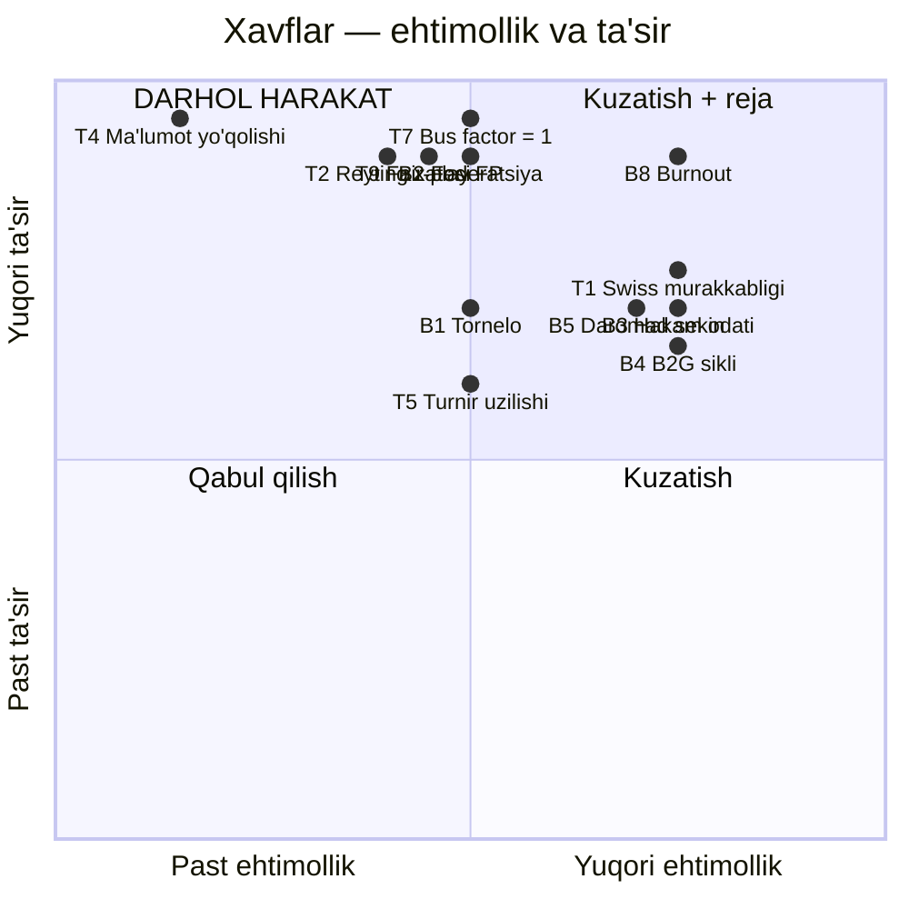

# 14 — Yo'l xaritasi (Roadmap)

> **Loyiha:** Farzin — O'zbekiston shaxmatining raqamli infratuzilmasi
> **Hujjat holati:** loyihalash bosqichi.
>
> **BU MVP EMAS.** Farzin — production tizim: real turnirlar, real reyting,
> real pul. MVP mantiqi ("tez chiqaramiz, keyin tuzatamiz") bu yerda
> ishlamaydi, chunki noto'g'ri hisoblangan reyting yoki buzilgan
> juftlashtirish **qaytarilmas**. Bosqichlar bor — lekin har bosqich
> oxirida chiqadigan narsa **tugallangan** bo'ladi, "keyin tuzatamiz"
> emas.
>
> **VAQT BAHOLARI HAQIDA — HALOL OGOHLANTIRISH:** quyidagi barcha vaqt
> raqamlari **bir kishi** uchun, **to'liq bandlik** taxminida berilgan.
> Ular **baho, kafolat emas.** Diapazon berilgan, chunki nuqta-baho
> yolg'on. Diapazonning yuqori chegarasi ham oshib ketishi mumkin —
> ayniqsa Faza 2 (Swiss) va Faza 6 (fair-play) da, chunki ular
> tadqiqot elementi bo'lgan ishlar.

**Bog'liq hujjatlar:**
- [11-infrastructure.md](./11-infrastructure.md) — Docker, CI/CD, K8s, deploy
- [13-testing-strategy.md](./13-testing-strategy.md) — golden test, property test, load test
- [15-observability.md](./15-observability.md) — metrika qaysi fazada qo'shiladi
- [10-security.md](./10-security.md) — RBAC, audit log, ma'lumot lokalizatsiyasi
- [05-pairing-engine.md](./05-pairing-engine.md) — FIDE Dutch spetsifikatsiyasi
- [06-rating-system.md](./06-rating-system.md) — Glicko-2 spetsifikatsiyasi

---

## 0. Umumiy ko'rinish

```mermaid
gantt
    title Farzin — fazalar ketma-ketligi (nisbiy, kalendar emas)
    dateFormat X
    axisFormat %s

    section Poydevor
    Faza 0 — Poydevor           :f0, 0, 6
    section Turnir
    Faza 1 — Turnir yadrosi     :f1, after f0, 8
    Faza 2 — Swiss engine       :f2, after f1, 12
    Faza 3 — Reyting            :f3, after f2, 7
    section Daromad
    Faza 4 — To'lov             :f4, after f3, 7
    section O'yin
    Faza 5 — Onlayn o'yin       :f5, after f4, 12
    Faza 6 — Fair play          :f6, after f5, 10
    section Kengayish
    Faza 7 — Maktab moduli      :f7, after f4, 8
    Faza 8 — Broadcast          :f8, after f5, 8
    Faza 9 — Mobil              :f9, after f5, 10
    section Masshtab
    Faza 10 — Optimizatsiya     :f10, after f6, 8
```



Diagrammadagi uzunliklar **nisbiy og'irlikni** ko'rsatadi, kalendar
sanalarni emas. Faza 7 (maktab) Faza 4'dan keyin boshlanishi mumkin —
u onlayn o'yinga bog'liq emas. Bu muhim: **B2G daromadi onlayn o'yindan
oldin kelishi mumkin** ([CANON 2] — daromad B2B/B2G'dan).

### Fazalar xulosasi

| Faza | Nomi | Baho (bir kishi) | Bloklaydi | Asosiy xavf |
|------|------|------------------|-----------|-------------|
| 0 | Poydevor | 3-6 hafta | Hammasini | Over-engineering |
| 1 | Turnir yadrosi | 5-8 hafta | 2, 3, 4, 7, 8 | Hakam ish oqimini noto'g'ri tushunish |
| 2 | Swiss engine | 8-16 hafta | Real turnirlar | **Algoritm murakkabligi** |
| 3 | Reyting | 4-7 hafta | Milliy baza | Rating period siyosati |
| 4 | To'lov | 4-7 hafta | Daromad | Provayder integratsiyasi |
| 5 | Onlayn o'yin | 8-14 hafta | 6, 8, 9 | WebSocket masshtabi, taymer |
| 6 | Fair play | 8-14 hafta | Ishonch | **Yolg'on ayblov** |
| 7 | Maktab moduli | 6-10 hafta | B2G daromadi | Shartnoma, voyaga yetmaganlar |
| 8 | Broadcast | 6-10 hafta | Homiylik | DGT apparati |
| 9 | Mobil | 8-12 hafta | Foydalanuvchi o'sishi | Store jarayoni |
| 10 | Masshtab | 6-10 hafta | — | Erta optimizatsiya |

**Jami: taxminan 66-114 hafta ketma-ket ishlaganda.** Bu ~1.5-2.5 yil.
Bu raqam **noqulay, lekin halol.** Uni qisqartirishning yagona yo'li —
qamrovni kesish yoki jamoa qo'shish, ikkalasi ham ochiq muhokama
qilinadigan qaror.

---

## Faza 0 — Poydevor

### Maqsad

Kod yozishni **xavfsiz** qilish. Bu fazadan keyin har commit
avtomatik tekshiriladi, deploy qilinadi va orqaga qaytariladi.
Hech qanday biznes qiymati yo'q — va bu normal.

### Ish doirasi

**Repo va tooling**
- `github.com/Sarvarbek0704/farzin` — monorepo emas, bitta NestJS ilova
  ([ADR-0001](./adr/0001-modular-monolith.md))
- TypeScript 5 strict mode — `strict: true`, `noUncheckedIndexedAccess: true`
- ESLint + Prettier, commit hook (husky + lint-staged)
- Conventional commits (changelog avtomatlashtirish uchun)

**CI/CD** ([11-infrastructure.md](./11-infrastructure.md) 7-bo'lim)
- GitHub Actions: lint → typecheck → unit → integration → build → scan
- Trunk-based, qisqa branch
- Trivy, gitleaks
- `dev` muhitiga avtomatik deploy

**Docker** ([11-infrastructure.md](./11-infrastructure.md) 2-3 bo'limlar)
- Multi-stage Dockerfile, non-root, alpine
- Docker Compose: postgres, redis, minio, mailhog, app
- Graceful shutdown (`enableShutdownHooks`)

**Prisma schema — poydevor entity'lari** ([CANON 6])
- `User`, `Session`, `Player`, `Federation`, `Region`, `Club`, `ClubMembership`
- `AuditLog`
- UUID v7 PK, `created_at`/`updated_at`, `deleted_at` (soft delete)
- Migration ish oqimi, expand-contract qoidasi hujjatlashtirilgan

**identity moduli** ([CANON 5] #1)
- Ro'yxatdan o'tish, kirish, chiqish
- Argon2id parol hash (**bcrypt EMAS** — [CANON 4])
- JWT: access ~15 min, refresh ~30 kun, rotatsiya bilan
- Refresh token reuse detection (o'g'irlangan token aniqlash)
- Sessiya Redis'da
- Email tasdiqlash (mailhog orqali dev'da)

**RBAC** ([10-security.md](./10-security.md))
- Rollar: `SUPER_ADMIN`, `FEDERATION_ADMIN`, `CLUB_ADMIN`, `ARBITER`,
  `COACH`, `PLAYER`, `SCHOOL_ADMIN`, `TEACHER`
- Guard + decorator, org ierarxiyasiga bog'langan (`Federation` → `Region` → `Club`)
- **Ruxsat testlari** birinchi kundan — keyin qo'shish qiyin

**Audit log** ([15-observability.md](./15-observability.md) 8-bo'lim)
- `audit_logs` jadvali, append-only
- Biznes o'zgarishi bilan **bir tranzaksiyada** yoziladi
- Interceptor + aniq chaqiruv (avtomatik emas — nima audit'ga tushishi
  ongli qaror)

**Observability minimumi** ([15-observability.md](./15-observability.md))
- Pino, JSON, correlation ID, redaction ro'yxati
- `/health/live`, `/health/ready`
- Sentry

**Swagger** — OpenAPI 3.1 avtomatik generatsiya

### Tayyorlik mezoni (Definition of Done)

- [ ] `git clone` → `docker compose up` → ishlaydigan API, hech qanday qo'lda qadam yo'q
- [ ] CI yashil va < 5 daqiqa (bu fazada test kam)
- [ ] Yangi migration yozib, `dev`ga deploy qilib, rollback qilib ko'rilgan
- [ ] Ro'yxatdan o'tish → kirish → token refresh → chiqish e2e testi o'tadi
- [ ] Refresh token reuse aniqlanadi va sessiya bekor qilinadi (test bilan)
- [ ] Har rol uchun ruxsat testi bor va o'tadi
- [ ] Audit log yozuvi biznes o'zgarishi bilan atomik (integration test)
- [ ] Log'da parol/token **yo'qligi** test bilan tasdiqlangan
- [ ] Swagger `/docs` da to'liq
- [ ] Docker image < 250 MB (yoki farq izohlangan —
      [11-infrastructure.md](./11-infrastructure.md) 2.5)

### Bog'liqliklar

Yo'q. Bu birinchi faza.

### Xavflar

| Xavf | Ehtimollik | Ta'sir | Yumshatish |
|------|-----------|--------|------------|
| **Over-engineering** — K8s, mikroservis, event sourcing'ni erta qurish | **Yuqori** | Yuqori | K8s Faza 5'da. Faza 0'da Docker Compose yetarli. Har infratuzilma qo'shimchasiga savol: "bu hozir kerakmi?" |
| Auth'ni o'zi yozish | O'rta | Yuqori | Passport + JWT standart, o'z kripto'si yozilmaydi. Argon2id parametrlari OWASP tavsiyasidan |
| RBAC'ni keyinga qoldirish | O'rta | **Juda yuqori** | RBAC'ni keyin qo'shish — har endpoint'ni qayta ko'rish. Faza 0'da, majburiy |
| Audit log'ni keyinga qoldirish | O'rta | Yuqori | Schema'ga keyin qo'shish og'riqli. Faza 0'da |

**Baho: 3-6 hafta.** Diapazon keng, chunki auth va RBAC'ni to'g'ri
qilish (test bilan) taxmin qilinganidan uzoq davom etadi.

---

## Faza 1 — Turnir yadrosi

### Maqsad

Hakam **Excel'siz** turnir o'tkaza olsin. Swiss hali yo'q — round-robin
bilan kichik turnir. Bu birinchi real qiymat.

### Ish doirasi

**tournament moduli** ([CANON 5] #4)
- Turnir CRUD: nom, sana, joy, tashkilotchi, vaqt nazorati
- `TournamentSection` — bir turnirda bir necha seksiya (A, B, yoshlar)
- Turnir turlari: round-robin, double round-robin, Swiss (Faza 2'da)
- Turnir holati: `DRAFT` → `REGISTRATION` → `IN_PROGRESS` → `FINISHED`
- Turnir kalendari (ommaviy, SEO — Next.js sahifasi keyin)

**Registration**
- O'yinchini ro'yxatga olish (o'zi yoki hakam tomonidan)
- Ro'yxat muddati, ishtirokchi limiti
- Kutish ro'yxati (waitlist)
- Ro'yxatdan chiqarish, kech kelish (late entry)
- To'lov hali yo'q (Faza 4) — hozircha `PENDING_PAYMENT` holati bor, oqim yo'q

**arbiter moduli** ([CANON 5] #7)
- Hakam paneli: raundlar, taxtalar, natijalar
- Natija kiritish: 1-0, 0-1, ½-½, forfeit, double forfeit
- Bye: full point, half point, zero point
- Natijani o'zgartirish — **majburiy sabab + audit log**
- `Appeal` — apellyatsiya yozuvi (to'liq oqim Faza 2'da)

**pairing moduli — birinchi qism** ([CANON 5] #5)
- Round-robin: Berger jadvali (standart tartib)
- Double round-robin
- Toq sonda bye rotatsiyasi
- Rang taqsimoti Berger qoidasi bo'yicha
- **Swiss YO'Q** — bu Faza 2

**Jadval va tie-break**
- Ochko hisobi
- Tie-break: Buchholz, Buchholz Cut-1, Sonneborn-Berger,
  Direct Encounter, ko'proq g'alaba
- Jadval real vaqtda yangilanadi (hozircha polling, WebSocket Faza 5'da)

**Eksport**
- PGN eksport (turnir, raund, o'yin)
- PDF: juftliklar, jadval, natijalar
  — **bu offline degradatsiya rejasining bir qismi**
  ([11-infrastructure.md](./11-infrastructure.md) 12.4)
- Chess-Results formatiga eksport (migratsiya yo'li)

### Tayyorlik mezoni

- [ ] Hakam 16 o'yinchili round-robin turnirni boshidan oxirigacha o'tkaza oladi
- [ ] Jadval va tie-break **qo'lda hisoblangan** natija bilan mos (golden test)
- [ ] Har natija o'zgarishi audit log'da, sabab bilan
- [ ] PGN eksport Swiss-Manager'da ochiladi (real tekshiruv)
- [ ] PDF juftlik varaqasi bosib chiqarishga yaroqli (real hakam tasdig'i)
- [ ] **Real hakam bilan sinov:** kamida bitta haqiqiy kichik turnir
      (klub darajasi) Farzin'da o'tkazilgan
- [ ] E2E test: turnir → ro'yxat → juftlik → natija → jadval
      ([13-testing-strategy.md](./13-testing-strategy.md) 4.1)
- [ ] Prometheus + RED metrikalari, birinchi dashboard

### Bog'liqliklar

Faza 0 (auth, RBAC, audit log).

### Xavflar

| Xavf | Ehtimollik | Ta'sir | Yumshatish |
|------|-----------|--------|------------|
| **Hakam ish oqimini noto'g'ri tushunish** | **Yuqori** | **Yuqori** | Real hakam bilan ishlash — birinchi kundan, oxirida emas. Swiss-Manager ish oqimini kuzatish. Bu eng katta xavf: texnik jihatdan mukammal, lekin hakam ishlata olmaydigan tizim — foydasiz |
| Tie-break formulalari noto'g'ri | O'rta | Yuqori | FIDE Handbook'dan aniq, golden test bilan |
| Turnir holat mashinasi murakkablashib ketadi | O'rta | O'rta | Aniq holat mashinasi, `deleted_at` bilan soft delete |
| Kech kelish/chiqish holatlari | Yuqori | O'rta | Bu Swiss'da yanada murakkab — hozirdan to'g'ri modellash |

**Baho: 5-8 hafta.**

---

## Faza 2 — Swiss engine

### Maqsad

FIDE Dutch (C.04.3) juftlashtirish — **rasmiy turnirlarda ishonchli**.
Bu loyihaning texnik yuragi ([CANON 7.1]).

### Nega bu eng qiyin faza

FIDE C.04.3 — bu algoritm emas, **cheklovlar to'plami va ustuvorlik
tartibi**. Uni to'g'ri implementatsiya qilish uchun:

- Absolyut kriteriylar (C.1: takroriy juftlik yo'q; C.2: rang chegarasi)
  — **buzib bo'lmaydi**
- Sifat kriteriylari (C.5-C.19) — ustuvorlik tartibida optimallashtiriladi
- Score group, S1/S2 bo'linishi, transposition, exchange, downfloat/upfloat
- Bu — og'irlikli ikki tomonlama moslashtirish (weighted bipartite matching)
  masalasi, blossom algoritmi bilan yoki backtracking bilan

Va eng muhimi: **"to'g'ri" javob tashqi manbadan keladi.** Bizning
fikrimiz muhim emas — Swiss-Manager va FIDE hakami nima deydi, shu muhim.

### Ish doirasi

**Asosiy algoritm**
- Score group qurish va tartiblash
- S1/S2 bo'linishi (yuqori/quyi yarim)
- Rang tarixi, rang balansi, rang ustunligi (color preference)
- Transposition (S2 ichida almashtirish)
- Exchange (S1 ↔ S2 almashtirish)
- Downfloat / upfloat, float tarixi (ketma-ket float taqiqi)
- Bye berish qoidasi
- Og'irlikli moslashtirish: har juftlik uchun jarima (penalty) og'irligi

**Cheklov qatlami**
- Absolyut kriteriylar **qattiq** cheklov sifatida (matching'da cheksiz og'irlik)
- Sifat kriteriylari — leksikografik tartibda og'irlik
- Natijadan keyin **majburiy verifikatsiya**:
  ```typescript
  const violations = verifyAbsoluteCriteria(pairings, history);
  if (violations.length > 0) {
    // Bu HECH QACHON bo'lmasligi kerak. Bo'lsa — juftlik chiqarilmaydi,
    // hakamga xato ko'rsatiladi va alert chiqadi
    // (15-observability.md 3.3, 6.4).
    for (const v of violations) {
      pairingCriteriaViolations.labels({ criterion: v.criterion }).inc();
    }
    throw new PairingIntegrityError(violations);
  }
  ```

**Boshqa tizimlar**
- Accelerated pairing (katta ochiq turnirlar uchun)
- Knockout (nokaut)
- Jamoa turniri (team Swiss)

**Hakam nazorati**
- Juftlikni **qo'lda o'zgartirish** — audit log bilan
- Qo'lda o'zgartirish absolyut kriteriyani buzsa — **ogohlantirish
  va tasdiqlash talab qilinadi** (hakam mas'uliyati)
- Juftlikni qayta generatsiya qilish (determinizm test bilan
  kafolatlangan — [13-testing-strategy.md](./13-testing-strategy.md) 5.2)

**Apellyatsiya oqimi** — to'liq: shikoyat → ko'rib chiqish → qaror → audit

### Validatsiya — bu fazaning asosiy ishi

**Golden test** ([13-testing-strategy.md](./13-testing-strategy.md) 6.1):
- FIDE C.04.3 hujjatidagi rasmiy misollar
- Real o'tkazilgan turnirlar (Chess-Results / Swiss-Manager dump),
  anonimlashtirilgan
- Chekka holatlar: 17 o'yinchi, hamma bir xil ochkoda, og'ir float,
  kech kelish

**Property test** ([13-testing-strategy.md](./13-testing-strategy.md) 5.2):
- C.1 — takroriy juftlik hech qachon (1000 run)
- C.2 — rang farqi chegarasi
- Har o'yinchi aynan bir marta
- Toq sonda aynan bitta bye
- Determinizm

**Shadow mode** ([11-infrastructure.md](./11-infrastructure.md) 8.3):
Yangi engine real turnirda **parallel** ishlaydi, natija solishtiriladi,
farq log'ga yoziladi — lekin **hakamga eski/qo'lda natija ko'rsatiladi**.
Farq nolga tushgach flag yoqiladi.

### Tayyorlik mezoni

- [ ] FIDE C.04.3 rasmiy misollari 100% mos
- [ ] Kamida **5 ta real turnir** (turli o'lchamda: 20, 50, 100, 200, 500
      o'yinchi) golden test'da, Swiss-Manager natijasi bilan mos
- [ ] Farq bo'lgan holatlar **qo'lda tekshirilgan va izohlangan**
      (`meta.json` da) — avtomatik "bizniki noto'g'ri" xulosasi yo'q
- [ ] Property testlar 1000+ run'da yiqilmaydi
- [ ] `farzin_pairing_criteria_violations_total` = 0 (shadow mode'da,
      kamida 3 ta real turnir davomida)
- [ ] Pairing latency 100 o'yinchida p95 < 10 s (o'lchangan)
- [ ] 500 o'yinchida juftlashtirish tugaydi (vaqt o'lchanadi va
      hujjatlanadi — [13-testing-strategy.md](./13-testing-strategy.md) 7.3)
- [ ] **FIDE hakami tasdig'i:** kamida bitta tajribali arbiter
      natijalarni ko'rib chiqib, "bu to'g'ri" degan
- [ ] Mutation testing yordamchi funksiyalarda > 75%

### Bog'liqliklar

Faza 1 (tournament, arbiter, natija oqimi).

### Xavflar

| Xavf | Ehtimollik | Ta'sir | Yumshatish |
|------|-----------|--------|------------|
| **Algoritm kutilganidan murakkabroq** | **Juda yuqori** | **Yuqori** | Bu FIDE C.04.3 haqiqati. Diapazon keng (8-16 hafta) va u ham oshishi mumkin. Bosqichma-bosqich: avval oddiy Swiss, keyin to'liq Dutch |
| **Swiss-Manager bilan farq — kim to'g'ri?** | **Yuqori** | O'rta | Swiss-Manager ham dastur, u ham xato qilishi mumkin. C.04.3'da bir nechta to'g'ri javob bo'lishi mumkin. Har farq FIDE hakami bilan tekshiriladi |
| Katta turnirda performance | O'rta | O'rta | Blossom O(n³). 500 o'yinchi uchun o'lchanadi. Kerak bo'lsa — score group ichida cheklangan qidiruv |
| Real turnir ma'lumotini ololmaslik | O'rta | **Yuqori** | Golden test'siz bu faza tugamaydi. Federatsiya bilan erta kelishuv. Zaxira: Chess-Results ommaviy ma'lumoti |
| Yarim ishlaydigan engine bilan reliz | Past | **Juda yuqori** | Feature flag + shadow mode. Bu faza uchun uzun branch qabul qilingan ([11-infrastructure.md](./11-infrastructure.md) 7.1) |

**Baho: 8-16 hafta.** **Bu eng ishonchsiz baho.** Agar C.04.3'ning
biror chekka holati kutilganidan qiyinroq chiqsa, 16 hafta ham
yetmasligi mumkin. Bu — halol ogohlantirish, pessimizm emas.

---

## Faza 3 — Reyting

### Maqsad

Milliy Glicko-2 reyting bazasi — **onlayn, ochiq, tekshiriladigan**.
Bu [CANON 2] dagi "milliy reyting bazasi onlayn emas" og'rig'ining javobi.

### Ish doirasi

**Glicko-2 yadro** ([CANON 7.2], [06-rating-system.md](./06-rating-system.md))
- Ichki shkala konversiya (mu, phi)
- g(phi), E(mu, mu_j, phi_j), v, delta
- Volatility (sigma) iteratsiyasi — Illinois algoritmi
- Tau (system constant) tanlovi — **bu siyosat qarori**, texnik emas
- Rating period yopilishi, RD o'sishi (o'ynamagan davr uchun)

**Rating period siyosati**
- Period uzunligi: 1 oy? 2 hafta? — **bu ochiq savol**, federatsiya bilan
  kelishiladi. Glicko-2 uchun tavsiya: o'rtacha o'yinchi period'da
  10-15 o'yin o'ynasin. O'zbekistonda turnir chastotasi bilan bu
  **o'lchanishi kerak**
- Yangi o'yinchi boshlang'ich reytingi: 1500, RD 350 (standart) —
  yoki FIDE reytingidan seed? Bu ham siyosat savoli

**Entity'lar** ([CANON 6])
- `RatingPeriod`, `RatingHistory`
- `Title` (GM/IM/FM...) — FIDE unvonlari

**Recompute**
- BullMQ job ([CANON 4])
- Butun period'ni qayta hisoblash (natija tuzatilganda kerak)
- **Idempotent** — ikki marta ishlasa bir xil natija
- Advisory lock ([11-infrastructure.md](./11-infrastructure.md) 6.1)

**FIDE Elo oynasi**
- FIDE reytingini ko'rsatish (import qilingan)
- Milliy Glicko-2 va FIDE Elo — **ikki alohida raqam**, aralashtirilmaydi
- FIDE ID bog'lash

**Ommaviy sahifa**
- Reyting ro'yxati, filtr (viloyat, yosh, jins, unvon)
- O'yinchi profili: reyting tarixi grafigi, RD ko'rsatilgan
- **RD ochiq ko'rsatiladi** — "1650 ± 45" ko'rinishida. Bu halollik:
  reyting nuqta emas, taqsimot

### Tayyorlik mezoni

- [ ] Glickman'ning rasmiy test vektori **aniq** mos
      ([13-testing-strategy.md](./13-testing-strategy.md) 6.2)
- [ ] Property testlar: RD manfiy emas, NaN yo'q, monotonlik (1000 run)
- [ ] `farzin_glicko_convergence_failures_total` = 0
- [ ] Recompute idempotent (integration test: 2 marta ishga tushirilsa
      bir xil natija)
- [ ] 10 000 o'yinchi, 3 period recompute vaqti o'lchangan va hujjatlangan
- [ ] `farzin_rating_period_lag_seconds` metrikasi va alert ishlaydi
- [ ] Reyting qo'lda tuzatish → audit log
- [ ] Mutation testing `rating/glicko2` da > 80%
- [ ] **Federatsiya tasdig'i:** rating period siyosati va tau qiymati
      rasman kelishilgan

### Bog'liqliklar

Faza 1 (`GameResult`), Faza 2 (Swiss turnirlar — reyting uchun ma'lumot manbai).

Texnik jihatdan Faza 2'siz ham mumkin (round-robin natijalari bilan),
lekin ma'noli reyting uchun yetarli o'yin kerak.

### Xavflar

| Xavf | Ehtimollik | Ta'sir | Yumshatish |
|------|-----------|--------|------------|
| **Rating period siyosati noto'g'ri** | O'rta | **Yuqori** | Bu texnik emas, siyosat qarori. Federatsiya bilan. Noto'g'ri period = reyting ma'nosiz. O'zgartirish = butun tarixni qayta hisoblash |
| Volatility konvergensiya qilmasligi | Past | Yuqori | Rasmiy algoritm + konvergensiya monitoringi + alert |
| Floating point aniqligi | O'rta | O'rta | Property test NaN/Infinity uchun. Tolerantlik ochiq belgilangan |
| Recompute juda sekin | O'rta | O'rta | Period ichida o'yinchilar mustaqil → parallellashtirish mumkin. Load test |
| FIDE Elo bilan chalkashlik | **Yuqori** | O'rta | UI'da qat'iy ajratish. Foydalanuvchi "nega FIDE'da 1800, bu yerda 1650?" deb so'raydi — javob hujjatlashtirilgan bo'lsin |

**Baho: 4-7 hafta.** Matematika aniq va test vektori bor — shuning
uchun Faza 2'dan ancha bashoratliroq. Vaqtning katta qismi — recompute
infratuzilmasi va siyosat kelishuvi.

---

## Faza 4 — To'lov

### Maqsad

Birinchi real daromad. [CANON 3] bo'yicha asosiy daromad B2B/B2G —
lekin turnir ro'yxati to'lovi eng tez yo'l.

### Ish doirasi

**billing moduli** ([CANON 5] #13)
- `Subscription`, `Invoice`, `Payment`
- Pul: `NUMERIC(14,2)` + `currency`, ichki hisob **tiyinda (BIGINT)** —
  [CANON 6]. **FLOAT hech qachon**

**Provayder integratsiyasi**
- Click, Payme (birinchi navbatda), Uzum
- `PaymentProvider` interfeysi — provayder-neytral
- Webhook: to'lov tasdig'i
- **Idempotentlik** — webhook ikki marta kelishi normal holat
- Reconciliation: provayder hisoboti bilan solishtirish

**Ledger — ikki tomonlama yozuv**
- Har tranzaksiya: debet + kredit
- Balans invariantі: `sum(debet) = sum(kredit)` **har doim**
- `farzin_ledger_imbalance_tiyin` metrikasi + kritik alert
  ([15-observability.md](./15-observability.md) 6.4)
- Property test: yaxlitlashda tiyin yo'qolmaydi
  ([13-testing-strategy.md](./13-testing-strategy.md) 5.4)

**Biznes oqimlari** ([CANON 3])
- Turnir ro'yxati to'lovi → komissiya
- Club/Federation SaaS obunasi — **asosiy daromad**
- Refund (qaytarish) — turnir bekor bo'lsa
- Invoys generatsiya (PDF), B2B uchun

**Xavfsizlik** ([10-security.md](./10-security.md))
- Karta ma'lumoti **hech qachon Farzin serverida saqlanmaydi** —
  provayder tokenizatsiyasi
- Log'da karta ma'lumoti yo'q ([15-observability.md](./15-observability.md) 2.4)
- Har to'lov operatsiyasi audit log'da

### Tayyorlik mezoni

- [ ] Click sandbox'da to'liq sikl: invoys → to'lov → webhook → tasdiq
- [ ] Payme sandbox'da to'liq sikl
- [ ] Webhook idempotent: bir xil webhook 5 marta → bitta `Payment`
- [ ] Ledger invarianti property test bilan (1000 run)
- [ ] `farzin_ledger_imbalance_tiyin` = 0, alert sinovdan o'tgan
- [ ] Refund oqimi ishlaydi va audit'da
- [ ] Reconciliation hisoboti: provayder ma'lumoti bilan farq = 0
- [ ] Log'da karta ma'lumoti yo'qligi test bilan tasdiqlangan
- [ ] **Kichik real to'lov** (bir necha ming so'm) production'da
      muvaffaqiyatli o'tgan va qaytarilgan
- [ ] Yurist: foydalanuvchi shartnomasi, oferta, refund siyosati tayyor

### Bog'liqliklar

Faza 1 (registration — to'lov nimaga qilinadi).

### Xavflar

| Xavf | Ehtimollik | Ta'sir | Yumshatish |
|------|-----------|--------|------------|
| **Provayder hujjatlari to'liq emas** | **Yuqori** | O'rta | O'zbek to'lov provayderlari hujjatlari sifati o'zgaruvchan. Sandbox'da erta sinov. Provayder bilan to'g'ridan-to'g'ri aloqa |
| Webhook takrorlanishi → ikki marta yechish | O'rta | **Juda yuqori** | Idempotentlik kaliti. Bu **majburiy**, ixtiyoriy emas |
| Yaxlitlash xatosi → pul yo'qoladi | O'rta | Yuqori | BIGINT tiyin, property test, ledger invariantі |
| Provayder uzilishi | O'rta | O'rta | Circuit breaker, navbat, foydalanuvchiga aniq xabar |
| **Huquqiy: oferta, soliq, hisobot** | O'rta | **Yuqori** | Yurist va buxgalter. **Bu muhandis vazifasi emas** |

**Baho: 4-7 hafta.** Diapazonning katta qismi — provayder
integratsiyasining bashoratsizligi.

---

## Faza 5 — Onlayn o'yin

### Maqsad

Brauzerda shaxmat o'ynash. Bu **bepul** ([CANON 3]) — jalb qilish
vositasi, daromad emas.

### Ish doirasi

**play moduli** ([CANON 5] #8)
- `OnlineGame`, `Move` entity'lari
- Socket.IO gateway, Redis adapter
  ([11-infrastructure.md](./11-infrastructure.md) 4.3)
- WebSocket-only transport (sticky session muammosi yechimi)

**Server-authoritative taymer** ([CANON 7.3])
- Vaqt manbai **faqat server** — klient ko'rsatadi, hisoblamaydi
- Fischer / Bronstein increment
- Lag kompensatsiya
- Drift monitoring (`farzin_clock_drift_seconds`)
- Diskonnekt siyosati: qancha kutish, qachon yutqazish
- Taymer holati Redis'da — pod almashinuvi o'yinni buzmaydi

**Move validatsiya** ([CANON 7.4])
- Legal move generation (server-side, **klientga ishonilmaydi**)
- Rokirovka, en passant, promotion
- Uch marta takrorlanish, 50-yurish qoidasi, insufficient material
- Klient tomonda `chess.js` — faqat UX uchun (tez javob), **hakam emas**

**Matchmaking**
- Vaqt nazorati bo'yicha navbat (bullet, blitz, rapid, classical)
- Reyting oralig'i bo'yicha moslash, vaqt o'tishi bilan kengayish
- Do'st bilan o'yin (havola orqali)

**O'yin funksiyalari**
- Durrang taklifi, taslim bo'lish, o'yinni bekor qilish (abort)
- Takeback (faqat tasodifiy o'yinda)
- Tomoshabin rejimi
- O'yindan keyingi tahlil — Stockfish 17 WASM, **client-side** ([CANON 4])

**Infratuzilma** ([11-infrastructure.md](./11-infrastructure.md))
- Kubernetes shu fazada kiritiladi
- HPA `farzin_websocket_connections` asosida
- OpenTelemetry ([15-observability.md](./15-observability.md) 4-bo'lim)
- SLO va burn-rate alert — baseline shu paytda paydo bo'ladi

### Tayyorlik mezoni

- [ ] Bullet (1+0) o'yin ravon o'ynaladi, taymer to'g'ri
- [ ] `farzin_move_processing_duration_seconds` p95 < 150 ms (o'lchangan)
- [ ] `farzin_clock_drift_seconds` p99 < 100 ms
- [ ] Diskonnekt → reconnect → o'yin davom etadi, taymer to'g'ri
      (chaos test — [13-testing-strategy.md](./13-testing-strategy.md) 8.2)
- [ ] Pod o'ldirilsa — klient boshqa pod'ga ulanadi, o'yin yo'qolmaydi
- [ ] k6: 1000 concurrent o'yin, threshold'lar o'tadi
      ([13-testing-strategy.md](./13-testing-strategy.md) 7.2)
- [ ] Pod boshiga sig'im o'lchangan → HPA konfiguratsiyasi yangilangan
- [ ] Noto'g'ri yurish server tomonda rad etiladi (klient hiylasi ishlamaydi)
- [ ] Uch marta takrorlanish, 50-yurish, insufficient material — test bilan
- [ ] SLO baseline o'rnatilgan va alert'lar sozlangan

### Bog'liqliklar

Faza 0 (auth). Texnik jihatdan turnir modulidan mustaqil, lekin
mahsulot mantiqiga ko'ra turnir yadrosidan keyin — chunki daromad
B2B'dan ([CANON 2]) va turnir birinchi.

### Xavflar

| Xavf | Ehtimollik | Ta'sir | Yumshatish |
|------|-----------|--------|------------|
| **Taymer noto'g'ri → o'yinchi haqsiz yutqazadi** | O'rta | **Juda yuqori** | Server-authoritative, sof funksiya, unit + property test, drift monitoring. Bu adolat masalasi |
| WebSocket masshtabi | O'rta | Yuqori | Redis adapter, load test. Sticky muammosi hal qilingan (11-infrastructure.md 4.3) |
| Lichess/Chess.com bilan taqqoslash | **Yuqori** | O'rta | **Halol: ular bilan raqobat qilmaymiz.** Onlayn o'yin — jalb vositasi, wedge emas. Foydalanuvchi Farzin'ga turnir uchun keladi |
| Deploy vaqtida o'yin uziladi | O'rta | O'rta | Graceful shutdown, drain, canary uzun bosqichlar. `play` relizi turnir vaqtida chiqarilmaydi |
| Redis yo'qolishi → taymer yo'qoladi | Past | Yuqori | Persistence + replica + `Move` jadvalidan tiklash. Cheklov ochiq tan olingan ([13-testing-strategy.md](./13-testing-strategy.md) 8.3) |

**Baho: 8-14 hafta.**

---

## Faza 6 — Fair play

### Maqsad

Anti-chit tizimi — engine korrelyatsiya va xulq-atvor tahlili.

### ENG MUHIM OGOHLANTIRISH

**Bu tizim EHTIMOLLIK beradi, ISBOT emas** ([CANON 7.5]).

Bu shunchaki texnik nuance emas — bu butun modulning dizayn asosi.
Yolg'on ayblov o'yinchining obro'siga, karerasiga va psixologik
holatiga zarar yetkazadi. Statistik signal — bu "qarash kerak"
degani, "aybdor" degani emas.

Shuning uchun:

- **Avtomatik jazo YO'Q.** Tizim hech qachon o'zi bloklamaydi
- Har qaror — **inson komissiyasi** tomonidan
- Signal aniq ehtimollik/statistik til bilan taqdim etiladi
  ("bu natija tasodifiy bo'lishi ehtimoli past" — "u aldadi" emas)
- Har qaror audit log'da, **to'liq asos bilan**
- O'yinchiga apellyatsiya huquqi
- Yolg'on pozitiv (false positive) darajasi **o'lchanadi va e'lon qilinadi**

### Ish doirasi

**fairplay moduli** ([CANON 5] #10)

**Engine korrelyatsiya**
- Stockfish 17 NNUE, **server-side** ([CANON 4])
- Centipawn loss taqsimoti
- Top-1/top-3 moslik foizi
- Pozitsiya murakkabligi bo'yicha normallashtirish (oson pozitsiyada
  hamma engine bilan mos keladi — bu signal emas)
- Reytingga nisbatan kutilgan darajadan chetlanish

**Xulq-atvor signallari**
- Yurish vaqti fingerprint (barqaror interval — shubhali)
- Murakkab pozitsiyada tez, oson pozitsiyada sekin — teskari naqsh
- Ko'p hisob (multi-account) aniqlash
- Qurilma/IP naqshlari — **ehtiyot bilan, PII**

**Tahlil navbati** ([11-infrastructure.md](./11-infrastructure.md) 4.6, 11.1)
- Alohida worker pool, CPU-optimized node
- **Tanlab tahlil** — hamma o'yin emas (iqtisodiy cheklov):
  - Shubha signali bo'lganda
  - Tasodifiy sampling
  - Yuqori stavkali turnirlar
- `farzin_fairplay_analysis_duration_seconds` — xarajat drayveri

**Komissiya paneli**
- Signal ro'yxati, ustuvorlik bo'yicha
- O'yin ko'rinishi: yurish-baholash grafigi
- Qaror: tozalash / ogohlantirish / diskvalifikatsiya
- **Majburiy sabab yozish**
- Har qadam audit'da

**Turnir kontekstida**
- Onlayn kvalifikatsiya turnirlari — eng katta xavf
- Jonli turnirda bu boshqa masala (jismoniy nazorat) — tizim faqat
  yordamchi

### Tayyorlik mezoni

- [ ] Ma'lum toza o'yinlar to'plamida yolg'on pozitiv darajasi
      **o'lchangan va hujjatlangan**
- [ ] Ma'lum chit o'yinlar (agar mavjud bo'lsa) aniqlanadi —
      **sezuvchanlik o'lchangan**
- [ ] Tahlil vaqti va CPU xarajati o'lchangan (11.1 dagi ochiq savol #4)
- [ ] Komissiya paneli real hakam bilan sinovdan o'tgan
- [ ] Har qaror audit'da, sabab bilan
- [ ] Apellyatsiya oqimi ishlaydi
- [ ] **Siyosat hujjati:** qanday signal, qanday chegara, qanday jarayon —
      **ommaviy e'lon qilingan**
- [ ] **Hech qanday avtomatik jazo yo'qligi** kod'da tasdiqlangan
- [ ] Yurist: ayblov, diskvalifikatsiya, ma'lumot ishlatish — huquqiy asos

### Bog'liqliklar

Faza 5 (onlayn o'yin, `Move` ma'lumoti), Faza 2 (turnir konteksti).

### Xavflar

| Xavf | Ehtimollik | Ta'sir | Yumshatish |
|------|-----------|--------|------------|
| **Yolg'on ayblov** | O'rta | **Katastrofik** | Avtomatik jazo yo'q. Inson komissiyasi. Konservativ chegara. Apellyatsiya. Yolg'on pozitiv darajasi o'lchanadi va e'lon qilinadi |
| Kuchli o'yinchi = shubhali | **Yuqori** | Yuqori | Nodirbek Abdusattorov engine bilan yuqori mos keladi — chunki u kuchli. Reytingga normallashtirish **majburiy** |
| CPU xarajati portlaydi | **Yuqori** | O'rta | Tanlab tahlil. Xarajat — fair-play siyosatini belgilaydigan omil (11-infrastructure.md 11.1) |
| Aniqlash usuli oshkor bo'lsa — chetlab o'tiladi | O'rta | O'rta | Siyosat ommaviy, **aniq chegaralar yo'q**. Bu — halollik va samaradorlik orasidagi savdo, ochiq tan olinadi |
| **Huquqiy: diskvalifikatsiya asosi** | O'rta | Yuqori | Yurist + federatsiya nizomi. Farzin qaror qabul qilmaydi — federatsiya qabul qiladi, Farzin vosita beradi |

**Baho: 8-14 hafta.** Bu ham ishonchsiz baho — statistik model
sozlash tadqiqot ishi.

---

## Faza 7 — Maktab moduli (B2G)

### Maqsad

Maktablarda shaxmat darslari uchun tizim. [CANON 2] — maktablarda
shaxmat davlat dasturi bor. [CANON 3] — bu B2G daromadi.

**Muhim: bu faza Faza 4'dan keyin, Faza 5'ni kutmasdan boshlanishi
mumkin.** Daromad nuqtai nazaridan u onlayn o'yindan muhimroq
bo'lishi ehtimoli bor.

### Ish doirasi

**school moduli** ([CANON 5] #12)
- `School`, `SchoolClass`, `Student`
- O'qituvchi paneli: sinf, o'quvchilar, davomat
- O'quvchi progressi: puzzle, dars, reyting
- Ichki maktab turnirlari (Faza 1-2 dan foydalanadi)
- Hisobot: sinf, maktab, tuman, viloyat darajasida

**training moduli — qisman** ([CANON 5] #11)
- `Puzzle`, `PuzzleAttempt`
- Puzzle bazasi (real o'yinlardan generatsiya — PGN arxividan)
- Dars tarkibi, uy vazifasi

**B2G talablari** ([10-security.md](./10-security.md))
- **Voyaga yetmaganlar ma'lumoti** — eng sezgir toifa
- Ota-ona roziligi
- Ma'lumot lokalizatsiyasi **qat'iy**
  ([11-infrastructure.md](./11-infrastructure.md) 5.2)
- `Student` ma'lumotiga har kirish audit'da — **o'qish ham**
  ([15-observability.md](./15-observability.md) 8-bo'lim)
- Vazirlik hisobot formati

### Tayyorlik mezoni

- [ ] O'qituvchi sinf yaratib, o'quvchi qo'shib, dars o'tkaza oladi
- [ ] O'quvchi progressi ko'rinadi (o'qituvchi, ota-ona uchun)
- [ ] `Student` ma'lumotiga kirish audit'da
- [ ] Ota-ona roziligi oqimi ishlaydi
- [ ] **Pilot maktab:** kamida bitta real maktab bir chorak ishlatgan
- [ ] Vazirlik hisobot formati tasdiqlangan
- [ ] Yurist: B2G shartnoma, voyaga yetmaganlar ma'lumoti — tasdiq

### Bog'liqliklar

Faza 0 (RBAC, audit log), Faza 1 (turnir), Faza 4 (to'lov/shartnoma).

### Xavflar

| Xavf | Ehtimollik | Ta'sir | Yumshatish |
|------|-----------|--------|------------|
| **B2G savdo sikli uzun** | **Yuqori** | Yuqori | Bu texnik xavf emas, biznes xavfi. Pilot maktabdan boshlash. Vazirlik bilan erta aloqa |
| **Voyaga yetmaganlar ma'lumoti — huquqiy** | O'rta | **Juda yuqori** | Yurist majburiy. Bu faza yuristsiz boshlanmaydi |
| Maktab internet infratuzilmasi | **Yuqori** | O'rta | Offline rejim? Past bandwidth? **O'lchanishi kerak** — real maktabda sinov |
| Talab noaniq | Yuqori | O'rta | Pilot maktab bilan birga loyihalash. Vazirlik talabi kutilganidan boshqacha bo'lishi mumkin |

**Baho: 6-10 hafta** (texnik ish). **Savdo va shartnoma sikli
bunga kirmaydi va u uzunroq bo'lishi mumkin.**

---

## Faza 8 — Broadcast

### Maqsad

Jonli translatsiya: DGT elektron taxtalar, jonli tablo, tomoshabin.
[CANON 3] — homiylik va premium translatsiya daromadi.

### Ish doirasi

**broadcast moduli** ([CANON 5] #9)
- DGT elektron taxta integratsiyasi ([CANON 4])
- Relay: taxtadan serverga yurish oqimi
- Jonli tablo: barcha taxtalar bir ekranda
- Tomoshabin rejimi, Socket.IO
- PGN jonli translatsiya (tashqi tizimlar uchun)
- Kechikish sozlash (anti-cheat uchun — jonli tablo 15 daqiqa kechikish
  bilan; bu FIDE amaliyoti)

**Texnik**
- Tomoshabin soni o'yinchi sonidan ko'p — **read-heavy**
- Bir yurish → yuzlab tomoshabinga. Bu bandwidth drayveri
  ([11-infrastructure.md](./11-infrastructure.md) 11.1)
- CDN + WebSocket kombinatsiyasi

### Tayyorlik mezoni

- [ ] Real DGT taxta bilan sinov (apparat kerak)
- [ ] Taxtadan yurish serverga < 2 s ichida yetadi
- [ ] Jonli tablo 20 taxtani real vaqtda ko'rsatadi
- [ ] 500 tomoshabin load test'da o'tadi
- [ ] Kechikish rejimi ishlaydi
- [ ] **Real turnirda** kamida bitta translatsiya o'tkazilgan

### Bog'liqliklar

Faza 5 (WebSocket infratuzilmasi), Faza 1-2 (turnir).

### Xavflar

| Xavf | Ehtimollik | Ta'sir | Yumshatish |
|------|-----------|--------|------------|
| **DGT apparati yo'q / qimmat** | **Yuqori** | Yuqori | Apparatsiz sinab bo'lmaydi. Federatsiya bilan kelishuv. Zaxira: qo'lda kiritish rejimi |
| DGT protokoli hujjatlari | O'rta | O'rta | Ochiq implementatsiyalar bor (Lichess broadcast). Tadqiqot kerak |
| Taxta xatosi (dona noto'g'ri o'qildi) | **Yuqori** | O'rta | Bu DGT bilan ma'lum muammo. Hakam tuzatish imkoni **majburiy** |
| Bandwidth xarajati | O'rta | O'rta | O'lchanadi. Kerak bo'lsa — delta uzatish, CDN |

**Baho: 6-10 hafta**, **apparat mavjudligiga bog'liq.**

---

## Faza 9 — Mobil

### Maqsad

React Native (Expo) ilova ([CANON 4]). [CANON 2] — mobile-first
wedge'ning bir qismi.

### Ish doirasi

- React Native + Expo
- Onlayn o'yin (chessground ekvivalenti)
- Turnir kalendari, ro'yxatdan o'tish
- Reyting, profil
- Push (FCM) — `notification` moduli ([CANON 5] #14)
- Puzzle
- **Hakam paneli — mobil'da EMAS** (birinchi versiyada). Hakam
  planshetda web ishlatadi

### Tayyorlik mezoni

- [ ] iOS va Android'da ishlaydi
- [ ] Onlayn o'yin ravon (past bandwidth'da ham)
- [ ] Push xabarnomalari
- [ ] App Store va Google Play'da chiqarilgan
- [ ] O'zbek/rus/ingliz

### Bog'liqliklar

Faza 5 (API va WebSocket barqaror bo'lishi kerak).

### Xavflar

| Xavf | Ehtimollik | Ta'sir | Yumshatish |
|------|-----------|--------|------------|
| **Store ko'rib chiqish jarayoni** | O'rta | O'rta | Rad etilishi mumkin. Erta boshlash. Apple qoidalari qat'iy |
| Ikki platforma qo'llab-quvvatlash | **Yuqori** | O'rta | Bir kishi uchun katta yuk. Expo yordam beradi, lekin native muammolar qoladi |
| API versiyalash | O'rta | Yuqori | Eski ilova versiyasi ishlashda davom etishi kerak. API versiyalash **shu fazadan oldin** hal qilinadi |

**Baho: 8-12 hafta.**

---

## Faza 10 — Masshtab

### Maqsad

Real ma'lumot asosida optimizatsiya. **Erta emas** — bu faza ataylab
oxirida, chunki [CANON 2] ga ko'ra realistik shift 100-300k ro'yxatdan
o'tgan, 10-30k oylik faol. Bu hajm zamonaviy hardware uchun kichik.

### Ish doirasi

- Load test natijalarini tahlil qilish
  ([13-testing-strategy.md](./13-testing-strategy.md) 7-bo'lim)
- Sekin so'rovlarni topish (`pg_stat_statements`), index optimizatsiya
- Read replica — **agar o'lchov ko'rsatsa**
  ([11-infrastructure.md](./11-infrastructure.md) 6.2)
- Cache strategiyasi
- Pairing algoritmi optimizatsiyasi (agar kerak bo'lsa)
- SLO qayta ko'rib chiqish — real ma'lumot bilan
  ([15-observability.md](./15-observability.md) 6.2)
- Xarajat modeli — **birinchi marta real raqamlar bilan**
  ([11-infrastructure.md](./11-infrastructure.md) 11-bo'lim)

### Tayyorlik mezoni

- [ ] Har optimizatsiya **oldin/keyin o'lchov** bilan asoslangan
- [ ] SLO'lar real ma'lumotga sozlangan
- [ ] Xarajat modeli tuzilgan
- [ ] 11-infrastructure.md dagi "ochiq savollar" jadvali yopilgan

### Xavflar

| Xavf | Ehtimollik | Ta'sir | Yumshatish |
|------|-----------|--------|------------|
| **Erta optimizatsiya** | **Yuqori** | O'rta | Shuning uchun bu faza oxirida. Har optimizatsiya profilga asoslanadi, taxminga emas |
| Optimizatsiya bug keltiradi | O'rta | Yuqori | Property + golden test himoya qiladi. Pairing/rating'da ayniqsa |
| Kerak bo'lmagan ishni qilish | O'rta | O'rta | Agar o'lchov muammo ko'rsatmasa — optimizatsiya qilinmaydi |

**Baho: 6-10 hafta.**

---

## Xavflar registri

Faza ichidagi xavflar yuqorida. Bu yerda — **butun loyihaga taalluqli**
xavflar.

### Texnik xavflar

| # | Xavf | Ehtimol | Ta'sir | Yumshatish | Egasi |
|---|------|---------|--------|------------|-------|
| T1 | **Swiss engine kutilganidan murakkab** | Yuqori | Yuqori | Bosqichma-bosqich, golden test, shadow mode, FIDE hakami tasdig'i. Diapazon keng va ochiq | Muhandis |
| T2 | **Reyting noto'g'ri hisoblanadi va tarqaladi** | O'rta | Juda yuqori | Rasmiy test vektori, property test, recompute imkoni, konvergensiya monitoring | Muhandis |
| T3 | **Taymer adolatsizligi** | O'rta | Yuqori | Server-authoritative, sof funksiya, drift metrikasi, chaos test | Muhandis |
| T4 | **Ma'lumot yo'qolishi** | Past | Katastrofik | PITR, immutable backup, haftalik avtomatik restore mashqi ([11-infrastructure.md](./11-infrastructure.md) 12.2) | Muhandis |
| T5 | **Turnir vaqtida uzilish** | O'rta | Yuqori (reputatsion) | Degradatsiya rejasi, offline PDF eksport, read-only rejim, turnir vaqtida deploy yo'q | Muhandis |
| T6 | WebSocket masshtabi | O'rta | O'rta | Redis adapter, load test, HPA | Muhandis |
| T7 | **Bitta muhandisga bog'liqlik (bus factor = 1)** | — | Juda yuqori | **Yumshatib bo'lmaydi, faqat kamaytiriladi:** hujjatlashtirish, IaC, runbook, sodda arxitektura. **Bu ochiq tan olinadi** | — |
| T8 | Texnik qarz to'planishi | Yuqori | O'rta | Trunk-based, kichik PR, feature flag muddati, refactoring vaqti rejalashtiriladi | Muhandis |
| T9 | Fair-play yolg'on pozitiv | O'rta | Katastrofik | Avtomatik jazo yo'q, inson komissiyasi, o'lchangan FP darajasi | Muhandis + komissiya |
| T10 | Dependency zaifligi | O'rta | O'rta | Trivy, Dependabot, npm audit ([11-infrastructure.md](./11-infrastructure.md) 7.2) | Muhandis |

### Biznes xavflari

| # | Xavf | Ehtimol | Ta'sir | Yumshatish | Egasi |
|---|------|---------|--------|------------|-------|
| B1 | **Tornelo O'zbekistonga kiradi** | O'rta | Yuqori | [CANON 2] — u eng jiddiy raqib. Wedge: mahalliy to'lov, o'zbek tili, B2G, milliy reyting. Tornelo buni tez qila olmaydi | — |
| B2 | **Federatsiya hamkorlik qilmaydi** | O'rta | **Juda yuqori** | Milliy reyting bazasi federatsiya tasdig'isiz ma'nosiz. Erta aloqa. Zaxira: klub darajasidan boshlash | — |
| B3 | **Hakamlar Swiss-Manager'dan ko'chmaydi** | Yuqori | Yuqori | 20 yillik odat. Migratsiya yo'li (import/eksport), parallel ishlash imkoni, real hakam bilan birga loyihalash | — |
| B4 | **B2G savdo sikli uzun** | Yuqori | Yuqori | Pilot maktabdan boshlash, natija ko'rsatish, keyin kengaytirish | — |
| B5 | **Daromad kutilganidan sekin** | Yuqori | Yuqori | [CANON 2] — bu bozorda milliondan daromad yo'q. Xarajat past ushlanadi. B2B/B2G birinchi | — |
| B6 | To'lov provayderi shartlari o'zgaradi | O'rta | O'rta | `PaymentProvider` interfeysi — provayder almashtirish mumkin | Muhandis |
| B7 | **Ma'lumot lokalizatsiyasi qonuni o'zgaradi** | O'rta | Yuqori | Arxitektura provayder-neytral ([11-infrastructure.md](./11-infrastructure.md) 5.3). Yurist kuzatadi | Yurist |
| B8 | **Bir kishi charchaydi (burnout)** | **Yuqori** | **Juda yuqori** | Realistik baho (bu hujjat), qamrovni kesish imkoni, fazalarni kechiktirish. **Bu eng ehtimolli loyiha o'ldiruvchisi** | — |
| B9 | Foydalanuvchi kutilganidan kam | O'rta | O'rta | [CANON 2] shift allaqachon konservativ. B2B daromadi B2C hajmiga bog'liq emas | — |
| B10 | Homiylik/broadcast daromadi kelmaydi | O'rta | Past | Bu qo'shimcha daromad, asosiy emas | — |

### Xavf matritsasi



### Eng muhim uchta xavf — halol xulosa

**1. B8 — burnout (bir kishi, 1.5-2.5 yil).** Bu texnik xavf emas va
uni texnik yechim bilan hal qilib bo'lmaydi. Yumshatish — **qamrovni
kesish**: masalan, Faza 6 (fair-play) va Faza 9 (mobil) ni kechiktirish,
yoki Faza 8 (broadcast) dan butunlay voz kechish. Bu hujjat ularni
rejaga kiritdi, chunki ular kerak — lekin **majburiy emas**.

**2. T7 — bus factor = 1.** Agar muhandis loyihadan chiqsa, loyiha
to'xtaydi. Yumshatish to'liq emas: hujjat, IaC, runbook, sodda
arxitektura ([ADR-0001](./adr/0001-modular-monolith.md) — modular
monolith aynan shu sababdan ham) — bular yangi odam kirishini
osonlashtiradi, lekin yo'qolgan kontekstni qoplamaydi.

**3. B3 — hakamlar ko'chmaydi.** Swiss-Manager 20 yillik de-fakto
standart. Texnik ustunlik yetarli emas — odat kuchli. Yumshatish:
migratsiya yo'li, parallel ishlash, va eng muhimi — **real hakam
bilan birga loyihalash** (Faza 1'dan boshlab, oxirida emas).

---

## Ilova: fazalarni kesish varianti

Agar vaqt yoki resurs cheklansa, quyidagi tartibda kesiladi.
**Bu tartib ongli va u [CANON 2-3] dagi daromad modelidan kelib chiqadi:**

| Ustuvorlik | Fazalar | Sabab |
|-----------|---------|-------|
| **Majburiy** | 0, 1, 2, 3 | Bularsiz Farzin — Farzin emas. Turnir + Swiss + reyting = mahsulot yadrosi |
| **Daromad uchun majburiy** | 4, 7 | B2B/B2G daromadi ([CANON 3]) |
| **Muhim** | 5 | Jalb qilish, foydalanuvchi bazasi |
| **Kechiktirilishi mumkin** | 6, 9, 10 | Fair-play — onlayn o'yin kattalashguncha kutadi. Mobil — web mobile-first bo'lsa kutadi |
| **Voz kechilishi mumkin** | 8 | Broadcast — apparatga bog'liq, daromadi noaniq |

Ya'ni **minimal ishlaydigan Farzin = Faza 0-4 + 7**. Bu ~35-52 hafta.
Qolganlari — kengaytirish.

Bu ham baho, kafolat emas.
