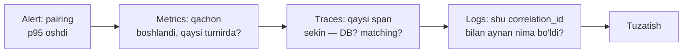

# 15 — Kuzatuvchanlik (Observability)

> **Loyiha:** Farzin — O'zbekiston shaxmatining raqamli infratuzilmasi
> **Hujjat holati:** loyihalash bosqichi. Metrika nomlari va SLO tuzilishi qat'iy;
> **SLO'ning aniq maqsad qiymatlari real baseline o'lchangandan keyin belgilanadi.**

**Bog'liq hujjatlar:**
- [11-infrastructure.md](./11-infrastructure.md) — deploy, canary analiz, HPA metrikalari
- [10-security.md](./10-security.md) — audit log, sirlarni himoya qilish
- [13-testing-strategy.md](./13-testing-strategy.md) — yuklama testi (baseline manbai)
- [14-roadmap.md](./14-roadmap.md) — observability qaysi fazada quriladi

---

## 0. Nega bu hujjat kerak

Kuzatuvchanlik — "dashboard chiroyli bo'lsin" degani emas. U bitta savolga
javob beradi: **tizim buzilganda, uni tuzatish uchun yetarli ma'lumot bormi?**

Farzin'da bu savol o'tkirroq, chunki eng qimmat nosozliklar **jimgina**
bo'ladi. Server 500 qaytarsa — bu ko'rinadi. Lekin:

- Swiss pairing bitta juftlikni C.1 (ikki marta uchrashmaslik) qoidasini
  buzib chiqarsa — hech qanday xato yo'q, hakam turnir oxirida biladi
- Glicko-2 sigma iteratsiyasi konvergensiya qilmay, eski qiymatni qaytarsa —
  reyting jimgina noto'g'ri
- Taymer 40 ms drift bersa — o'yinchi yutqazadi va nima bo'lganini bilmaydi

Bu nosozliklarni faqat **biznesga oid metrikalar** ushlaydi. Shuning uchun
3-bo'limdagi `farzin_*` metrikalari CPU/xotira metrikalaridan muhimroq.

---

## 1. Uch ustun: logs, metrics, traces

Uchtasi bir-birini almashtirmaydi. Ular turli savollarga javob beradi.

| Ustun | Savol | Kardinallik | Saqlash | Xarajat |
|-------|-------|-------------|---------|---------|
| **Metrics** | *Nima bo'ldi? Qancha? Qachondan beri?* | Past bo'lishi SHART | Uzoq (oylar) | Arzon |
| **Logs** | *Aynan shu holatda nima sodir bo'ldi?* | Yuqori | O'rta (kunlar) | Qimmat |
| **Traces** | *Vaqt qayerda sarflandi? Kim kimni chaqirdi?* | Juda yuqori | Qisqa (kunlar), sample | Juda qimmat |

Amaliy ish tartibi — **metrics → traces → logs**:



Teskari yo'nalish (log'dan boshlash) — eng keng tarqalgan vaqt yo'qotish.
Log'da qidirish sekin va qimmat; metrika sekundlarda javob beradi.

**Nega uchalasi ham kerakligiga Farzin misoli:**

- *Metrika:* `farzin_pairing_duration_seconds` p95 8 soniyaga chiqdi.
  Bu **muammo borligini** aytadi, sababini emas.
- *Trace:* trace ko'rsatadi — vaqtning 90% `pairing.matching.blossom`
  span'ida. Demak DB emas, algoritm. Bu **qayerda** ekanini aytadi.
- *Log:* o'sha `correlation_id` bilan log ko'rsatadi — 340 o'yinchili
  score group, transposition 4-darajaga tushgan. Bu **nima uchun**
  ekanini aytadi.

Uchtasini bir-biriga bog'laydigan narsa — `correlation_id` va `trace_id`.
Ular bo'lmasa, uch ustun uch orol bo'lib qoladi.

---

## 2. Structured logging — Pino

### 2.1 Nega Pino va nega JSON

Pino tanlangan ([CANON 4]), chunki u JSON'ni sinxron va tez yozadi va
Node.js'da eng kam overhead beradi. Muhimi — **log formati JSON**, matn emas.

Sabab: `console.log("Pairing done for tournament " + id)` — bu inson uchun,
mashina uchun emas. Uni Loki/Elasticsearch'da filtrlash uchun regex kerak,
regex esa format o'zgarganda jimgina buziladi. JSON'da `tournament_id` — maydon.

### 2.2 Konfiguratsiya

```typescript
// src/common/logging/logger.config.ts
import type { Params } from 'nestjs-pino';
import { randomUUID } from 'node:crypto';

/**
 * Log'ga HECH QACHON tushmasligi kerak bo'lgan maydonlar.
 * Bu ro'yxat 10-security.md dagi ma'lumot toifalari bilan mos.
 * Yangi sezgir maydon qo'shilganda BU YERGA ham qo'shilishi shart.
 */
const REDACT_PATHS = [
  // Autentifikatsiya
  'req.headers.authorization',
  'req.headers.cookie',
  'res.headers["set-cookie"]',
  'req.body.password',
  'req.body.newPassword',
  'req.body.currentPassword',
  'req.body.refreshToken',
  'req.body.accessToken',
  '*.password',
  '*.passwordHash',
  '*.refreshToken',
  '*.sessionToken',
  '*.otp',
  '*.otpCode',
  // To'lov — billing moduli
  '*.cardNumber',
  '*.pan',
  '*.cvv',
  '*.cvc',
  '*.expiry',
  'req.body.card',
  // Tashqi provayder sirlari
  '*.clickSecretKey',
  '*.paymeKey',
  '*.eskizToken',
  '*.apiKey',
  '*.secret',
  // Shaxsiy ma'lumot (PII) — 10-security.md
  '*.nationalId',
  '*.uzbNationalId',
  '*.passportNumber',
  '*.birthDate',
];

export const loggerConfig: Params = {
  pinoHttp: {
    level: process.env.LOG_LEVEL ?? 'info',

    // Redaction — Pino darajasida, ilova darajasida emas.
    // Sabab: dasturchi unutishi mumkin, konfiguratsiya unutmaydi.
    redact: {
      paths: REDACT_PATHS,
      censor: '[REDACTED]',
      remove: false,   // maydon o'chirilmaydi — u BOR ekani ko'rinsin
    },

    // Har log qatorida request ID bo'lishi uchun
    genReqId: (req, res) => {
      const existing = req.headers['x-request-id'];
      const id = (typeof existing === 'string' && existing) || randomUUID();
      res.setHeader('x-request-id', id);
      return id;
    },

    customProps: (req) => ({
      // Trace bilan bog'lash — 4-bo'lim
      trace_id: getActiveTraceId(),
      span_id: getActiveSpanId(),
      // Kim — lekin faqat ID, ism/email EMAS
      user_id: (req as AuthedRequest).user?.id,
      federation_id: (req as AuthedRequest).user?.federationId,
    }),

    // Sog'liq tekshiruvlari log'ni ko'mib tashlamasin
    autoLogging: {
      ignore: (req) =>
        req.url === '/health/live' ||
        req.url === '/health/ready' ||
        req.url === '/metrics',
    },

    // So'rov/javob serializatsiyasi — nima yoziladi, aniq belgilangan
    serializers: {
      req: (req) => ({
        method: req.method,
        url: req.url,
        // query stringda token bo'lishi mumkin — butun URL emas, path
        route: req.routeOptions?.url ?? req.url?.split('?')[0],
        remoteAddress: req.ip,
        userAgent: req.headers['user-agent'],
      }),
      res: (res) => ({ statusCode: res.statusCode }),
      err: (err) => ({
        type: err.type,
        message: err.message,
        stack: err.stack,
        code: err.code,
      }),
    },

    // Development'da o'qish uchun chiroyli, production'da toza JSON
    transport:
      process.env.NODE_ENV === 'development'
        ? { target: 'pino-pretty', options: { singleLine: true } }
        : undefined,
  },
};
```

### 2.3 Correlation ID — so'rovdan job'gacha

`request_id` faqat HTTP so'rovda emas, **butun ish zanjirida** saqlanishi kerak.
Farzin'da zanjir uzun: hakam natija kiritadi → HTTP so'rov → BullMQ job
(rating recompute) → boshqa job (hisobot). Agar rating hisobida xato bo'lsa,
uni asl so'rovga bog'lay olish kerak.

```typescript
// src/common/logging/correlation.ts
import { AsyncLocalStorage } from 'node:async_hooks';

export interface CorrelationContext {
  requestId: string;
  traceId?: string;
  userId?: string;
}

export const correlationStorage = new AsyncLocalStorage<CorrelationContext>();

export function getCorrelation(): CorrelationContext | undefined {
  return correlationStorage.getStore();
}
```

```typescript
// src/common/queue/queue.producer.ts
@Injectable()
export class QueueProducer {
  constructor(@InjectQueue('rating') private readonly ratingQueue: Queue) {}

  /**
   * Job'ga correlation kontekstini QO'SHIB yuboradi.
   * Bu bo'lmasa, job log'lari asl so'rovdan uzilib qoladi va
   * "reyting nega noto'g'ri hisoblandi" savoliga javob topib bo'lmaydi.
   */
  async enqueueRatingRecompute(periodId: string): Promise<void> {
    const ctx = getCorrelation();
    await this.ratingQueue.add(
      'recompute',
      {
        periodId,
        _correlation: {
          requestId: ctx?.requestId,
          traceId: ctx?.traceId,
          userId: ctx?.userId,
        },
      },
      { attempts: 3, backoff: { type: 'exponential', delay: 5_000 } },
    );
  }
}
```

```typescript
// src/rating/rating.processor.ts
@Processor('rating')
export class RatingProcessor extends WorkerHost {
  constructor(private readonly logger: PinoLogger) {
    super();
  }

  async process(job: Job<RecomputeJobData>): Promise<void> {
    const corr = job.data._correlation ?? { requestId: `job-${job.id}` };

    // Job butun davomida kontekst saqlanadi — ichkaridagi har qanday
    // log avtomatik requestId oladi.
    await correlationStorage.run(corr, async () => {
      this.logger.info(
        { job_id: job.id, period_id: job.data.periodId },
        'Rating recompute boshlandi',
      );
      await this.recompute(job.data.periodId);
    });
  }
}
```

### 2.4 Nima loglanadi va nima LOGLANMAYDI

**Hech qachon log'ga tushmasligi kerak:**

| Toifa | Misol | Nega |
|-------|-------|------|
| Parol | `password`, `passwordHash` | Ochiq matn — halokat. Hash ham — offline brute-force materiali |
| Token | JWT, refresh token, session ID | Log'ni ko'rgan odam sessiyani o'g'irlaydi |
| Karta ma'lumoti | PAN, CVV, amal muddati | Qonun va PCI talab |
| OTP / SMS kodi | `otpCode` | Log ko'rgan odam autentifikatsiyani chetlab o'tadi |
| Tashqi sirlar | Click/Payme kaliti, Eskiz token | Provayder hisobini o'g'irlash |
| Sezgir PII | Milliy ID, pasport, tug'ilgan sana | 10-security.md; `Student` uchun ayniqsa |
| To'liq so'rov tanasi | `req.body` xom holda | Yuqoridagilarning hammasi shu yerda bo'lishi mumkin |

Oxirgi qator eng ko'p buziladigan qoida. `logger.info({ body: req.body }, 'Request')`
— bu bir qatorda barcha yuqoridagi qoidalarni buzadi. Shuning uchun
`req.body` **hech qachon butunligicha loglanmaydi.** Kerakli maydonlar
aniq nomlanadi.

**Log'ga tushishi kerak:**

- `request_id`, `trace_id`, `span_id` — bog'lash uchun
- `user_id`, `federation_id` — **ID, ism emas**
- Domen identifikatorlari: `tournament_id`, `round_id`, `pairing_id`, `game_id`
- Qaror va sabab: `"Pairing rad etildi"` + `reason: "C1_REPEAT_OPPONENT"`
- Davomiylik: `duration_ms`
- Xato: `err` (stack bilan)

Domen identifikatorlarini loglash Farzin uchun kritik: "3-raundda 12-taxtada
nima bo'ldi?" savoliga javob berish uchun `round_id` va `board_number`
log'da bo'lishi shart.

### 2.5 Log darajalari siyosati

Daraja tanlash — sub'ektiv emas, qoida:

| Daraja | Qachon | Kim ko'radi | Misol |
|--------|--------|-------------|-------|
| `fatal` | Protsess davom eta olmaydi | Alert (darhol) | DB'ga umuman ulanib bo'lmadi, startda |
| `error` | Operatsiya buzildi, **odam aralashuvi kerak** | Alert (agregatsiya bilan) | Rating recompute 3 marta failed |
| `warn` | G'ayrioddiy, lekin tizim eplaydi | Dashboard | Pairing fallback algoritmga o'tdi |
| `info` | Muhim biznes hodisasi | Qidiruvda | Turnir boshlandi, raund juftlashtirildi |
| `debug` | Diagnostika detali | Faqat dev/incident | Score group tarkibi, transposition qadamlari |
| `trace` | Juda batafsil | Deyarli hech qachon | Har yurish validatsiyasi |

**Qattiq qoidalar:**

1. **`error` — bu "kimdir tuzatishi kerak" degani.** Foydalanuvchi noto'g'ri
   parol kiritsa — bu `info`, `error` emas. Agar `error` da odam
   aralashuvi kerak bo'lmasa, u `error` emas. Aks holda alert fatigue
   (6.4-bo'lim) boshlanadi.
2. **`warn` — "hozir yaxshi, lekin trend yomon".** Pairing fallback'ga
   o'tishi — turnir ishlaydi, lekin buni bilish kerak.
3. **Production'da default `info`.** `debug` faqat vaqtinchalik,
   feature flag orqali va **aniq modul uchun**:
   ```typescript
   // Butun tizimni debug'ga o'tkazish log hajmini portlatadi
   // va u qimmat (11-infrastructure.md 11.1). Faqat kerakli modul:
   if (await this.flags.isEnabled('debug.pairing_verbose', { tournamentId })) {
     this.logger.debug({ scoreGroups, s1, s2 }, 'Score group bo'linishi');
   }
   ```
4. **Log tsiklda yozilmaydi.** 500 o'yinchili turnirda har juftlik uchun
   `info` yozish — 500 qator. Buning o'rniga bitta xulosa qatori
   va batafsili `debug` da.

---

## 3. Metrics — Prometheus

### 3.1 RED va USE

Ikki metodika, ikki maqsad. Ikkalasi ham kerak.

**RED — servis (so'rov qabul qiladigan narsa) uchun:**
- **R**ate — sekundiga nechta so'rov
- **E**rrors — nechtasi buzildi
- **D**uration — qancha vaqt oldi

**USE — resurs (CPU, xotira, disk, ulanish pool'i) uchun:**
- **U**tilization — qancha band
- **S**aturation — qancha navbatda kutyapti
- **E**rrors — resurs darajasidagi xatolar

Farzin'da USE ayniqsa **connection pool** uchun muhim
([11-infrastructure.md](./11-infrastructure.md) 6.1). Pool to'lganda
CPU past, xotira normal — lekin hamma so'rov kutadi. Faqat saturation
metrikasi buni ko'rsatadi.

### 3.2 Texnik metrikalar

```typescript
// src/common/metrics/http.metrics.ts
import { Histogram, Counter } from 'prom-client';

export const httpRequestDuration = new Histogram({
  name: 'http_request_duration_seconds',
  help: 'HTTP so\'rov davomiyligi',
  // DIQQAT: label sifatida `route` ishlatiladi, `path` EMAS.
  // /tournaments/:id → bitta seriya.
  // /tournaments/<uuid> → har turnir uchun alohida seriya = kardinallik portlashi.
  labelNames: ['method', 'route', 'status'] as const,
  buckets: [0.005, 0.01, 0.025, 0.05, 0.1, 0.25, 0.5, 1, 2.5, 5, 10],
});

export const dbPoolSaturation = new Gauge({
  name: 'farzin_db_pool_waiting_count',
  help: 'DB pool ulanishini kutayotgan so\'rovlar (USE — saturation)',
});
```

### 3.3 Biznes metrikalari — Farzin'ning yuragi

Bu bo'lim eng muhimi. Texnik metrikalar "server tirikmi" deydi;
bular "shaxmat to'g'ri ishlayaptimi" deydi.

```typescript
// src/common/metrics/farzin.metrics.ts
import { Histogram, Gauge, Counter } from 'prom-client';

// ---------- PAIRING ----------

export const pairingDuration = new Histogram({
  name: 'farzin_pairing_duration_seconds',
  help: 'Raund juftlashtirish davomiyligi',
  labelNames: ['algorithm', 'section_size_bucket'] as const,
  // Swiss pairing katta turnirda sekundlar oladi. Bucket'lar keng.
  // Aniq taqsimot yuklama testidan keyin tuzatiladi
  // (13-testing-strategy.md 7-bo'lim).
  buckets: [0.1, 0.5, 1, 2, 5, 10, 30, 60, 120],
});

export const pairingFailures = new Counter({
  name: 'farzin_pairing_failures_total',
  help: 'Juftlashtirish muvaffaqiyatsizliklari',
  // reason: NO_VALID_PAIRING | TIMEOUT | ABSOLUTE_CRITERIA_VIOLATION
  labelNames: ['algorithm', 'reason'] as const,
});

/**
 * ENG MUHIM METRIKA. FIDE C.04.3 absolyut kriteriylari (C.1: ikki marta
 * uchrashmaslik, C.2: rang balansi) buzilishi — bu jimgina halokat.
 * Bu counter HAR QANDAY nolga teng bo'lmagan qiymatda alert beradi.
 * Bu "biroz yomon" emas, bu "turnir haqiqiy emas".
 */
export const pairingCriteriaViolations = new Counter({
  name: 'farzin_pairing_criteria_violations_total',
  help: 'FIDE absolyut kriteriya buzilishi (HECH QACHON > 0 bo\'lmasligi kerak)',
  labelNames: ['criterion'] as const,   // C1_REPEAT | C2_COLOR
});

export const pairingFloatCount = new Histogram({
  name: 'farzin_pairing_float_count',
  help: 'Raunddagi downfloat soni — sifat signali',
  labelNames: ['section_size_bucket'] as const,
  buckets: [0, 1, 2, 3, 5, 8, 13, 21],
});

// ---------- O'YIN ----------

export const activeGames = new Gauge({
  name: 'farzin_active_games',
  help: 'Hozir davom etayotgan o\'yinlar',
  labelNames: ['type'] as const,        // online | tournament | broadcast
});

export const websocketConnections = new Gauge({
  name: 'farzin_websocket_connections',
  help: 'Faol WebSocket ulanishlari (HPA manbai — 11-infrastructure.md 4.4)',
  labelNames: ['namespace'] as const,   // play | broadcast | arbiter
});

export const moveProcessingDuration = new Histogram({
  name: 'farzin_move_processing_duration_seconds',
  help: 'Yurish qabul qilishdan raqibga yuborishgacha (SLO manbai)',
  labelNames: ['game_type'] as const,   // bullet | blitz | rapid | classical
  // Bullet uchun har millisekund muhim — kichik bucket'lar.
  buckets: [0.001, 0.005, 0.01, 0.025, 0.05, 0.1, 0.25, 0.5, 1],
});

/**
 * Server-authoritative taymer drift'i (CANON 7.3).
 * Serverning hisoblagan vaqti bilan kutilgan vaqt orasidagi farq.
 * Bu o'sib borsa — o'yinchi haqsiz yutqazadi. Sof texnik metrika emas,
 * ADOLAT metrikasi.
 */
export const clockDrift = new Histogram({
  name: 'farzin_clock_drift_seconds',
  help: 'Taymer drift — server hisobi vs kutilgan',
  labelNames: ['game_type'] as const,
  buckets: [0.001, 0.005, 0.01, 0.05, 0.1, 0.5],
});

export const gameDisconnects = new Counter({
  name: 'farzin_game_disconnects_total',
  help: 'O\'yin davomida uzilishlar',
  labelNames: ['game_type', 'outcome'] as const,  // reconnected | forfeited | aborted
});

// ---------- REYTING ----------

/**
 * Rating period yopilishi kerak edi, lekin hali yopilmagan vaqt.
 * Glicko-2 rating period asosida ishlaydi (CANON 7.2) — agar job
 * ishlamasa, reyting jimgina eskiradi. Hech qanday xato yo'q,
 * hech kim sezmaydi — o'yinchi eski reyting bilan turnirga
 * noto'g'ri seed olguncha.
 */
export const ratingPeriodLag = new Gauge({
  name: 'farzin_rating_period_lag_seconds',
  help: 'Rating period yopilishi kechikishi',
  labelNames: ['federation_id'] as const,
});

export const ratingRecomputeDuration = new Histogram({
  name: 'farzin_rating_recompute_duration_seconds',
  help: 'Glicko-2 rating period hisobi davomiyligi',
  buckets: [1, 5, 15, 30, 60, 300, 900, 1800],
});

/**
 * Glicko-2 volatility iteratsiyasi konvergensiya qilmagan holatlar.
 * Illinois algoritmi odatda < 20 iteratsiyada konvergensiya qiladi.
 * Qilmasa — matematik muammo bor va reyting ishonchsiz.
 */
export const glickoConvergenceFailures = new Counter({
  name: 'farzin_glicko_convergence_failures_total',
  help: 'Glicko-2 sigma iteratsiyasi konvergensiya qilmadi',
});

export const ratingDeviationGauge = new Histogram({
  name: 'farzin_rating_deviation',
  help: 'O\'yinchilar RD taqsimoti — reyting ishonchliligi sog\'ligi',
  buckets: [30, 50, 75, 100, 150, 200, 350],
});

// ---------- TO'LOV ----------

export const paymentFailures = new Counter({
  name: 'farzin_payment_failures_total',
  help: 'To\'lov muvaffaqiyatsizliklari',
  // DIQQAT: bu yerda hech qanday karta yoki foydalanuvchi ma'lumoti YO'Q.
  labelNames: ['provider', 'reason'] as const,  // click|payme|uzum, timeout|declined|...
});

export const paymentDuration = new Histogram({
  name: 'farzin_payment_duration_seconds',
  help: 'To\'lov provayderiga so\'rov davomiyligi',
  labelNames: ['provider', 'operation'] as const,
  buckets: [0.1, 0.5, 1, 2, 5, 10, 30],
});

/**
 * Ledger balans tekshiruvi. Ikki tomonlama yozuvda debet = kredit
 * bo'lishi SHART. Farq bo'lsa — pul yo'qolgan yoki yaratilgan.
 * Bu HAR QANDAY nolga teng bo'lmagan qiymatda kritik alert.
 */
export const ledgerImbalance = new Gauge({
  name: 'farzin_ledger_imbalance_tiyin',
  help: 'Ledger debet-kredit farqi, tiyinda (0 bo\'lishi SHART)',
});

// ---------- TURNIR ----------

export const activeTournaments = new Gauge({
  name: 'farzin_active_tournaments',
  help: 'Davom etayotgan turnirlar',
  labelNames: ['status'] as const,   // registration | in_progress | finishing
});

export const resultEntryLag = new Histogram({
  name: 'farzin_result_entry_lag_seconds',
  help: 'O\'yin tugashidan natija kiritilgunicha (hakam ish oqimi sog\'ligi)',
  buckets: [10, 30, 60, 300, 900, 3600],
});

// ---------- FAIR PLAY ----------

export const fairplayAnalysisDuration = new Histogram({
  name: 'farzin_fairplay_analysis_duration_seconds',
  help: 'Stockfish bilan bitta o\'yin tahlili (xarajat drayveri)',
  labelNames: ['depth'] as const,
  buckets: [1, 5, 15, 30, 60, 180, 600],
});

export const fairplaySignals = new Counter({
  name: 'farzin_fairplay_signals_total',
  help: 'Fair-play signallari (EHTIMOLLIK, isbot emas — CANON 7.5)',
  labelNames: ['signal_type', 'severity'] as const,
});
```

### 3.4 Kardinallik — jimgina xarajat bombasi

Prometheus'da seriya soni = label kombinatsiyalari ko'paytmasi. Bu
eksponensial o'sadi va xotirani yeydi.

**Label sifatida ISHLATILMAYDI:**

| Label | Nega yomon |
|-------|-----------|
| `user_id` | 300k foydalanuvchi = 300k seriya |
| `tournament_id` | Cheksiz o'sadi |
| `game_id` | Har o'yin — yangi seriya. Halokat. |
| `path` (raw URL) | `/tournaments/<uuid>` — cheksiz |
| `error_message` | Erkin matn — cheksiz |

**O'rniga:**

```typescript
// YOMON — kardinallik portlaydi
pairingDuration.labels({ tournament_id: t.id }).observe(sec);

// YAXSHI — bucket'ga tushiramiz
function sectionSizeBucket(n: number): string {
  if (n <= 20) return 'xs';
  if (n <= 50) return 's';
  if (n <= 100) return 'm';
  if (n <= 300) return 'l';
  return 'xl';
}
pairingDuration
  .labels({ algorithm: 'swiss_dutch', section_size_bucket: sectionSizeBucket(n) })
  .observe(sec);
```

Aniq `tournament_id` kerak bo'lsa — u **log'da va trace'da** bo'ladi,
metrikada emas. Bu uch ustunning to'g'ri taqsimoti (1-bo'lim).

---

## 4. Tracing — OpenTelemetry

### 4.1 Nega modular monolith'da ham kerak

Keng tarqalgan xato: "trace mikroservis uchun, bizda monolith — kerak emas."

Bu noto'g'ri. Trace **tarmoq chegarasini** emas, **vaqt taqsimotini**
ko'rsatadi. Modular monolith'da ([ADR-0001](./adr/0001-modular-monolith.md))
bitta so'rov quyidagilarni kesib o'tadi:

- `tournament` moduli → `pairing` moduli → `rating` moduli (o'qish)
- PostgreSQL (bir necha so'rov)
- Redis (cache, lock)
- BullMQ (job qo'yish)
- Tashqi HTTP (Click, Eskiz)

"Pairing 8 soniya oldi" — bu yetarli emas. Trace ko'rsatadi: 6 soniya
`pairing.matching.blossom` da (algoritm), 1.5 soniya `db.query` da
(N+1 muammosi), 0.5 soniya qolganida.

Bundan tashqari — Farzin kelajakda modul chegaralari bo'ylab
ajratilishi mumkin ([CANON 4]). Trace **hozirdan** shu chegaralarni
o'lchaydi. Ajratish vaqti kelganda, real ma'lumot bo'ladi.

### 4.2 Setup

```typescript
// src/tracing.ts — main.ts dan OLDIN import qilinadi
import { NodeSDK } from '@opentelemetry/sdk-node';
import { OTLPTraceExporter } from '@opentelemetry/exporter-trace-otlp-http';
import { getNodeAutoInstrumentations } from '@opentelemetry/auto-instrumentations-node';
import { Resource } from '@opentelemetry/resources';
import {
  SEMRESATTRS_SERVICE_NAME,
  SEMRESATTRS_SERVICE_VERSION,
  SEMRESATTRS_DEPLOYMENT_ENVIRONMENT,
} from '@opentelemetry/semantic-conventions';
import { ParentBasedSampler, TraceIdRatioBasedSampler } from '@opentelemetry/sdk-trace-base';

const sdk = new NodeSDK({
  resource: new Resource({
    [SEMRESATTRS_SERVICE_NAME]: 'farzin-api',
    [SEMRESATTRS_SERVICE_VERSION]: process.env.APP_VERSION ?? 'dev',
    [SEMRESATTRS_DEPLOYMENT_ENVIRONMENT]: process.env.NODE_ENV ?? 'development',
  }),

  traceExporter: new OTLPTraceExporter({
    url: process.env.OTEL_EXPORTER_OTLP_ENDPOINT,
  }),

  // Sampling: 100% trace juda qimmat (11-infrastructure.md 11.1).
  // Boshlang'ich 10% — real hajm ko'rilgach tuzatiladi.
  sampler: new ParentBasedSampler({
    root: new TraceIdRatioBasedSampler(
      Number(process.env.OTEL_SAMPLE_RATIO ?? 0.1),
    ),
  }),

  instrumentations: [
    getNodeAutoInstrumentations({
      // fs instrumentatsiyasi juda shovqinli va foydasi kam
      '@opentelemetry/instrumentation-fs': { enabled: false },
      '@opentelemetry/instrumentation-http': {
        ignoreIncomingRequestHook: (req) =>
          ['/health/live', '/health/ready', '/metrics'].includes(req.url ?? ''),
      },
      '@opentelemetry/instrumentation-pg': {
        // SQL matni span'da bo'ladi, lekin PARAMETRLAR yo'q —
        // ular PII bo'lishi mumkin (2.4-bo'lim).
        enhancedDatabaseReporting: false,
      },
    }),
  ],
});

sdk.start();
```

### 4.3 Qo'lda span — domen bosqichlari

Avtomatik instrumentatsiya HTTP va DB'ni ko'radi, lekin **algoritm ichini
ko'rmaydi**. Farzin'ning eng sekin qismi aynan shu.

```typescript
// src/pairing/swiss/dutch.service.ts
import { trace, SpanStatusCode } from '@opentelemetry/api';

const tracer = trace.getTracer('farzin.pairing');

@Injectable()
export class DutchPairingService {
  async pairRound(round: Round, players: PlayerStanding[]): Promise<Pairing[]> {
    return tracer.startActiveSpan('pairing.round', async (span) => {
      // Atributlar: past kardinallikli metrikadan farqli o'laroq,
      // trace'da aniq ID BO'LISHI mumkin va kerak (3.4-bo'lim).
      span.setAttributes({
        'farzin.tournament.id': round.tournamentId,
        'farzin.round.number': round.number,
        'farzin.player.count': players.length,
        'farzin.pairing.algorithm': 'swiss_dutch_c0403',
      });

      try {
        const groups = await tracer.startActiveSpan(
          'pairing.score_groups',
          async (s) => {
            const g = this.buildScoreGroups(players);
            s.setAttribute('farzin.score_group.count', g.length);
            s.end();
            return g;
          },
        );

        const result = await tracer.startActiveSpan(
          'pairing.matching.blossom',
          async (s) => {
            const r = await this.weightedMatching(groups);
            s.setAttributes({
              'farzin.matching.transposition_depth': r.transpositionDepth,
              'farzin.matching.float_count': r.floats.length,
            });
            s.end();
            return r;
          },
        );

        await tracer.startActiveSpan('pairing.verify_absolute', async (s) => {
          // C.1 va C.2 tekshiruvi — 3.3-bo'limdagi kritik metrika manbai
          const violations = this.verifyAbsoluteCriteria(result.pairings);
          s.setAttribute('farzin.pairing.violations', violations.length);
          if (violations.length > 0) {
            s.setStatus({ code: SpanStatusCode.ERROR, message: 'C.04.3 buzildi' });
            for (const v of violations) {
              pairingCriteriaViolations.labels({ criterion: v.criterion }).inc();
            }
          }
          s.end();
        });

        span.setStatus({ code: SpanStatusCode.OK });
        return result.pairings;
      } catch (err) {
        span.recordException(err as Error);
        span.setStatus({ code: SpanStatusCode.ERROR });
        throw err;
      } finally {
        span.end();
      }
    });
  }
}
```

### 4.4 Trace'ni job'gacha uzatish

HTTP so'rov tugagach trace uzilmasligi kerak — BullMQ job'i ham
o'sha trace'ning davomi. Buning uchun context propagation:

```typescript
// src/common/queue/trace-propagation.ts
import { context, propagation } from '@opentelemetry/api';

export function injectTraceContext<T extends object>(payload: T): T & { _otel: Record<string, string> } {
  const carrier: Record<string, string> = {};
  propagation.inject(context.active(), carrier);
  return { ...payload, _otel: carrier };
}

export async function withExtractedTrace<T>(
  carrier: Record<string, string> | undefined,
  fn: () => Promise<T>,
): Promise<T> {
  if (!carrier) return fn();
  const ctx = propagation.extract(context.active(), carrier);
  return context.with(ctx, fn);
}
```

Natijada Grafana Tempo'da bitta trace ko'rinadi: hakam natija kiritdi →
HTTP span → job enqueue → (kechikish) → rating recompute span →
Glicko-2 hisobi. Bu — 2.3-bo'limdagi correlation ID'ning trace ekvivalenti.

---

## 5. Dashboard'lar — Grafana

Dashboard'lar **auditoriyaga qarab** bo'linadi, texnologiyaga qarab emas.
"Hamma narsa bitta dashboard'da" — bu hech kim ishlatmaydigan dashboard.

### 5.1 System Health (on-call uchun)

Savol: *tizim sog'mi?* Bir qarashda javob bo'lishi kerak.

- SLO burn rate (6-bo'lim) — eng yuqorida, eng katta
- RED: RPS, xato ulushi, p50/p95/p99 latency — route bo'yicha
- USE: CPU, xotira, DB pool saturation (`farzin_db_pool_waiting_count`)
- Pod holati, restart soni, HPA joriy replica
- DB: replication lag, active connections, sekin so'rovlar
- Redis: xotira, evicted keys (0 bo'lishi kerak —
  [11-infrastructure.md](./11-infrastructure.md) 3-bo'lim), pub/sub kechikishi
- BullMQ: navbat uzunligi, failed job, o'rtacha kutish vaqti

### 5.2 Business KPI

Savol: *mahsulot ishlayaptimi?* On-call uchun emas, kunlik ko'rish uchun.

- Ro'yxatdan o'tish, faol foydalanuvchi (DAU/MAU)
- Faol turnirlar, ro'yxatdan o'tish oqimi
- O'ynalgan o'yinlar (turnir vs onlayn)
- To'lov: muvaffaqiyat ulushi provayder bo'yicha, obuna soni
- School moduli: faol sinf, o'quvchi progressi

**Halol eslatma:** [CANON 2] ga ko'ra realistik shift 100-300k ro'yxatdan
o'tgan, 10-30k oylik faol. Dashboard shu miqyosga sozlanadi. Milliondagi
o'q bilan grafik chizish — o'zini aldash.

### 5.3 Tournament Operations

Savol: *hozirgi turnirlar qanday ketyapti?* Auditoriya — hakam va
turnir direktori, muhandis emas.

- Davom etayotgan turnirlar, joriy raund, tugagan/qolgan o'yin
- `farzin_result_entry_lag_seconds` — natija kiritilmayotgan taxtalar
- Juftlashtirish holati: oxirgi raund qancha vaqt oldi, float soni
- `farzin_pairing_criteria_violations_total` — **0 bo'lishi shart**
- Faol WebSocket ulanishlari, uzilishlar

Bu dashboard turnir kunida ekranda ochiq turadi. Uning maqsadi —
muammoni hakam sezishidan **oldin** ko'rish.

### 5.4 Rating & Fair Play

- `farzin_rating_period_lag_seconds` federatsiya bo'yicha
- Oxirgi recompute vaqti, davomiyligi
- RD taqsimoti (`farzin_rating_deviation`) — reyting sog'ligi
- Konvergensiya xatolari (0 bo'lishi kerak)
- Fair-play: tahlil navbati, signal soni, komissiya ko'rib chiqish lag'i

### 5.5 Dashboard qoidalari

- **Dashboard kod'da.** Grafana JSON git'da, Terraform/provisioning bilan
  deploy qilinadi. Qo'lda yasalgan dashboard birinchi cluster qayta
  qurishda yo'qoladi.
- **Har panelda savol bo'lsin.** Panel sarlavhasi "CPU" emas,
  "CPU limit'ga yaqinmi?" bo'lsin.
- **Bo'sh panel o'chiriladi.** "Balki keraq bo'lar" paneli — shovqin.

---

## 6. Alerting va SLO

### 6.1 Nega SLO asosida

Alert'ni resursga bog'lash ("CPU > 80%") — noto'g'ri, chunki CPU 80%
bo'lishi mumkin va **foydalanuvchi hech narsa sezmaydi**. Yoki CPU 30%
bo'lib, hamma so'rov timeout bo'ladi (pool to'lgan).

SLO foydalanuvchi tajribasini o'lchaydi. Alert faqat **foydalanuvchiga
ta'sir qilganda** yoki **ta'sir qilishi aniq bo'lganda** chiqadi.

### 6.2 Taklif qilinayotgan SLO'lar

**HALOL: quyidagi maqsad qiymatlari — boshlang'ich taklif, o'lchangan
haqiqat emas.** Ular real baseline (yuklama testi +
birinchi oylar telemetriyasi) bilan tasdiqlanishi yoki tuzatilishi shart.
SLO'ni real bajarilishdan yuqori qo'yish — o'zini doimiy nosozlikda
ekan deb hisoblash; past qo'yish — mazmunsiz.

| # | SLI | Maqsad (taklif) | Oyna | Izoh |
|---|-----|-----------------|------|------|
| 1 | API availability (5xx bo'lmagan so'rov ulushi) | 99.5% | 30 kun | 99.9% bir kishilik on-call bilan realistik emas |
| 2 | Move latency p95 (`farzin_move_processing_duration_seconds`) | < 150 ms | 7 kun | Bullet uchun qattiqroq bo'lishi mumkin — o'lchanadi |
| 3 | Pairing job success rate | 99.9% | 30 kun | Buzilish = turnir to'xtaydi |
| 4 | Pairing latency p95 (≤100 o'yinchi) | < 10 s | 7 kun | Hakam kutadi. Katta seksiya alohida SLO |
| 5 | Rating period lag | < 2 soat | 30 kun | Kechikish jimgina, shuning uchun SLO kerak |
| 6 | To'lov success rate (provayder xatosisiz) | 99% | 30 kun | Provayder uzilishi hisobga olinmaydi |
| 7 | Result entry availability | 99.9% | Turnir kuni | Turnir kunida eng muhim yo'l |

7-qator alohida: `arbiter` moduli availability'si turnir kunida
umumiy API'dan yuqori bo'lishi kerak, chunki hakam natija kirita
olmasa turnir to'xtaydi.

1-qatordagi 99.5% — bu **oyiga ~3.6 soat** budget. Bu ko'p ko'rinadi,
lekin bir kishilik jamoada halol raqam. 99.9% (43 daqiqa) 24/7
on-call talab qiladi va u hozircha yo'q.

### 6.3 Error budget va burn rate

99.5% availability = 0.5% error budget. Alert budget **qanchalik tez
yonayotganiga** qarab chiqadi, oniy qiymatga emas.

```yaml
# monitoring/rules/slo-api-availability.yaml
groups:
  - name: farzin-slo-api-availability
    rules:
      # SLI: muvaffaqiyatli so'rovlar ulushi (turli oynalarda)
      - record: farzin:api_availability:ratio_rate5m
        expr: |
          sum(rate(http_requests_total{job="farzin-api",status!~"5.."}[5m]))
          /
          sum(rate(http_requests_total{job="farzin-api"}[5m]))

      - record: farzin:api_availability:ratio_rate1h
        expr: |
          sum(rate(http_requests_total{job="farzin-api",status!~"5.."}[1h]))
          /
          sum(rate(http_requests_total{job="farzin-api"}[1h]))

      - record: farzin:api_availability:ratio_rate6h
        expr: |
          sum(rate(http_requests_total{job="farzin-api",status!~"5.."}[6h]))
          /
          sum(rate(http_requests_total{job="farzin-api"}[6h]))

      # TEZ yonish: 1 soatda oylik budget'ning 2% i.
      # 14.4x tezlik = budget 2 kunda tugaydi. Bu — sahifachi (page).
      - alert: FarzinApiErrorBudgetBurnFast
        expr: |
          (1 - farzin:api_availability:ratio_rate5m) > (14.4 * 0.005)
          and
          (1 - farzin:api_availability:ratio_rate1h) > (14.4 * 0.005)
        for: 2m
        labels:
          severity: page
          slo: api-availability
        annotations:
          summary: "API error budget tez yonyapti (14.4x)"
          description: "Joriy tezlikda 30 kunlik budget ~2 kunda tugaydi."
          runbook_url: "https://github.com/Sarvarbek0704/farzin/blob/main/docs/runbooks/api-errors.md"

      # SEKIN yonish: 6x tezlik. Bu — ticket, tunda uyg'otmaydi.
      - alert: FarzinApiErrorBudgetBurnSlow
        expr: |
          (1 - farzin:api_availability:ratio_rate6h) > (6 * 0.005)
        for: 15m
        labels:
          severity: ticket
          slo: api-availability
        annotations:
          summary: "API error budget sekin yonyapti (6x)"
```

Ikki oynali (`rate5m` **va** `rate1h`) shart — bu qisqa muddatli
sakrashda yolg'on alert bermaydi.

### 6.4 Domen alertlari

```yaml
# monitoring/rules/farzin-domain.yaml
groups:
  - name: farzin-domain-critical
    rules:
      # ENG YUQORI PRIORITET. Nol tolerantlik.
      # Bu buzilsa — turnir natijasi FIDE qoidalariga mos emas.
      - alert: FarzinPairingCriteriaViolation
        expr: increase(farzin_pairing_criteria_violations_total[5m]) > 0
        for: 0m                 # kutish yo'q
        labels:
          severity: page
        annotations:
          summary: "FIDE C.04.3 absolyut kriteriyasi buzildi ({{ $labels.criterion }})"
          description: "Juftlashtirish noto'g'ri. Turnirni TO'XTATISH kerak."
          runbook_url: ".../runbooks/pairing-violation.md"

      # Pul yo'qolgan yoki yaratilgan.
      - alert: FarzinLedgerImbalance
        expr: abs(farzin_ledger_imbalance_tiyin) > 0
        for: 1m
        labels:
          severity: page
        annotations:
          summary: "Ledger balansi buzildi: {{ $value }} tiyin"
          description: "Debet ≠ kredit. Billing operatsiyalarini to'xtatish."

      - alert: FarzinGlickoConvergenceFailure
        expr: increase(farzin_glicko_convergence_failures_total[15m]) > 0
        for: 0m
        labels:
          severity: page
        annotations:
          summary: "Glicko-2 sigma konvergensiya qilmadi"
          description: "Reyting ishonchsiz. Recompute natijasini e'lon QILMASLIK."

  - name: farzin-domain-warning
    rules:
      - alert: FarzinRatingPeriodLagHigh
        expr: farzin_rating_period_lag_seconds > 7200
        for: 10m
        labels:
          severity: ticket
        annotations:
          summary: "Rating period 2 soatdan ortiq kechikdi ({{ $labels.federation_id }})"

      - alert: FarzinPairingSlow
        expr: |
          histogram_quantile(0.95,
            sum(rate(farzin_pairing_duration_seconds_bucket{section_size_bucket=~"xs|s|m"}[10m]))
            by (le)) > 10
        for: 5m
        labels:
          severity: ticket
        annotations:
          summary: "Juftlashtirish sekinlashdi (p95 > 10s)"

      - alert: FarzinClockDriftHigh
        expr: |
          histogram_quantile(0.99,
            sum(rate(farzin_clock_drift_seconds_bucket[5m])) by (le, game_type)) > 0.1
        for: 5m
        labels:
          severity: ticket
        annotations:
          summary: "Taymer drift yuqori ({{ $labels.game_type }}) — adolat xavfi"

      - alert: FarzinPaymentFailureRateHigh
        expr: |
          sum(rate(farzin_payment_failures_total[15m])) by (provider)
          /
          sum(rate(farzin_payment_attempts_total[15m])) by (provider)
          > 0.05
        for: 10m
        labels:
          severity: ticket
        annotations:
          summary: "{{ $labels.provider }} to'lov xatosi 5% dan oshdi"
```

### 6.5 Alert fatigue'dan qochish

Alert fatigue — eng xavfli nosozlik, chunki u **himoya tizimini o'chiradi**.
Odam 20-chi yolg'on alert'dan keyin 21-chisiga qaramaydi, va aynan u
haqiqiy bo'ladi.

**Qoidalar:**

1. **Har alert harakat talab qilishi shart.** Agar javob "ha, biladi,
   o'zi tuzaladi" bo'lsa — bu alert emas, u dashboard paneli.
2. **Sabab bo'yicha alert, simptom bo'yicha emas — lekin foydalanuvchi
   ta'siriga bog'lab.** "Pod restart bo'ldi" — alert emas (K8s ishi shu).
   "3 pod'ning 3 tasi ham crash loop'da" — alert.
3. **Ikki daraja:**
   - `severity: page` — hozir, tunda ham. Foydalanuvchi zarar ko'ryapti
     yoki ma'lumot yo'qolyapti.
   - `severity: ticket` — ish vaqtida. Muhim, lekin kutadi.
   Uchinchi daraja yo'q. "Info alert" — bu dashboard.
4. **Har alert'da `runbook_url`.** Runbook'siz alert — bu "muammo bor,
   omad tilaymiz". Runbook yo'q bo'lsa, alert ham qo'shilmaydi.
5. **Alert'lar ko'rib chiqiladi.** Har oy: qaysi alert chiqdi, nechtasi
   haqiqiy edi, nechtasida harakat qilindi. Hech qachon harakat
   talab qilmagan alert — **o'chiriladi**. Bu qiyin, chunki alert
   qo'shish oson, o'chirish "xavfli" tuyuladi. Lekin foydasiz alert
   real xavf.
6. **Turnir konteksti.** Turnir bo'lmagan tunda `farzin_active_games = 0`
   normal. Alert turnir kalendarini biladi
   ([11-infrastructure.md](./11-infrastructure.md) 4.5) va tinch
   davrda pastroq sezgirlik bilan ishlaydi.

### 6.6 On-call — halol holat

**Hozirgi haqiqat: jamoa bir kishi ([14-roadmap.md](./14-roadmap.md)).
"On-call rotatsiyasi" degan narsa yo'q va uni bor deb ko'rsatish yolg'on.**

Shundan kelib chiqadigan qarorlar:

- **SLO 99.9% emas, 99.5%** (6.2-bo'lim). Bir kishi 24/7 javob bera olmaydi.
- **Avtomatik tiklanish alert'dan ustun.** Har alert uchun savol:
  "buni avtomatlashtirish mumkinmi?" Restart, canary abort
  ([11-infrastructure.md](./11-infrastructure.md) 8.1), circuit breaker —
  bular odamdan yaxshiroq, chunki ular uxlamaydi.
- **Turnir kunlari — rejalashtirilgan navbatchilik.** Turnir kalendari
  oldindan ma'lum. Turnir kuni faol kuzatuv bo'ladi, boshqa kunlarda —
  faqat `page` darajasi.
- **Degradatsiya rejasi on-call o'rnini bosadi.**
  [11-infrastructure.md](./11-infrastructure.md) 12.4 — hakam tizimsiz
  ham davom eta olsa, tungi uzilish reputatsion halokat emas.

Jamoa o'sganda bu bo'lim qayta yoziladi: rotatsiya, eskalatsiya,
incident command, blameless postmortem. Hozircha ularni yozish —
mavjud bo'lmagan protsessni hujjatlashtirish.

---

## 7. Error tracking — Sentry

Metrika "nechta xato" deydi. Sentry "qaysi qatorda, qanday stack bilan,
qaysi reliz'dan boshlab" deydi.

```typescript
// src/common/sentry/sentry.config.ts
import * as Sentry from '@sentry/node';

Sentry.init({
  dsn: process.env.SENTRY_DSN,
  environment: process.env.NODE_ENV,

  // Release tracking — regressiyani relizga bog'lash uchun.
  // Source map yuklanganda ham shu ID ishlatiladi.
  release: process.env.APP_VERSION,

  // Trace bilan bog'lash: Sentry'dan Tempo'ga o'tish mumkin bo'lsin
  tracesSampleRate: Number(process.env.SENTRY_TRACES_SAMPLE_RATE ?? 0.05),

  /**
   * Sentry'ga PII yubormaslik — bu 2.4-bo'limdagi log qoidasining
   * ayni o'zi, chunki Sentry ham tashqi tizim.
   */
  sendDefaultPii: false,

  beforeSend(event) {
    // Header'lar
    if (event.request?.headers) {
      delete event.request.headers.authorization;
      delete event.request.headers.cookie;
      delete event.request.headers['x-api-key'];
    }
    // So'rov tanasi butunlay olib tashlanadi — u yerda parol,
    // token, karta bo'lishi mumkin.
    if (event.request?.data) {
      event.request.data = '[REMOVED]';
    }
    // Foydalanuvchi — faqat ID
    if (event.user) {
      event.user = { id: event.user.id };
    }
    return event;
  },

  ignoreErrors: [
    // Klient uzilishi — bu bizning xatomiz emas
    'ECONNRESET',
    'EPIPE',
    'Client network socket disconnected',
  ],
});
```

**Source map:** production bundle minifikatsiya qilingan. Source map'siz
stack trace `dist/main.js:1:284719` deydi — foydasiz. Source map
CI'da Sentry'ga yuklanadi va **artefaktda qolmaydi** (u yerda ichki
kod tuzilishi ko'rinadi):

```yaml
# .github/workflows/ci.yml (fragment)
- name: Upload source maps to Sentry
  run: |
    npx @sentry/cli releases new "$APP_VERSION"
    npx @sentry/cli releases files "$APP_VERSION" upload-sourcemaps ./dist \
      --url-prefix '~/dist' --rewrite
    npx @sentry/cli releases finalize "$APP_VERSION"
    npx @sentry/cli releases set-commits "$APP_VERSION" --auto
    # Source map production image'ga TUSHMAYDI
    rm -f dist/**/*.map
  env:
    SENTRY_AUTH_TOKEN: ${{ secrets.SENTRY_AUTH_TOKEN }}
    APP_VERSION: ${{ github.sha }}
```

`set-commits --auto` bilan Sentry qaysi commit xatoni keltirib
chiqarganini taxmin qiladi — bu regressiyani topishni sezilarli tezlashtiradi.

**Sentry va alert chegarasi:** Sentry alert yubormaydi (6.5-bo'lim,
alert fatigue). Sentry — tergov vositasi. Alert Prometheus'dan chiqadi.
Istisno: yangi reliz'dan keyin **yangi turdagi** xato paydo bo'lsa,
Sentry regression alert beradi — bu canary qaroriga kirish signali.

---

## 8. Audit log vs application log

Bu ikkalasi **tez-tez chalkashtiriladi** va bu jiddiy xato. Ular turli
narsalar, turli talablar, turli joyda.

| Jihat | Application log | Audit log |
|-------|-----------------|-----------|
| **Savol** | Tizim nima qildi? | **Kim** nima qildi va **qachon**? |
| **Auditoriya** | Muhandis | Auditor, yurist, hakamlik komissiyasi |
| **Manzil** | Loki / stdout | **PostgreSQL `audit_logs` jadvali** |
| **Sxema** | Erkin | **Qat'iy, o'zgarmas** |
| **Saqlash** | Kunlar (7-30) | **Yillar** (shartnoma/qonun bilan) |
| **O'zgartirish** | Ahamiyatsiz | **Taqiqlangan** (append-only) |
| **Yo'qolishi** | Noqulay | **Qonun buzilishi** |
| **Namuna olish** | Mumkin | **Hech qachon** — 100% |
| **Redaction** | Agressiv | Faqat sirlar; harakat to'liq qayd etiladi |

Batafsil sxema va siyosat — [10-security.md](./10-security.md).
Bu yerda faqat kuzatuvchanlik nuqtai nazaridan farq ko'rsatiladi.

**Amaliy misol.** Hakam natijani o'zgartirdi (1-0 → 0-1):

```typescript
// src/arbiter/result.service.ts
async overrideResult(
  input: OverrideResultInput,
  actor: AuthenticatedUser,
): Promise<GameResult> {
  return this.prisma.$transaction(async (tx) => {
    const before = await tx.gameResult.findUniqueOrThrow({
      where: { id: input.gameResultId },
    });

    const after = await tx.gameResult.update({
      where: { id: input.gameResultId },
      data: { result: input.newResult },
    });

    // AUDIT LOG — bir xil tranzaksiyada.
    // Agar natija o'zgarishi saqlansa-yu audit yozuvi saqlanmasa,
    // bu izsiz o'zgarish — qabul qilib bo'lmaydi.
    await tx.auditLog.create({
      data: {
        actorId: actor.id,
        actorRole: actor.role,
        action: 'ARBITER_RESULT_OVERRIDE',
        entityType: 'GameResult',
        entityId: after.id,
        before: { result: before.result },
        after: { result: after.result },
        reason: input.reason,          // hakamdan MAJBURIY so'raladi
        ipAddress: actor.ipAddress,
        userAgent: actor.userAgent,
      },
    });

    return after;
  });

  // Application log — alohida, ixtiyoriy, namuna olinishi mumkin.
  // Bu audit log O'RNINI BOSMAYDI.
  this.logger.info(
    { game_result_id: input.gameResultId, actor_id: actor.id },
    'Hakam natijani o\'zgartirdi',
  );
}
```

Ikki nuqta muhim:

1. **Audit yozuvi biznes o'zgarishi bilan bir tranzaksiyada.** Alohida
   bo'lsa — ikkisidan biri yiqilishi mumkin, va "o'zgarish bor, izi yo'q"
   holati paydo bo'ladi. Bu eng yomon variant.
2. **Application log audit'ni almashtirmaydi.** Loki'da retention 14 kun,
   sampling bor, format o'zgaradi. Apellyatsiya 6 oydan keyin kelsa,
   Loki'da hech narsa yo'q. `audit_logs` jadvalida bor.

**Qaysi hodisalar audit'ga tushadi** (to'liq ro'yxat
[10-security.md](./10-security.md) da):
- Natija kiritish/o'zgartirish, bye/forfeit
- Juftlashtirishga qo'lda aralashuv
- Reyting qo'lda tuzatish
- Rol/ruxsat o'zgarishi
- To'lov, qaytarish (refund)
- Fair-play qarori (**ayniqsa muhim** — bu odamning obro'siga tegadi)
- Shaxsiy ma'lumotga kirish (`Student` — voyaga yetmagan)

Oxirgisi Farzin uchun alohida: kimdir voyaga yetmagan o'quvchi
ma'lumotini ko'rdi — bu audit hodisasi, hatto o'qish operatsiyasi
bo'lsa ham.

---

## Ilova: joriy qilish tartibi

Observability bir kunda qurilmaydi. [14-roadmap.md](./14-roadmap.md)
bilan mos tartib:

| Faza | Nima qo'shiladi | Nega shu vaqtda |
|------|-----------------|-----------------|
| 0 | Pino + correlation ID, `/health`, Sentry | Birinchi kundan — keyin qo'shish qiyin |
| 0 | Audit log jadvali | Schema'ga keyin qo'shish — migratsiya azobi |
| 1 | Prometheus + RED, birinchi dashboard | Turnir yadrosi ishga tushganda |
| 2 | `farzin_pairing_*` metrikalari, criteria violation alert | Swiss engine bilan **birga** |
| 3 | `farzin_rating_*`, period lag alert | Rating period bilan birga |
| 4 | `farzin_payment_*`, ledger imbalance alert | Pul bilan birga — kechiktirilmaydi |
| 5 | OpenTelemetry, `farzin_websocket_*`, clock drift | WebSocket masshtabida trace zarur bo'ladi |
| 5 | SLO va burn-rate alert | Baseline shu paytda mavjud bo'ladi |
| 6 | Fair-play metrikalari | Stockfish tahlili bilan birga |
| 10 | SLO qayta ko'rib chiqish | Real ma'lumot bilan taxminlar tuzatiladi |

**Umumiy prinsip:** metrika kod bilan **birga** yoziladi, keyin emas.
"Avval ishlasin, keyin monitoring qo'shamiz" — bu "hech qachon"
degani, va u eng kerak paytda yo'q bo'ladi.
